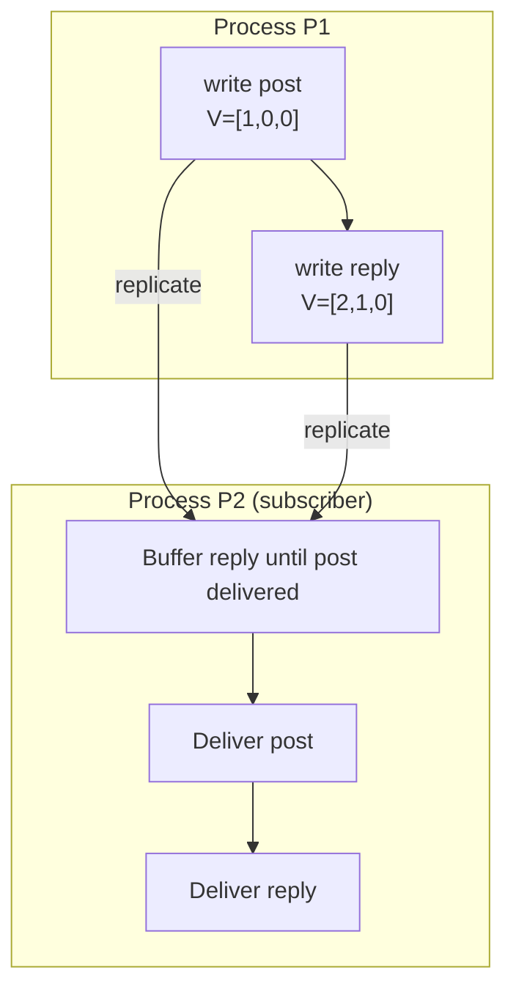
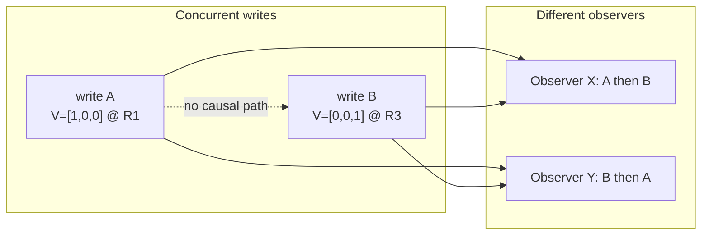
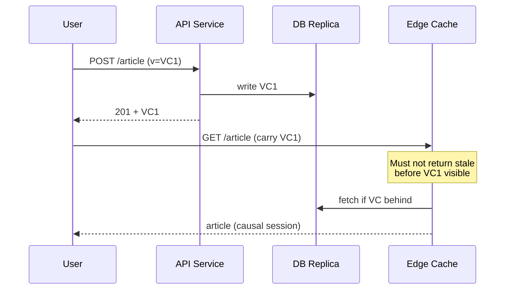

# Causal Consistency

## 1. Executive Summary

**Causal consistency** is a replication model that preserves the **happens-before** relation among operations: if operation A causally precedes operation B (A \(\rightarrow\) B), every process must observe A before B. Operations that are **concurrent** (neither causally precedes the other) may be observed in different orders by different clients—unlike **linearizability**, which imposes a single real-time total order on all operations.

Causal consistency sits in the **middle** of the consistency spectrum: stronger than **eventual consistency** (which does not guarantee causal order during convergence), weaker than **linearizability** (which also orders concurrent operations and respects real-time). Implementations typically attach **vector clocks** or **version vectors** to operations and enforce **causal delivery**—a message or write is visible only after all causally preceding operations are visible.

Systems such as COPS (Lloyd et al., 2011), Bayou, and many session-guarantee designs embody causal ideas. Kleppmann (*DDIA*) emphasizes causality for avoiding anomalies like "comment before post exists"; Herlihy & Wing's linearizability provides the formal ceiling causal consistency deliberately does not reach.

This chapter defines causal consistency, relates it to vector clocks (prerequisite), covers causal delivery and session guarantees, failure modes, performance tradeoffs, production patterns, and principal-level interview reasoning.

## 2. Why This Topic Matters

Many real-world workloads need **causality** without paying for **global linearizability**:

- Social: reply must not appear before parent post.
- Commerce: order confirmation after cart checkout event.
- Config rollout: feature flag enable after dependency deployed.
- Microservices: downstream event must not precede upstream cause unless explicitly out-of-order tolerant.

Principal interviews test whether you can:

- Define happens-before and map it to **client-visible order**.
- Explain how **vector clocks** enable causal delivery without a central sequencer for all traffic.
- Contrast causal with **sequential**, **linearizable**, and **eventual** models on the same scenario.
- Design **partition behavior**—causal systems are often AP but must not violate causal safety.

Confusing causal consistency with "eventual but slower" or "linearizable per user" produces over-built systems or subtle ordering bugs in event pipelines.

## 3. Problems Being Solved

| Problem | Eventual only | Causal consistency |
|---------|---------------|-------------------|
| Reply visible before post | Possible | Forbidden if reply causally depends on post |
| Read own write (cross replica) | Not guaranteed | Often composable with session routing + causal metadata |
| Cross-service chains | Reordering breaks invariants | Causal metadata propagates order |
| Concurrent edits same object | Siblings / LWW | Concurrent ops still unordered—conflicts remain |
| Global total order | Not provided | Not required—saves coordination |

Causal consistency solves **ordering along cause-effect chains** without serializing **independent** concurrent work.

## 4. Assumptions and System Model

Assume **asynchronous message passing**, **crash-stop** processes, and **static or epoch-managed** process/replica membership for vector metadata (see [vector clocks](/docs/time-ordering-and-coordination/vector-clocks)):

- **Operations** include reads and writes with attached causal metadata (vector clock or similar).
- **Happens-before** (\(\rightarrow\)): program order within a process; send \(\rightarrow\) receive; transitive closure.
- **Causal order:** If \(op_1 \rightarrow op_2\), no observer sees \(op_2\) without \(op_1\).
- **Concurrent operations:** If \(op_1 \parallel op_2\), different observers may order them differently.

**Safety:** No causal cycle violations in delivered histories.

**Liveness:** Causal delivery buffers may stall if a predecessor is lost—similar to vector clock delivery **liveness** issues.

**Scope:** Often **per object** or **per session**; cross-object causal consistency may require transactions or careful grouping.

## 5. Essential Terminology

| Term | Definition |
|------|------------|
| **Causal consistency** | All replicas respect happens-before ordering of operations. |
| **Happens-before (\(\rightarrow\))** | Lamport causal precedence among events. |
| **Concurrent (\(\parallel\))** | Neither operation causally precedes the other. |
| **Causal delivery** | Deliver operation only after all \(\rightarrow\) predecessors applied. |
| **Causal past** | Set of operations that causally precede a given operation. |
| **Version vector** | Per-replica counters on data for conflict detection (related algebra). |
| **Session guarantee** | Per-client ordering properties (read-your-writes, monotonic reads). |
| **PRAM consistency** | Per-process order preserved; weaker than causal in some formulations. |
| **COPS** | Don't-Reorder / causal+ consistency in geo-distributed KV (Lloyd et al.). |
| **Lamport clock** | Scalar; respects \(\rightarrow\) but cannot detect concurrency. |

**Mnemonic:** Causal = **respect cause**, not **total time**.

## 6. Core Mechanism

### Guarantee statement

For any operations \(op_1, op_2\): if \(op_1 \rightarrow op_2\), then every correct process observes \(op_1\) before \(op_2\) in its local history.

### Vector-clock-based causal delivery

Each operation carries vector \(V\). A replica delivers \(op\) with vector \(V_\{op\}\) only if for every operation \(op'\) in its causal past (known from stored state and buffers), \(op'\) has been delivered. Equivalently: deliver when \(V_\{stored\}\) dominates all predecessors of \(op\) per merge rules.



*Figure 1: Reply causally depends on post; subscriber buffers reply until post is delivered.*

### Concurrent operations remain unordered



*Figure 2: Concurrent operations may appear in different orders—allowed under causal consistency, forbidden under linearizability.*

### Session causal chain across services



*Figure 3: Session metadata (version/token) enforces read-your-writes compatible with causal order.*

## 7. Step-by-Step Walkthrough

**Scenario:** Microblog—post then reply; two readers on different replicas.

| Step | Actor | Action | Vector / note |
|------|-------|--------|---------------|
| 1 | User U @ P1 | Create post P | \(V_P = [1,0,0]\) |
| 2 | U @ P1 | Create reply R to P | Local after P → \(V_R = [2,1,0]\), \(V_P < V_R\) |
| 3 | Replica R2 | Receives R before P (network reorder) | **Buffer** R |
| 4 | R2 | Receives P | Deliver P |
| 5 | R2 | \(V_P\) dominated; release buffer | Deliver R |
| 6 | Reader on R2 | Timeline | P always before R |

**Concurrent case:** User V likes post P (concurrent with unrelated post Q on another shard). Readers may see (P, Q) or (Q, P)—**valid** under causal consistency.

**Cross-region (COPS-style):** Local fast write in region with dependency tracking; remote regions pull causal dependencies before exposing write—**implementation** trades latency for causal safety.

## 8. Invariants and Guarantees

| Property | Type | Statement |
|----------|------|-----------|
| **Causal order preservation** | Safety | \(op_1 \rightarrow op_2 \Rightarrow op_1\) observed before \(op_2\) everywhere |
| **Concurrency visibility** | Allowed variation | \(op_1 \parallel op_2\) may order either way per observer |
| **Real-time order** | **Not** guaranteed | Unlike linearizability |
| **Total order** | **Not** guaranteed | Independent ops unordered |
| **Delivery progress** | Liveness | Requires predecessors to arrive; loss stalls buffer |
| **Conflict freedom** | **Not** guaranteed | Concurrent writes still conflict |

**Relation to vector clocks (safety):** If \(e \rightarrow f\) then \(V(e) < V(f)\); delivery rules use this to prevent causal violations.

## 9. Failure Scenarios

### Scenario 1: Lost causal predecessor

**Setup:** Reply delivered; post message dropped permanently.

**Effect:** **Safety** violation if reply visible without post—or **liveness** stall if buffering forever.

**Mitigation:** Reliable channels, retries, TTL + dead-letter, idempotent replay with same vector.

### Scenario 2: Vector not propagated on async RPC retry

**Setup:** Downstream retry lacks causal metadata.

**Effect:** Child service processes effect before cause—**causal violation**.

**Mitigation:** OpenTelemetry baggage, middleware enforcement, contract tests.

### Scenario 3: Dynamic membership without epoch

**Setup:** Vector dimension mismatch after scale-out.

**Effect:** Incorrect compare → wrong delivery order.

**Mitigation:** Epoch prefix, dot clocks, reconfiguration protocol.

### Scenario 4: Causal metadata stripped at gateway

**Setup:** API gateway aggregates without forwarding version token.

**Effect:** Edge cache serves stale pre-cause state.

**Mitigation:** Session tokens, cache key includes min visible version.

### Scenario 5: False sense of global order

**Setup:** Team assumes causal = linearizable for inventory.

**Effect:** Concurrent decrements oversell—causal does not serialize concurrent ops.

**Mitigation:** Per-SKU linearizable counter or reservation protocol.

## 10. Performance Characteristics

| Aspect | Cost | Note |
|--------|------|------|
| Metadata per op | \(O(n)\) vector or bounded HLC | Smaller than global sequencer RTT for many workloads |
| Delivery buffer | Memory + delay | Waiting for predecessors |
| Cross-region | Dependency fetch (COPS) | Extra RTT for causal visibility |
| Hot causal chains | Serialization along chain | Independent ops still parallel |

Compared to linearizability: causal avoids **global** coordination for concurrent ops—better throughput when conflicts are rare along non-causal dimensions.

Compared to eventual: causal adds **metadata and buffering**—moderate overhead for fewer anomalies.

## 11. Scalability Limits

- **Vector size:** Full process vectors don't scale to thousands of nodes—use version vectors per object, HLC approximations, or partition-scoped causality.
- **Buffer depth:** High fan-in causal graphs increase buffer memory during reordering storms.
- **Cross-shard causality:** Events on different shards lack natural happens-before unless application adds cross-shard metadata—often **per-partition causal** only.
- **Global causal across all keys:** Approaches cost of coordination—defeats purpose.

**Sweet spot:** Session- or entity-scoped causal chains with modest replica count.

## 12. Operational Considerations

- **Propagate causal context** in every async boundary (queues, workflows, serverless).
- **Monitor buffer age** and stalled deliveries—causal systems stall like backpressure.
- **Test reordering** with fault injection; wall-clock tests miss causal bugs.
- **Document scope:** "Causal per user session" vs "global causal."
- **Upgrade path:** When causal insufficient, identify which ops need linearizable shard leader.

## 13. Security Considerations

- **Forged low vectors:** Client could try to skip waiting for predecessors—replicas must validate against stored state, not trust client metadata alone.
- **Causal ordering vs authorization:** Seeing cause before effect does not imply permission to see either—ACLs separate.
- **Dependency amplification:** Fetching causal past from untrusted peers—authenticate replication streams.

Treat causal metadata as **integrity-sensitive**; bind to authenticated replication or signed operation log.

## 14. Cost Considerations

- **Bandwidth:** Vector per message vs scalar eventual—FinOps at high QPS.
- **Engineering:** Harder than eventual; easier than global linearizability for many pipelines.
- **Support:** "Missing reply" bugs if causality broken—debugging requires distributed traces with parent links.
- **Infrastructure:** May still need AP replication; cost vs CP linearizable cluster.

Pay when **user-visible ordering bugs** exceed metadata cost.

## 15. Production Implementations

### COPS (Lloyd et al., 2011)

Geo-replicated KV with **causal+** consistency: fast local write, background fetch of dependencies before global visibility. Demonstrates **latency-consistency** tradeoff without full linearizability.

### Bayou (mobile / disconnected)

Weakly connected replicas with dependency checks and merge—early causal consistency in practice.

### Apache Kafka (per partition)

**Per-partition order** only—not cross-partition causal. Achieving cross-topic causality requires **partition key design** or explicit metadata—application responsibility.

### Facebook TAO / social graphs (public descriptions)

Social workloads often rely on **causal session** and dependency ordering for feed consistency—exact guarantees vary; verify primary sources for claims.

### OpenTelemetry traces

Span parent links encode causal structure for debugging—not a storage consistency model but operational parallel.

### Session guarantees in Cosmos DB, DynamoDB session tokens

Product-level **read-your-writes** and monotonic reads approximate causal session for one client—**implementation-specific**; read vendor docs.

**Distinction:** Formal causal consistency (paper spec) vs **marketing session** terms—map carefully in ADRs.

## 16. Alternatives and Tradeoffs

| Model | Orders concurrent ops? | Respects \(\rightarrow\)? | Coordination |
|-------|------------------------|---------------------------|--------------|
| Linearizability | Yes (total + real-time) | Yes | High |
| Causal consistency | No | Yes | Medium (metadata/buffer) |
| Sequential consistency | Yes (total, not real-time) | Implies per-process | Medium-high |
| Eventual | No guarantee during | No | Low |
| PRAM | Per-process only | Partial | Low |

**When causal fits:** Cause-effect chains dominate; concurrent independence acceptable; AP availability needed.

**When to strengthen:** Financial invariants on concurrent updates → linearizable or transactional.

**When to weaken:** Metrics, caches → eventual.

## 17. Common Misconceptions

| Misconception | Reality |
|---------------|---------|
| "Causal = linearizable per user" | Concurrent ops per user can still reorder if independent. |
| "Kafka gives causal consistency" | Per-partition only unless app designs keys/metadata. |
| "Vector clock attached = system is causally consistent" | Delivery and read paths must enforce it end-to-end. |
| "No conflicts under causal" | Concurrent writes still produce siblings. |
| "Stronger than sequential consistency" | Formulations differ; know your textbook's lattice. |
| "Causal fixes inventory" | Concurrent decrements need stronger serialization. |

## 18. Principal Architect Perspective

1. **Draw the happens-before graph** for your critical user journeys before picking a model.
2. **End-to-end causality:** One service with vector clocks fails if the bus drops metadata.
3. **Scope creep:** "Global causal" requests often mean linearizability—clarify stakeholders.
4. **Organizational:** Causal bugs are subtle—invest in tracing and reorder tests.
5. **Evolution:** Start causal on feeds; add linearizable pockets for money paths.

Principal signal: same scenario worked for **linearizable**, **causal**, and **eventual** with explicit anomaly comparison.

## 19. Architecture Review Exercise

**Scenario:** Order service emits `OrderPlaced`; payment, email, and analytics consumers on different Kafka topics/partitions.

**Review prompts:**

1. Can email arrive before payment processes order?
2. What partition keys preserve causal chain?
3. Cross-topic causality without global order?
4. Idempotency vs ordering—which fixes what?
5. Upgrade: transactional outbox + causal metadata?

**Expected findings:** Default Kafka does not cross-partition causal; need keyed routing, outbox, or vector metadata in headers.

## 20. Whiteboard Explanation

**90-second version:**

> "Causal consistency means if operation A caused B—same process order, or message flow—everyone sees A before B. Independent concurrent operations can look different to different clients. We implement it with vector clocks on operations and causal delivery: buffer anything that arrives early until its causal past is visible. It's stronger than eventual—you won't see a comment before its post—but weaker than linearizability, which also orders concurrent ops and real time. COPS showed fast geo writes with dependency fetch. Kleppmann's point: many apps need causality, not global total order. Principal architects enforce metadata on every async hop or causality breaks silently."

## 21. Interview Questions

1. **Define causal consistency.**
   - *Signals:* Preserves happens-before; concurrent unordered.

2. **How do vector clocks support causal delivery?**
   - *Signals:* Domination compare; buffer until predecessors delivered.

3. **Causal vs linearizability on same example?**
   - *Signals:* Concurrent pair ordered only under linearizability.

4. **Causal vs eventual?**
   - *Signals:* Eventual may violate \(\rightarrow\) during convergence.

5. **Does causal prevent write-write conflicts?**
   - *Signals:* No—concurrent writes still conflict.

6. **Kafka causal guarantees?**
   - *Signals:* Per-partition order; not cross-partition.

7. **What is causal delivery?**
   - *Signals:* Deliver op after all \(\rightarrow\) predecessors.

8. **Read-your-writes vs causal?**
   - *Signals:* Session guarantee; composable with causal replication.

9. **COPS approach?**
   - *Signals:* Local write fast; pull dependencies before global expose.

10. **Failure of lost predecessor message?**
    - *Signals:* Stall or violation—reliability required.

11. **Scalability limit of vector clocks?**
    - *Signals:* O(n) metadata; epochs, HLC, per-object vectors.

12. **Design causal social feed.**
    - *Signals:* Post before reply; shard by user; metadata on fanout.

13. **PRAM vs causal?**
    - *Signals:* PRAM per-process order; causal cross-process \(\rightarrow\).

14. **When upgrade from causal to linearizable?**
    - *Signals:* Concurrent ops need global agreement (inventory, auction).

## 22. Interview Follow-Ups

1. **Implement causal buffer without unbounded memory?**
   - *Signals:* Timeouts, max buffer, reliable log replay.

2. **Cross-datacenter causal without central leader?**
   - *Signals:* COPS-style dependency tracking, version vectors.

3. **Trace vs vector for causality in microservices?**
   - *Signals:* Traces debug; enforcement needs replicated metadata.

4. **Combine causal with CRDT?**
   - *Signals:* CRDT merge concurrent; causal orders delivery of ops.

5. **Prove violation: comment before post under eventual?**
   - *Signals:* Construct reordering history without causal delivery.

## 23. Strong Answer Example

**Question:** "Ensure users never see replies before the parent comment."

> "That's a **causal consistency** requirement on the comment thread object. Each write carries a **version vector** or vector clock; replicas **causally deliver** so a reply with \(V_R\) isn't visible until the parent with \(V_P\) where \(V_P < V_R\). If messages reorder on the network, buffer at the replica. Concurrent edits on different branches remain unordered—that's fine. I'd propagate the same metadata through the notification service async path—if push fires without parent context, we violate causality off the storage layer. For scale, scope vectors per thread not global cluster. If we also need global vote totals linearizable, that's a separate counter with stronger model. Kleppmann separates causality from total order—this case is causality only."

## 24. Weak Answer Example

**Question:** "Ensure users never see replies before the parent comment."

> "Use eventual consistency and sort by timestamp when displaying."

**Why weak:** Timestamps don't respect causality across nodes; eventual allows pre-parent visibility; no delivery rule or vector metadata.

## 25. Hands-On Exercise

**Exercise: Causal delivery simulator**

1. Three replicas; inject post then reply with vectors.
2. Deliver reply-first to one replica; verify buffering until post arrives.
3. Add concurrent comment on another branch; show two valid observer orders.
4. Strip vector on one message; demonstrate violation.
5. Optional: integrate with message queue simulator (single partition vs multi).

**Success criteria:** No observer history with reply before post; written explanation of concurrent case.

## 26. Knowledge Check

1. If \(op_1 \rightarrow op_2\), what must all observers see? *(op1 before op2.)*
2. Can concurrent ops order differently? *(Yes.)*
3. Vector rule on receive? *(Merge max, increment self—see vector clocks chapter.)*
4. Does causal imply linearizability? *(No.)*
5. Kafka partition guarantees? *(Order within partition only.)*
6. Lost predecessor effect? *(Buffer stall or safety violation.)*

## 27. Flashcards

| # | Front | Back |
|---|-------|------|
| 1 | Causal consistency | All observers respect happens-before order. |
| 2 | Concurrent ops | May appear in different orders per observer. |
| 3 | vs linearizability | Linearizable orders all ops + real-time; causal does not. |
| 4 | vs eventual | Eventual may violate \(\rightarrow\) before convergence. |
| 5 | Causal delivery | Buffer until causal past visible. |
| 6 | Vector clocks | Metadata: if \(e \rightarrow f\) then \(V(e) < V(f)\). |
| 7 | COPS | Geo KV; local write + dependency fetch. |
| 8 | Kafka caveat | Per-partition order; not cross-partition causal. |
| 9 | Session RYW | Client sees own writes; related session guarantee. |
| 10 | Not guaranteed | Total order, conflict freedom, real-time order. |
| 11 | Buffer stall | Predecessor lost/delayed blocks delivery (liveness). |
| 12 | Principal scope | Per-thread/session—not free global causal. |

## 28. Cheat Sheet

```
CAUSAL CONSISTENCY
  - If op1 → op2 (happens-before), all see op1 before op2
  - Concurrent ops: different orders OK
  - SAFETY on causality; not total order

IMPLEMENT
  - Vector clocks / version vectors on ops
  - Causal delivery: buffer early arrivals
  - Propagate metadata async boundaries

VS OTHERS
  - Stronger than eventual
  - Weaker than linearizability
  - Kafka: per-partition only

PITFALLS
  - Dropped predecessor
  - Missing metadata on retry
  - Assuming causal fixes inventory concurrency

REF: Kleppmann DDIA; Lloyd COPS; Herlihy-Wing (contrast)
```

## 29. Related Concepts

- [Vector Clocks](/docs/time-ordering-and-coordination/vector-clocks) — prerequisite metadata mechanism
- [Ordering of Events](/docs/time-ordering-and-coordination/ordering-of-events) — happens-before foundation
- [Linearizability](/docs/consistency/linearizability) — stronger real-time total order
- [Eventual Consistency](/docs/consistency/eventual-consistency) — weaker convergence model
- [Messaging and Streaming](/docs/messaging-and-streaming/overview) — partition ordering limits
- [Replication](/docs/replication/overview) — multi-master delivery policies

## 30. References

### Primary sources

- Ahamad, M., et al. (1995). ["Causal Memory: Definitions, Implementation, and Programming."](https://www.cs.cornell.edu/home/rvr/papers/causal-memory.pdf) *Distributed Computing* — early causal memory model.
- Lloyd, W., et al. (2011). ["Don't Be EVENTual: Causal Consistency for the Globally Distributed Cloud."](https://www.usenix.org/system/files/conference/atc11/atc11-final85.pdf) *USENIX ATC* — COPS system and causal+ consistency.
- Lamport, L. (1978). ["Time, Clocks, and the Ordering of Events in a Distributed System."](https://lamport.azurewebsites.net/pubs/time-clocks.pdf) — happens-before definition.
- Herlihy, M. P., & Wing, J. M. (1990). ["Linearizability: A Correctness Condition for Concurrent Objects."](https://cs.brown.edu/~mph/HerlihyW90/p90.html) — contrast with stronger model.

### Production and engineering

- Terry, D. B., et al. (1995). ["Managing Update Conflicts in Bayou, a Weakly Connected Replicated Storage System."](https://www2.cs.duke.edu/courses/common/compsci590/papers/bayou.pdf) *SOSP* — dependency checks in weak connectivity.
- Kleppmann, M. (2016). ["Causality is an important concept in distributed systems."](https://martin.kleppmann.com/2016/02/08/how-to-do-distributed-locking.html) — blog series on ordering and causality in *DDIA* context.

### Textbooks

- Martin Kleppmann, *Designing Data-Intensive Applications* (O'Reilly) — Chapters on causality, ordering, and consistency models.
- Herlihy, M., & Shavit, N. (2020). *The Art of Multiprocessor Programming* — consistency hierarchy for shared memory.

### Distinction

| Claim type | Source |
|------------|--------|
| Happens-before | Lamport (1978) |
| Causal consistency definition | Ahamad et al. (1995); text surveys |
| COPS causal+ | Lloyd et al. (2011) |
| Bayou dependencies | Terry et al. (1995) |
| Kafka ordering scope | Product/docs—per-partition |
| Session guarantee product claims | Vendor documentation—verify per service |
