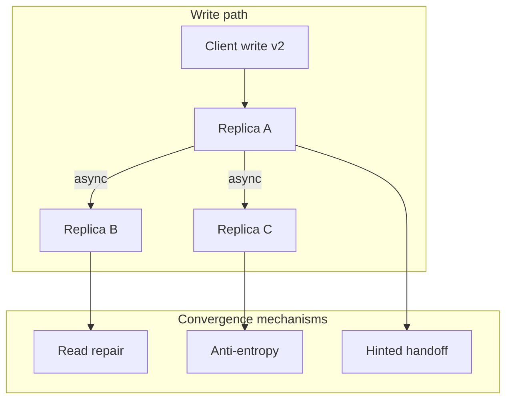
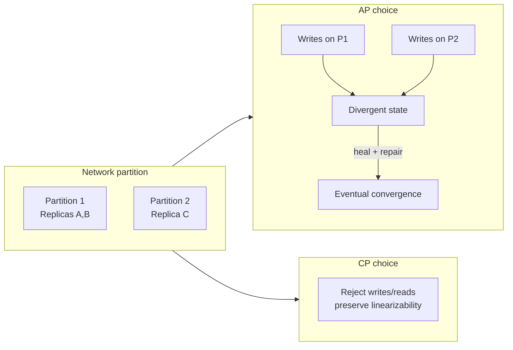
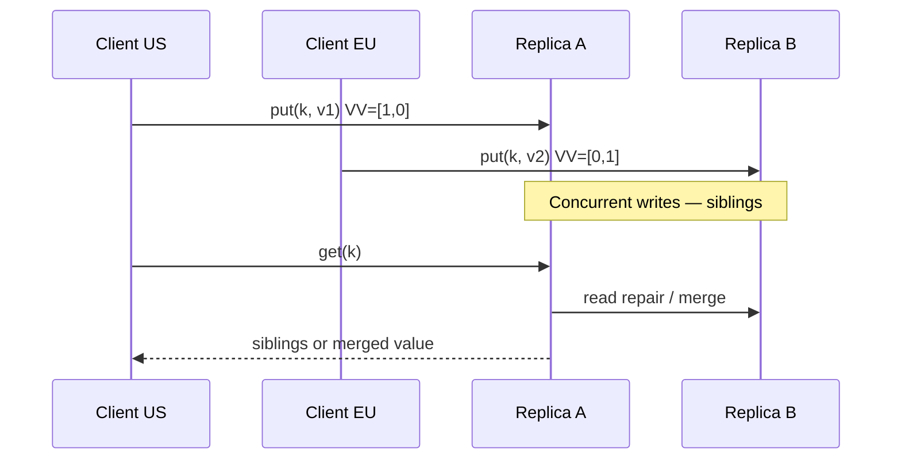

# Eventual Consistency

## 1. Executive Summary

**Eventual consistency** is a **liveness-oriented** guarantee for replicated systems: if updates stop and no new failures occur, all replicas will **converge** to the same value. During convergence, different clients may observe **divergent** states. Unlike linearizability, eventual consistency does not promise a single real-time order of operations—it promises that **safety of convergence** emerges when the system quiesces.

The model is central to the **CAP theorem** (Brewer conjecture; Gilbert & Lynch proof): under network partition, a system cannot simultaneously provide **linearizable consistency** and **availability** for all operations. Eventual consistency is the characteristic choice on the **availability** side of that tradeoff—Dynamo, Cassandra, Riak, DNS, and CDN caches all embody variants of "replicate now, reconcile later."

This chapter defines eventual consistency formally and informally, distinguishes **safety** (no permanent divergence after quiescence) from **temporary anomalies** (stale reads, write conflicts), covers convergence mechanisms (anti-entropy, read repair, gossip), operational and product implications, and principal-level decision criteria. Kleppmann (*DDIA*) and the Dynamo paper remain the canonical engineering references; Herlihy & Wing provide the contrast via linearizability as a stronger **safety** condition.

## 2. Why This Topic Matters

Most large-scale consumer and internet systems are **eventually consistent** somewhere in the stack—even when marketing claims "strong consistency" at one layer. Principal architects must:

- Explain **what users can observe** during inconsistency windows (stale reads, lost updates if misconfigured).
- Design **compensating mechanisms**: idempotency, version vectors, CRDTs, sagas, and explicit conflict resolution.
- Map **CAP** and **PACELC** to business requirements—not as slogans but as partition and latency behavior.
- Avoid treating eventual consistency as "no consistency"—it is a **defined guarantee** with convergence obligations.

Interview failures include: assuming eventual consistency fixes itself without protocols, confusing it with **causal consistency**, or unable to quantify **RPO/RTO** and **staleness SLOs** for AP systems.

## 3. Problems Being Solved

| Problem | Strong consistency pain | Eventual consistency approach |
|---------|-------------------------|-------------------------------|
| Regional partition | Unavailable writes/reads | Continue serving; reconcile later |
| Write latency at global scale | Quorum + commit wait | Local write ack; async replicate |
| Peak traffic spikes | Leader bottleneck | Multi-master, local replicas |
| Cache and CDN freshness | Expensive invalidation | TTL + eventual propagation |
| Offline/mobile clients | Cannot reach leader | Local queue; sync on reconnect |
| Cost of coordination | Expensive consensus clusters | Gossip, hinted handoff, repair |

Eventual consistency solves **availability and latency under partition and scale**. It does **not** solve **immediate global agreement**—applications must tolerate or mask interim divergence.

## 4. Assumptions and System Model

Assume **partial failure**, **asynchronous network**, and **crash-stop** replicas unless noted:

- **Replicas** hold copies of data; writes may be accepted at one or many replicas.
- **Replication** may be asynchronous; acknowledgments do not imply all replicas updated.
- **Quiescence:** No new writes for sufficient time; all pending replication and repair complete.
- **Convergence function:** After quiescence, all replicas return the same value for a given key (policy-dependent: last-writer-wins, merge, CRDT state).

**CAP framing (Gilbert & Lynch):** In a partition, **CP** systems sacrifice availability for linearizable behavior; **AP** systems remain available for operations but sacrifice strong consistency—typically eventual consistency with conflict handling.

**Not assumed:** Automatic conflict-free semantics without application or datatype support; bounded staleness unless **explicitly** added (e.g., session guarantees, CRDTs).

## 5. Essential Terminology

| Term | Definition |
|------|------------|
| **Eventual consistency** | If no new updates, all replicas eventually agree on value. |
| **Staleness** | Read returns older value than another replica or than a prior acknowledged write. |
| **Convergence** | Process by which replicas reach identical state. |
| **Anti-entropy** | Background comparison and repair between replicas (Merkle trees, full scans). |
| **Read repair** | Repair divergent replicas during read path when versions differ. |
| **Hinted handoff** | Temporary redirect of writes when replica down; replay on recovery (Dynamo). |
| **Sibling / conflict** | Concurrent versions detected via vector clocks; require merge. |
| **LWW (last-writer-wins)** | Resolve conflicts by timestamp—**implementation choice**, can lose data. |
| **AP system** | Available + Partition-tolerant; typically eventual consistency. |
| **PACELC** | If Partition: A vs C; Else: Latency vs Consistency (Abadi, 2012). |
| **Read-your-writes** | Session guarantee stronger than pure eventual—client sees own writes. |

**Mnemonic:** Eventual = **eventually the same**, not **always the same now**.

## 6. Core Mechanism

### Informal guarantee

For each data item:

1. Replicas may diverge after concurrent or partitioned writes.
2. Replication and repair propagate updates.
3. When updates cease and repairs complete, all replicas return identical content per the system's **resolution policy**.

### Convergence pathways



*Figure 1: Write accepted at one replica; async replication plus repair paths drive eventual convergence.*

### CAP partition behavior



*Figure 2: Under partition, AP systems accept writes on both sides; convergence required after heal. CP systems reject operations.*

### Version metadata and conflicts



*Figure 3: Concurrent writes create siblings; eventual consistency requires a merge policy—not silent data loss.*

## 7. Step-by-Step Walkthrough

**Scenario:** Dynamo-style shopping cart across three nodes (N=3, W=1, R=1 for availability).

| Step | Event | State | Client observation |
|------|-------|-------|------------------|
| 1 | Client writes cart to N1 | N1 has v1; N2,N3 stale | Write ack fast |
| 2 | Client reads from N2 | N2 stale | **Stale read**—empty cart |
| 3 | Read repair triggered | N2 updated from N1 | — |
| 4 | Client re-reads N2 | v1 visible | Converged for this key |
| 5 | Partition isolates N3 | N3 receives divergent write v2 | **Divergence** |
| 6 | Partition heals | Anti-entropy compares VV | Siblings if concurrent |
| 7 | Application merge | Union cart policy | **Convergence** with semantics |

**Insight:** Step 2 is **not a violation** of eventual consistency—it is expected before convergence. Product must handle staleness (UI refresh, versioning) or tighten W/R (higher latency, less availability).

## 8. Invariants and Guarantees

| Property | Type | Statement |
|----------|------|-----------|
| **Eventual convergence** | Safety (asymptotic) | Quiescent system → all replicas agree |
| **Availability during partition** | Liveness (AP) | Some operations complete despite partition |
| **Immediate consistency** | **Not** guaranteed | Stale reads possible |
| **Conflict freedom** | **Not** guaranteed | Concurrent writes need policy |
| **Durability** | Separate dimension | Depends on W, fsync, quorum ack |
| **Monotonicity** | Optional session guarantee | Not inherent to eventual |

**Safety vs liveness:** Eventual consistency is a **weak safety** claim about the **limit** of execution, not about intermediate states. **Lost updates** are safety violations of application invariants, not of eventual consistency itself—often caused by LWW without proper versioning.

## 9. Failure Scenarios

### Scenario 1: Permanent divergence without repair

**Setup:** Replica permanently lost; no replication factor replacement; W=1.

**Effect:** **Safety** violation of convergence—quiescent system still disagrees.

**Mitigation:** Replication factor, replacement, monitoring replica health, W>1 when needed.

### Scenario 2: LWW clock skew

**Setup:** Two regions write same key; EU clock ahead of US.

**Effect:** EU write wins always—**data loss** of US writes.

**Mitigation:** Logical clocks, version vectors, CRDTs, avoid wall-clock LWW across regions.

### Scenario 3: Sibling explosion

**Setup:** High write concurrency; vector clocks grow; no merge.

**Effect:** Reads return growing sibling lists; latency and storage blow up.

**Mitigation:** Prune policy, CRDT migration, partition keys to reduce conflicts.

### Scenario 4: Read repair amplification

**Setup:** Hot key; every read triggers cross-replica repair.

**Effect:** **Liveness** degradation—repair storm, latency spikes.

**Mitigation:** Probabilistic read repair, dedicated anti-entropy, raise R selectively.

### Scenario 5: "Eventually" never arrives

**Setup:** Continuous writes; backlog; under-provisioned replication.

**Effect:** System never quiesces; replicas chronically stale.

**Mitigation:** Capacity planning, lag SLOs, backpressure.

## 10. Performance Characteristics

| Dimension | Eventual (AP) | Strong (CP) |
|-----------|---------------|-------------|
| Write latency | Often local/one replica | Quorum + leader RTT |
| Read latency | Local replica | Leader or sync read |
| Throughput | High multi-master | Leader bounded |
| Tail latency | Repair spikes | Consensus tails |
| Partition behavior | Serves requests | Errors/timeouts |

Qualitative: eventual consistency optimizes **normal-case latency and availability**; pays **complexity and anomaly cost** in application layer. Do not cite universal staleness bounds without measured replication lag.

## 11. Scalability Limits

- **Conflict rate:** Scales inversely with merge complexity—hot keys don't scale with naive multi-master.
- **Metadata:** Vector clocks O(replicas) per object—bounds sibling detection cost.
- **Repair bandwidth:** Anti-entropy full scans don't scale to petabytes without incremental/Merkle approaches.
- **Cognitive scale:** Teams must reason about anomalies—organizational limit.

**When eventual consistency scales well:** Read-heavy, low conflict, tolerate staleness (social likes, view counts with approximation).

**When it struggles:** Financial balances, inventory without reservation, global uniqueness constraints.

## 12. Operational Considerations

- **Define staleness SLOs:** p99 replication lag, not just "eventual."
- **Monitor:** Replica lag, repair rate, sibling count, hinted handoff queue depth.
- **Runbooks:** Partition heal procedures; conflict merge escalation; replica replacement.
- **Client contracts:** Document AP behavior; retries with idempotency keys.
- **Chaos testing:** Partition tests before production; verify convergence time bounds empirically.

## 13. Security Considerations

- **Conflict injection:** Attacker writes divergent versions on partitioned replica—merge policy must not privilege attacker (e.g., unsigned LWW).
- **Stale read information leakage:** Low-security replica in wrong region—**consistency interacts with data residency**.
- **Repair paths:** Anti-entropy must authenticate peers; otherwise poisoned state spreads.
- **Availability vs abuse:** AP systems stay up under DDoS—rate limiting still required.

Eventual consistency does not weaken **authentication**; it complicates **integrity** during divergence windows.

## 14. Cost Considerations

- **Infrastructure:** More replicas, cross-region bandwidth for repair vs fewer strongly consistent clusters.
- **Engineering:** CRDT design, merge UX, testing concurrent histories—higher than "single primary SQL."
- **Incident cost:** Subtle bugs (stale config rollout) expensive to debug without version metadata.
- **Revenue:** Availability during partition may outweigh temporary inconsistency for some products.

**Decision criterion:** Choose eventual when **downtime cost** and **latency SLO** dominate **immediate global correctness**.

## 15. Production Implementations

### Amazon Dynamo (2007)

Quorum-configurable N, R, W; vector clocks; hinted handoff; read repair—**canonical AP design**. DeCandia et al. explicitly trade consistency for availability. Modern DynamoDB differs—**product evolution**; read AWS docs for current models.

### Apache Cassandra

Tunable consistency per query (`ONE`, `QUORUM`, etc.); eventual by default at low levels; LWW on cells unless lightweight transactions (Paxos)—**different mechanism**, higher cost.

### Riak

Vector clocks and siblings; operational lessons on sibling proliferation informed later designs.

### DNS and CDNs

Extreme eventual consistency—TTL-driven; global convergence on the order of minutes acceptable.

### CouchDB / Cloudant

Multi-master replication with revision trees; conflicts explicit in document `_rev`.

**Distinction:** Implementation choices (W=1 vs W=quorum) change **durability** and **staleness** without changing the broad AP label.

## 16. Alternatives and Tradeoffs

| Model | Partition behavior | Client anomalies | Complexity |
|-------|-------------------|------------------|------------|
| Eventual | Available | Stale, conflicts | Repair + merge |
| Causal | Available (often) | No causal violations | Vector metadata |
| Linearizable | Unavailable or degraded | None (scoped) | Consensus |
| Strong session | Available with routing | Reduced for one client | Sticky + versions |
| CRDT | Available | Algebraic merge | Datatype design |

**PACELC:** Without partition, still choose latency vs consistency (e.g., Cassandra `LOCAL_ONE` vs `QUORUM`).

## 17. Common Misconceptions

| Misconception | Reality |
|---------------|---------|
| "Eventual = inconsistent forever" | Converges when quiescent if repair works. |
| "No consistency" | Weak but defined limit behavior. |
| "CAP means pick 2 of 3 always" | Partition-specific tradeoff; normal case differs. |
| "Read repair fixes everything synchronously" | Probabilistic; may lag. |
| "AP can't lose data" | W=1, LWW, and partitions can lose or hide writes. |
| "Same as causal consistency" | Causal is strictly stronger on happens-before. |

## 18. Principal Architect Perspective

1. **Quantify "eventual":** Minutes vs milliseconds changes architecture acceptance.
2. **Own merge semantics:** Infrastructure can't guess business merge for cart, calendar, or inventory.
3. **Partition drills:** AP value only if you stay up **safely enough**—define "safely."
4. **Educate product:** Users may see stale UI—design feedback loops.
5. **Layer guarantees:** CDN eventual + DB strong is valid—state each layer's model.

Executives hear "eventual" as "broken." Translate to **availability during failure** and **convergence SLO**.

**Convergence budgeting:** Treat replication lag like a queue with a service-level objective. Measure p50/p99 lag per replica set; during incidents, lag spikes are often the first sign that "eventual" is stretching into user-visible minutes. Capacity plans should include repair bandwidth, not only write throughput—anti-entropy and read repair compete for the same cross-AZ links as foreground traffic. Kleppmann (*DDIA*) recommends making staleness and conflict behavior **explicit in API contracts** so client teams implement retries, versioning, and UI refresh against documented bounds rather than assuming instantaneous global agreement.

## 19. Architecture Review Exercise

**Scenario:** Multi-region user profile store; W=1, R=1; profile includes email (unique) and avatar URL.

**Review prompts:**

1. Can two regions register same email during partition?
2. Is avatar staleness acceptable? Email uniqueness?
3. What W/R for email vs avatar in same document?
4. Idempotency for profile updates?
5. Migration path to stronger consistency for email only?

**Expected findings:** Unique constraints need coordination; split document or regional authority; eventual alone insufficient for uniqueness without extra protocol.

## 20. Whiteboard Explanation

**90-second version:**

> "Eventual consistency means if we stop writing and let replication finish, all replicas agree. Until then, reads can be stale and concurrent writes can conflict. It's the AP side of CAP—stay available during partition, reconcile after. Dynamo did this with quorums you tune: low W and R for speed, higher for less staleness. You need version vectors or similar to detect conflicts, read repair and anti-entropy to converge, and application merge policy—LWW is easy but loses data. Kleppmann stresses it's not absence of consistency but a guarantee about the limit. Principal architects pick it when downtime hurts more than temporary wrong reads, and invest in idempotency and conflict handling."

## 21. Interview Questions

1. **Define eventual consistency.**
   - *Signals:* Quiescence, convergence, interim divergence allowed.

2. **CAP theorem—what is sacrificed in AP?**
   - *Signals:* Linearizable consistency during partition; availability retained.

3. **How does Dynamo converge?**
   - *Signals:* Read repair, anti-entropy, hinted handoff, quorums.

4. **What is a sibling?**
   - *Signals:* Concurrent versions; vector clock compare.

5. **Risks of W=1, R=1?**
   - *Signals:* Stale reads, durability loss on node failure.

6. **Eventual vs causal consistency?**
   - *Signals:* Causal preserves happens-before; eventual does not.

7. **Can eventual consistency lose writes?**
   - *Signals:* Yes—LWW, partition, no durable quorum.

8. **What is read repair?**
   - *Signals:* Fix replicas on read when versions differ.

9. **PACELC extension?**
   - *Signals:* Latency vs consistency without partition.

10. **How do CRDTs relate?**
    - *Signals:* Stronger convergence semantics for datatypes; still often AP.

11. **Design idempotency for eventual consumers.**
    - *Signals:* Dedup keys, version checks, at-least-once delivery.

12. **Staleness SLO for AP system?**
    - *Signals:* Lag metrics, p99 bound, client refresh strategy.

13. **When reject eventual consistency?**
    - *Signals:* Invariants need immediate global agreement (unique, balance).

14. **Hinted handoff purpose?**
    - *Signals:* Write availability when replica down; replay later.

## 22. Interview Follow-Ups

1. **Measure convergence time after partition heal?**
   - *Signals:* Lag dashboards, chaos experiments, key sampling.

2. **Email uniqueness under AP?**
   - *Signals:* Central authority, consensus per email, or accept risk.

3. **Compare Dynamo quorums to Cassandra consistency levels.**
   - *Signals:* Tunable R/W; LOCAL vs GLOBAL scope.

4. **Executive wants both CAP C and A?**
   - *Signals:* Impossible under partition; scope reduction, mitigation.

5. **Migrate AP cart to stronger model?**
   - *Signals:* Per-user leader, CRDT, or CP metadata service.

## 23. Strong Answer Example

**Question:** "Design a globally available user settings service."

> "I'd default **AP** with per-user document keyed by user ID, version vector on each document, and W/R tunable per use case—`QUORUM` for settings that affect billing, `ONE` for theme preference if product accepts staleness. During partition, both sides accept writes; on heal, vector compare detects concurrent updates and we merge with field-level policies—LWW on timestamp only for non-critical fields. Idempotent PUT with client version. Monitor replication lag p99; alert above 30s. Read repair probabilistically to limit amplification. For password changes, I'd route to a **CP** sub-service with consensus—don't eventual-consistency security-critical fields. Reference Dynamo's conflict handling and Kleppmann's guidance on explicit merge semantics."

## 24. Weak Answer Example

**Question:** "Design a globally available user settings service."

> "Use Cassandra with eventual consistency. It'll sync eventually. Add caching for speed."

**Why weak:** No W/R tuning, no conflict detection, no field-level policies, no security exception, no staleness SLO, hand-waves caching worsening staleness.

## 25. Hands-On Exercise

**Lab:** `labs/lab-005-eventual-consistency/` — convergence simulator on **`:8099`**

```bash
cd labs/lab-005-eventual-consistency
python3 -m venv .venv && source .venv/bin/activate
pip install -r requirements.txt
pytest tests/ -v
docker compose -p lab005 -f docker/docker-compose.yml up --build -d
chmod +x scripts/demo_consistency.sh && ./scripts/demo_consistency.sh
```

| Step | Endpoint | What happens |
|------|----------|--------------|
| 1 | `POST /v1/keys/{key}` | W=1 write on chosen replica |
| 2 | `GET /v1/keys/{key}?replica=r2` | Stale read before async replication |
| 3 | `POST /v1/replicate/run` | Background anti-entropy push |
| 4 | `POST /v1/chaos/partition` | Isolate replica during writes |
| 5 | `POST /v1/keys/{key}/repair` | Read repair converges lagging replica |

**Swagger:** http://localhost:8099/docs

### Engineer guide: how the local stack works

1. **3 replicas** — async replication with configurable delay; W=1 fast path, R=1 default read.
2. **Version tokens** — each write increments version; reads return replica-local value (may be stale).
3. **Anti-entropy worker** — `POST /v1/replicate/run` pushes pending updates to peers.
4. **Partition chaos** — isolate a replica; observe divergent reads until heal + repair.
5. **Read repair** — on-demand push of latest version without incrementing write version.

Pairs with [Amazon DynamoDB Consistency](/docs/real-world-scenarios/amazon-dynamodb-eventual-consistency) and [Lab 002 vector clocks](/docs/time-ordering-and-coordination/vector-clocks#25-hands-on-exercise).

### Build-from-scratch exercise (optional)

1. Simulate 3 replicas, async replication delay, W=1, R=1.
2. Inject concurrent writes during partition; log divergent reads.
3. Implement read repair on read; measure time to convergence after heal.
4. Add LWW vs vector sibling merge; compare data loss cases.
5. Write product-facing doc: what users may see for 60s after edit.

**Success criteria:** Demonstrate stale read before repair; document one scenario where LWW loses a write.

## 26. Knowledge Check

1. What triggers convergence in theory? *(Quiescence—no new writes, repair complete.)*
2. AP during partition sacrifices what? *(Strong/linearizable consistency.)*
3. Does read repair run on every read in Dynamo? *(Design choice—often probabilistic.)*
4. Sibling detection mechanism? *(Vector/version clock concurrent compare.)*
5. Is W=1 durable? *(Not necessarily—depends on failure before replication.)*
6. PACELC "else" branch? *(Latency vs consistency without partition.)*

## 27. Flashcards

| # | Front | Back |
|---|-------|------|
| 1 | Eventual consistency | Quiescent replicas converge to same value. |
| 2 | CAP (partition) | Linearizability vs availability—not both. |
| 3 | AP system | Available under partition; typically eventual. |
| 4 | Staleness | Read older than another replica or prior write. |
| 5 | Read repair | Update lagging replicas during read. |
| 6 | Anti-entropy | Background replica reconciliation. |
| 7 | Hinted handoff | Buffer writes for temporarily down replica. |
| 8 | Sibling | Concurrent conflicting versions. |
| 9 | LWW risk | Clock skew → silent data loss. |
| 10 | PACELC | Partition: A/C; else: Latency/Consistency. |
| 11 | Dynamo | N,R,W tunable quorums; vector clocks. |
| 12 | Not guaranteed | Immediate consistency, conflict freedom. |

## 28. Cheat Sheet

```
EVENTUAL CONSISTENCY
  - Stop writes + repair → replicas agree
  - During: stale reads, conflicts OK (by model)
  - AP / CAP availability side

CONVERGE VIA
  - Async replication
  - Read repair (often probabilistic)
  - Anti-entropy / gossip
  - Hinted handoff

CONFLICTS
  - Version vectors → siblings
  - LWW (risky), app merge, CRDTs

TUNE
  - N, R, W quorums (Dynamo)
  - Cassandra CL per query

INTERVIEW
  - Not "no consistency"
  - vs causal, vs linearizable
  - Kleppmann: define merge policy
```

## 29. Related Concepts

- [CAP Theorem](/docs/consistency/cap-theorem) — prerequisite partition tradeoff framing
- [Linearizability](/docs/consistency/linearizability) — stronger alternative (CP)
- [Causal Consistency](/docs/consistency/causal-consistency) — middle ground preserving happens-before
- [Vector Clocks](/docs/time-ordering-and-coordination/vector-clocks) — conflict detection metadata
- [Replication](/docs/replication/overview) — sync vs async paths
- [Distributed Databases](/docs/distributed-databases/overview) — Dynamo-family systems

## 30. References

### Primary sources

- Gilbert, S., & Lynch, N. (2002). ["Brewer's Conjecture and the Feasibility of Consistent, Available, Partition-Tolerant Web Services."](https://www.comp.nus.edu.sg/~gilbert/pubs/brewersConjecture.pdf) *SIGACT News* — formal CAP proof using linearizability.
- DeCandia, G., et al. (2007). ["Dynamo: Amazon's Highly Available Key-value Store."](https://www.allthingsdistributed.com/files/amazon-dynamo-sosp2007.pdf) *SOSP* — eventual consistency, quorums, vector clocks, read repair.
- Herlihy, M. P., & Wing, J. M. (1990). ["Linearizability: A Correctness Condition for Concurrent Objects."](https://cs.brown.edu/~mph/HerlihyW90/p90.html) *ACM TOPLAS* — contrast model for strong consistency.

### Production and engineering

- Abadi, D. (2012). ["Consistency Tradeoffs in Modern Distributed Database Design."](https://www.computer.org/cms/Computer.org/ComputingNow/issues/2012/02/EXP_02Feb2012_Abadi.pdf) *IEEE Computer* — PACELC formulation.
- Vogels, W. (2009). ["Eventually Consistent."](https://www.allthingsdistributed.com/2008/12/eventually_consistent.html) — operational perspective (blog; anecdotal, not formal proof).

### Textbooks

- Martin Kleppmann, *Designing Data-Intensive Applications* (O'Reilly) — Chapters 5, 7, 9 on replication, consistency, and conflict resolution.
- Herlihy, M., & Shavit, N. (2020). *The Art of Multiprocessor Programming* — consistency spectrum context for concurrent objects.

### Distinction

| Claim type | Source |
|------------|--------|
| CAP partition tradeoff | Gilbert & Lynch (2002) |
| Dynamo mechanisms | DeCandia et al. (2007) |
| PACELC | Abadi (2012) |
| Linearizability contrast | Herlihy & Wing (1990) |
| Convergence time in production | Operational measurement—no universal bound |
