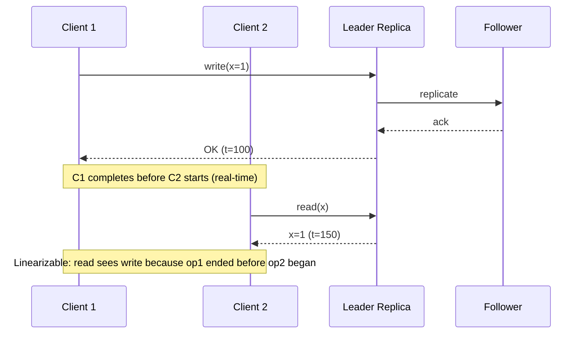
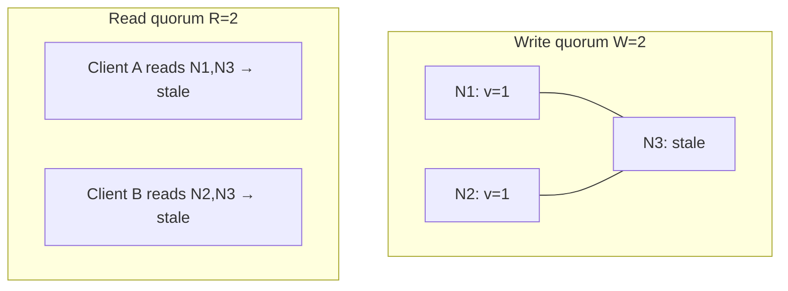
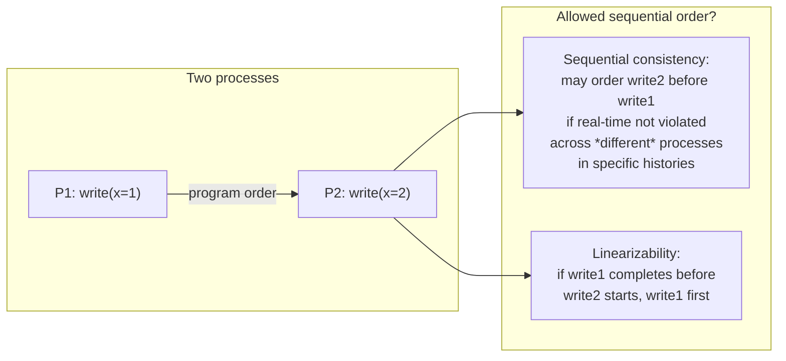

# Linearizability

## 1. Executive Summary

**Linearizability** (also called **atomic consistency** or **strong consistency** in product language) is the strongest practical single-object consistency model for replicated registers and data structures. Informally: every operation appears to take effect instantaneously at some point between its invocation and response, and all operations respect a single **total order** that is **compatible with real time**—if operation A completes before operation B begins (in wall-clock terms at the client), then A must appear before B in the global order.

Herlihy and Wing (1990) formalized linearizability as a **safety** property on concurrent histories: there exists a sequential history equivalent to the concurrent one that respects the specification of the object and preserves the real-time precedence order among operations. Linearizability does **not** guarantee **liveness** by itself—a system can be linearizable yet unavailable during partitions if it refuses to serve requests rather than violate the model.

This chapter covers the formal definition, comparison with sequential consistency and serializability, implementation patterns (single leader, quorum reads/writes, fencing), production systems (etcd, ZooKeeper, Spanner's external consistency), failure modes, performance costs, and principal-level interview framing. Understanding linearizability is prerequisite to evaluating CAP tradeoffs, designing leader election, and explaining why "strong consistency" marketing claims require scope and object boundaries.

## 2. Why This Topic Matters

Principal and distinguished engineer interviews use linearizability as a **precision test**:

- Can you distinguish **linearizability** from **sequential consistency** (no real-time constraint)?
- Can you map **single-register linearizability** to **transactional external consistency** (Spanner) without conflating them?
- Do you know when **quorum reads** break linearizability unless augmented (e.g., with leader reads or sync replication)?
- Can you explain **why** linearizability is expensive and **what** weaker models buy you?

Production systems rarely offer global linearizability across all objects at planetary scale. Architects who promise it without naming **scope** (per key, per shard, per transaction) design incidents: stale reads after failover, double leadership, inventory oversell, and "impossible" client observations that violate user mental models of "one copy of the data."

Linearizability is the default mental model for **coordination services** (locks, leader election, metadata) and for **financial correctness** when scoped to a single entity. Misapplying it to every read path in a geo-replicated catalog destroys availability and latency budgets.

## 3. Problems Being Solved

| Problem | Without linearizability | With linearizability (scoped) |
|---------|-------------------------|--------------------------------|
| Leader election | Split brain; two primaries | At most one leader visible per epoch |
| Distributed lock | Two holders believe they own the lock | Mutual exclusion as if centralized |
| Read-after-write (same client) | May read stale replica | Can be composed with session guarantees |
| Compare-and-swap / fencing | Lost updates, zombie writers | CAS appears atomic globally |
| Inventory / balance | Oversell, negative balance windows | Operations serialize as if one copy |
| Configuration metadata | Divergent views across nodes | All see same sequence of updates |

Linearizability solves **what order did operations take effect in** for a defined object or service. It does **not** solve cross-object transactions unless the system provides a stronger **atomic** or **serializable** layer on top.

## 4. Assumptions and System Model

Assume the standard **asynchronous network** model with **crash-stop** or **crash-recovery** processes unless stated otherwise:

- **Clients** invoke **operations** on a shared object (register, map entry, coordination znode). Each invocation has a start and completion time in **real time**.
- **Servers** (replicas) process operations; replication may be primary-backup, multi-Paxos, or quorum-based.
- **Real-time precedence:** If operation \(op_1\) completes before \(op_2\) starts (at clients), then \(op_1\) must precede \(op_2\) in the linearization order.
- **Total order on operations** on the object: every pair of operations is ordered.
- **Correctness** relative to the **sequential specification** of the object type (e.g., a register returns the value of the latest write in the order).

**Not assumed:** Synchronized clocks (except when discussing implementations like TrueTime that use clock **bounds** as an implementation technique). Byzantine failures unless discussing BFT variants.

**Scope is critical:** Linearizability is defined **per object** (or per register). A system linearizable for key \(K\) may be non-linearizable for key \(K'\) or for multi-key reads without transactional coordination.

## 5. Essential Terminology

| Term | Definition |
|------|------------|
| **Linearization point** | The instant between invocation and response where an operation appears to take effect atomically. |
| **History** | A concurrent execution recording invocations, responses, and real-time intervals. |
| **Sequential history** | Operations arranged in a total order with no overlap. |
| **Equivalent histories** | Same operations with matching responses; order may differ. |
| **Real-time order** | \(op_1 \rightarrow_\{rt\} op_2\) if \(op_1\) completes before \(op_2\) starts. |
| **Linearizable history** | Equivalent to some sequential history that respects the object's spec **and** real-time order. |
| **Sequential consistency** | Total order respecting **program order** per process only—not real-time across processes. |
| **Serializability** | Transactional analog: equivalent to some serial execution of transactions (database isolation). |
| **External consistency** | Spanner term: transactions appear in an order consistent with real-time precedence (related, multi-object). |
| **Stale read** | Read that returns a value older than one already acknowledged by a completed write—violates linearizability if on same object. |
| **Fencing token** | Monotonic token from lock service; storage rejects writes with stale tokens. |

**Mnemonic:** Linearizable = **one line in time** that respects **wall-clock overlap** at clients, not just per-client program order.

## 6. Core Mechanism

### Formal intuition (Herlihy & Wing)

Given a concurrent history \(H\):

1. Identify a **linearization point** for each completed operation—somewhere between its invocation and response.
2. Sort operations by these points to obtain a sequential history \(S\).
3. \(H\) is **linearizable** if \(S\) is valid for the object type and if \(op_1 \rightarrow_\{rt\} op_2\) implies \(op_1\) before \(op_2\) in \(S\).

### Implementation patterns

| Pattern | Mechanism | Linearizable when |
|---------|-----------|-------------------|
| Single leader | All ops routed to one writer | Leader is sole serialization point |
| Consensus log (Raft, Multi-Paxos) | Total order of commands | Reads go through leader or sync follower |
| Quorum write + quorum read | \(W + R > N\) | **Only if** read contacts latest write (often requires leader or sync) |
| Lease + fencing | Time-bound leadership + token on writes | Fencing prevents zombie writes |
| TrueTime + commit wait | Bounded clock uncertainty | External consistency across transactions (Spanner) |



*Figure 1: Single-leader linearizable read after write. Real-time precedence forces the read to return 1.*

### Non-linearizable quorum read (classic pitfall)



*Figure 2: With N=3, W=2, R=2, asynchronous replication can return stale values on quorum reads unless reads are coordinated (leader, lease, or read repair with sync).*

### Linearization vs sequential consistency



*Figure 3: Sequential consistency respects per-process order; linearizability adds cross-client real-time constraint.*

## 7. Step-by-Step Walkthrough

**Scenario:** Distributed lock service backed by etcd (Raft).

| Step | Actor | Action | Linearization note |
|------|-------|--------|-------------------|
| 1 | Client A | `create /lock` (CAS) | Proposal appended to Raft log |
| 2 | Leader | Replicate to majority | Commit index advanced |
| 3 | Client A | Receives success | Lock held; linearization point at commit |
| 4 | Client B | `create /lock` | Fails—key exists |
| 5 | Client A | Writes to DB with **fencing token** \(t=42\) | Storage accepts |
| 6 | A pauses (GC) | Lease expires | — |
| 7 | Client C | Acquires lock, token \(t=43\) | New leader epoch |
| 8 | A resumes | Write with \(t=42\) | **Rejected** by storage—safety preserved |

**Walkthrough insight:** Linearizability on the lock object does not automatically protect downstream storage. **Fencing tokens** connect linearizable coordination to external systems (Kleppmann, *DDIA*; Martin Kleppmann's analysis of lease problems).

**Read path walkthrough (Raft):** Client issues linearizable read via `read_index` or lease read: leader confirms it still holds leadership, then reads state machine. Skipping this step allows stale reads after partition heal—**safety** violation.

## 8. Invariants and Guarantees

| Property | Type | Statement |
|----------|------|-----------|
| **Atomicity of effect** | Safety | Each operation appears instantaneous at its linearization point |
| **Real-time respect** | Safety | \(op_1 \rightarrow_\{rt\} op_2 \Rightarrow op_1\) before \(op_2\) in linearization order |
| **Sequential spec** | Safety | Linearization order satisfies register/lock/map sequential semantics |
| **Total order** | Safety | All operations on the object are comparable |
| **Availability** | Liveness | **Not** implied—CP systems may reject ops during partition |
| **Bounded latency** | Liveness | **Not** implied—consensus may delay responses |

**Happens-before connection:** If clients communicate only through the linearizable object, linearizability ensures observations align with a single sequential story. Cross-object causal chains require **causal consistency** or **transactions**.

## 9. Failure Scenarios

### Scenario 1: Split brain without fencing

**Setup:** Primary and stale primary both serve writes after partition.

**Effect:** **Safety** violation—two linearization orders appear to different clients; register violates sequential spec.

**Mitigation:** Quorum writes, epoch numbers, fencing tokens, STONITH.

### Scenario 2: Stale quorum read

**Setup:** Cassandra-style `QUORUM` read from replicas not caught up after write.

**Effect:** Client observes pre-write value after write acknowledged—**not linearizable**.

**Mitigation:** `SERIAL`/`LOCAL_SERIAL`, leader reads, or accept eventual consistency explicitly.

### Scenario 3: Leader election race

**Setup:** New leader elected; old leader briefly accepts writes.

**Effect:** Duplicate or conflicting operations in history.

**Mitigation:** Raft term monotonicity; only committed entries served; `read_index` for linearizable reads.

### Scenario 4: Clock skew in LWW

**Setup:** Last-writer-wins using wall clocks across regions.

**Effect:** Violates real-time order when clocks skew—**not linearizable** even if "mostly" correct.

**Mitigation:** Logical clocks, version vectors, or centralized ordering.

### Scenario 5: Client-side caching

**Setup:** Client caches read; another client writes; first client reads cache.

**Effect:** Violates linearizability from user's perspective even if server is linearizable.

**Mitigation:** Session guarantees, cache invalidation, or don't claim linearizability end-to-end.

## 10. Performance Characteristics

| Factor | Impact |
|--------|--------|
| Consensus round-trip | Writes typically 1–2 RTT to leader + replication |
| Linearizable reads | Often require leader contact or `read_index` (extra RTT) |
| Geo-replication | Latency lower-bounded by speed of light + quorum RTT |
| Throughput | Single leader per shard caps write throughput |
| Contention | Hot keys serialize—all writers queue on one order |

**Qualitative rule:** Linearizability on a hot global object is a **serialization bottleneck**. Do not quote universal latency numbers; measure leader RTT, replication factor, and read path in your deployment.

**Read-your-writes** and **monotonic reads** are weaker session guarantees achievable with less coordination than full linearizable reads on every call (Kleppmann, *DDIA*).

## 11. Scalability Limits

- **Single leader per shard:** Write scalability = one node's apply rate for that shard.
- **Cross-region linearizability:** Commit wait (Spanner) adds latency proportional to clock uncertainty bound—typically milliseconds; **implementation choice**, not free strong consistency.
- **Scope partitioning:** Scale by sharding—linearizability **per key**, not global.
- **Coordination services** (etcd, ZooKeeper): thousands of ops/sec per cluster—metadata scale, not data plane scale.

**When linearizability does not scale:** Planet-wide single counter, global session store without sharding, every microservice read through Raft.

## 12. Operational Considerations

- **Document scope:** "Linearizable for `/locks/*`" vs "entire database."
- **Runbooks for failover:** Verify `read_index`, term, and fencing after leader change.
- **Monitor staleness:** Replica lag metrics; alert when reads might bypass leader.
- **Load tests on hot keys:** Linearizability exposes contention as latency tails.
- **Client semantics:** SDK caching defaults may void server guarantees—test end-to-end.

## 13. Security Considerations

- **Zombie writers:** Compromised or partitioned old primary—fencing tokens and epoch checks.
- **Authorization at linearization point:** Reject illegal ops before commit, not after replication.
- **Denial of service:** Global linearizable service is a choke point—rate limit, shard, ACLs.
- **Metadata tampering:** Attacker forging low epochs—cryptographic cluster membership or TLS between peers (implementation-dependent).

Linearizability is a **safety** property; it does not imply **authentication** or **audit**.

## 14. Cost Considerations

- **Latency tax:** Cross-region quorum + commit wait vs local eventual read.
- **Infra cost:** Dedicated coordination clusters, higher replica counts for availability **and** consistency.
- **Engineering cost:** Correct client libraries, fencing integration, incident debugging of "impossible" states.
- **Opportunity cost:** Features blocked on global order (real-time analytics, offline-first) delayed.

**Decision criterion:** Pay for linearizability where **correctness incidents** cost more than latency (locks, billing, inventory per SKU)—not for every catalog browse.

## 15. Production Implementations

### etcd / Kubernetes

Raft-backed key-value store; linearizable writes and **linearizable reads** when using the correct API paths. Kubernetes relies on etcd for cluster state—why API server is a control plane bottleneck.

### Apache ZooKeeper

Sequential consistency on writes from a client's perspective; **linearizable** for sync operations and correct usage of sequential znodes. Widely used for leader election—**implementation** details matter for exact guarantees on reads.

### Google Spanner

**External consistency** via TrueTime and commit wait—transactions appear in real-time order. Related to but broader than single-register linearizability (Corbett et al., 2012). Clock uncertainty is **bounded**, not zero—assumption must be operationalized.

### Amazon DynamoDB (conditional writes / transactions)

Strongly consistent reads on a single item (within same region) approximate linearizable single-key semantics—**product documentation** defines scope; not identical to Spanner transactions globally.

### FoundationDB

Serializable transactions with strict serializability claims—database layer stronger than register linearizability.

**Distinction:** Always separate **formal guarantee** (paper/spec) from **marketing** ("strongly consistent").

## 16. Alternatives and Tradeoffs

| Model | Strength | Cost | Use when |
|-------|----------|------|----------|
| Linearizability | Real-time total order per object | Latency, availability during partition | Locks, coordination, critical counters |
| Sequential consistency | Simpler to implement on some hardware | Weaker—allows counterintuitive orders | Rare in new distributed designs |
| Causal consistency | Preserves happens-before | No real-time global order | Social feeds, collaborative editing |
| Eventual consistency | High availability, low latency | Temporary divergence | Caches, DNS, metrics |
| Serializability (DB) | Multi-object atomic transactions | Coordination across keys | OLTP, financial transfers |

**PACELC extension:** Even without partition, choose **Latency** vs **Consistency** (Abadi, 2012)—linearizability often pays latency in the normal case.

## 17. Common Misconceptions

| Misconception | Reality |
|---------------|---------|
| "Strong consistency = linearizability everywhere" | Scope per object/shard; transactions are a different layer. |
| "Quorum read/write is always linearizable" | Needs synchronization or leader reads. |
| "NTP sync gives linearizability" | Clocks bound skew; they don't replace consensus. |
| "Linearizability implies availability" | CP systems reject ops under partition. |
| "Same as serializability" | Serializability is for transactions; linearizability for concurrent object ops. |
| "Raft guarantees linearizable reads automatically" | Only with correct read API (`read_index`, etc.). |

## 18. Principal Architect Perspective

1. **Name the object and the operation set** before claiming linearizability.
2. **Chain coordination to side effects** with fencing—not just "we use etcd."
3. **Quantify partition behavior:** unavailable vs inconsistent—executives understand tradeoffs in revenue terms.
4. **Shard intentionally:** Per-entity linearizability scales; global does not.
5. **Align product language:** "Strong" confuses engineers and customers—use precise models in ADRs.

Interview signal: mapping **lease + fencing + storage** end-to-end separates principal candidates from those who recite "use Raft."

## 19. Architecture Review Exercise

**Scenario:** Global rate limiter: one Redis primary in us-east, async replica in eu-west, clients in both regions read limit counters from local replica for speed.

**Review prompts:**

1. Is decrement linearizable? What failure mode at 10k RPS?
2. What happens during regional partition?
3. Redesign for linearizable limits vs approximate limits with slack.
4. Cost of routing all decrements to primary?
5. Alternative: token bucket per region + async reconciliation?

**Expected findings:** Async replica reads break linearizability; overshoot limits during lag; choose explicit weak model or pay latency for primary writes.

## 20. Whiteboard Explanation

**90-second version:**

> "Linearizability means every operation on a shared object looks instantaneous at some point between call and response, and all ops fit in one total order that respects real time—if my write finishes before your read starts, you must see my write. Herlihy and Wing formalized this. It's stronger than sequential consistency, which only respects each process's program order. You get it with a single leader or consensus log, but quorum reads alone aren't enough unless you read from a node that has the latest commit. etcd and ZooKeeper use this for coordination. It's expensive globally—shard the problem. And linearizable locks need fencing tokens so a delayed old leader can't corrupt storage."

## 21. Interview Questions

1. **Define linearizability.**
   - *Signals:* Linearization point, total order, real-time precedence, sequential spec.
   - *Red flags:* "Everyone sees the same value at once" without order.

2. **Linearizability vs sequential consistency?**
   - *Signals:* Real-time cross-process constraint; SC only per-process order.

3. **Can a system be linearizable and unavailable?**
   - *Signals:* Yes—CP; safety without liveness during partition.

4. **Why don't W+R>N quorum reads guarantee linearizability?**
   - *Signals:* Stale replicas in quorum; need leader/sync timestamp.

5. **What is a fencing token?**
   - *Signals:* Monotonic epoch from lock service; storage rejects stale.

6. **How does Raft provide linearizable reads?**
   - *Signals:* `read_index`, lease read, or read through leader with sync.

7. **Is Spanner linearizable?**
   - *Signals:* External consistency for transactions; TrueTime + commit wait; scoped.

8. **Draw a history that is sequentially consistent but not linearizable.**
   - *Signals:* Two processes, real-time violated in reordering.

9. **What breaks linearizability on failover?**
   - *Signals:* Split brain, stale reads, zombie primary.

10. **When would you reject linearizability?**
    - *Signals:* Latency SLO, partition availability, acceptable staleness.

11. **Relationship between happens-before and linearizability?**
    - *Signals:* Linearizable histories respect real-time; causality via client chains.

12. **Single-key DynamoDB strongly consistent read—linearizable?**
    - *Signals:* Within scope/region per AWS docs; not global multi-region txn.

13. **Performance cost of cross-region linearizable writes?**
    - *Signals:* Quorum RTT, commit wait, leader bottleneck.

14. **How do you test linearizability?**
    - *Signals:* Jepsen, linearizability checker (Knossos), concurrent history enumeration.

## 22. Interview Follow-Ups

1. **Design a linearizable counter at 1M writes/sec.**
   - *Signals:* Shard counters, merge strategy, or relax requirement.

2. **Client caches—who is responsible for the guarantee?**
   - *Signals:* End-to-end argument; session tokens, TTL, invalidation.

3. **Compare linearizability to serializable isolation.**
   - *Signals:* Object vs transaction; database anomalies.

4. **BFT linearizability cost?**
   - *Signals:* 3f+1 nodes, higher latency—formal guarantee under Byzantine.

5. **Executive asks for global strong consistency on catalog—response?**
   - *Signals:* Scope, latency, PACELC, per-user session models.

## 23. Strong Answer Example

**Question:** "We use Redis primary-replica for distributed locks. Is that linearizable?"

> "Only if every lock acquire, renew, and release goes to the **primary** and we handle failover with a **fencing token** stored in the lock value that downstream databases validate. Async replicas are not linearizable read targets. During failover, if the old primary isn't fenced, we can get split brain—two clients think they hold the lock. I'd use Redlock only with eyes open to Martin Kleppmann's critique: without fencing at the resource, lease-based locks aren't safe. For money paths I'd prefer etcd or DynamoDB conditional writes with explicit epoch. I'd document we have **linearizable lock metadata** per key, not linearizable entire application state."

## 24. Weak Answer Example

**Question:** "We use Redis primary-replica for distributed locks. Is that linearizable?"

> "Yes, Redis is single-threaded so it's linearizable. Replicas are for backup."

**Why weak:** Ignores replication lag, failover split brain, no fencing, conflates single-threaded execution with distributed linearizability, no scope.

## 25. Hands-On Exercise

**Exercise: Linearizability history checker (conceptual)**

1. Record three concurrent threads performing `write` and `read` on a register with timestamps.
2. Enumerate possible sequential orders; eliminate orders violating the register spec.
3. Check if any order respects all real-time constraints (op completes before op' starts ⇒ op before op').
4. Run Jepsen against etcd or a Raft library; capture one linearizability violation if misconfigured (stale read).
5. Write an ADR: which operations in your system require linearizability and which accept eventual.

**Success criteria:** Correct classification of one SC-but-not-linearizable history; documented read path for linearizable reads in chosen system.

## 26. Knowledge Check

1. What defines the linearization point? *(Instant between invocation and response where effect is atomic.)*
2. Is linearizability a safety or liveness property? *(Safety.)*
3. Does W=2, R=2, N=3 imply linearizable reads? *(Not necessarily—replicas may be stale.)*
4. What does a fencing token prevent? *(Zombie leader writes after lease loss.)*
5. Linearizability vs serializability? *(Object concurrent ops vs transaction equivalence.)*
6. Can two linearizable objects compose to a linearizable system? *(Not automatically—need transactions or careful design.)*

## 27. Flashcards

| # | Front | Back |
|---|-------|------|
| 1 | Linearizability (informal) | Ops appear instantaneous; total order respects real-time precedence. |
| 2 | Linearization point | Time between invoke and response where op takes effect. |
| 3 | Herlihy & Wing (1990) | Formal definition of linearizability for concurrent histories. |
| 4 | vs sequential consistency | Linearizability adds cross-client real-time constraint. |
| 5 | vs serializability | Register/object model vs multi-op transactions. |
| 6 | Single leader | Simplest linearizable write path via one serializer. |
| 7 | Quorum pitfall | R+W>N ≠ linearizable reads without sync/leader. |
| 8 | Fencing token | Monotonic epoch; rejects stale lock holder writes. |
| 9 | Raft linearizable read | `read_index` or equivalent leader confirmation. |
| 10 | CP during partition | May sacrifice availability to preserve linearizability. |
| 11 | Spanner | External consistency via TrueTime + commit wait. |
| 12 | Scope | Per-object/shard—not automatic global property. |

## 28. Cheat Sheet

```
LINEARIZABILITY
  - Total order on ops per object
  - Respects real-time: op1 done before op2 start ⇒ op1 first
  - Linearization point between invoke & response
  - SAFETY not liveness

IMPLEMENT
  - Leader + consensus log (Raft/Paxos)
  - Linearizable read: leader / read_index
  - Fencing for leases

NOT ENOUGH
  - Quorum read alone (stale replica)
  - NTP without consensus
  - Async replica reads

INTERVIEW
  - vs SC, vs serializability
  - CAP: choose C over A on partition
  - Kleppmann: fence the resource
```

## 29. Related Concepts

- [Ordering of Events](/docs/time-ordering-and-coordination/ordering-of-events) — prerequisite: total vs causal order
- [Safety and Liveness](/docs/distributed-systems-foundations/safety-and-liveness) — correctness framing
- [Eventual Consistency](/docs/consistency/eventual-consistency) — weaker availability-focused model
- [Causal Consistency](/docs/consistency/causal-consistency) — preserves happens-before without real-time total order
- [Consensus](/docs/consensus/overview) — Raft/Paxos underpin linearizable logs
- [Replication](/docs/replication/overview) — sync vs async replication paths

## 30. References

### Primary sources

- Herlihy, M. P., & Wing, J. M. (1990). ["Linearizability: A Correctness Condition for Concurrent Objects."](https://cs.brown.edu/~mph/HerlihyW90/p90.html) *ACM Transactions on Programming Languages and Systems* — formal definition, history-based correctness.
- Gilbert, S., & Lynch, N. (2002). ["Brewer's Conjecture and the Feasibility of Consistent, Available, Partition-Tolerant Web Services."](https://www.comp.nus.edu.sg/~gilbert/pubs/brewersConjecture.pdf) *SIGACT News* — CAP framing of linearizability vs availability (related domain).

### Production and engineering

- Corbett, J. C., et al. (2012). ["Spanner: Google's Globally-Distributed Database."](https://research.google/pubs/pub39966/) *OSDI* — TrueTime, external consistency, commit-wait **implementation choice**.
- Ongaro, D., & Ousterhout, J. (2014). ["In Search of an Understandable Consensus Algorithm (Raft)."](https://raft.github.io/raft.pdf) *USENIX ATC* — linearizable state machine replication.
- Kleppmann, M. (2016). ["How to do distributed locking."](https://martin.kleppmann.com/2016/02/08/how-to-do-distributed-locking.html) — fencing and limits of lease-only locks.

### Textbooks

- Herlihy, M., & Shavit, N. (2020). *The Art of Multiprocessor Programming* (2nd ed.). Morgan Kaufmann — concurrent objects and linearizability proofs.
- Martin Kleppmann, *Designing Data-Intensive Applications* (O'Reilly) — Chapters 7–9 on consistency, linearizability, and distributed transactions.

### Distinction

| Claim type | Source |
|------------|--------|
| Linearizability definition | Herlihy & Wing (1990) |
| CAP and linearizability | Gilbert & Lynch (2002) |
| External consistency / TrueTime | Corbett et al. (2012) |
| Operational fencing guidance | Kleppmann (blog); *DDIA* |
| Quorum read staleness | Engineering interpretation—validate read path in your store |
