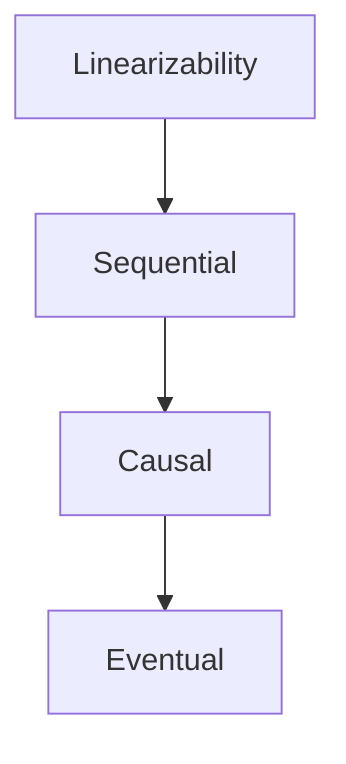

# Consistency Models

Linearizability, eventual consistency, CAP, PACELC, quorums, and session guarantees.

*Figure: Consistency model spectrum — stronger models imply more constraints.*

## What You'll Learn

Consistency is not one thing — it is a menu of guarantees with different latency and availability costs. You will be able to choose the right model for a workload, explain CAP and PACELC without oversimplifying, and design quorums for read/write tradeoffs.

## Chapters

| Chapter | Focus |
|---------|-------|
| [CAP Theorem](/docs/consistency/cap-theorem) | Consistency vs availability under partition |
| [PACELC](/docs/consistency/pacelc) | Latency vs consistency when not partitioned |
| [Linearizability](/docs/consistency/linearizability) | Strongest single-object guarantee |
| [Sequential Consistency](/docs/consistency/sequential-consistency) | Per-process program order preserved |
| [Causal Consistency](/docs/consistency/causal-consistency) | Happened-before without global order |
| [Eventual Consistency](/docs/consistency/eventual-consistency) | Convergence without real-time guarantees |
| [Session Guarantees](/docs/consistency/session-guarantees) | Read-your-writes, monotonic reads |
| [Quorum Systems](/docs/consistency/quorum-systems) | R + W > N, read repair, sloppy quorums |

## Learning Path

1. **CAP** and **PACELC** — frame every consistency discussion.
2. **Linearizability** through **Eventual** — know the spectrum and when each applies.
3. **Session Guarantees** — what users actually experience in practice.
4. **Quorum Systems** — connect to DynamoDB, Cassandra, and leaderless replication.

## Interview Prep

| Resource | Topic |
|----------|-------|
| [Amazon DynamoDB Consistency](/docs/real-world-scenarios/amazon-dynamodb-eventual-consistency) | Tunable reads, GSI lag |
| [Google Spanner](/docs/real-world-scenarios/google-spanner-global-consistency) | External consistency |
| [Lab 004 quorum KV](/docs/consistency/quorum-systems#25-hands-on-exercise) | Quorum replication on `:8095` |
| [Lab 005 eventual consistency](/docs/consistency/eventual-consistency#25-hands-on-exercise) | Convergence simulator on `:8099` |
| Question | "What consistency model for a global notification system?" |

## Prerequisites

- [Distributed Systems Foundations](/docs/distributed-systems-foundations/overview)
- [Replication](/docs/replication/overview)

## Next Domain

Continue to [Transactions](/docs/transactions/overview) and [Distributed Databases](/docs/distributed-databases/overview).

Return to the [Curriculum Overview](/docs/start-here/curriculum-overview) for the full learning path.
