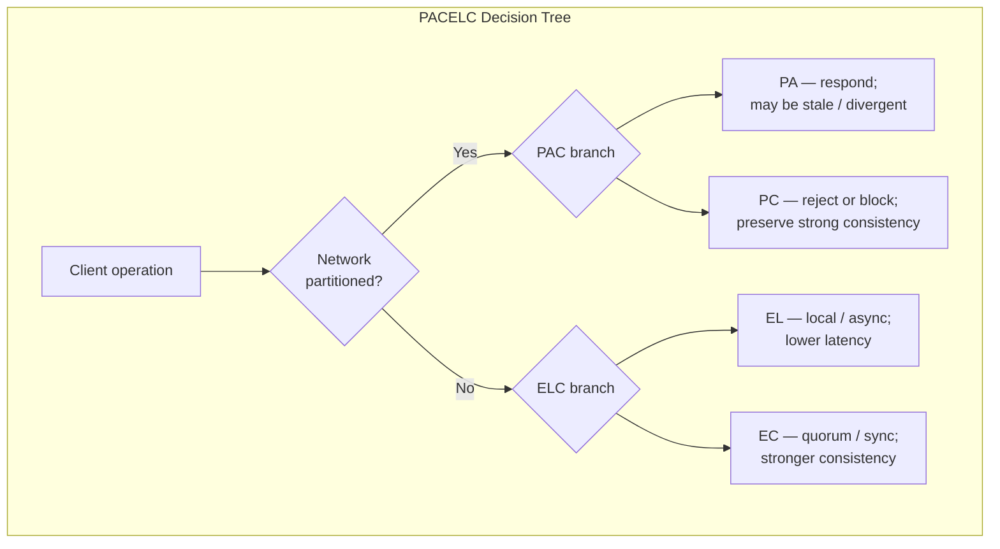
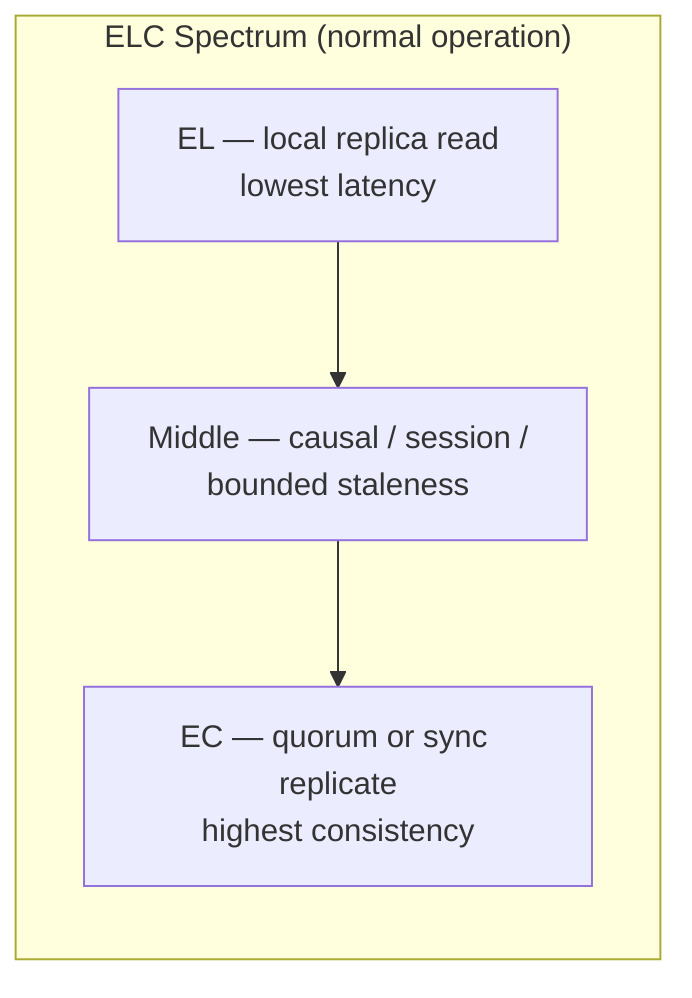
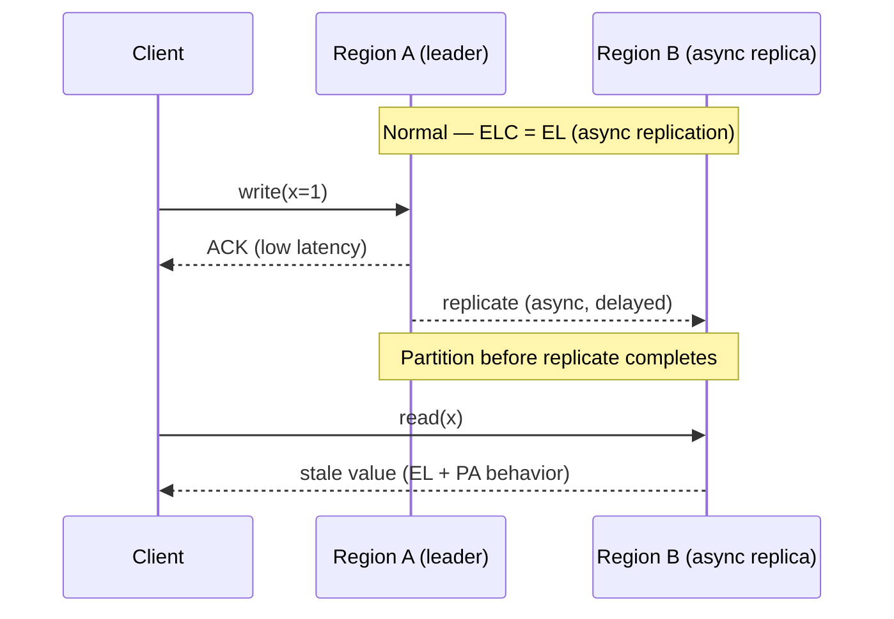
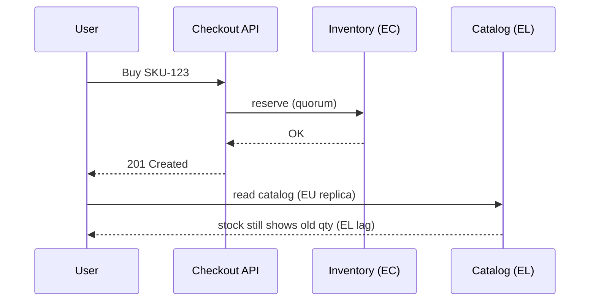
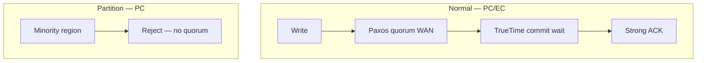
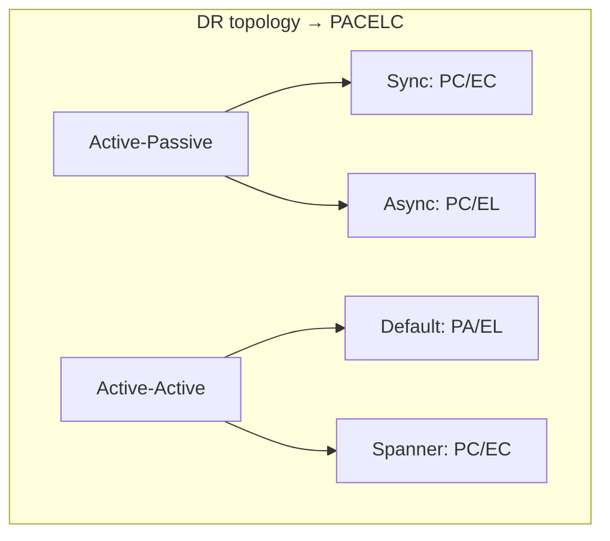
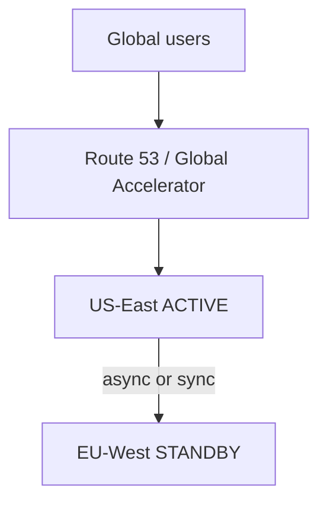
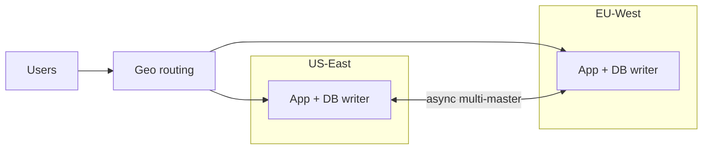
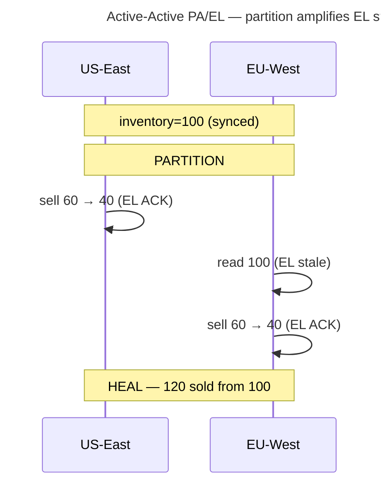

# PACELC

## 1. Executive Summary

**PACELC** extends the CAP framing to a question architects face far more often than a full network partition: *What tradeoff do we make between **latency** and **consistency** when the network is healthy?*

Daniel Abadi (2012) proposed:

> **If** there is a **P**artition, choose between **A**vailability and **C**onsistency; **E**lse (normal operation), choose between **L**atency and **C**onsistency.

CAP—formalized by Gilbert and Lynch—addresses behavior **during** partition. PACELC argues that production systems spend most of their time in the **else** branch, where synchronous replication, quorum reads, and cross-region coordination increase **consistency** at the cost of **latency** (and often throughput). Conversely, asynchronous replication, local reads, and cached views reduce latency but weaken consistency guarantees.

This chapter formalizes PACELC relative to the [CAP Theorem](/docs/consistency/cap-theorem), maps the acronym to client-visible consistency models, surveys production **PA/EL**, **PA/EC**, **PC/EL**, and **PC/EC** postures with explicit caveats, and prepares you for principal-level interviews where "we are AP" is insufficient without stating normal-case staleness and latency budgets.

## 2. Why This Topic Matters

Teams that stop at CAP often make two mistakes:

1. **Partition obsession** — Designing only for split-brain while ignoring daily cross-AZ and cross-region latency costs of strong consistency.
2. **Label substitution** — Calling a database "AP" without specifying read consistency levels, replication lag, or session guarantees.

PACELC forces a second axis:

| Branch | Question |
|--------|----------|
| **PAC** (partition) | When isolated, do we fail closed (PC) or keep serving (PA)? |
| **ELC** (else) | When connected, do we pay coordination cost for freshness (EC) or favor fast local responses (EL)? |

Principal architects own **SLIs that span both branches**: p99 read latency during normal operation *and* error rates during regional failures. Interviewers use PACELC to see whether candidates understand that **Spanner, Dynamo, and PostgreSQL read replicas** differ primarily on the **ELC** axis, not only on CAP letters.

## 3. Problems Being Solved

| Problem | PACELC framing |
|---------|----------------|
| **Cross-region write latency** | EC: synchronous multi-region commit; EL: async replication |
| **Stale read replicas** | EL: read from local replica; EC: quorum or leader read |
| **User-visible "flapping"** | PA during partition may amplify EL paths that were hidden before |
| **Cost of strong consistency** | EC often means more WAN round-trips and lower write throughput |
| **Product expectations** | "Real-time" features may require EL; financial correctness requires EC |
| **Technology comparison** | Compare Dynamo vs Spanner on **both** PAC and ELC, not one label |

PACELC does not replace formal consistency definitions (linearizability, causal consistency, eventual consistency). It organizes **engineering tradeoffs** around two operating modes: partitioned vs not.

## 4. Assumptions and System Model

PACELC inherits CAP's partition assumptions from Gilbert and Lynch:

- **Asynchronous network** in the worst case; **partial synchrony** in healthy datacenters.
- **Replicated state** across multiple nodes or regions.
- **Clients** observe latency and consistency through API semantics, not through internal labels.

For the **ELC** branch, assume:

- No **complete** partition between the replicas involved in an operation (otherwise you are in the PAC branch).
- **Latency** is end-to-end: replication, quorum round-trips, clock uncertainty (where applicable), and queueing.
- **Consistency** must be named precisely: linearizability, sequential consistency, causal consistency, read-your-writes, monotonic reads, or bounded staleness.

PACELC is a **design lens**, not a theorem with a single published proof like CAP. Treat ELC tradeoffs as **quantitative and workload-dependent**—avoid inventing universal latency numbers.

## 5. Essential Terminology

| Term | Definition |
|------|------------|
| **PACELC** | If **P**artition → **A** vs **C**; **E**lse → **L**atency vs **C**onsistency (Abadi, 2012). |
| **PAC / ELC** | Shorthand for the two decision branches. |
| **PA / PC** | During partition: availability-first vs consistency-first (same as AP/CP in CAP language). |
| **EL / EC** | Else: latency-first vs consistency-first normal operation. |
| **Synchronous replication** | Commit waits for acknowledgment from remote replica(s)—EC-leaning. |
| **Asynchronous replication** | Commit local before remote catch-up—EL-leaning. |
| **Quorum read** | Read contacts multiple replicas to bound staleness—EC-leaning. |
| **Local read** | Read from nearest replica without cross-check—EL-leaning. |
| **RPO / RTO** | Recovery point/time objectives—often correlate with EC vs EL replication. |
| **Tail latency** | p99/p999—often dominated by EC coordination on wide-area paths. |

**Notation in literature:** Abadi writes systems as **PA/EL** (e.g., Dynamo) or **PC/EC** (e.g., Spanner). Some systems differ between reads and writes (e.g., PC/EC writes, PA/EL reads with session tokens).

## 6. Core Mechanism

### 6.1 Two-level decision tree

PACELC separates **emergency partition policy** from **steady-state performance policy**:



*Figure 1: PACELC — partition branch (CAP) vs normal-operation branch (latency vs consistency).*

### 6.2 Relationship to Gilbert & Lynch CAP

| | **During partition (PAC)** | **Else (ELC)** |
|---|---------------------------|----------------|
| **CAP (Gilbert & Lynch)** | Proved: cannot have C and A for linearizable register | **Not addressed by CAP theorem** |
| **PACELC** | Same CP vs AP choice | Adds L vs C engineering tradeoff |
| **Formal status** | Theorem (async, single register) | Design framework; depends on chosen consistency definition |

CAP tells you **you must sacrifice C or A** when partitioned. PACELC adds that **without partition**, you still choose how much coordination to pay for **C**—there is no free strong consistency at minimum latency across distant replicas.

### 6.3 ELC as a consistency–latency spectrum



*Figure 2: Normal operation is not binary; many production systems expose tunable points on the spectrum.*

**Mechanisms on the EC side:**

- Synchronous multi-AZ fsync and replication (e.g., PostgreSQL synchronous standby).
- Raft/etcd quorum reads and writes.
- Spanner: Paxos quorums + TrueTime for external consistency.
- Cassandra `QUORUM` / `ALL` reads and writes.

**Mechanisms on the EL side:**

- Async replication to read replicas (PostgreSQL, MySQL).
- Cassandra `ONE` / `LOCAL_ONE`.
- CDN and edge caches with TTL.
- Leaderless reads with high staleness probability.

### 6.4 PAC interacts with ELC

A system configured for **EL** (async replicas) may **appear** highly available during partition because each region serves local traffic—but **divergence** is larger than an **EC** system that would have **failed closed** (PC) on the minority side.



*Figure 3: EL during normal operation amplifies staleness visible under partition (PA).*

## 7. Step-by-Step Walkthrough

**Scenario:** Global document editing API with US and EU regions.

1. **Requirements gathering**
   - Metadata (permissions): must be linearizable → **EC** candidate.
   - Document body: collaborative editing with merge → **EL** with CRDTs acceptable.

2. **Normal operation — ELC choices**
   - **Permissions service:** etcd or Spanner-style quorum in one region; cross-region sync writes → **EC** (higher write latency).
   - **Document content:** Write to regional leader; async replicate to EU → **EL** (lower write latency; EU reads may lag).

3. **Partition — PAC choices**
   - **Permissions:** Minority region stops granting new permissions → **PC**.
   - **Content:** Both regions continue edits → **PA**; merge on heal via CRDT.

4. **Client contracts**
   - Session token binds user to region for read-your-writes where needed.
   - Explicit `409` / conflict payloads on permission changes during partition.

5. **Operations**
   - Monitor replication lag (EL path) and quorum health (EC path) as separate alerts.

## 7.1 Real-World Scenarios at Production Granularity

PACELC asks two questions per operation: **(1) PAC** — what happens when partitioned? **(2) ELC** — what latency vs consistency tradeoff on normal days? The scenarios below specify **both branches**, client-visible behavior, and operator actions minute by minute.

### Scenario A: Shopify e-commerce — hybrid PC/EC + PA/EL in one platform

**Context:** Checkout and inventory require correctness; product catalog and search tolerate staleness. Shopify-style architectures split PACELC **per bounded context**, not per company.

| Service | Normal (ELC) | Partition (PAC) | Why |
|---------|--------------|-----------------|-----|
| **Order / payment** | **EC** — sync commit to primary + durable outbox | **PC** — fail closed without quorum | Oversell and double-charge unacceptable |
| **Product catalog** | **EL** — read from regional replica / CDN | **PA** — serve stale catalog locally | Speed > perfect freshness |
| **Search index** | **EL** — async index from CDC | **PA** — regional index may lag | Eventual convergence OK |

**Granular checkout flow (normal operation — EC path):**

| Time | Event | ELC |
|------|-------|-----|
| T+0 | User clicks "Buy" in US-East | — |
| T+20ms | API validates inventory via **EC** reservation service (quorum / row lock) | **EC** — pays ~1–3 AZ RTT |
| T+45ms | Order row committed on primary; outbox event written in same txn | **EC** |
| T+50ms | `201 Created` returned to client | Low write latency because single-region EC |
| T+200ms | Async CDC replicates to EU catalog replica | **EL** for EU readers |

**Same user, catalog read immediately after (EL path):**

| Time | Event | ELC |
|------|-------|-----|
| T+55ms | User views "My orders" from EU edge | Routed to EU read replica |
| T+60ms | Order **missing** from list (replication lag 2–5s) | **EL** — stale read |
| T+3s | Order appears after async catch-up | EL converges |

**Mitigation without full EC everywhere:** Session token routes post-checkout reads to origin region (**read-your-writes** without global EC).



See: [Shopify Transactional Outbox](/docs/real-world-scenarios/shopify-transactional-outbox).

---

### Scenario B: Netflix streaming — PA/EL for metadata reads, PC/EC for billing

**Context:** 99% reads (title metadata, recommendations); writes rare (account, entitlements). Normal operation optimizes **EL**; entitlements use **EC**.

| Operation | PACELC | Normal latency driver |
|-----------|--------|----------------------|
| **Play manifest / title metadata** | **PA/EL** | CDN + regional cache; no cross-region quorum |
| **Subscription entitlement check** | **PC/EC** | Authoritative account DB; sync or leader read |
| **Viewing history write** | **PA/EL** | Async aggregate; merge on conflict OK |

**Granular "Start playback" flow:**

| Time | Event | Branch |
|------|-------|--------|
| T+0 | User presses Play in Berlin | — |
| T+15ms | Edge POP serves manifest from local cache | **EL** |
| T+25ms | Entitlement API checks account in US-West leader | **EC** — cross-Atlantic RTT on critical path |
| T+120ms | Entitlement OK; stream starts | EC tax on ~1% path |
| T+121ms | Viewing event queued locally | **EL** — async to analytics |

**Partition — EU isolated from US account DB:**

| Side | PAC | User experience |
|------|-----|-----------------|
| **EU edge** | **PA** for metadata | Playback from cache continues |
| **Entitlement** | **PC** without quorum | New plays **blocked** — fail closed |
| **Wrong PA/EL on entitlements** | Would allow piracy | Revoked subs still play |

**Principal signal:** EL for bulk reads; EC only on the **small critical path** that gates revenue and compliance.

See: [Netflix Cascading Failure](/docs/real-world-scenarios/netflix-cascading-failure).

---

### Scenario C: Google Spanner — canonical PC/EC normal and under partition

**Context:** Spanner synchronously replicates via Paxos per shard; TrueTime bounds external consistency. **PC/EC** in both branches.

**Normal write (ELC = EC):**

| Time | Event | Cost |
|------|-------|------|
| T+0 | `INSERT` into `orders` (multi-region instance) | — |
| T+1ms | Paxos prepare/accept across replicas in 3 regions | **EC** — WAN RTTs in quorum |
| T+8–15ms | Commit wait for TrueTime safe time | **EC** — clock bound |
| T+16ms | ACK to client | Write latency >> single-region Postgres |

**Normal read with `staleness` bound:**

| Setting | ELC | Behavior |
|---------|-----|----------|
| Default (strong) | **EC** | Read at latest commit timestamp |
| `max_staleness=10s` | **EL**-leaning | Cheaper replicas; bounded staleness SLO |
| Read-only replica | **EL** | Lower latency; explicit staleness contract |

**Partition — minority region loses quorum:**

| Region role | PAC | Behavior |
|-------------|-----|----------|
| **Majority (2 of 3)** | **PC** serves | Reads/writes continue |
| **Minority (1 of 3)** | **PC** blocks | **503** / unavailable — sacrifices **A** |
| **Misconfigured dual-write** | Split brain | **Not Spanner** — fencing via Paxos epoch |



See: [Google Spanner Global Consistency](/docs/real-world-scenarios/google-spanner-global-consistency).

---

### Scenario D: PostgreSQL active-passive — PC/EC vs PC/EL via replication mode

**Context:** Same product, different PACELC posture depending on `synchronous_standby_names` and read routing.

**Configuration 1: Sync standby (PC/EC for writes)**

| Time | Event | ELC |
|------|-------|-----|
| T+0 | `UPDATE accounts SET balance=...` | — |
| T+2ms | Primary fsync | — |
| T+4ms | Sync replica ACK required before commit | **EC** |
| T+5ms | Client receives COMMIT | +2ms vs async |

**Configuration 2: Async replica + read from replica (PC/EL)**

| Time | Event | ELC |
|------|-------|-----|
| T+0 | Write to primary | **EC** on write path (local) |
| T+3ms | COMMIT on primary | Fast write |
| T+4ms | Read from async replica | **EL** — may lag 100ms–30s |
| T+4ms | User sees **old balance** | EL staleness without partition |

**Failover promotion (async) — PAC + ELC interact:**

| Time | Event | Effect |
|------|-------|--------|
| T+0 | Primary AZ fails | **PAC** — writes unavailable (RTO window) |
| T+90s | Replica promoted | **PA** restored on new primary |
| T+91s | Last 20s of commits **lost** | **EL** async lag → RPO; users see **C** violation |

**Fix for read path:** Route sensitive reads to primary or use `pg_current_wal_lsn()` lag check before replica read.

---

### Scenario E: Uber ride matching — EL geolocation, EC trip state machine

**Context:** Driver GPS updates are high-volume (**EL**); trip lifecycle (requested → matched → completed) needs **EC** to prevent double assignment.

| Data | Normal ELC | Partition PAC |
|------|------------|---------------|
| **Driver location** | **EL** — write to regional cell; 1–2s staleness OK | **PA** — local cell keeps updating |
| **Trip state** | **EC** — single leader per trip ID | **PC** — minority cell rejects state transition |
| **Surge pricing** | **EL** with short TTL | **PA** — regional surge may diverge briefly |

**Granular match flow (normal):**

| Time | Event | ELC |
|------|-------|-----|
| T+0 | Rider requests trip in SF | — |
| T+50ms | Dispatch reads driver locations from **regional cache** (EL) | Sub-second stale positions OK |
| T+80ms | `ASSIGN driver-42` via **EC** trip service (leader shard) | Linearizable compare-and-set |
| T+85ms | Driver app shows new trip | EC prevents two riders on same driver |

**Partition — dispatch cell split:**

| Cell | PAC for locations | PAC for trip state |
|------|-------------------|-------------------|
| **US-West majority** | PA — EL updates | PC — commits |
| **US-West minority** | PA — isolated EL | PC — rejects ASSIGN |

**Double-assign risk if trip state were EL:** Two cells both read `driver-42=idle` from stale cache and assign — **why trip state must be EC/PC**.

See: [Uber Ride Matching](/docs/real-world-scenarios/uber-ride-matching).

---

### Scenario F: Slack messaging — EL delivery with session and causal guarantees

**Context:** Messages fan out to millions of channels; global linearizability per message is unnecessary; **session consistency** and ordering within a channel matter.

| Operation | PACELC | Mechanism |
|-----------|--------|-----------|
| **Post message** | **PA/EL** normal | Write to regional leader; async fan-out |
| **Read channel history** | **EL** with **monotonic reads** | Per-user cursor; sticky to region |
| **Workspace admin revoke** | **PC/EC** | Strong metadata store |

**Granular send + read (normal — EL):**

| Time | Event | ELC |
|------|-------|-----|
| T+0 | User posts in `#eng` from NYC | — |
| T+25ms | ACK after regional persist | **EL** — not waiting for Dublin replica |
| T+30ms | Same user reads `#eng` | **Session** — sees own message (read-your-writes) |
| T+200ms | Dublin teammate reads `#eng` | **EL** — message may not appear yet |
| T+400ms | Dublin sees message | Replication lag |

**Partition — US and EU cells isolated:**

| Behavior | PAC | ELC symptom |
|----------|-----|-------------|
| Both cells accept posts | **PA** | Duplicate message IDs if not careful — need vector clocks / server IDs |
| EU reads US channel | **PA** | **EL** backlog; ordering conflicts on heal |
| Admin disables user in US | **PC** on metadata | EU may still show user active until replicate — **EL security lag** |

See: [Slack Message Delivery](/docs/real-world-scenarios/slack-message-delivery).

---

### Real-world PACELC posture summary

| System / path | Normal (ELC) | Partition (PAC) | Latency vs consistency tradeoff |
|---------------|--------------|-----------------|--------------------------------|
| Shopify checkout | **EC** | **PC** | Pays quorum RTT; no oversell |
| Shopify catalog | **EL** | **PA** | Fast reads; lag under load |
| Netflix metadata | **EL** | **PA** | CDN hit; stale OK |
| Netflix entitlements | **EC** | **PC** | Cross-region on critical path |
| Spanner (default) | **EC** | **PC** | WAN write latency; strong reads |
| Postgres async replica | **EL** reads | **PC** writes | Cheap reads; lag incidents daily |
| Uber GPS | **EL** | **PA** | Volume over freshness |
| Uber trip state | **EC** | **PC** | Correctness over speed |
| Slack messages | **EL** + session | **PA** | Fan-out speed; merge on heal |

---

## 7.2 PACELC in Active-Passive, Active-Active, and Disaster Recovery

Failover topology determines **both** branches: **ELC** during steady state (replication lag, read routing) and **PAC** during isolation (who keeps serving, who blocks). DR metrics map directly to PACELC.

### DR vocabulary mapped to PACELC

| Term | ELC interpretation (normal) | PAC interpretation (partition / failover) |
|------|---------------------------|-------------------------------------------|
| **RPO** | Max **EL** replication lag at failure time | After promotion, reads reflect data **at least RPO stale** |
| **RTO** | N/A | Window where **PC** blocks writes or **PA** unavailable |
| **Sync replication** | **EC** — commit waits for remote ACK | **PC** — minority rejects; RPO ≈ 0 |
| **Async replication** | **EL** — fast local commit | **PA** on promote side; lost writes = EL lag |
| **Active-passive** | Standby often **EL** for reads (async) or **EC** (sync) | Single writer → **PC**-lean on promotion |
| **Active-active** | Both sides **EL** for local writes | **PA** risk — divergence unless global **EC** |
| **Read replica** | **EL** by definition | Promote replica → inherit lag as RPO |



---

### Topology 1: Single-region active-passive (hot standby)

**Architecture:** Primary AZ-a serves writes; standby AZ-b replicates synchronously or asynchronously.


#### Normal operation — ELC choices

| Replication | Write path ELC | Read from standby ELC | Typical p99 write |
|-------------|----------------|----------------------|-------------------|
| **Synchronous** | **EC** | **EC** if sync caught up | +1 AZ RTT (~1–2ms) |
| **Asynchronous** | **EL** (local commit) | **EL** — lag variable | Baseline primary only |
| **Async + primary reads only** | **EL** replicate | **EC** for routed reads | Best of both for read-your-writes |

**Granular day-2 incident (async EL, no partition):**

| Time | Event | User sees |
|------|-------|-----------|
| T+0 | Heavy write load; replication lag climbs to 8s | — |
| T+1min | User updates profile; reads from replica | **Stale avatar** — ELC incident, not PAC |
| T+2min | Alert: `replica_lag_seconds > 5` | Ops throttle replica reads |
| T+5min | Lag recovers | EL path self-heals |

#### Failover — PAC behavior

| Step | Sync (PC/EC) | Async (PC/EL) |
|------|--------------|---------------|
| 1. Primary fails | Writes **unavailable** ~30–120s | Same |
| 2. Fence primary | **PC** — prevent split brain | **PC** |
| 3. Promote standby | **EC** preserved; RPO ≈ 0 | **EL** lag lost; RPO = lag at failure |
| 4. Resume traffic | **PA** restored | **PA** restored; clients may see missing recent writes |

**PACELC interview answer:** "Single-region active-passive with async replication is **PC/EL**: normal writes are fast (EL), reads from standby are stale (EL), failover is **PC**-lean with brief unavailability, and promotion exposes **EL lag as RPO** — not a partition theorem issue but a consistency bound."

---

### Topology 2: Multi-region active-passive (DR standby)

**Architecture:** US-East active; EU-West warm standby. Cross-region **async** replication (typical) or **sync** (Spanner/RDS global).



#### Normal operation — ELC by configuration

| Config | US-East users | EU users routed to US | Replication |
|--------|---------------|----------------------|-------------|
| **Async DR** | **EC** local writes | **EL** reads if using EU cache/replica | 100ms–minutes lag |
| **Sync cross-region** | **EC** | **EC** but +WAN RTT every write | RPO ≈ 0 |
| **Read-local-write-global** | Write US **EC**; EU read local **EL** | Common hybrid | Product complexity |

**Granular normal-day EU user (async DR — PC/EL):**

| Time | Event | ELC |
|------|-------|-----|
| T+0 | EU user loads dashboard | **EL** — cached in EU; 30s stale |
| T+1s | US user updates same record | **EC** on US primary |
| T+2s | EU user refreshes | Still stale — **EL lag 45s** |
| T+46s | EU sees update | EL converged |

#### Regional disaster failover

| Phase | Action | PACELC effect |
|-------|--------|---------------|
| **Detect** | US-East unreachable | — |
| **Fence** | Block US-East writes if partially alive | **PC** — protect against split brain |
| **Promote** | EU-West becomes primary | Switch from **EL** follower to **EC** leader |
| **Redirect** | DNS → EU | **PA** restored for EU; US users pay WAN latency |
| **Operate** | EU serves all writes | **EC** local; former US data **EL-stale** up to RPO |

**Client experience — RPO = 5 minutes (async DR):**

| User | Before failover | During promotion (RTO 10 min) | After failover |
|------|-----------------|-------------------------------|----------------|
| US | US-East **PC/EC** | **503** / timeout | EU **PC/EC**; writes may **lose last 5 min** |
| EU | US-primary writes (high latency) | **503** | EU-local **EC** writes (fast); reads fresh for new writes |

**RPO = 0 (sync cross-region — PC/EC):**

- Every commit waits for EU ACK — **EC** normal operation (+50–150ms WAN per write).
- US-East total loss: EU already has all commits — promotion is **PC/EC** with no EL data loss.
- Partition between regions: **PC** — **global write stop** on minority (Spanner model).

See: [AWS S3 Multi-Region DR](/docs/real-world-scenarios/aws-s3-multi-region-dr).

---

### Topology 3: Multi-region active-active

**Architecture:** US-East and EU-West both accept reads and writes; bidirectional async replication (default) or global Spanner.



#### Normal operation — PA/EL (typical async active-active)

| User | Write ELC | Cross-region read ELC |
|------|-----------|----------------------|
| US user → US-East | **EL** — local commit ~5ms | N/A |
| EU user reads US-written row | — | **EL** — 200ms–30s lag typical |
| EU user → EU-West write same row | **EL** | Conflict risk — LWW or app merge |

**Granular conflict (normal, no partition):**

| Time | US-East | EU-West | ELC |
|------|---------|---------|-----|
| T+0 | `title = "Hello"` | Replicating | — |
| T+100ms | — | `title = "Bonjour"` (concurrent) | Both **EL** ACK |
| T+5s | LWW: `"Bonjour"` wins | — | **EL** convergence, not EC |

#### Partition — transatlantic link down

| Strategy | Normal was | Partition PAC | Combined symptom |
|----------|------------|---------------|------------------|
| **Default async A-A** | **PA/EL** | **PA** both sides | Large divergence; merge on heal |
| **Global Spanner** | **PC/EC** | **PC** minority | Minority **unavailable**; no divergence |
| **Per-user home region** | **EL** local | **PA** per cell | Reduces cross-partition writes |
| **Leader per shard** | **EC** per key | **PC** per shard | Uber/Spanner pattern |

**Granular partition timeline (PA/EL active-active):**

| Time | US-East | EU-West | PACELC |
|------|---------|---------|--------|
| T+0 | `inventory=100` replicated | Same | **EC** at last sync point |
| T+1 | **Partition** | — | — |
| T+2 | Sell 60 → `40` (**EL** local ACK) | Not visible | **PA** + **EL** |
| T+3 | — | Read `100` (**EL** stale) | **EL** amplifies under **PA** |
| T+4 | — | Sell 60 → `40` | **PA** — both sides sold 120 units |
| T+1h | **Heal** | Reconcile — oversell | EL lag + PA = worst case |

**Mitigations and PACELC shift:**

| Mitigation | Normal ELC | Partition PAC |
|------------|------------|---------------|
| **Inventory service (single leader)** | **EC** | **PC** |
| **CRDT cart** | **EL** | **PA** — commutative merge |
| **Spanner global DB** | **EC** | **PC** |
| **Saga + reservation** | **EC** reserve, **EL** catalog | **PC** on reserve |



---

### Failover scenario matrix (PACELC lens)

| Scenario | Topology | Normal ELC | Failover PAC | Key risk |
|----------|----------|------------|--------------|----------|
| **Replica lag alert** | Active-passive async | **EL** | N/A | Stale reads without partition |
| **Single AZ failure** | Active-passive sync | **EC** | **PC** brief | RTO window |
| **Single AZ failure** | Active-passive async | **EL** | **PC** promote | RPO = lag |
| **Region disaster** | Active-passive DR async | **EL** cross-region | Promote **PC/EC** EU | RPO staleness |
| **Region disaster** | Active-passive DR sync | **EC** | **PC/EC** promote | Global write stop if partitioned |
| **DNS failover only** | Any | Unchanged | Routing only | **EL** stale data in target region |
| **Active-active partition** | Multi-region | **PA/EL** | **PA** both | Divergence + EL staleness |
| **Active-active + Spanner** | Multi-region | **PC/EC** | **PC** minority | Latency cost daily |
| **Failback to old primary** | DR | **EL** backlog | Must fence | Stale **EL** writes replay |
| **Cold restore from backup** | Backup DR | N/A | **PA** after restore | Hours of **EL** gap = RPO |

---

### Active-passive vs active-active — PACELC decision guide

| Requirement | Active-passive | Active-active |
|-------------|----------------|---------------|
| **Lowest normal write latency (local)** | ✗ Single primary may be far | ✓ **EL** local writes |
| **Lowest cross-region read staleness** | ✓ Single source of truth | ✗ **EL** unless **EC** global |
| **Simplest ELC mental model** | ✓ One primary, predictable lag | ✗ Per-region lag + conflicts |
| **RPO = 0 without global write penalty** | ✓ Sync to standby (same region) | ✗ Needs **PC/EC** global (Spanner) |
| **Financial / inventory correctness** | ✓ **PC/EC** natural | Needs **EC** layer per entity |
| **Partition behavior** | **PC**-lean | **PA/EL** risk by default |

**Principal recommendation — PACELC per data type:**

| Data type | Topology | Normal ELC | Partition PAC |
|-----------|----------|------------|---------------|
| Money, inventory, trip state | Active-passive or shard leader | **EC** | **PC** |
| Catalog, feeds, analytics | Active-active replicas | **EL** | **PA** |
| Session / cart | Active-active + CRDT | **EL** | **PA** + merge |
| Global config / ACL | Single-region **PC/EC** + cache | **EC** origin, **EL** edge | **PC** |

---

### DR drill — PACELC checklist

**Before drill:**

- [ ] Document per-API: **EL** or **EC** during normal operation
- [ ] Document per-API: **PA** or **PC** during partition
- [ ] Map **RPO** to measured `replication_lag_p99` (**EL** bound)
- [ ] Map **RTO** to expected **PC** unavailability window
- [ ] Verify read routing: replica reads flagged as **EL** in runbooks

**During drill:**

- [ ] Measure write unavailability (**PAC** / RTO)
- [ ] Sample reads from promoted region — compare to pre-failover writes (**EL** lag vs RPO)
- [ ] Confirm fenced old primary cannot accept writes (**PC**)
- [ ] Track p99 write latency before/after — did you shift from remote **EC** to local **EC**?

**After drill:**

- [ ] Reconcile rows diverged under **PA/EL** test
- [ ] Failback only after replication caught up (**EL** → **EC** safe)
- [ ] Update ADR with observed lag, RPO, RTO, and PACELC quadrant per service

See also: [CAP Theorem — HA/DR scenarios](/docs/consistency/cap-theorem#72-cap-in-active-passive-active-active-and-disaster-recovery), [Disaster Recovery and Multi-Region](/docs/reliability-and-resilience/disaster-recovery-and-multi-region), [Google Spanner](/docs/real-world-scenarios/google-spanner-global-consistency), [Amazon DynamoDB](/docs/real-world-scenarios/amazon-dynamodb-eventual-consistency).

---

## 8. Invariants and Guarantees

**PACELC does not prove new impossibility results.** It organizes guarantees:

| Configuration | Partition invariant (PAC) | Normal invariant (ELC) |
|---------------|---------------------------|-------------------------|
| **PA/EL** | Responses on all sides; divergence possible | Low latency; staleness bounded only by replication lag |
| **PA/EC** | Rare in practice; EC usually requires coordination that partition breaks | Strong when connected; degrades to PA under partition |
| **PC/EL** | Consistent when available; minority unavailable | Fast reads may be stale even when connected |
| **PC/EC** | Linearizable when quorum available | Strong consistency; higher latency |

**Architectural invariants to document:**

1. Maximum staleness (EL) or consistency level (EC) per API.
2. Behavior when lag exceeds SLO (fail read vs serve stale).
3. Conflict resolution rules when PA allows concurrent writes.

## 9. Failure Scenarios

| Scenario | PAC effect | ELC effect | Combined symptom |
|----------|------------|------------|------------------|
| **Async lag under load** | N/A (no partition) | EL reads return old data | "Bug" reports without partition |
| **Regional partition** | PA continues in both regions | Prior EL config → large divergence | Merge conflicts, support tickets |
| **Quorum loss** | PC rejects writes | EC path unavailable | Apparent outage though nodes "up" |
| **Clock skew (EC with clocks)** | N/A | False confidence in ordering | Violations if bounds exceeded |
| **Hot key on single leader** | N/A | EC writes serialize on leader | Latency spikes—not CAP, but ELC cost |

**Gray failures:** Elevated latency without clean partition may push operators toward PA responses while EC logic still assumes quorum—undefined middle ground unless explicitly designed.

## 10. Performance Characteristics

PACELC is not a benchmark framework. Describe performance **qualitatively**:

| ELC choice | Typical latency driver | Throughput note |
|------------|------------------------|-----------------|
| **EL — local read** | Single replica RTT | High read throughput; staleness risk |
| **EL — async write** | Local commit only | Fast writes; RPO > 0 on failure |
| **EC — quorum read** | Max or sum of replica RTTs | Fewer stale reads; tail latency sensitive |
| **EC — sync cross-region write** | WAN RTT per commit | Write throughput limited by distance |

**Tail latency:** EC across regions often dominates p99; EL shifts risk to consistency rather than median RTT. In practice, teams discover ELC tradeoffs during capacity planning: doubling read traffic by adding EL replicas is cheap until product requirements demand read-your-writes across regions—then EC coordination re-enters the critical path.

**Do not cite fabricated ms numbers** for "AP vs CP"—measure for your topology, payload size, and consistency level.

## 11. Scalability Limits

- **EC write path** — Single leader or quorum per shard caps write scalability; Spanner uses shards; still pays coordination per transaction scope.
- **EL read scaling** — Add read replicas freely; consistency does not scale independently of staleness.
- **PA multi-master** — Write scalability across regions increases **conflict rate**—application merge cost becomes the limiter.
- **Metadata PC/EC** — Small strongly consistent control plane does not scale data plane; hybrid architectures use EL for bulk data.

Sharding multiplies PACELC decisions: **each shard** has its own PAC and ELC posture.

## 12. Operational Considerations

1. **Separate dashboards** for replication lag (EL) and quorum health (EC).
2. **SLOs:** Define p99 latency and max staleness separately; alert on both.
3. **Failover drills:** EL systems need **manual or automated** conflict playbooks; PC systems need **client retry** to healthy partition.
4. **Config drift:** Cassandra consistency level per query; changing defaults changes ELC without renaming the cluster.
5. **Documentation:** Runbooks should say PA/EL explicitly, not "we use Dynamo."

**Incident communication:** "Elevated lag" is an ELC incident; "region isolated" is PAC—different mitigations.

## 13. Security Considerations

- **EL replicas** may serve data to clients in another trust zone before ACL revocation replicates—security **consistency** lags.
- **PA during partition** may allow writes on a compromised partition if auth tokens cannot be revoked globally—pair PA with short-lived credentials where risk is high.
- **EC metadata** for authZ reduces stale permission risk; worth latency for admin APIs.

PACELC is not a security model; it highlights **where stale security state** can appear.

## 14. Cost Considerations

| Posture | Cost pattern |
|---------|--------------|
| **EC cross-region** | WAN egress per commit; more expensive instances for quorum; lower write QPS per dollar |
| **EL multi-region** | Cheaper reads locally; higher app engineering for merge; support cost for inconsistency |
| **Over-replication (EL)** | Storage and replication bandwidth without EC benefit if reads still local |

FinOps should attribute **cross-region sync** as consistency tax (EC), not blame "the database" generically.

## 15. Production Implementations

Abadi's original classifications (illustrative; verify per version and config):

| System | Typical PACELC label | Notes |
|--------|---------------------|-------|
| **Dynamo / Cassandra** | **PA/EL** | Tunable consistency; default lean EL |
| **Bigtable** | **PC/EL** | Single-row atomicity; partition behavior CP-leaning |
| **Spanner** | **PC/EC** | Sync replication; TrueTime |
| **PostgreSQL** | **PC/EC** (sync) or **PC/EL** (async replica) | Same product, different ELC via replication mode |
| **MongoDB** | Configurable | Write concern + read concern map to ELC |
| **CockroachDB** | **PC/EC**-leaning | Raft per range; survival goals |
| **Redis with local replicas** | Often **PA/EL** | Async replication; manual failover risks |

**Hybrid (common):** PC/EC for inventory ledger + PA/EL for browse catalog in one e-commerce platform.

## 16. Alternatives and Tradeoffs

| Approach | vs PACELC |
|----------|-----------|
| **Explicit consistency models** | Finer than EL/EC binary (causal, sequential) |
| **SLA: max_staleness=τ** | Operationalizes EL with bound |
| **CRDTs** | EL-friendly convergence without linearizability |
| **Single-region strong + CDN** | Avoids WAN ELC for reads; partition scope shrinks |
| **Calibrated PACELC (research)** | Extensions weight P, A, C, E, L differently—less common in interviews |

**When to emphasize ELC:** Multi-region active-active, read-heavy global products, edge caching.

**When to emphasize PAC:** Control planes, financial cores, coordination services (locks, leases).

## 17. Common Misconceptions

| Misconception | Correction |
|---------------|------------|
| "PACELC replaces CAP" | PACELC **extends** CAP with the else branch; CAP proof still stands for partition. |
| "EL means inconsistent" | EL means **weaker** guarantees; session/monotonic reads may suffice. |
| "EC means linearizable" | EC means you paid coordination; define the actual model. |
| "AP databases are always EL" | Consistency levels can make reads EC even in 'AP' stores. |
| "Partition is rare so PAC doesn't matter" | Partitions are rare **per hour** but **certain** at scale; PAC must be designed. |
| "PACELC is a theorem" | Framework for tradeoffs; ELC is not Gilbert & Lynch impossibility. |
| "Lower latency always wins" | Business cost of stale financial or inventory data can exceed infra savings. |

## 18. Principal Architect Perspective

Present architecture as a **2×2 matrix** per bounded context:

```
              ELC: EL          ELC: EC
PAC: PA      [Dynamo-style]   [unusual; hard to keep EC while PA]
PAC: PC      [async + quorum  [Spanner, etcd]
              minority down]
```

Decisions:

1. **Split by API** — Not one label per company.
2. **Quantify ELC** — p99 write latency budget vs staleness SLO.
3. **Test PAC** — Game days for regional isolation.
4. **Align stakeholders** — Product owns merge UX for PA/EL; finance owns PC/EC for money.

Reject "we'll fix consistency later" on EL paths that already serve paying customers.

## 19. Architecture Review Exercise

**Prompt:** A media company streams video metadata from 12 regions. Writes (title, ACL) are 1% of traffic; reads 99%. They propose PA/EL everywhere for "global speed."

**Tasks:**

1. Classify **metadata writes** and **reads** separately on PACELC.
2. Identify risks of **PA** for ACL changes during partition (piracy, revoked access still valid).
3. Propose a **hybrid**: which operations move to PC/EC?
4. Define **monitoring** for replication lag vs permission violations.
5. Draft **client semantics** for read-after-write on title updates.

**Deliverable:** PACELC matrix + ADR for hybrid posture.

## 20. Whiteboard Explanation

**Draw 2×2:**

```
         EL (fast)     EC (strong)
PA     shopping cart   (rare)
PC     stale reads OK  Spanner / etcd
```

**90-second script:** "CAP is only about when the network partitions. PACELC adds: what about normal days? If I synchronously replicate every write across regions before ACK, I get stronger consistency but pay WAN latency on every write—that's EC. If I ACK locally and replicate async, writes are fast but readers in another region see lag—that's EL. Dynamo is often described PA/EL: on partition keep serving, and normally favor latency. Spanner is PC/EC: quorum and sync replication, minority down on partition. Most real platforms are hybrid—strong metadata, fast content. PACELC beats CAP alone because interviewers and incidents care about both isolation behavior and everyday tail latency."

## 21. Interview Questions

1. **Expand the PACELC acronym and explain each branch.**
   - *Signals:* P→AC; Else→LC; partition vs normal.

2. **How does PACELC relate to Gilbert & Lynch CAP?**
   - *Signals:* PAC = CAP; ELC not covered by theorem.

3. **Classify Dynamo and Spanner on PACELC.**
   - *Signals:* PA/EL vs PC/EC; tunable caveats.

4. **Why is PA/EC uncommon?**
   - *Signals:* EC needs coordination; partition breaks it → degrades to PA.

5. **Your app needs low-latency reads and strong writes—what PACELC posture?**
   - *Signals:* PC/EC or PC/EL writes with leader; reads from leader or quorum for freshness; hybrid.

6. **What does EL mean for PostgreSQL read replicas?**
   - *Signals:* Async lag; read-your-writes not guaranteed without routing.

7. **How would you test ELC assumptions?**
   - *Signals:* Lag metrics, consistency integration tests, Jepsen-style workloads.

8. **Does PACELC say latency and consistency are always opposed?**
   - *Signals:* In multi-replica geo setups, often yes for same object; caching complicates.

9. **Explain a hybrid PACELC architecture for e-commerce.**
   - *Signals:* PC/EC inventory; PA/EL catalog; separate services.

10. **What is wrong with 'we chose AP so latency is solved'?**
    - *Signals:* AP is partition; latency is ELC; consistency levels matter.

11. **How do Cassandra consistency levels map to ELC?**
    - *Signals:* ONE vs QUORUM vs ALL; LOCAL_QUORUM.

12. **When would you accept PA/EL for financial data?**
    - *Signals:* Never for balances; maybe for non-critical analytics; strong boundary.

13. **Active-passive async DR — how does RPO map to PACELC?**
    - *Signals:* RPO = max EL replication lag; promotion exposes staleness bound.

14. **Why does active-active default to PA/EL?**
    - *Signals:* Local commits without global quorum; fast writes; divergence on partition.

15. **Spanner in active-active multi-region — still PC/EC?**
    - *Signals:* Yes; WAN latency daily (EC); minority unavailable on partition (PC).

## 22. Interview Follow-Ups

1. **Design session guarantees without full linearizability.** — Sticky sessions, version tokens, read-your-writes.
2. **Spanner TrueTime—EC enabler or separate axis?** — External clock bounds; still PC/EC posture.
3. **CRDTs and PACELC.** — PA/EL friendly; convergence vs strong invariants.
4. **Calibrate max staleness SLO from business requirements.** — Revenue vs infra cost.
5. **Jepsen findings vs PACELC labels.** — Implementation may violate claimed posture.
6. **Single-region multi-AZ: PAC or ELC?** — AZ partition → PAC; ELC still applies cross-AZ sync choice.
7. **DR failover with 5-min RPO — ELC or PAC issue?** — ELC lag bound becomes consistency loss; brief PAC during promotion.
8. **Can you have EC normal and PA partition?** — Yes (Spanner); EC degrades to PC on minority, not PA on majority.

## 23. Strong Answer Example

**Question:** "Compare Cassandra and Spanner for a global inventory system."

**Strong answer outline:**

"I'd separate PAC and ELC. For inventory, overselling is a safety problem, so during a partition I want PC behavior—minority partitions should not commit sales without quorum—which pushes toward Raft/Paxos-style systems like Spanner or tightly configured Cassandra with `QUORUM`/`SERIAL` and careful application design. On normal operation, Spanner is PC/EC: synchronous replication and TrueTime give external consistency at the cost of cross-region write latency. Cassandra is often PA/EL at default: fast local reads with `LOCAL_ONE`, but you can push toward EC with higher consistency levels at latency cost. For inventory I'd likely choose PC/EC on a strongly consistent store or shard critical SKUs to a CP service, and use PA/EL only for non-critical catalog browsing. I'd measure p99 commit latency and define max staleness zero for stock deduction APIs, with chaos tests for regional partition."

## 24. Weak Answer Example

**Weak answer:** "Spanner is CA and Cassandra is AP. AP is faster so use Cassandra for inventory unless you need consistency."

**Red flags:** CA label; conflates CAP with PACELC; "AP is faster" without ELC; no partition behavior; no overselling risk; no consistency levels.

## 25. Hands-On Exercise

**Lab: ELC under load, then PAC**

1. Deploy PostgreSQL primary + async replica (or Cassandra with `ONE` vs `QUORUM`).
2. **ELC:** Write on primary; read from replica immediately; measure how often reads are stale under load.
3. **ELC:** Switch to quorum or primary reads; compare p99 latency (your numbers, not textbook fiction).
4. **PAC:** Partition primary from replica; observe whether reads still succeed and what value they return.
5. **Document:** Map results to PA/EL vs PC/EC quadrants.

**Success criteria:** Table of consistency level vs observed staleness and latency from your environment.

## 26. Knowledge Check

1. What does the E in PACELC stand for?
2. How does ELC differ from CAP?
3. Name a PC/EC system and why it qualifies.
4. Why can EL normal operation worsen partition incidents?
5. What PostgreSQL setting moves you from EL toward EC?
6. Is PACELC a formal impossibility theorem?
7. Give an example of hybrid PACELC in one product.
8. What metric indicates EL risk without partition?
9. How does Abadi's framework relate to Gilbert & Lynch?
10. When is PA/EC a realistic configuration?
11. How does replication lag relate to ELC without any partition?
12. Active-passive async: PC/EL or PC/EC? *(PC/EL — fast writes, stale replica reads.)*
13. What PACELC posture does global Spanner active-active use? *(PC/EC normal and partition.)*
14. Why is "DNS failover" insufficient for ELC? *(Target region may be EL-stale by RPO.)*

## 27. Flashcards

| Front | Back |
|-------|------|
| PACELC | If P → A vs C; Else → L vs C (Abadi 2012) |
| PAC branch | Same tradeoff as CAP during partition |
| ELC branch | Latency vs consistency when network healthy |
| PA/EL | Example: Dynamo-style; serve fast; diverge on partition |
| PC/EC | Example: Spanner; quorum; minority down on partition |
| EL | Async repl, local reads, lower coordination |
| EC | Sync/quorum; stronger guarantees; higher latency |
| PACELC vs CAP | PACELC adds normal-case L vs C |
| Hybrid architecture | Different PACELC per service or API |
| Replication lag | Key EL operational metric |
| Consistency level | Tunable ELC knob in Cassandra/MongoDB |
| RPO | Max EL lag at failure — consistency bound after DR |
| Active-passive async | PC/EL — EC writes local, EL replica reads |
| Active-active default | PA/EL — local fast writes; merge on heal |
| PACELC formal status | Design lens; not same as G&L proof |

## 28. Cheat Sheet

```
PACELC
  If Partition  →  A vs C  (CAP)
  Else          →  L vs C  (everyday tradeoff)

QUADRANTS (Abadi examples)
  PA/EL   Dynamo, Cassandra (default lean)
  PC/EC   Spanner, etcd
  PC/EL   strong leader + async reads
  PA/EC   rare; EC breaks under partition

ARCHITECT
  per-API matrix, not one label
  measure lag (EL) and quorum (EC)
  chaos test PAC separately from load test ELC

HA/DR
  Async DR → PC/EL normal; RPO = EL lag
  Sync DR → PC/EC; RPO ≈ 0; WAN latency daily
  Active-active → PA/EL default; Spanner = PC/EC
  Failover → brief PC; promotion shifts ELC role

NOT
  invented latency ms; not a replacement for formal consistency defs
```

## 29. Related Concepts

- [CAP Theorem](/docs/consistency/cap-theorem) — prerequisite; formal partition impossibility; HA/DR scenarios
- [Disaster Recovery and Multi-Region](/docs/reliability-and-resilience/disaster-recovery-and-multi-region) — RPO/RTO, failover topologies
- [Google Spanner Global Consistency](/docs/real-world-scenarios/google-spanner-global-consistency) — PC/EC archetype
- [Amazon DynamoDB Eventual Consistency](/docs/real-world-scenarios/amazon-dynamodb-eventual-consistency) — PA/EL archetype
- [Shopify Transactional Outbox](/docs/real-world-scenarios/shopify-transactional-outbox) — hybrid EC + EL
- [Distributed System Models](/docs/distributed-systems-foundations/distributed-system-models) — async vs partial sync
- [Safety and Liveness](/docs/distributed-systems-foundations/safety-and-liveness) — C/A as safety/liveness
- [Replication](/docs/replication/overview) — sync vs async mechanisms
- [Consistency Models](/docs/consistency/overview) — linearizability, eventual, session guarantees
- [Distributed Databases](/docs/distributed-databases/overview) — product comparisons

## 30. References

### Primary sources

- Abadi, D. (2012). *Consistency Tradeoffs in Modern Distributed Database System Design.* IEEE Computer. [PACELC formulation]
- Gilbert, S., & Lynch, N. A. (2002). *Brewer's Conjecture and the Feasibility of Consistent, Available, Partition-Tolerant Web Services.* ACM SIGACT News. [CAP — PAC branch foundation]
- Herlihy, M. P., & Wing, A. V. (1990). *Linearizability.* ACM TOPLAS. [Strong consistency reference]

### Implementation-oriented

- DeCandia, G., et al. (2007). *Dynamo.* SOSP. [PA/EL archetype]
- Corbett, J., et al. (2012). *Spanner.* OSDI. [PC/EC archetype]
- Kleppmann, M. (2017). *Designing Data-Intensive Applications.* O'Reilly. [Replication and consistency tradeoffs]

### Critique and synthesis

- Abadi, D. (2010–2012). Blog posts on Hazelcast / DBMS Musings clarifying PACELC vs CAP triangle. [Practical framing]
- Martin, K. (2012). *Notes on CAP and PACELC.* [Engineering-oriented summary]

### Distinction

- **Formal guarantees** — Gilbert & Lynch apply to PAC (partition); linearizability definitions from Herlihy & Wing.
- **PACELC** — Abadi's design framework for ELC; not a single unified impossibility theorem.
- **Implementation choices** — Per-product consistency levels and replication modes; verify in official docs.
- **Operational experience** — Lag and partition drills; measure in your environment rather than citing generic benchmarks.
