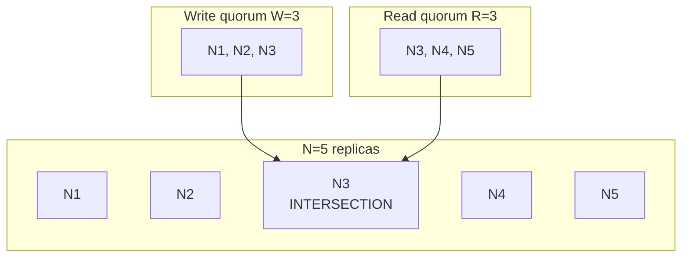
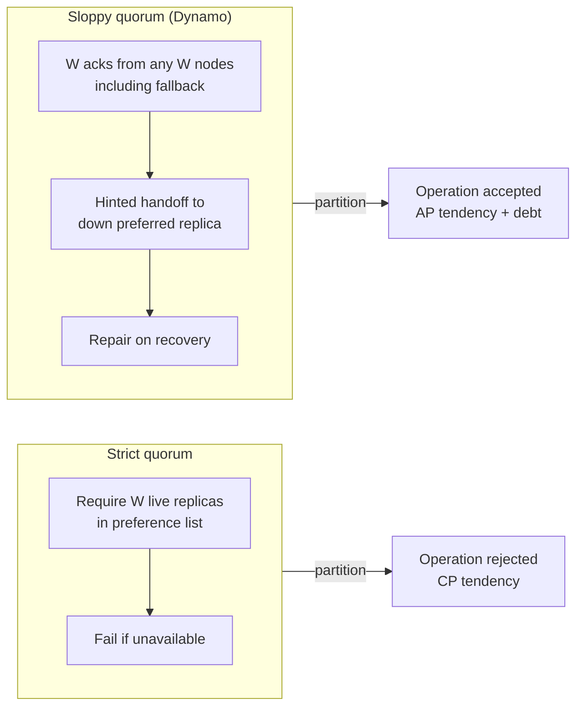
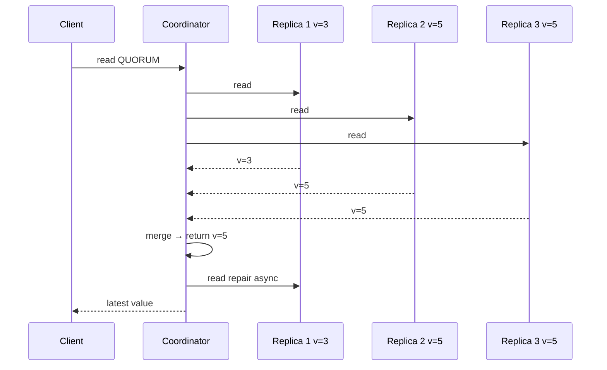

# Quorum Systems

## 1. Executive Summary

A **quorum system** is a collection of subsets (**quorums**) of replicas such that any two quorums **intersect**—share at least one member. In replicated storage, **quorum reads** and **quorum writes** use these sets to enforce that a read contacts enough replicas to overlap a prior write, enabling **consistency** properties, **fault tolerance**, and **controlled availability** tradeoffs without requiring every replica to participate in every operation.

The classic **N, R, W** formulation (from Gifford 1979 and popularized by Dynamo, DeCandia et al. 2007) parameterizes replica count **N**, read quorum **R**, and write quorum **W**. When **R + W > N**, read and write quorums intersect; when **W > N/2**, write quorums intersect—supporting **monotonic write** visibility and, under additional assumptions, **stronger** read guarantees. Quorum systems underpin Cassandra, DynamoDB (conceptually), Riak, and countless custom control planes.

Quorum correctness is a **safety** argument about set intersection; **liveness** (operations complete during failures) requires enough alive replicas to form a quorum. **Sloppy quorums** and **hinted handoff** (Dynamo) trade strict intersection during failure for **availability**—reintroducing eventual consistency obligations. This chapter covers formal intersection properties, N/R/W tuning, sloppy vs strict quorums, relationship to CAP, failure modes, performance, and principal-level design reasoning.

## 2. Why This Topic Matters

Quorum math appears in every principal-level system design interview involving replication: "How many nodes can we lose?" "Why R+W>N?" "Does QUORUM read guarantee latest value?" Wrong answers cause production incidents—stale reads after acknowledged writes, lost updates during partition, and mistaken belief that quorums imply linearizability.

Principal architects must:

- **Derive intersection** — Not memorize R+W>N without explaining **why** (pigeonhole principle on replica sets).
- **Map quorums to consistency models** — Intersection enables staleness bounds; does **not** alone imply linearizability without synchronization.
- **Design failure behavior** — Strict quorum rejects ops; sloppy quorum accepts with repair debt.
- **Tune per workload** — W=1, R=N for read-heavy; W=N, R=1 for write-once read-many—**decision criteria**, not universal rules.

Interview signal: explaining **sloppy quorum + hinted handoff** vs **Raft majority** shows operational depth beyond textbook formulas.

## 3. Problems Being Solved

| Problem | Without quorums | With quorum systems |
|---------|-----------------|---------------------|
| Single point of failure | One primary | Replicate to N; tolerate failures |
| Read stale after write | Always possible on random replica | R+W>N intersection—**potential** for fresh read |
| Unbounded write conflicts | All replicas accept independently | W majority serializes write acceptance |
| Capacity during failure | All-or-nothing | Subset quorums continue if \|quorum\| alive |
| Config flexibility | Fixed primary | Tune R, W per operation type |

Quorum systems solve **"which replicas must agree for an operation to count?"** They do **not** automatically solve **global ordering**, **linearizability**, or **transaction isolation** without additional protocols (leader, version vectors, consensus).

## 4. Assumptions and System Model

Assume **partial failure**, **asynchronous network**, and **crash-stop** replicas unless noted:

- **N replicas** hold copies of each key (or partition); **N** is replication factor.
- **Quorum sizes** R (read) and W (write) are positive integers with \(1 \leq R, W \leq N\).
- **Intersection property:** Read set \(Q_r\) and write set \(Q_w\) each of size R and W; if \(R + W > N\), then \(Q_r \cap Q_w \neq \emptyset\).
- **Versioning:** Replicas store **version metadata** (timestamp, vector clock, HLC)—intersection alone returns **some** overlapping replica, not necessarily **latest** without comparison.
- **CAP context:** Under partition, strict quorums may **fail to form** (CP behavior); sloppy quorums may **violate** strict intersection (AP behavior).

**Not assumed:** Synchronized clocks for correctness; Byzantine quorum without BFT protocol; automatic latest-value read without version merge on contacted replicas.

## 5. Essential Terminology

| Term | Definition |
|------|------------|
| **Quorum** | Subset of replicas sufficient to perform an operation. |
| **Replication factor (N)** | Total replicas for a partition/key. |
| **Read quorum (R)** | Number of replicas contacted for a read. |
| **Write quorum (W)** | Number of replicas that must ack a write. |
| **Intersection (R+W>N)** | Any read and write quorums share ≥1 replica. |
| **Majority** | Quorum with size \(> N/2\); any two majorities intersect. |
| **Sloppy quorum** | Use fallback replicas outside preference list when primary quorum unavailable (Dynamo). |
| **Hinted handoff** | Store write for temporarily down replica; deliver on recovery. |
| **Read repair** | Fix divergent replicas during read when versions differ. |
| **Anti-entropy** | Background reconciliation (Merkle trees, scans). |
| **Consistency level (CL)** | Cassandra/Dynamo terminology mapping to R, W. |
| **PACELC** | Latency vs consistency when no partition—quorum tuning affects both. |

**Mnemonic:** **R + W > N** = read and write "overlap somewhere"—not automatically "read is newest."

## 6. Core Mechanism

### Intersection proof (pigeonhole)

Replicas indexed \(1..N\). Write quorum \(Q_w\), \(|Q_w| = W\). Read quorum \(Q_r\), \(|Q_r| = R\). If \(R + W > N\), then \(|Q_r \cap Q_w| \geq R + W - N \geq 1\). Therefore some replica participated in both operations—**if** that replica has the latest write applied and is consulted correctly, read can return fresh value.

**Critical caveat:** Intersecting replica may be **stale** if writes not fully applied, async replication within quorum, or sloppy quorum changed membership.

### N, R, W tuning table

| Configuration | Intersection | Typical use | Caveat |
|---------------|--------------|-------------|--------|
| R+W > N | Yes | Balanced RW | Need version compare on R replicas |
| W > N/2 | Write-write intersect | Serialize writes | Reads may still be stale if R small |
| W=1, R=N | Read sees any write | Write-heavy rare read | Weak write durability if one node dies |
| W=N, R=1 | Fast read one node | Write-once config | Read often stale |
| R=W=N/2+1 (majority) | Both RW intersect | CP-style | Reject if majority down |



*Figure 1: With N=5, W=3, R=3, R+W>N guarantees at least one overlapping replica (N3). Read must use version merge to return latest among contacted nodes.*

### Strict vs sloppy quorum



*Figure 2: Strict quorums preserve intersection among live preference-list replicas; sloppy quorums sacrifice strict overlap for availability.*

### Read path with version merge



*Figure 3: Quorum read contacts R nodes; coordinator returns highest version; read repair propagates to lagging replica.*

## 7. Step-by-Step Walkthrough

**Scenario:** N=3, W=2, R=2, strict quorum, versions on each replica.

| Step | Event | Replica states | Notes |
|------|-------|----------------|-------|
| 0 | Initial | all v=0 | — |
| 1 | Write v=1 | N1=1, N2=1, N3=0 | W=2 ack from N1,N2 |
| 2 | Read QUORUM | contact N2,N3 | Intersection: N2 has v=1 |
| 3 | Merge | N2=1, N3=0 → return 1 | Read repair N3 |
| 4 | N3 down | — | — |
| 5 | Write v=2 | N1=2, N2=2 | W=2 without N3 |
| 6 | N3 recovers | N3=0 stale | Anti-entropy / repair needed |

**Walkthrough insight:** R+W>N with N=3,W=2,R=2: intersection size ≥1. Coordinator **must** compare versions—returning arbitrary intersecting replica without merge can still be wrong if intersecting node is lagging **and** a higher version exists on non-contacted node (when R too small). With R+W>N and proper merge among **all** R responses, latest among quorum is at least as new as any completed write quorum.

**Sloppy quorum walkthrough:** N3 down; write uses fallback N4 (outside normal set). Hint stored for N3. Strict intersection with pre-failure reads broken until repair—**eventual consistency** debt.

## 8. Invariants and Guarantees

| Property | Condition | Type |
|----------|-----------|------|
| **Read-write intersection** | R + W > N | Safety (set overlap) |
| **Write-write intersection** | W > N/2 | Safety (overlapping writes) |
| **Durability of ack'd write** | W replicas persisted | Safety—if those nodes survive |
| **Latest read** | R+W>N + version merge + sync apply | **Not automatic**—needs assumptions |
| **Linearizability** | Leader or sync + fencing | **Not** from quorum alone |
| **Operation completion** | ≥R, ≥W replicas alive | Liveness |

**Safety vs liveness:** Quorum intersection is combinatorial **safety**. Forming quorums under f failures requires **n > 2f** for majority—**liveness** constraint.

## 9. Failure Scenarios

### Scenario 1: Stale quorum read after write

**Setup:** W=2, R=2, N=3; write acks; third replica had old value; read hits two including stale if merge wrong.

**Effect:** Client sees old value post-write—violates user expectation; may violate linearizability.

**Mitigation:** SERIAL reads, leader reads, or accept eventual consistency explicitly.

### Scenario 2: Sloppy quorum during partition

**Setup:** Two partitions each accept writes with sloppy W.

**Effect:** Divergent versions—siblings; conflict resolution required.

**Mitigation:** Vector clocks, LWW with caution, application merge, or strict quorum reject.

### Scenario 3: Hinted handoff loss

**Setup:** Hint node crashes before delivering to preferred replica.

**Effect:** Write lost until anti-entropy—**durability** risk.

**Mitigation:** Hint replication, reduced W only with eyes open, monitoring hint queue depth.

### Scenario 4: Asymmetric R and W mis-tuning

**Setup:** W=1, R=1 for "speed."

**Effect:** No intersection guarantee; lost updates common.

**Mitigation:** R+W>N minimum for freshness arguments; document weak guarantees.

### Scenario 5: GC grace period violation (Cassandra)

**Setup:** Removed node before replication completes.

**Effect:** Permanent data loss for some keys.

**Mitigation:** Ops procedures, repair before decommission, appropriate replication factor.

## 10. Performance Characteristics

| Factor | Effect |
|--------|--------|
| Higher W | Write latency ↑ (more acks); durability ↑ |
| Higher R | Read latency ↑; fresher reads possible |
| R+W>N | Minimum coordination for intersection reads |
| Cross-datacenter W | WAN RTT dominates write path |
| Read repair | Read amplification; background write load |
| Hinted handoff | Extra writes on recovery bursts |

**Qualitative rule:** Quorum latency ≈ slowest of W or R replica responses in coordinator's set—often p99 tail matters. Do not quote universal ms figures; measure per datacenter topology.

**PACELC:** When no partition, low R and W improve **latency** at **consistency** cost—normal case tuning matters as much as partition case.

## 11. Scalability Limits

- **Coordinator hotspot:** Popular keys serialize through coordinator—separate from quorum math but coupled in Cassandra.
- **Replication factor ceiling:** Higher N improves fault tolerance but increases W cost if W scales with N.
- **Quorum cross-region:** W across regions makes writes latency-bound by WAN—often use LOCAL_QUORUM patterns.
- **BFT quorums:** Need \(3f+1\) nodes for f Byzantine faults—different intersection arithmetic.

**When quorums strain scale:** Global W=ALL for every write—consider per-operation CL downgrade for analytics reads.

## 12. Operational Considerations

- **repair:** Run `nodetool repair` / anti-entropy on schedule—quorums leave debt.
- **Monitor hinted handoff queue:** Backlog signals recovery pressure.
- **Decommission procedure:** Wait for streaming completion; verify quorum health.
- **Consistency Level per query:** Document service defaults; code review CL overrides.
- **Load test CL matrix:** ONE vs QUORUM vs ALL under node loss.

## 13. Security Considerations

- **Quorum bypass attack:** Compromised coordinator skips R replicas—use authenticated replication protocol.
- **Replica impersonation:** Attacker joins token ring—mutual TLS between nodes.
- **Read repair amplification:** Attacker triggers expensive repairs—rate limit.
- **Small W exploits:** W=1 allows single-node write acceptance—tamper target.

Quorum math assumes **correct**, **authenticated** replica responses.

## 14. Cost Considerations

- **Infrastructure:** Higher N increases storage and replication bandwidth linearly.
- **WAN quorums:** Cross-region W multiplies egress charges.
- **Read repair:** Hidden write load on read path—increases IOPS cost.
- **Engineering:** Tuning CL per use case; incident analysis of sibling conflicts.

**Savings:** R=1, W=quorum for read-heavy rarely updated data—**explicit** weak consistency acceptance.

## 15. Production Implementations

### Amazon Dynamo (paper)

Sloppy quorum, vector clocks, hinted handoff, Merkle tree anti-entropy—foundational **AP** quorum design (DeCandia et al., 2007).

### Apache Cassandra

Configurable CL: `ONE`, `QUORUM`, `LOCAL_QUORUM`, `ALL`, etc. `LOCAL_QUORUM` uses R+W per datacenter—**implementation** of Dynamo concepts.

### Amazon DynamoDB

Synchronous replication within region; quorum-like majority for durability—**managed**; product docs define consistency models (`ConsistentRead`).

### Riak / Basho

Quorum properties with sloppy quorum options—verify version-specific behavior.

### etcd / Raft

**Majority quorum** for log commit—strict; CP tendency; different from Dynamo sloppy quorum.

**Distinction:** **Consensus majorities** enforce **one log order**; **Dynamo quorums** enforce **overlap** without global order unless added.

## 16. Alternatives and Tradeoffs

| Mechanism | Consistency | Availability | Notes |
|-----------|-------------|--------------|-------|
| Strict R+W>N quorum | Bounded staleness potential | Reject if quorum down | Version merge required |
| Sloppy quorum + hints | Eventual | Higher during failure | Dynamo path |
| Single leader (Raft) | Strong order per log | Unavailable without majority | CP |
| Chain replication | Strong if head-tail | Head failure blocks | Different topology |
| No quorum (W=1,R=1) | Weak | Highest | Explicit trade |

**Tradeoff axis:** Strict quorums move toward **CP**; sloppy toward **AP**—align with CAP framing from prerequisite chapter.

## 17. Common Misconceptions

| Misconception | Reality |
|---------------|---------|
| "R+W>N means linearizable" | Intersection ≠ real-time order; need leader/sync. |
| "QUORUM read always latest" | Need version merge; async apply; sloppy quorum breaks strictness. |
| "Higher N always better" | More replicas = more failure modes and repair debt. |
| "Majority = quorum" | Majority is special quorum; general quorums need pairwise intersection design. |
| "Hinted handoff is free" | Durability and consistency debt until replay. |
| "W=ALL is always safest" | Availability suffers; one slow node blocks writes. |

## 18. Principal Architect Perspective

1. **Derive on whiteboard** — Show R+W>N proof in interviews; credibility signal.
2. **Per-operation CL** — Same cluster, different guarantees by API path.
3. **Sloppy vs strict** — Document partition behavior in ADR.
4. **Pair quorums with conflict handling** — Vector clocks, CRDTs, or LWW with eyes open.
5. **Don't conflate with consensus** — Quorum overlap ≠ total order.

Interview signal: **Dynamo vs Raft** quorum comparison without hand-waving.

## 19. Architecture Review Exercise

**Scenario:** Cassandra cluster, RF=3, default CL `ONE` for reads and `QUORUM` for writes. Finance team wants read-after-write for account balance.

**Review prompts:**

1. Does W=QUORUM, R=ONE satisfy RYW?
2. What CL for balance read after write?
3. Cost of `SERIAL` / `LOCAL_SERIAL`?
4. Sticky coordinator vs CL change?
5. Partition behavior with `LOCAL_QUORUM`?

**Expected findings:** R=ONE breaks freshness; recommend QUORUM or LOCAL_QUORUM reads; session stickiness; quantify latency impact.

## 20. Whiteboard Explanation

**90-second version:**

> "Quorum systems pick subsets of N replicas for reads and writes so sets overlap. Classic rule: R plus W greater than N guarantees read and write quorums share at least one node—that node saw some write, but you must compare versions across the R nodes and return the latest. W greater than N/2 makes write quorums overlap each other. Dynamo added sloppy quorums: if preferred nodes are down, accept writes on fallback nodes and hint to the real owner later—that trades availability for owing repair. Cassandra exposes this as consistency levels: ONE, QUORUM, ALL. Quorums don't give linearizability by themselves—you can still read stale values if you're not merging versions or you use sloppy quorums under partition. Raft uses strict majority quorum for a totally ordered log—different beast. Tune R and W per operation: reads that need freshness need higher R; write-heavy paths might use lower W only if you accept durability risk."

## 21. Interview Questions

1. **State the R+W>N rule and why it holds.**
   - *Signals:* Pigeonhole; intersection ≥ R+W-N.

2. **Does R+W>N imply linearizability?**
   - *Signals:* No; version merge, sloppy quorum, async.

3. **W > N/2 purpose?**
   - *Signals:* Write-write intersection; single latest write quorum overlap.

4. **Sloppy quorum vs strict?**
   - *Signals:* Fallback replicas, hints, availability vs overlap.

5. **Hinted handoff risks?**
   - *Signals:* Hint loss, consistency debt, recovery storms.

6. **Read repair purpose?**
   - *Signals:* Fix lagging replica on read path.

7. **Cassandra ONE vs QUORUM?**
   - *Signals:* R=1 vs R=majority; latency vs freshness.

8. **How many failures with N=5, majority?**
   - *Signals:* f=2 crash failures tolerable for majority quorum.

9. **Quorum vs Raft majority?**
   - *Signals:* Overlap vs total order log.

10. **W=1, R=N use case?**
    - *Signals:* Rare reads, fast writes, weak durability—explicit.

11. **LOCAL_QUORUM benefit?**
    - *Signals:* Avoid cross-DC WAN for quorum; scope per DC.

12. **Anti-entropy vs read repair?**
    - *Signals:* Background full compare vs eager on read.

13. **Sibling values in Dynamo?**
    - *Signals:* Concurrent writes; vector clock conflict.

14. **Design RF and CL for AP banking reads?**
    - *Signals:* Higher R, session tokens, or don't use AP for balances.

## 22. Interview Follow-Ups

1. **N=4, W=2, R=2—intersection?**
   - *Signals:* R+W=4, not >N; no guarantee—fix to R+W>4 or adjust.

2. **Geo-replication quorum strategy?**
   - *Signals:* LOCAL_QUORUM, per-region leaders, Causal+session.

3. **Calculate ops availability with f failures.**
   - *Signals:* Need n > w+f-1 style reasoning for strict W.

4. **Migrate ONE to QUORUM without outage.**
   - *Signals:* Gradual client rollout, latency testing.

5. **When choose chain replication over quorum?**
   - *Signals:* Strong order, different failure profile, head bottleneck.

## 23. Strong Answer Example

**Question:** "We have N=3, W=2, R=2. Are our reads linearizable?"

> "Not necessarily. R+W>N guarantees read and write quorums intersect, and if I merge versions from both read replicas I get at least as fresh a value as the latest completed write quorum—**under strict quorum** with no async lag within the write set. That still isn't **linearizability**, which requires real-time ordering: a read that starts after another client's write completes must see that write. A coordinator could return merged quorum value while missing a newer write still in flight, or sloppy quorum during partition could break overlap assumptions. For linearizable reads in Cassandra I'd look at `SERIAL` or lightweight transactions, or route through a single authoritative replica with consensus. I'd ask whether we use hinted handoff and what CL we use on reads versus writes. I'd document we have **quorum intersection freshness**, not linearizability, unless we add mechanisms."

## 24. Weak Answer Example

**Question:** "We have N=3, W=2, R=2. Are our reads linearizable?"

> "Yes, R+W is greater than N so reads are always consistent."

**Why weak:** Conflates intersection with linearizability; ignores version merge, sloppy quorum, and formal definitions.

## 25. Hands-On Exercise

**Lab:** `labs/lab-004-replicated-kv-store/` — replicated KV on **`:8095`**

```bash
cd labs/lab-004-replicated-kv-store
go test ./... -v
docker compose -p lab004 -f docker/docker-compose.yml up --build -d
chmod +x scripts/demo_kv.sh && ./scripts/demo_kv.sh
```

| Step | Endpoint | What happens |
|------|----------|--------------|
| 1 | `PUT /v1/keys/user:42` | Write to W=2 replicas on routed shard |
| 2 | `GET /v1/keys/user:42` | Quorum read — highest version |
| 3 | `GET /v1/keys/{key}/replicas` | Inspect per-replica versions |
| 4 | `POST /v1/chaos/replica-down` | Simulate replica failure |
| 5 | `GET /v1/keys/{key}?repair=true` | Read repair lagging replicas |

**Swagger:** http://localhost:8095/docs

### Engineer guide: how the local stack works

1. **3 shards × 3 replicas** — in-process simulation; each shard has independent N=3, R=2, W=2.
2. **Routing** — `hash(key) % 3` picks shard (consistent-hash stand-in from Lab 001).
3. **Write quorum** — `PUT` writes to first W **available** replicas; fails if fewer than W alive.
4. **Read quorum** — `GET` reads R replicas, returns max **version** (Dynamo-style).
5. **Read repair** — `?repair=true` pushes latest version to lagging replicas without incrementing version.

Pairs with [Lab 003 Raft](/docs/consensus/raft) — production systems use Raft **per shard** instead of hand-rolled quorum.

### Build-from-scratch exercise (optional)

1. Implement quorum intersection calculator: given N, R, W, return whether R+W>N.
2. Simulate 3 replicas; random W and R sets; verify intersection empirically.
3. Configure Cassandra or local docker cluster; run write with QUORUM, read with ONE—observe stale read.
4. Write ADR: CL matrix for your service's read/write paths.

## 26. Knowledge Check

1. Minimum intersection size when R+W>N? *(At least R+W-N, often 1.)*
2. Majority quorum size for N=5? *(3.)*
3. Sloppy quorum purpose? *(Availability when preferred nodes down.)*
4. Read repair when? *(Read detects version mismatch among quorum.)*
5. R+W>N sufficient for linearizability? *(No.)*
6. Dynamo sibling values cause? *(Concurrent partitioned writes.)*

## 27. Flashcards

| # | Front | Back |
|---|-------|------|
| 1 | R + W > N | Read/write quorums intersect (pigeonhole). |
| 2 | W > N/2 | Any two write quorums intersect. |
| 3 | Replication factor N | Total replicas per partition. |
| 4 | Sloppy quorum | Fallback replicas outside preference list. |
| 5 | Hinted handoff | Queue write for down replica; deliver later. |
| 6 | Read repair | Update stale replica during read. |
| 7 | Anti-entropy | Background replica reconciliation. |
| 8 | Gifford (1979) | Early quorum work on replicated data. |
| 9 | Dynamo (2007) | Sloppy quorum, vector clocks, AP design. |
| 10 | vs Raft majority | Quorum overlap ≠ total ordered log. |
| 11 | LOCAL_QUORUM | Quorum scoped to local datacenter. |
| 12 | Version merge | Coordinator picks latest among R responses. |

## 28. Cheat Sheet

```
QUORUM BASICS
  N = replicas
  R = read quorum size
  W = write quorum size
  R + W > N  →  read ∩ write ≠ ∅
  W > N/2    →  write ∩ write ≠ ∅

FRESH READ (strict, idealized)
  - R+W>N + version merge on R nodes
  - NOT linearizability

DYNAMO AP PATTERNS
  - Sloppy quorum + hinted handoff
  - Read repair + anti-entropy
  - Vector clock siblings

CASSANDRA CL (examples)
  ONE, QUORUM, ALL, LOCAL_QUORUM

VS CONSENSUS
  - Raft: majority + single log order
  - Dynamo: overlap + eventual merge

FAILURES
  - Stale ONE reads
  - Hint loss
  - Partition divergent writes
```

## 29. Related Concepts

- [CAP Theorem](/docs/consistency/cap-theorem) — prerequisite; partition tradeoffs framing quorum behavior
- [Eventual Consistency](/docs/consistency/eventual-consistency) — sloppy quorum outcome
- [Session Guarantees](/docs/consistency/session-guarantees) — client freshness layered on quorum reads
- [Linearizability](/docs/consistency/linearizability) — stronger than quorum intersection alone
- [Replication](/docs/replication/overview) — sync vs async replication paths
- [Vector Clocks](/docs/time-ordering-and-coordination/vector-clocks) — conflict detection with quorum writes

## 30. References

### Primary sources

- Gifford, D. K. (1979). ["Weighted Voting for Replicated Data."](https://www.microsoft.com/en-us/research/publication/weighted-voting-for-replicated-data/) *SOSP* — quorum intersection foundations.
- DeCandia, G., et al. (2007). ["Dynamo: Amazon's Highly Available Key-value Store."](https://www.allthingsdistributed.com/files/amazon-dynamo-sosp2007.pdf) *SOSP* — N/R/W, sloppy quorum, hinted handoff.
- Gilbert, S., & Lynch, N. (2002). ["Brewer's Conjecture and the Feasibility of Consistent, Available, Partition-Tolerant Web Services."](https://www.comp.nus.edu.sg/~gilbert/pubs/brewersConjecture.pdf) *SIGACT News* — CAP context for quorum choices.

### Engineering

- Apache Cassandra documentation — consistency levels and tunable consistency (**verify current revision**).
- Martin Kleppmann, *Designing Data-Intensive Applications* (O'Reilly) — Ch. 5–6 replication and quorums.
- Abadi, D. (2012). ["PACELC: Beyond the CAP Theorem."](https://www.cs.umd.edu/~abadi/papers/abadi-pacelc.pdf) — latency vs consistency tuning.

### Distinction

| Claim type | Source |
|------------|--------|
| R+W>N intersection | Combinatorial proof; Gifford; textbooks |
| Sloppy quorum behavior | DeCandia et al. (2007) |
| Cassandra CL semantics | Apache Cassandra project docs |
| Linearizability requires more than quorum | Herlihy & Wing; engineering interpretation |
