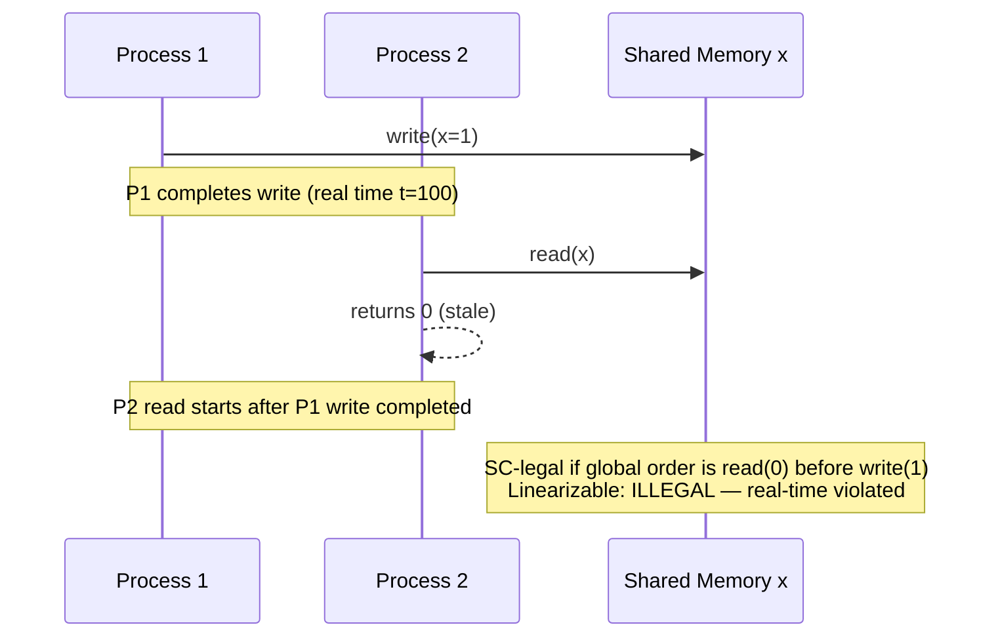
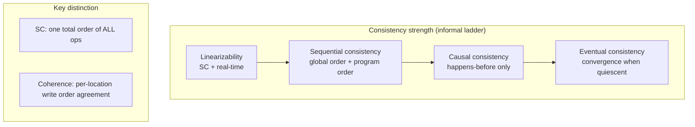
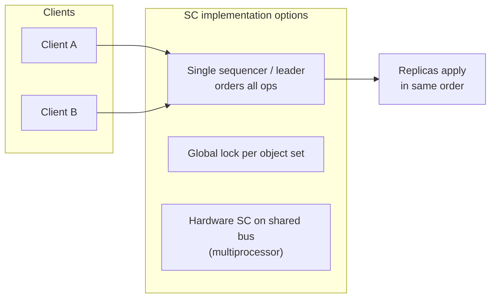

# Sequential Consistency

## 1. Executive Summary

**Sequential consistency** (SC) is a correctness condition for shared-memory multiprocessors and replicated systems in which the result of any execution is the same as if all operations from all processes were executed in some **single global sequential order**, and the operations of each individual process appear in that sequence in the order specified by its **program order** (Lamport, 1979). Unlike **linearizability**, sequential consistency does **not** require that this global order respect **real-time precedence** across different processes—only that each process's own operations stay in program order.

Sequential consistency sits in the consistency spectrum **between** linearizability (strongest practical single-object order with real-time constraint) and weaker models such as **causal consistency** or **processor consistency**. It is a **safety** property: it constrains which histories are legal, but does not by itself guarantee **liveness** (progress, availability, or bounded latency). Hardware memory models (x86 Total Store Order is often described as providing SC for normal aligned accesses in the programmer's mental model, with documented exceptions), distributed databases, and formal verification all reference SC when defining "intuitive" ordering without full linearizability.

This chapter defines sequential consistency formally, contrasts it with linearizability and serializability, explains memory-model and replication implementations, catalogs failure modes and performance tradeoffs, and frames principal-level interview reasoning. Understanding SC is essential when evaluating whether a system's "strong" claims mean linearizability, sequential consistency, or something weaker—and when diagnosing counterintuitive reorderings that violate user mental models but satisfy SC.

## 2. Why This Topic Matters

Principal architects encounter sequential consistency in three high-stakes contexts:

1. **Memory consistency models** — C++, Java, Go, and hardware ISAs define what reorderings compilers and CPUs may perform. Misunderstanding SC vs relaxed models causes subtle concurrency bugs that pass tests and fail in production.
2. **Distributed replication** — Some systems provide SC across replicas without real-time guarantees. Interviewers test whether you can explain why two clients may observe orders that seem to violate wall-clock intuition while still being sequentially consistent.
3. **Precision in ADRs** — Teams say "strong consistency" when they mean linearizability, SC, or serializability. Conflating these leads to wrong failover design, incorrect quorum assumptions, and SLA breaches.

Interview signal: candidates who can **draw a history** that is sequentially consistent but **not** linearizable demonstrate depth beyond slogan-level CAP knowledge. Candidates who claim "SC is the same as linearizability" fail precision tests at principal level.

Production relevance: SC is often **cheaper** than linearizability because it does not tie visibility to real-time overlap at clients. Systems may exploit that gap for performance—architects must know whether the gap is acceptable for the product invariant.

## 3. Problems Being Solved

| Problem | Without a defined order | With sequential consistency |
|---------|----------------------|----------------------------|
| Reasoning about concurrent programs | Ad hoc; every interleaving seems possible | All executions equivalent to one global sequence respecting per-process program order |
| Compiler and CPU optimizations | Unclear which reorderings are legal | SC defines the programmer-visible contract (or a target model for verification) |
| Multi-replica reads | Inconsistent cross-client narratives | One sequential story exists—though not necessarily real-time aligned |
| Formal verification | State explosion without constraints | SC reduces valid executions vs pure concurrency |
| Teaching and specification | Ambiguous "strong" claims | Named model with decades of literature |

Sequential consistency solves **"is there a single sequential story for all processes' operations?"** It does **not** solve **"does that story match wall-clock order across clients?"** (linearizability) or **"are multi-key transactions atomic?"** (serializability).

## 4. Assumptions and System Model

Assume the standard **shared-memory** or **replicated-register** model unless stated otherwise:

- **Processes** (or clients) each execute a **program**—a sequence of operations on shared objects.
- **Program order:** Within one process, operations appear in the order they appear in the program text (invoke before invoke for successive ops on overlapping objects, per Lamport's formulation).
- **Global sequential order:** There exists a total order of **all** operations from **all** processes such that each process's operations appear in program order in that sequence.
- **Object semantics:** Each operation's response is consistent with the sequential specification of the object type when operations are applied in the global order.
- **Asynchronous network** for distributed implementations; **crash-stop** processes unless discussing Byzantine variants.

**Not assumed:** Real-time precedence across processes (that is linearizability). Synchronized clocks. Multi-object atomic transactions unless a separate transactional layer provides them.

**Scope:** Sequential consistency is typically defined over a set of shared objects and all processes accessing them. A system may be SC for one namespace and weaker for another—document scope in ADRs.

## 5. Essential Terminology

| Term | Definition |
|------|------------|
| **Sequential consistency (SC)** | Exists a global sequential order of all ops; each process's ops appear in program order in that sequence. |
| **Program order** | Order of operations as issued by a single process in its code. |
| **Global order** | Total order combining operations from all processes. |
| **Linearizability** | SC **plus** real-time constraint: if op₁ completes before op₂ starts, op₁ precedes op₂ in the order. |
| **History** | Record of invocations and responses with timing intervals. |
| **Sequentially consistent history** | Equivalent to some sequential history respecting program order per process. |
| **Coherence (cache coherence)** | Writes to same address become visible in same order to all—**weaker** than SC in general. |
| **Processor consistency** | Weaker than SC; relaxes ordering among writes from different processors in some definitions. |
| **Causal consistency** | Preserves happens-before; does not require a single global order of all ops. |
| **Memory barrier / fence** | Instruction forcing visibility ordering—implementation mechanism, not a consistency model. |
| **TSO (Total Store Order)** | x86-like model: stores buffered; loads may see stale values briefly—**not identical** to SC in formal sense for all programs. |

**Mnemonic:** Sequential = **one global line** where **each player's moves stay in their script order**—but the line need not match **wall-clock** across players.

## 6. Core Mechanism

### Formal definition (Lamport, 1979)

A multiprocessor is **sequentially consistent** if the result of any execution is the same as if the operations of all processors were executed in some sequential order, and the operations of each individual processor appear in this sequence in the order specified by its program.

Equivalently for distributed histories: there exists a sequential history \(S\) equivalent to concurrent history \(H\) such that for every process \(P\), if operation \(a\) precedes \(b\) in \(P\)'s program order, then \(a\) precedes \(b\) in \(S\).

### Relationship to linearizability

Every **linearizable** history is **sequentially consistent**, but not vice versa. SC allows reordering across processes that violates real-time precedence.



*Figure 1: A read that returns a stale value after another process's write completed can be sequentially consistent but not linearizable.*

### SC vs coherence



*Figure 2: Sequential consistency implies a single global order; cache coherence alone does not guarantee SC for multi-location programs.*

### Implementation sketch (distributed)



*Figure 3: Practical SC often uses a serialization point (leader, lock, or hardware bus) that assigns a global order while not necessarily exposing real-time visibility.*

## 7. Step-by-Step Walkthrough

**Scenario:** Two processes, shared register `x` initially 0.

| Step | Process | Operation | Wall-clock |
|------|---------|-----------|------------|
| 1 | P1 | `write(x, 1)` | t=10–20 |
| 2 | P2 | `read(x)` → 0 | t=25–30 (starts after P1 write completes) |
| 3 | P2 | `write(x, 2)` | t=35–45 |
| 4 | P1 | `read(x)` → 2 | t=50–55 |

**Analysis:**

- **Linearizability:** **Violated** at step 2—P1's write completed before P2's read started; read must return 1.
- **Sequential consistency:** **Satisfied** by global order: `read_P2(0)`, `write_P1(1)`, `write_P2(2)`, `read_P1(2)`. Check program order: P1 sees `write` before `read` ✓; P2 sees `read` before `write` ✓.

**Walkthrough insight:** SC preserves **each process's** narrative; it does **not** preserve **cross-process real-time** intuition. Users who expect "if I finished writing before you read, you see my write" are assuming linearizability, not SC.

**Second scenario — SC violation:** P1: `write(x,1); read(y,0)`. P2: `write(y,1); read(x,0)`. No sequential order satisfies both program orders and register semantics—**not** SC. This is the classic **cross-process circular dependency** that SC forbids but relaxed models may allow under careful conditions.

## 8. Invariants and Guarantees

| Property | Type | Statement |
|----------|------|-----------|
| **Global sequential order** | Safety | ∃ total order of all operations equivalent to the concurrent execution |
| **Program order preservation** | Safety | Per-process operations appear in program order in the global order |
| **Object sequential spec** | Safety | Responses match applying ops in global order to sequential object spec |
| **Real-time respect** | **Not guaranteed** | SC does not require \(op_1 \rightarrow_\{rt\} op_2 \Rightarrow op_1\) before \(op_2\) |
| **Availability** | Liveness | **Not implied**—implementation may block |
| **Progress** | Liveness | **Not implied** |

**Safety vs liveness:** SC is purely a **safety** condition on histories. A system that halts forever after a correct prefix does not violate SC; it violates liveness.

## 9. Failure Scenarios

### Scenario 1: Mislabeling SC as linearizability

**Setup:** Product claims "strong consistency"; implementation provides SC via async replication with a single sequencer that batches reorderings.

**Effect:** Clients observe stale reads across processes after writes complete—support tickets, "impossible" screenshots, audit failures.

**Mitigation:** ADR with formal model name; client-facing docs; upgrade to linearizable reads where required.

### Scenario 2: Compiler reordering under relaxed memory model

**Setup:** C++ program uses `std::atomic` incorrectly; non-atomic data races; compiler reorders plain loads/stores.

**Effect:** Behavior not SC and not any well-defined model—undefined behavior.

**Mitigation:** Correct atomics, memory orders (`memory_order_seq_cst` for SC atomics), code review, ThreadSanitizer.

### Scenario 3: SC violated by independent per-key ordering

**Setup:** Sharded system orders operations per shard but not across shards; client performs multi-key sequence.

**Effect:** Global SC fails—no single order includes cross-shard program order correctly.

**Mitigation:** Cross-shard sequencer, transactions, or weaken advertised guarantee to per-shard SC.

### Scenario 4: Performance tuning breaks SC

**Setup:** Replica serves reads locally without contacting sequencer; writes go through leader.

**Effect:** Reads may violate global order relative to writes—SC broken unless reads are coordinated.

**Mitigation:** Route reads through sequencer or use versioned staleness bounds with explicit weaker model.

### Scenario 5: Testing gap

**Setup:** Single-threaded tests pass; multi-client integration tests use synchronized clocks assuming linearizability.

**Effect:** Production reveals SC-legal but user-hostile orderings.

**Mitigation:** Model-check histories; property-based concurrency tests; Jepsen with correct oracle selection.

## 10. Performance Characteristics

| Factor | SC vs linearizability | Notes |
|--------|----------------------|-------|
| Serialization | Both need global order for strict SC | SC may batch/reorder across processes within sequencer |
| Read latency | SC may allow local reads in some designs | Linearizability typically needs sync with order point |
| Hardware | SC on bus was historical default target | Modern CPUs use weaker models + fences for speed |
| Distributed | Single sequencer bottleneck similar to leader | SC without real-time check may skip some sync steps |

**Qualitative rule:** SC is **not free**, but implementations may omit real-time visibility checks that linearizable systems pay for. Do not invent benchmark numbers—measure your sequencer throughput and cross-region RTT.

**Memory model note:** `memory_order_seq_cst` in C++ provides SC **among seq_cst atomics**—not for the entire program if plain accesses race.

## 11. Scalability Limits

- **Global sequencer:** Single ordering point caps throughput for strict SC across all objects.
- **Sharding:** SC **per shard** scales; **global** SC does not without hierarchical ordering cost.
- **Geographic distribution:** Propagating a total order globally adds latency—SC does not remove physics.
- **Hardware:** SC across many sockets historically limited by bus/coherence protocol—industry moved to weaker models.

**When SC does not scale:** Planet-wide shared counter with strict SC on every op; all clients reading/writing one namespace through one orderer.

## 12. Operational Considerations

- **Document the model:** "Sequentially consistent per partition" vs "linearizable reads."
- **Monitor sequencer lag:** Backlog implies visible order delay even under SC.
- **Client SDK behavior:** Retries and timeouts may duplicate ops—idempotency interacts with ordering guarantees.
- **Upgrade paths:** Moving from eventual → SC → linearizability has distinct engineering costs—phase migrations in runbooks.
- **Incident response:** When users report "stale after write," check whether guarantee is SC (legal) or linearizable (bug).

## 13. Security Considerations

- **Order manipulation:** Attacker flooding sequencer delays others' visibility—DoS on ordering service.
- **Side channels:** SC systems with shared buffers may leak ordering via timing—threat model dependent.
- **Authorization:** SC does not imply access control—illegal ops must be rejected before entering the global order.
- **Split views:** If SC violated due to misconfiguration, security policies based on "latest write wins" may fail.

SC is a **safety** property on operation ordering, not confidentiality or integrity alone.

## 14. Cost Considerations

- **Latency:** Global ordering adds RTT to sequencer vs local eventual reads.
- **Infrastructure:** Dedicated ordering service (Kafka partition, Raft cluster, ZooKeeper).
- **Engineering:** Concurrency bugs from misunderstanding SC vs relaxed models are expensive to diagnose.
- **Opportunity cost:** Strict SC may block designs that need causal or eventual models for availability.

**Decision criterion:** Require SC when **all processes must agree on a single narrative** but **real-time cross-client visibility** is not mandatory. Prefer linearizability when user mental models assume wall-clock precedence.

## 15. Production Implementations

### Hardware (x86 TSO)

Intel/AMD documentation describes TSO-like behavior for normal memory operations. Programmers often reason with SC-like intuition; **formal SC** requires careful use of atomics and fences. **Implementation choice** by CPU vendor—not a distributed guarantee.

### ZooKeeper

Often described as providing **sequential consistency** for updates visible to each client in order, while **not** guaranteeing linearizable reads in all API usages without sync calls. **Verify** exact API contract in current documentation.

### Single-partition Kafka consumers

Records within a partition have a total order; consumers see messages in offset order—**analogous** to SC for that partition's stream, scoped.

### Spanner / external consistency

**Stronger** than SC—external consistency includes real-time transaction ordering (Corbett et al., 2012).

### Research and verification tools

TLA+, Alloy, and memory model checkers (CDSChecker, herd) use SC as baseline or comparison point.

**Distinction:** Separate **marketing "strong"** from **named model** in each product's documentation.

## 16. Alternatives and Tradeoffs

| Model | Relative strength | Cost | Use when |
|-------|-------------------|------|----------|
| Linearizability | Strongest (real-time + SC) | Highest coordination | Locks, coordination, user-visible "now" |
| Sequential consistency | Global order, program order | High | Shared-memory reasoning, some replicated state |
| Causal consistency | Happens-before only | Medium | Social graphs, collaborative editing |
| Processor consistency | Weaker than SC | Lower | Some parallel algorithms tolerate relaxations |
| Eventual consistency | Convergence only | Lowest | High availability, caches |

**Tradeoff axis:** SC buys a **single story** without buying **real-time alignment**—narrower than linearizability, broader than causal.

## 17. Common Misconceptions

| Misconception | Reality |
|---------------|---------|
| "SC = linearizability" | Linearizability adds real-time; SC is strictly weaker. |
| "SC means immediately visible" | Visibility timing is implementation-dependent; order exists, not necessarily instant. |
| "Coherent caches imply SC" | Coherence is per-location; SC is global across all locations and ops. |
| "SC solves database transactions" | Serializability is the transactional analog—related but distinct. |
| "seq_cst fixes all bugs" | Only applies to atomics marked seq_cst; data races on plain vars are UB. |
| "If each replica is consistent, the system is SC" | Independent replica orders without coordination do not compose to global SC. |

## 18. Principal Architect Perspective

1. **Name the model in ADRs** — Write "sequential consistency" not "strong" when that is the actual guarantee.
2. **Test cross-client expectations** — Product may assume linearizability while engineering delivers SC.
3. **Scope ordering** — Per-shard SC is a common, scalable compromise.
4. **Memory models matter** — Services in Go/Java still run on relaxed hardware; know your fences.
5. **Verification investment** — SC properties are model-checkable; use that for critical paths.

Interview signal: producing a **concrete history** separating SC from linearizability demonstrates principal-level precision.

## 19. Architecture Review Exercise

**Scenario:** Global configuration service: writes go to Raft leader; reads served from any follower without `read_index` or lease check. Marketing claims "strong consistency."

**Review prompts:**

1. Is follower read linearizable? Sequentially consistent?
2. Draw a history where write completes, another client's read returns old value—which model allows it?
3. Cost of linearizable reads on this architecture?
4. Can you offer SC with lower read latency? How?
5. What does the configuration use case actually require?

**Expected findings:** Follower reads likely violate linearizability; may violate SC depending on apply lag; align product language with Raft read APIs.

## 20. Whiteboard Explanation

**90-second version:**

> "Sequential consistency means you can line up every operation from every process into one global sequence, and each process's operations appear in that sequence in the same order they wrote them in code. Lamport defined this in 1979 for multiprocessors. It's weaker than linearizability, which also requires that if my operation finishes before yours starts in real time, mine comes first in the global order. SC allows your read to return stale data even after my write completed—that's legal for SC but illegal for linearizability. Hardware moved to weaker models for performance; we use fences and atomics where SC-like reasoning is needed. In distributed systems, SC often means a single sequencer orders ops. Always ask: do we need SC or linearizability for the user story?"

## 21. Interview Questions

1. **Define sequential consistency.**
   - *Signals:* Global order, program order per process, Lamport 1979.
   - *Red flags:* "Everyone sees the same value" without ordering formalism.

2. **SC vs linearizability?**
   - *Signals:* Real-time precedence; every linearizable history is SC.

3. **Give a history SC but not linearizable.**
   - *Signals:* Cross-process stale read after write completed.

4. **Is SC a safety or liveness property?**
   - *Signals:* Safety only.

5. **SC vs cache coherence?**
   - *Signals:* Coherence per address; SC global across program.

6. **SC vs serializability?**
   - *Signals:* Register/op level vs transaction equivalence.

7. **Does SC imply causal consistency?**
   - *Signals:* SC is stronger—global order implies happens-before preserved.

8. **How does x86 relate to SC?**
   - *Signals:* TSO, not formal SC for all programs; atomics/fences.

9. **Single leader assigning order—SC or linearizable?**
   - *Signals:* Depends on read path and real-time visibility—not automatic.

10. **Can SC be violated under partition?**
    - *Signals:* If both sides accept conflicting orders—depends on implementation; pure SC doesn't dictate partition behavior.

11. **Why did industry weaken memory models?**
    - *Signals:* Performance—store buffers, reordering, fence costs.

12. **How to test for SC violations?**
    - *Signals:* Litmus tests, model checkers, Jepsen with SC oracle.

13. **ZooKeeper—SC or linearizable?**
    - *Signals:* Nuanced—sync API, read modes; check documentation.

14. **When accept SC instead of linearizability?**
    - *Signals:* Don't need cross-client real-time; need global narrative; cost savings.

## 22. Interview Follow-Ups

1. **Design SC register with three replicas.**
   - *Signals:* Sequencer, total order broadcast, ordered apply.

2. **Client requires linearizability but system offers SC—bridge?**
   - *Signals:* Sticky routing, sync reads, version checks, scope reduction.

3. **Map SC to Kafka partition ordering.**
   - *Signals:* Per-partition total order; cross-partition not SC globally.

4. **Formal methods ROI for SC claims?**
   - *Signals:* TLA+ spec, model checking critical paths, audit evidence.

5. **Executive wants "strongest" consistency—recommendation?**
   - *Signals:* Decompose by use case; linearizable for locks, SC or weaker for feeds.

## 23. Strong Answer Example

**Question:** "Our replicated cache is sequentially consistent. Can a user see their friend's post before their own post appears?"

> "Under **sequential consistency**, there exists a global order where both posts' writes appear. If the user's own `write(myPost)` and `read(feed)` are on the **same process** in program order—write before read—the global order must place the write before the read, so they **must** see their own post. If the read and write are on **different clients** or the read is served from a lagging replica that breaks SC, different rules apply. SC does **not** guarantee real-time visibility across clients: a friend might see your post before you do if your read hits a stale replica and the system only guarantees SC in theory but not in this read path. I'd verify the read API: does it go through the sequencer? I'd also ask whether product needs **linearizability** or **read-your-writes** session guarantee—which is weaker than SC but targeted. I'd document per-operation guarantees in an ADR."

## 24. Weak Answer Example

**Question:** "Our replicated cache is sequentially consistent. Can a user see their friend's post before their own post appears?"

> "No, sequential consistency means everyone sees the same data at the same time."

**Why weak:** Conflates SC with linearizability and instantaneous global visibility; ignores program order rules and read-path implementation.

## 25. Hands-On Exercise

**Exercise: SC history construction**

1. Write two processes: P1 does `write(x,1); read(y)`; P2 does `write(y,1); read(x)`. Initial x=0, y=0.
2. Attempt to build a global order satisfying program order and register semantics.
3. Repeat with P2's read returning 1—valid SC?
4. Add real-time: P1's write completes before P2's read starts—does SC still allow read(x)=0 on P2?
5. Document: for your team's cache, which read API paths are SC, linearizable, or eventual.

**Success criteria:** Correct SC vs linearizability classification for at least three histories; ADR snippet with named model.

## 26. Knowledge Check

1. Who formalized sequential consistency? *(Lamport, 1979.)*
2. What two orders does SC combine? *(Global total order + per-process program order.)*
3. Is every linearizable execution SC? *(Yes.)*
4. Is every SC execution linearizable? *(No.)*
5. Does SC respect real-time across processes? *(No.)*
6. SC vs coherence? *(SC global; coherence typically per-memory-location.)*

## 27. Flashcards

| # | Front | Back |
|---|-------|------|
| 1 | Sequential consistency (informal) | One global op order; each process's ops keep program order. |
| 2 | Lamport (1979) | Original SC definition for multiprocessors. |
| 3 | vs linearizability | SC lacks cross-process real-time constraint. |
| 4 | Program order | Order of ops as issued by one process. |
| 5 | Global order | Total order over all processes' operations. |
| 6 | Safety property | SC constrains legal histories, not progress. |
| 7 | SC violation example | No sequential order satisfies all program orders (SB+SB litmus). |
| 8 | Hardware TSO | x86-like model; not identical to SC for all programs. |
| 9 | memory_order_seq_cst | C++ atomic order requesting SC among seq_cst ops. |
| 10 | vs serializability | Op-level vs transaction serial equivalence. |
| 11 | vs causal consistency | SC stronger—single total order vs happens-before. |
| 12 | Implementation pattern | Sequencer / leader assigns global order. |

## 28. Cheat Sheet

```
SEQUENTIAL CONSISTENCY
  - ∃ global total order of ALL ops
  - Each process: program order preserved in that order
  - SAFETY not liveness
  - WEAKER than linearizability (no real-time)

LINEARIZABILITY ⇒ SC
  SC ⇏ LINEARIZABLE (stale cross-process reads OK)

DISTRIBUTED
  - Often: single sequencer / Raft order
  - Read path determines actual observed guarantee

HARDWARE
  - Relaxed models + fences
  - seq_cst atomics for SC fragment

INTERVIEW
  - Draw SC-but-not-linearizable history
  - vs coherence, vs serializability
```

## 29. Related Concepts

- [Linearizability](/docs/consistency/linearizability) — prerequisite; adds real-time constraint to SC
- [Causal Consistency](/docs/consistency/causal-consistency) — weaker; preserves happens-before without global order
- [Eventual Consistency](/docs/consistency/eventual-consistency) — convergence without global order during updates
- [Ordering of Events](/docs/time-ordering-and-coordination/ordering-of-events) — program order and happens-before foundations
- [Consensus](/docs/consensus/overview) — total order broadcast for distributed SC implementations
- [Session Guarantees](/docs/consistency/session-guarantees) — client-centric weaker guarantees often layered on eventual stores

## 30. References

### Primary sources

- Lamport, L. (1979). ["How to Make a Multiprocessor Computer That Correctly Executes Multiprocess Programs."](https://lamport.azurewebsites.net/pubs/how-to-make-a.pdf) *IEEE Transactions on Computers* — original sequential consistency definition.
- Herlihy, M. P., & Wing, J. M. (1990). ["Linearizability: A Correctness Condition for Concurrent Objects."](https://cs.brown.edu/~mph/HerlihyW90/p90.html) *ACM TOPLAS* — positions linearizability relative to SC.
- Adve, S. V., & Gharachorloo, K. (1996). ["Shared Memory Consistency Models: A Tutorial."](https://www.hpl.hp.com/techreports/Compaq-DEC/WRL-95-7.pdf) *Computer* — memory model taxonomy.

### Textbooks and engineering

- Herlihy, M., & Shavit, N. (2020). *The Art of Multiprocessor Programming* (2nd ed.) — SC, linearizability, memory models.
- Martin Kleppmann, *Designing Data-Intensive Applications* (O'Reilly) — consistency spectrum in distributed systems.
- Boehm, H. J., & Adve, S. V. (2008). ["Foundations of the C++ Concurrency Memory Model."](https://www.hpl.hp.com/techreports/2008/HPL-2008-111.html) — practical memory orders.

### Distinction

| Claim type | Source |
|------------|--------|
| SC formal definition | Lamport (1979) |
| SC vs linearizability | Herlihy & Wing (1990) |
| x86 TSO behavior | Vendor ISA manuals—verify current revision |
| ZooKeeper consistency claims | Apache ZooKeeper documentation—implementation evolves |
