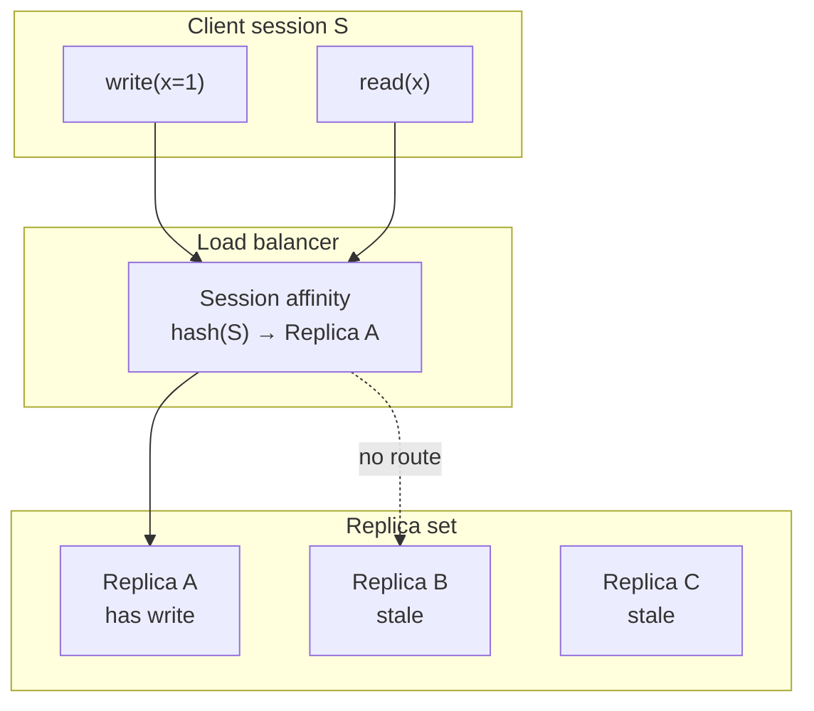
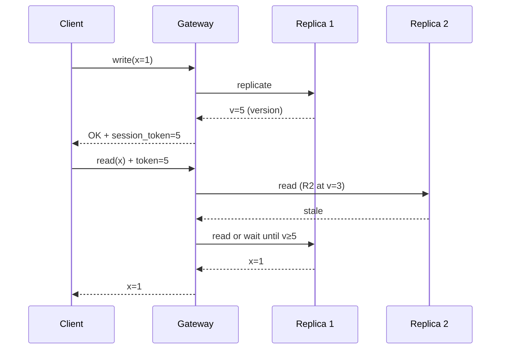
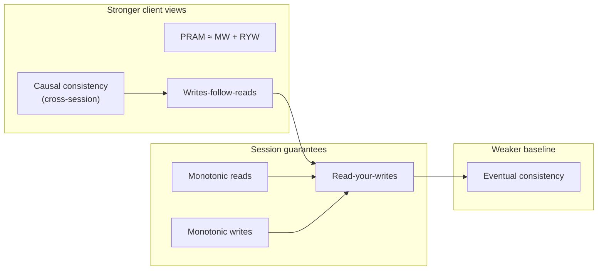

# Session Guarantees

## 1. Executive Summary

**Session guarantees** are **client-centric** consistency properties that constrain what a single client session can observe when interacting with a **weakly consistent** or **eventually consistent** replicated store. Unlike global models such as linearizability or sequential consistency, session guarantees do not require all clients to agree on a single real-time order—they bound **per-session anomalies** such as reading stale data immediately after one's own write, seeing values "go backward in time," or losing causal dependencies within a workflow.

The canonical taxonomy—**read-your-writes**, **monotonic reads**, **monotonic writes**, and **writes-follow-reads**—was articulated by Terry et al. (1994) for weakly consistent replicated data. **Causal consistency** can be viewed as extending session guarantees across sessions linked by communication. Production systems implement session semantics via **sticky routing** (same replica per session), **session tokens** or **version cookies** passed with requests, **gossiped client state**, or **synchronous local writes** with asynchronous global replication.

This chapter defines each guarantee formally and informally, explains implementation mechanisms and failure modes, relates session guarantees to eventual and causal consistency, and provides principal-level interview framing. Session guarantees are how architects deliver acceptable user experience on AP systems without paying the full cost of linearizability on every read.

## 2. Why This Topic Matters

Eventually consistent systems dominate large-scale web, mobile, and multi-region deployments. Pure eventual consistency allows **arbitrary temporary divergence**—including anomalies that violate basic user expectations: posting a comment and not seeing it, refreshing a page and seeing an older balance, or shuffling UI state backward after navigation.

Principal architects must:

- **Match guarantees to UX invariants** — "Users must see their own edits" is read-your-writes, not global linearizability.
- **Design client and gateway layers** — Session tokens in cookies, gRPC metadata, or CDN keys are architecture, not afterthoughts.
- **Debug "flaky" reports** — Often session stickiness lost at load balancer after deploy.
- **Negotiate with product** — Session guarantees are **cheaper** than strong consistency but **not free**; stateful routing has failover implications.

Interview failures: treating read-your-writes as automatic on Cassandra/Dynamo without `LOCAL_QUORUM` and routing; unable to list four session guarantees; conflating session guarantees with serializability.

## 3. Problems Being Solved

| Problem | Pure eventual consistency | With session guarantees |
|---------|---------------------------|-------------------------|
| Post-write read returns stale | Common on random replica | Read-your-writes prevents (within session) |
| Timeline "rewinds" on refresh | Possible | Monotonic reads prevent |
| Write reordering visible to author | Possible | Monotonic writes prevent |
| Read-dependent write based on stale read | Possible | Writes-follow-reads prevents |
| User distrust of AP system | High | Bounded anomalies improve UX |
| Cost of global linearizability | Prohibitive for all reads | Targeted per-session bounds |

Session guarantees solve **"what can one client reasonably expect during replication lag?"** They do **not** solve **global agreement**, **cross-user real-time visibility**, or **multi-key atomicity** without additional mechanisms.

## 4. Assumptions and System Model

Assume **partial failure**, **asynchronous replication**, and **multiple replicas** unless noted:

- **Sessions:** A client (or browser tab, mobile app instance) participates in a **session** identified explicitly or implicitly (connection, token, user id + device).
- **Operations:** Reads and writes on replicated objects; replication may lag arbitrarily before convergence.
- **Eventual consistency baseline:** If updates stop, replicas converge—session guarantees add **intermediate** constraints.
- **No synchronized clocks** required for basic session guarantees—implementation uses versions, tokens, or routing.

**Not assumed:** Global linearizability; transactional isolation across keys; automatic session guarantee without client/gateway cooperation.

**Session boundary matters:** Guarantees apply **within** a defined session. New session may observe stale state until convergence—document this for support teams.

## 5. Essential Terminology

| Term | Definition |
|------|------------|
| **Session** | Sequence of operations by one client context bound by an identifier or sticky route. |
| **Read-your-writes (RYW)** | Session never reads a value older than one it has written. |
| **Monotonic reads (MR)** | If a session reads value v of object x, later reads of x in session return ≥ v (no going backward). |
| **Monotonic writes (MW)** | Writes by a session applied in program order at all replicas (no visible reordering of session writes). |
| **Writes-follow-reads (WFR)** | Write in session never visible before reads in same session that informed it (causal-ish within session). |
| **Sticky session / sticky routing** | Route session's requests to replica subset that has seen session writes. |
| **Session token** | Opaque version vector or timestamp client sends; server returns fresher than token. |
| **Causal consistency** | Preserves happens-before across all clients—stronger than combined session guarantees in general. |
| **PRAM consistency** | Parallel RAM—MW + RYW equivalent in some formulations. |
| **Consistency window** | Time/data versions during which anomaly could occur without guarantees. |

**Mnemonic:** Session guarantees = **"my timeline makes sense to me"**—not **"everyone shares one timeline."**

## 6. Core Mechanism

### Terry et al. (1994) taxonomy

| Guarantee | Informal constraint |
|-----------|---------------------|
| **Read-your-writes** | Own writes visible to own subsequent reads |
| **Monotonic reads** | Never read older value than previously observed in session |
| **Monotonic writes** | Session's writes appear in issue order everywhere |
| **Writes-follow-reads** | Causal order between reads and dependent writes in session |

**Implication lattice (informal):** WFR ⇒ RYW in many setups; MR + MW together relate to **PRAM**. Causal consistency ⇒ all four for causally linked ops across sessions.

### Sticky routing implementation



*Figure 1: Sticky routing sends session reads to a replica that has applied the session's writes—classic read-your-writes implementation.*

### Session token / version cookie



*Figure 2: Gateway uses session token to reject or retry stale reads—works without strict stickiness if version metadata propagates.*

### Guarantee interaction diagram



*Figure 3: Session guarantees form a partial order above eventual consistency; causal consistency extends across sessions.*

## 7. Step-by-Step Walkthrough

**Scenario:** Social app, eventual consistent profile store, three replicas.

| Step | Action | Without guarantees | With RYW + MR |
|------|--------|-------------------|---------------|
| 1 | User updates avatar (write) | Ack from one replica | Write tracked in session state |
| 2 | User reloads profile (read) | Random replica may show old avatar | Read routed or token-checked → new avatar |
| 3 | Friend views profile | May see old avatar until replicate | **Allowed**—not session's read |
| 4 | User reloads again | Could theoretically see older if unlucky | MR blocks regression in session |

**Walkthrough insight:** Session guarantees are **intentionally asymmetric**—the author sees consistent session; viewers may lag. Product must accept or add stronger global guarantees for viewer paths.

**Failure walkthrough — lost stickiness:**

| Step | Action | Result |
|------|--------|--------|
| 1 | Deploy replaces load balancer; affinity cookie format changes | Stickiness lost |
| 2 | User writes bio | Replica B accepts |
| 3 | Next read hits Replica A | **RYW violated**—old bio shown |

**Mitigation:** Session tokens in API body, not only cookies; version check on every read path.

## 8. Invariants and Guarantees

| Guarantee | Type | Statement (within session S) |
|-----------|------|------------------------------|
| **Read-your-writes** | Safety | If S completes write w on x, subsequent read of x in S does not return state before w |
| **Monotonic reads** | Safety | Reads of x in S return non-decreasing versions |
| **Monotonic writes** | Safety | Writes by S appear in issue order at all replicas |
| **Writes-follow-reads** | Safety | If read r precedes write w in S, w not visible before r's value to any client |
| **Cross-session freshness** | **Not guaranteed** | Other sessions may observe stale state |
| **Availability** | Liveness | **Not implied** by session guarantees alone |

**Safety vs liveness:** Session guarantees are **safety** properties on observable histories per session. Liveness (eventual convergence) comes from eventual consistency baseline.

## 9. Failure Scenarios

### Scenario 1: Load balancer affinity loss

**Setup:** Sticky sessions only via cookie; blue/green deploy drops affinity table.

**Effect:** RYW violations; user reports "my save didn't work."

**Mitigation:** Token in application layer; dual-write affinity during migration; synthetic canaries post-deploy.

### Scenario 2: Multi-region without session state

**Setup:** User writes in us-east, reads via eu-west CDN without token forwarding.

**Effect:** Session guarantees broken across regions.

**Mitigation:** Global session store for tokens; geo-DNS with user home region; accept cross-region staleness explicitly.

### Scenario 3: Mobile offline queue

**Setup:** Writes queued locally; reads from server without merging local queue.

**Effect:** RYW violated—server read ignores pending local write.

**Mitigation:** Read path merges local + remote; CRDT or explicit pending-write overlay.

### Scenario 4: Microservices break session scope

**Setup:** API gateway provides RYW on profile service; feed service reads different replica set without token.

**Effect:** End-to-end UX violates user expectation though one service is "correct."

**Mitigation:** Propagate session context (W3C trace + version headers) across services.

### Scenario 5: Clock-based session tokens

**Setup:** Token = wall-clock timestamp; skew causes false stale or acceptance of old data.

**Effect:** MR or RYW violations under clock drift.

**Mitigation:** Logical versions, vector clocks, or hybrid logical clocks—not raw NTP for correctness.

## 10. Performance Characteristics

| Mechanism | Latency impact | Throughput impact |
|-----------|----------------|-------------------|
| Sticky routing | Low if replica local | Hot spots on popular users' replica |
| Session token + retry | Extra RTT on stale read | Retry storms if replicas lag |
| Sync local write (RYW) | Write waits for designated replica | Limits write path flexibility |
| Central session version store | Lookup RTT per read | Bottleneck if not sharded |

**Qualitative rule:** Session guarantees are **cheaper than linearizable reads** but may **concentrate load** on sticky replicas. Measure tail latency for power users with hot sessions.

**CDN caveat:** Edge caches break MR unless **cache keys include session token** or **private cache** per user.

## 11. Scalability Limits

- **Sticky hot spots:** Celebrity session pins one replica—uneven load.
- **Token store:** Global session metadata must shard by session id.
- **Replica memory:** Tracking per-session write set does not scale unbounded—TTL and scope limits.
- **Stateless gateway ideal:** Pure stickiness conflicts with elastic scale-out—prefer version tokens.

**When session guarantees strain scale:** Viral event with all users writing and reading—everyone needs RYW; consider regional write leaders with local session scope.

## 12. Operational Considerations

- **Deploy runbooks:** Verify affinity and token compatibility across releases.
- **Monitor RYW SLO:** Synthetic client writes then reads; alert on violation.
- **Support playbooks:** "Log out and back in" resets session—document side effects.
- **Cache-Control headers:** `private` for user-specific RYW paths.
- **Incident correlation:** Affinity loss often follows LB or K8s ingress changes.

## 13. Security Considerations

- **Session token forgery:** Attacker inflates version to force expensive read paths or bypass caches—sign tokens.
- **Session fixation:** Binding session to attacker-controlled replica route—validate server-side session id.
- **Information leakage:** Monotonic version in token reveals write activity—encrypt or use opaque server-side state.
- **Cross-tenant stickiness bug:** Wrong affinity exposes another tenant's RYW path—**critical** isolation review.

Session guarantees interact with **auth session** (login)—keep replication consistency session separate or unified deliberately.

## 14. Cost Considerations

- **Infrastructure:** Session store, stickier load balancers, reduced CDN cache hit rate for personalized content.
- **Engineering:** Gateway logic, cross-service header propagation, testing matrices.
- **Opportunity cost:** Cannot cache aggressively at edge for personalized reads.
- **Savings vs linearizability:** Avoid global quorum read on every request—often 10×+ latency reduction **in principle**; measure your stack.

**Decision criterion:** Pay for session guarantees when **author-facing UX** requires freshness; use pure eventual for aggregate metrics and public caches.

## 15. Production Implementations

### Amazon DynamoDB

**ConsistentRead** on same item after write in same region provides read-your-writes for that item—**scoped product guarantee**. Global tables add replication lag caveats—check current AWS documentation.

### Apache Cassandra

`LOCAL_QUORUM` with **token-aware routing** to write coordinator and replica set supports practical RYW for a session when clients reuse policy and datacenter context—**implementation pattern**, not automatic.

### CouchDB / Cloudant

User database per user naturally provides RYW for that database—**data model choice** as guarantee.

### Facebook TAO (described in literature)

Cache invalidation and sticky patterns for social graph—**engineering blog** details; verify against published architecture.

### CDN + origin

`Vary: Cookie` or edge side includes for personalized fragments—session-aware caching **implementation choice**.

**Distinction:** Product docs state **scope** (per item, per region, per table)—architects must not over-generalize.

## 16. Alternatives and Tradeoffs

| Approach | Guarantees | Cost | Use when |
|----------|------------|------|----------|
| Session guarantees | Per-session bounds | Medium | AP stores, user-authored content |
| Linearizable reads | Global real-time | High | Financial balances, inventory |
| Causal consistency | Cross-session happens-before | Medium-high | Collaborative editing, comments |
| Client-side CRDT | Local merge semantics | Engineering complexity | Offline-first apps |
| Strong leader reads | Near-linearizable per key | Leader RTT | When simplicity beats stickiness |

**Tradeoff:** Session guarantees **do not help** viewers see author's latest content immediately—need push, polling, or stronger model.

## 17. Common Misconceptions

| Misconception | Reality |
|---------------|---------|
| "Eventual consistency includes RYW" | Pure eventual allows any stale read—RYW must be added. |
| "Sticky sessions alone guarantee RYW" | Replica may not have write if stickiness wrong replica or async lag. |
| "RYW = linearizability" | RYW is per-session; others may see stale; no real-time global order. |
| "JWT auth gives session guarantees" | Auth ≠ replication session; separate mechanisms. |
| "QUORUM read gives RYW" | Quorum may still be stale without versioning or routing to write replica. |
| "MR implies RYW" | Related but distinct—formal definitions differ; both often implemented together. |

## 18. Principal Architect Perspective

1. **End-to-end session** — Trace from browser through API mesh to database; weakest link wins.
2. **Explicit session id** — Prefer application-level token over opaque LB cookie only.
3. **Test on deploy** — RYW canaries in CI/CD pipeline.
4. **Product communication** — "Your edits appear instantly to you; others may see delay" — accurate.
5. **Upgrade path** — Session guarantees → causal → linearizable per entity as business demands.

Interview signal: explaining **how** to implement RYW without linearizability separates principal candidates.

## 19. Architecture Review Exercise

**Scenario:** Multi-region comments API. Writes go to local region (eventual global replication). Reads through geo-routed load balancer with no session token. Users complain comments "disappear" after post.

**Review prompts:**

1. Which session guarantee is violated?
2. Design minimal fix preserving AP availability.
3. Cost of linearizable reads for authors only?
4. Should viewers have MR on comment thread?
5. Mobile offline—additional guarantees needed?

**Expected findings:** Missing RYW; add session token or sticky write coordinator; consider causal for thread ordering.

## 20. Whiteboard Explanation

**90-second version:**

> "Session guarantees are per-client promises on weakly consistent systems. Terry et al. defined four: read-your-writes—you never see stale data relative to your own writes; monotonic reads—your view never goes backward; monotonic writes—your writes appear in order; writes-follow-reads—causal order within your session. They don't make the whole system linearizable—other users can still see old data. You implement them with sticky routing to a replica that has your writes, or session tokens that force reads at least as fresh as your last write. They're the standard way to make eventual consistency usable for logged-in users without quorum reads on every request. Failures happen when load balancers lose affinity after deploy or CDNs cache personalized pages without private cache keys."

## 21. Interview Questions

1. **Name four session guarantees.**
   - *Signals:* RYW, MR, MW, WFR; Terry et al.

2. **Define read-your-writes.**
   - *Signals:* Own subsequent reads see own writes; session scoped.

3. **How implement RYW without linearizability?**
   - *Signals:* Sticky replica, version token, local write ack + route.

4. **RYW vs linearizability?**
   - *Signals:* Per-session vs global real-time order.

5. **What breaks RYW on deploy?**
   - *Signals:* Lost stickiness, cookie change, new replica set.

6. **Monotonic reads vs RYW?**
   - *Signals:* MR prevents regression; RYW about own writes specifically.

7. **Session guarantees on CDN?**
   - *Signals:* Private cache, Vary headers, edge cannot serve stale personalized.

8. **Cassandra and RYW?**
   - *Signals:* LOCAL_QUORUM, token-aware policy—not default ONE.

9. **Cross-service session propagation?**
   - *Signals:* Headers, gateway, shared session version store.

10. **MR without RYW possible?**
    - *Signals:* Theoretically distinct anomalies; discuss formal definitions.

11. **Writes-follow-reads use case?**
    - *Signals:* Read balance then withdraw; must not act on stale balance.

12. **Cost of sticky sessions at scale?**
    - *Signals:* Hot spots; prefer stateless tokens.

13. **Mobile offline and RYW?**
    - *Signals:* Merge local queue with server reads.

14. **Test session guarantees?**
    - *Signals:* Write-read loop canary, Jepsen session tests.

## 22. Interview Follow-Ups

1. **Design comment system guarantees for authors vs readers.**
   - *Signals:* RYW for author; eventual for global feed; push notifications.

2. **Migrate from stickiness to tokens—steps?**
   - *Signals:* Dual support, gradual rollout, monitor violations.

3. **Session guarantees + CRDTs?**
   - *Signals:* Local merge satisfies strong local semantics; replication separate.

4. **GDPR delete and session tokens?**
   - *Signals:* Invalidate tokens; session state TTL.

5. **Executive wants Instagram-level freshness globally—response?**
   - *Signals:* Decompose; session vs global; fanout, caches, PACELC.

## 23. Strong Answer Example

**Question:** "We use eventual consistency. Do we need session guarantees?"

> "If **logged-in users** write and immediately read their data, **yes**—pure eventual allows a read from a lagging replica right after an acknowledged write, which feels like data loss. Minimum I'd specify **read-your-writes** for author paths and **monotonic reads** so refresh doesn't rewind the UI. Implementation: pass a **session token** with last write version from API gateway to storage layer; if read replica is behind token, retry or route to coordinator. Sticky sessions alone are fragile across deploys—I wouldn't rely only on LB cookies. Viewers of someone else's content can stay eventual unless product needs real-time— that's cheaper. I'd document guarantees per API and add synthetic **write-read** probes in monitoring. Cross-service, propagate the token in internal headers so one service doesn't break the chain."

## 24. Weak Answer Example

**Question:** "We use eventual consistency. Do we need session guarantees?"

> "No, eventual consistency means it will be consistent eventually, so users just need to wait."

**Why weak:** Ignores UX requirements, author-facing anomalies, and standard industry practice on AP systems.

## 25. Hands-On Exercise

**Exercise: Session guarantee validation**

1. Deploy three-node replica set (or use local Cassandra/Dynamo emulator).
2. Write from client A; immediately read without stickiness—record stale rate.
3. Add sticky routing or version token; remeasure.
4. Simulate LB reset mid-session; observe violations.
5. Write ADR: which APIs require RYW/MR and implementation choice.

**Success criteria:** Demonstrated RYW violation and fix; documented session token format.

## 26. Knowledge Check

1. Four session guarantees? *(RYW, MR, MW, WFR.)*
2. Terry et al. year? *(1994.)*
3. RYW scope? *(Single session—not global.)*
4. Sticky routing pitfall? *(Deploy affinity loss, wrong replica.)*
5. RYW vs consistent read in DynamoDB? *(Product-scoped strong read per item—related but not identical to session model.)*
6. MR prevents what UX bug? *(Timeline going backward on refresh.)*

## 27. Flashcards

| # | Front | Back |
|---|-------|------|
| 1 | Read-your-writes | Session reads never before own writes. |
| 2 | Monotonic reads | Session never reads older value than before. |
| 3 | Monotonic writes | Session writes visible in issue order. |
| 4 | Writes-follow-reads | Dependent write not visible before causally prior read. |
| 5 | Terry et al. (1994) | Canonical session guarantees paper. |
| 6 | Sticky routing | Affinity routes session to replica with writes. |
| 7 | Session token | Version cookie forcing minimum freshness on read. |
| 8 | vs linearizability | Session-local, not global real-time. |
| 9 | vs eventual | Session guarantees constrain interim anomalies. |
| 10 | PRAM consistency | Often MW + RYW combined. |
| 11 | CDN + RYW | Private cache or no edge cache for personalized reads. |
| 12 | Cross-region | Token must propagate or RYW breaks. |

## 28. Cheat Sheet

```
SESSION GUARANTEES (Terry et al.)
  RYW  - see own writes
  MR   - no read goes backward
  MW   - writes appear in order
  WFR  - reads before dependent writes

IMPLEMENT
  - Sticky replica / coordinator
  - Session version token + retry
  - ConsistentRead (product-scoped)
  - Propagate context across services

FAILURES
  - LB affinity loss on deploy
  - CDN public cache
  - Cross-region without token
  - Clock-based tokens

NOT PROVIDED
  - Global freshness for other users
  - Linearizability
  - Multi-key transactions
```

## 29. Related Concepts

- [Eventual Consistency](/docs/consistency/eventual-consistency) — prerequisite baseline model
- [Causal Consistency](/docs/consistency/causal-consistency) — cross-session happens-before
- [Linearizability](/docs/consistency/linearizability) — global strong alternative
- [Quorum Systems](/docs/consistency/quorum-systems) — replication mechanics underlying read freshness
- [Vector Clocks](/docs/time-ordering-and-coordination/vector-clocks) — version metadata for session tokens
- [Caching](/docs/caching/overview) — edge cache interaction with session semantics

## 30. References

### Primary sources

- Terry, D. B., et al. (1994). ["Session Guarantees for Weakly Consistent Replicated Data."](https://www.microsoft.com/en-us/research/publication/session-guarantees-for-weakly-consistent-replicated-data/) *PDIS* — definitions of RYW, MR, MW, WFR.
- Tanenbaum, A. S., & van Steen, M. (2017). *Distributed Systems* (3rd ed.) — PRAM and session-style consistency.

### Engineering and production

- DeCandia, G., et al. (2007). ["Dynamo: Amazon's Highly Available Key-value Store."](https://www.allthingsdistributed.com/files/amazon-dynamo-sosp2007.pdf) *SOSP* — sloppy quorum, eventual model context for session patterns.
- Martin Kleppmann, *Designing Data-Intensive Applications* (O'Reilly) — Ch. 7 read-your-writes and monotonic reads.
- AWS DynamoDB documentation — `ConsistentRead` semantics (**verify current docs**).

### Distinction

| Claim type | Source |
|------------|--------|
| Four session guarantees | Terry et al. (1994) |
| Implementation patterns | Engineering practice; validate per product |
| Cassandra RYW patterns | DataStax / Apache docs—driver and CL dependent |
