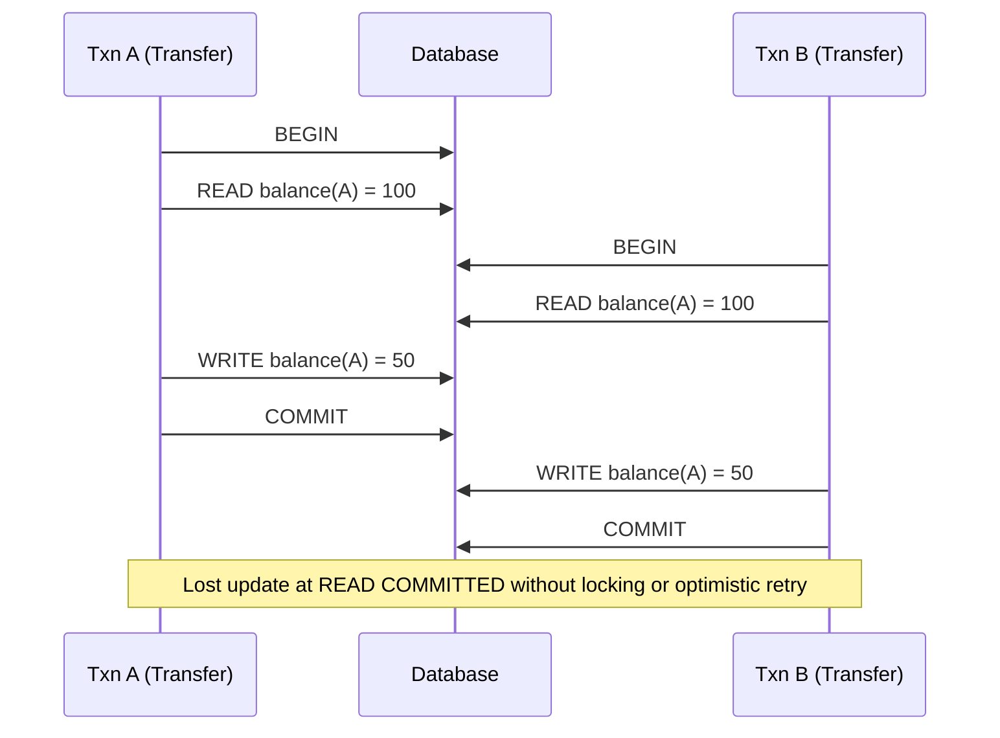
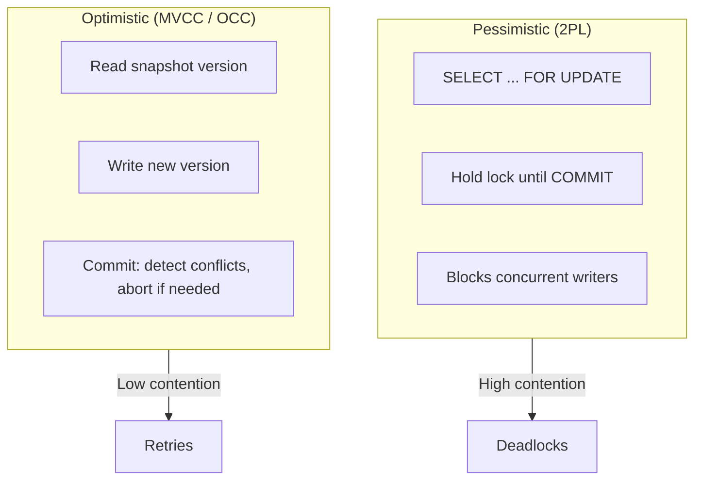
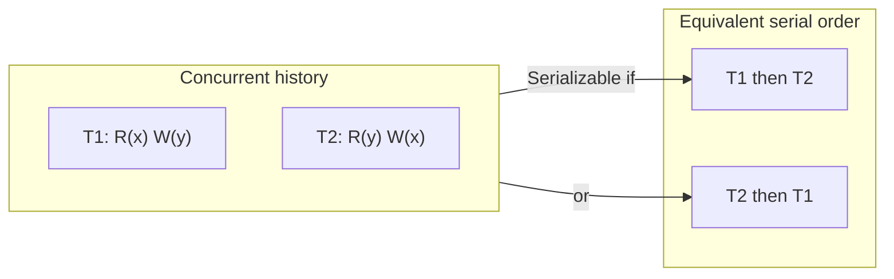

# ACID and Isolation Levels

## 1. Executive Summary

**ACID**—Atomicity, Consistency, Isolation, and Durability—is the foundational contract between application developers and transactional storage systems. **Atomicity** ensures a transaction's effects are all-or-nothing. **Consistency** (in the database sense) means each transaction preserves application-defined integrity constraints when executed alone. **Isolation** governs how concurrent transactions' intermediate states are visible to one another. **Durability** guarantees committed data survives process crashes and media failures within the system's stated recovery model.

**Isolation levels** are standardized (primarily via SQL and the ANSI SQL isolation definitions, with known ambiguities) as a ladder from weak to strong: **READ UNCOMMITTED**, **READ COMMITTED**, **REPEATABLE READ**, and **SERIALIZABLE**. Each level prevents specific **anomalies**: dirty reads, non-repeatable reads, phantoms, and serialization anomalies. **Serializability** is the gold standard for isolation: the concurrent execution must be equivalent to some serial order of transactions.

This chapter covers ACID semantics, isolation level definitions, anomaly catalogs, the difference between **pessimistic locking** and **multi-version concurrency control (MVCC)**, how production databases map SQL isolation names to actual behavior, failure modes when isolation is mis-specified, and principal-level interview framing. Understanding ACID and isolation is prerequisite to MVCC, distributed transactions, sagas, and the transactional outbox pattern.

## 2. Why This Topic Matters

Principal architect interviews use transactions as a **correctness precision test**:

- Can you define each ACID property without conflating database "consistency" with CAP consistency?
- Can you name which anomalies each isolation level prevents—and which it does **not**?
- Do you know that **REPEATABLE READ** in PostgreSQL prevents phantoms but **REPEATABLE READ** in MySQL InnoDB (historically) may not?
- Can you explain when **snapshot isolation** is weaker than **serializability** (write skew)?

Production incidents from weak isolation include double-spend windows, inventory oversell, incorrect audit trails, and "impossible" balances visible to concurrent readers. Architects who default every service to READ COMMITTED without analyzing invariants design subtle data corruption that surfaces only under concurrent load.

Conversely, architects who demand SERIALIZABLE everywhere pay latency and deadlock costs without quantifying which invariants actually require it. Principal-level judgment is **matching isolation to invariants**, not reciting ACID mnemonics.

## 3. Problems Being Solved

| Problem | Without transactions | With ACID + appropriate isolation |
|---------|---------------------|-----------------------------------|
| Partial updates | Money debited but not credited | Atomicity rolls back entire transaction |
| Concurrent lost updates | Two writers overwrite each other | Isolation + locking or MVCC prevents or detects |
| Dirty reads | Read uncommitted data that rolls back | READ COMMITTED+ hides uncommitted writes |
| Non-repeatable reads | Same query returns different rows | REPEATABLE READ+ stabilizes read set |
| Phantom reads | New rows appear in repeated range scan | SERIALIZABLE or predicate locking |
| Constraint violations | Concurrent txs break invariants | Serializable execution or explicit constraints |
| Crash mid-write | Torn pages, unknown state | Durability + WAL recovery |

Transactions solve **local (single-database) atomicity and concurrent correctness** for a defined set of operations. They do **not** automatically solve **distributed** atomicity across services—that requires 2PC, sagas, or outbox patterns covered in later chapters.

## 4. Assumptions and System Model

Assume a **single logical database** with **crash-recovery** storage unless stated otherwise:

- **Transactions** are sequences of reads and writes with BEGIN/COMMIT/ROLLBACK boundaries.
- **Concurrency** arises from multiple transactions interleaving operations on shared data.
- **Storage** uses a write-ahead log (WAL) or equivalent for durability—implementation detail varies by engine.
- **Isolation** is defined over **histories** of transaction operations; a history is **serializable** if equivalent to some serial execution.
- **Failures:** Process crash (recoverable via WAL); **not** Byzantine unless discussing BFT databases.

**Not assumed:** Distributed consensus across nodes (that is replication/consensus territory). Synchronized clocks for ordering (logical transaction IDs or MVCC timestamps are typical). That SQL standard isolation names map identically across vendors—**they do not**; always verify engine behavior.

**Scope:** ACID applies within one database instance or one shard's transactional boundary. Cross-shard transactions are a separate coordination problem.

## 5. Essential Terminology

| Term | Definition |
|------|------------|
| **Atomicity** | All operations in a transaction succeed together or none persist. |
| **Consistency (C in ACID)** | Transaction preserves integrity constraints; database moves between valid states. |
| **Isolation** | Degree to which concurrent transactions' effects are separated. |
| **Durability** | Committed data survives crashes per recovery guarantees. |
| **Isolation level** | Named policy (READ UNCOMMITTED … SERIALIZABLE) defining allowed anomalies. |
| **Dirty read** | Reading uncommitted data from another transaction. |
| **Non-repeatable read** | Re-reading a row sees a different value within one transaction. |
| **Phantom read** | Re-running a range query sees new rows inserted by another transaction. |
| **Write skew** | Two transactions read overlapping data, write disjoint rows, violating an invariant serial execution would prevent. |
| **Serializability** | Concurrent history equivalent to some serial order of transactions. |
| **Snapshot isolation (SI)** | Each transaction reads from a consistent snapshot; writes conflict on commit. |
| **Predicate lock** | Lock on a logical condition (range), not just a row. |
| **Two-phase locking (2PL)** | Acquire locks before access; release after commit—basis of many serializable implementations. |

**Mnemonic:** ACID = **All** or nothing, **Correct** invariants, **Invisible** intermediate states (isolation), **Durable** after commit.

## 6. Core Mechanism

### ACID properties in depth

| Property | Mechanism (typical) | What it does **not** guarantee |
|----------|---------------------|-------------------------------|
| Atomicity | Undo log / WAL rollback | Cross-service atomicity |
| Consistency | CHECK constraints, FK, app logic | CAP "consistency" |
| Isolation | Locks, MVCC snapshots, SSI | Global linearizability across shards |
| Durability | WAL fsync, replication | Survival of total datacenter loss without DR |

### Isolation level anomaly matrix

| Level | Dirty read | Non-repeatable read | Phantom | Serialization anomalies |
|-------|------------|---------------------|---------|-------------------------|
| READ UNCOMMITTED | Allowed | Allowed | Allowed | Allowed |
| READ COMMITTED | Prevented | Allowed | Allowed | Allowed |
| REPEATABLE READ | Prevented | Prevented | Varies by engine | Often allowed (write skew) |
| SERIALIZABLE | Prevented | Prevented | Prevented | Prevented |

**ANSI note:** The SQL standard definitions are incomplete; Berenson et al. (1995) and subsequent work (Adya, 1999) formalized anomaly phenomena (P0–P4, G0–G3). Interview answers should cite **phenomena**, not only level names.



*Figure 1: Lost update anomaly—both transactions read the same value and both write, losing one debit unless prevented by isolation or explicit locking.*

### Pessimistic vs optimistic concurrency



*Figure 2: Pessimistic locking serializes access early; MVCC allows concurrent reads and detects write conflicts at commit.*

### Serializable execution equivalence



*Figure 3: Serializability requires existence of a serial order producing the same final state and read results—not a specific real-time order.*

## 7. Step-by-Step Walkthrough

**Scenario:** Bank transfer between accounts A and B; invariant: total balance unchanged.

| Step | Actor | Action | Isolation note |
|------|-------|--------|----------------|
| 1 | T1 | BEGIN | — |
| 2 | T1 | SELECT balance FROM accounts WHERE id=A FOR UPDATE | Pessimistic: locks row A |
| 3 | T1 | SELECT balance FROM accounts WHERE id=B FOR UPDATE | Locks row B |
| 4 | T2 | BEGIN; try UPDATE accounts SET balance=balance-10 WHERE id=A | **Blocks** on T1's lock |
| 5 | T1 | UPDATE A, UPDATE B; COMMIT | Releases locks |
| 6 | T2 | Proceeds with updated balance | Sees T1's commit |

**Walkthrough with READ COMMITTED + no explicit lock:**

| Step | Effect |
|------|--------|
| T1 reads A=100, T2 reads A=100 concurrently | Both see same snapshot moment |
| Both debit 50 and commit | Final A=50, lost one debit—**invariant violated** |

**Mitigation:** `SELECT FOR UPDATE`, SERIALIZABLE isolation, or `UPDATE accounts SET balance = balance - 50 WHERE id=A AND balance >= 50` with row-count check.

**Phantom walkthrough (shift scheduling):**

| Step | T1 (count on-call doctors) | T2 (insert doctor) |
|------|---------------------------|-------------------|
| 1 | BEGIN | — |
| 2 | SELECT COUNT(*) WHERE on_call=true → 1 | — |
| 3 | — | INSERT on_call=true; COMMIT |
| 4 | SELECT COUNT(*) → 2 | Phantom—violates "at least one on call" decision |

**Mitigation:** SERIALIZABLE or predicate locking (PostgreSQL SSI).

## 8. Invariants and Guarantees

| Property | Type | Statement |
|----------|------|-----------|
| **Atomicity** | Safety | No partial transaction effects visible after crash or abort |
| **Durability** | Safety | Committed data recoverable from WAL after crash |
| **Isolation (per level)** | Safety | Anomalies per level table are prevented |
| **Serializability** | Safety | History equivalent to serial execution |
| **Progress** | Liveness | **Not** guaranteed—deadlocks may require abort |
| **Bounded commit time** | Liveness | **Not** implied—lock wait unbounded |

**Distinction:** Serializability is a **safety** property on histories. **Deadlock freedom** and **wait-free progress** are separate **liveness** concerns—databases typically abort one transaction to break deadlock.

## 9. Failure Scenarios

### Scenario 1: Lost update at READ COMMITTED

**Setup:** Two concurrent inventory decrements without locking.

**Effect:** Oversell—stock goes negative or count wrong.

**Mitigation:** Optimistic versioning (`UPDATE ... WHERE version = ?`), `FOR UPDATE`, or SERIALIZABLE.

### Scenario 2: Write skew under snapshot isolation

**Setup:** Two transactions read "at least one on-call doctor," both see one, both assign current doctor off-call.

**Effect:** Zero on-call doctors—serializable execution would have blocked one transaction.

**Mitigation:** PostgreSQL Serializable Snapshot Isolation (SSI); explicit locking; materialize constraint.

### Scenario 3: Long-running transaction + bloat

**Setup:** REPEATABLE READ holds snapshot; prevents vacuum of dead tuples (PostgreSQL).

**Effect:** Table bloat, transaction ID wraparound risk—**operational** failure.

**Mitigation:** Short transactions, monitor `age(datfrozenxid)`, connection pool timeouts.

### Scenario 4: Dirty read in reporting

**Setup:** Analytics job at READ UNCOMMITTED reads uncommitted order totals.

**Effect:** Reports include rolled-back orders—downstream bad decisions.

**Mitigation:** Never use READ UNCOMMITTED for business reports; READ COMMITTED minimum.

### Scenario 5: ORM default isolation mismatch

**Setup:** App assumes serializable; connection pool uses READ COMMITTED.

**Effect:** Latent bugs under production concurrency only.

**Mitigation:** Explicit `SET TRANSACTION ISOLATION LEVEL`; integration tests with concurrent load.

## 10. Performance Characteristics

| Factor | Impact |
|--------|--------|
| Lock contention | SERIALIZABLE and `FOR UPDATE` serialize hot rows—latency tails grow |
| MVCC reads | No read locks—readers don't block writers (snapshot isolation) |
| Abort/retry rate | Optimistic serializable (SSI) aborts on conflict—app must retry |
| Index range locks | Phantom prevention (next-key locks in InnoDB) widens lock scope |
| WAL fsync | Durability cost per commit—group commit amortizes |

**Qualitative rule:** Stronger isolation on hot keys is a **serialization bottleneck**. Measure lock waits (`pg_locks`, InnoDB `innodb_lock_waits`) before upgrading isolation globally.

**READ COMMITTED** is the default in PostgreSQL and many systems—good default for low-contention OLTP with explicit locking on critical paths.

## 11. Scalability Limits

- **Single-node serializable throughput** bounded by lock manager or SSI conflict detection.
- **Hot row updates** (global counter, seat map) don't scale with SERIALIZABLE—shard or relax invariant.
- **Long transactions** block vacuum, hold locks, increase deadlock probability.
- **Cross-shard transactions** don't scale linearly—each shard serializes; 2PC adds coordination latency.

**When SERIALIZABLE doesn't scale:** Global inventory counter, viral event ticket sales, real-time bidding without partitioning.

## 12. Operational Considerations

- **Document isolation per service** in ADRs—not just "we use Postgres."
- **Monitor:** deadlocks/sec, lock wait time, serialization failures (SQLSTATE 40001), oldest xmin.
- **Connection pool:** reset session state (`DISCARD ALL` or isolation level on checkout).
- **Migrations:** changing isolation on live traffic—load test concurrent paths.
- **Read replicas:** replication lag means replicas are not part of the same transactional isolation guarantee for reads routed to standbys.

## 13. Security Considerations

- **TOCTOU in authorization:** Check permission at READ COMMITTED, act later—role may change. Re-check or use serializable scope.
- **Multi-tenant row leakage:** Weak isolation doesn't cause cross-tenant reads if RLS is correct—but app bugs in session variable setting are orthogonal.
- **Audit integrity:** Dirty reads in misconfigured replicas undermine audit trails.
- **SQL injection + elevated isolation:** Attacker holding locks longer—DoS via lock contention.

Isolation is **correctness**, not **authorization**—both required.

## 14. Cost Considerations

- **Latency tax:** SERIALIZABLE on contested rows vs READ COMMITTED.
- **Engineering tax:** Retry logic for serialization failures, deadlock handling.
- **Incident tax:** Weak isolation bugs are expensive—hard to reproduce, reputational damage on financial paths.
- **Opportunity cost:** Over-strong isolation blocks throughput features (high-concurrency counters).

**Decision criterion:** Pay for SERIALIZABLE where **invariant violation cost** exceeds **retry + latency cost**—inventory, balances, seat assignment—not for idempotent analytics aggregates.

## 15. Production Implementations

### PostgreSQL

Default **READ COMMITTED**; **REPEATABLE READ** and **SERIALIZABLE** use MVCC snapshots. SERIALIZABLE implemented via **Serializable Snapshot Isolation (SSI)**—detects rw-conflicts, may abort with `40001`. REPEATABLE READ prevents non-repeatable reads and phantoms for standard SQL but not all serialization anomalies without SERIALIZABLE.

### MySQL InnoDB

Default **REPEATABLE READ** with **next-key locking** preventing phantoms for standard statements. Gap locks can cause unexpected deadlocks. **READ COMMITTED** reduces gap locks—common in high-contention workloads.

### Oracle

Default READ COMMITTED; SERIALIZABLE uses snapshot isolation semantics (SI, not full SSI)—write skew possible unless locking used.

### SQL Server

Supports all standard levels plus **snapshot isolation** as separate setting. Read committed snapshot (RCSI) uses row versioning without holding read locks.

### CockroachDB / Spanner

Default **SERIALIZABLE** globally—distributed optimistic concurrency with retry on write conflicts.

**Distinction:** Always separate **SQL level name** from **engine implementation** (Berenson/Adya phenomena).

## 16. Alternatives and Tradeoffs

| Approach | Strength | Cost | Use when |
|----------|----------|------|----------|
| READ COMMITTED + explicit locks | Predictable hot-path control | Deadlock management | Known contention points |
| REPEATABLE READ (MVCC) | Stable reads in transaction | Snapshot bloat, write skew | Reporting in one txn |
| SERIALIZABLE | Full anomaly prevention | Aborts, latency | Financial invariants |
| Snapshot isolation | Good read concurrency | Weaker than serializable | Many OLTP workloads accept write skew risk |
| Application-level locking (Redis) | Cross-service coordination | Not ACID with DB—fencing needed | See distributed chapters |
| Event sourcing | Serialize via log | Complexity, replay | Audit-heavy domains |

**PACELC reminder:** Stronger isolation often trades **normal-case latency** for **correctness** even without network partition.

## 17. Common Misconceptions

| Misconception | Reality |
|---------------|---------|
| "ACID consistency = CAP consistency" | ACID C is application integrity; CAP C is linearizability. |
| "REPEATABLE READ = serializable" | Write skew and other anomalies may remain. |
| "MVCC means no locking" | Writers still lock; DDL locks exist; SSI tracks dependencies. |
| "READ UNCOMMITTED is faster" | Many engines implement it as READ COMMITTED anyway. |
| "Transactions fix distributed consistency" | Single-node only; microservices need sagas/2PC/outbox. |
| "Isolation level is per database" | Usually per session/transaction—pools can leak state. |
| "Serializable means no deadlocks" | Deadlocks still occur; one victim aborted. |

## 18. Principal Architect Perspective

1. **Inventory invariants** before choosing isolation—"transfer money" vs "increment view count" differ.
2. **Name engine-specific behavior**—PostgreSQL SERIALIZABLE ≠ Oracle SERIALIZABLE.
3. **Design for retries** on serialization failure—idempotent operations, exponential backoff.
4. **Bound transaction duration**—long txs are operational debt (bloat, locks, replication lag).
5. **Test concurrency**—unit tests miss isolation bugs; use parallel integration tests or Jepsen-style workloads.

Interview signal: explaining **write skew** with the on-call doctor example separates principal candidates from ACID acronym recitation.

## 19. Architecture Review Exercise

**Scenario:** E-commerce checkout: READ COMMITTED, `SELECT stock FROM inventory WHERE sku=?`, if stock>0 then `UPDATE inventory SET stock=stock-1`, insert order row—in one transaction.

**Review prompts:**

1. What anomaly under concurrent checkouts for last item?
2. Does wrapping in a transaction fix it at READ COMMITTED?
3. Options: `SELECT FOR UPDATE`, `UPDATE ... WHERE stock>0` with row count, SERIALIZABLE?
4. Cost of SERIALIZABLE on hot SKU during flash sale?
5. Alternative: partition inventory per warehouse shard?

**Expected findings:** Lost update possible; transaction alone insufficient without locking or atomic conditional update; hot-key sharding or queue may be needed at scale.

## 20. Whiteboard Explanation

**90-second version:**

> "ACID: transactions are all-or-nothing, preserve app constraints, hide concurrent intermediate states, and survive crashes after commit. Isolation levels trade concurrency for safety—READ COMMITTED stops dirty reads but allows lost updates unless you lock or use conditional updates. REPEATABLE READ stabilizes row reads but snapshot isolation can still have write skew. SERIALIZABLE means the concurrent run equals some serial order—PostgreSQL uses SSI and may abort transactions on conflict. Default READ COMMITTED is fine for many paths; money, inventory, and seat maps need explicit analysis. Always check your engine—SQL level names aren't portable. And ACID is single-database—microservices need sagas or outbox for cross-service atomicity."

## 21. Interview Questions

1. **Define each ACID property.**
   - *Signals:* Atomicity all-or-nothing; C is constraints; isolation concurrency; durability post-commit survival.
   - *Red flags:* Conflating consistency with CAP.

2. **What anomalies does READ COMMITTED prevent?**
   - *Signals:* Dirty reads prevented; non-repeatable and phantoms allowed.

3. **Explain lost update. How do you prevent it?**
   - *Signals:* Concurrent read-modify-write; `FOR UPDATE`, optimistic version, atomic UPDATE.

4. **What is write skew?**
   - *Signals:* Two txs read overlapping state, write disjoint rows, violate invariant; SI allows it.

5. **REPEATABLE READ vs SERIALIZABLE in PostgreSQL?**
   - *Signals:* RR is snapshot without full SSI; SERIALIZABLE detects rw-dependencies, aborts.

6. **Does a transaction guarantee no lost updates?**
   - *Signals:* No—isolation level and explicit locking matter.

7. **What is a phantom read?**
   - *Signals:* Range query returns different row set; prevented by serializable or predicate locks.

8. **Pessimistic vs optimistic concurrency?**
   - *Signals:* Lock early vs detect conflict at commit; retry on abort.

9. **Why are long transactions bad in MVCC systems?**
   - *Signals:* Block vacuum, hold xmin, bloat, increase conflict window.

10. **How does InnoDB REPEATABLE READ differ from PostgreSQL?**
    - *Signals:* Next-key/gap locks vs MVCC snapshot; phantom handling differences.

11. **When would you choose READ COMMITTED over SERIALIZABLE?**
    - *Signals:* Low contention, idempotent ops, explicit locks on critical sections.

12. **What happens on serialization failure?**
    - *Signals:* SQLSTATE 40001; app must retry whole transaction.

13. **Is snapshot isolation serializable?**
    - *Signals:* No—write skew counterexample.

14. **How do you test isolation in production?**
    - *Signals:* Concurrent integration tests, formal checkers, metrics on abort rate—not usually full Jepsen on prod.

## 22. Interview Follow-Ups

1. **Design ticket sales for 100k concurrent users.**
   - *Signals:* Hot row, SERIALIZABLE won't scale; queue, sharded counters, or reservation holds.

2. **ORM hides isolation—what do you mandate?**
   - *Signals:* Explicit level on connection, pool reset, ADR per bounded context.

3. **Compare serializability to linearizability.**
   - *Signals:* Transaction histories vs single-object real-time order.

4. **Financial transfer across two databases?**
   - *Signals:* ACID doesn't span; 2PC or saga; outbox for events.

5. **Executive wants strongest isolation everywhere—response?**
   - *Signals:* Latency, deadlock, throughput; risk-based per use case.

## 23. Strong Answer Example

**Question:** "We use READ COMMITTED for payments. Is that safe?"

> "READ COMMITTED prevents dirty reads but **not** lost updates or write skew. For a transfer between two accounts in **one** Postgres transaction, I'd use explicit `SELECT ... FOR UPDATE` on both rows or rely on SERIALIZABLE if the logic spans multiple reads and writes with complex invariants. For `UPDATE balance SET balance = balance - 50 WHERE id = ? AND balance >= 50`, the conditional update is atomic at row level—READ COMMITTED may suffice if that's the only path. I'd verify no read-then-write gap without locking. I'd add integration tests with concurrent transfers and monitor deadlocks. Cross-service payments aren't fixed by isolation level—we need sagas or 2PC. I'd document per-invariant isolation in an ADR, not assume READ COMMITTED is universally safe."

## 24. Weak Answer Example

**Question:** "We use READ COMMITTED for payments. Is that safe?"

> "Yes, Postgres is ACID so we're fine. Transactions are atomic."

**Why weak:** Ignores isolation level semantics, lost updates, write skew, no mention of locking or conditional updates, conflates atomicity with isolation.

## 25. Hands-On Exercise

**Exercise: Isolation anomaly reproduction**

1. Spin up PostgreSQL locally; open two `psql` sessions.
2. Session A: `BEGIN ISOLATION LEVEL READ COMMITTED`; read a row.
3. Session B: update and commit the same row.
4. Session A: read again—observe non-repeatable read.
5. Repeat with `REPEATABLE READ`—stable read.
6. Implement write skew with two sessions and on-call doctor table.
7. Retry with `SERIALIZABLE`—observe `40001` on conflict.
8. Write ADR: isolation level for one service in your domain.

**Success criteria:** Reproduce non-repeatable read and write skew; document mitigation chosen.

## 26. Knowledge Check

1. What does atomicity guarantee? *(All-or-nothing commit/abort.)*
2. Dirty read allowed at which level? *(READ UNCOMMITTED.)*
3. Does REPEATABLE READ prevent write skew in PostgreSQL? *(Not necessarily—need SERIALIZABLE for SSI.)*
4. What is a phantom read? *(New rows in repeated range query.)*
5. Pessimistic locking example in SQL? *(`SELECT FOR UPDATE`.)*
6. SQLSTATE for serialization failure in PostgreSQL? *(40001.)*

## 27. Flashcards

| # | Front | Back |
|---|-------|------|
| 1 | Atomicity | All ops commit or none persist. |
| 2 | ACID Consistency | Preserves integrity constraints per transaction. |
| 3 | Isolation | Hides concurrent uncommitted/changing state per level. |
| 4 | Durability | Committed data survives crash via WAL. |
| 5 | Dirty read | Read uncommitted data from another txn. |
| 6 | Non-repeatable read | Same row, different value on re-read. |
| 7 | Phantom read | Range query returns new rows. |
| 8 | Write skew | SI anomaly: concurrent disjoint writes break invariant. |
| 9 | Serializability | Equivalent to some serial execution order. |
| 10 | READ COMMITTED | No dirty reads; default in PostgreSQL. |
| 11 | SSI | PostgreSQL SERIALIZABLE via snapshot + conflict detection. |
| 12 | SELECT FOR UPDATE | Pessimistic row lock until commit. |

## 28. Cheat Sheet

```
ACID
  A: all-or-nothing (undo/WAL)
  C: app constraints (not CAP C)
  I: isolation level
  D: WAL + fsync

ISOLATION LADDER
  RU → RC → RR → SERIALIZABLE
  Stronger = fewer anomalies, more contention/aborts

KEY ANOMALIES
  Lost update: RC+ without lock
  Write skew: SI, not full serializable
  Phantom: needs SERIALIZABLE / predicate lock

POSTGRES
  Default RC; SERIALIZABLE = SSI, retry 40001

INTERVIEW
  Engine-specific behavior
  Invariant → level + locking
  ACID ≠ distributed atomicity
```

## 29. Related Concepts

- [Linearizability](/docs/consistency/linearizability) — single-object consistency; related but distinct from serializability
- [MVCC](/docs/transactions/mvcc) — snapshot-based isolation implementation
- [Safety and Liveness](/docs/distributed-systems-foundations/safety-and-liveness) — serializability as safety property
- [Two-Phase Commit](/docs/transactions/two-phase-commit) — distributed atomicity
- [Sagas](/docs/transactions/sagas) — cross-service compensation
- [Idempotency](/docs/distributed-systems-foundations/idempotency) — retry after serialization abort

## 30. References

### Primary sources

- Gray, J., & Reuter, A. (1993). *Transaction Processing: Concepts and Techniques.* Morgan Kaufmann — foundational ACID and 2PL treatment.
- Berenson, H., et al. (1995). ["A Critique of ANSI SQL Isolation Levels."](https://www.microsoft.com/en-us/research/wp-content/uploads/2016/02/tr-95-51.pdf) *SIGMOD* — formalized anomalies P0–P4.
- Adya, A. (1999). ["Weak Consistency: A Generalized Theory and Optimistic Implementations for Distributed Transactions."](https://www.pmg.lcs.mit.edu/papers/adyathesis.pdf) PhD thesis, MIT — phenomena G0–G3, snapshot isolation analysis.

### Production and engineering

- PostgreSQL Documentation — [Transaction Isolation](https://www.postgresql.org/docs/current/transaction-iso.html) — SSI behavior, isolation level semantics.
- MySQL InnoDB Documentation — [InnoDB Transaction Model](https://dev.mysql.com/doc/refman/8.0/en/innodb-transaction-model.html) — next-key locks, REPEATABLE READ.
- Martin Kleppmann, *Designing Data-Intensive Applications* (O'Reilly) — Chapters 7–9 on transactions and isolation.

### Distinction

| Claim type | Source |
|------------|--------|
| ACID definitions | Gray & Reuter; textbook consensus |
| Anomaly phenomena | Berenson et al. (1995); Adya (1999) |
| PostgreSQL SSI | PostgreSQL official docs |
| InnoDB gap locks | MySQL official docs |
