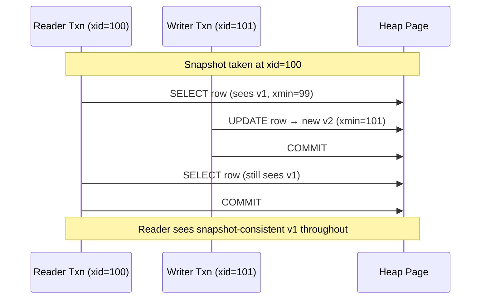
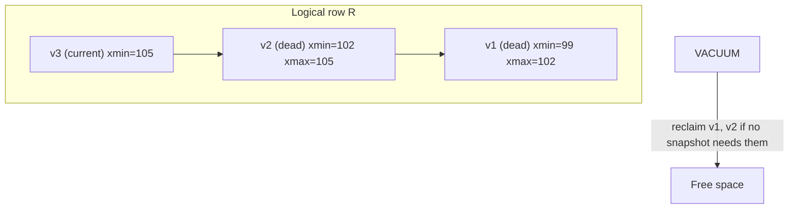
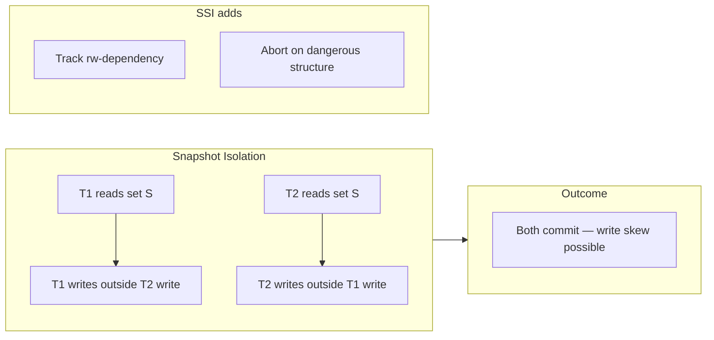

# Multi-Version Concurrency Control (MVCC)

## 1. Executive Summary

**Multi-Version Concurrency Control (MVCC)** is a concurrency control technique that stores **multiple versions** of each data item rather than overwriting in place. Readers access a **consistent snapshot** of the database as of a transaction start time (or statement start, depending on isolation), while writers create **new versions** without blocking readers. At commit time, the system detects **write-write conflicts** and may abort transactions that would violate isolation guarantees.

MVCC underpins **snapshot isolation (SI)** in PostgreSQL, Oracle, and many modern databases. SI provides strong read concurrency but is **not equivalent to serializability**—the classic **write skew** anomaly remains. PostgreSQL's **Serializable Snapshot Isolation (SSI)** extends MVCC with **dependency tracking** to achieve true serializability with optimistic aborts.

This chapter covers MVCC mechanics (tuple versioning, visibility rules, transaction IDs), snapshot isolation semantics, vacuum and garbage collection, write skew and other SI anomalies, comparison with two-phase locking (2PL), production implementations (PostgreSQL, InnoDB, CockroachDB), operational failure modes (bloat, wraparound, long transactions), and principal-level interview framing.

## 2. Why This Topic Matters

Principal interviews probe whether candidates understand **how databases actually implement isolation**, not just SQL level names:

- Can you explain **why readers don't block writers** in MVCC?
- What are **xmin/xmax** (PostgreSQL) or **undo logs** (InnoDB) roles?
- Why does **VACUUM** exist and what happens if it can't run?
- Can you articulate **snapshot isolation vs serializability** with write skew?

Production incidents from MVCC misunderstanding include table bloat exhausting disk, **transaction ID wraparound** emergencies, replication lag from long snapshots on replicas, and subtle correctness bugs from assuming REPEATABLE READ equals serializable.

Architects who design "read scaling" without understanding snapshot visibility may route analytics queries that see inconsistent cross-table snapshots. Those who ignore vacuum monitoring learn about **freeze** emergencies at 2 AM.

## 3. Problems Being Solved

| Problem | With in-place locking only (2PL) | With MVCC |
|---------|-------------------------------|-----------|
| Reader-writer blocking | Readers hold shared locks; block writers | Readers use snapshots; no read locks on rows |
| Throughput on read-heavy OLTP | Lock contention on popular rows | Concurrent reads at different snapshots |
| Consistent point-in-time reads | Complex lock choreography | Natural snapshot per transaction |
| Long-running analytics | Block writers or use dirty reads | Snapshot can be old but consistent |
| Write-write conflicts | Serialized by exclusive locks | Detected at commit; abort loser |

MVCC solves **read concurrency and snapshot consistency** within a single database. It does **not** solve distributed versioning across services, cross-shard serializability without coordination, or automatic prevention of all serialization anomalies without SSI or locking.

## 4. Assumptions and System Model

Assume a **single-node relational database** with **heap or index-organized** row storage:

- Each row version has **metadata** identifying creating and deleting transactions (e.g., `xmin`, `xmax` in PostgreSQL).
- **Transactions** receive monotonic **transaction IDs (XID)** or **commit timestamps**.
- **Visibility rule:** a row version is visible to transaction T if created by a committed txn before T's snapshot and not deleted by a committed txn visible to T.
- **Garbage collection** reclaims dead tuple versions no longer visible to any active snapshot.
- **Failures:** Crash recovery replays WAL; in-flight transactions abort.

**Not assumed:** Perfect global clocks (Spanner uses TrueTime—a different model). That all REPEATABLE READ implementations are identical. Unlimited storage for old versions—**retention is bounded** by vacuum and undo retention policies.

## 5. Essential Terminology

| Term | Definition |
|------|------------|
| **Tuple version** | One physical row version of a logical row. |
| **xmin** | Transaction ID that created this version (PostgreSQL). |
| **xmax** | Transaction ID that deleted/updated this version. |
| **Snapshot** | Set of transactions considered visible at a point in time. |
| **Snapshot isolation (SI)** | Reads from consistent snapshot; first-committer-wins on write conflicts. |
| **SSI** | Serializable Snapshot Isolation—tracks rw-dependencies, aborts cycles. |
| **Vacuum / GC** | Reclaims dead tuple versions; advances frozen XID horizon. |
| **Write skew** | Two txs read overlapping data, write non-overlapping rows, break invariant. |
| **Version chain** | Linked old versions of same logical row (InnoDB undo chain). |
| **Read view** | InnoDB structure defining visible trx ids for a transaction. |
| **Oldest xmin** | Oldest active snapshot bound—blocks vacuum progress. |
| **Freeze** | Mark old tuples permanently visible to prevent XID wraparound. |

**Mnemonic:** MVCC = **Many Versions**, **Concurrent reads**, **Commit-time conflict** check.

## 6. Core Mechanism

### PostgreSQL tuple visibility (simplified)

A row version is **visible** to snapshot S if:

1. `xmin` is committed and `xmin` < S's horizon (or in S's active set rules).
2. `xmax` is not set, or deleting transaction is not committed for S, or aborted.

Writers always **insert new version**; old version marked with `xmax`. Readers never block on row-level read locks for ordinary SELECT.



*Figure 1: MVCC snapshot read—reader unaffected by committed writer until reader starts new transaction.*

### Version chain and vacuum



*Figure 2: Dead versions accumulate until vacuum; long snapshots delay reclamation.*

### Snapshot isolation vs serializability



*Figure 3: SI allows concurrent disjoint writes after overlapping reads; SSI detects dangerous dependency graphs.*

## 7. Step-by-Step Walkthrough

**Scenario:** PostgreSQL REPEATABLE READ—account balance read twice.

| Step | Action | MVCC state |
|------|--------|------------|
| 1 | T1 BEGIN | Snapshot: all committed xids < T1.xid |
| 2 | T1 SELECT balance → 100 | Reads tuple v1 (xmin=50) |
| 3 | T2 UPDATE balance to 80; COMMIT | New v2 (xmin=T2); v1 xmax=T2 |
| 4 | T1 SELECT balance → 100 | Still v1—within T1 snapshot |
| 5 | T1 COMMIT | Snapshot released |

**Write skew walkthrough (on-call doctors):**

| Step | T1 | T2 |
|------|----|----|
| 1 | BEGIN (SI snapshot) | BEGIN |
| 2 | COUNT on_call ≥ 1 → true (1 doctor) | COUNT → true |
| 3 | UPDATE Alice off_call | UPDATE Bob off_call |
| 4 | COMMIT | COMMIT |
| Result | Zero on call—**not serializable** | |

Under PostgreSQL **SERIALIZABLE** (SSI), step 3 or 4 triggers `40001 serialization_failure` on one transaction.

## 8. Invariants and Guarantees

| Property | Type | Statement |
|----------|------|-----------|
| **Snapshot consistency** | Safety | All reads in txn see consistent snapshot (RR+) |
| **No dirty reads** | Safety | Uncommitted versions invisible |
| **First-committer-wins** | Safety | Write-write conflict → abort on loser (SI) |
| **Serializability (SSI only)** | Safety | No serialization anomalies when using SERIALIZABLE |
| **Version reclamation** | Liveness | Vacuum eventually frees dead tuples if xmin advances |
| **Unbounded storage** | **Not** guaranteed | Dead tuples accumulate if vacuum blocked |

**Write skew:** SI guarantees **no write-write conflict on same row** but not **predicate-level** conflicts across rows.

## 9. Failure Scenarios

### Scenario 1: Transaction ID wraparound

**Setup:** ~2 billion XIDs consumed; autovacuum freeze lagging due to long transactions.

**Effect:** Database shutdown to prevent data corruption—**catastrophic** ops incident.

**Mitigation:** Monitor `age(datfrozenxid)`, kill long idle transactions, aggressive autovacuum tuning.

### Scenario 2: Table bloat

**Setup:** Heavy UPDATE workload; vacuum can't keep pace; long-running reporting txn holds snapshot.

**Effect:** Disk full, query slowdown from heap scans of dead tuples.

**Mitigation:** `VACUUM FULL` (locks table), pg_repack, shorten transactions, separate replica for analytics.

### Scenario 3: Replication slot lag

**Setup:** Logical replication slot; consumer down; WAL retained for slot.

**Effect:** Disk fill on primary—MVCC-related retention via WAL, not only heap.

**Mitigation:** Monitor slot lag; drop or fix consumer.

### Scenario 4: Assuming SI = serializable

**Setup:** REPEATABLE READ on invariant spanning multiple rows.

**Effect:** Write skew in production under concurrent load.

**Mitigation:** SERIALIZABLE, explicit locks, or materialized constraint row.

### Scenario 5: Hot row update storm

**Setup:** Many transactions update same row; MVCC creates version chain per update.

**Effect:** Contention on row lock; version chain bloat; high abort rate under SSI.

**Mitigation:** Queue updates, shard counter, reduce transaction scope.

## 10. Performance Characteristics

| Factor | Impact |
|--------|--------|
| Read path | No shared locks—fast concurrent reads |
| Write path | Insert new version + index updates + row exclusive lock |
| Index-only scans | May need heap fetch if visibility not in index |
| Vacuum I/O | Background CPU and I/O; autovacuum tuning critical |
| SSI overhead | Tracks rw-conflicts—more CPU, higher abort rate |
| Version chain length | HOT updates (PostgreSQL) avoid index updates when same page |

**HOT (Heap-Only Tuple):** PostgreSQL optimization when updated row stays on same page and no indexed column changes—reduces index churn.

**Read committed vs repeatable read performance:** Under READ COMMITTED, PostgreSQL takes a **new snapshot for each statement**, so a transaction may see different row versions across statements within the same transaction—cheaper snapshot management for short OLTP statements but surprising behavior for multi-statement reports. REPEATABLE READ holds one snapshot for the transaction lifetime, which can increase conflict detection scope for writes but provides stable reads for analytics-style queries within bounded transaction duration.

**Index and visibility interaction:** PostgreSQL index-only scans require a **visibility map** check; if the map bit is not set for a page, the executor must visit the heap tuple to evaluate xmin/xmax—MVCC metadata can defeat index-only optimization on churny tables until vacuum sets all-visible bits.

**Comparative latency (qualitative):** A point SELECT under MVCC avoids lock acquisition beyond lightweight snapshot setup—typically microseconds of CPU on warm cache. A conflicting UPDATE still waits on row exclusive lock; MVCC does not remove write-write contention. Under SSI, additional CPU tracks predicate locks and rw-edges—benchmark on your workload before assuming SERIALIZABLE is "free" on read-heavy paths.

**Capacity planning formula (heuristic):** Sustained UPDATE rate × average dead tuple size × (vacuum lag seconds) ≈ bloat growth rate. If long snapshots prevent vacuum from reclaiming, bloat grows linearly with update rate—model this in load tests before black Friday.

## 11. Scalability Limits

- **Write hot spots** still serialize on row lock—MVCC doesn't eliminate write contention.
- **Snapshot export** for very long jobs blocks vacuum—limits sustained UPDATE throughput.
- **SSI abort rate** grows with conflicting rw-dependencies—throughput ceiling on contended predicates.
- **Cross-node MVCC** (CockroachDB, Spanner) adds clock or timestamp coordination—different scale model.

## 12. Operational Considerations

- **Monitor:** `n_dead_tup`, `last_autovacuum`, `age(datfrozenxid)`, longest transaction duration.
- **Alert:** XID age thresholds (e.g., 200M), replication slot lag, table bloat > N GB.
- **Kill policies:** `idle_in_transaction_session_timeout`, `statement_timeout`.
- **Analytics:** Use hot standby with `hot_standby_feedback` awareness—or separate warehouse.
- **Autovacuum:** Scale `autovacuum_vacuum_scale_factor` down on hot tables.

## 13. Security Considerations

- **Stale snapshot reads:** Authorized user in long txn sees old secrets after revocation—session length matters.
- **Timing channels:** Abort timing on SSI may leak conflict information—niche concern.
- **Logical decoding:** MVCC versions exposed via replication—secure replication streams.

MVCC visibility is **not** a substitute for row-level security policies.

## 14. Cost Considerations

- **Storage amplification:** Dead tuples until vacuum—plan 20–30% headroom on churny tables (rule of thumb, measure).
- **Vacuum compute:** Autovacuum workers compete with OLTP—size instances accordingly.
- **Engineering:** Retry logic for SSI; query tuning for bloat.
- **vs 2PL:** Lower read-lock contention often wins; write-heavy same-row workloads may not.

## 15. Production Implementations

### PostgreSQL

Heap tuples with `xmin`/`xmax`; snapshots for isolation; autovacuum; SSI for SERIALIZABLE; FREEZE prevents wraparound. **Implementation reference** for open-source MVCC behavior.

### MySQL InnoDB

Multi-versioning via **undo log** chain; clustered index holds current row; **Read View** for consistency; purge thread reclaims undo. REPEATABLE READ uses next-key locks for phantoms—**hybrid MVCC + locking**.

### Oracle

Undo segments store old versions; readers don't block writers; **ORA-01555 snapshot too old** when undo retained insufficiently.

### CockroachDB

Distributed MVCC with **hybrid logical clocks**; serializable by default; write conflicts cause retry.

### FoundationDB

Multi-version with serializable isolation; optimistic concurrency—**different API**, same MVCC concepts.

### SQL Server Read Committed Snapshot Isolation (RCSI)

When enabled, READ COMMITTED uses row versioning in `tempdb` instead of shared locks for reads—readers don't block writers and writers don't block readers for reads. **Implementation choice** distinct from PostgreSQL defaults; still not full serializable without explicit SNAPSHOT or SERIALIZABLE isolation.

### MongoDB WiredTiger

Document-level MVCC with snapshot reads; multi-document ACID transactions (since 4.0) coordinate across documents with snapshot isolation semantics—cross-document write skew risks similar to relational SI unless explicit concerns addressed in application logic.

**Interview note:** When comparing engines, ask whether **phantom prevention** comes from MVCC alone or from **next-key/gap locks** (InnoDB) or **SSI** (PostgreSQL SERIALIZABLE)—the mechanism differs even when SQL isolation names match.

## 16. Alternatives and Tradeoffs

| Approach | Strength | Cost | Use when |
|----------|----------|------|----------|
| MVCC (SI) | Read concurrency | Write skew, vacuum ops | OLTP read-heavy |
| 2PL | Serializable via locks | Reader-writer blocking | Legacy, simple correctness |
| SSI | Serializable + MVCC reads | Aborts, tracking overhead | Postgres SERIALIZABLE |
| Lock-free / append-only | Immutable events | Read path reconstruction | Event stores |
| Partitioning | Reduces per-shard contention | Cross-shard complexity | Scale-out |

## 17. Common Misconceptions

| Misconception | Reality |
|---------------|---------|
| "MVCC means no locks" | Writers take row locks; DDL takes heavy locks. |
| "Snapshots are free" | Dead tuple storage + vacuum cost. |
| "REPEATABLE READ = serializable" | Write skew possible under SI. |
| "Vacuum is optional maintenance" | Required for correctness (freeze) and performance. |
| "Readers never cause problems" | Long readers block vacuum → bloat → wraparound risk. |
| "MVCC is only PostgreSQL" | InnoDB, Oracle, SQL Server RCSI all use variants. |

## 18. Principal Architect Perspective

1. **Treat vacuum as production-critical**—not DBA trivia.
2. **Map invariants to SI vs SSI**—write skew is the interview trapdoor.
3. **Separate OLTP snapshots from warehouse ETL**—don't run 8-hour txn on primary.
4. **Design retries** for SSI and Cockroach-style serializable.
5. **Capacity-plan dead tuple churn** on UPDATE-heavy tables.

## 19. Architecture Review Exercise

**Scenario:** SaaS app uses PostgreSQL REPEATABLE READ; background job exports 6-hour report while users update same tables; disk growing 5%/day.

**Review prompts:**

1. What blocks vacuum?
2. Impact on autovacuum freeze?
3. Move export to replica—does it help primary bloat?
4. `idle_in_transaction_session_timeout` value?
5. Table partitioning for export scope?

**Expected findings:** Long snapshot holds xmin; replica export with `hot_standby_feedback` can also block vacuum on primary—use logical replication to warehouse or snapshot exports (`pg_export_snapshot` with bounded use).

## 20. Whiteboard Explanation

**90-second version:**

> "MVCC keeps multiple row versions instead of overwriting. Readers use a snapshot—transaction IDs or timestamps determine visibility—so reads don't block writes. Writers create new versions and lock the row exclusively. Dead versions pile up until vacuum reclaims them. Snapshot isolation gives consistent reads but allows write skew—two transactions read overlapping state and write different rows, breaking an invariant serial execution would prevent. PostgreSQL SERIALIZABLE adds SSI to track read-write dependencies and abort dangerous transactions. Operationally, long transactions are toxic—they block vacuum and can cause XID wraparound emergencies. InnoDB does MVCC with undo logs; behavior differs on phantoms due to gap locks."

## 21. Interview Questions

1. **How does MVCC avoid reader-writer blocking?**
   - *Signals:* Snapshots read old versions; no shared read locks on rows.

2. **What are xmin and xmax?**
   - *Signals:* Creating and deleting transaction ids for tuple visibility.

3. **Why is VACUUM necessary?**
   - *Signals:* Reclaim dead tuples; freeze XIDs; prevent wraparound and bloat.

4. **Explain write skew.**
   - *Signals:* Overlapping reads, disjoint writes, invariant violation; SI allows.

5. **SI vs serializability?**
   - *Signals:* SI is not serializable; SSI adds conflict detection.

6. **What causes transaction ID wraparound?**
   - *Signals:* 32-bit XID space; insufficient freezing; long xmin horizon.

7. **How does InnoDB MVCC differ from PostgreSQL?**
   - *Signals:* Undo log chain vs heap tuples; Read View; gap locks.

8. **What is HOT update optimization?**
   - *Signals:* Same-page update without new index entry (PostgreSQL).

9. **ORA-01555 meaning?**
   - *Signals:* Undo overwritten; snapshot too old (Oracle).

10. **How does SSI detect conflicts?**
    - *Signals:* Tracks rw-dependencies; aborts on predicate/out edges forming dangerous structures.

11. **Can MVCC scale write-heavy hot keys?**
    - *Signals:* No—row lock serializes; version chain bloat.

12. **Impact of long-running transaction on vacuum?**
    - *Signals:* Delays dead tuple reclamation; increases bloat and wraparound risk.

13. **READ COMMITTED vs REPEATABLE READ in MVCC?**
    - *Signals:* New snapshot per statement vs one snapshot per transaction.

14. **When choose 2PL over MVCC?**
    - *Signals:* Rare today; simple locking semantics; some embedded systems.

## 22. Interview Follow-Ups

1. **Design multi-tenant analytics without hurting OLTP vacuum.**
   - *Signals:* CDC to warehouse, replica, bounded snapshots.

2. **100% serialization abort rate on promotion day—what now?**
   - *Signals:* Queue, partition inventory, relax to explicit row locks on SKU.

3. **Compare MVCC to event sourcing.**
   - *Signals:* Both versioned; event sourcing reconstructs state from log.

4. **Spanner external consistency vs MVCC snapshot?**
   - *Signals:* TrueTime bounded uncertainty; global serializable transactions.

## 23. Strong Answer Example

**Question:** "We use PostgreSQL REPEATABLE READ for a scheduling invariant. Good enough?"

> "REPEATABLE READ in PostgreSQL is snapshot isolation—you get stable reads within the transaction but **not** full serializability. If the invariant is 'at least one on-call doctor' and two transactions can each read the count, then update different doctors off-call, both commit and violate the invariant—that's write skew. I'd either use SERIALIZABLE and handle `40001` retries, add a locked summary row updated with every shift change, or use `SELECT FOR UPDATE` on the rows being evaluated. I'd also ensure transactions are short so vacuum isn't blocked. I'd document the choice in an ADR with a concurrency test proving the invariant."

## 24. Weak Answer Example

**Question:** "We use PostgreSQL REPEATABLE READ for a scheduling invariant. Good enough?"

> "Yes, repeatable means reads don't change, so we're consistent."

**Why weak:** Confuses stable reads with serializability; ignores write skew; no operational vacuum awareness.

## 25. Hands-On Exercise

1. Create `doctors(id, on_call)` table; insert two on-call rows.
2. Two psql sessions: `BEGIN ISOLATION LEVEL REPEATABLE READ`.
3. Both `SELECT count(*) WHERE on_call` → 2.
4. Each sets different doctor off_call; both commit.
5. Observe count=0.
6. Repeat with `SERIALIZABLE`; observe abort.
7. Query `pg_stat_user_tables` for `n_dead_tup` after heavy updates.
8. Document mitigation for your invariant.

## 26. Knowledge Check

1. MVCC primary benefit for reads? *(Non-blocking snapshot reads.)*
2. Write skew allowed under? *(Snapshot isolation.)*
3. What does freeze prevent? *(XID wraparound corruption.)*
4. SSI implementation in PostgreSQL? *(Serializable isolation level.)*
5. InnoDB old versions stored in? *(Undo log chain.)*

## 27. Flashcards

| # | Front | Back |
|---|-------|------|
| 1 | MVCC | Multiple versions; readers use snapshots. |
| 2 | Snapshot isolation | Consistent read snapshot; commit-time ww-conflict. |
| 3 | Write skew | SI anomaly; overlapping read, disjoint write. |
| 4 | SSI | Serializable via dependency tracking + abort. |
| 5 | xmin / xmax | PostgreSQL tuple create/delete trx ids. |
| 6 | VACUUM | Reclaim dead tuples; freeze old xids. |
| 7 | XID wraparound | Emergency if freeze lags—DB shutdown risk. |
| 8 | HOT update | Same-page update skips index churn (PG). |
| 9 | Read View | InnoDB snapshot visibility structure. |
| 10 | ORA-01555 | Snapshot too old—undo purged. |
| 11 | n_dead_tup | Bloat indicator in pg_stat_user_tables. |
| 12 | 40001 | Serialization failure—retry transaction. |

## 28. Cheat Sheet

```
MVCC
  Read: snapshot visibility (no row read lock)
  Write: new version + row exclusive lock
  GC: VACUUM / purge undo

SI ≠ SERIALIZABLE
  Write skew: classic counterexample
  Fix: SSI, locks, materialize invariant

OPS
  Monitor age(datfrozenxid), n_dead_tup
  Kill idle-in-transaction
  Don't run 6hr txn on primary

ENGINES
  PG: heap xmin/xmax + SSI
  InnoDB: undo + Read View + gap locks
```

## 29. Related Concepts

- [ACID and Isolation](/docs/transactions/acid-and-isolation) — isolation levels MVCC implements
- [Storage Engines](/docs/storage-engines/overview) — heap, WAL, undo logs
- [Linearizability](/docs/consistency/linearizability) — different consistency model
- [Two-Phase Commit](/docs/transactions/two-phase-commit) — distributed commits
- [Replication](/docs/replication/overview) — logical slots affect WAL retention

## 30. References

### Primary sources

- Berenson, H., et al. (1995). ["A Critique of ANSI SQL Isolation Levels."](https://www.microsoft.com/en-us/research/wp-content/uploads/2016/02/tr-95-51.pdf) — snapshot isolation definition.
- Adya, A. (1999). ["Weak Consistency."](https://www.pmg.lcs.mit.edu/papers/adyathesis.pdf) — SI vs serializability formalization.
- Ports, D. R. K., & Clements, A. T. (2012). ["Serializable Snapshot Isolation in PostgreSQL."](https://drkp.net/papers/ssi.pdf) — SSI design.

### Production and engineering

- PostgreSQL Documentation — [MVCC](https://www.postgresql.org/docs/current/mvcc.html), [Routine Vacuuming](https://www.postgresql.org/docs/current/routine-vacuuming.html).
- MySQL InnoDB — [Undo Logs](https://dev.mysql.com/doc/refman/8.0/en/innodb-undo-logs.html).
- Martin Kleppmann, *DDIA* — Chapter 7 on snapshots and serializability.

### Distinction

| Claim type | Source |
|------------|--------|
| SI definition | Berenson et al.; Adya |
| SSI algorithm | Ports & Clements (2012); PostgreSQL docs |
| Operational wraparound | PostgreSQL admin docs |
