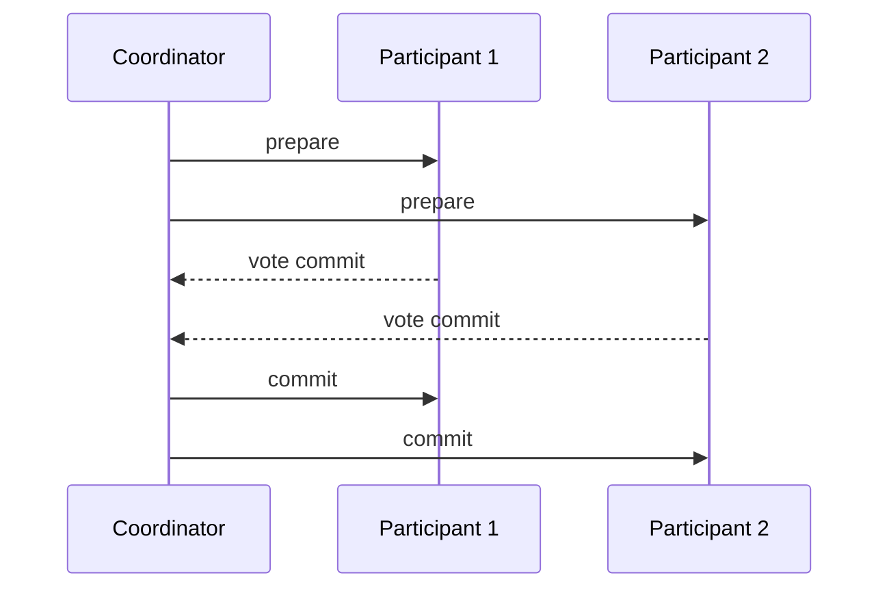

# Transactions

ACID, isolation levels, MVCC, two-phase commit, sagas, and the transactional outbox.

*Figure: Two-phase commit protocol for distributed transactions.*

## What You'll Learn

Transactions bundle correctness guarantees across reads and writes. This domain covers ACID properties, isolation anomalies, MVCC implementation, distributed 2PC limitations, saga orchestration, and the outbox pattern for reliable event publishing.

## Chapters

| Chapter | Focus |
|---------|-------|
| [ACID and Isolation Levels](/docs/transactions/acid-and-isolation) | Atomicity, isolation anomalies, serializability |
| [Multi-Version Concurrency Control (MVCC)](/docs/transactions/mvcc) | Snapshot isolation, garbage collection |
| [Two-Phase Commit (2PC)](/docs/transactions/two-phase-commit) | Distributed atomic commit, blocking problem |
| [Sagas](/docs/transactions/sagas) | Long-running transactions, compensating actions |
| [Transactional Outbox](/docs/transactions/transactional-outbox) | Atomic DB write + event publish |

## Learning Path

1. **ACID and Isolation** — interview staple; know anomaly names and fixes.
2. **MVCC** — how Postgres, MySQL InnoDB, and CockroachDB implement concurrency.
3. **2PC** — understand why cross-service 2PC is rare in microservices.
4. **Sagas** and **Transactional Outbox** — production patterns for distributed workflows.

## Interview Prep

| Resource | Topic |
|----------|-------|
| [Shopify Transactional Outbox](/docs/real-world-scenarios/shopify-transactional-outbox) | Dual-write problem |
| [Lab 009 outbox](/docs/transactions/transactional-outbox#25-hands-on-exercise) | Transactional outbox on `:8092` |
| [Lab 010 saga](/docs/transactions/sagas#25-hands-on-exercise) | Saga orchestration on `:8093` — [engineer guide](/docs/transactions/sagas#engineer-guide-how-the-local-stack-works) |

## Prerequisites

- [Consistency Models](/docs/consistency/overview)
- [Replication](/docs/replication/overview)

## Next Domain

Continue to [Messaging and Streaming](/docs/messaging-and-streaming/overview) and [Microservices](/docs/microservices/overview).

Return to the [Curriculum Overview](/docs/start-here/curriculum-overview) for the full learning path.
