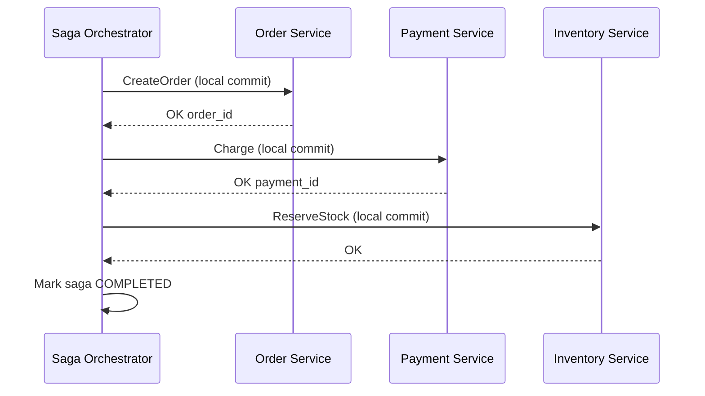
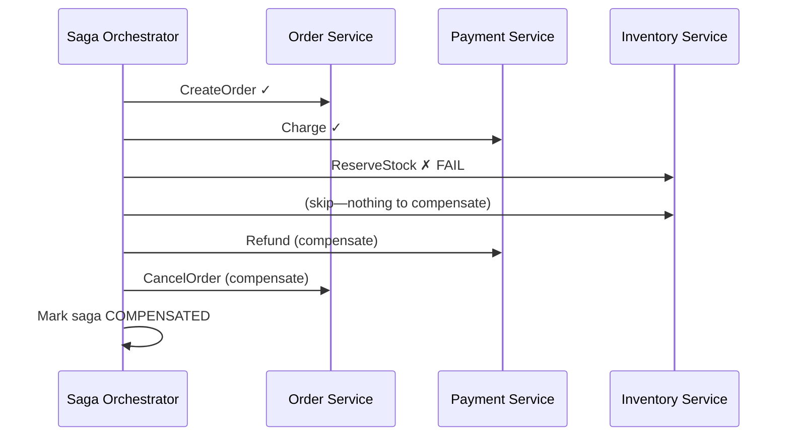
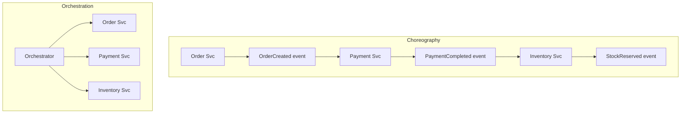

# Sagas

## 1. Executive Summary

A **saga** is a long-lived business transaction decomposed into a sequence of **local transactions**, each committing independently within its own service boundary. If a later step fails, the saga executes **compensating transactions** to undo or logically reverse the effects of prior steps—because there is no distributed rollback across already-committed local transactions.

Sagas were introduced by Garcia-Molina and Salem (1987) as an alternative to distributed locking protocols like 2PC. Two coordination styles dominate modern architectures: **choreography** (each service reacts to events and knows what to do next) and **orchestration** (a central coordinator directs steps and compensations). Sagas trade **strong atomicity** for **availability**, **loose coupling**, and **scalability** across microservices.

This chapter covers saga semantics, compensating vs semantic undo, choreography vs orchestration tradeoffs, idempotency and ordering requirements, failure modes (poison messages, incomplete compensation, lost events), comparison with 2PC and outbox patterns, production implementations (Temporal, Camunda, custom event-driven), and principal-level interview framing.

**Try it:** [§25 Hands-On](#25-hands-on-exercise) — Lab 010 saga orchestrator on `:8093`; then [engineer guide](#engineer-guide-how-the-local-stack-works) for runtime walkthrough. Pairs with [Lab 009 outbox](/docs/transactions/transactional-outbox#25-hands-on-exercise).

## 2. Why This Topic Matters

Principal interviews frequently pose: **"How do you maintain consistency across microservices without 2PC?"** The saga pattern is the standard answer—but weak answers stop at "use events."

Strong candidates explain:

- **Compensating transactions** are not always true rollbacks—they are **semantic reversals** (issue refund, not delete row).
- **Choreography** scales teams but obscures global flow; **orchestration** centralizes visibility but risks a god-service.
- Every step must be **idempotent** because messages are **at-least-once**.
- Sagas are **eventually consistent**—intermediate states are visible.

Production failures include double refunds, orphaned orders, compensations that fail silently, and "saga stuck" states blocking customer support. Architects who design sagas without **state machines**, **timeouts**, and **reconciliation** build distributed workflows that are harder to debug than monolith transactions.

## 3. Problems Being Solved

| Problem | Monolith ACID | Saga |
|---------|---------------|------|
| Cross-service atomic commit | Single transaction | Sequence of local commits |
| Service independence | Coupled schema | Autonomous bounded contexts |
| Availability during partial failure | Rollback all | Forward progress + compensate |
| Long-running workflows | Long DB locks | Async steps with durable state |
| Heterogeneous technology | One database | Polyglot persistence |

Sagas solve **cross-service business process coordination** without distributed locks. They do **not** provide **instant global consistency**, **isolation** of intermediate states from external readers, or automatic compensation if business rules forbid undo (e.g., shipped physical goods).

## 4. Assumptions and System Model

Assume **microservices** with **private databases** and **asynchronous messaging** (or synchronous calls with durable saga log):

- Each **local transaction** is ACID within one database.
- **Messages** are delivered **at-least-once** unless using exactly-once infrastructure (rare end-to-end).
- **Compensations** are application-defined and may be **partial** or **delayed**.
- **Failures:** Process crash, network partition, duplicate messages, slow consumers.
- **Not Byzantine** unless discussing fraud detection separately.

**Not assumed:** Compensations restore identical prior state—only **business-equivalent** state. Global serializability. Automatic saga completion without monitoring.

## 5. Essential Terminology

| Term | Definition |
|------|------------|
| **Saga** | Sequence of local txs with compensating txs on failure. |
| **Compensating transaction** | Semantic undo of a completed local step. |
| **Choreography** | Decentralized: services react to events without central controller. |
| **Orchestration** | Central saga manager issues commands and tracks state. |
| **Forward recovery** | Retry failed step (transient error). |
| **Backward recovery** | Run compensations for completed steps. |
| **Semantic lock** | Business rule preventing conflicting actions during saga (e.g., no ship until paid). |
| **Saga log** | Durable record of saga state and step outcomes. |
| **Pivot transaction** | Last step after which compensation is impossible—switch to manual resolution. |
| **Idempotency key** | Dedupes retried step execution. |

**Mnemonic:** Saga = **Steps forward**, **Compensate backward**, **Never global lock**.

## 6. Core Mechanism

### Orchestrated saga (happy path)



*Figure 1: Orchestrator drives sequential local commits; each step durable before next.*

### Compensation path



*Figure 2: Backward recovery—compensations run in reverse order of successful forward steps.*

### Choreography vs orchestration



*Figure 3: Choreography flows through events; orchestration centralizes control and state.*

## 7. Step-by-Step Walkthrough

**Scenario:** Travel booking—flight, hotel, car. Orchestrated saga.

| Step | Action | State if next fails |
|------|--------|---------------------|
| 1 | Book flight (committed) | Compensate: cancel flight |
| 2 | Book hotel (committed) | Compensate: cancel hotel, then flight |
| 3 | Book car **fails** | Run: cancel hotel, cancel flight |
| 4 | Saga ends COMPENSATED | Customer charged $0 net; may see brief flight hold |

**Choreography equivalent:**

| Event | Consumer action |
|-------|-----------------|
| `TripRequested` | Flight svc books, emits `FlightBooked` |
| `FlightBooked` | Hotel svc books, emits `HotelBooked` |
| `HotelBooked` | Car svc fails, emits `CarBookingFailed` |
| `CarBookingFailed` | Hotel listens, cancels; emits `HotelCancelled` |
| `HotelCancelled` | Flight listens, cancels |

**Risk:** Implicit distributed state machine—harder to visualize than orchestrator's single log.

**Parallel saga steps (advanced):** When flight and hotel are independent, orchestrator may fan out steps 1 and 2 in parallel—reducing latency. Compensation order must still respect **reverse completion order** or explicit dependency graph: if hotel books before flight confirms, compensate hotel first. Parallelism without a documented DAG causes compensation races.

**Saga state machine (explicit):**

| State | Meaning | Allowed transitions |
|-------|---------|---------------------|
| `STARTED` | Saga initiated | → `STEP_N_RUNNING` |
| `STEP_N_RUNNING` | Forward step in flight | → `STEP_N_OK`, `COMPENSATING` |
| `STEP_N_OK` | Step committed | → next step or `COMPLETED` |
| `COMPENSATING` | Running compensations | → `COMPENSATED`, `FAILED` |
| `COMPLETED` | All forward steps done | terminal |
| `COMPENSATED` | Rollback complete | terminal |
| `FAILED` | Manual intervention required | terminal (ops) |

Persist state after **every** transition—crash recovery replays from last durable state, not from memory.

**Customer-visible timeline example:**

| Time | DB state (order svc) | DB state (payment) | Customer sees |
|------|---------------------|-------------------|---------------|
| T0 | — | — | Checkout clicked |
| T1 | PENDING order | — | Spinner |
| T2 | PENDING | AUTHORIZED | Still spinner |
| T3 | CONFIRMED | CAPTURED | Order confirmation email |

Between T1–T3, support tools must show in-flight saga—not "no order" or duplicate orders on retry.

**Compensation ordering rules:**

1. Compensate in **reverse order** of successful forward steps (stack discipline).
2. Skip compensation for steps that never committed.
3. If step N compensation fails, **do not** compensate N-1 automatically unless business allows partial state—often halt and page ops.
4. Idempotent compensation: calling `Refund(payment_id)` twice must not double-refund—payment provider idempotency keys required.

## 8. Invariants and Guarantees

| Property | Type | Statement |
|----------|------|-----------|
| **Local ACID** | Safety | Each step atomic within service DB |
| **Compensation completeness** | Safety | **Application responsibility**—not automatic |
| **Global atomicity** | **Not** provided | Intermediate states visible |
| **Eventual business consistency** | Liveness-oriented goal | After saga completes or compensates |
| **No duplicate side effects** | Safety (with idempotency) | Requires idempotent steps |
| **Termination** | Liveness | Requires timeouts, DLQ, human escalation |

**Semantic vs physical undo:** `DELETE order` vs `status=CANCELLED`—compensations are domain-specific.

## 9. Failure Scenarios

### Scenario 0: Cyclic compensation dependency

**Setup:** Choreographed saga where Service A waits for B's compensation event while B waits for A's.

**Effect:** Deadlock at application level—no progress.

**Mitigation:** Orchestrator breaks cycle; define acyclic compensation graph; timeout to manual queue.

### Scenario 1: Compensation fails

**Setup:** Payment refunded fails after inventory release failed.

**Effect:** Inconsistent state—customer charged, no inventory.

**Mitigation:** Retry with backoff; saga log marks `COMPENSATION_FAILED`; alert; manual playbook; reconciliation job.

### Scenario 2: Duplicate message

**Setup:** `ChargePayment` delivered twice without idempotency.

**Effect:** Double charge.

**Mitigation:** Idempotency key on payment_id; dedup table.

### Scenario 3: Lost event (choreography)

**Setup:** `HotelBooked` never delivered; car never booked; flight stuck.

**Effect:** Saga hung; customer billed for flight only.

**Mitigation:** Outbox, CDC, orchestrator timeout, state query API.

### Scenario 4: Out-of-order events

**Setup:** `PaymentRefunded` arrives before `PaymentCompleted` processed.

**Effect:** Invalid state transition.

**Mitigation:** Versioned saga state; reject invalid transitions; partition by saga_id.

### Scenario 5: Visible dirty intermediate state

**Setup:** Order created (visible) before payment; customer sees unpaid order.

**Effect:** UX confusion—not a bug if documented; support tickets.

**Mitigation:** `PENDING` status hidden from catalog; semantic locks.

## 10. Performance Characteristics

| Factor | Impact |
|--------|--------|
| Async steps | Higher latency than sync monolith—acceptable for many flows |
| Message overhead | Each step: publish + consume + DB |
| Orchestrator | Single coordination bottleneck—scale horizontally with sharded saga_id |
| Compensation | Extra round trips—failure path slower |
| Choreography fan-out | N services subscribe—broker throughput |

**Compared to 2PC:** Lower lock hold time, better availability; higher **complexity** and **eventual** consistency window.

## 11. Scalability Limits

- **Orchestrator state store** grows with active sagas—partition by saga_id.
- **Choreography debugging** doesn't scale with team count—needs tracing (OpenTelemetry).
- **Compensation storms** during outages amplify load.
- **Human-in-the-loop** steps don't automate—pivot to manual queue.

## 12. Operational Considerations

- **Saga dashboard:** active, stuck, compensating counts.
- **Timeouts per step** with escalation policy.
- **DLQ** for poison messages; replay tooling with idempotency.
- **Correlation ID** (`saga_id`, `trace_id`) across all services.
- **Reconciliation batch jobs** compare payment provider vs order DB nightly.
- **Runbooks** for `COMPENSATION_FAILED` and pivot transactions.

## 13. Security Considerations

- **Orchestrator privilege:** High-trust component—authenticate internal commands.
- **Event tampering:** Sign or encrypt sensitive saga commands on bus.
- **Replay attacks:** Idempotency keys bound to principal and time window.
- **Compensation authorization:** Refund endpoint must verify saga state server-side.

## 14. Cost Considerations

- **Engineering:** State machines, idempotency, monitoring—higher than monolith.
- **Infrastructure:** Workflow engine (Temporal), message broker, extra storage for saga log.
- **Support cost:** Intermediate states confuse users without clear UX.
- **Saved cost:** Avoids 2PC coupling, coordinator HA, cross-DB locks.

## 15. Production Implementations

### Temporal / Cadence

Durable workflow execution—orchestration with automatic retries, timers, saga-style compensation via workflow code. **Implementation choice** for long-running sagas.

### Camunda / Zeebe

BPMN-based process orchestration—visual flows; enterprise workflow.

### AWS Step Functions

State machine as orchestrator—serverless; step limits and cost model apply.

### Custom event-driven (Kafka + choreographed handlers)

Common in microservices—requires rigorous outbox and idempotency discipline.

### NestJS / microservices patterns

Lightweight sagas via message patterns—team owns correctness.

### eBay / large-scale choreographed sagas

Historical microservices literature describes event-driven sagas at scale with rigorous idempotency and compensating business processes—**anecdotal operational experience** emphasizing that choreography requires **strong conventions** (event schemas, versioning, ownership) to remain comprehensible as service count grows.

### Banking and payment sagas

Payment networks often use **state machines** with explicit states (`AUTHORIZED`, `CAPTURED`, `REFUNDED`) rather than physical deletes. Compensation is a **new forward transaction** (refund) not an undo of capture—regulatory audit requires append-only payment history. Architects on financial paths should never assume `DELETE FROM payments` is a valid compensating action.

### Saga timeout hierarchies

Production orchestrators define **step timeout** < **saga timeout** < **business SLA**. Example: payment step 30s, checkout saga 5m, customer-facing checkout 10m. Exceeding saga timeout transitions to `REQUIRES_MANUAL_INTERVENTION` with paging—not infinite retry loops that amplify outages.

**Testing matrix:**

| Test | Purpose |
|------|---------|
| Fail each step once | Compensation order correct |
| Duplicate every message | Idempotency holds |
| Slow step past timeout | Escalation fires |
| Compensation fails | Alert + stuck state visible |
| Concurrent sagas same aggregate | Serialization or conflict policy |

## 16. Alternatives and Tradeoffs

| Pattern | Coupling | Consistency window | Complexity |
|---------|----------|-------------------|------------|
| Saga (orch) | Medium (orchestrator) | Visible intermediate | State machine |
| Saga (choreo) | Low between services | Same | Distributed debugging hard |
| 2PC/XA | High | None (atomic) | Blocking, ops |
| Outbox + process manager | Medium | Async | Good default combo |
| Monolith | High internal | Immediate | Doesn't scale teams |
| Event sourcing | Low | Replayable history | Steep learning curve |

## 17. Common Misconceptions

| Misconception | Reality |
|---------------|---------|
| "Saga = 2PC with events" | No global atomicity; compensations are semantic. |
| "Compensation = DELETE" | Often status flip, refund API, release hold. |
| "Choreography is always better" | Loses visibility; orchestration aids ops. |
| "Exactly-once saga" | At-least-once + idempotency = effective once. |
| "Saga hides intermediate state" | Other services/users may observe partial completion. |
| "Failed step auto-rolls back DB" | Prior steps already committed—must compensate. |

## 18. Principal Architect Perspective

1. **Draw the state machine** before choosing choreography vs orchestration.
2. **Define pivot points** where compensation ends and humans intervene.
3. **Mandate idempotency keys** on every saga step API.
4. **Pair with outbox** for reliable event emission from local commits.
5. **Nightly reconciliation** catches what sagas miss—belt and suspenders.

**Governance:** Establish an **integration team** or architecture guild that owns saga event schemas (`OrderCreatedV1`), compensation contracts, and breaking-change policy. Without this, choreographed systems become incomprehensible graphs where no one knows the full checkout flow. **Version** every event; consumers must tolerate unknown fields and dual-subscribe during migrations.

**Business stakeholder communication:** Sagas are **eventually consistent**—legal and product must accept that "order confirmed" may lag "payment captured" by seconds. Document SLAs for saga completion and what customer support should say during `PENDING` states. Escalation paths for `FAILED` sagas should be defined before launch, not during the first production incident.

## 19. Architecture Review Exercise

**Scenario:** Choreographed checkout: Order → Payment → Shipping via Kafka events; no central saga store; compensation = `OrderCancelled` event.

**Review prompts:**

1. How detect stuck saga after 1 hour?
2. Duplicate `PaymentCompleted` handling?
3. Shipping reads order before payment event—race?
4. Payment compensated but shipping already dispatched?
5. Redesign with orchestrator + semantic lock on ship?

**Expected findings:** Add saga_id state table or workflow engine; idempotency; `cannot_ship_until_paid` invariant; pivot manual for shipped goods.

## 20. Whiteboard Explanation

**90-second version:**

> "A saga breaks a business transaction into local database transactions per service. Each step commits on its own—no distributed rollback. If step three fails, you run compensating transactions in reverse order—refund payment, cancel order—not database UNDO. Orchestration uses a central coordinator with a saga log; choreography uses events where each service knows its role. Compensations are semantic—cancel reservation, not delete row. Messages are at-least-once, so every step must be idempotent. Sagas trade strong consistency for availability compared to 2PC. You see intermediate states, so UX and monitoring matter. Pair with outbox for reliable events and reconciliation jobs for money paths."

## 21. Interview Questions

1. **What is a saga?**
   - *Signals:* Local txs sequence; compensate on failure; no global lock.

2. **Compensation vs rollback?**
   - *Signals:* Semantic undo after commit; not MVCC rollback.

3. **Choreography vs orchestration?**
   - *Signals:* Event-driven decentralized vs central coordinator.

4. **Why idempotency in sagas?**
   - *Signals:* At-least-once delivery; duplicate step safety.

5. **Saga vs 2PC?**
   - *Signals:* Eventual vs atomic; availability vs blocking.

6. **What is a pivot transaction?**
   - *Signals:* Point of no compensation—manual resolution.

7. **Visible intermediate state—problem?**
   - *Signals:* UX, support; mitigate with PENDING status.

8. **How handle compensation failure?**
   - *Signals:* Retry, alert, manual playbook, reconciliation.

9. **Semantic lock example?**
   - *Signals:* Don't ship until payment confirmed.

10. **Design flight+hotel booking saga.**
    - *Signals:* Order of steps, compensation order, failure points.

11. **Temporal vs Kafka choreography?**
    - *Signals:* Durable workflow vs event graph; ops visibility.

12. **Lost event in choreography?**
    - *Signals:* Timeout, outbox, orchestrator preferred for critical paths.

13. **Saga and CQRS?**
    - *Signals:* Read models may lag; project from events.

14. **Testing sagas?**
    - *Signals:* State machine tests, chaos on message delay, property-based order.

15. **Can saga steps run in parallel?**
    - *Signals:* Yes with DAG; compensation order must respect dependencies.

16. **What state should support tools show mid-saga?**
    - *Signals:* In-flight status, saga_id, last completed step—not silent failure.

**Scoring rubric (principal loop):**

| Dimension | Strong | Weak |
|-----------|--------|------|
| Atomicity scope | Local ACID per step | "Distributed transaction" hand-wave |
| Failure path | Compensation order + idempotency | "Roll back" |
| Ops | Timeouts, stuck detection, reconciliation | No monitoring |
| Style choice | Choreo vs orch tradeoffs named | One-size-fits-all |

## 22. Interview Follow-Ups

1. **Customer double-charged in saga—debug steps?**
   - *Signals:* Idempotency audit, payment provider id, saga log, duplicate delivery.

2. **When refuse saga and use single DB?**
   - *Signals:* Strong invariants, small team, no scale-out need.

3. **Saga across 12 services—orchestrator bottleneck?**
   - *Signals:* Shard orchestrator, async steps, simplify graph.

## 23. Strong Answer Example

**Question:** "Design checkout across order, payment, inventory services."

> "I'd use **orchestration** with a durable workflow engine or saga table keyed by `checkout_id`. Step 1: order service creates order in `PENDING` state in a local transaction, publishes via **transactional outbox**. Step 2: payment charges with idempotency key `checkout_id`. Step 3: inventory reserves stock conditionally. On inventory failure, orchestrator runs **backward recovery**: release stock if reserved, refund payment, mark order `CANCELLED`—each compensating call idempotent. I'd set timeouts per step and alert on `COMPENSATION_FAILED`. Shipping gets a **semantic lock**—no dispatch until payment event consumed. Nightly reconciliation matches payment gateway to orders. I reject 2PC across services due to blocking and coupling. Intermediate `PENDING` orders aren't shown in customer history."

## 24. Weak Answer Example

**Question:** "Design checkout across order, payment, inventory services."

> "Use Kafka events between services. If something fails, roll back."

**Why weak:** No local commit reality, no compensation semantics, no idempotency, no stuck saga handling.

## 25. Hands-On Exercise

### Lab 010: Saga Orchestration (runnable)

Full hands-on lab at `labs/lab-010-saga-orchestration/` — Go HTTP API on **port 8093**, orchestrator + in-process participant stubs (payment → inventory → shipping).

```bash
cd labs/lab-010-saga-orchestration
go test ./... -v
docker compose -p lab010 -f docker/docker-compose.yml up --build -d
curl http://localhost:8093/health
chmod +x scripts/demo_saga.sh && ./scripts/demo_saga.sh
```

**Demo flow (landing page at http://localhost:8093/):**

| Step | Endpoint | What happens |
|------|----------|--------------|
| 1 | `POST /v1/sagas` | Payment → inventory → shipping → `completed` |
| 2 | `POST /v1/chaos/inventory-fail` | Enable inventory failure injection |
| 3 | `POST /v1/sagas` | Inventory fails → `compensate_payment` → `compensated` |
| 4 | `POST /v1/chaos/reset` | Clear chaos flag |
| 5 | `POST /v1/sagas/{id}/crash` | Simulate orchestrator crash after payment |
| 6 | `POST /v1/sagas/{id}/recover` | Resume from saga log |

Complements [Lab 009 outbox](/docs/transactions/transactional-outbox#25-hands-on-exercise) — outbox per step, orchestrator for global flow.

### Engineer guide: how the local stack works

This section documents the **runtime behavior** of `lab-010` as you would read it in a production runbook — component boundaries, saga state machine, and how to verify compensation.

#### Runtime topology

| Process | Port / entrypoint | Responsibility |
|---------|-------------------|----------------|
| **Saga API** | `:8093` — `go run ./src/main.go --serve` | HTTP orchestrator; drives saga state machine |
| **Payment stub** | in-process | `ReservePayment` / `CompensatePayment` (idempotent by key) |
| **Inventory stub** | in-process | `ReserveInventory` — chaos flag fails next call |
| **Shipping stub** | in-process | `CreateShipment` — final forward step |

**Browser entrypoints:** `http://localhost:8093/` (HTML landing), `http://localhost:8093/docs` (Swagger UI), `http://localhost:8093/health`.

#### API contract — `POST /v1/sagas`

**Request body**

| Field | Rule |
|-------|------|
| `product_id` | Required — logical product being ordered |
| `idempotency_key` | Optional — duplicate key returns same saga (no double charge) |

**State transitions (happy path)**

```
started → payment_reserved → inventory_reserved → shipped → completed
```

**Compensation path (inventory failure after payment)**

```
payment_reserved → compensating → compensated
```

Each transition is appended to `Saga.Log` — inspect via `GET /v1/sagas/{id}`.

#### Chaos and recovery

| Endpoint | Purpose |
|----------|---------|
| `POST /v1/chaos/inventory-fail` | Next saga fails at inventory — triggers compensation |
| `POST /v1/chaos/reset` | Disable failure injection |
| `POST /v1/sagas/{id}/crash` | Simulate orchestrator crash mid-saga |
| `POST /v1/sagas/{id}/recover` | Resume from last committed log entry |

**Verify compensation:** `GET /health` → `compensate_calls: 1`, `sagas_compensated: 1`.

**Contrast with Lab 009:** outbox ensures reliable *events*; saga ensures multi-step *business process* consistency via compensations. Production systems often combine both (outbox per step, orchestrator for global flow).

### Self-study checklist (optional)

1. Model checkout as state machine (diagram in lab README).
2. Run happy path; inspect saga log transitions.
3. Inject inventory failure; verify compensation order.
4. Retry same `idempotency_key` — observe deduplication.
5. Simulate crash + recover — no double payment reservation.
6. Document pivot: what if compensation impossible (e.g., shipped goods)?

## 26. Knowledge Check

1. Saga compensations run in? *(Reverse order of successful steps.)*
2. Choreography coordination via? *(Events, no central controller.)*
3. Why not physical DELETE for compensate? *(Already committed; business semantics.)*
4. At-least-once requires? *(Idempotent handlers.)*
5. Saga provides global ACID? *(No.)*

## 27. Flashcards

| # | Front | Back |
|---|-------|------|
| 1 | Saga | Local tx sequence + compensations. |
| 2 | Compensation | Semantic undo of committed step. |
| 3 | Choreography | Event-driven decentralized saga. |
| 4 | Orchestration | Central coordinator + saga log. |
| 5 | Backward recovery | Compensate prior steps on failure. |
| 6 | Forward recovery | Retry failed step. |
| 7 | Pivot transaction | No auto-compensation beyond here. |
| 8 | Semantic lock | Business guard during in-flight saga. |
| 9 | vs 2PC | Available, eventual, not atomic global. |
| 10 | Idempotency key | Dedup retried saga steps. |
| 11 | Garcia-Molina 1987 | Original saga paper. |
| 12 | Intermediate state | Visible—design UX accordingly. |

## 28. Cheat Sheet

```
SAGA
  Forward: local ACID steps
  Backward: compensate in reverse
  No global rollback

STYLES
  Choreography: events, loose coupling, hard debug
  Orchestration: central state, easier ops

REQUIREMENTS
  Idempotent steps
  saga_id correlation
  Timeouts + DLQ
  Reconciliation for money

VS 2PC
  Saga: eventual, available
  2PC: atomic, blocking

OPS
  Stuck saga dashboard
  COMPENSATION_FAILED runbook
```

## 29. Related Concepts

- [Two-Phase Commit](/docs/transactions/two-phase-commit) — alternative with stronger atomicity
- [Transactional Outbox](/docs/transactions/transactional-outbox) — reliable events for saga steps
- [Idempotency](/docs/distributed-systems-foundations/idempotency) — required for saga steps
- [Messaging and Streaming](/docs/messaging-and-streaming/overview) — transport for choreographed sagas
- [Microservices](/docs/microservices/overview) — typical saga deployment context

## 30. References

### Primary sources

- Garcia-Molina, H., & Salem, K. (1987). ["Sagas."](https://www.cs.cornell.edu/hals/Papers/sagas.pdf) *SIGMOD* — original saga definition.
- Gray, J., & Reuter, A. (1993). *Transaction Processing* — contrast with 2PC.

### Production and engineering

- Chris Richardson, [Microservices.io — Saga pattern](https://microservices.io/patterns/data/saga.html) — choreography/orchestration catalog.
- Temporal Documentation — [Workflow patterns](https://docs.temporal.io/) — durable orchestration.
- Martin Kleppmann, *DDIA* — Chapter 9 distributed transactions and streams.

### Distinction

| Claim type | Source |
|------------|--------|
| Saga definition | Garcia-Molina & Salem (1987) |
| Orchestration patterns | Richardson; Temporal docs |
| Comp vs 2PC tradeoffs | Kleppmann; engineering practice |
