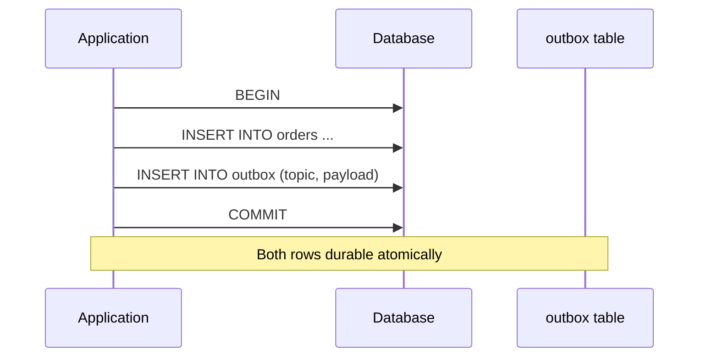
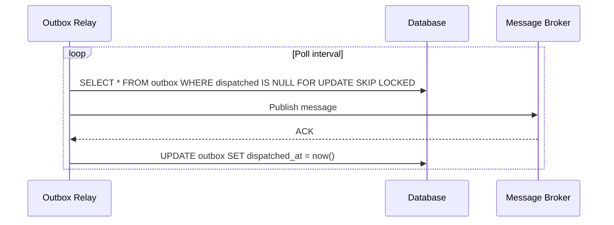
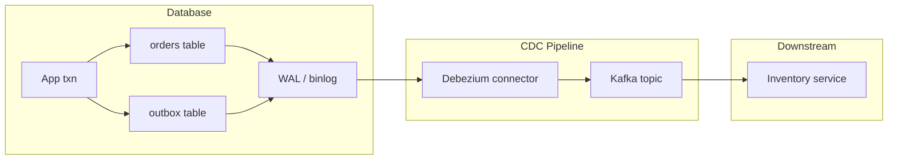

# Transactional Outbox

## 1. Executive Summary

The **transactional outbox** pattern solves the **dual-write problem**: an application must atomically update a database and publish a message to a broker, but these are two different systems that cannot share a single local ACID transaction without brittle XA/2PC. The pattern writes the message to an **outbox table** in the **same database transaction** as the business data change. A separate **message relay** process reads the outbox and publishes to the message broker, marking rows as dispatched.

This guarantees **no message without a database commit** and **no lost messages** for committed business state (assuming relay eventually runs). Delivery to consumers remains **at-least-once**—consumers must be **idempotent**. Relay implementations include **polling** the outbox table, **transaction log tailing** (CDC via Debezium), and **database triggers** (less common at scale).

The transactional outbox is a foundational pattern for **event-driven microservices**, **CQRS projections**, **saga choreography**, and **cache invalidation**. It pairs naturally with [Sagas](/docs/transactions/sagas) and replaces risky "write DB then publish to Kafka" ordering.

## 2. Why This Topic Matters

Principal interviews often ask: **"How do you reliably publish events when you update the database?"** Weak answers propose distributed transactions or hope for the best. Strong answers describe the outbox.

Failure modes without outbox:

- DB commits, message publish fails → **downstream never notified** (orphan state).
- Message publishes, DB rolls back → **ghost events** (consumers act on nonexistent data).
- Retry duplicates → **double processing** without idempotency.

Production systems that "just write to Kafka after INSERT" cause **inventory drift**, **missing search index updates**, and **billing discrepancies**. The outbox is **operationally visible**—relay lag becomes a metric; stuck rows trigger alerts.

## 3. Problems Being Solved

| Problem | Naive dual-write | Transactional outbox |
|---------|------------------|----------------------|
| Atomicity DB + event | Not guaranteed | Same local transaction |
| Lost event after commit | Possible | Outbox row durable with commit |
| Event without DB record | Possible if publish first | Prevented (outbox only on commit) |
| Cross-service 2PC | Blocking, complex | Avoided |
| Ordering per aggregate | Ad hoc | Relay can preserve order per key |

The outbox solves **reliable publication of side effects** from a local transaction. It does **not** provide **exactly-once end-to-end processing** without idempotent consumers and deduplication. It does **not** coordinate multi-database atomicity—that remains saga or 2PC territory.

## 4. Assumptions and System Model

Assume **single relational (or transactional) database** per service and a **message broker** (Kafka, SQS, RabbitMQ):

- Application opens local transaction.
- Business row(s) and outbox row inserted/updated together.
- **Relay** is a separate process with **at-least-once** publish semantics.
- Broker may duplicate; consumers dedupe via **event id** or idempotency store.
- **Failures:** App crash after commit (outbox row exists—relay picks up); relay crash mid-publish (retry safe with idempotent publish or transactional outbox status).

**Not assumed:** Global ordering across aggregates unless relay partitions by key. Instant delivery—relay introduces **latency**. Broker exactly-once without consumer cooperation.

## 5. Essential Terminology

| Term | Definition |
|------|------------|
| **Outbox table** | Table storing pending messages (`id`, `payload`, `topic`, `created_at`, `dispatched_at`). |
| **Dual-write problem** | Two writes without shared atomicity. |
| **Message relay** | Process publishing outbox rows to broker. |
| **Polling relay** | `SELECT ... FOR UPDATE SKIP LOCKED` loop. |
| **CDC relay** | Change Data Capture from WAL/binlog (Debezium). |
| **Inbox pattern** | Consumer-side dedup table for processed message ids. |
| **At-least-once delivery** | Message may arrive multiple times. |
| **Effectively-once** | At-least-once + idempotent consumer. |
| **Ordering key** | Partition key for ordered delivery per aggregate. |
| **Poison message** | Undeliverable outbox row—DLQ or skip policy. |

**Mnemonic:** Outbox = **One transaction**, **two writes in one DB**, **relay later**.

## 6. Core Mechanism

### Atomic write in application transaction



*Figure 1: Business data and outbox message commit together—no orphan publish possible.*

### Polling relay



*Figure 2: Relay claims rows, publishes, marks dispatched—retry-safe if mark fails after publish (duplicate risk → idempotent consumers).*

### CDC-based relay (Debezium)



*Figure 3: WAL tailing captures outbox inserts without polling load on primary—ordering follows log.*

## 7. Step-by-Step Walkthrough

**Scenario:** Order service creates order and emits `OrderCreated`.

| Step | Component | Action |
|------|-----------|--------|
| 1 | API handler | `BEGIN` |
| 2 | API handler | `INSERT orders (id, status) VALUES ('o1', 'PENDING')` |
| 3 | API handler | `INSERT outbox (id, aggregate_id, type, payload) VALUES ('e1', 'o1', 'OrderCreated', '{...}')` |
| 4 | API handler | `COMMIT` |
| 5 | Relay | Reads `e1`, publishes to `orders` topic with key `o1` |
| 6 | Relay | `UPDATE outbox SET dispatched_at=now() WHERE id='e1'` |
| 7 | Inventory consumer | Receives event, idempotent reserve; stores `e1` in inbox |

**Failure: relay crashes after Kafka ACK, before UPDATE:**

| State | Mitigation |
|-------|------------|
| Outbox row still undispatched | Relay republishes duplicate |
| Consumer inbox dedupes on `e1` | Effectively-once processing |

**Failure: publish before commit (anti-pattern):**

| State | Why outbox wins |
|-------|-----------------|
| Consumers see event; DB rolls back | Outbox prevents—event only after commit |

## 8. Invariants and Guarantees

| Property | Type | Statement |
|----------|------|-----------|
| **Atomicity (local)** | Safety | Business row and outbox row commit together |
| **No lost committed events** | Safety | Committed outbox row eventually relayed (liveness of relay) |
| **No pre-commit events** | Safety | Uncommitted outbox rolled back with txn |
| **Exactly-once broker delivery** | **Not** guaranteed | At-least-once typical |
| **Relay progress** | Liveness | Requires healthy relay; monitor lag |
| **Global ordering** | **Not** unless keyed partition + single relay shard |

**End-to-end exactly-once** is an **application property**: outbox + idempotent consumer + inbox (or broker idempotence where supported).

## 9. Failure Scenarios

### Scenario 1: Relay stopped 6 hours

**Effect:** Downstream stale; inventory not reserved.

**Mitigation:** Alert on `max(created_at) WHERE dispatched IS NULL` age; auto-restart relay.

### Scenario 2: Outbox table bloat

**Effect:** Poll queries slow; disk growth.

**Mitigation:** Archive/delete dispatched rows; partition by date; retention job.

### Scenario 3: Poison payload

**Effect:** Relay or consumer infinite fail loop.

**Mitigation:** DLQ after N tries; schema validation; quarantine row.

### Scenario 4: CDC slot lag (PostgreSQL)

**Effect:** WAL retention grows; disk fill on primary.

**Mitigation:** Monitor replication slot; scale consumer; separate outbox topic.

### Scenario 5: Ordering violation

**Effect:** `OrderCancelled` processed before `OrderCreated` on different partitions.

**Mitigation:** Same **partition key** (`order_id`) for all events of aggregate.

## 10. Performance Characteristics

| Factor | Impact |
|--------|--------|
| Extra INSERT per event | Small OLTP overhead—indexed outbox |
| Polling | `SKIP LOCKED` reduces contention; tune batch size and interval |
| CDC | Lower primary query load; WAL read overhead; operational complexity |
| Transaction size | Large payloads in outbox bloat txn—store reference to blob if needed |
| Relay throughput | Bottleneck at high event rates—horizontal relay workers with SKIP LOCKED |

**Latency:** Event visible downstream after **commit + relay delay**—typically tens to hundreds of ms; not synchronous.

## 11. Scalability Limits

- **Outbox table hot spot** on single partition—partition table by time.
- **Polling at 10k events/sec** may stress DB—prefer CDC.
- **Ordering per key** limits parallel relay for same aggregate.
- **Large messages** in outbox—use claim check pattern (S3 pointer in payload).

## 12. Operational Considerations

- **Metrics:** outbox lag (oldest undispatched), relay throughput, dispatch failures.
- **Schema migrations:** outbox table versioned payloads (upcasters).
- **Multi-region:** outbox per region; global ordering not automatic.
- **Replay:** Re-process from outbox archive or Kafka retention for disaster recovery.
- **Testing:** Integration test asserts event after commit; chaos-kill relay.

**Runbook: outbox lag alert**

1. Check relay process health (pods, Lambda errors, Debezium connector state).
2. Query `SELECT count(*), min(created_at) FROM outbox WHERE dispatched_at IS NULL`.
3. If DB load high—polling may starve; consider CDC or dedicated relay instance.
4. If Kafka down—relay backs up; do not delete undispatched rows.
5. After recovery, expect duplicate delivery burst—confirm consumer inbox capacity.
6. Post-incident: measure lag SLA breach duration; reconcile downstream if needed.

**Index design:** Composite index on `(dispatched_at, created_at)` where `dispatched_at IS NULL` partial index (PostgreSQL) speeds polling queries. Without index, relay full-scans bloat table—CPU spike on primary during peak checkout.

**Transactional outbox vs inbox symmetry:** Outbox guarantees publish intent; **inbox** on consumer guarantees process-once semantics. Both tables share design patterns (id, processed_at, payload hash)—operations teams can reuse monitoring dashboards.

**Exactly-once Kafka producer misconception:** Idempotent Kafka producer prevents duplicate **broker** writes from producer retries—it does **not** couple to your RDS commit. You still need outbox (or accept dual-write risk) at the database boundary.

**Sample outbox DDL (PostgreSQL):**

```sql
CREATE TABLE outbox (
  id            UUID PRIMARY KEY,
  aggregate_id  TEXT NOT NULL,
  event_type    TEXT NOT NULL,
  payload       JSONB NOT NULL,
  created_at    TIMESTAMPTZ NOT NULL DEFAULT now(),
  dispatched_at TIMESTAMPTZ
);
CREATE INDEX outbox_pending_idx ON outbox (created_at)
  WHERE dispatched_at IS NULL;
```

Relay query pattern: `SELECT ... FROM outbox WHERE dispatched_at IS NULL ORDER BY created_at LIMIT 100 FOR UPDATE SKIP LOCKED`.

## 13. Security Considerations

- **PII in outbox payload** — encrypt at rest; minimize fields; GDPR delete propagates to outbox archives.
- **Relay credentials** — least privilege to outbox SELECT and broker publish.
- **Tampering** — sign event payloads if downstream trust boundary requires.
- **Access control** — outbox table not exposed to reporting tools without scrubbing.

## 14. Cost Considerations

- **Storage:** Undispatched + archived rows; CDC WAL retention.
- **Compute:** Relay workers, Debezium connectors, Kafka partitions.
- **Engineering:** Simpler than XA; more moving parts than monolith triggers.
- **Saved incidents:** Avoids dual-write reconciliation teams.

**FinOps angle:** Outbox lag during incidents forces manual reconciliation teams—model cost of N engineers × hours against relay infrastructure ($hundreds/month). At scale, CDC connector HA (multiple tasks, monitoring) is cheaper than quarterly dual-write incident response.

**Payload size costs:** Storing 50KB JSON per outbox row at 10M orders/day is terabytes/year—use claim check to S3 for large attachments; outbox carries pointer only. Kafka message size limits (default 1MB) also constrain design.

**Comparison to nightly batch reconciliation:** Batch jobs compare DB to downstream and repair drift—cheaper infra but **longer inconsistency window** and higher support cost. Outbox is **near-real-time** insurance; many systems use **both** (outbox for happy path, reconciliation for audit).

## 15. Production Implementations

### Debezium + Kafka

Industry-standard CDC from PostgreSQL/MySQL outbox table to Kafka—**implementation choice** for high throughput.

### Maxwell's daemon / AWS DMS

Alternative CDC tools—evaluate operational fit.

### Framework support

- **Microservices.io** pattern reference
- **Eventuate** — outbox as productized pattern
- **Axon Framework** — event sourcing with outbox
- **Spring** — various outbox libraries (evaluate maturity)
- **Prisma / custom** — polling relay in worker process

### Uber / Netflix engineering blogs

Document outbox-style reliable publishing at scale—**anecdotal operational experience**; validate against your stack.

### AWS Lambda + RDS outbox

Short-lived Lambda functions are poor XA participants but effective **polling relays** on schedule (EventBridge) or triggered post-commit via separate worker tier. Avoid running relay in the same Lambda as request handler without durable dispatch marker—function freeze after response can lose in-memory publish.

### Multi-tenant SaaS

Include `tenant_id` in outbox rows and propagate to message headers for downstream authorization. Relay must not cross-publish tenant events to wrong topics—partition outbox polling by tenant for noisy-neighbor isolation at extreme scale.

### Schema evolution

Outbox payloads should carry `schema_version` and use **upcasting** on consumers when fields are added. Breaking changes require dual-write period or new event type (`OrderCreatedV2`) with consumers subscribing to both during migration.

**Relay implementation checklist:**

| Concern | Polling | CDC |
|---------|---------|-----|
| Primary DB load | SELECT every N ms | WAL read |
| Ordering | Application batch order | Log order |
| Ops complexity | Low | Connector HA, slots |
| Latency | Poll interval floor | Near real-time |
| Duplicate on failure | Yes | Yes |

## 16. Alternatives and Tradeoffs

| Approach | Atomicity | Complexity | When |
|----------|-----------|------------|------|
| Transactional outbox | DB + intent atomic | Relay ops | Default for microservices |
| XA/2PC | Full distributed | High, blocking | Legacy enterprise |
| Change Data Capture on main table | No separate outbox | Couples event schema to table | Simple domains |
| Event sourcing | Events are source of truth | High | Event-native domains |
| Publish then DB | **Unsafe** | Low | Never for critical paths |
| In-process only | N/A | Lowest | Monolith, no async |

## 17. Common Misconceptions

| Misconception | Reality |
|---------------|---------|
| "Outbox = exactly-once" | At-least-once to broker; consumer idempotency required. |
| "Kafka transactions replace outbox" | Kafka txn doesn't atomically commit your Postgres row. |
| "Polling doesn't scale" | SKIP LOCKED + batching works to moderate scale; CDC at high scale. |
| "Delete outbox row after insert to Kafka" | Keep dispatched audit or archive; replay needs. |
| "CDC removes need for outbox table" | CDC still needs outbox or clear change semantics on business table. |
| "Synchronous REST instead of outbox" | Couples availability; no durability if callee down. |

## 18. Principal Architect Perspective

1. **Mandate outbox** for any event that must match DB state.
2. **Standardize envelope** (`event_id`, `type`, `aggregate_id`, `occurred_at`, schema version).
3. **Monitor lag** as tier-1 metric—inventory and search depend on it.
4. **Pair with inbox** on consumers for money paths.
5. **Document replay procedure** before you need disaster recovery.

## 19. Architecture Review Exercise

**Scenario:** Team publishes to SQS after `commit()` in application code with try/catch retry.

**Review prompts:**

1. Crash between commit and publish?
2. Publish succeeds, commit fails?
3. Retry duplicates on consumer?
4. Redesign with outbox + relay?
5. CDC vs polling for 2k events/sec?

**Expected findings:** Replace with outbox; idempotent consumer; alert on lag; CDC if polling hot.

## 20. Whiteboard Explanation

**90-second version:**

> "Dual-write is writing the database and publishing a message as two separate steps—you can commit and fail to publish, or publish and roll back. Transactional outbox fixes this by inserting the message into an outbox table in the **same database transaction** as the business write. A relay process polls undispatched rows or CDC tails the WAL and publishes to Kafka, then marks rows sent. Delivery is at-least-once, so consumers need idempotency keys or an inbox table. Order events per aggregate with the same partition key. Monitor outbox lag. It's the standard replacement for XA between DB and broker and pairs with sagas for cross-service workflows."

## 21. Interview Questions

1. **What problem does outbox solve?**
   - *Signals:* Dual-write; atomic DB + message intent.

2. **How is atomicity achieved?**
   - *Signals:* Same local ACID transaction for business + outbox row.

3. **Polling vs CDC relay?**
   - *Signals:* SKIP LOCKED poll vs Debezium WAL; scale tradeoffs.

4. **Is delivery exactly-once?**
   - *Signals:* No—at-least-once; idempotent consumer.

5. **Relay crashes after publish, before mark?**
   - *Signals:* Duplicate publish; consumer dedupes.

6. **Outbox vs Kafka transactions?**
   - *Signals:* Kafka can't join your DB commit atomically.

7. **What columns in outbox table?**
   - *Signals:* id, payload, topic, created_at, dispatched_at, aggregate_id.

8. **Ordering guarantees?**
   - *Signals:* Partition by aggregate_id; single-threaded relay per key.

9. **Outbox bloat mitigation?**
   - *Signals:* Archive dispatched, partition, retention job.

10. **Pair with saga how?**
    - *Signals:* Local step commits + event triggers next saga step.

11. **Inbox pattern purpose?**
    - *Signals:* Consumer-side processed message dedup.

12. **When skip outbox?**
    - *Signals:* Fire-and-forget analytics, monolith synchronous only.

13. **WAL slot lag risk?**
    - *Signals:* Disk fill; monitor Debezium lag.

14. **Claim check pattern?**
    - *Signals:* Large payload in object store; pointer in outbox.

15. **How does outbox support saga choreography?**
    - *Signals:* Local commit + reliable event triggers next service.

16. **What if relay publishes but mark fails?**
    - *Signals:* Duplicate; consumer idempotency; safe to retry mark.

**Anti-patterns to flag in reviews:**

| Anti-pattern | Why it fails |
|--------------|--------------|
| Outbox in separate DB | Breaks atomicity with business data |
| Delete row before Kafka ACK | Lose message on crash |
| No dispatched_at column | Can't distinguish pending vs failed relay |
| Synchronous publish in HTTP handler | Couples availability; no crash safety |

## 22. Interview Follow-Ups

1. **Design search index update on product change.**
   - *Signals:* Outbox from catalog DB, indexer consumer, idempotent upsert.

2. **Global active-active—one outbox?**
   - *Signals:* Per-region outbox; conflict resolution; not single global order.

3. **Replay all events after bug—steps?**
   - *Signals:* Kafka retention, outbox archive, idempotent reprocess, caution on compensations.

## 23. Strong Answer Example

**Question:** "How do you keep MySQL and Kafka in sync when an order is placed?"

> "I'd use the **transactional outbox** in the order service database. In one transaction: insert the order row and insert an outbox row with `event_id`, `OrderCreated` payload, and `order_id` as partition key. A relay—either polling with `FOR UPDATE SKIP LOCKED` or Debezium CDC on the outbox table—publishes to Kafka. Consumers like inventory use an **inbox table** or idempotency store keyed by `event_id` so duplicates are safe. I'd alert on outbox lag over 30 seconds and archive dispatched rows after 7 days. I would not use XA between MySQL and Kafka or publish in application code after commit—the failure modes aren't acceptable for inventory. End-to-end is **effectively-once** with idempotent consumers, not broker exactly-once alone."

## 24. Weak Answer Example

**Question:** "How do you keep MySQL and Kafka in sync when an order is placed?"

> "We insert into MySQL then call Kafka producer in a try/catch. If Kafka fails we log and retry."

**Why weak:** No atomicity; crash window; no lag monitoring; duplicate retry undefined.

## 25. Hands-On Exercise

### Lab 009: Transactional Outbox (runnable)

Full hands-on lab at `labs/lab-009-outbox-pattern/` — FastAPI + Swagger on **port 8092**, in-memory outbox + broker (Kafka stand-in).

```bash
cd labs/lab-009-outbox-pattern
python3 -m venv .venv && source .venv/bin/activate
pip install -r requirements.txt
pytest tests/ -v
python -m src.main --demo
python -m src.main --serve
```

**Docker:**

```bash
docker compose -p lab009 -f docker/docker-compose.yml up --build -d
curl http://localhost:8092/health
./scripts/demo_outbox.sh
```

**Demo flow (Swagger at http://localhost:8092/docs):**

| Step | Endpoint | What happens |
|------|----------|--------------|
| 1 | `POST /v1/orders` | `INSERT order` + `INSERT outbox` — **same transaction** |
| 2 | `GET /v1/outbox?pending=true` | Unpublished `OrderCreated` event |
| 3 | `POST /v1/relay/run` | Relay publishes to broker; marks `published_at` |
| 4 | `POST /v1/consumer/run` | Idempotent inventory update by `event_id` |
| 5 | `POST /v1/consumer/run` again | `duplicates: 1` — at-least-once safe |

Scenario walkthrough: [Shopify Transactional Outbox](/docs/real-world-scenarios/shopify-transactional-outbox#hands-on-lab-local).

**Next lab:** [Sagas §25 Hands-On](/docs/transactions/sagas#25-hands-on-exercise) — Lab 010 orchestration on `:8093` ([engineer guide](/docs/transactions/sagas#engineer-guide-how-the-local-stack-works)).

### Build-from-scratch exercise (optional)

1. Create `orders` and `outbox` tables in PostgreSQL.
2. Wrap insert in single transaction.
3. Write polling relay script (Python/Node) with SKIP LOCKED.
4. Kill relay mid-batch; verify at-least-once behavior.
5. Add consumer inbox table with unique `event_id`.
6. Measure lag under load.
7. Optional: sketch Debezium connector config for same schema.

Or complete **Lab 009** above — implements steps 1–5 with 9 passing tests.

## 26. Knowledge Check

1. Dual-write problem? *(DB and broker without shared atomicity.)*
2. Outbox lives where? *(Same DB as business data.)*
3. Delivery semantics to broker? *(At-least-once typical.)*
4. SKIP LOCKED purpose? *(Concurrent relay workers without double-claim.)*
5. Consumer requirement? *(Idempotency or inbox.)*

## 27. Flashcards

| # | Front | Back |
|---|-------|------|
| 1 | Transactional outbox | Message in same DB txn as business write. |
| 2 | Dual-write | Separate DB + publish—unsafe. |
| 3 | Message relay | Publishes outbox to broker. |
| 4 | Polling relay | SELECT undispatched FOR UPDATE SKIP LOCKED. |
| 5 | CDC relay | Debezium tails WAL/binlog. |
| 6 | At-least-once | Duplicates possible—design for it. |
| 7 | Inbox pattern | Consumer dedup table. |
| 8 | Partition key | Order events per aggregate. |
| 9 | Outbox lag | Oldest undispatched—monitor metric. |
| 10 | vs XA | Outbox avoids 2PC blocking. |
| 11 | Claim check | Large payload offloaded to blob store. |
| 12 | Effectively-once | At-least-once + idempotent consumer. |

## 28. Cheat Sheet

```
OUTBOX
  Txn: business row + outbox row
  Relay: poll or CDC → broker
  Mark dispatched after ACK

GUARANTEES
  ✓ No event without commit
  ✓ Committed event eventually sent (if relay lives)
  ✗ Not exactly-once end-to-end

CONSUMER
  Idempotency key / inbox table
  Same partition key per aggregate

OPS
  Alert: undispatched age, relay errors
  Archive old dispatched rows
  WAL slot lag (CDC)

AVOID
  Publish after commit in app code
  XA DB + Kafka for microservices
```

## 29. Related Concepts

- [Sagas](/docs/transactions/sagas) — outbox emits saga step events
- [Two-Phase Commit](/docs/transactions/two-phase-commit) — alternative avoided by outbox
- [ACID and Isolation](/docs/transactions/acid-and-isolation) — local transaction boundary
- [Idempotency](/docs/distributed-systems-foundations/idempotency) — consumer requirement
- [Messaging and Streaming](/docs/messaging-and-streaming/overview) — broker layer

## 30. References

### Primary sources

- Chris Richardson, ["Transactional outbox pattern"](https://microservices.io/patterns/data/transactional-outbox.html) — pattern catalog.
- Hohpe, G., & Woolf, B. (2003). *Enterprise Integration Patterns* — messaging reliability foundations.

### Production and engineering

- Debezium Documentation — [Outbox Event Router](https://debezium.io/documentation/reference/stable/transformations/outbox-event-router.html) — CDC outbox integration.
- Uber Engineering — reliable event publishing posts — **implementation anecdotes**; verify for your stack.
- Martin Kleppmann, *DDIA* — Chapter 11 stream processing, change capture.

### Distinction

| Claim type | Source |
|------------|--------|
| Pattern definition | Richardson; Enterprise Integration Patterns |
| Debezium outbox SMT | Debezium official docs |
| Exactly-once limits | Kleppmann; distributed systems consensus |
