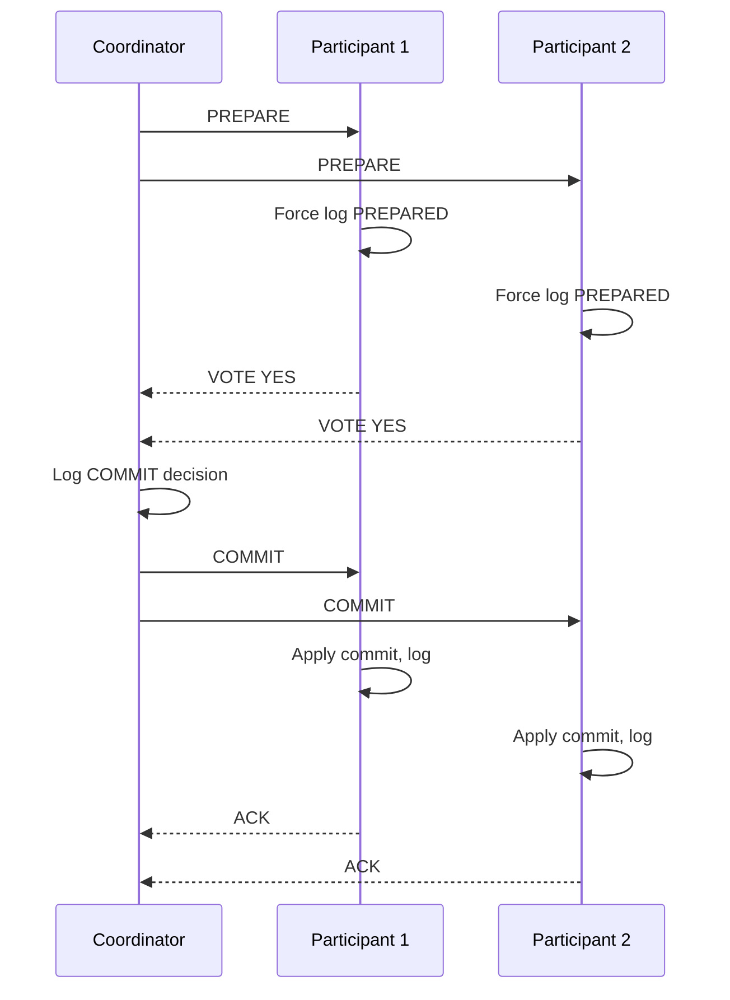
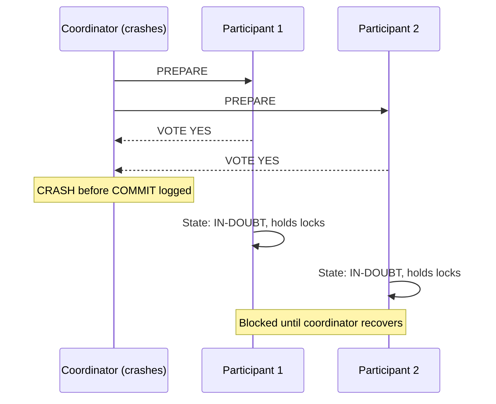
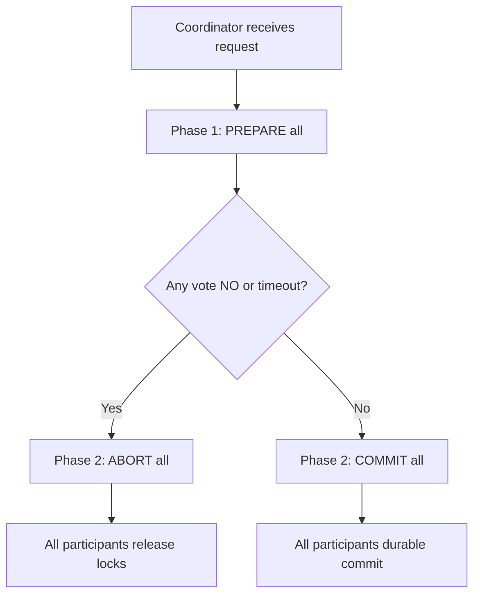

# Two-Phase Commit (2PC)

## 1. Executive Summary

**Two-Phase Commit (2PC)** is a distributed atomic commit protocol that coordinates multiple **participants** (resource managers) through a **coordinator** to ensure all participants either **commit** or **abort** a transaction together. Phase 1 (**prepare**): the coordinator asks each participant if it can commit; participants respond **YES** (vote commit) or **NO** (vote abort) after persisting a **prepare record** to durable storage. Phase 2 (**commit/abort**): if all vote YES, the coordinator sends **COMMIT**; otherwise **ABORT**. Participants write the final decision durably before acknowledging.

2PC provides **atomicity** across distributed resources when all participants and the coordinator behave correctly and recover from crashes using their logs. Its critical weakness is **blocking**: if the coordinator fails after participants vote YES, participants cannot unilaterally commit or abort—they are **blocked** until the coordinator recovers. This violates **termination** (a liveness property) under coordinator failure.

**XA** is the standard API binding 2PC to databases and message queues. Modern microservice architectures often **avoid 2PC** due to blocking, latency, and operational coupling—preferring **sagas**, **outbox**, or **idempotent** patterns instead. 2PC remains relevant in **shard coordinators**, **enterprise middleware**, and understanding **why** distributed transactions are hard.

## 2. Why This Topic Matters

Principal interviews use 2PC to test **distributed systems reasoning**:

- Can you walk through both phases with crash points?
- Why is 2PC **blocking** and does 3PC fix it completely?
- When is XA across two databases justified vs a saga?
- What happens to **availability** during coordinator partition?

Production systems using 2PC without understanding blocking have experienced **indefinite lock holds**, **connection pool exhaustion**, and **cascading outages** when a transaction manager dies mid-prepare. Architects who propose "just use distributed transactions" across twelve microservices underestimate **latency**, **coupling**, and **failure amplification**.

Conversely, architects who reject 2PC categorically may miss legitimate use cases: **co-located shard commits**, **single middleware-orchestrated** enterprise flows, or **strict financial** requirements within one operational boundary.

## 3. Problems Being Solved

| Problem | Without atomic commit | With 2PC (when it works) |
|---------|----------------------|--------------------------|
| Money debited in DB A, not credited in DB B | Inconsistent state | Both commit or both abort |
| Order created, inventory not decremented | Oversell / orphan orders | Atomic across resources |
| Dual-write to DB and queue | Message without record or vice versa | Theoretical atomicity via XA (rare in practice) |
| Cross-shard update in sharded RDBMS | Partial shard commit | Coordinator 2PC across shards |

2PC solves **atomicity of the commit decision** across participants. It does **not** solve **isolation** across services, **high availability** during coordinator failure, or **performance** at internet scale across many independent teams' databases.

## 4. Assumptions and System Model

Assume **crash-recovery** processes with **durable write-ahead logs**:

- **Coordinator** and **participants** can crash and restart; logs replay in-doubt transactions.
- **Network** can delay or partition messages; **not** Byzantine (no malicious nodes).
- **Participants** implement prepare: force log to disk before voting YES.
- **Timeout** handling is implementation-specific—may lead to heuristic decisions (dangerous).

**Not assumed:** Participants can communicate without coordinator in phase 2. Unlimited wait is acceptable—**in practice it is not** (liveness). Homogeneous trust boundary—all participants under same operational control.

**FLP reminder:** No deterministic async consensus in face of crash failures—but 2PC with synchronous coordinator decision is a **commit protocol**, not full consensus; blocking is the price.

## 5. Essential Terminology

| Term | Definition |
|------|------------|
| **Coordinator** | Transaction manager initiating 2PC. |
| **Participant** | Resource manager (database, queue) in transaction. |
| **Prepare (vote) phase** | Phase 1: can you commit? |
| **Commit phase** | Phase 2: global decision applied. |
| **In-doubt / prepared** | Participant voted YES, awaiting coordinator decision. |
| **Transaction log** | Durable record of prepare and commit/abort. |
| **Blocking** | Prepared participant cannot progress if coordinator unavailable. |
| **Heuristic decision** | Participant unilaterally commits/aborts—breaks atomicity. |
| **XA** | X/Open standard for distributed transaction interfaces. |
| **3PC** | Three-Phase Commit—reduces blocking with extra phase under assumptions. |
| **TCC** | Try-Confirm-Cancel—application-level compensation pattern (related). |

**Mnemonic:** 2PC = **Prepare** (ask), **Commit** (tell)—coordinator is the **single decision point**.

## 6. Core Mechanism

### Protocol phases



*Figure 1: Successful 2PC—all participants prepare, coordinator commits globally.*

### Coordinator failure after prepare (blocking)



*Figure 2: Blocking scenario—participants voted YES but lack global decision.*

### Abort path



*Figure 3: Single NO vote or coordinator timeout triggers global abort—participants roll back.*

## 7. Step-by-Step Walkthrough

**Scenario:** Transfer from Account DB (P1) to Ledger DB (P2) via JTA coordinator.

| Step | Actor | Action | State |
|------|-------|--------|-------|
| 1 | App | `begin()` XA transaction | — |
| 2 | App | Debit P1 (uncommitted) | P1: working |
| 3 | App | Credit P2 (uncommitted) | P2: working |
| 4 | Coord | PREPARE P1, P2 | — |
| 5 | P1, P2 | Flush prepare to disk; vote YES | **Prepared** |
| 6 | Coord | Log COMMIT; send COMMIT | — |
| 7 | P1, P2 | Apply commit; ACK | Committed |

**Crash at step 5 after both YES, coordinator dies:**

| Recovery action | Who |
|-----------------|-----|
| P1, P2 remain in-doubt | Hold row locks |
| Coordinator recovers from log | If decision logged, complete phase 2 |
| If no decision logged | Coordinator may query participants or abort per timeout policy |
| Admin heuristic commit | **Last resort**—manual inconsistency risk |

## 8. Invariants and Guarantees

| Property | Type | Statement |
|----------|------|-----------|
| **Atomicity** | Safety | All commit or all abort—no partial durable outcome |
| **Agreement** | Safety | All participants reach same decision |
| **Validity** | Safety | If all vote YES and no failures, outcome is commit |
| **Termination** | Liveness | **Violated** under coordinator failure after prepare |
| **Isolation during 2PC** | Depends | Locks held through prepare—blocks other txs |

**Safety vs liveness:** 2PC prioritizes **safety** (no split commit) over **liveness** (progress when coordinator unavailable).

## 9. Failure Scenarios

### Scenario 1: Coordinator crash after prepare

**Effect:** Participants blocked; locks held; connection pool depletion.

**Mitigation:** HA coordinator cluster; short transactions; monitoring in-doubt txs; avoid 2PC across unrelated services.

### Scenario 2: Participant crash before prepare response

**Effect:** Coordinator aborts—safe but transaction failed.

**Mitigation:** Retry idempotent application logic.

### Scenario 3: Network partition coordinator ↔ participant

**Effect:** Timeout → abort or indeterminate state; risk of heuristic if misconfigured.

**Mitigation:** Conservative timeout policy; never enable heuristic commit without ops playbook.

### Scenario 4: XA across geo-distributed databases

**Effect:** Prepare RTT across regions; multi-second commits; fragility.

**Mitigation:** Saga, outbox, or single-region transactional boundary.

### Scenario 5: Message broker + DB XA

**Effect:** Rare support; brittle; performance collapse under load.

**Mitigation:** Transactional outbox pattern instead.

## 10. Performance Characteristics

| Factor | Impact |
|--------|--------|
| Round trips | 2 phases × N participants minimum |
| Disk fsync | Prepare force-log on each participant—latency floor |
| Lock duration | Held from first write through commit—contention |
| Coordinator bottleneck | Single decision point—scale limit |
| Recovery | In-doubt scan on restart |

**Rule of thumb:** 2PC latency ≈ **slowest participant prepare** + **coordinator fsync** + **commit fan-out**—unsuitable for cross-region microservice choreography at high QPS.

**Quantitative sketch (illustrative, not benchmark):** Three participants, 2ms LAN RTT, 5ms fsync each prepare, 2ms coordinator log—phase 1 ≈ 7ms (parallel prepare) + phase 2 ≈ 7ms commit fan-out ≈ **14ms minimum** excluding lock contention. Cross-region 50ms RTT per hop pushes single transaction past **100ms**—unacceptable for user-facing paths at scale.

**Connection pool interaction:** Prepared transactions hold database connections until resolution. A coordinator outage during peak can exhaust pools across all participants simultaneously—cascading **503** errors unrelated to business logic capacity. Pool sizing must account for **worst-case in-doubt duration**, not average transaction time.

**Comparison to single-phase commit:** Local commit is one fsync + lock release. 2PC adds **minimum two additional network rounds** and **one extra durable write per participant**—throughput ceiling drops roughly proportional to participant count under contention.

## 11. Scalability Limits

- **Participant count:** Each adds prepare/commit RTT and failure domain.
- **Cross-team databases:** Operational coupling—schema changes break coordinator.
- **Microservices:** Independent deployment incompatible with long-lived global locks.
- **Throughput:** Lock hold time caps TPS on contended rows across participants.

**When 2PC doesn't scale:** Internet-facing checkout across 8 services; multi-region active-active.

## 12. Operational Considerations

- **Monitor in-doubt transactions** on all participants.
- **Coordinator HA:** Active-passive with shared log or clustered TM.
- **Timeout policies:** Document abort vs retry; forbid heuristic without approval.
- **Runbooks:** Manual resolution of orphaned prepared transactions.
- **Avoid** XA in serverless with short-lived connections—prepare outlives function.

## 13. Security Considerations

- **Coordinator as trust root:** Compromised coordinator can force commit/abort decisions.
- **Participant authentication:** XA connections must be mutually authenticated.
- **Denial of service:** Attacker initiates many distributed txs → lock exhaustion.
- **Audit:** Global transaction IDs for forensics across systems.

## 14. Cost Considerations

- **Latency tax:** Multi-database prepare on every request.
- **Infrastructure:** Transaction manager licensing (legacy Java EE), HA pairs.
- **Engineering:** Debugging in-doubt states across teams.
- **Opportunity cost:** Simpler async patterns delayed.

**Decision criterion:** 2PC when **atomicity boundary** is **one org, few resources, low latency variance**—not cross-company microservices.

## 15. Production Implementations

### Java EE / Jakarta JTA

`UserTransaction`, `XAResource`—classic enterprise 2PC; Narayana, Atomikos transaction managers.

### Microsoft MSDTC

Distributed Transaction Coordinator for SQL Server cross-database—**implementation** with known ops complexity.

### MySQL XA

`XA START`, `XA PREPARE`, `XA COMMIT`—used in shard proxies (e.g., some middleware); operational caution advised.

### Google Spanner

Distributed commits via **Paxos groups** and TrueTime—not classic 2PC to app, but **two-phase commit at shard level** internally (Corbett et al., 2012).

### Shard coordinators

Vitess, Citus, some ORM shard layers use 2PC across shards—**bounded** participant set.

### PostgreSQL prepared transactions

`PREPARE TRANSACTION` exposes 2PC primitives for external coordinators—rare in application code but used by foreign data wrappers and some replication tools. Prepared transactions appear in `pg_prepared_xacts`; ops must monitor and resolve—orphaned prepared transactions hold locks indefinitely.

### Limbo transaction resolution

Database vendors document **heuristic** and **automatic** resolution policies. DB2 and Oracle expose views for in-doubt transactions; resolution typically requires DBA intervention with knowledge of global transaction manager state. **Never** heuristic-commit in production without understanding which participants already committed—split-brain across databases is worse than temporary unavailability.

### Cloud-managed databases

RDS, Cloud SQL, and Azure SQL support distributed transactions in limited scenarios (often same-region linked servers or elastic transactions). Product documentation defines supported topologies—**verify** before architecture sign-off; cross-cloud 2PC is generally unsupported or discouraged.

**Historical context:** 2PC was the default answer in 1990s enterprise Java (EJB containers). Microservices backlash correctly identified coupling costs, but the **atomic commit problem** did not disappear—it moved to sagas, outbox, and reconciliation. Principal architects should articulate **when the pendulum swings back** (e.g., consolidated data platform with shard-level 2PC) versus when async patterns remain mandatory.

## 16. Alternatives and Tradeoffs

| Approach | Atomicity | Availability | Complexity |
|----------|-----------|--------------|------------|
| 2PC / XA | Strong | Blocking on coord failure | Medium in enterprise |
| 3PC | Strong (under assumptions) | Less blocking | Extra phase, edge cases |
| Saga | Eventual per step | High | Compensation logic |
| Outbox + CDC | At-least-once delivery | High | No cross-DB atomicity |
| Single DB | Full ACID | DB limits | Simplest when possible |
| Paxos/Raft log | Ordered commands | Quorum dependent | Internal to distributed DB |

## 17. Common Misconceptions

| Misconception | Reality |
|---------------|---------|
| "2PC is consensus" | Commit atomicity, not general state machine consensus. |
| "3PC fully solves blocking" | Requires bounded time and assumptions; rarely used. |
| "XA is easy in microservices" | Coupling, locks, ops nightmares. |
| "Prepare is cheap" | Forced disk sync—expensive. |
| "Heuristic commit is fine" | Breaks global atomicity—manual repair. |
| "2PC gives serializability globally" | Atomicity of commit ≠ global isolation. |

## 18. Principal Architect Perspective

1. **Default to saga/outbox** for cross-service; justify 2PC explicitly.
2. **Shrink transaction scope**—milliseconds, few participants.
3. **Coordinator HA** is non-optional if using 2PC in production.
4. **Teach org** that prepared locks are **incident multipliers**.
5. **Map to business boundary**—2PC inside one bounded context, not across org chart.

**Organizational implications:** Teams owning participant databases must coordinate schema migrations with transaction manager upgrades—release trains become coupled. Incident response spans multiple on-call rotations when in-doubt transactions appear. Executive stakeholders may hear "ACID guaranteed" without understanding **availability** tradeoffs during coordinator maintenance—translate blocking risk into revenue-at-risk during peak if checkout holds locks for seconds.

**Decision framework:**

| Signal | Lean away from 2PC | Lean toward 2PC |
|--------|-------------------|-----------------|
| Team topology | Independent microservice teams | Single platform team |
| Latency SLO | Sub-100ms p99 | Batch, back-office |
| Participant count | >3 heterogeneous services | 2–3 co-located shards |
| Failure mode tolerance | Must progress during TM outage | Can wait for recovery |
| Regulatory | Reconciliation acceptable | Hard atomicity mandate in one boundary |

**Teaching moment:** Draw the coordinator crash after prepare on a whiteboard in every architecture review proposing XA—if the room cannot articulate recovery, the design is not ready.

## 19. Architecture Review Exercise

**Scenario:** E-commerce platform proposes XA between Order MySQL, Inventory PostgreSQL, and Kafka via Atomikos.

**Review prompts:**

1. Latency impact at 500 orders/sec?
2. Coordinator SPOF?
3. Kafka XA support maturity?
4. Failure: inventory prepares YES, coordinator dies?
5. Redesign with outbox + saga?

**Expected findings:** Reject or drastically narrow scope; outbox for order+event; saga for inventory; idempotent consumers.

## 20. Whiteboard Explanation

**90-second version:**

> "Two-phase commit makes multiple databases all commit or all abort. Phase one: coordinator asks everyone to prepare—participants force-log they're ready and vote yes or no. Phase two: if all yes, coordinator says commit; else abort. The problem is blocking: if participants voted yes and the coordinator crashes before recording the decision, they're stuck holding locks until it recovers—they can't safely choose alone. That's why microservices avoid XA across services and use sagas or outbox instead. 2PC still appears inside shard coordinators and enterprise middleware. Safety over liveness: we won't split-commit, but we might wait forever. Three-phase commit tries to fix blocking with an extra pre-commit phase but adds complexity and assumptions."

## 21. Interview Questions

1. **Describe 2PC phases.**
   - *Signals:* Prepare/vote, then commit/abort based on unanimous YES.

2. **Why is 2PC blocking?**
   - *Signals:* Prepared participant can't decide without coordinator's global outcome.

3. **What is written to disk at prepare?**
   - *Signals:* Prepare record—participant committed to vote YES if received.

4. **Coordinator fails after all YES—what state?**
   - *Signals:* Participants in-doubt; locks held.

5. **2PC vs saga?**
   - *Signals:* Atomic vs compensating steps; availability tradeoff.

6. **What is XA?**
   - *Signals:* Standard distributed transaction API for RM coordination.

7. **Does 3PC eliminate all blocking?**
   - *Signals:* Reduces under timing assumptions; not a silver bullet.

8. **Heuristic commit danger?**
   - *Signals:* Participant guesses; global atomicity broken.

9. **When is 2PC appropriate?**
   - *Signals:* Co-located shards, enterprise same-ops-boundary, few resources.

10. **2PC safety or liveness tradeoff?**
    - *Signals:* Safety (atomicity) preserved; liveness sacrificed on coord failure.

11. **How does Spanner commit differ from app-level XA?**
    - *Signals:* Internal Paxos groups, TrueTime—not classic app 2PC.

12. **Performance bottleneck in 2PC?**
    - *Signals:* Prepare fsync, lock duration, slowest participant.

13. **What monitors for 2PC ops?**
    - *Signals:* In-doubt count, prepare duration, lock waits.

14. **Can Kafka participate in XA reliably?**
    - *Signals:* Skepticism; ecosystem prefers outbox; verify product support.

15. **What is an in-doubt transaction?**
    - *Signals:* Participant voted YES; awaiting global commit/abort decision.

16. **How does 2PC relate to FLP?**
    - *Signals:* 2PC sacrifices termination (liveness) for atomicity; distinct from consensus impossibility framing.

## 22. Interview Follow-Ups

1. **Design cross-bank transfer without 2PC.**
   - *Signals:* Saga, reconciliation, idempotency keys.

2. **Shard across 4 MySQL—need 2PC?**
   - *Signals:* Cross-shard writes; Vitess 2PC; or avoid cross-shard txs.

3. **Prepared transaction stuck 24h—playbook?**
   - *Signals:* Find coord decision, commit/abort, never heuristic without analysis.

## 23. Strong Answer Example

**Question:** "Should we use XA for order and payment microservices?"

> "I'd avoid XA across independent microservices with separate databases and teams. 2PC blocks participants if the transaction manager fails after prepare, holds locks across two services, and couples deployments and schema changes. Latency adds two-phase round trips across networks. Instead I'd keep each service's state change in a **local ACID transaction**, use the **transactional outbox** to publish events, and implement a **saga** with compensating actions if payment fails after order created—idempotency keys on every step. If both services were shards of **one** operational database cluster behind a coordinator, 2PC might be justified—but that's not the typical microservice topology. I'd document the failure modes: in-doubt txs, pool exhaustion, and why we chose availability over distributed ACID."

## 24. Weak Answer Example

**Question:** "Should we use XA for order and payment microservices?"

> "Yes, XA gives ACID across services so data stays consistent."

**Why weak:** Ignores blocking, liveness, latency, ops coupling, microservice boundaries; conflates local and distributed ACID.

## 25. Hands-On Exercise

1. Read MySQL XA syntax; start XA transaction on local instance.
2. `XA START`, insert row, `XA END`, `XA PREPARE`.
3. Observe `XA RECOVER` shows in-doubt xid.
4. `XA COMMIT` or `XA ROLLBACK`.
5. Document what happens if you disconnect before commit.
6. Compare latency: local commit vs XA with two connections (simulated participants).
7. Write ADR: saga vs 2PC for a two-service flow in your domain.

## 26. Knowledge Check

1. Phase 1 name? *(Prepare / voting.)*
2. Blocking cause? *(Coordinator failure after unanimous YES.)*
3. Property sacrificed? *(Liveness / termination.)*
4. XA role? *(Standard RM interface for 2PC.)*
5. Modern microservice alternative? *(Saga, outbox.)*

## 27. Flashcards

| # | Front | Back |
|---|-------|------|
| 1 | 2PC Phase 1 | PREPARE—vote YES/NO, log prepare. |
| 2 | 2PC Phase 2 | COMMIT or ABORT global decision. |
| 3 | Blocking | Prepared + coordinator gone = wait. |
| 4 | In-doubt | Voted YES, no final decision yet. |
| 5 | XA | X/Open distributed transaction API. |
| 6 | Heuristic commit | Unilateral decision—breaks atomicity. |
| 7 | 3PC | Extra pre-commit phase; timing assumptions. |
| 8 | Safety | All commit or all abort—2PC provides. |
| 9 | Liveness | May block—2PC violates on coord crash. |
| 10 | Saga alternative | Local txs + compensation. |
| 11 | Prepare cost | Force disk sync per participant. |
| 12 | Spanner | Internal distributed commit, not app XA. |

## 28. Cheat Sheet

```
2PC
  P1: PREPARE → vote YES (force log)
  P2: COMMIT or ABORT all

FAILURE
  Coord dies after YES → BLOCKED
  Heuristic → avoid

VS SAGA
  2PC: atomic, blocking, coupled
  Saga: eventual, available, compensate

WHEN 2PC
  Same ops boundary, few shards
  NOT: cross-team microservices

OPS
  Monitor in-doubt, coord HA, short txs
```

## 29. Related Concepts

- [ACID and Isolation](/docs/transactions/acid-and-isolation) — local atomicity 2PC extends
- [Sagas](/docs/transactions/sagas) — alternative distributed pattern
- [Transactional Outbox](/docs/transactions/transactional-outbox) — reliable event publish without XA
- [Safety and Liveness](/docs/distributed-systems-foundations/safety-and-liveness) — 2PC tradeoff framing
- [Consensus](/docs/consensus/overview) — related but distinct coordination

## 30. References

### Primary sources

- Gray, J., & Reuter, A. (1993). *Transaction Processing: Concepts and Techniques.* — 2PC specification and analysis.
- Skeen, D. (1981). ["Nonblocking Commit Protocols."](https://www.cs.cornell.edu/skeen/papers/skeen81.pdf) — 3PC and blocking discussion.
- X/Open CAE Specification — Distributed Transaction Processing (DTP) Model — XA standard.

### Production and engineering

- Corbett, J. C., et al. (2012). ["Spanner."](https://research.google/pubs/pub39966/) — distributed commit at scale.
- Martin Kleppmann, *DDIA* — Chapter 9 distributed transactions.
- Narayana / Atomikos documentation — JTA transaction manager behavior.

### Distinction

| Claim type | Source |
|------------|--------|
| 2PC blocking | Gray & Reuter; textbook consensus |
| 3PC assumptions | Skeen (1981) |
| XA API | X/Open DTP |
| Microservice guidance | Engineering practice; Kleppmann |
