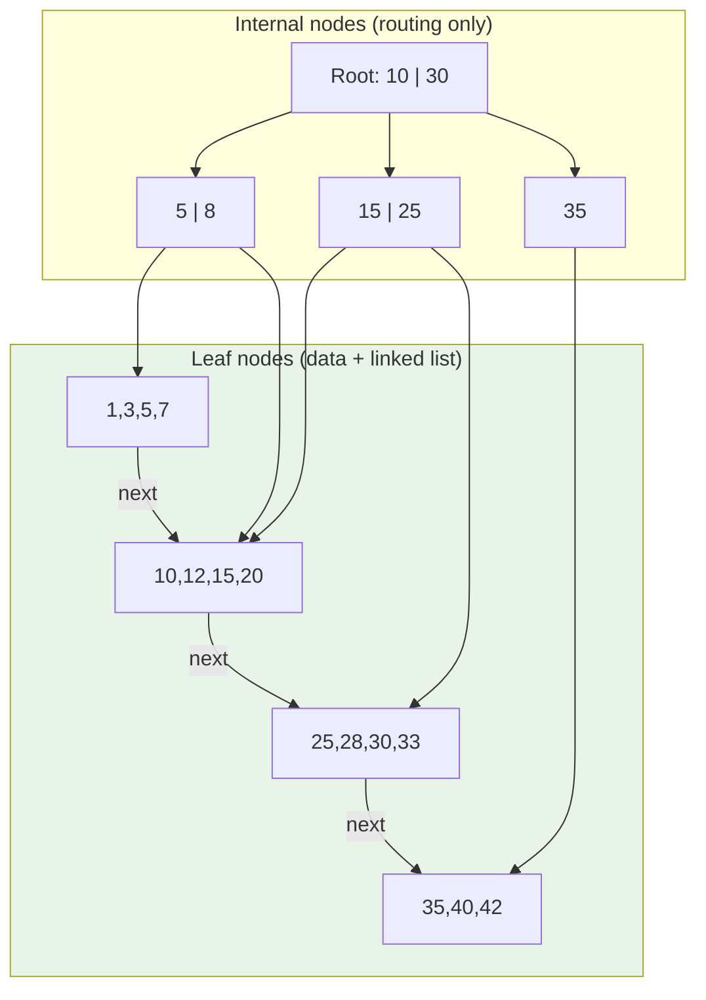
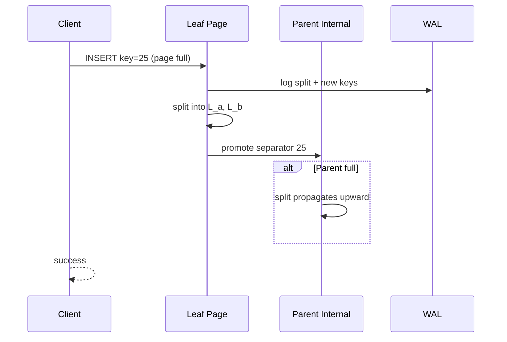
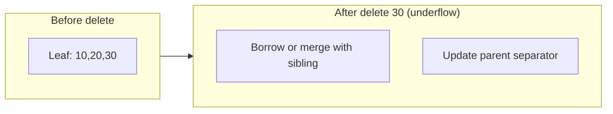

# B-Trees

## 1. Executive Summary

**B-trees** (and the ubiquitous **B+ trees** used in production databases) are balanced tree data structures optimized for **block-oriented storage**. Each node occupies one or more disk pages; keys are kept sorted within nodes; tree height remains logarithmic in the number of keys because nodes have high **fan-out** (hundreds of keys per page). Reads perform a root-to-leaf descent with typically three to four I/Os for billions of keys. Writes update leaf pages in place, triggering **splits** and **merges** that propagate upward while preserving balance.

B+ trees differ from classical B-trees by storing all records (or pointers to records) in **leaf nodes** linked for sequential scan, with internal nodes holding only separator keys—this maximizes fan-out and improves range-query performance. PostgreSQL, MySQL InnoDB, Oracle, SQL Server, and SQLite all rely on B-tree variants as default index structures.

For principal architects, B-trees embody the **read-optimized, update-in-place** design point: excellent point and range reads, predictable latency when the working set fits memory, but **random write amplification** on inserts to random keys and **latch contention** on hot leaf pages. This chapter covers structure, operations, concurrency, clustering, fragmentation, and production tuning—with explicit comparison to LSM alternatives.

## 2. Why This Topic Matters

B-trees are the default mental model for **relational OLTP** indexing. Interviewers expect you to:

- Draw a B+ tree insert with split.
- Explain why height is \(O(\log_F N)\) for fan-out \(F\).
- Contrast clustered vs secondary indexes (InnoDB vs PostgreSQL).
- Diagnose page splits and bloat from random UUID primary keys.

Production failures include: **index bloat** from MVCC leaving dead entries until vacuum, **right-edge hot spots** on monotonic inserts (mitigated by hash partitioning or reverse keys in some engines), and **buffer pool pollution** from large range scans. Choosing a random UUID clustered primary key without understanding leaf page churn has caused measurable write amplification in multiple documented migrations—validate for your schema.

## 3. Problems Being Solved

| Problem | B-tree mechanism |
|---------|------------------|
| Equality lookup by key | Tree descent \(O(\log N)\) I/Os |
| Ordered range scan | Leaf-level sibling links |
| Insert/delete while sorted | Splits/merges maintain balance |
| Fit index in memory hierarchy | Page-sized nodes align with I/O |
| Concurrent access | Latch/crabbing on nodes; MVCC above leaves |
| Minimize tree height | High fan-out vs binary trees |

B-trees are **not** optimal for pure append-only write floods or write-heavy key-value workloads at extreme scale—LSM trees address that tradeoff.

## 4. Assumptions and System Model

- **Page size** \(P\) is fixed (e.g., 8 KiB); one node ≤ one page (often).
- **Fan-out** \(F\): maximum children per internal node, driven by key size and \(P\).
- **Balanced:** all leaves at same depth.
- **Durability:** page updates coordinated with WAL (see [Write-Ahead Log](/docs/storage-engines/write-ahead-log)).
- **Comparison-based ordering** on keys; collation affects key layout.

**Not assumed:** Keys fit in memory entirely; lock-free B-trees without careful design; optimal for SSD wear-minimization on random writes.

## 5. Essential Terminology

| Term | Definition |
|------|------------|
| **B-tree** | Self-balancing tree; keys and records may appear in internal nodes |
| **B+ tree** | Records only in leaves; internal nodes are routing separators |
| **Fan-out** | Number of child pointers per internal node |
| **Root / internal / leaf** | Node types by position in tree |
| **Page split** | Node overflows → split into two siblings, promote separator |
| **Page merge** | Underflow after delete → merge or borrow from sibling |
| **Clustered index** | Leaf stores row data ordered by PK (InnoDB) |
| **Secondary index** | Leaf stores PK or row pointer to heap |
| **Fill factor** | Target occupancy after split to delay next split |
| **Crabbing** | Latch child then release parent when safe (concurrency) |
| **Index-only scan** | Query satisfied from index leaves without heap fetch |

## 6. Core Mechanism

### B+ tree structure



*Figure 1: B+ tree: internal nodes hold separators; leaves hold keys/records and link for range scans.*

### Search

1. Start at root; binary search keys in page to pick child pointer.
2. Repeat until leaf reached.
3. Binary search leaf for key or insertion position.

**I/O count:** One read per level; height \(\lceil \log_F N \rceil\). With \(F \approx 200\) and 4 levels, \(N\) can exceed \(10^9\).

### Insert with split



*Figure 2: Leaf split may cascade to root; each structural change is WAL-logged.*

### Delete with merge/borrow

Delete from leaf; if below minimum occupancy, **borrow** from sibling or **merge** siblings and remove separator from parent—may cascade upward.



*Figure 3: Underflow handling preserves minimum occupancy and balance.*

## 7. Step-by-Step Walkthrough

**Scenario:** InnoDB clustered primary key insert on auto-increment `id`.

| Step | Action | Effect |
|------|--------|--------|
| 1 | Descend B+ tree to rightmost leaf | Sequential inserts hit same leaf—cache friendly |
| 2 | Append row in leaf page | No split until page full |
| 3 | Page full → split | Half rows to new leaf; parent gets new separator |
| 4 | WAL records split | Durable before visible to crash recovery |
| 5 | Secondary index insert | Separate B+ tree; stores PK in leaf |

**Contrast—random UUID PK:** Inserts scatter across leaves → more splits, colder cache, higher write amp.

**Range scan:** Locate start key in leaf, follow **next** pointers along leaf level—sequential I/O within leaves.

## 8. Invariants and Guarantees

| Invariant | Statement |
|-----------|-----------|
| **Balance** | All leaves at same depth |
| **Order** | Keys sorted within each node; separators route correctly |
| **Occupancy** | Nodes between min and max fill (except root) |
| **Leaf linkage** | Leaves form ordered linked list (B+ tree) |
| **Durability** | Structural changes atomic w.r.t. WAL recovery rules |

**Safety:** Tree structure recoverable after crash via redo. **Liveness:** Inserts progress unless latch deadlock or disk full—engine-specific.

## 9. Failure Scenarios

### Scenario 1: Torn leaf page during split

**Effect:** Inconsistent parent/child pointers without recovery.

**Mitigation:** WAL redo of entire split; checksum on page; doublewrite (InnoDB).

### Scenario 2: Hot leaf latch contention

**Setup:** Many threads insert same key range or max PK with gap locks.

**Effect:** Serializes on leaf latch—throughput ceiling.

**Mitigation:** Partition keys, adjust isolation, use `INSERT` buffering patterns.

### Scenario 3: Index bloat (PostgreSQL)

**Setup:** Heavy updates; MVCC leaves dead index tuples.

**Effect:** Larger index, more I/O per scan.

**Mitigation:** `REINDEX`, autovacuum tuning, fillfactor.

### Scenario 4: Secondary index random I/O

**Setup:** Wide table; query uses non-covering secondary index.

**Effect:** Each index entry → heap fetch (random I/O).

**Mitigation:** Covering index, clustering, denormalization.

### Scenario 5: Depth explosion (wrong key type)

**Setup:** Tiny pages or huge keys → low fan-out.

**Effect:** More levels, more I/O per read.

**Mitigation:** Shorter keys, appropriate page size.

### Scenario 6: Root node latch hotspot

**Setup:** Extremely high concurrent insert rate to random keys across entire key space.

**Effect:** Even with leaf-level parallelism, periodic root-to-leaf path contention on upper levels during splits propagating to root.

**Mitigation:** Partition table/index, hash sharding at application layer, or switch write path to LSM for ingest then bulk load B-tree index offline.

## 10. Performance Characteristics

| Operation | Typical I/O | Notes |
|-----------|-------------|-------|
| Point lookup | \(h\) page reads | \(h\) = tree height; often cached |
| Range scan | \(h\) + sequential leaves | Excellent locality along leaves |
| Insert | \(h\) reads + 1–2 writes + splits | Splits add WAL and pages |
| Delete | Similar + possible merge | Less common than insert in append workloads |
| Update in place | If key unchanged, one leaf | Key change = delete + insert |

**Height calculation (interview skill):** If each internal node references \(F\) children and the tree has height \(h\), capacity is roughly \(F^\{h\}\). With 8 KiB pages, 8-byte keys, and 8-byte pointers, fan-out can exceed 500—so height 3 supports on the order of \(10^8\) keys with three disk reads on a cold cache. Narrow keys and prefix compression (PostgreSQL deduplication) increase effective fan-out.

**SSD vs HDD:** SSD reduces seek penalty; **write amplification** from page rewrites still matters for device wear. NVMe reduces read latency but does not eliminate latch contention on hot leaves.

**Memory:** Buffer pool caches hot branches—root and upper levels often resident. A rule of thumb for OLTP: if the active index working set fits `shared_buffers`, point-read p99 drops sharply because only the leaf may miss cache.

**Prefix compression and suffix truncation:** Production B-trees often store only enough key bytes to disambiguate sibling separators in internal nodes, shrinking keys and widening fan-out—an **implementation choice** that improves cache efficiency but complicates reasoning about worst-case height.

## 11. Scalability Limits

- **Single hot index page:** Write scalability bound on one leaf latch.
- **Height:** Grows slowly; \(F\) dominates—UUID keys don't change height much but hurt **cache locality**.
- **Dataset >> RAM:** Every cold read pays \(h\) I/Os; range scans stream through disk.
- **Sharding:** Scale by splitting B-tree across nodes—each shard is independent tree.

**Rule:** B-tree scales reads with cache; writes scale with partition count and insert locality.

## 12. Operational Considerations

- Monitor index bloat, page splits (where exposed), buffer pool hit rate.
- Choose PK for insert pattern: sequential vs random—document tradeoff.
- `fillfactor` (PostgreSQL) leaves room for HOT updates without index churn.
- Plan `REINDEX` / rebuild for bloated indexes during maintenance windows.
- Statistics for query planner—correlate with actual tree depth and cardinality.

## 13. Security Considerations

- Index entries may leak **deleted** key values until vacuum—forensics concern.
- Encrypted tablespace: B-tree pages encrypted at rest; side-channel via timing on tree depth (niche).
- DoS: adversarial keys causing worst-case depth or split storms—rate limits.

## 14. Cost Considerations

- Larger indexes (bloat) → more storage and backup cost.
- Random-write heavy workloads on cloud disks → higher IOPS tier pricing.
- Covering indexes trade storage for read CPU/I/O savings—calculate per query.

## 15. Production Implementations

### PostgreSQL B-tree (nbtree)

Lehman–Yao style high-concurrency B-tree; heap separate from indexes; MVCC index entries until vacuum. Supports INCLUDE columns for covering indexes. **Heap-Only Tuple (HOT)** updates avoid new index entries when updated row stays on same page and indexed columns unchanged—critical for reducing secondary index write amplification on update-heavy tables. **Fillfactor** defaults to 90% on B-tree indexes, reserving space for HOT chains.

### MySQL InnoDB

**Clustered** B+ tree on PK—data in leaf. Secondary indexes store PK values—double lookup unless covering. **Insert buffer** (change buffer) historically deferred secondary index page merges in memory—reduces random I/O on insert but adds merge work later; behavior evolves across versions—consult current MySQL docs. **Adaptive hash index** (optional) builds in-memory hash on hot B-tree pages for point lookups—can help read-heavy identical queries but has contention tradeoffs.

### SQLite

Single-file B-tree per table/index; embedded; simple latch model. Entire database single-writer—B-tree concurrency simpler than server databases. Page size configurable at creation (often 4 KiB); affects fan-out directly.

### SQL Server

B+ tree with multiple allocation units; extensive partitioning. Partition-aligned indexes allow partition elimination on range queries—architectural tool for multi-terabyte tables without abandoning B-tree model.

### Oracle B-tree indexes

Reverse key indexes mitigate right-edge hot spots on monotonic inserts by reversing key byte order within index entries—**implementation technique** for RAC environments; changes key locality tradeoffs.

**Implementation choice:** Exact split algorithm, latch protocol, and prefix compression vary—read vendor docs for guarantees. No two engines have identical latch or vacuum semantics even when all use "B-trees."

## 16. Alternatives and Tradeoffs

| Alternative | vs B-tree |
|-------------|-----------|
| LSM-tree | Better write throughput; worse read amp |
| Hash index | O(1) point only; no range |
| GiST/GIN (PostgreSQL) | Non-B-tree for full-text, geo |
| Fractal tree (Tokutek) | Message buffering in tree—niche |
| Skip list / trie | Memory or specialized workloads |

Choose B-tree when **read latency**, **range queries**, and **transactional updates** dominate.

## 17. Common Misconceptions

| Misconception | Reality |
|---------------|---------|
| "B-tree and B+ tree are interchangeable in interviews" | Production DBs use B+ variants; know leaf linking |
| "Binary tree is fine on disk" | Fan-out too low; too many I/Os |
| "Indexes always speed up writes" | Each index is a B-tree write on insert |
| "PK order doesn't matter" | Clustered PK drives physical layout |
| "Height is the only read cost" | Heap fetches, visibility checks add cost |

## 18. Principal Architect Perspective

1. **Schema is storage layout** for clustered engines—PK design is architectural.
2. **Count indexes per write path**—N indexes = N B-tree updates.
3. **Model split rate** when migrating to UUID keys.
4. **Pair B-tree OLTP with archival**—don't force one index for all access patterns.
5. **Vacuum/reindex** are operational first-class citizens in MVCC B-trees.
6. **Explain latch vs lock** to teams debugging contention—latches are short-lived physical page protections; locks are transactional semantics.
7. **Capacity reviews** should include index size projections: secondary indexes on high-cardinality columns can exceed heap size.
8. **When recommending "just add an index,"** quantify write-path cost: each index is a separate B-tree maintained on every insert/update affecting indexed columns.

Interview signal: drawing a split with WAL records and explaining InnoDB PK indirection demonstrates storage-depth beyond query tuning.

## 19. Architecture Review Exercise

**Scenario:** Multi-tenant SaaS uses UUID v4 as clustered PK; 40% INSERT, 40% SELECT by id, 20% range on `created_at` (secondary index).

**Prompts:** Write amplification? Cache behavior? Alternative PK strategies (time-ordered UUID v7, bigserial + shard id)? Impact on secondary index size?

**Expected:** Random leaf inserts increase splits and buffer churn; recommend time-ordered keys or surrogate sequential PK with unique UUID index.

## 20. Whiteboard Explanation

**90-second version:**

> "A B+ tree is a balanced tree where each node is disk-page sized with hundreds of keys—high fan-out keeps height low, often three or four levels for billions of rows. Internal nodes only route; leaves hold data and link for range scans. Lookup is root to leaf, binary search in each page. Insert fills a leaf; overflow splits the page and maybe propagates up. InnoDB clusters the table by primary key in the leaf. B-trees are read-optimized: great point and range queries when cached. Random inserts hurt because you split scattered leaves. Compare to LSM which batches writes. Operational issues: bloat from MVCC, hot leaf latches, and too many secondary indexes on write-heavy tables."

## 21. Interview Questions

1. **B-tree vs B+ tree?**
   - *Signals:* Data only in leaves; leaf links; higher fan-out.

2. **Tree height formula intuition?**
   - *Signals:* \(\log_F N\); page size and key size set \(F\).

3. **What happens on page split?**
   - *Signals:* Two nodes, promote separator, WAL, possible cascade.

4. **Clustered vs non-clustered index?**
   - *Signals:* InnoDB PK in leaf vs PG heap separate.

5. **Why monotonic PK helps?**
   - *Signals:* Right-edge inserts, fewer random splits.

6. **Secondary index lookup path in InnoDB?**
   - *Signals:* Index leaf → PK → clustered leaf.

7. **Range scan mechanism?**
   - *Signals:* Find start leaf, follow sibling links.

8. **Concurrency on B-tree?**
   - *Signals:* Latch crabbing, lock coupling, MVCC above.

9. **Index-only scan conditions?**
   - *Signals:* All columns in index (INCLUDE).

10. **When not to use B-tree?**
    - *Signals:* Extreme write ingest, append-only at scale.

11. **What is HOT update in PostgreSQL?**
    - *Signals:* Same-page update without new index entry when indexed cols unchanged.

12. **How does prefix compression affect fan-out?**
    - *Signals:* Shorter internal keys → more children per page.

13. **Minimum occupancy after delete?**
    - *Signals:* Typically ~50% except root; triggers borrow/merge.

14. **Why are UUID v4 PKs problematic for clustered indexes?**
    - *Signals:* Random inserts scatter across leaves; bloat and cache misses.

15. **B-tree vs hash index for equality?**
    - *Signals:* Hash O(1) but no range; B-tree general purpose.

## 22. Interview Follow-Ups

1. **Design index for `(tenant_id, created_at)` queries.**
   - *Signals:* Composite key order, partitioning.

2. **Estimate I/O for 1B row lookup.**
   - *Signals:* Height with assumed fan-out 200–500.

3. **Migrate from int PK to UUID—risks?**
   - *Signals:* Size, fragmentation, plan regression.

4. **Compare PostgreSQL GIN vs B-tree.**
   - *Signals:* Inverted index for arrays/full-text.

## 23. Strong Answer Example

**Question:** "Explain InnoDB secondary index lookup."

> "InnoDB's clustered index is the table—leaf pages hold full row versions keyed by primary key. A secondary index B+ tree stores `(secondary_key, primary_key)` in its leaves. On lookup by secondary key, the engine descends the secondary tree, collects PKs from matching leaves, then for each PK does a second descent on the clustered index—unless it's a covering index that includes all needed columns. Random secondary keys mean random clustered lookups—classic N+1 I/O pattern on wide tables. I'd check `EXPLAIN` for 'Using index' vs primary key lookups and consider composite indexes that match query filters and include select list columns."

## 24. Weak Answer Example

**Question:** "Explain InnoDB secondary index lookup."

> "Secondary index points to the row directly like a pointer."

**Why weak:** InnoDB uses PK indirection; confuses with PostgreSQL heap TID model.

## 25. Hands-On Exercise

1. Create table with `(id serial PK, payload text)`; insert 1M rows; `EXPLAIN ANALYZE` point select.
2. Repeat with `uuid PK` random v4; compare insert time and index size (`pg_relation_size`).
3. Draw split on paper for 4-key max node inserting fifth key.
4. Read InnoDB diagram of clustered vs secondary in MySQL docs.
5. Enable `auto_explain` for inserts; observe index page splits via `pageinspect` extension (PostgreSQL) if available.
6. Write a one-page ADR comparing BIGINT serial PK vs UUID v7 for your team's next service—include expected split rate and index byte width.

**Extension:** Use `pgstattuple` on index before/after heavy updates to quantify bloat percentage and connect to vacuum scheduling.

## 26. Knowledge Check

1. Where are records in B+ tree? *(Leaves.)*
2. What increases fan-out? *(Shorter keys, larger pages.)*
3. Leaf links enable? *(Ordered range scans.)*
4. Clustered index in InnoDB stores? *(Full row in PK leaf.)*
5. Split propagates when? *(Parent full after child split.)*

## 27. Flashcards

| # | Front | Back |
|---|-------|------|
| 1 | B+ tree | Data in leaves only; internal routes |
| 2 | Fan-out | Children per node; sets height |
| 3 | Page split | Overflow → two nodes + promote key |
| 4 | Clustered index | Row data in index leaf (InnoDB) |
| 5 | Secondary index | Separate tree; points to PK/heap |
| 6 | Leaf link | Sequential range scan |
| 7 | Fillfactor | Reserve space to delay splits |
| 8 | Index-only scan | All columns from index |
| 9 | Hot right edge | Sequential PK insert pattern |
| 10 | Bloat | Dead index tuples (MVCC) |

## 28. Cheat Sheet

```
B+ TREE
  Internal: separators only
  Leaves: keys + data + next pointer
  Height: ~log_F(N), F = page_size / key_size

OPS
  Search: descend, binary search per page
  Insert: leaf fill → split → maybe up
  Range: leaf scan via links

PRODUCTION
  InnoDB: clustered PK
  PostgreSQL: heap + indexes

WATCH
  Random PK → splits, cache misses
  Too many indexes → write amp
  Bloat → vacuum/reindex
```

## 29. Related Concepts

- [Storage Engine Fundamentals](/docs/storage-engines/storage-engine-fundamentals) — buffer pool, pages
- [LSM Trees](/docs/storage-engines/lsm-trees) — write-optimized alternative
- [Write-Ahead Log](/docs/storage-engines/write-ahead-log) — durability for page changes
- [Transactions](/docs/transactions/overview) — isolation with indexes

## 30. References

### Primary sources

- Bayer, R., & McCreight, E. (1972). ["Organization and Maintenance of Large Ordered Indexes."](https://wis-ifs.uni-regensburg.de/wis/Lehre/DBS/DBS1/Bayer_McCreight_1972.pdf) *Acta Informatica* — original B-tree.
- Comer, D. (1979). "The Ubiquitous B-Tree." *ACM Computing Surveys* — B+ tree survey.

### Production

- PostgreSQL [B-Tree Indexes](https://www.postgresql.org/docs/current/btree.html) — Lehman–Yao, deduplication.
- MySQL [Clustered and Secondary Indexes](https://dev.mysql.com/doc/refman/8.0/en/innodb-index-types.html).

### Textbooks

- Kleppmann, *DDIA*, Chapter 3 — B-trees vs LSM comparison.
- Graefe, G. (2011). "Modern B-Tree Techniques." *Foundations and Trends in Databases* — comprehensive survey.

### Distinction

| Claim | Source |
|-------|--------|
| B-tree balance invariants | Bayer & McCreight; Comer |
| InnoDB clustered layout | MySQL implementation docs |
| Split performance impact | Operational—benchmark your schema |
