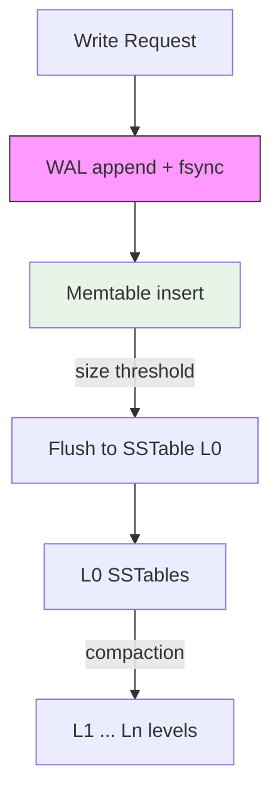
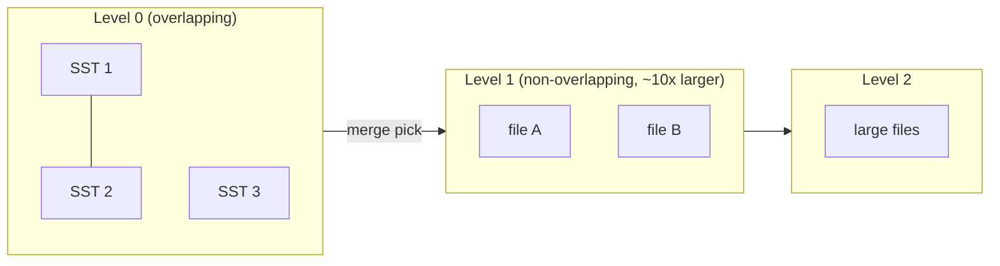
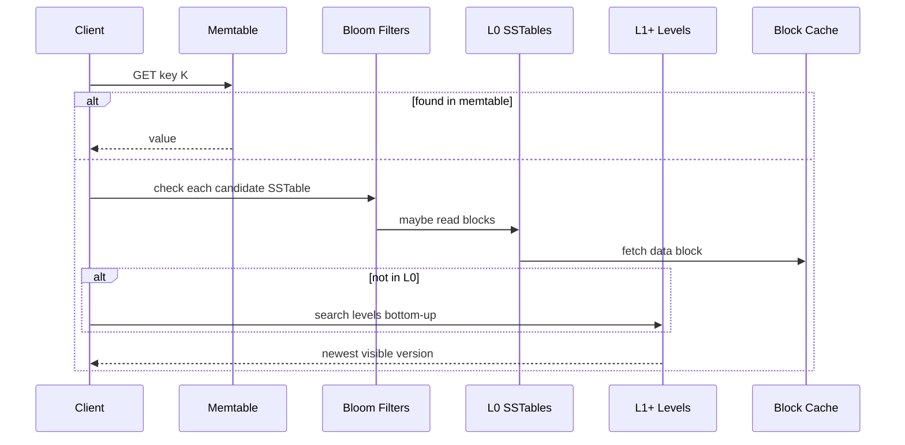

# LSM Trees

## 1. Executive Summary

A **Log-Structured Merge-tree (LSM-tree)** is a storage structure that converts random writes into **sequential appends** by buffering updates in memory (**memtable**), flushing immutable sorted files (**SSTables**) to disk, and periodically **compacting** overlapping files into larger sorted runs. Reads consult the memtable and multiple levels of SSTables, often filtered by **Bloom filters** to skip irrelevant files. The design trades **read amplification** and **compaction overhead** for **high write throughput** and efficient sequential I/O—ideal for write-heavy workloads, time-series ingestion, and embedded engines like RocksDB, LevelDB, and Cassandra's storage layer.

O'Neil et al. (1996) introduced the LSM-tree; modern production systems add leveled or tiered compaction, column families, parallel compaction threads, and integration with distributed replication (TiKV, CockroachDB Pebble/RocksDB). Principal architects must reason about **write amplification (WA)**, **space amplification (SA)**, **compaction debt**, and **read amplification (RA)** as first-class SLO drivers—not optional tuning details.

This chapter covers LSM structure, flush and compaction strategies, tombstones, concurrency, failure modes, and when to choose LSM over B-trees—with production examples and interview framing.

## 2. Why This Topic Matters

LSM engines power large-scale distributed databases and streaming state stores. Interview panels ask:

- Walk through a `GET` in RocksDB.
- Compare leveled vs size-tiered compaction.
- What happens when compaction falls behind?
- How do tombstones affect space amplification?

Production incidents include: **write stalls** when L0 file count exceeds `slowdown_writes_trigger`, **read latency spikes** from bloated L0, **disk space exhaustion** from compaction needing temporary 2× space, and **long-tail reads** missing Bloom filters on wide key spaces. Misapplying LSM to read-heavy OLTP without measuring RA has caused costly re-architectures.

At principal level, you are expected to connect LSM tuning to **business SLOs**: a metrics pipeline that tolerates 500ms write stalls differs from a payment ledger that does not. You should also articulate when **managed services** (DynamoDB, Bigtable) hide LSM complexity—and what observability you lose when you cannot see L0 file counts directly.

## 3. Problems Being Solved

| Problem | LSM approach |
|---------|--------------|
| High write ingest | Append to memtable; sequential flush |
| Random write on HDD | Batch into large sequential files |
| Growing dataset | Compaction merges and reclaims space |
| Range queries | Sorted runs + merge iterators |
| Deletes | Tombstone records compacted away |
| Memory budget | Bounded memtable; block cache for reads |

LSM does **not** eliminate amplification—it **relocates** when write cost is paid (flush + compaction vs B-tree page split at insert time). Nor does LSM provide **multi-key atomicity** by itself; transaction semantics require a layer above (RocksDB transactions, or distributed coordinator) with additional WAL and locking complexity.

## 4. Assumptions and System Model

- **Memtable** is in-memory sorted structure (often skip list or red-black tree).
- **SSTables** are **immutable** once written—no in-place update.
- **Levels** (leveled compaction) or **tiers** (size-tiered): deeper levels have larger, non-overlapping key ranges (leveled) or overlapping tiers (size-tiered).
- **Durability:** WAL persists memtable entries before ack (policy-dependent).
- **Crash:** Recover memtable from WAL; on-disk SSTables are immutable and checksummed.

**Not assumed:** Zero read amplification; instantaneous compaction; optimal for tiny datasets.

## 5. Essential Terminology

| Term | Definition |
|------|------------|
| **Memtable** | Mutable in-memory write buffer |
| **WAL / memtable log** | Durability for memtable before flush |
| **SSTable** | Immutable sorted key-value file on disk |
| **Flush** | Memtable → new SSTable (often L0) |
| **Compaction** | Merge SSTables; discard superseded keys/tombstones |
| **L0, L1, …** | Levels with increasing size and decreasing overlap (leveled) |
| **Tombstone** | Delete marker removed during compaction |
| **Bloom filter** | Probabilistic "key not in file" test per SSTable |
| **Write amplification** | Bytes written / logical bytes ingested |
| **Read amplification** | Files/blocks read per logical GET |
| **Space amplification** | On-disk size / live data size |
| **Compaction debt** | Backlog of files needing merge |
| **Write stall** | Engine throttles writes when L0 or compaction limits exceeded |

**Mnemonic:** **FLaCT** — Flush, Levels, Compaction, Tombstones—for LSM lifecycle operational reviews.

## 6. Core Mechanism

### LSM write path



*Figure 1: Writes append to WAL and memtable; flush creates L0 files; compaction moves data down levels.*

### Leveled compaction (RocksDB-style)



*Figure 2: L0 allows overlap; compaction selects L0 file + overlapping L1 files → new L1 files. Deeper levels grow exponentially.*

### Read path



*Figure 3: Newest version wins; Bloom filters reduce unnecessary I/O; block cache holds hot data blocks.*

## 7. Step-by-Step Walkthrough

**Scenario:** RocksDB `PUT` with default leveled compaction.

| Step | Component | Action |
|------|-----------|--------|
| 1 | WAL | Append record; `fsync` if sync write |
| 2 | Memtable | Insert K→V in skip list |
| 3 | Memtable full | Switch to new memtable; flush old to L0 SSTable |
| 4 | L0 count high | Compaction picks SSTable + L1 overlap |
| 5 | Compaction | Merge-sort streams; drop old versions/tombstones |
| 6 | `GET` | Check active memtable → immutable memtables → L0→Ln |

**Delete:** `PUT` tombstone; hidden from reads; removed when compaction merges past all older versions.

**Update:** New version appended; old version remains until compaction—**multi-version** at file level.

**Range scan walkthrough:** Iterator merges sorted streams from memtable and each relevant SSTable using a **k-way merge heap**. Unlike B-tree leaf links, LSM range scans pay merge CPU proportional to number of overlapping files at each level—why compaction debt hurts analytics queries as well as point reads.

**Column families:** RocksDB isolates memtables, SSTables, compaction, and Bloom filters per column family—allows tuning WAL-heavy write path separately from read-heavy metadata CF without separate database processes.

**Sequence numbers:** Each write carries an increasing sequence number; reads at a snapshot see only versions ≤ snapshot sequence—bridges LSM mechanics to MVCC-style transactional snapshots in distributed stores built on RocksDB.

## 8. Invariants and Guarantees

| Property | Statement |
|----------|-----------|
| **Immutability** | Flushed SSTables not modified in place |
| **Sorted order** | Keys sorted within each SSTable |
| **Newest wins** | Read path selects latest version by sequence |
| **Durability** | WAL + flush policy defines commit window |
| **Eventual space reclaim** | Tombstones/old versions removed after compaction |
| **Bounded memtable** | Writes stall if flush/compaction cannot keep pace (engine policy) |

**Safety:** No torn SSTable visible if checksummed blocks validated. **Liveness:** Compaction backlog can throttle writes—operational liveness concern.

## 9. Failure Scenarios

### Scenario 1: Compaction stall / write stop

**Setup:** Burst writes; L0 >> `level0_slowdown_writes_trigger`.

**Effect:** RocksDB slows or stops writes; latency spikes.

**Mitigation:** Increase compaction threads, tune level sizes, rate-limit ingest, more disk bandwidth.

### Scenario 2: Space amplification explosion

**Setup:** Many deletes; tombstones not compacted; duplicate versions.

**Effect:** Disk fills; reads scan more garbage.

**Mitigation:** Force compaction, tune `ttl`, reduce `max_bytes_for_level_base`.

### Scenario 3: Read amp without Bloom filters

**Setup:** Wide key space; Bloom disabled or too small.

**Effect:** Every `GET` reads blocks from many files.

**Mitigation:** Enable Bloom, partition column families, cache tuning.

### Scenario 4: WAL + memtable recovery slow

**Setup:** Huge WAL before crash; millions of ops unflushed.

**Effect:** Long restart time.

**Mitigation:** Smaller memtable flush thresholds, periodic flush, chunked WAL.

### Scenario 5: Compaction I/O competes with reads

**Setup:** Shared disk; compaction during peak.

**Effect:** p99 read latency degraded.

**Mitigation:** Dedicated compaction disk (rare), rate limiter, off-peak compaction.

### Scenario 6: gc_grace_seconds too low (Cassandra)

**Setup:** Deletes compacted before repair completes on all replicas.

**Effect:** Deleted data may resurrect as ghost reads during repair—**safety** concern in distributed LSM.

**Mitigation:** Set `gc_grace_seconds` above repair interval; understand tombstone propagation in cluster.

## 10. Performance Characteristics

| Compaction strategy | Write amp | Read amp | Space amp | CPU |
|--------------------|-----------|----------|-----------|-----|
| Leveled | Higher WA | Lower RA | Lower SA | Heavy merge |
| Size-tiered (STCS) | Lower WA | Higher RA | Higher SA | Periodic big merges |
| FIFO (TTL logs) | Low | Variable | Time-bound retention | Minimal |
| Universal | Hybrid | Middle | Middle | RocksDB option |
| TWCS (time-window) | Tuned for time-series | Time-local reads | TTL drops old windows | Cassandra |

**Writes:** Sequential bandwidth-bound during flush/compaction. Memtable size trades flush frequency (more files) vs memory pressure (larger recovery WAL). Larger memtables amortize flush overhead but increase memory and recovery time.

**Reads:** \(O(\text\{levels\})\) file checks best case with Bloom; worst case scans multiple overlapping L0 files. **Block cache** holds decompressed data blocks—tuning block size (often 4–16 KiB) affects cache hit ratio versus read granularity.

**Bloom filter tuning:** Bits per key trades memory for false-positive rate. Too few bits → extra I/O; too many → memory pressure. RocksDB exposes `bloom_locality` and partition filters for large files—**implementation choices** to study in benchmarks.

**Compaction shape:** Leveled compaction in RocksDB targets ~10× size ratio between levels (configurable via `max_bytes_for_level_multiplier`). STCS in Cassandra merges similarly sized SSTables into larger tiers—better for steady write rates with less predictable read paths.

**Do not cite fixed WA numbers**—depends on update rate, delete rate, level sizing; measure with `rocksdb.stats` and benchmarks. O'Neil et al. discuss amplification conceptually; production WA of 10–30× under heavy update load has been reported in engineering blogs for leveled LSM—**treat as anecdotal until you benchmark**.

## 11. Scalability Limits

- **Single DB instance:** Compaction CPU and disk bandwidth ceiling.
- **Hot keys:** Still serialize in memtable; single shard hotspot.
- **Dataset size:** Grows levels; read may touch more Bloom checks—usually logarithmic in levels.
- **Distributed:** Shard LSM per partition (TiKV region, Cockroach range).

**Scale-out:** Partition keys; LSM does not remove need for sharding at extreme scale.

## 12. Operational Considerations

- Monitor: `num-files-at-level0`, pending compaction bytes, stall counts, WA from statistics.
- Disk headroom: compaction needs **temporary** extra space—plan for at least 50% free disk during heavy compaction (rule of thumb; validate for your compaction strategy).
- Tune memtable size vs flush frequency vs recovery time.
- Column families isolate compaction priorities.
- Backup: snapshots + SSTable consistency (engine APIs).
- **SSTable format upgrades** across RocksDB versions may require manual compaction or migration—include in upgrade runbooks.
- **Rate limiters** (`rocksdb.rate_limiter`) prevent compaction from saturating disk during business hours—schedule aggressive compaction in maintenance windows.
- **Statistics dump** to Prometheus/Grafana: export `rocksdb.block.cache.hit`, `rocksdb.compaction.pending.bytes`, stall micros.

## 13. Security Considerations

- Deleted data may persist in old SSTables until compaction—secure erase requires compaction + WAL truncation.
- SSTable files readable if disk accessed—encrypt at rest.
- Resource exhaustion: attacker triggers write amp via updates/deletes.

## 14. Cost Considerations

- **SSD wear:** High WA multiplies bytes written—FinOps metric.
- **Storage:** SA from duplicates until compaction.
- **Compute:** Compaction CPU on same instances as serving—size nodes accordingly.
- **Managed vs self-hosted:** RocksDB expertise cost vs vendor (DynamoDB, Bigtable abstractions).

## 15. Production Implementations

### RocksDB

Meta/Facebook; leveled default; column families; used in TiKV, CockroachDB (Pebble fork), Kafka Streams.

### Apache Cassandra (SSTable + memtable)

Size-tiered / leveled compaction strategies per table; LSM at core of write path.

### LevelDB

Google; educational baseline; single-threaded compaction.

### HBase / Bigtable

Log-structured store with memstore flush; distributed LSM pattern.

### WiredTiger (optional LSM-style)

MongoDB storage; hybrid features.

**Distinction:** Cassandra **compaction strategy** is table-level **implementation choice**—STCS vs LCS documented in Apache Cassandra docs. TiKV adds Raft on top of RocksDB per region—local LSM tuning is necessary but distributed replication introduces separate WAL and consensus concerns documented in the TiKV architecture guide.

## 16. Alternatives and Tradeoffs

| vs LSM | When B-tree wins | When LSM wins |
|--------|------------------|---------------|
| Workload | Read-heavy OLTP | Write-heavy ingest |
| Latency | Stable point reads | Batch writes, tolerate compaction |
| Updates | In-place row fits | Append versioning acceptable |
| Deletes | Immediate page space (with vacuum) | Tombstone + async compaction |

**Hybrid patterns:** Some systems use B-tree primary + LSM for logs; or **learned indexes** (research, not default production). **PebblesDB** (academic) explored fragmented LSM to reduce WA—interesting for interviews but verify production adoption before recommending.

**Fractal trees** (Tokutek/MongoDB heritage) buffer messages in internal nodes—middle ground between immediate B-tree update and full LSM flush; niche but useful to mention when discussing historical MongoDB storage evolution.

## 17. Common Misconceptions

| Misconception | Reality |
|---------------|---------|
| "LSM is always faster" | Read-heavy workloads may suffer RA |
| "Deletes are free" | Tombstones until compaction |
| "No random I/O" | Compaction and reads still randomize |
| "SSD makes compaction free" | CPU and WA still matter |
| "One LSM fits all" | Column family and compaction tuning required |

## 18. Principal Architect Perspective

1. **Budget compaction** as continuous background tax.
2. **Model WA** when sizing SSD and cloud disk IOPS.
3. **Match compaction to delete/update rate**—analytics vs OLTP patterns differ.
4. **Test recovery time** with full WAL replay.
5. **Don't hide LSM behind SQL** without explaining stall behavior to SRE.
6. **Distributed LSM** (Cassandra, TiKV) compounds LSM issues with repair, replication, and anti-entropy—local compaction tuning is necessary but not sufficient.
7. **Tiered storage** (hot SSD, cold object store for L6+) is an emerging **implementation choice** in some engines—validate latency SLOs on cold tiers before architecting automatic tiering.
8. **Question bulk load paths:** `SSTFileWriter` / external ingestion bypasses memtable but requires compaction scheduling—architect ETL separately from OLTP write path.

When executives ask for "Kafka-level write throughput" on a SQL database, the honest answer may be LSM under the hood (or a separate ingest pipeline)—name the amplification tradeoffs upfront.

## 19. Architecture Review Exercise

**Scenario:** Metrics platform: 200k points/sec write, 5% read by series key, 90-day retention.

**Prompts:** LSM vs B-tree? Compaction strategy? TTL implementation? Shard by metric name? Disk sizing with WA=10 assumption—validate in POC.

**Expected:** LSM or time-partitioned SSTables with TTL compaction; avoid PostgreSQL B-tree unless partitioned aggressively.

## 20. Whiteboard Explanation

**90-second version:**

> "An LSM tree buffers writes in a sorted memtable in memory, logs them to WAL, and when full flushes an immutable SSTable to disk—usually level zero. Reads check memtable then SSTables newest-first, with Bloom filters to skip files. Compaction periodically merges files, dropping old versions and delete tombstones. You trade write amplification during compaction for fast sequential writes upfront. Leveled compaction gives better read performance and space; size-tiered is cheaper on writes but reads touch more files. RocksDB and Cassandra use this. Watch L0 file count—if compaction falls behind, the engine stalls writes. Pick LSM for write-heavy ingest; B-tree for read-heavy OLTP unless you've measured otherwise."

## 21. Interview Questions

1. **LSM write path?**
   - *Signals:* WAL, memtable, flush, compaction.

2. **Why immutable SSTables?**
   - *Signals:* Sequential write, simpler concurrency, merge for updates.

3. **What is read amplification?**
   - *Signals:* Multiple files/levels per GET.

4. **Leveled vs size-tiered compaction?**
   - *Signals:* WA/RA/SA tradeoff.

5. **Purpose of Bloom filter?**
   - *Signals:* Reduce disk reads for absent keys.

6. **How are deletes handled?**
   - *Signals:* Tombstones until compaction.

7. **Write stall triggers?**
   - *Signals:* Too many L0 files, compaction backlog.

8. **Memtable structure?**
   - *Signals:* Skip list, red-black tree—sorted.

9. **Compare LSM to B-tree for SSD OLTP.**
   - *Signals:* Nuanced—both viable; workload dependent.

10. **Space amplification sources?**
    - *Signals:* Duplicate versions, tombstones, pre-compaction overlap.

11. **What is compaction debt?**
    - *Signals:* Backlog of SSTables awaiting merge; precursor to stalls.

12. **How do column families help?**
    - *Signals:* Separate LSM trees per CF; independent tuning.

13. **TWCS use case?**
    - *Signals:* Time-series with TTL windows in Cassandra.

14. **False positive in Bloom filter effect?**
    - *Signals:* Extra disk read, not incorrect value.

15. **Why k-way merge for scans?**
    - *Signals:* Combine sorted runs from memtable + SSTables.

## 22. Interview Follow-Ups

1. **Design 1M writes/sec KV on one machine.**
   - *Signals:* Sharding, batching, WAL on NVMe, tune compaction.

2. **Tune RocksDB for read-heavy workload.**
   - *Signals:* Block cache, Bloom bits, leveled, reduce L0.

3. **Cassandra repair + compaction interaction?**
   - *Signals:* Merkle repair, gc grace seconds.

4. **When would you choose universal compaction over leveled?**
   - *Signals:* Write-heavy, can tolerate higher read amp; benchmark both.

5. **How does TiKV use RocksDB per region?**
   - *Signals:* One engine instance per store; Raft log separate from RocksDB WAL; distributed sharding above LSM.

## 23. Strong Answer Example

**Question:** "Reads spiked after a write burst in our RocksDB service."

> "Classic LSM compaction debt. Writes filled memtables and L0 faster than compaction drained them—reads now search many overlapping L0 SSTables, blowing read amplification despite Blooms. I'd check `rocksdb.num-files-at-level0`, pending compaction bytes, and stall statistics. Short term: throttle ingest, increase `max_background_jobs`, possibly manual compact range. Medium term: tune `level0_file_num_compaction_trigger`, memtable size, and disk bandwidth—compaction competes with reads on the same volume. If workload is actually read-heavy, question whether LSM was the right engine or if we need partitioning to isolate hot ranges. Also verify we aren't missing Bloom filters on new column families."

## 24. Weak Answer Example

**Question:** "Reads spiked after a write burst."

> "Scale read replicas."

**Why weak:** LSM read amp is local file structure; replicas don't fix L0 bloat on primary without understanding compaction.

## 25. Hands-On Exercise

1. Run RocksDB `db_bench` with fillrandom and readrandom.
2. During write-heavy phase, dump `rocksdb.stats` or LOG for L0 file count.
3. Compare `readrandom` latency before and after manual `compact_range`.
4. Document WA estimate from bytes written vs user bytes.
5. Enable `stats_dump_period_sec` and graph pending compaction bytes over a 30-minute write load.
6. Experiment with `options.compaction_style`: leveled vs universal on same hardware; tabulate p50/p99 read and write latency.

**Success criteria:** Explain one observed latency change using LSM terminology (L0 count, compaction debt, or Bloom filter hit rate).

## 26. Knowledge Check

1. First write destination? *(WAL + memtable.)*
2. SSTable mutability? *(Immutable after flush.)*
3. Delete representation? *(Tombstone.)*
4. L0 characteristic in leveled? *(Often overlapping files.)*
5. Bloom filter false positive effect? *(Extra disk read, not wrong answer.)*

## 27. Flashcards

| # | Front | Back |
|---|-------|------|
| 1 | LSM-tree | Append, flush, compact sorted runs |
| 2 | Memtable | In-memory sorted write buffer |
| 3 | SSTable | Immutable on-disk sorted file |
| 4 | Compaction | Merge files; drop old versions |
| 5 | Tombstone | Delete marker |
| 6 | Bloom filter | Skip SSTables unlikely to have key |
| 7 | Write amplification | Disk bytes / user bytes |
| 8 | Leveled compaction | Lower RA, higher WA |
| 9 | STCS | Lower WA, higher RA/SA |
| 10 | Write stall | Throttle when L0 overloaded |
| 11 | Block cache | Cache SSTable data blocks |
| 12 | O'Neil et al. 1996 | LSM-tree paper |

## 28. Cheat Sheet

```
LSM WRITE
  WAL → memtable → flush → L0 → compaction → L1+

LSM READ
  memtable → immut memtables → L0..Ln (newest wins)
  Bloom filter per SSTable

COMPACTION
  Leveled: non-overlap L1+, higher WA, lower RA
  STCS: size tiers, lower WA, higher RA

OPS ALERTS
  L0 file count, pending compaction bytes,
  stall count, WA, disk space for merge temp

VS B-TREE
  LSM: write ingest, sequential
  B-tree: read latency, in-place update
```

## 29. Related Concepts

- [Storage Engine Fundamentals](/docs/storage-engines/storage-engine-fundamentals) — amplification framework
- [B-Trees](/docs/storage-engines/b-trees) — read-optimized alternative
- [Write-Ahead Log](/docs/storage-engines/write-ahead-log) — memtable durability
- [Distributed Databases](/docs/distributed-databases/overview) — TiKV, Cockroach ranges

## 30. References

### Primary sources

- O'Neil, P., Cheng, E., Gawlick, D., & O'Neil, E. (1996). ["The Log-Structured Merge-Tree (LSM-Tree)."](https://www.cs.umb.edu/~poneil/lsmtree.pdf) *Acta Informatica* — original LSM definition.
- Rosenblum, M., & Ousterhout, J. K. (1992). "The Design and Implementation of a Log-Structured File System." *ACM TOCS* — log-structured inspiration.

### Production

- [RocksDB Wiki: Leveled Compaction](https://github.com/facebook/rocksdb/wiki/Leveled-Compaction) — implementation tuning.
- [Apache Cassandra Compaction](https://cassandra.apache.org/doc/latest/cassandra/managing/operating/compaction/) — STCS, LCS, TWCS strategies.

### Textbooks

- Kleppmann, *DDIA*, Chapter 3 — LSM vs B-tree tradeoffs.

### Distinction

| Claim | Source |
|-------|--------|
| LSM algorithm | O'Neil et al. (1996) |
| Stall thresholds | RocksDB implementation—version-specific |
| WA/RA typical ranges | **Benchmark your workload**—do not universalize |
