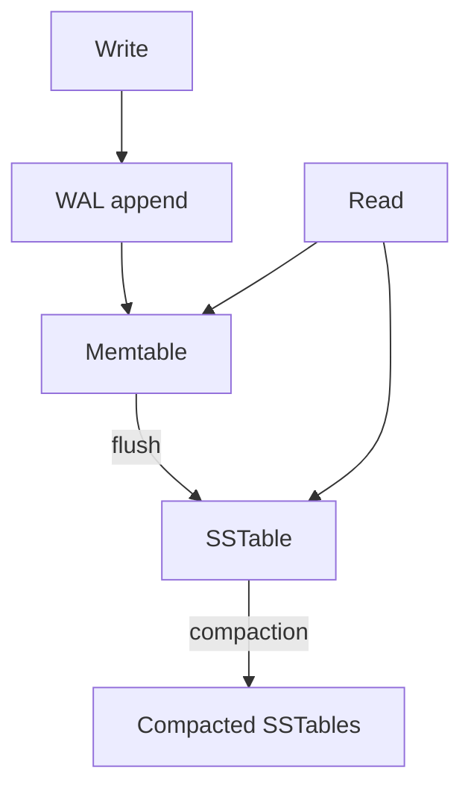

# Storage Engines

B-trees, LSM trees, write-ahead logs, compaction, and the mechanics beneath databases.

*Figure: LSM-tree write path — WAL, memtable, and SSTable compaction.*

## What You'll Learn

Every database is built on a storage engine. This domain explains how data lands on disk, how B-trees and LSM trees trade read vs write amplification, and why WALs are non-negotiable for durability.

## Chapters

| Chapter | Focus |
|---------|-------|
| [Storage Engine Fundamentals](/docs/storage-engines/storage-engine-fundamentals) | Pages, buffers, read/write paths |
| [Write-Ahead Log](/docs/storage-engines/write-ahead-log) | Durability, crash recovery, group commit |
| [B-Trees](/docs/storage-engines/b-trees) | In-place updates, page splits, clustering |
| [LSM Trees](/docs/storage-engines/lsm-trees) | Memtable, SSTables, compaction strategies |

## Learning Path

1. **Storage Engine Fundamentals** — pages, caching, and I/O patterns.
2. **Write-Ahead Log** — durability primitive used everywhere.
3. **B-Trees** — PostgreSQL, MySQL InnoDB, SQL Server.
4. **LSM Trees** — RocksDB, Cassandra, DynamoDB, LevelDB.

## Interview Prep

| Resource | Topic |
|----------|-------|
| [Distributed Databases](/docs/distributed-databases/overview) | How engines compose at scale |
| Question | "B-tree vs LSM for write-heavy workload?" |

## Prerequisites

- [Computer Architecture](/docs/computer-architecture/overview) — caches and I/O
- [Operating Systems](/docs/operating-systems/overview) — virtual memory, filesystems

## Next Domain

Continue to [Distributed Databases](/docs/distributed-databases/overview) and [Transactions](/docs/transactions/overview).

Return to the [Curriculum Overview](/docs/start-here/curriculum-overview) for the full learning path.
