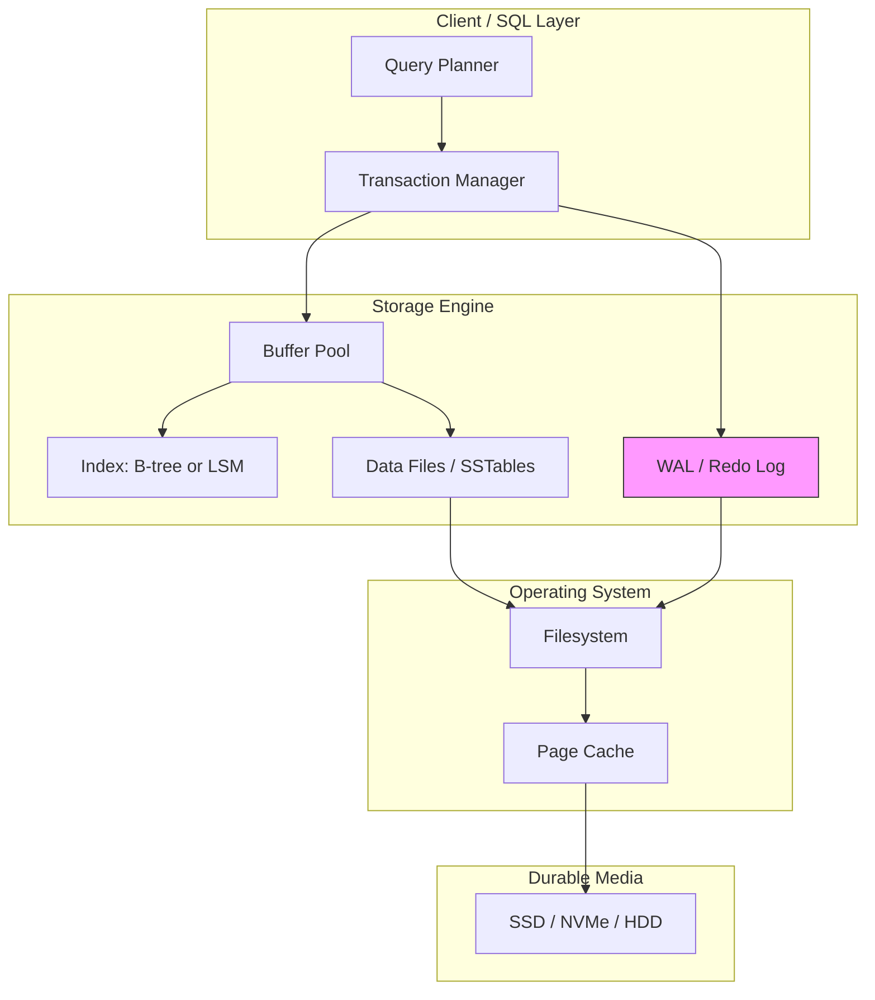
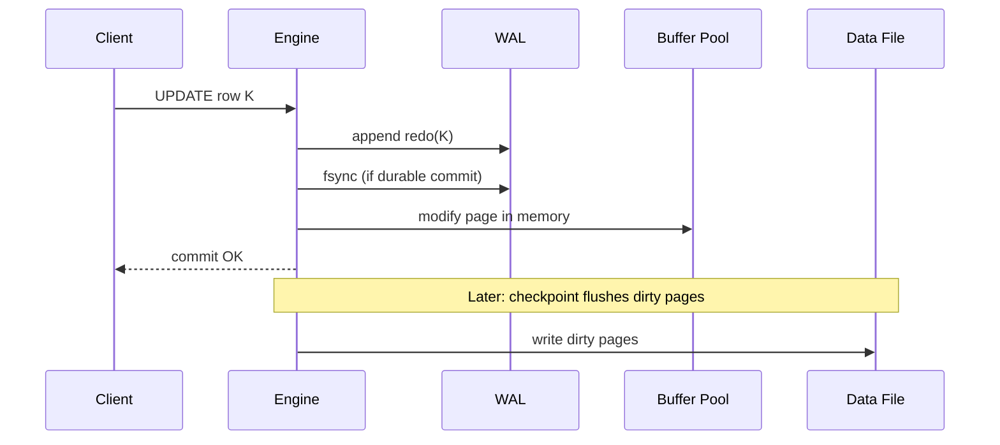
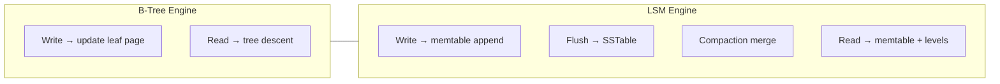

# Storage Engine Fundamentals

## 1. Executive Summary

A **storage engine** is the subsystem of a database that persists, retrieves, and organizes data on durable media (SSD, HDD, or cloud block/object storage). It sits below the query planner, transaction manager, and SQL/API layer, translating logical operations—`INSERT`, `GET`, range scan—into physical I/O patterns on pages, segments, or sorted runs. The engine's design determines whether a workload favors **read latency** (B-tree / B+ tree), **write throughput** (log-structured merge tree, LSM-tree), or **append-only durability** (write-ahead log, WAL).

Principal architects must reason about storage engines separately from "the database product" because replication, sharding, and consensus layers often wrap the same engine (RocksDB in CockroachDB, InnoDB in MySQL, WiredTiger in MongoDB). Interview and production decisions hinge on **page size**, **buffer pool hit ratio**, **write amplification**, **read amplification**, **compaction debt**, and **crash recovery** semantics—not on SQL syntax alone.

This chapter establishes the vocabulary, layering model, durability invariants, and tradeoff framework used throughout the storage-engines domain. Companion chapters cover [B-Trees](/docs/storage-engines/b-trees), [LSM Trees](/docs/storage-engines/lsm-trees), and the [Write-Ahead Log](/docs/storage-engines/write-ahead-log) in depth.

## 2. Why This Topic Matters

Storage engines are where **performance SLOs meet physics**. A principal architect who recommends "add replicas" without understanding that the primary is LSM-backed with compaction stalls during peak write will misdiagnose tail latency. Interview panels at senior levels ask:

- Why does PostgreSQL use a B-tree by default while Cassandra and RocksDB use LSM?
- What is write amplification and how does it affect SSD wear?
- Where does durability happen—the WAL, the data file, or both?
- How does the buffer pool interact with the OS page cache?

Production incidents traced to storage layers include: runaway compaction blocking reads, `fsync` storms during checkpoint, double-buffering between engine cache and OS cache, and recovery times measured in hours after crash because the WAL and checkpoint positions were misconfigured.

Understanding fundamentals lets you **decompose** a database into: API → planner → transaction log → storage engine → filesystem → device. Each boundary has distinct failure modes and tuning knobs.

## 3. Problems Being Solved

| Problem | Storage engine responsibility |
|---------|------------------------------|
| Persist bytes across power loss | WAL, forced flush policies, checksums |
| Find a key quickly | Index structure (B-tree, hash, LSM levels) |
| Scan a key range | Ordered structures, zone maps, bloom filters |
| Concurrent readers and writers | Latching, MVCC, lock-free structures |
| Bound memory use | Buffer pool eviction, memtable limits |
| Reclaim space after deletes | Compaction, vacuum, page reuse |
| Detect corruption | Page checksums, log validation |
| Support transactions | Undo/redo logs, snapshot isolation metadata |

The engine does **not** solve distributed consensus, cross-region failover, or SQL optimization—that is higher layers—but **local durability and local read/write performance** are entirely engine-owned.

## 4. Assumptions and System Model

Assume a **single-node** storage engine unless stated otherwise:

- **Durable storage** is block-addressable (local SSD/HDD or network block volume). Latency is orders of magnitude higher than RAM; sequential I/O is cheaper than random I/O on spinning disks; SSDs reduce but do not eliminate random-read penalties.
- **Crash model:** Process or machine can fail at any point; storage may lose **volatile** caches (RAM, drive write cache if not flushed) but preserved written blocks survive (**crash-recovery** model).
- **Concurrency:** Multiple threads issue reads/writes; the engine provides **isolation** per configured level (often delegated to transaction layer).
- **Filesystem** provides `write`, `read`, `fsync`/`fdatasync`, and may buffer writes in the **page cache** unless bypassed (e.g., `O_DIRECT`).

**Not assumed:** Byzantine storage, unlimited RAM, or synchronous replication to remote nodes (that is replication layer).

## 5. Essential Terminology

| Term | Definition |
|------|------------|
| **Page / block** | Fixed-size unit (often 4–16 KiB) of on-disk I/O and in-memory cache |
| **Buffer pool** | Engine-managed cache of pages in RAM |
| **Heap file** | Unordered storage of records/tuples |
| **Index** | Auxiliary structure mapping keys to record locations |
| **WAL (redo log)** | Append-only log of changes applied before or with data pages |
| **Checkpoint** | Point up to which data pages reflect logged changes; truncates recovery |
| **Memtable** | In-memory write buffer (LSM); flushes to immutable sorted runs |
| **SSTable** | Sorted String Table—immutable on-disk sorted file (LSM) |
| **Compaction** | Merge/reorganize on-disk data to reclaim space and improve read efficiency |
| **Write amplification** | Bytes written to device per byte of logical user data |
| **Read amplification** | I/O operations per logical read (e.g., checking multiple LSM levels) |
| **Space amplification** | Ratio of on-disk size to logical data size (duplicates, tombstones) |
| **MVCC** | Multi-Version Concurrency Control—versions instead of in-place overwrite |
| **LSN** | Log Sequence Number—monotonic identifier for log records |

**Mnemonic:** **WARPS** — Write amplification, Amplification (read), Recovery, Pages, Space—for engine health review.

## 6. Core Mechanism

### Layered architecture



*Figure 1: Typical storage engine stack. WAL often bypasses or coordinates with OS page cache for durability guarantees.*

### Read path (page-oriented engine)

1. Lookup key in index (B-tree root to leaf).
2. If index page not in buffer pool → read page from disk into pool (possibly evicting another page).
3. Follow pointer to heap/tuple; fetch data page if needed.
4. Return tuple to transaction layer with visibility check (MVCC).

### Write path (with WAL)

1. Begin transaction (optional at engine boundary).
2. Append **redo record** to WAL; `fsync` per durability policy.
3. Modify pages in buffer pool (copy-on-write or in-place per design).
4. Mark pages dirty; eventually **checkpoint** writes dirty pages to data files.
5. Commit visible to other transactions per isolation rules.



*Figure 2: Write-ahead logging: log record durable before in-place data page is considered committed (policy-dependent).*

### Two dominant families

| Family | On-disk layout | Write pattern | Read pattern |
|--------|----------------|---------------|--------------|
| **Update-in-place (B-tree)** | Balanced tree pages | Random page updates | Few I/Os per point read |
| **Log-structured (LSM)** | Immutable sorted runs | Sequential append + merge | May check multiple levels/filters |



*Figure 3: B-tree optimizes in-place updates; LSM batches writes and pays compaction cost asynchronously.*

## 7. Step-by-Step Walkthrough

**Scenario:** Application inserts 1,000 rows/sec into PostgreSQL (InnoDB-style B-tree + WAL).

| Step | Component | Action |
|------|-----------|--------|
| 1 | SQL layer | Parses `INSERT`, acquires row lock if needed |
| 2 | Transaction | Assigns transaction ID, undo log entry |
| 3 | WAL | Appends redo for index + heap pages; waits for `fsync` if `synchronous_commit=on` |
| 4 | Buffer pool | Inserts into B-tree leaf; may split page → more WAL records |
| 5 | Background | Checkpoint process writes dirty pages; advances checkpoint LSN |
| 6 | Read (concurrent) | Reader uses MVCC snapshot; sees old version until commit visible |

**Walkthrough insight:** Insert throughput is bounded by **WAL fsync rate** and **index maintenance**, not by SQL parsing. Tuning `synchronous_commit`, group commit, and `shared_buffers` directly hits engine mechanics.

**Contrast—RocksDB insert:** Writes go to memtable + WAL; no B-tree page split until flush; reads may miss memtable and search L0 SSTables—different latency profile.

## 8. Invariants and Guarantees

| Property | Type | Statement |
|----------|------|-----------|
| **Durability (D of ACID)** | Safety | Committed transactions survive crash after WAL policy satisfied |
| **Atomic page write** | Implementation | Many engines rely on sector-aligned writes + checksums; torn pages recovered via redo |
| **WAL before data** | Safety | Redo log record reaches durable media before dependent data page (classic WAL rule) |
| **Consistent tree structure** | Safety | B-tree invariants maintained across splits/merges (or LSM ordering in runs) |
| **Isolation** | Safety | Configurable—engine provides versions/locks; serializability often layered |
| **Bounded recovery time** | Liveness | Depends on WAL size since checkpoint—not guaranteed constant |
| **Zero write amplification** | — | **Not** achievable with updates and GC/compaction |

Distinguish **formal ACID** (transaction layer contract) from **engine mechanisms** (how redo/undo achieve it locally).

## 9. Failure Scenarios

### Scenario 1: Torn page after crash

**Setup:** 16 KiB page write interrupted mid-flight during checkpoint.

**Effect:** Checksum fails on restart; engine replays WAL from last good LSN.

**Mitigation:** Full-page WAL images on first change after checkpoint (PostgreSQL); doublewrite buffer (InnoDB).

### Scenario 2: WAL disk full

**Setup:** High write rate; archiving or retention misconfigured.

**Effect:** All writes block—**liveness** failure; database appears hung.

**Mitigation:** Monitor WAL size, archive to object storage, tune `max_wal_size`.

### Scenario 3: Buffer pool thrashing

**Setup:** Working set larger than `shared_buffers`; random access pattern.

**Effect:** Read latency spikes; CPU spent on eviction.

**Mitigation:** Increase buffer pool, partition workloads, better indexes, or switch access pattern.

### Scenario 4: Compaction stall (LSM)

**Setup:** Write burst fills L0; compaction cannot keep pace.

**Effect:** Read amplification explodes; p99 read latency unacceptable.

**Mitigation:** Rate-limit writes, tune level sizes, increase compaction threads, tiered storage.

### Scenario 5: fsync latency spike

**Setup:** Cloud volume noisy neighbor or RAID battery failure.

**Effect:** Commit latency correlates with storage subsystem—not application CPU.

**Mitigation:** Local NVMe, separate WAL device, `group commit`, investigate volume SLA.

## 10. Performance Characteristics

| Factor | B-tree tendency | LSM tendency |
|--------|-----------------|--------------|
| Point read | Low I/O (tree height) | Memtable + bloom + levels |
| Range scan | Sequential leaf links | Merge iterators across files |
| Write | Random I/O, page splits | Sequential append; deferred compaction |
| Update-heavy | In-place if row fits | Tombstone + new version |
| Delete | Mark/delete row; vacuum | Tombstone until compaction |

**Qualitative rules:**

- Random write IOPS on HDD favor LSM; on NVMe the gap narrows but compaction CPU remains.
- Read-heavy OLTP with small working set favors B-tree + large buffer pool.
- Write-heavy ingestion favors LSM with careful compaction tuning.

Do not quote universal throughput numbers; measure with your page size, key distribution, and durability settings.

## 11. Scalability Limits

- **Single-node write throughput:** WAL fsync rate, lock contention on hot index pages, compaction bandwidth.
- **Dataset size vs RAM:** Beyond buffer pool, reads become disk-bound; LSM needs bloom filters and block cache.
- **Fan-out:** B-tree height grows slowly (log base fan-out); still one root latch hotspot on extreme write concurrency.
- **Shard boundary:** Scale-out is **above** the engine—each shard runs an engine instance.

**When one engine instance stops scaling:** Hot partition, single leader, or device IOPS ceiling—remedy is partitioning, not bigger SQL.

## 12. Operational Considerations

- **Monitor:** buffer pool hit ratio, WAL generation rate, checkpoint frequency, compaction pending bytes, disk queue depth, `fsync` latency.
- **Capacity:** Plan for write amplification (SSD wear) and space amplification (LSM tombstones).
- **Backup:** Physical (snapshot + WAL archive) vs logical—engine must be in consistent checkpoint or use snapshot API.
- **Upgrade:** Major version may change page format—plan offline or online migration.
- **Runbooks:** Recovery procedure from WAL + backup; test restore quarterly.

## 13. Security Considerations

- **Encryption at rest:** Engine-level (transparent data encryption) vs filesystem/volume—key rotation and WAL encryption must be consistent.
- **Side channels:** Shared buffer pool in multi-tenant poorly isolated containers—prefer dedicated instances for strict tenants.
- **Log leakage:** WAL contains raw tuple data—protect archive paths like primary data.
- **Denial of service:** Unbounded writes can fill disk via WAL and SSTables—quotas and rate limits at API layer.

Storage engines do not replace **authorization**; they must not leak deleted data without secure erase policies (implementation-dependent).

## 14. Cost Considerations

- **IOPS provisioning:** Over-provisioned cloud disks for WAL `fsync`; under-provision causes latency tax.
- **SSD wear:** Write amplification directly affects device lifetime—LSM tuning is a FinOps concern.
- **Storage footprint:** Space amplification and redundant replicas multiply cost.
- **Engineering:** Operating RocksDB vs managed RDS—staff expertise vs vendor premium.

**Decision criterion:** Match engine family to **dominant workload**; mis-match costs 2–10× infra (anecdotal range—validate in benchmarks).

## 15. Production Implementations

### PostgreSQL (heap + B-tree + WAL)

Heap tuples with MVCC; default B-tree indexes; WAL for durability; autovacuum reclaims tuple versions. Mature update-in-place semantics with extensive tuning docs.

### MySQL InnoDB

Clustered B+ tree primary key; secondary indexes leaf to PK; doublewrite buffer; redo/undo logs. Ubiquitous in OLTP.

### RocksDB (LSM, embedded)

Facebook/Meta origin; used in CockroachDB, TiKV, Kafka Streams state stores. Tunable compaction, column families, bloom filters.

### LevelDB / BoltDB

Educational and embedded use; LevelDB classic LSM levels; bbolt mmap B+ tree append-only pages—contrasting designs.

### WiredTiger (MongoDB)

B-tree with optional LSM-style logging; cache-centric; document model above engine.

**Distinction:** Product guarantees combine **replication** + **engine**—read the docs for which layer owns durability.

## 16. Alternatives and Tradeoffs

| Choice | When to prefer | Cost |
|--------|----------------|------|
| B-tree OLTP | Read-heavy, frequent updates, moderate write rate | Random write cost, vacuum |
| LSM | Write-heavy, append-mostly, bulk load | Compaction, read amp |
| Heap only + hash index | Pure key-value, no range | No ordering |
| Memory-only (Redis) | Cache, ephemeral | Durability optional via AOF/RDB |
| Columnar (separate chapter) | Analytics scans | Poor point-update |

Hybrid systems (TiDB, CockroachDB) use LSM locally with distributed SQL—engine choice per store.

## 17. Common Misconceptions

| Misconception | Reality |
|---------------|---------|
| "Database = storage engine" | Planner, executor, replication are separate |
| "WAL is only for crash recovery" | Also used for replication (logical/physical) |
| "More RAM always fixes slowness" | Compaction debt and read amp persist |
| "SSD eliminates LSM need" | Write amp and ingestion scale still matter |
| "Deletes free space immediately" | Tombstones, dead tuples, fragmented pages |
| "O_DIRECT always faster" | Loses OS cache; double buffering avoided but tuning required |

## 18. Principal Architect Perspective

1. **Profile the workload** before choosing or recommending an engine family.
2. **Separate local durability from global consistency**—WAL on one node ≠ replicated commit.
3. **Budget compaction and vacuum** as first-class operational work, not surprises.
4. **Align page size and row width** with access patterns—wide rows hurt cache efficiency.
5. **Test failover recovery time**—RTO includes WAL replay duration.

Interview signal: explaining **write amplification** with a concrete LSM vs B-tree path separates principal candidates from API-level thinkers.

## 19. Architecture Review Exercise

**Scenario:** Team builds event-sourcing platform; 50k events/sec append; rare key lookup; analytics range scans nightly. They chose PostgreSQL with JSONB and many secondary indexes.

**Review prompts:**

1. What is WAL and checkpoint behavior at 50k writes/sec?
2. Index maintenance cost per insert?
3. Would LSM embedded store (RocksDB) or columnar warehouse fit better for which paths?
4. How to separate hot write path from cold analytics?
5. Estimate recovery time after crash with 500 GB WAL.

**Expected findings:** PostgreSQL can work with partitioning and tuning but index bloat and WAL pressure warrant CQRS split—write-optimized LSM ingest + warehouse for scans.

## 20. Whiteboard Explanation

**90-second version:**

> "A storage engine is how a database physically stores and retrieves data on disk. It owns the index structure, the buffer pool in memory, and the write-ahead log for crash safety. Two main families: B-trees update pages in place—great for reads and mixed OLTP. LSM trees append writes to memory, flush sorted files, and compact later—great for write throughput but reads can touch multiple files. Every committed change goes through the WAL first so after a crash you replay the log. Performance is about amplification—how many bytes you write per logical byte, how many disk reads per get—and about whether your working set fits RAM. PostgreSQL InnoDB is B-tree plus WAL; RocksDB is LSM. Pick based on workload, not hype."

## 21. Interview Questions

1. **What is a storage engine?**
   - *Signals:* Layer below SQL; indexes, pages, WAL, buffer pool.

2. **B-tree vs LSM—when each?**
   - *Signals:* Read vs write optimization; compaction; amplification.

3. **Purpose of WAL?**
   - *Signals:* Durability, redo on crash; ordering with data pages.

4. **What is write amplification?**
   - *Signals:* Bytes written to disk / logical data; compaction, page rewrites.

5. **Buffer pool vs OS page cache?**
   - *Signals:* Double caching; O_DIRECT; eviction control.

6. **How does MVCC relate to the engine?**
   - *Signals:* Tuple versions, undo, snapshot visibility.

7. **What happens on checkpoint?**
   - *Signals:* Dirty pages flushed; recovery window shortened.

8. **Why sequential writes faster on HDD?**
   - *Signals:* Seek cost; LSM exploit.

9. **Name systems using RocksDB.**
   - *Signals:* CockroachDB, TiKV, etc.—embedded LSM.

10. **What is read amplification in LSM?**
    - *Signals:* Multiple levels/blooms per read.

11. **How do torn pages get handled?**
    - *Signals:* Checksums, full-page WAL, doublewrite.

12. **Tradeoff of synchronous_commit off?**
    - *Signals:* Durability window; performance vs data loss risk.

## 22. Interview Follow-Ups

1. **Design a KV store for 1M writes/sec on one NVMe.**
   - *Signals:* LSM, shard WAL, batching, fsync groups.

2. **PostgreSQL vs Cassandra for time-series—deep dive.**
   - *Signals:* Compaction, partitioning, consistency models.

3. **How would you debug p99 latency spikes?**
   - *Signals:* Checkpoint, compaction, iowait, lock waits.

4. **Physical backup consistency?**
   - *Signals:* Snapshot + WAL position; pg_basebackup.

5. **Multi-tenant noisy neighbor on shared disk?**
   - *Signals:* IOPS isolation, separate volumes.

## 23. Strong Answer Example

**Question:** "Our reads got slow after we doubled write traffic. Postgres on SSD. What do you check?"

> "I'd start at the storage engine layer, not query plans alone. Check WAL generation and whether checkpoints are throttling—`checkpoint_completion_target`, spikes in `pg_stat_bgwriter`. Look at buffer pool hit ratio in `pg_stat_database` and whether the working set outgrew `shared_buffers`. Inspect bloat and autovacuum lag—MVCC dead tuples hurt heap scans. On SSD, watch `iowait` and filesystem latency for `fsync`, not just CPU. Compare p95 before/after for index-heavy vs heap-only queries. If writes are sequential bulk load, consider unlogged tables or COPY tuning; if sustained OLTP, we might partition hot tables or archive. I'd also verify we're not double-buffering unnecessarily. The answer might be vacuum, larger buffer pool, or splitting read replicas—but the mechanism is engine I/O and MVCC, not 'add cache' blindly."

## 24. Weak Answer Example

**Question:** "Our reads got slow after we doubled write traffic. Postgres on SSD. What do you check?"

> "Add more indexes and scale horizontally with read replicas."

**Why weak:** No WAL/checkpoint/buffer pool/MVCC analysis; indexes may worsen writes; replicas don't fix primary engine pressure.

## 25. Hands-On Exercise

1. Install PostgreSQL locally; run `pgbench` with mixed read/write.
2. Observe `shared_buffers` hit rate via `pg_stat_bgwriter` during workload.
3. Set `synchronous_commit=off` and measure TPS—document durability tradeoff.
4. Install RocksDB (`ldb` tool); write 100k keys; run `sst_dump` to see SSTable structure.
5. Sketch WAL + buffer pool diagram for your team's primary database.

**Success criteria:** Explain one observed latency change using engine terminology (WAL, buffer pool, or compaction).

## 26. Knowledge Check

1. What sits below the query planner? *(Storage engine.)*
2. WAL primary purpose? *(Durability / redo after crash.)*
3. LSM writes go where first? *(Memtable, then SSTables.)*
4. Write amplification measures? *(Disk bytes / logical bytes.)*
5. B-tree strength? *(Point reads, ordered scans with low read amp.)*
6. Does buffer pool eliminate disk reads? *(No—when working set exceeds cache.)*

## 27. Flashcards

| # | Front | Back |
|---|-------|------|
| 1 | Storage engine | Persists/retrieves data; indexes, WAL, buffer pool |
| 2 | Page | Fixed-size I/O unit, typically 4–16 KiB |
| 3 | Buffer pool | Engine-managed page cache in RAM |
| 4 | WAL | Append-only redo log; durability before data pages |
| 5 | Checkpoint | Flush dirty pages; shorten recovery |
| 6 | B-tree family | Update-in-place; good reads |
| 7 | LSM family | Append + compaction; good writes |
| 8 | Write amplification | Physical writes / logical data |
| 9 | Read amplification | I/O ops per logical read |
| 10 | MVCC | Versions for concurrent read/write |
| 11 | Memtable | LSM in-memory write buffer |
| 12 | SSTable | Immutable sorted on-disk file (LSM) |

## 28. Cheat Sheet

```
STORAGE ENGINE LAYERS
  SQL/API → TX manager → Engine → FS → Device

CORE COMPONENTS
  - Buffer pool (pages in RAM)
  - Index (B-tree or LSM levels)
  - WAL (durability)
  - Data files / SSTables

B-TREE vs LSM
  B-tree: in-place, read-optimized
  LSM: append, compact, write-optimized

DURABILITY
  WAL record durable → then commit (policy)
  Checkpoint limits recovery time

OPS METRICS
  Hit ratio, WAL rate, compaction debt,
  write/read amplification, fsync latency

INTERVIEW
  Name amplification types
  Crash recovery = replay WAL
  Engine ≠ full database product
```

## 29. Related Concepts

- [B-Trees](/docs/storage-engines/b-trees) — update-in-place index structure
- [LSM Trees](/docs/storage-engines/lsm-trees) — log-structured merge indexes
- [Write-Ahead Log](/docs/storage-engines/write-ahead-log) — durability mechanism
- [Transactions](/docs/transactions/overview) — ACID layered on engines
- [Replication](/docs/replication/overview) — physical/logical log shipping
- [Distributed Databases](/docs/distributed-databases/overview) — sharding over engines

## 30. References

### Primary sources

- Bayer, R., & McCreight, E. (1972). "Organization and Maintenance of Large Ordered Indexes." *Acta Informatica* — foundational B-tree work (see B-Trees chapter).
- O'Neil, P., Cheng, E., Gawlick, D., & O'Neil, E. (1996). "The Log-Structured Merge-Tree (LSM-Tree)." *Acta Informatica* — LSM foundation.
- Rosenblum, M., & Ousterhout, J. K. (1992). "The Design and Implementation of a Log-Structured File System." *ACM TOCS* — append-only storage inspiration.

### Textbooks and surveys

- Martin Kleppmann, *Designing Data-Intensive Applications* (O'Reilly), Chapters 3–4 — storage and encoding, B-trees vs LSM.
- Ramakrishnan & Gehrke, *Database Management Systems* (3rd ed.) — buffer pool, WAL, recovery.

### Production documentation

- [PostgreSQL Chapter 29. Storage](https://www.postgresql.org/docs/current/storage.html) — heap, FSM, visibility map.
- [MySQL InnoDB Architecture](https://dev.mysql.com/doc/refman/8.0/en/innodb-storage-engine.html) — buffer pool, redo log.
- [RocksDB Wiki](https://github.com/facebook/rocksdb/wiki) — LSM tuning, compaction.

### Distinction

| Claim type | Source |
|------------|--------|
| B-tree / LSM algorithms | Academic papers above |
| WAL durability ordering | Classic transaction recovery literature; vendor docs |
| Production tuning defaults | Implementation choices—benchmark your workload |
