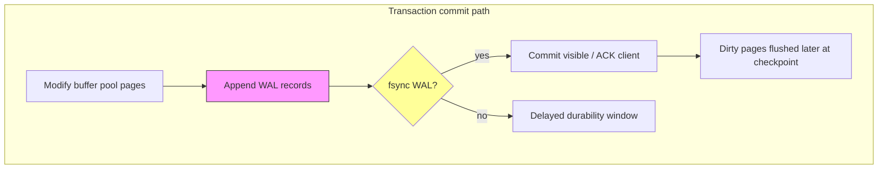
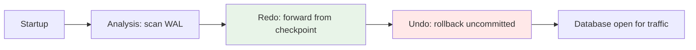
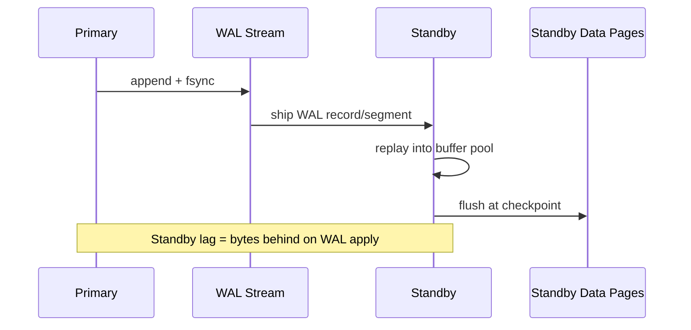

# Write-Ahead Log

## 1. Executive Summary

The **write-ahead log (WAL)**—also called **redo log**, **transaction log**, or **journal**—is an append-only sequence of records describing changes to database state. The fundamental rule: **log records must reach durable storage before the corresponding data pages they depend on are considered committed** (exact ordering policies vary by engine and durability level). After a crash, the engine **replays** the WAL from the last consistent **checkpoint** to reconstruct committed work and undo incomplete transactions as needed.

WAL serves three overlapping roles: **crash recovery** (safety), **durability** (ACID), and **replication** (physical standby applies the same byte stream). PostgreSQL's WAL, InnoDB's redo log, RocksDB's WAL, and SQL Server's transaction log share this pattern with different segment sizes, checksum algorithms, and group-commit optimizations.

Principal architects must understand WAL as a **latency and availability bottleneck** (`fsync` rate), a **capacity planning** input (archive, retention, replay time), and a **consistency boundary** between volatile buffer pool and durable media. Misconfigured `synchronous_commit`, full WAL disks, and underestimated recovery RTO cause production outages independent of application code quality.

## 2. Why This Topic Matters

Every durable relational database and most embedded LSM stores depend on WAL. Interviewers probe:

- State the WAL protocol in one sentence.
- Difference between redo and undo log.
- What `fsync` does and why group commit helps.
- How physical replication streams WAL.
- Recovery procedure after crash—what gets replayed?

Incidents: **WAL disk full** stops all writes; **async replication** with misunderstood durability window loses data on primary failure; **slow fsync** on shared cloud storage drives commit latency; **huge unreplicated WAL backlog** extends RPO/RTO beyond business tolerance.

WAL is also the **integration point** for change-data capture: logical decoding reads WAL records and emits row events to Kafka/Debezium—architects must understand that CDC lag is WAL retention lag, and long-running consumers interact with replication slots and disk capacity on the primary.

## 3. Problems Being Solved

| Problem | WAL mechanism |
|---------|---------------|
| Crash between page write and commit | Replay redo to complete or roll back |
| Torn page | Redo full-page image or doublewrite + redo |
| Durability promise to client | Force log to disk before ACK |
| Incremental backup | Archive WAL segments after checkpoint |
| Physical replication | Ship WAL to standby for apply |
| Point-in-time recovery | Base backup + WAL chain replay |

WAL does **not** replace backups, logical consistency across services, or Byzantine fault tolerance. It also does **not** by itself provide **idempotent** application semantics—clients that retry after timeout must handle duplicate effects at the business layer unless the database exposes exactly-once primitives (e.g., unique constraints plus careful error handling).

## 4. Assumptions and System Model

- **Log is append-only** with monotonic **LSN** (Log Sequence Number) or equivalent offset.
- **Storage crash model:** Process crash or power loss; log records persisted with `fsync` survive.
- **Data pages** in buffer pool are volatile until flushed to data files.
- **Checkpoint** records a position in the log before which data pages on disk are consistent enough to shorten replay.
- **Idempotent redo** (or redo with page LSN checks) prevents double-application.

**Not assumed:** Infinite log space; zero-cost `fsync`; cross-node atomic commit without separate consensus.

## 5. Essential Terminology

| Term | Definition |
|------|------------|
| **WAL / redo log** | Append-only change log for recovery |
| **LSN** | Log Sequence Number—ordering identifier |
| **Checkpoint** | Marker + dirty page flush policy boundary |
| **fsync / fdatasync** | Force OS buffer to durable media |
| **Group commit** | Batch multiple transactions' fsync together |
| **Redo** | Re-apply logged changes on restart |
| **Undo** | Roll back uncommitted changes (separate undo log in many engines) |
| **Full-page write** | Log entire page image to recover from torn write |
| **Archive / shipping** | Copy completed WAL segments to remote storage |
| **RPO** | Recovery Point Objective—data loss window |
| **WAL segment** | Fixed-size file rotation unit (e.g., 16 MB PostgreSQL) |

## 6. Core Mechanism

### WAL-before-data rule



*Figure 1: Classic ordering—WAL durable before commit ACK when full durability configured.*

### Crash recovery phases



*Figure 2: ARIES-style recovery (conceptual): redo all logged changes from checkpoint; undo losers of in-flight transactions.*

### Replication from WAL



*Figure 3: Physical streaming replication applies same redo as crash recovery on another node.*

## 7. Step-by-Step Walkthrough

**Scenario:** PostgreSQL `INSERT` with `synchronous_commit=on`.

| Step | Action | Durability state |
|------|--------|------------------|
| 1 | Insert tuple in shared buffers | Volatile |
| 2 | Append WAL record with new tuple | In WAL buffer |
| 3 | `XLogFlush` to disk | WAL durable on media |
| 4 | Return commit to client | Transaction durable |
| 5 | Background writer flushes heap/index pages | Data files catch up asynchronously |
| 6 | Checkpoint | All dirty pages before checkpoint LSN on disk |

**Crash after step 4:** Replay WAL; insert re-applied if page not yet written.

**Crash after step 2 before 3:** Transaction lost—client may retry (idempotency concern at app layer).

**RocksDB WAL:** Each `Put` logged; memtable flush independent; WAL truncated after SSTable durable.

## 8. Invariants and Guarantees

| Property | Type | Statement |
|----------|------|-----------|
| **Write-ahead** | Safety | Redo for page P durable before P's committed version on disk (policy-dependent) |
| **Log ordering** | Safety | Total order of LSNs defines replay sequence |
| **Atomic commit record** | Safety | Commit marker in log defines visibility |
| **Idempotent redo** | Safety | Page LSN comparison prevents duplicate apply |
| **Durability level** | Config | `synchronous_commit`, `innodb_flush_log_at_trx_commit` trade safety for speed |
| **Bounded log size** | Liveness | Requires recycling after checkpoint + archive |

Distinguish **safety** (no committed txn lost after ACK) from **liveness** (WAL space available, fsync completes).

## 9. Failure Scenarios

### Scenario 1: WAL volume full

**Setup:** Archive command failed; `pg_wal` grows unbounded.

**Effect:** All commits block—total write outage.

**Mitigation:** Monitor disk, fix archiver, increase retention policy, emergency `pg_wal` cleanup only with understanding of replica slots.

### Scenario 2: fsync latency spike

**Setup:** Noisy neighbor on EBS volume.

**Effect:** Commit p99 latency tracks storage, not CPU.

**Mitigation:** Provisioned IOPS, local NVMe for WAL, separate volume.

### Scenario 3: Replica lag unbounded

**Setup:** Standby slow apply; replication slot holds WAL on primary.

**Effect:** Primary disk fills; production stops.

**Mitigation:** Monitor lag, slot management, promote or drop slot with RPO acceptance.

### Scenario 4: Torn data page without full-page WAL

**Setup:** Power loss during 16 KiB page write.

**Effect:** Checksum failure; recovery needs full-page image from WAL (PostgreSQL) or doublewrite (InnoDB).

### Scenario 5: `synchronous_commit=off` surprise

**Setup:** Performance tuning without stakeholder sign-off.

**Effect:** Last ~hundreds of ms of commits lost on crash—**implementation-dependent window**.

**Mitigation:** Document RPO; use only when acceptable.

### Scenario 6: Split-brain with async replication

**Setup:** Primary fails over to standby; old primary still accepting writes briefly.

**Effect:** Divergent WAL timelines—manual reconciliation or rebuild required.

**Mitigation:** STONITH, fencing, consensus-based failover (Patroni, orchestrator) with explicit promotion rules—not WAL alone.

## 10. Performance Characteristics

| Technique | Benefit | Cost |
|-----------|---------|------|
| Group commit | Amortize fsync across txs | Slight commit latency jitter |
| Async commit | Higher TPS | RPO window |
| Large WAL buffers | Batch writes before flush | Memory; longer loss window if async |
| Separate WAL disk | Isolate sequential write load | Hardware cost |
| `O_DIRECT` on WAL | Avoid double cache | Tuning complexity |
| `wal_compression` (PostgreSQL) | Smaller WAL I/O | CPU for compress/decompress |

**Throughput ceiling:** Often **commits per second ≈ fsyncs per second** when each commit fsyncs individually—group commit raises this. PostgreSQL's group commit waits briefly (`commit_delay`) to coalesce fsyncs—microseconds of added latency for potentially multiplicative TPS gains under concurrent writers.

**Latency components of a durable commit:** (1) serialize log record to WAL buffer, (2) copy to kernel, (3) `fsync` device round-trip, (4) optionally wait for synchronous replica apply. Step 3 often dominates on network-attached storage—principal architects should measure with `pg_test_fsync` or equivalent rather than assume SSD marketing IOPS.

**Checkpoint interference:** Aggressive checkpointing increases data-file write bandwidth concurrently with WAL fsync—can contend on shared volumes. Spreading checkpoint I/O (`checkpoint_completion_target` in PostgreSQL) reduces latency spikes at cost of longer total checkpoint duration.

**Log record size:** Wide rows generate large WAL records; TOAST/compression at SQL layer affects WAL volume. Bulk load with `COPY` still generates WAL unless `UNLOGGED` or minimal WAL modes—capacity planning must include bytes-per-row in WAL.

Do not quote universal TPS—measure with your durability settings and hardware.

## 11. Scalability Limits

- **Single WAL stream per database instance**—serialization point for commit ordering.
- **Replication lag** bounds how aggressively WAL can be recycled.
- **Recovery time** grows with WAL volume since last checkpoint—RTO risk.
- **Sharding** scales aggregate WAL throughput by partitioning writers.

## 12. Operational Considerations

- Size WAL disk for peak generation + archive lag + slots.
- Monitor: `pg_wal` size, archive success, replication lag, `fsync` time.
- Test PITR restore quarterly—WAL chain integrity.
- Align `checkpoint_timeout` and `max_wal_size` with I/O capacity.
- Document durability settings per environment (prod vs staging).
- **wal_keep_size** / **max_slot_wal_keep_size** (PostgreSQL): cap WAL retained for slots to prevent unbounded disk use—trade replica catch-up vs primary disk safety.
- **Log shipping lag alerts** should page before disk exhaustion, not after.
- **Corrupt WAL segment** recovery: know whether you can restore from archive starting at last good LSN—practice partial chain restore.

## 13. Security Considerations

- WAL contains **plaintext tuple data** unless TDE encrypts logs—protect archives like data files.
- Leaked WAL enables reconstruction of recent changes—access control on archive buckets.
- Ransomware: immutable WAL archive copies for recovery.

## 14. Cost Considerations

- High-IOPS WAL volume on cloud ($$$).
- Long retention archives in object storage.
- Cross-region WAL shipping bandwidth.
- Engineering time for replication slot incidents.

**Tradeoff:** `synchronous_commit=remote_apply` (PostgreSQL) improves RPO vs cost of sync replica RTT.

## 15. Production Implementations

### PostgreSQL WAL (XLog)

16 MB segments; `pg_switch_wal`; logical and physical decoding; `synchronous_commit` levels including `remote_apply` (wait for replica flush). **Full-page writes** logged on first page change after checkpoint protect against torn pages. **Replication slots** pin WAL for logical decoding consumers—operational footgun if consumer dies. **pg_walarchive** and `archive_command` enable PITR to object storage.

### InnoDB redo log

Circular redo files; `innodb_flush_log_at_trx_commit` values 0/1/2 trade durability vs performance. **Doublewrite buffer** protects data pages separately from redo. **Undo tablespace** holds rollback segments for MVCC and undo phase of recovery—distinct file from redo but coordinated in recovery.

### RocksDB WAL

Per-DB WAL; recycled after memtable flush to SSTable; `sync` write option. Multiple column families share WAL by default. WAL size bounded by memtable flush progress—tuning memtable affects both memory and WAL disk churn.

### SQL Server transaction log

VLFs (virtual log files); log truncation after backup; Always On AG ships log. Log reuse requires backup or `SIMPLE` recovery model acknowledgment of data loss window—different operational semantics than PostgreSQL's continuous archiving.

### Kafka as append-only log (analogy)

Kafka segments resemble WAL structurally but serve **inter-service streaming** with different consistency contracts—not a substitute for database WAL unless building event-sourced systems with explicit recovery semantics.

**Distinction:** **Redo** vs **binlog** (MySQL logical) vs **WAL**—physical vs logical replication paths differ. MySQL InnoDB redo is physical; binlog is logical row events for replication and CDC—both may be required for full recovery story depending on backup strategy. Patroni and similar tools orchestrate failover but do not replace understanding of which log positions must align for a successful promotion.

## 16. Alternatives and Tradeoffs

| Approach | Durability | Complexity |
|----------|------------|------------|
| Full WAL fsync each commit | Strongest local RPO | Lowest TPS |
| Group commit | Balanced | Default many engines |
| Async WAL | Highest TPS | Data loss window |
| Battery-backed cache | Fast ack; lazy flush | Hardware dependency |
| Replicated quorum commit | Cross-node durability | Consensus overhead (Raft) |

**No WAL:** In-memory stores, or append-only LSM with only SSTable flush—different failure model. **Shadow paging** (copy-on-write trees) reduces in-place update need but is not mainstream in relational OLTP—PostgreSQL uses WAL + heap, not shadow paging for primary storage.

**Command logging** at application layer (event sourcing) can complement but rarely replaces engine WAL for arbitrary SQL transactions unless the entire system is designed event-first.

## 17. Common Misconceptions

| Misconception | Reality |
|---------------|---------|
| "Data files updated on commit" | Often only WAL synced; pages lazy-flushed |
| "WAL and undo are the same" | Redo vs rollback segments serve different recovery phases |
| "Replication eliminates WAL need" | Standby still replays WAL or equivalent |
| "fsync is free on SSD" | Still a syscall barrier; latency nonzero |
| "Checkpoint = backup" | Checkpoint bounds recovery; backup is separate |

## 18. Principal Architect Perspective

1. **Name your RPO** and map it to `synchronous_commit` / replication mode.
2. **WAL disk is sacred**—never share with analytics scratch.
3. **Recovery time is a feature**—test replay duration at max WAL size.
4. **Physical vs logical replication**—WAL shipping is physical; Debezium is logical.
5. **Idempotent consumers** if app retries after ambiguous commit.
6. **Legal/compliance** may require WAL archive immutability (WORM storage)—design retention separately from operational recycling.
7. **Multi-region:** synchronous cross-region WAL commit adds RTT to every transaction—explicit PACELC tradeoff; async is a product decision with dollar cost on failure.
8. **Chaos tests:** kill -9 primary during heavy write; measure data loss window and recovery time—slides are not substitutes.

WAL is the contract between application "commit" and physics—architects who blur that contract own the outage narrative.

## 19. Architecture Review Exercise

**Scenario:** Fintech claims "zero data loss" on single-region PostgreSQL with async replica and `synchronous_commit=local`.

**Prompts:** True RPO? Failover story? Need sync replica or quorum? WAL archive for PITR? fsync on what volume?

**Expected:** Async replica loses window; zero loss needs sync commit to durable quorum or sync standby; document actual RPO.

## 20. Whiteboard Explanation

**90-second version:**

> "The write-ahead log is an append-only journal of every change. Before the database acknowledges a commit, the log record must hit disk—usually with fsync—so if the machine dies, we replay the log to reconstruct committed work. Data pages in memory can flush later at checkpoint. On restart we redo from the last checkpoint LSN forward, then undo uncommitted transactions. Group commit batches multiple transactions into one fsync for throughput. Physical replication just ships the same WAL to a standby. Performance is often limited by fsync rate, not CPU. Operational nightmares: WAL disk full, replication slots pinning old WAL, and tuning synchronous_commit without telling the business you've widened the data-loss window."

## 21. Interview Questions

1. **What is WAL?**
   - *Signals:* Append-only redo; crash recovery; durability.

2. **WAL-before-data rule?**
   - *Signals:* Log durable before pages for commit.

3. **Redo vs undo?**
   - *Signals:* Redo forward; undo aborts in-flight.

4. **What does checkpoint do?**
   - *Signals:* Flush dirty pages; shorten recovery.

5. **Group commit?**
   - *Signals:* Shared fsync; throughput.

6. **`innodb_flush_log_at_trx_commit=2`?**
   - *Signals:* OS buffer not disk each commit—window.

7. **Physical vs logical replication?**
   - *Signals:* WAL bytes vs change events.

8. **Torn page problem?**
   - *Signals:* Partial write; full-page WAL/doublewrite.

9. **WAL full symptom?**
   - *Signals:* Writes block; disk/archiver.

10. **How does RocksDB truncate WAL?**
    - *Signals:* After memtable flush to SSTable.

11. **What is a replication slot?**
    - *Signals:* Consumer offset; pins WAL on primary.

12. **ARIES recovery phases?**
    - *Signals:* Analysis, redo, undo.

13. **`synchronous_commit=remote_apply` vs `on`?**
    - *Signals:* Wait for replica flush vs local only.

14. **Why separate WAL disk?**
    - *Signals:* Isolate sequential fsync from random data I/O.

15. **PITR requirements?**
    - *Signals:* Base backup + continuous WAL archive chain.

## 22. Interview Follow-Ups

1. **Design cross-AZ zero RPO Postgres.**
   - *Signals:* Sync replica, `remote_apply`, quorum.

2. **Estimate recovery time with 1 TB WAL.**
   - *Signals:* Replay bandwidth, checkpoint policy.

3. **Compare WAL to Kafka for event sourcing.**
   - *Signals:* Transactional scope, retention, consumers.

4. **Explain logical decoding vs physical replication.**
   - *Signals:* Row events vs page redo; slot retention; schema changes.

5. **What happens if you delete pg_wal manually?**
   - *Signals:* Corruption, inability to recover; only with understanding of checkpoint and backups.

## 23. Strong Answer Example

**Question:** "Why is our commit latency 20ms when CPU is low?"

> "I'd suspect storage fsync on the WAL path, not query CPU. Check `pg_stat_wal` and OS `iowait` during commits. On cloud block storage, fsync latency often dominates—20ms is plausible for contended volumes. Verify WAL is on dedicated provisioned-IOPS or local NVMe, not shared data volume. Review `synchronous_commit` and whether we're waiting on `remote_apply` to a lagging sync replica—that adds RTT. Group commit should help burst traffic; if each statement commits individually with synchronous disk flush, you're bounded by fsync rate. I'd correlate `commit_latency` histogram with disk metrics before tuning SQL."

## 24. Weak Answer Example

**Question:** "Why is commit latency 20ms when CPU is low?"

> "Add more CPU cores and connection pooling."

**Why weak:** Ignores WAL/fsync storage path; CPU idle contradicts CPU scaling fix.

## 25. Hands-On Exercise

1. PostgreSQL: benchmark `pgbench` with `synchronous_commit=on` vs `off`; record TPS and stated RPO tradeoff.
2. Watch `pg_current_wal_lsn()` during load; note checkpoint in logs.
3. RocksDB: write with `sync=true` vs `false`; compare latency.
4. Diagram redo/undo for single txn abort scenario.
5. Configure `archive_command` to copy WAL to local directory; perform base backup and restore to point in time in a lab cluster.
6. Measure `pg_test_fsync` on your dev machine; relate result to theoretical max commits/sec.

**Success criteria:** Articulate RPO for each durability setting tested; draw WAL + checkpoint timeline for one failed restore drill.

## 26. Knowledge Check

1. WAL primary role? *(Durability / crash recovery.)*
2. Before commit ACK usually requires? *(WAL durable—if sync config.)*
3. Checkpoint shortens? *(Recovery replay time.)*
4. LSN purpose? *(Order log records.)*
5. Replication slot risk? *(Pins WAL on primary.)*

## 27. Flashcards

| # | Front | Back |
|---|-------|------|
| 1 | WAL | Append-only redo journal |
| 2 | Write-ahead | Log before data pages durable |
| 3 | LSN | Log sequence ordering |
| 4 | Checkpoint | Dirty flush + recovery bound |
| 5 | fsync | Force durable write |
| 6 | Group commit | Batch fsync |
| 7 | Redo | Reapply on crash |
| 8 | Undo | Roll back uncommitted |
| 9 | Full-page write | Fix torn page on recovery |
| 10 | Archive | WAL retention for PITR |
| 11 | sync replica | WAL shipped to standby |
| 12 | RPO | Acceptable data loss window |

## 28. Cheat Sheet

```
WAL RULE
  Log record durable → then commit (strict mode)

RECOVERY
  Checkpoint LSN → REDO forward → UNDO losers

PERFORMANCE
  fsync often limits commits/sec
  Group commit, dedicated WAL disk

OPS
  Monitor WAL disk, archive, replication lag
  Slots pin WAL—dangerous if replica dead

SETTINGS (examples)
  PostgreSQL: synchronous_commit
  InnoDB: innodb_flush_log_at_trx_commit
  RocksDB: WriteOptions.sync

INTERVIEW
  WAL ≠ backup
  Physical repl = WAL stream
  Async = RPO window
```

## 29. Related Concepts

- [Storage Engine Fundamentals](/docs/storage-engines/storage-engine-fundamentals) — buffer pool and pages
- [B-Trees](/docs/storage-engines/b-trees) — page updates logged
- [LSM Trees](/docs/storage-engines/lsm-trees) — memtable WAL truncation
- [Replication](/docs/replication/primary-secondary-replication) — WAL shipping
- [Transactions](/docs/transactions/overview) — commit protocol

## 30. References

### Primary sources

- Gray, J., & Reuter, A. (1993). *Transaction Processing: Concepts and Techniques* — ARIES recovery, WAL theory.
- Mohan, C., Haderle, D., Lindsay, B., Pirahesh, H., & Schwarz, P. (1992). "ARIES: A Transaction Recovery Method Supporting Fine-Granularity Locking and Partial Rollbacks Using Write-Ahead Logging." *TODS* — industrial redo/undo framework.

### Production documentation

- [PostgreSQL WAL Internals](https://www.postgresql.org/docs/current/wal-intro.html) — segments, checkpoints, archiving.
- [MySQL InnoDB Redo Log](https://dev.mysql.com/doc/refman/8.0/en/innodb-redo-log.html) — flush policies.
- [RocksDB WAL](https://github.com/facebook/rocksdb/wiki/Write-Ahead-Log) — truncation with flush.

### Textbooks

- Kleppmann, *DDIA*, Chapter 7 — replication logs and change capture distinction.

### Distinction

| Claim | Source |
|-------|--------|
| WAL protocol / ARIES | Mohan et al.; Gray & Reuter |
| `synchronous_commit` semantics | PostgreSQL docs—version-specific |
| Commit latency numbers | **Measure on your storage**—do not universalize |
