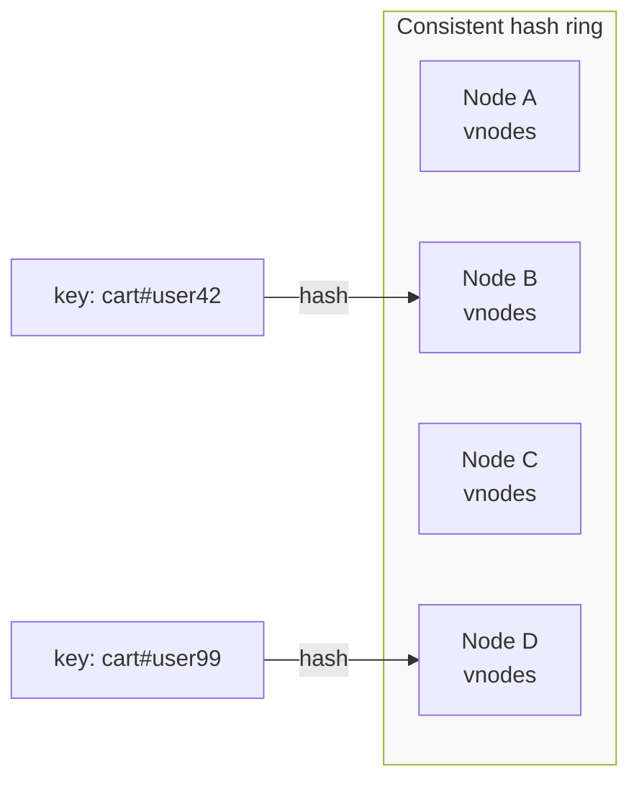
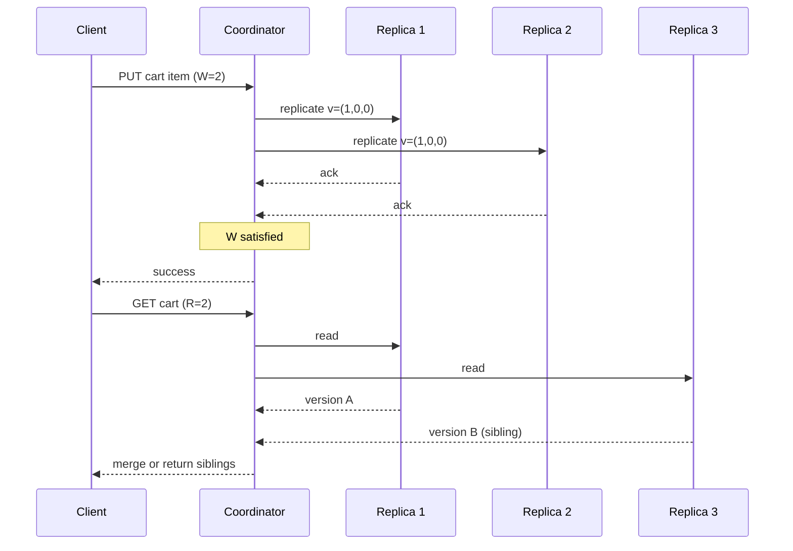
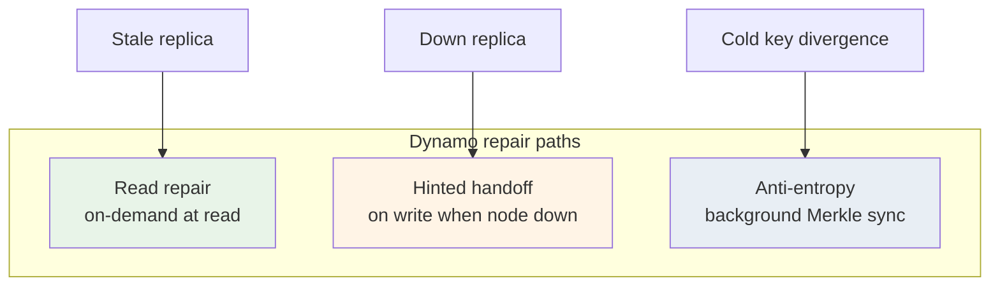

# Amazon Dynamo

## 1. Executive Summary

**Amazon Dynamo** is a highly available, eventually consistent distributed key-value store described by DeCandia et al. (2007) at SOSP. It was built to power Amazon's shopping cart and related services where **availability during partial failure** and **predictable latency at scale** matter more than strong global consistency. Dynamo combines **consistent hashing** for partition assignment, **quorum-style replication** with tunable **N, R, W**, **vector clocks** for version metadata, **sloppy quorums** with **hinted handoff**, and **read repair** plus **Merkle-tree anti-entropy** to converge replicas.

Dynamo is a **design pattern and research artifact**, not a product you deploy today. AWS **DynamoDB** borrows the name and some ideas but is a different system with different guarantees—principal architects must separate the **2007 paper** from **managed services** and from **Cassandra**, which implements many Dynamo ideas in open source.

This chapter covers Dynamo's problem domain, mechanisms, safety and liveness properties under its model, failure behavior, and a production deep dive framed as an architecture case study—plus interview depth for principal-level system design.

## 2. Why This Topic Matters

Dynamo is one of the most cited papers in distributed data systems. It established vocabulary and tradeoffs that appear in Cassandra, Riak, Voldemort, and indirectly in cloud-native storage design. Interviewers at senior and principal levels expect:

- Explanation of **N, R, W** and when **R + W > N** provides overlap.
- Why **vector clocks** exist and what **siblings** mean at read time.
- **Hinted handoff** vs **read repair** vs **anti-entropy**—distinct repair paths.
- Honest statement that Dynamo optimizes **AP** under partition (in CAP terms) with application-level conflict resolution.

Misunderstanding Dynamo leads to production incidents: treating `W=1` as durable, assuming quorums imply linearizability, or conflating the paper with DynamoDB's conditional writes and transactions.

## 3. Problems Being Solved

| Problem | Dynamo approach |
|---------|-----------------|
| **Shopping cart always writable** | Leaderless writes; no single master failover |
| **Partition tolerance** | Quorum operations survive node loss within parameters |
| **Horizontal scale** | Consistent hashing spreads keys across nodes |
| **Concurrent updates** | Vector clocks detect concurrency; app merges |
| **Temporary replica unavailability** | Hinted handoff buffers writes |
| **Replica divergence** | Read repair (eager) + anti-entropy (background) |
| **Operational simplicity at scale** | Symmetric peers; gossip membership |

Dynamo does **not** solve: global total order, automatic semantic merge of business objects, Byzantine faults, or cross-key transactions.

## 4. Assumptions and System Model

| Assumption | Implication |
|------------|-------------|
| **Crash-stop nodes** | Failed nodes stop; no malicious behavior |
| **Eventually reachable network** | Partitions heal; repair runs |
| **Application can resolve conflicts** | Siblings returned to client for merge |
| **Key-value access model** | No multi-key ACID in core design |
| **Homogeneous commodity hardware** | Symmetric replication; no specialized storage tier |
| **Client or middleware coordinates** | Coordinator routes to preference list |

**Consistency model (paper):** Eventual consistency with **tunable durability and freshness** via R and W. **Safety** of quorum overlap holds under strict quorums and stable membership; **liveness** favors completing writes during replica outages via sloppy quorum and hints.

## 5. Essential Terminology

| Term | Definition |
|------|------------|
| **N** | Replication factor—number of replicas per key |
| **R** | Minimum replicas contacted for a successful read |
| **W** | Minimum replicas that must ack a write |
| **Preference list** | Ordered set of N nodes responsible for a key |
| **Coordinator** | Node that routes a client request to replicas |
| **Consistent hashing** | Hash ring maps keys to nodes; virtual nodes smooth load |
| **Vector clock** | Per-replica logical counters tracking causality |
| **Sibling** | Concurrent conflicting versions returned on read |
| **Sloppy quorum** | Write/read may use nodes outside preference list when primary unavailable |
| **Hinted handoff** | Store write for down node; deliver on recovery |
| **Read repair** | Fix stale replicas during read path |
| **Anti-entropy** | Background Merkle-tree comparison syncs replicas |
| **Merkle tree** | Hash tree summarizing key ranges for divergence detection |

**Mnemonic:** **N-R-W-H-R-A** — Nodes, Read quorum, Write quorum, Hints, Read repair, Anti-entropy.

## 6. Core Mechanism

### 6.1 Partitioning: consistent hashing

Keys hash to a ring; each physical node owns multiple **virtual nodes** (vnodes) to improve load balance. When a node joins or leaves, only adjacent key ranges move—unlike naive modulo partitioning.



*Figure 1: Keys hash to the ring; virtual nodes spread ownership and reduce hotspots when cluster size changes.*

### 6.2 Replication and coordinator path

For each key, the coordinator determines the **preference list** of N successors on the ring. Writes replicate to W nodes; reads query R nodes and return the **highest version** by vector clock, possibly multiple siblings.



*Figure 2: Coordinator fans out to replicas; write quorum and read quorum are independent tunables.*

### 6.3 Vector clocks and siblings

Each write carries a vector clock. If version A causally precedes B, return B. If concurrent, return **siblings**—application merges (e.g., union of cart line items).

### 6.4 Hinted handoff and sloppy quorum

When a preference-list node is down, coordinator may write to a **fallback** node with a **hint** to forward when the owner returns. This improves **liveness** but weakens strict quorum intersection unless hints are delivered before conflicting reads.

### 6.5 Read repair and anti-entropy

**Read repair:** After read, coordinator writes freshest version to stale replicas (often probabilistic to limit load).

**Anti-entropy:** Periodic Merkle-tree comparison over key ranges detects divergence without a read trigger—essential for cold keys.



*Figure 3: Three complementary mechanisms—eager on read, buffered on write, background for cold data.*

## 7. Step-by-Step Walkthrough

### Walkthrough A: Successful quorum write and read (N=3, W=2, R=2)

1. Client sends `PUT` to coordinator for key K.
2. Coordinator hashes K; preference list = \{A, B, C\}.
3. Coordinator writes to A and B; both ack → W=2 satisfied.
4. Client sends `GET`; coordinator reads A and C.
5. Versions match → single value returned.

**R + W > N:** 2 + 2 > 3 → read and write sets overlap; likely see latest write if no failures and no concurrent writes.

### Walkthrough B: Concurrent writes create siblings

1. Partition isolates coordinator paths briefly.
2. Write to A: vector (2,0,0); write to B: vector (0,2,0)—concurrent.
3. Read R=2 from A and B returns both versions.
4. Application merges cart items; writes merged version with updated clock.

### Walkthrough C: Node down with hinted handoff

1. Node B in preference list is down.
2. Coordinator sloppy-writes to D with hint "deliver to B".
3. Client receives write success with W=2 via \{A, D\}.
4. B recovers; D forwards hinted data.
5. Anti-entropy later verifies range checksums.

### Walkthrough D: Merkle anti-entropy

1. Nodes A and C exchange root hashes for key range [X, Y).
2. Hashes differ → descend tree to find leaf buckets.
3. Exchange divergent keys only—bandwidth-efficient repair.

## 8. Invariants and Guarantees

### 8.1 Quorum overlap (strict case)

**Property:** If R + W > N and operations use the **true** preference list (no sloppy quorum), a read after a completed write should observe that write's version **unless** another concurrent write created siblings.

**Safety:** Prevents reading a stale single version that missed the write quorum—under stated assumptions.

**Not guaranteed:** Linearizability, serializability, or automatic conflict-free merge.

### 8.2 Eventual consistency (liveness-oriented)

**Property:** If updates stop and repair completes, all replicas converge to the same value set (post-merge).

**Mechanism:** Read repair + anti-entropy + hint delivery.

### 8.3 Vector clock causality

**Property:** If event A happened-before B, B's clock dominates A; coordinator returns B over A.

**Limitation:** Concurrent events produce siblings—**by design**, not failure.

| Property | Type |
|----------|------|
| Quorum overlap (strict) | Safety (single-version case) |
| Eventual convergence | Liveness |
| Causal ordering via clocks | Partial safety |
| Availability during partition | Liveness (AP bias) |

## 9. Failure Scenarios

| Failure | Behavior | Mitigation |
|---------|----------|------------|
| **W=1, node dies before replicate** | Write lost | Raise W; use QUORUM for critical data |
| **Sloppy quorum during partition** | R+W>N argument may not hold | Tighten quorum; repair on heal |
| **Sibling explosion** | Storage/latency growth | Reduce conflict domain; CRDTs |
| **Read repair storm on hot key** | Cross-replica traffic spike | Probabilistic repair; rate limits |
| **Hint backlog on dense nodes** | Disk pressure | Monitor hint queues; cap sloppy writes |
| **Merkle repair lag** | Cold keys stale for days | Incremental repair scheduling |
| **Coordinator crash mid-request** | Client may retry duplicate writes | Idempotency keys; version checks |

## 10. Performance Characteristics

| Dimension | Behavior |
|-----------|------------|
| Write latency | Parallel to W replicas—often dominated by slowest ack |
| Read latency | Parallel R; merge cost if siblings |
| Throughput | Scales with nodes and key distribution |
| Hot keys | All N replicas receive every write—bottleneck remains |
| Repair traffic | Hidden cost—budget bandwidth for anti-entropy |

Dynamo trades **coordination simplicity** (no leader per key) for **application complexity** (merge logic) and **tunable but easy-to-misconfigure** consistency.

## 11. Scalability Limits

- **Hot partitions:** Consistent hashing does not split a hot key—external sharding required.
- **Vector clock size:** Grows with replica count and concurrency history.
- **Gossip at scale:** Membership protocols need hierarchical gossip at thousands of nodes.
- **Merkle tree depth:** Full comparisons expensive at petabyte scale—partition repair windows.
- **Organizational limit:** Per-request R/W tuning errors cause subtle bugs across microservices.

## 12. Operational Considerations

- Document **default N, R, W** per API and enforce in client libraries.
- Monitor **hint queue depth**, **sibling rate**, **repair bandwidth**, **partition skew**.
- **Replace failed nodes** before removing tokens from the ring.
- Run **chaos tests**: node loss during W=1 traffic; measure data loss rate empirically.
- **Sloppy quorum** is a feature—document when it is disabled (e.g., financial paths).

## 13. Security Considerations

- Authenticate coordinator-to-replica RPCs; compromised coordinator can target subset of replicas.
- Validate hinted handoff payloads; expire stale hints to prevent poisoning.
- Rate-limit read repair from untrusted read paths—amplification DoS vector.
- Encrypt data at rest on commodity nodes; Dynamo paper assumes trusted datacenter boundary.

## 14. Cost Considerations

- **Storage × N** plus cross-AZ replication egress.
- **Repair traffic** often 10–20% of production bandwidth [operational rule of thumb; verify per deployment].
- **Low W/R** reduces latency but increases incident cost when nodes fail simultaneously.
- Application merge logic is **engineering cost** not visible in infra bills.

## 15. Production Implementations

### Case study: Amazon shopping cart (paper context)

The Dynamo paper describes motivations from Amazon's retail platform. The following frames the design as a **production architecture review** using standard case-study dimensions. Specific internal scale numbers from 2007 are from the paper; modern Amazon scale differs—mark unverified operational details.

#### Business context

Shopping carts must remain writable during node failures, network glitches, and peak events (e.g., holiday traffic). Losing a cart is a direct revenue and customer-trust problem; brief staleness of non-critical metadata may be acceptable if the cart converges.

#### Scale

The paper reports hundreds of production services and growth requiring incremental scale-out. Qualitatively: very high read/write rates, large node counts, multi-datacenter deployment. Exact current QPS is not public—do not cite unverified benchmarks.

#### Functional requirements

- `GET` / `PUT` / `DELETE` on cart keys per user session.
- Add/remove line items concurrently from multiple devices.
- No relational joins; object stored as blob with metadata.

#### Non-functional requirements

- **High availability:** writes succeed during partial outages.
- **Predictable latency:** millisecond-scale target at percentile tail (service-dependent).
- **Durability:** tunable via W; not maximal by default on all paths.
- **Incremental scalability:** add nodes without full resharding downtime.

#### Architecture overview

Symmetric peer nodes; client library or middleware picks coordinator; consistent hashing assigns keys; quorum replication with vector clocks; three repair paths.

#### Data model

Key = user/cart identifier; value = serialized cart state; metadata includes vector clock and timestamps. Application defines merge semantics for siblings (union of items).

#### Partitioning

Consistent hashing with virtual nodes; preference list of N successors per key.

#### Replication

N replicas per key; coordinator replicates to W nodes on write, queries R on read.

#### Consistency

Eventual consistency default; R+W>N for overlap when strict quorums hold. Application resolves concurrent updates.

#### Availability

Leaderless design avoids master failover; sloppy quorum and hints maintain write availability when preference nodes are down.

#### Failure handling

Hinted handoff for temporary absence; read repair on active keys; Merkle anti-entropy for cold divergence; replace failed hardware and run repair before decommission.

#### Security

Intra-datacenter trust model in 2007 paper; modern deployments would add TLS, IAM-style access control at API edge—not core to original design.

#### Observability

Per-node latency histograms, hint queue depth, sibling rate, repair progress per key range, ring membership health via gossip.

#### Cost model

Commodity hardware at scale; replication factor drives storage; repair bandwidth is ongoing operational cost; engineering cost for conflict resolution logic.

#### Evolution of architecture

Dynamo influenced **DynamoDB**, **Cassandra**, and **Riak**. Amazon's external managed offering diverged toward single-digit millisecond API, partition keys, and conditional writes—see [DynamoDB](/docs/distributed-databases/dynamodb) chapter.

#### Important tradeoffs

| Tradeoff | Choice |
|----------|--------|
| Consistency vs availability | Favor availability; tune R/W |
| Simplicity vs merge burden | Push merge to application |
| Strict vs sloppy quorum | Sloppy for liveness |
| Sync repair vs background | Both paths needed |

#### Known limitations

No multi-key transactions; hot keys; sibling management; not linearizable by default; operational complexity of per-request tuning.

#### Interview lessons

Always state **N, R, W** explicitly; explain overlap; separate repair mechanisms; never equate Dynamo paper with DynamoDB product.

## 16. Alternatives and Tradeoffs

| Alternative | When to prefer |
|-------------|----------------|
| **Primary-secondary replication** | Simple consistency story; accept failover |
| **Multi-leader** | Geographic write locality with conflict handling |
| **Consensus per shard (Raft)** | Strong consistency for metadata |
| **Managed DynamoDB** | Ops offload; different API and guarantees |

Dynamo wins when **always-on writes** and **horizontal scale** dominate and the application can **merge conflicts**.

## 17. Common Misconceptions

| Misconception | Reality |
|---------------|---------|
| "Dynamo = DynamoDB" | Different systems; verify AWS docs |
| "Quorum = strong consistency" | Overlap ≠ linearizability |
| "Vector clocks eliminate conflicts" | They detect concurrency; app merges |
| "No leader ever" | Coordinator acts as ephemeral router |
| "Consistent hashing prevents hot keys" | Hot keys still hit one partition |

## 18. Principal Architect Perspective

1. **Map each workflow to (N,R,W)** in an ADR—not cluster defaults.
2. **Measure sibling rate** as leading indicator of design stress.
3. **Plan hot keys** before deployment—queues, caches, or key splitting.
4. **Budget repair bandwidth** from day one.
5. **Teach teams** that availability features (sloppy quorum) weaken formal quorum arguments.

## 19. Architecture Review Exercise

**Scenario:** Session cart service; N=3; W=1; R=1; peak 50k writes/sec per popular SKU during flash sale.

**Review prompts:**

1. Acceptable to lose single write on node failure?
2. Can inventory checks read from one replica?
3. When promote to W=2, R=2?
4. How to mitigate hot SKU partition?
5. Hinted handoff disk pressure?

**Expected findings:** W=1 unsafe for cart durability; hot SKU needs external sharding; inventory may need stronger store.

## 20. Whiteboard Explanation

"Dynamo partitions keys with consistent hashing and replicates each key to N nodes. Clients write to W replicas and read from R. If R plus W exceeds N and we use strict quorums, read and write sets overlap so reads likely see recent writes. Concurrent updates produce siblings tracked by vector clocks; the application merges. When a replica is down, hinted handoff stores writes elsewhere with a hint to forward later—sloppy quorum improves availability but weakens overlap guarantees. Read repair fixes stale replicas on read; Merkle anti-entropy fixes cold data in the background. It's an AP-leaning design: available during partition, eventually consistent, conflict resolution at the app layer."

## 21. Interview Questions

1. **What problem did Dynamo solve at Amazon?** — Always-available cart-like services at scale.
2. **Define N, R, W.** — Replication factor; read quorum; write quorum.
3. **When does R+W>N help?** — Replica overlap for freshness (strict case).
4. **Purpose of vector clocks?** — Detect concurrent vs causal versions.
5. **Hinted handoff?** — Buffer writes for down preference node.
6. **Read repair vs anti-entropy?** — On-read fix vs background Merkle sync.
7. **Sloppy quorum risk?** — Breaks strict intersection argument.
8. **Why virtual nodes?** — Load balance and smoother ring changes.
9. **Hot key problem?** — All replicas for key absorb all writes.
10. **Dynamo vs DynamoDB?** — Paper vs managed product; different guarantees.
11. **Is Dynamo linearizable?** — Not by default.
12. **Coordinator role?** — Route to replicas; not durable leader.
13. **Merkle tree purpose in repair?** — Bandwidth-efficient divergence detection.
14. **Sibling merge responsibility?** — Application layer.
15. **CAP placement for Dynamo?** — AP-leaning under partition; tune R/W for freshness.

### Scoring rubric (principal)

| Signal | Strong | Weak |
|--------|--------|------|
| Quorum math | Computes R+W>N examples | Vague "majority" |
| Repair paths | Names three mechanisms | Conflates read repair with hints |
| Product vs paper | Explicit distinction | Equates DynamoDB |
| Safety/liveness | Separates overlap vs merge | Claims strong consistency |

## 22. Interview Follow-Ups

1. **Pick N,R,W for password reset tokens.** — QUORUM-level W and R; not ONE.
2. **Prove overlap fails for N=5,R=2,W=2.** — 2+2=4<5.
3. **Design merge for shopping cart siblings.** — Union items; tombstone removals.
4. **When disable sloppy quorum?** — Financial or compliance paths.
5. **How Merkle trees reduce repair bandwidth?** — Hash subtree comparison.

## 23. Strong Answer Example

**Question:** "Explain how Dynamo remains available when a replica in the preference list is down."

**Strong outline:** "The coordinator still attempts the preference list first. If it cannot reach W nodes there, it may use a sloppy quorum—writing to W nodes including fallbacks outside the list—and use hinted handoff to store the write on a healthy node with metadata to forward to the owner when it recovers. This preserves write liveness without blocking on a failed node. The tradeoff is that strict R+W>N overlap with the original preference set may not hold until hints are delivered and anti-entropy converges replicas. For shopping-cart-class workloads, availability during node maintenance matters; the application tolerates brief staleness and merges siblings. For inventory or payment adjacency, we'd raise W and R or route those fields to a stronger store."

## 24. Weak Answer Example

**Question:** "Explain how Dynamo remains available when a replica in the preference list is down."

**Weak:** "Dynamo is distributed so other nodes take over. Replication factor 3 means you're fine."

**Red flags:** No hinted handoff; no sloppy quorum tradeoff; no W/R analysis; implies automatic strong consistency.

## 25. Hands-On Exercise

1. Build a coordinator simulator: N=3, configurable R/W, vector clocks.
2. Inject node failure during W=1 writes; measure lost writes.
3. Implement sibling return on concurrent writes; write merge function.
4. Add probabilistic read repair (10% of reads).
5. Sketch Merkle tree over 1,000 keys; simulate one divergent bucket.

**Success criteria:** Demonstrate overlap failure when R+W≤N; document hint delivery requirement for sloppy writes.

## 26. Knowledge Check

1. What does W measure? *(Write ack count.)*
2. Siblings arise from? *(Concurrent writes.)*
3. Hinted handoff improves? *(Write liveness.)*
4. Anti-entropy uses? *(Merkle trees.)*
5. Virtual nodes improve? *(Load balance on ring.)*
6. Strict quorum overlap needs? *(R+W>N on true preference list.)*

## 27. Flashcards

| Front | Back |
|-------|------|
| Dynamo year/venue | SOSP 2007 |
| N, R, W | Replication factor; read quorum; write quorum |
| Consistent hashing | Ring partition; minimal move on membership change |
| Vector clock | Per-replica counters; detect concurrency |
| Sibling | Concurrent conflicting versions |
| Hinted handoff | Buffer write for down owner |
| Sloppy quorum | Use fallback nodes outside preference list |
| Read repair | Update stale replicas during read |
| Anti-entropy | Background Merkle sync |
| R+W>N | Quorum overlap condition (strict) |

## 28. Cheat Sheet

```
DYNAMO CORE
  Partition: consistent hashing + vnodes
  Replicate: N nodes per key
  Write: W acks | Read: R replicas → merge by vector clock

QUORUM
  R + W > N → overlap (strict preference list)
  W=1,R=1 → fast, fragile

REPAIR
  Hinted handoff (write, node down)
  Read repair (read path, often probabilistic)
  Anti-entropy (Merkle background)

CONFLICTS
  Siblings → application merge

NOT
  ≠ DynamoDB product
  ≠ linearizable by default
```

## 29. Related Concepts

- [Leaderless Replication](/docs/replication/leaderless-replication) — quorum replication deep dive
- [Quorum Systems](/docs/consistency/quorum-systems) — overlap mathematics
- [Vector Clocks](/docs/time-ordering-and-coordination/vector-clocks) — version metadata
- [Eventual Consistency](/docs/consistency/eventual-consistency) — default semantics
- [DynamoDB](/docs/distributed-databases/dynamodb) — managed evolution
- [Apache Cassandra](/docs/distributed-databases/apache-cassandra) — open-source Dynamo lineage

## 30. References

### Primary sources (formal / paper guarantees)

- DeCandia, G., et al. (2007). *Dynamo: Amazon's Highly Available Key-value Store.* SOSP. [N,R,W, vector clocks, hinted handoff, Merkle repair]
- Karger, D., et al. (1997). *Consistent Hashing and Random Trees.* — partitioning foundation.

### Books and exposition

- Kleppmann, M. (2017). *Designing Data-Intensive Applications.* O'Reilly. Chapter 5.

### Distinction

| Claim type | Source |
|------------|--------|
| Quorum model, repair mechanisms | DeCandia et al. (2007) |
| R+W>N overlap | Quorum literature; Kleppmann |
| Modern Amazon internal scale | Not publicly verified—avoid inventing numbers |
| DynamoDB behavior | AWS documentation—not identical to 2007 paper |
