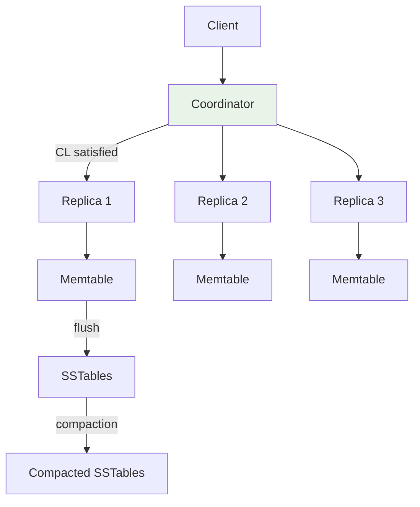
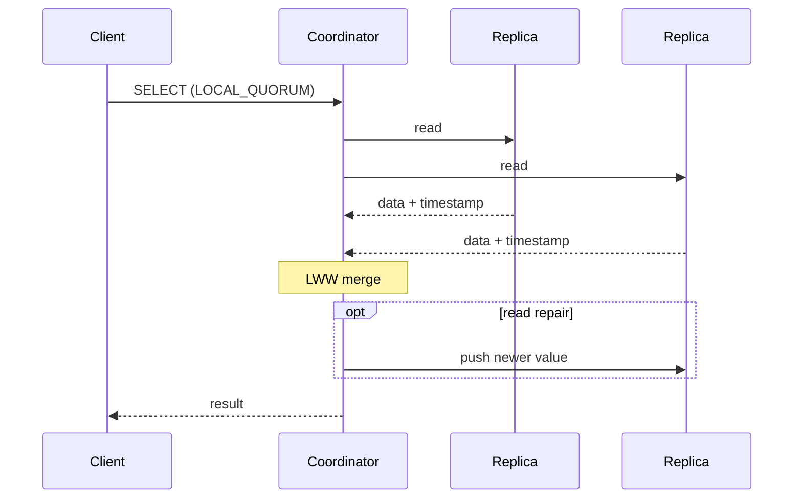
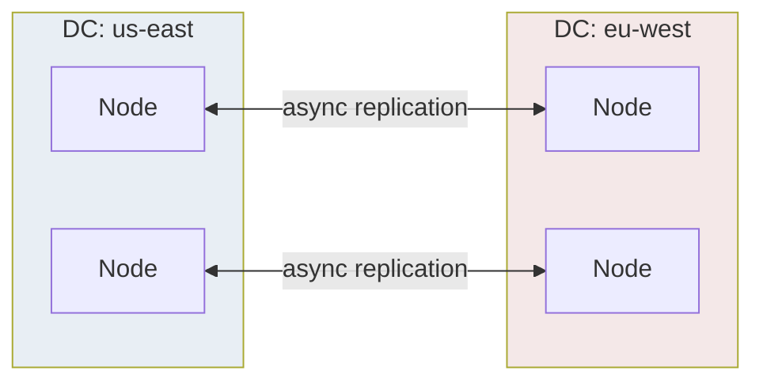

# Apache Cassandra

## 1. Executive Summary

**Apache Cassandra** is an open-source, distributed **wide-column** database implementing Dynamo-style **partitioned storage** with **tunable consistency**. Data is modeled in tables with a **partition key** (and optional **clustering columns**) mapped to nodes via a **partitioner** (Murmur3 by default) on a token ring. Replication is configured with **NetworkTopologyStrategy** across datacenters. Writes go to a **coordinator** that satisfies the requested **consistency level** (CL); reads merge versions using **last-write-wins (LWW)** timestamps unless lightweight transactions (LWT) invoke **Paxos**.

Storage uses **LSM-tree** semantics: memtable → **SSTables** → **compaction**. Cluster membership and failure detection use **gossip**; **hinted handoff** and **repair** maintain replica convergence. Cassandra excels at **high write throughput**, **multi-datacenter deployments**, and **linear scale-out** when data models respect partition boundaries.

This chapter covers Cassandra's architecture, consistency semantics, operational realities, failure modes, and a production case study—positioned for principal architect interviews and production design reviews.

At principal level, the decisive question is not "Cassandra vs DynamoDB" in the abstract but whether your organization can sustain **continuous repair, compaction tuning, and query-first schema governance**. Teams that excel treat each table as a microservice API with explicit consistency contracts; teams that struggle import relational habits and pay in tombstones, scans, and incident pages.

**Historical note:** Cassandra emerged from Facebook's inbox search needs (Lakshman & Malik, 2010) and Dynamo influence. Understanding that lineage explains why **availability and partition tolerance** are first-class and why **conflict resolution** defaults to timestamps rather than application merges like the original Dynamo paper.

ScyllaDB, DataStax Astra, and Amazon Keyspaces offer Cassandra-compatible APIs with different performance and operational profiles—principal comparisons should name **who runs repair/compaction** and **what consistency guarantees the managed layer exposes**.

Link to [Leaderless Replication](/docs/replication/leaderless-replication) for quorum math shared with Dynamo lineage and interview cross-links at principal interview depth.

## 2. Why This Topic Matters

Cassandra powers large-scale workloads at organizations that need self-managed or multi-cloud wide-column storage. Interview and architecture depth includes:

- **Consistency levels** (`ONE`, `QUORUM`, `LOCAL_QUORUM`, `EACH_QUORUM`).
- **R+W>N** applied per datacenter scope.
- **Compaction strategy** impact on read amplification and disk.
- **Lightweight transactions** vs default LWW.
- **Repair** (full, incremental) and **tombstone** pitfalls.

Incidents often involve: unbounded tombstones, `ALLOW FILTERING` in production, tiny partitions with giant clustering rows, Paxos hot keys, or `LOCAL_QUORUM` misunderstood across microservices.

## 3. Problems Being Solved

| Problem | Cassandra approach |
|---------|-------------------|
| **Multi-DC write availability** | `LOCAL_QUORUM` without cross-DC RTT every write |
| **Massive write ingest** | LSM append path; no B-tree page splits |
| **Linear scale-out** | Add nodes; tokens rebalance via vnodes |
| **Tunable consistency** | Per-query CL |
| **Time-series and wide rows** | Clustering column ordering |
| **Strong compare-and-set** | LWT (Paxos) optional |

### Workload fit matrix

| Workload | Fit | Caveat |
|----------|-----|--------|
| Time-series ingest | Strong | TWCS + TTL |
| User profiles | Strong | Denormalize |
| Global SQL reports | Weak | Export to Spark |
| Counter increments | Weak | Hot partition; external counter |
| Multi-row transactions | Weak | No cross-partition ACID |
| Geo-distributed sessions | Strong | LOCAL_QUORUM |

Cassandra is a **write-optimized, partition-local OLTP** engine—not a drop-in data warehouse despite CQL's SQL appearance.

### CQL vs SQL mental model

CQL resembles SQL syntactically but the **execution model** is partition-scoped. A `SELECT` without partition key restriction implies scanning all nodes—a distributed full table scan. `ALLOW FILTERING` pushes predicates after wide fetches. Principal architects coach teams to write queries **first**, then schema—inverse of relational normalization training. Secondary indexes are not free joins; they are hidden fan-out queries with latency tails that surprise teams migrating from PostgreSQL.

## 4. Assumptions and System Model

| Assumption | Implication |
|------------|-------------|
| **Query-driven data model** | Denormalize; one query → one partition read ideal |
| **Crash-stop replicas** | Hinted handoff + repair heal divergence |
| **Clocks for LWW** | NTP sync matters; microsecond timestamps |
| **Symmetric nodes** | Any node can coordinate |
| **CQL API** | SQL-like but not relational engine |

**Safety:** Quorum intersection for `QUORUM`/`LOCAL_QUORUM` when `RF` and CL configured correctly. **Liveness:** Lower CL and hints maintain progress during failures—explicit tradeoff.

## 5. Essential Terminology

| Term | Definition |
|------|------------|
| **Keyspace** | Namespace; replication strategy defined here |
| **Partition key** | Determines token and replica set |
| **Clustering columns** | Sort order within partition |
| **RF** | Replication factor |
| **CL** | Consistency level for read/write |
| **Coordinator** | Node receiving client request |
| **SSTable** | Immutable on-disk sorted file |
| **Memtable** | In-memory write buffer |
| **Compaction** | STCS, LCS, TWCS, UCS strategies |
| **Tombstone** | Delete marker; gc_grace_seconds |
| **Hinted handoff** | Store write for down replica |
| **Repair** | Sync divergent replicas |
| **LWT** | `IF NOT EXISTS` / `IF EXISTS` via Paxos |
| **Snitch** | Rack/DC topology awareness |

## 6. Core Mechanism

### 6.1 Write path



*Figure 1: Coordinator writes to RF replicas; each node appends to memtable then SSTables.*

### 6.2 Read path and repair



*Figure 2: Coordinator fetches CL replicas; merges by timestamp; may read-repair stale nodes.*

### 6.3 Multi-datacenter topology



*Figure 3: NetworkTopologyStrategy places replicas per DC; LOCAL_QUORUM scopes quorums locally.*

## 7. Step-by-Step Walkthrough

### Walkthrough A: LOCAL_QUORUM write/read (RF=3)

1. `INSERT` with `LOCAL_QUORUM` in `us-east`.
2. Coordinator writes to 2 of 3 local replicas.
3. `SELECT` with `LOCAL_QUORUM` reads 2 local replicas; LWW picks value.
4. R+W>RF locally: 2+2>3 → overlap within DC.

### Walkthrough B: Tombstone read failure

1. `DELETE` creates tombstone with `gc_grace_seconds=864000`.
2. Before compaction/repair, many tombstones in partition.
3. `SELECT` scans thousands of tombstones → `TombstoneOverwhelmingException`.
4. Fix: repair, lower grace carefully, redesign deletes.

### Walkthrough D: Incremental repair subrange

1. Cluster has 1 PB data; full repair impractical weekly.
2. Operator runs `nodetool repair -st <token> -et <token>` per nightly window.
3. Tracks completion in repair history table.
4. Prioritizes ranges with high `SSTable` overlap metrics.

### Walkthrough F: Lightweight transaction compare-and-set

1. Application reads current balance with `QUORUM`.
2. Issues `UPDATE accounts SET balance = 90 IF balance = 100` with LWT.
3. Paxos runs four round trips [approximate; measure in cluster].
4. Concurrent writer fails conditional; winner proceeds.
5. Architect documents **4× latency** budget vs normal write for this path.

## 8. Invariants and Guarantees

| Level | Guarantee |
|-------|-----------|
| `ONE` | Minimal ack; stale reads possible |
| `QUORUM` | Global quorum intersection if R+W>RF |
| `LOCAL_QUORUM` | Per-DC quorum; common multi-DC pattern |
| `ALL` | All replicas; fragile liveness |
| **LWT** | Linearizable compare-and-set for guarded rows |

**Eventual consistency:** Lower CL + async replication → convergence via repair.

## 9. Failure Scenarios

| Failure | Effect | Mitigation |
|---------|--------|------------|
| Node down during write | Hinted handoff | Monitor hints; replace node |
| CL ONE read after QUORUM write | Stale read | Match CL across services |
| Tombstone accumulation | Read failures | Repair; TWCS for TTL data |
| Compaction lag | Read amp, disk | Tune strategy; add capacity |
| Paxos on hot key | Latency | Avoid LWT on hot paths |
| Bootstrap without repair | Data loss perception | Run repair before decommission |
| **Streaming during bootstrap** | Competes with production traffic | Throttle streams; off-peak bootstrap |

### Compaction strategy selection guide

| Strategy | Best for | Risk |
|----------|----------|------|
| **STCS** | General mixed workload | Tombstone bloat |
| **LCS** | Read-heavy, steady write | Write amplification |
| **TWCS** | TTL time-series | Wrong if updates span windows |
| **UCS** | Unified (4.0+) | Tune unified window size |

### Scenario narratives

**Tombstone overwhelm on account deletion:** Compliance requires deleting user rows; team issues `DELETE` per column instead of TTL. Millions of tombstones accumulate in partition before `gc_grace_seconds` and compaction catch up. Reads time out. Fix: TWCS + TTL for GDPR erasure batches; throttle deletes; run repair before lowering grace.

**Cross-service CL mismatch:** Auth service writes session at `QUORUM`; edge API reads at `ONE` for speed. Users intermittently see logged-out state after login. Fix: shared client library enforcing `LOCAL_QUORUM` for session path; integration test suite across services.

## 10. Performance Characteristics

| Dimension | Behavior |
|-----------|----------|
| Write throughput | High; LSM append |
| Read latency | Depends on SSTable count, bloom filters |
| Multi-DC | `LOCAL_QUORUM` avoids WAN on every op |
| Hot partition | Single coordinator + all replicas stressed |
| LWT | ~4× latency vs normal write [rule of thumb; measure] |

## 11. Scalability Limits

- **Partition size:** Wide rows &gt; 100 MB problematic (best practice; not hard limit).
- **Secondary indexes:** Co-located; not for high-cardinality fan-out.
- **Materialized views:** Operational complexity; consistency caveats.
- **Gossip** at 1000+ nodes needs tuning.
- **Repair** bandwidth at PB scale requires incremental scheduling.

## 12. Operational Considerations

- **nodetool repair** on schedule; **subrange repair** for large clusters.
- Monitor **pending compactions**, **hinted handoff**, **streaming**, **sstable count**.
- **`gc_grace_seconds`** aligned with repair window—never lower without repair completion.
- **Upgrade** sstables format across major versions with rolling restarts.
- **Capacity plan** for backup (snapshots to object storage).
- **JMX/prometheus exporter** dashboards per datacenter: read/write latency p99, compaction pending tasks, repair progress percentage.
- **Gossip tuning** on large clusters: increase phi convict threshold carefully to avoid false positives.
- **Prepared statements** in drivers to reduce coordinator parsing overhead at high QPS.
- **Disk layout**: separate data and commitlog volumes on NVMe where possible.
- **Documentation**: runbook for `nodetool drain` before node replacement.

## 13. Security Considerations

- **Role-based access** (Cassandra 3.x+); inter-node **TLS**.
- **Audit logging** for compliance workloads.
- **CQL injection** at application layer—parameterized statements.
- **Network isolation** between DCs; limit JMX exposure.

## 14. Cost Considerations

- **RF × storage** across DCs.
- **Cross-DC bandwidth** for replication and repair.
- **Compaction** temporary disk overhead (~50% headroom recommended).
- **Operational headcount** vs managed alternatives (Keyspaces, Scylla Cloud).

## 15. Production Implementations

### Case study: Time-series metrics store (multi-DC)

#### Business context

Monitoring platform ingests device metrics globally; dashboards query recent data by device and time range. Needs high write availability and DC-local reads for UI responsiveness.

#### Scale

Illustrative: 500k writes/sec aggregate; 14-day TTL; average row 500 bytes; RF=3 per DC across 2 DCs.

#### Functional requirements

- Insert metric points: `(device_id, ts, value)`.
- Query last 24h for device.
- Automatic expiration after 14 days.

#### Non-functional requirements

- Write availability during single-node failure.
- p99 read < 50 ms for recent window in local DC.
- Tolerate DC network partition without global write halt.

#### Architecture overview

Keyspace `NetworkTopologyStrategy`: `{'us-east':3, 'eu-west':3}`. Table partitioned by `(device_id)`; clustering `ts DESC`. TWCS compaction aligned to daily buckets. Writes `LOCAL_QUORUM` in local DC.

#### Data model

```sql
CREATE TABLE metrics (
  device_id uuid,
  ts timestamp,
  value double,
  PRIMARY KEY (device_id, ts)
) WITH CLUSTERING ORDER BY (ts DESC)
  AND default_time_to_live = 1209600
  AND compaction = {'class': 'TimeWindowCompactionStrategy', ...};
```

#### Partitioning

One partition per `device_id`; if device exceeds partition size limits, shard `device_id` with suffix bucket.

#### Replication

RF=3 per DC; replicas independent; async cross-DC replication for DR reads optional.

#### Consistency

`LOCAL_QUORUM` writes/reads in serving DC; `ONE` acceptable for best-effort analytics with lag disclosure.

#### Availability

Survives 1 node loss per DC at RF=3 with QUORUM paths; hints during brief outages.

#### Failure handling

TWCS drops old windows; repair weekly; alert on tombstone warnings; avoid deletes—use TTL.

#### Security

mTLS internode; RBAC per service account; encrypt data at rest on disk.

#### Observability

Prometheus metrics via cassandra_exporter; track compaction pending, repair progress, CL latencies.

#### Cost model

Raw storage × RF × 2 DCs; compaction IO; repair bandwidth ~5–15% [estimate—validate].

#### Evolution

Started STCS → tombstone pain → migrated to TWCS with TTL. Added **Scylla** evaluation for shard-per-core if CPU bound [product choice].

#### Tradeoffs

| Decision | Rationale |
|----------|-----------|
| TWCS | Time-series TTL workload |
| LOCAL_QUORUM | DC-local latency |
| No LWT | Ingest path is append-only |
| Denormalized | No joins at read time |

#### Known limitations

Cross-partition queries expensive; secondary index not used for device lookup; historical analytics need Spark/Cassandra connector batch jobs.

#### Interview lessons

Match **CL** to use case; explain **compaction** choice; tombstones are first-class failure mode.

#### Redesign exercise (case study)

**Prompt:** Analytics runs full-table scan on metrics for ad-hoc SQL.

**Strong direction:** Export to data lake; never unbounded scans on ingest path.

Cassandra rewards teams that treat **schema and CL as API contracts**: version them, test cross-service CL at boundaries, and run game days killing seed nodes during peak `LOCAL_QUORUM` traffic.

## 16. Alternatives and Tradeoffs

| System | Contrast |
|--------|----------|
| **DynamoDB** | Managed; less tuning visibility |
| **ScyllaDB** | Cassandra-compatible; shard-per-core |
| **HBase** | Stronger Hadoop integration; different ops |
| **TimescaleDB** | SQL time-series; vertical scale limits |

## 17. Common Misconceptions

| Misconception | Reality |
|---------------|---------|
| "CQL = SQL" | Query patterns must match partition key |
| "QUORUM = linearizable" | LWW + clocks; use LWT if needed |
| "Repair optional" | Divergence accumulates |
| "DELETE is cheap" | Tombstones are expensive |
| "Secondary index scales like RDBMS" | Fan-out to all nodes |

## 18. Principal Architect Perspective

1. **Data model workshop** before cluster sizing.
2. **CL contract** across microservices in shared API spec.
3. **Compaction strategy** is not set-and-forget.
4. **Repair SLO** as important as backup SLO.
5. **Evaluate Scylla/Managed** when ops burden exceeds team capacity.
6. **Treat repair completion** as a quarterly SLO with executive visibility.
7. **Run tombstone drills** before major delete migrations.

Wide-column systems fail organizationally when **DBA practices** (repair, compaction tuning) are absent but **OLTP expectations** (fresh reads) remain—staff accordingly or choose managed offerings.

**Organizational readiness checklist:** (1) Named owner for repair completion metrics. (2) Schema review board rejecting queries without partition key. (3) Load tests that include node replacement during peak traffic. (4) Tombstone budget per migration ticket. (5) Runbook for `nodetool assassinate` vs graceful drain—document when each is allowed. Teams without these five items routinely rediscover Cassandra footguns within the first production quarter.

## 19. Architecture Review Exercise

**Scenario:** User feed table; partition key `user_id`; clustering `post_id`; `ALLOW FILTERING` on `post_type` in API.

**Findings:** Full partition scans; create table per query pattern or materialized view with eyes open to ops cost.

## 20. Whiteboard Explanation

"Cassandra partitions data by token from the partition key. Each keyspace defines replication across racks and datacenters. Clients send CQL to any node; the coordinator routes to replicas and waits for enough acks per consistency level. Writes append to memtables and flush to SSTables; compaction merges files. Reads fetch CL replicas and pick the highest timestamp—last-write-wins. Hinted handoff and repair keep replicas converging. LOCAL_QUORUM is the multi-DC sweet spot: quorum within the local datacenter without cross-WAN on every operation. Design queries around one partition per request; tombstones and hot partitions are the classic footguns."

**Extended 3-minute version for principal panels:** Add explicit R+W>RF example with RF=3 and LOCAL_QUORUM=2. Contrast LWT Paxos path for inventory adjustment vs append-only ingest. Name TWCS for TTL metrics. Close with repair SLO: "If we skip repair for a month, QUORUM reads on cold keys are a coin flip—I've seen that fail compliance audits."

## 21. Interview Questions

1. **Partition vs clustering key?** — Token vs sort within partition.
2. **LOCAL_QUORUM vs QUORUM?** — DC-scoped vs global quorum.
3. **Write path stages?** — Coordinator → memtable → SSTable → compaction.
4. **Hinted handoff?** — Buffer for down replica.
5. **Tombstone problem?** — Slow reads; repair/compaction.
6. **LWT mechanism?** — Paxos rounds.
7. **TWCS use case?** — TTL time-series.
8. **R+W>RF with RF=3?** — Need at least 2+2.
9. **Why denormalize?** — No efficient join.
10. **Read repair?** — Coordinator updates stale replica on read.
11. **TWCS vs STCS?** — Time-window vs size-tiered compaction.
12. **Seed node role?** — Gossip bootstrap; not data authority.
13. **Token allocation on add node?** — Vnodes rebalance ranges.
14. **When Keyspaces?** — Managed Cassandra on AWS.

### Scoring rubric (principal)

| Dimension | Strong | Weak |
|-----------|--------|------|
| Data model | One partition per query | ALLOW FILTERING |
| CL | LOCAL_QUORUM + R+W math | ONE everywhere |
| Ops | Repair + tombstone awareness | "RF=3 fixes all" |
| Storage | Compaction strategy justified | Ignores LSM |

## 22. Interview Follow-Ups

1. **Size cluster for 1 TB/day ingest.** — Disk, compaction, RF, headroom.
2. **Migrate CL from ONE to LOCAL_QUORUM.** — Latency impact; service rollout.
3. **Handle hot partition.** — Key splitting; async aggregation.
4. **When materialized view?** — Alternate query; understand rebuild cost.
5. **Compare Scylla.** — Compatibility; architecture differences.

## 23. Strong Answer Example

**Question:** "Configure Cassandra for cross-DC session storage."

**Strong outline:** "RF=3 in each of two DCs with NetworkTopologyStrategy. Sessions keyed by `session_id` uuid—high cardinality partition key. Writes and reads use LOCAL_QUORUM in the client's DC for 2+2>3 overlap locally without WAN RTT each time. TTL on session rows. Token-aware drivers pin to local DC. For rotation of security tokens use LWT sparingly or a small etcd cluster—don't Paxos a hot key. Monitor hinted handoff and run incremental repair weekly. NTP disciplined for LWW. Document that QUORUM globally is different from LOCAL_QUORUM—services must not mix CL on the same workflow."

## 24. Weak Answer Example

**Weak:** "Use Cassandra with replication 3; it's eventually consistent so ONE is fine everywhere."

**Red flags:** Ignores session security; no LOCAL_QUORUM; no repair/tombstone mention.

## 25. Hands-On Exercise

1. Deploy 3-node cluster (Docker/K8s operator).
2. Create keyspace RF=3; insert with `QUORUM`; read with `ONE`—observe staleness.
3. Delete many rows; trigger tombstone warning; run repair.
4. Run `nodetool repair` and compare read latency before/after.
5. Benchmark TWCS vs STCS on TTL workload with `nodetool tablestats`.
6. Simulate node failure during write; observe hinted handoff metrics.
7. Execute LWT on low-traffic key; compare latency to normal write.

**Success criteria:** Document CL mismatch stale read; tombstone remediation steps; compaction choice justification.

## 26. Knowledge Check

1. Default partitioner? *(Murmur3 in modern versions.)*
2. LWT implementation? *(Paxos.)*
3. `gc_grace_seconds` purpose? *(Tombstone retention for repair.)*
4. Snitch role? *(DC/rack awareness.)*
5. Ideal query pattern? *(Single partition.)*
6. What triggers hinted handoff? *(Replica in preference list down.)*
7. STCS compaction risk? *(Tombstone and size-tiered bloat.)*
8. Difference LOCAL_QUORUM vs EACH_QUORUM? *(Local DC vs quorum in every DC.)*
9. Why NTP matters for LWW? *(Timestamp tie-breaking.)*
10. Bootstrap new node risk? *(Streaming load; incomplete data until repair.)*

## 27. Flashcards

| Front | Back |
|-------|------|
| Partition key | Determines token/replica set |
| Clustering columns | Sort within partition |
| LOCAL_QUORUM | Quorum in coordinator's DC |
| SSTable | Immutable on-disk LSM file |
| TWCS | Time-window compaction for TTL |
| Tombstone | Delete marker |
| Hinted handoff | Write buffer for down node |
| LWT | Paxos conditional write |
| Read repair | Fix stale replica on read |
| NetworkTopologyStrategy | Per-DC RF |

## 28. Cheat Sheet

```
MODEL
  PRIMARY KEY (partition_key, clustering...)
  One query → one partition (ideal)

CL (common)
  ONE - fast, stale
  LOCAL_QUORUM - multi-DC workhorse
  QUORUM - global
  LWT - Paxos CAS

OPS
  repair (full/subrange)
  compaction (STCS/LCS/TWCS)
  hints + tombstone monitoring

FOOTGUNS
  ALLOW FILTERING in prod
  hot partitions
  tombstone-heavy deletes
  mixed CL across services
```

## 29. Related Concepts

- [Amazon Dynamo](/docs/distributed-databases/amazon-dynamo) — design lineage
- [Leaderless Replication](/docs/replication/leaderless-replication) — quorum model
- [LSM Trees](/docs/storage-engines/lsm-trees) — storage engine
- [Quorum Systems](/docs/consistency/quorum-systems) — overlap math
- [Conflict Resolution](/docs/replication/conflict-resolution) — LWW limits

## 30. References

### Primary sources

- Apache Cassandra Documentation. *Architecture.* — partitioning, replication, consistency.
- Lakshman, A., & Malik, P. (2010). *Cassandra: A Decentralized Structured Storage System.* Facebook engineering blog / paper lineage.

### Lineage

- DeCandia et al. (2007). *Dynamo.*

### Distinction

| Claim type | Source |
|------------|--------|
| CL semantics | Apache Cassandra docs (version-specific) |
| LWT = Paxos | Cassandra documentation |
| Production scale anecdotes | Company engineering blogs—verify currency |
