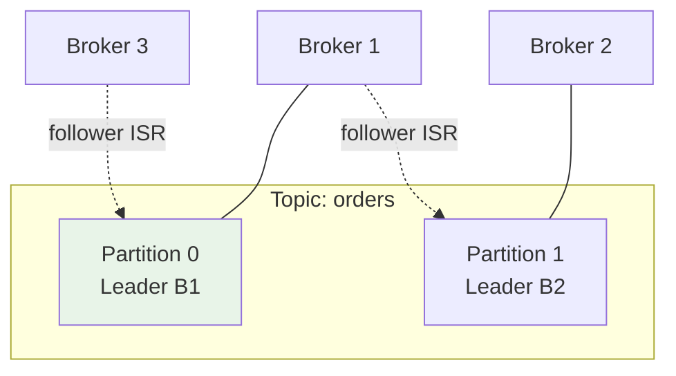
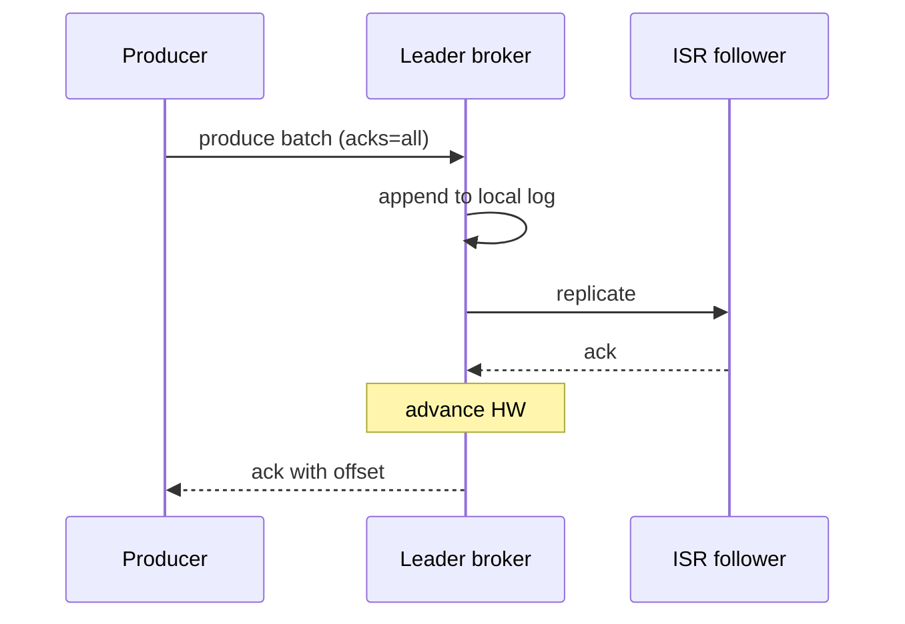
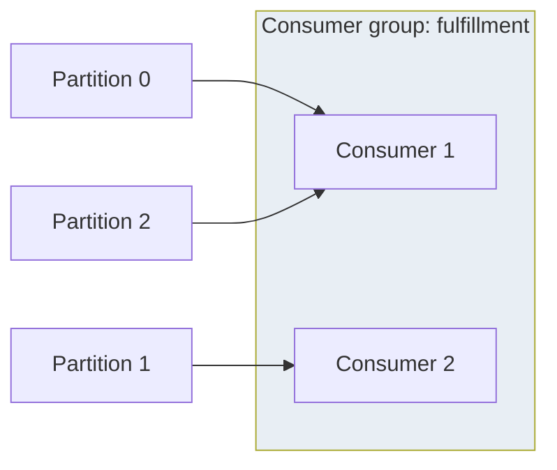

# Apache Kafka as a Distributed Log

## 1. Executive Summary

**Apache Kafka** is a distributed **commit log** optimized for high-throughput, durable **event streaming**. Producers append **records** to **partitions**—ordered, immutable sequences identified by monotonically increasing **offsets**. Partitions are replicated across brokers using **leader-follower replication** with an **In-Sync Replica (ISR)** set; only ISR members may be promoted on leader failure. Consumers track **offsets** per partition, enabling replay, fan-out consumer groups, and **stream processing** (Kafka Streams, ksqlDB, Flink).

While Kafka is categorized under messaging, it functions as a **distributed database primitive**: an append-only, partitioned, replicated log with retention policies. **Log compaction** retains the latest record per key, supporting **changelog** semantics. **Exactly-once semantics (EOS)** combine idempotent producers, transactions, and consumer isolation levels—at coordination cost.

This chapter treats Kafka as a distributed data system: mechanisms, guarantees, failure modes, and a production case study for principal architects designing event-driven platforms.

Kafka's longevity comes from being a **simple primitive done well**: an append-only replicated log. Principals resist feature creep—using Kafka as RPC, cron, or database—unless consumers truly need replayable shared history. When they do, partition keys and consumer idempotency become as important as schema design in PostgreSQL.

**Ecosystem context:** Kafka Connect integrates OLTP databases via CDC; Kafka Streams provides stateful processing with changelog topics; **tiered storage** (vendor features) offloads cold segments to object storage. Architects should map which components they operate vs vendor-manage in MSK/Confluent offerings.

The **log-based integration** pattern—publish domain events after commit, consume asynchronously—pairs naturally with Kafka but requires **outbox** or **transactional** discipline when the producer is a relational database. See [Transactional Outbox](/docs/transactions/transactional-outbox) for the complementary database-side pattern.

Interviewers often ask how Kafka differs from **message queues**: queues delete messages on ack and optimize for task distribution; logs retain history for replay and multiple independent consumer groups—fundamentally different data lifecycle semantics.

Link to [Ordering of Events](/docs/time-ordering-and-coordination/ordering-of-events) for partition ordering theory and causal ordering comparisons required in senior distributed system design interviews at principal level.

## 2. Why This Topic Matters

Kafka is the backbone of modern data planes—LinkedIn, Uber, Netflix, and thousands of enterprises use it for decoupling, CDC, metrics, and ML feature pipelines. Interviews probe:

- **Partition ordering** vs **global ordering**.
- **ISR**, **unclean leader election**, and **durability**.
- **Consumer groups** and **rebalance** pain.
- **At-least-once**, **at-most-once**, **exactly-once** realities.
- **Log compaction** vs **retention by time/size**.
- When Kafka is **wrong** (task queues, RPC, low-latency request/response).

Incidents trace to: `acks=1` data loss, consumer lag storms, rebalance during deploy, compacted topic misuse, and treating Kafka as infinite storage without retention governance.

## 3. Problems Being Solved

| Problem | Kafka approach |
|---------|----------------|
| **Decouple producers/consumers** | Durable buffer log |
| **Replay and audit** | Retained ordered history |
| **Scale ingest** | Partition parallelism |
| **Fault-tolerant streaming** | Replication + ISR |
| **Changelog state** | Compacted topics |
| **Multiple subscribers** | Consumer groups independent offsets |

### Workload fit matrix

| Workload | Fit | Caveat |
|----------|-----|--------|
| Event sourcing | Strong | Compaction + retention policy |
| Log aggregation | Strong | Partition by source |
| Task queue | Weak | No per-message delete ack model |
| RPC | Weak | High latency vs HTTP/gRPC |
| Request/reply | Weak | Wrong abstraction |
| CDC pipeline | Strong | Ordering per table key |

Kafka is a **durable ordered log**—excellent when multiple consumers need the same history at different speeds; poor when each message must be individually acknowledged and removed like a traditional queue.

### Log compaction mental model

Beyond time/size retention, **compaction** treats the topic as a **key-value changelog**: for each key, only the latest record survives (plus tombstones with `null` value). This enables **Kafka Streams** state store restoration and **Kafka Connect** offset/config topics. Architects must size compaction lag: a slow compaction thread means consumers reading compacted topics may temporarily see superseded keys until cleaner completes.

## 4. Assumptions and System Model

| Assumption | Implication |
|------------|-------------|
| **Records immutable after write** | Updates = new records; compaction for keyed latest |
| **Order per partition only** | Cross-partition ordering requires design |
| **Broker crash-stop** | ISR maintains durability envelope |
| **ZooKeeper or KRaft** | Cluster metadata consensus (KRaft modern) |
| **Consumers pull** | Backpressure via fetch lag |

**Safety:** No lost committed records if `acks=all` and `min.insync.replicas` honored. **Liveness:** Producers may block if ISR shrinks below min ISR.

## 5. Essential Terminology

| Term | Definition |
|------|------------|
| **Topic** | Named log divided into partitions |
| **Partition** | Ordered sequence with leader broker |
| **Offset** | Monotonic position in partition |
| **ISR** | Replicas caught up with leader |
| **HW / LEO** | High watermark / log end offset |
| **Consumer group** | Cooperative consumers sharing partition assignment |
| **Rebalance** | Partition reassignment among consumers |
| **Retention** | Time/size limits; or compaction |
| **Compaction** | Keep latest key per record key |
| **acks** | Producer durability (`0`, `1`, `all`) |
| **Idempotent producer** | PID + sequence dedup per partition |
| **Transaction** | Atomic write across partitions (EOS) |

## 6. Core Mechanism

### 6.1 Partition leadership and ISR



*Figure 1: Each partition has one leader; ISR followers replicate asynchronously with lag bounds.*

### 6.2 Producer write path



*Figure 2: Leader waits for ISR replication when acks=all; high watermark advances after commit.*

### 6.3 Consumer group



*Figure 3: Each partition consumed by at most one consumer in a group; scale consumers ≤ partitions.*

## 7. Step-by-Step Walkthrough

### Walkthrough A: Order guarantee per customer

1. Key = `customer_id`; hash to partition.
2. All events for customer land in same partition—total order per customer.
3. Consumer processes in offset order.

### Walkthrough B: Leader failure with acks=all, min.insync.replicas=2

1. Leader broker dies.
2. Controller elects new leader from ISR.
3. Producers retry; consumers may see brief unavailability.
4. No committed message lost if previous leader had replicated to ISR before ack.

### Walkthrough D: Tiered storage (enterprise feature)

1. Older SSTables tier to object storage [vendor/feature-dependent].
2. Hot data remains local SSD; cold range queries slower.
3. Architect validates SLA impact before enabling.

### Walkthrough F: Consumer static membership deploy

1. Consumers configured with `group.instance.id` static membership.
2. Rolling deploy restarts one consumer at a time.
3. Cooperative sticky assignor avoids mass partition revoke.
4. Iterator lag stays flat; no duplicate charge window.
5. Contrast with eager rebalance lab in exercise section.

## 8. Invariants and Guarantees

| Configuration | Guarantee |
|---------------|-----------|
| `acks=0` | Fire-and-forget; may lose |
| `acks=1` | Leader ack; loss if leader fails before replicate |
| `acks=all` + min ISR | Durability if ISR rules met |
| Single partition | Total order of records |
| Idempotent producer | No duplicate sequence per PID/partition |
| Transactions + read_committed | EOS within transactional boundary |

**Consumer offset commit** separate from processing—at-least-once unless EOS pipeline.

## 9. Failure Scenarios

| Failure | Effect | Mitigation |
|---------|--------|------------|
| Unclean leader election | Potential loss | Disable; monitor ISR |
| ISR shrink below min ISR | Produce fails | Broker recovery; relax min ISR consciously |
| Consumer lag | Stale downstream | Scale consumers/partitions |
| Rebalance storm | Duplicate processing window | Cooperative sticky assignor; static membership |
| Disk full | Broker halt | Retention; tiered storage |
| Large messages | Reject/broker stress | Chunk; external blob store |
| **Transactional producer timeout** | Open transaction abort | Tune `transaction.timeout.ms` |

### Delivery semantics matrix

| Producer | Consumer commit | Effect |
|----------|-----------------|--------|
| acks=1 | after process | At-least-once; may lose on broker fail |
| acks=all | before process | At-most-once risk |
| acks=all | after process + idempotent | Practical at-least-once |
| txn + idempotent | read_committed after process | EOS within scope |

### Scenario narratives

**Unclean leader election data loss:** Broker B3 falls out of ISR but retains divergent log tail. Unclean election enabled; B3 becomes leader and truncates committed messages acknowledged under prior leader. Audit trail gaps appear. Fix: `unclean.leader.election.enable=false`; alert on out-of-ISR leaders.

**Cooperative rebalance duplicate processing:** Deploy rolls all consumers simultaneously; eager rebalance revokes all partitions. Two consumer generations process overlapping offset range for 30 seconds. Payment processor double-charges. Fix: `cooperative-sticky` assignor, static membership, idempotent `paymentId` keys, canary deploys.

## 10. Performance Characteristics

| Dimension | Behavior |
|-----------|----------|
| Throughput | Batch + compression; partition parallel |
| Latency | ms–s depending on linger.ms, fsync |
| Durability vs speed | acks and replication tradeoff |
| Fan-out | Multiple consumer groups read independently |
| Compaction | Background I/O; disk reclaim delay |

## 11. Scalability Limits

- **Partition count** — metadata overhead; avoid 100k partitions per cluster without ops review.
- **Consumer ≤ partitions** for parallelism.
- **Cross-datacenter** — MirrorMaker latency; not synchronous global log by default.
- **Key skew** — hot partitions.
- **Broker disk** — retention governance required.

## 12. Operational Considerations

- Monitor **under-replicated partitions**, **ISR**, **consumer lag**, **disk usage**, **request rate per topic**.
- **Rolling broker restarts** with controlled leadership movement (`cruise control` or manual).
- **ACLs** and **SASL** for multi-tenant clusters; separate principals per service.
- **Topic naming** and **schema registry** (Avro/Protobuf) governance with compatibility rules.
- **KRaft migration** planning from ZooKeeper [version-specific].
- **Broker configs**: `log.retention.hours`, `compression.type`, `min.insync.replicas` in infrastructure-as-code.
- **Quota plugins** per client ID to prevent noisy neighbor producers.
- **MirrorMaker 2** monitoring for lag between source and target clusters.
- **Runbook**: broker disk full—expand volume vs reduce retention emergency.
- **Testing**: chaos kill leader broker during `acks=all` producer load monthly.

## 13. Security Considerations

- mTLS between clients and brokers.
- **ACLs** per topic/principal.
- **Encryption at rest** on broker disks.
- **PII** in topics—classification and retention limits.
- **Connect** plugins vetted—RCE risk surface.

## 14. Cost Considerations

- **Broker storage** × replication factor × retention.
- **Cross-AZ traffic** for replication.
- **Managed Kafka** (MSK, Confluent Cloud) ops premium.
- **Over-partitioning** increases coordination overhead without throughput gain.

## 15. Production Implementations

### Case study: Order events backbone (e-commerce)

#### Business context

Online retailer decouples order placement from fulfillment, analytics, and fraud scoring. Needs durable audit trail and replay for new consumers.

#### Scale

Illustrative: 20k orders/sec peak; average event 2 KB; 7-day retention; RF=3.

#### Functional requirements

- Publish `OrderCreated`, `PaymentCaptured`, `Shipped` events.
- Multiple services consume independently.
- Replay last 24h for new fraud model deployment.

#### Non-functional requirements

- No lost committed events (financial audit).
- p99 publish latency < 50 ms in-region.
- Ordering per `order_id`.

#### Architecture overview

Topic `orders` with 48 partitions; key=`order_id`; producers `acks=all`, `min.insync.replicas=2`; Schema Registry with Avro; consumers in dedicated groups per service.

#### Data model

Avro schema `OrderEvent { orderId, type, timestamp, payload, version }`; keys as strings.

#### Partitioning

Hash `order_id` → partition; 48 partitions sized for peak consumer parallelism.

#### Replication

RF=3 across AZs; ISR monitored; unclean election disabled.

#### Consistency

Per-partition order; no global order across orders; downstream idempotent consumers.

#### Availability

Tolerate single broker loss; multi-AZ; MirrorMaker to DR region async.

#### Failure handling

Producer retries with idempotence; consumer commit after processing; DLQ topic for poison messages after N failures.

#### Security

SASL SCRAM; ACL per service principal; encrypt payloads with sensitive fields tokenized.

#### Observability

Burrow/Confluent lag monitoring; broker JMX; distributed tracing on producer interceptors.

#### Cost model

3× storage for RF; 7-day retention ≈ calculated TB—tier older to object storage if enabled.

#### Evolution

Phase 1: single cluster. Phase 2: schema evolution with compatibility BACKWARD. Phase 3: compacted `order-snapshots` for latest state.

#### Tradeoffs

| Choice | Tradeoff |
|--------|----------|
| 48 partitions | Headroom vs metadata cost |
| acks=all | Latency vs durability |
| Avro | Schema governance vs JSON flexibility |
| Async DR mirror | RPO &gt; 0 for DR region |

#### Known limitations

Not a task queue with ack-per-message to broker; not SQL query engine; cross-region not sync by default.

#### Interview lessons

State **ordering scope**; **ISR/acks** durability story; **consumer idempotency** for at-least-once.

#### Redesign exercise (case study)

**Prompt:** Fraud needs global total order of all orders.

**Strong direction:** Per-`order_id` order only; external sequencer or single-partition bottleneck topic.

Event-driven platforms should define a **data contract registry**: schema compatibility, partition keys, retention—signed by producer and consumer owners.

## 16. Alternatives and Tradeoffs

| System | When |
|--------|------|
| **RabbitMQ / SQS** | Task queues; per-message delete |
| **Pulsar** | Tiered storage; multi-tenancy features |
| **Redpanda** | Kafka API; thread-per-core |
| **Kinesis** | AWS-native; shard model |
| **DB CDC** | Source of truth in OLTP |

## 17. Common Misconceptions

| Misconception | Reality |
|---------------|---------|
| "Kafka guarantees global order" | Per partition only |
| "More consumers always faster" | Bounded by partitions |
| "EOS is free" | Transactions add latency |
| "Infinite retention" | Disk and cost limits |
| "Kafka is a database" | Log primitive; query via streams |

## 18. Principal Architect Perspective

1. **Topic design = data model**—partition key is architecture.
2. **Retention policy** is a compliance decision.
3. **Consumer contracts** specify idempotency and ordering needs.
4. **Rebalance strategy** in deployment runbooks.
5. **Don't use Kafka as RPC**—latency and coupling wrong shape.
6. **Schema compatibility** enforced in CI for every producer change.
7. **Partition count** sized for 2× peak consumer parallelism headroom.

Organizations that skip **consumer contract tests** (golden message fixtures per topic) discover breaking schema changes in production during blue/green deploys—treat topic schemas like API versioning.

**Platform engineering checklist:** (1) Topic catalog with owner service and retention class. (2) `min.insync.replicas` enforced via IaC policy. (3) Unclean leader election disabled by default. (4) Consumer lag SLO per critical downstream. (5) Chaos test: broker loss during `acks=all` monthly. (6) Schema compatibility gate in CI for Avro/Protobuf. Kafka clusters without catalog and schema gates become "shared dumping grounds" that resist migration for years.

**Principal bar:** Candidates should whiteboard a topic with partition key, RF, min ISR, consumer group, and idempotent handler in under five minutes without omitting durability, ISR shrink, or unclean election risks.

## 19. Architecture Review Exercise

**Scenario:** 3-partition topic; 10 consumers in one group; payment service sees duplicates after deploy.

**Findings:** Only 3 active consumers; rebalance duplicates; need idempotency keys + sticky assignor + more partitions.

## 20. Whiteboard Explanation

"Kafka topics split into partitions—each an ordered append-only log on a leader broker with ISR followers replicating. Producers append with a key to pick partition; consumers in a group each own a subset of partitions and track offsets. acks=all waits for ISR replication before acknowledging durability. Ordering is per partition, not global. Log compaction keeps the latest record per key for changelog use cases. Exactly-once needs idempotent producers and transactions plus careful consumer isolation—but many systems run at-least-once with idempotent handlers."

**Extended principal addendum:** Sketch HW advancement after ISR ack. Explain why increasing partitions without increasing consumers yields no throughput gain. Note **broker rack awareness** (`replica.selector.class`) for AZ fault tolerance. Contrast with **SQS** visibility timeout model for queue use cases—Kafka consumers own offset cursor, not broker-side delete.

## 21. Interview Questions

1. **Partition purpose?** — Parallelism + partial order.
2. **ISR role?** — Eligible replicas for leader election.
3. **acks=all meaning?** — All ISR ack before producer success.
4. **Consumer group rule?** — One consumer per partition per group.
5. **Rebalance trigger?** — Member join/leave; subscription change.
6. **Compaction vs retention?** — Key retention vs time/size delete.
7. **Hot partition fix?** — Better key; more partitions (limited).
8. **At-least-once pattern?** — Process then commit offset; idempotent.
9. **KRaft vs ZooKeeper?** — Metadata quorum in Kafka itself.
10. **When not Kafka?** — Low-latency RPC, work queue with per-msg ack.
11. **HW vs LEO?** — Committed vs end of log offset.
12. **Static membership benefit?** — Fewer rebalances on deploy.
13. **Schema registry role?** — Evolvable Avro/Protobuf contracts.
14. **MirrorMaker RPO?** — Async cross-region replication lag.

### Scoring rubric (principal)

| Dimension | Strong | Weak |
|-----------|--------|------|
| Durability | acks=all + min ISR + unclean=false | "RF=3 so safe" |
| Ordering | Per-partition scope | Global order claim |
| Consumers | Idempotent + offset strategy | Commit-before-process |
| Ops | Lag, ISR, URP monitoring | No retention plan |

## 22. Interview Follow-Ups

1. **Size partitions for 50k msg/sec.** — Throughput per partition estimate.
2. **Design key for global sort.** — Single partition bottleneck or accept partial order.
3. **Unclean election tradeoff.** — Availability vs data loss.
4. **EOS pipeline sketch.** — Idempotent producer + txn + read_committed consumer.
5. **Migrate topic partition count.** — Key-aware reassignment complexity.

## 23. Strong Answer Example

**Question:** "How do you prevent message loss in Kafka?"

**Strong outline:** "On the producer: set acks=all so the leader waits for all in-sync replicas before acknowledging; ensure min.insync.replicas is at least 2 with replication factor 3 so a single broker loss cannot ack alone. On the broker: disable unclean leader election to prevent a non-ISR replica from becoming leader and truncating the log. On the consumer: commit offsets only after side effects are durable, accepting at-least-once and implementing idempotent handlers with business keys. Monitor under-replicated partitions and ISR shrink. For financial topics we also use idempotent producers to avoid duplicate sequence gaps during retries."

## 24. Weak Answer Example

**Weak:** "Kafka replicates three times so you never lose messages."

**Red flags:** Ignores acks; ISR; unclean election; consumer offset commit order.

## 25. Hands-On Exercise

1. Local Kafka (Docker); create topic RF=3 if cluster allows.
2. Produce with acks=1 vs all; kill leader; observe loss with acks=1.
3. Run two consumers in one group; add third—observe rebalance lag.
4. Enable compaction topic; produce keyed updates; verify log size behavior.
5. Measure consumer lag under slow handler; tune `max.poll.interval.ms`.
6. Configure idempotent producer; retry during broker bounce; verify no duplicates in compacted topic.
7. Document ISR and URP during failure injection.

**Success criteria:** Written durability matrix for acks settings; idempotent consumer design sketch.

## 26. Knowledge Check

1. Ordering scope? *(Per partition.)*
2. ISR definition? *(In-sync replicas.)*
3. min.insync.replicas purpose? *(Minimum replicas for acks=all.)*
4. Compaction keeps? *(Latest per key.)*
5. Consumer parallelism limit? *(Partition count.)*
6. What disables unclean election risk? *(unclean.leader.election.enable=false.)*
7. Idempotent producer prevents? *(Duplicate sequence on retry.)*
8. read_committed isolation? *(Consumer sees only committed txn messages.)*
9. Cooperative sticky assignor benefit? *(Incremental rebalance.)*
10. MirrorMaker use case? *(Cross-cluster replication.)*

## 27. Flashcards

| Front | Back |
|-------|------|
| Partition | Ordered log shard |
| Offset | Position in partition log |
| ISR | Replicas caught up with leader |
| acks=all | Wait for ISR replication |
| Consumer group | Shared consumption scaling |
| Rebalance | Partition reassignment |
| Compaction | Retain latest key record |
| HW | High watermark committed offset |
| Idempotent producer | PID sequence dedup |
| EOS | Transactions + idempotence + isolation |

## 28. Cheat Sheet

```
PRODUCE
  key → partition hash
  acks: 0 | 1 | all
  idempotence: enable for retries

CONSUME
  group.id → cooperative consumption
  commit offset after process (at-least-once)
  partitions ≥ consumers for parallelism

DURABILITY
  RF=3, min.insync.replicas=2, acks=all
  unclean.leader.election.enable=false

ORDER
  per partition only
  key by entity id

OPS
  lag, ISR, URP alerts
  retention + compaction policies
  schema registry + compatibility CI
  principal review: catalog every topic owner and retention class
```

## 29. Related Concepts

- [Ordering of Events](/docs/time-ordering-and-coordination/ordering-of-events) — partition ordering
- [Primary-Secondary Replication](/docs/replication/primary-secondary-replication) — leader-follower model
- [Idempotency](/docs/distributed-systems-foundations/idempotency) — consumer design
- [Transactional Outbox](/docs/transactions/transactional-outbox) — DB-to-Kafka patterns
- [Messaging Overview](/docs/messaging-and-streaming/overview) — broader domain

## 30. References

### Primary sources

- Kreps, J., Narkhede, G., & Rao, J. (2011). *Kafka: A Distributed Messaging System for Log Processing.* LinkedIn engineering / NetDB workshop.
- Apache Kafka Documentation. *Design.* — partitions, replication, ISR.
- Apache Kafka Documentation. *Exactly-once semantics.*

### Books

- Kleppmann, M. *DDIA* — log-based messaging chapter.
- Narkhede, G., Palino, T., & Sivaram, R. *Kafka: The Definitive Guide.* O'Reilly.

### Distinction

| Claim type | Source |
|------------|--------|
| ISR, HW mechanics | Kafka documentation |
| EOS requirements | Kafka docs (version-specific) |
| LinkedIn production scale | Engineering blogs—verify currency |
