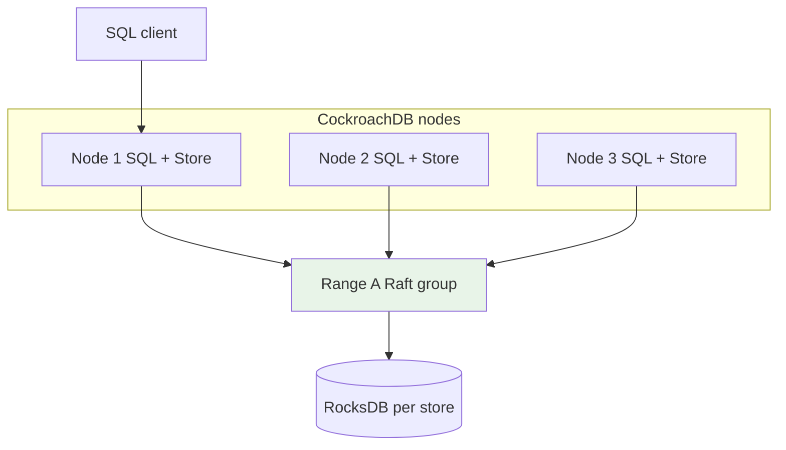
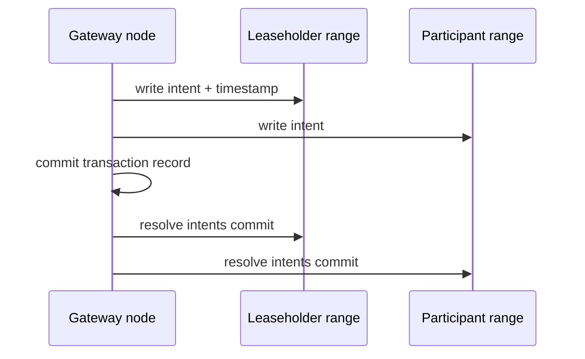
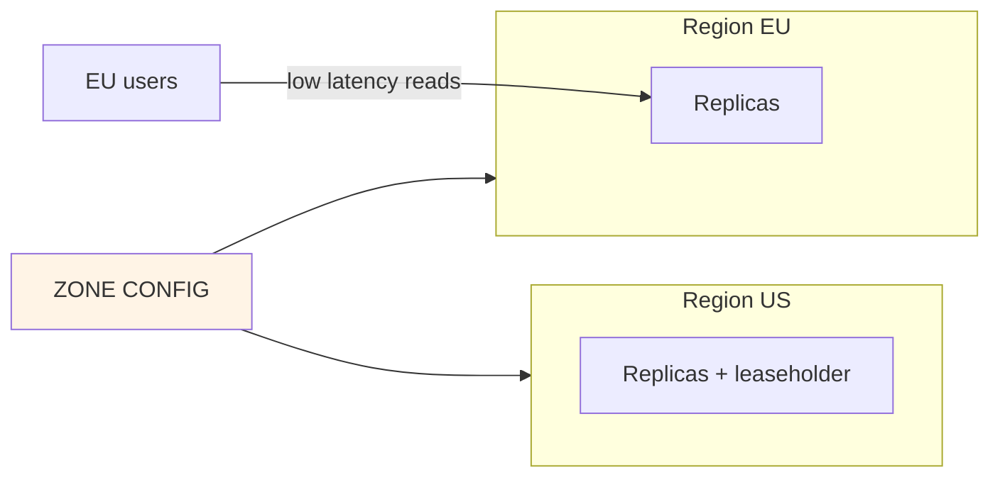

# CockroachDB Architecture

## 1. Executive Summary

**CockroachDB** is a distributed **SQL database** designed for **survivability**, **horizontal scale**, and **serializable** transactions without custom clock hardware. Data is partitioned into **ranges** (contiguous key spans), each replicated across nodes via **Raft**. A **distributed transaction layer** provides **serializable isolation** using **multi-version concurrency control (MVCC)** and **Hybrid Logical Clocks (HLC)** for timestamp ordering—conceptually related to [Google Spanner](/docs/distributed-databases/google-spanner) but portable on commodity **NTP-synchronized** infrastructure.

Nodes are **symmetric**—any node can serve as **SQL gateway**, routing to leaseholders for ranges. **Geo-partitioning** pins data to regions for latency and compliance. CockroachDB targets **globally distributed OLTP** and **multi-region active-active** workloads where teams want PostgreSQL-compatible SQL with built-in replication and failover.

Principal architects compare CockroachDB to Spanner, Aurora, and traditional PostgreSQL—evaluating **serializable cost**, **follow-the-workload** latency, **range splitting**, and **operational complexity** of running a distributed consensus system. Honest **HLC vs TrueTime** comparison separates credible architects from marketing slides.

## 2. Why This Topic Matters

CockroachDB is the reference **Spanner-alternative** interview topic:

- **Raft per range** vs Spanner's Paxos per shard.
- **HLC vs TrueTime** — external consistency differences.
- **Serializable default** — performance implications.
- **Multi-region survival goals** — `SURVIVE ZONE/REGION FAILURE`.
- **Range merges/splits** — automatic rebalancing.

Misunderstanding leads to designing hot rows on single ranges, ignoring transaction contention, or expecting Spanner-exact external consistency on NTP alone.

Bring a **Spanner comparison cheat sheet** to every Cockroach interview—panels will ask for clock and consistency differences within five minutes.

## 3. Problems Being Solved

| Problem | CockroachDB approach |
|---------|---------------------|
| **Single-node DB HA limits** | Raft-replicated ranges |
| **Horizontal scale SQL** | Automatic range splitting |
| **Multi-region OLTP** | Geo-partitioning + replication zones |
| **Postgres compatibility** | Wire protocol subset + SQL |
| **Survive node/zone/region failure** | Configurable survival goals |
| **Cloud-neutral deployment** | Self-host or Cockroach Cloud |

### Workload fit matrix

| Workload | Fit | Caveat |
|----------|-----|--------|
| Multi-region OLTP | Strong | Latency + contention |
| Financial transactions | Strong | Serializable overhead |
| Heavy analytics scans | Moderate | Use CDC to warehouse |
| Single-region low-latency | Moderate | Postgres simpler |
| Hot row updates | Weak | Contention on single range |
| Edge SQLite scale-out | Weak | Different product tier |

## 4. Assumptions and System Model

| Assumption | Implication |
|------------|-------------|
| **HLC with bounded clock skew** | Max offset configuration required |
| **Raft majority per range** | Quorum for writes |
| **Serializable default** | Transactions may retry on conflict |
| **Symmetric nodes** | No special master except ephemeral leaseholders |
| **Network partitions** | Survival goals determine availability |

**Safety:** Serializable isolation; Raft log durability. **Liveness:** Requires quorum per range; clock jump beyond max offset can cause issues—monitor NTP.

## 5. Essential Terminology

| Term | Definition |
|------|------------|
| **Range** | Replicated shard of sorted keyspace (~512 MB default target) |
| **Leaseholder** | Raft leader holding range lease for writes |
| **Store** | RocksDB instance on a node holding ranges |
| **HLC** | Hybrid Logical Clock—physical + logical time |
| **Transaction record** | Coordinates distributed txn commit |
| **Intent** | Provisional write pending commit |
| **Gossip** | Node membership and capacity dissemination |
| **Zone config** | Replication and placement rules |
| **Follow-the-workload** | Move leaseholder near traffic |
| **SERIALIZABLE** | Default isolation—strongest SQL standard level |

## 6. Core Mechanism

### 6.1 Cluster architecture



*Figure 1: Any node serves SQL; ranges replicate via Raft across stores.*

### 6.2 Distributed write transaction (simplified)



*Figure 2: Transaction coordinator writes intents on ranges, commits txn record, then resolves intents.*

### 6.3 Multi-region placement



*Figure 3: Geo-partitioning places data near users; survival goals define replica count per region.*

## 7. Step-by-Step Walkthrough

### Walkthrough A: Single-range read

1. Client connects to any node; SQL gateway parses query.
2. DistSQL plans scan on `users` PK range.
3. Leaseholder serves consistent read at HLC timestamp.
4. MVCC selects visible versions; results return.

### Walkthrough B: Cross-range transfer transaction

1. `BEGIN; UPDATE accounts SET balance...` touches two ranges.
2. Gateway picks txn timestamp; writes **intents** on both ranges.
3. Commits **transaction record**; marks committed.
4. Resolves intents to visible values.
5. On conflict, **serializable restart** error—client retries.

### Walkthrough C: Node failure

1. Node 2 dies; ranges with replicas on node 2 elect new Raft leaders.
2. Leaseholders reassign after ~seconds [config-dependent].
3. Clients retry transient errors; survive zone goal met if quorum intact.

### Walkthrough D: Range split under growth

1. Range exceeds size threshold (~512 MB).
2. Split at midpoint key; new Raft group for right half.
3. Rebalancer moves replicas per zone config.

### Walkthrough E: Follower reads with closed timestamps

1. Application configures `AS OF SYSTEM TIME follower_read_timestamp()` for analytics.
2. Read served from nearest replica without contacting leaseholder—lower latency in multi-region.
3. Staleness bounded by closed timestamp propagation—document in API SLA.
4. Financial balance reads still use strong read on leaseholder—tiered consistency by endpoint.
5. Misuse of follower reads on money path caught in architecture review checklist.

### Walkthrough F: IMPORT and bulk ingest

1. `IMPORT INTO` from CSV on cloud storage—distributed ingest bypassing SQL insert path.
2. Ranges split and replicate during import; transaction per batch internally.
3. Faster than row-by-row INSERT for initial load; validate constraints post-import.
4. Run `SHOW RANGES` to verify distribution; rebalance if skew detected.
5. Cutover application only after import validation and backup snapshot.

### CockroachDB vs Spanner decision matrix

| Requirement | Lean CockroachDB | Lean Spanner |
|-------------|------------------|--------------|
| Multi-cloud portable | ✓ | |
| GCP-native managed | | ✓ |
| External consistency narrative | Moderate (HLC) | Strong (TrueTime) |
| PostgreSQL wire compatibility | ✓ (subset) | PostgreSQL dialect |
| Commodity NTP only | ✓ | Needs TrueTime infra |
| Global strong SQL default | Both—evaluate latency |

### Walkthrough E: SURVIVE REGION FAILURE drill

1. Cluster configured with `SURVIVE REGION FAILURE` and replicas across three regions.
2. Simulate full loss of one region during load test.
3. Ranges in lost region elect new leaseholders in surviving regions; writes resume after seconds to minutes [verify SLO].
4. Applications see elevated `40001` restart rate on contended keys during rebalancing.
5. Post-drill report documents RTO/RPO achieved vs product marketing claims—adjust client retry and schema if needed.

Practice explaining **intents and transaction records** on a whiteboard before comparing Cockroach to Spanner in interviews. Mention serializable client retries in every multi-region design. Compare HLC limits to Spanner commit wait without equating the two systems. Zone survival goals should match actual failure domains, not marketing region names alone. Hot-row contention is the default failure mode for naive global SQL schemas on Cockroach. Application-level queues per hot key are a valid pattern when serializable restarts spike. Clock sync monitoring is as important as replication monitoring in multi-region Cockroach deployments.

## 8. Invariants and Guarantees

| Property | CockroachDB |
|----------|-------------|
| **Serializable** | Default isolation |
| **Linearizable** | Per-key via Raft + leaseholder |
| **External consistency** | Weaker than Spanner TrueTime—HLC-based |
| **Durability** | Raft committed entries |
| **Survival** | Configurable zone/region goals |

**Serializable restart:** Conflicting concurrent txns may abort with `40001` retry error—**safety** over blind progress.

## 9. Failure Scenarios

| Failure | Behavior | Mitigation |
|---------|----------|------------|
| **Hot row contention** | High restart rate | Queue redesign; shard key in app |
| **Clock skew spike** | Node may become unavailable | `--max-offset` monitoring; NTP |
| **Loss of quorum range** | Range unavailable | Survival goals; add replicas |
| **Network partition** | Minority partition read-only/unavailable | Multi-region topology design |
| **Large transaction** | Exceeds size limit | Batch operations |
| **Schema change** | Online but resource-heavy | Schedule off-peak |
| **Follower reads stale** | By design without closed timestamp | Use correct read API |

## 10. Performance Characteristics

| Dimension | Behavior |
|-----------|----------|
| Single-row read | Low ms in-region |
| Cross-range txn | 2PC-style overhead |
| Serializable | Extra restarts under contention |
| Geo-distributed writes | WAN latency on consensus |
| Scans | Distributed parallel; can contend with OLTP |

Compare to Spanner: no **commit wait** on TrueTime—different external consistency story.

## 11. Scalability Limits

- **Hot ranges** limit single-key throughput.
- **Raft groups** millions of ranges—control plane must scale.
- **Cross-region writes** latency bounded by speed of light + consensus.
- **Serializable conflicts** cap write concurrency on overlapping keys.
- **SQL compatibility gaps** vs PostgreSQL—verify extensions needed.

## 12. Operational Considerations

- Configure **`--max-offset`** and monitor clock sync.
- Set **zone configs** for `num_replicas` and `constraints`.
- Watch **txn restarts**, **range unavailability**, **replication lag**.
- **Rolling upgrades** node by node.
- **Backup** to cloud storage; test restore drills.
- **Capacity**: 3+ nodes minimum production; odd count for quorum math in small clusters.
- **Run `cockroach node status`** in monitoring; alert on `liveness` and `replication` red flags.
- **Document client retry** policy for `40001` in every service README using Cockroach.
- **Quarterly game day**: kill random node during business hours in staging; measure app impact.
- **Review zone configs** after every region addition—survival goals drift silently.

## 13. Security Considerations

- **TLS** node-to-node and client connections.
- **RBAC** SQL users and roles.
- **Encryption at rest** in stores.
- **Network policies** restrict DB port exposure.
- **Audit logging** for compliance.

## 14. Cost Considerations

- **Minimum 3 nodes** even for small workloads—overhead vs single Postgres.
- **Cross-region replication** doubles/triples storage and WAN traffic.
- **Cockroach Cloud** vs self-host ops labor.
- **Serializable restarts** translate to application retry load—factor in app servers.

### Serializable retry application pattern

Client libraries should implement **exponential backoff** on `40001` serialization failure with **jitter** and **max attempts**. Idempotency keys on writes prevent duplicate side effects when retry succeeds after ambiguous timeout. Document retry budget in API SLO—users experience latency spikes during contention storms, not hard errors, if clients behave correctly.

### RANGE vs REPLICA GC tuning (multi-region)

`ALTER DATABASE CONFIGURE ZONE` survival goals and replica placement determine behavior during region loss. `SURVIVE REGION FAILURE` requires replicas in 3+ regions with careful quorum math—consult Cockroach docs for current syntax. Misconfigured zones create clusters that **appear** multi-region but lose quorum on single region failure.

### Changefeed to warehouse pattern

Use changefeeds (enterprise feature—verify licensing) to stream row changes to Kafka → Snowflake for analytics. Keeps OLTP path on Cockroach without full table scans. Monitor changefeed lag as critical SLO—backpressure can impact OLTP if misconfigured.

### When Cockroach loses to Postgres

Single-region, &lt;1 TB, team knows Postgres deeply, no horizontal scale requirement—**Cockroach adds consensus overhead without benefit**. Principal architects defend simplicity; distributed SQL is a deliberate complexity purchase.

## 15. Production Implementations

### Case study: Multi-region payment metadata (illustrative)

#### Context

Fintech needs active-active US/EU with serializable balance updates.

#### Design

`REGIONAL BY ROW` on `accounts` table; `SURVIVE REGION FAILURE`; gateway in each region.

#### Challenge

Hot merchant account—serializable restarts spiked. Mitigated with per-merchant queue serializing updates in application layer.

#### Spanner comparison

Chose Cockroach for multi-cloud portability; accepted HLC vs TrueTime tradeoff for external consistency narrative.

#### Extended operations narrative

Region failure drill: US-East loss failed over reads to EU replicas in 4 minutes; writes resumed after lease rebalancing. Clock skew alert during NTP maintenance paused one node—monitoring prevented split-brain write acceptance. Changefeed to Kafka feeds Snowflake analytics—lag SLO 5 minutes with paging. Schema migration on 800 GB table completed online but saturated disk IO—now throttle DDL during peak.

## 16. Alternatives and Tradeoffs

| System | Comparison |
|--------|------------|
| **Google Spanner** | TrueTime external consistency; managed GCP |
| **TiDB/Yugabyte** | Similar distributed SQL; different internals |
| **Aurora** | Single-writer region; simpler |
| **PostgreSQL + Patroni** | HA single primary; manual sharding |
| **Cassandra** | No serializable SQL transactions |

## 17. Common Misconceptions

| Misconception | Reality |
|---------------|---------|
| "Same as Spanner" | HLC not TrueTime; different guarantees |
| "Postgres drop-in" | Feature subset; test migrations |
| "Serializable means no retries" | Restarts expected under contention |
| "Any node is equally fast" | Leaseholder locality matters |
| "Geo-partitioning is automatic" | Requires schema and zone design |

## 18. Principal Architect Perspective

1. **Prototype contention** on hot keys before multi-region commit.
2. **Document serializable retry** in all client libraries.
3. **Compare external consistency** needs vs Spanner honestly.
4. **Use survival goals** aligned with actual failure domains.
5. **CDC to warehouse** for analytics—not heavy scans on OLTP.

CockroachDB buyers want Spanner-like stories without GCP lock-in—principal honesty about **HLC limits and serializable restarts** builds trust; overselling external consistency creates audit and latency surprises later. Application teams must implement **idempotent retry** as a platform standard, not per-service improvisation.

### Operating playbook (first 90 days)

**Days 1–30:** Validate NTP/`max-offset` monitoring on all nodes. Document survival goals and zone configs in ADR.

**Days 31–60:** Load test hot keys identified in schema review; measure serialization restart rate. Client libraries implement retry with idempotency keys.

**Days 61–90:** Multi-region failover drill; measure RTO. Compare measured cross-region write latency to product SLO promises.

## 19. Architecture Review Exercise

**Scenario:** Global inventory table with single `sku` PK; high concurrent updates worldwide.

**Findings:** Single range hotspot; redesign `sku` + warehouse shard or queue per SKU.

## 20. Whiteboard Explanation

"CockroachDB shards the keyspace into ranges—each range is a Raft group with a leaseholder handling writes. SQL gateways on any node receive queries, use DistSQL to plan distributed execution, and coordinate transactions with intents and a transaction record—two-phase style across ranges. Timestamps come from Hybrid Logical Clocks combining physical time and a logical counter to order events without GPS clocks. Default isolation is serializable: conflicting transactions may restart. Ranges split as they grow; the rebalancer moves replicas per zone configuration for survival and locality. "It's PostgreSQL-wire compatible for many apps but architecturally a consensus-based distributed store, not a single-node Postgres."

**Principal addendum:** Contrast Spanner—commit wait and TrueTime enable stronger external consistency. For Cockroach, discuss **serializable restarts** and **hot row** limits honestly. Draw three-node Raft quorum when explaining range survival.

## 21. Interview Questions

1. **Range vs shard?** — Cockroach range is Raft-replicated key span.
2. **Raft role?** — Consensus per range.
3. **Leaseholder?** — Raft leader serving writes for range.
4. **HLC purpose?** — Timestamp ordering without TrueTime hardware.
5. **Intent in transaction?** — Provisional write pending commit.
6. **Serializable restart?** — Conflict abort; client retries.
7. **Cockroach vs Spanner clocks?** — HLC+NTP vs TrueTime GPS/atomic.
8. **Survival goals?** — `ZONE` vs `REGION` failure tolerance.
9. **Geo-partitioning?** — Pin ranges to regions.
10. **Hot row problem?** — Single range serializes writes.
11. **Gossip protocol?** — Cluster metadata dissemination.
12. **STORE vs NODE?** — Node has one or more stores (disks).
13. **Follow-the-workload?** — Move lease near query source.
14. **When choose Postgres instead?** — Single region, simpler ops.

### Scoring rubric (principal)

| Dimension | Strong | Weak |
|-----------|--------|------|
| Internals | Ranges, Raft, intents, HLC | "Distributed Postgres" |
| Consistency | Serializable + restarts | Ignores conflicts |
| Spanner compare | TrueTime vs HLC honest | "Same thing" |
| Ops | Clock sync, zone configs | Ignore survival goals |

### Extended scoring notes

**Principal bar:** Explains intents + txn record without confusing with 2PC textbook only. Compares HLC to TrueTime honestly. **Weak hire:** "Distributed Postgres" hand-wave with no restart or hot row discussion.

15. **IMPORT vs INSERT load?** — Distributed ingest path for bulk.
16. **Follower reads tradeoff?** — Staleness bound vs latency.
17. **When Yugabyte/TiDB instead?** — Similar space; evaluate portability and ops.

## 22. Interview Follow-Ups

1. **Design multi-region bank accounts table.** — REGIONAL BY ROW, survival goals, retry logic.
2. **High serialization restart rate—debug?** — Contention visualization; schema change.
3. **Prove Raft quorum math for 5-node 3-region.** — Replica placement per zone config.
4. **External consistency audit question.** — Explain HLC limits vs Spanner commit wait.
5. **Migrate from Postgres—risks?** — Extension compatibility, serializable semantics.

### Additional principal scenarios

**Scenario:** Latency SLO missed for cross-region writes. **Answer:** Measure WAN + consensus; consider regional by row; async replication for non-critical reads; do not promise Spanner-like global write latency without TrueTime-class infra.

**Scenario:** `40001` restart storm during flash sale. **Answer:** Queue per hot SKU at application layer; shard inventory rows; reduce transaction scope; pre-scale nodes before event.

**Scenario:** Auditor asks if Cockroach matches Spanner external consistency. **Answer:** Honest no—serializable with HLC; different real-time ordering guarantees; document in compliance narrative with commit-wait distinction.

## 23. Strong Answer Example

**Question:** "How does CockroachDB achieve distributed transactions?"

**Strong outline:** "A SQL transaction touching multiple ranges gets a transaction coordinator—often the gateway—that assigns an HLC timestamp. For each write, it places an intent—a provisional MVCC value with metadata pointing to the transaction record—on the leaseholder of each affected range via Raft replication. On commit, it writes a committed transaction record, then resolves all intents to make values visible. Reads check intents and transaction status for serializability. If another transaction creates a conflicting serial order, one txn receives a restart error. This is Percolator-style design adapted with Raft per range instead of a single Bigtable. Cross-range commits add latency proportional to WAN RTT in multi-region deployments. Serializable is the default, so application code must handle retries idempotently."

## 24. Weak Answer Example

**Weak:** "CockroachDB uses Raft so it's consistent; Postgres apps work unchanged globally."

**Red flags:** No ranges/intents; ignores retries; overstated Postgres compatibility.

## 25. Hands-On Exercise

1. Start 3-node local cluster; run distributed SQL demo.
2. Observe range splits inserting large dataset.
3. Provoke serializable restart with concurrent updates.
4. Configure multi-region demo in docs sandbox if available.
5. Compare query plan to single-node Postgres.

## 26. Knowledge Check

1. Consensus per? *(Range / Raft group.)*
2. HLC combines? *(Physical + logical time.)*
3. Default isolation? *(Serializable.)*
4. Intent is? *(Provisional write.)*
5. Leaseholder serves? *(Writes for range.)*
6. Hot row hits? *(Single range contention.)*
7. Serializable restart code? *(40001 typically.)*
8. Spanner clock difference? *(TrueTime vs HLC.)*
9. Store contains? *(RocksDB data.)*
10. Survival goal defines? *(Fault tolerance level.)*
11. Intent is? *(Provisional write.)*
12. DistSQL plans? *(Distributed queries.)*
13. Geo-partitioning pins? *(Data to regions.)*

## 27. Flashcards

| Front | Back |
|-------|------|
| Range | Replicated keyspace shard |
| Raft | Per-range consensus protocol |
| Leaseholder | Range leader for writes |
| HLC | Hybrid Logical Clock |
| Intent | Provisional distributed write |
| Serializable | Strongest default isolation |
| Zone config | Replication and placement rules |
| Geo-partitioning | Regional data pinning |
| Transaction restart | Conflict abort requiring retry |
| DistSQL | Distributed query execution |

## 28. Cheat Sheet

```
ARCHITECTURE
  SQL gateway → ranges → Raft → RocksDB

TRANSACTIONS
  Intents + txn record + resolve | serializable restarts

CLOCKS
  HLC on NTP (not TrueTime)

DESIGN
  Avoid hot rows | plan multi-region survival | retry idempotency

VS SPANNER
  Portable HLC | weaker external consistency story

PRINCIPAL ANCHORS
  Serializable restarts expected
  Hot row = range bottleneck
  Raft per range
  Intents + txn record
  max-offset clock monitor
  Zone config = survival
  Honest Spanner compare
  Client retry idempotent
```

## 29. Related Concepts

- [Google Spanner](/docs/distributed-databases/google-spanner) — TrueTime comparison
- [Raft](/docs/consensus/raft) — per-range consensus
- [Linearizability](/docs/consistency/linearizability) — consistency hierarchy
- [Two-Phase Commit](/docs/transactions/two-phase-commit) — cross-range commits
- [MVCC](/docs/transactions/mvcc) — versioning layer
- [Physical and Logical Time](/docs/time-ordering-and-coordination/physical-and-logical-time) — HLC foundations

## 30. References

### Primary sources

- Taft, R., et al. (2020). *CockroachDB: The Resilient Geo-Distributed SQL Database.* SIGMOD.
- CockroachDB documentation — architecture, transactions, zone configs.

### Related

- Corbett et al. Spanner paper — design comparison.
- Peng, D., & Dabek, F. — Percolator transaction model.

### Principal study path

Essential companions: [Google Spanner](/docs/distributed-databases/google-spanner), [Raft](/docs/consensus/raft), [Two-Phase Commit](/docs/transactions/two-phase-commit), [MVCC](/docs/transactions/mvcc), and [Linearizability](/docs/consistency/linearizability) for consistency hierarchy context in principal interviews. Always contrast HLC with TrueTime when Spanner appears in the same loop.

### Distinction

| Claim | Type |
|-------|------|
| Serializable default | CockroachDB documentation |
| HLC vs external consistency | Academic and vendor papers |
| Postgres compatibility list | Version-specific feature matrix |
