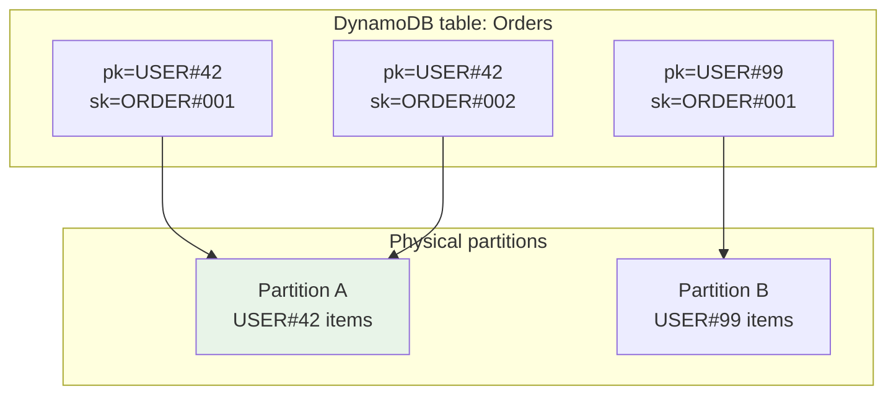
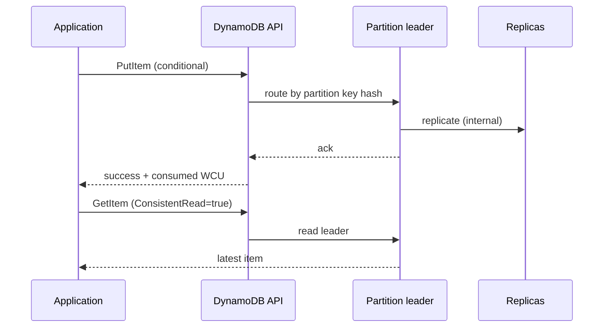
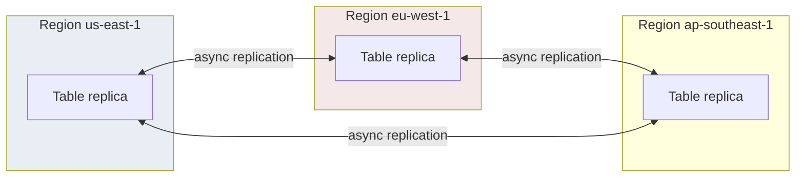

# Amazon DynamoDB

## 1. Executive Summary

**Amazon DynamoDB** is AWS's fully managed, serverless key-value and document database. It inherits **naming and partitioning ideas** from the Dynamo research lineage but is a **distinct product** with its own consistency model, API, and operational surface. Data is organized by **partition key** (and optional **sort key**) into **partitions** that scale independently. DynamoDB offers **single-digit millisecond** latency at scale (AWS marketing claim; measure in your workload), **on-demand or provisioned capacity**, **global tables** for multi-region replication, **DynamoDB Streams** for change capture, **transactions** (limited multi-item), and **conditional writes** for optimistic concurrency.

Unlike the 2007 Dynamo paper, DynamoDB does not expose N/R/W tuning to clients. Consistency is expressed via **read consistency** (`GetItem` eventually vs strongly consistent reads) and **transaction APIs**. Storage is built on SSD-backed **LSM-style** internals (implementation detail; AWS does not publish full engine specs).

Principal architects must reason about **partition key design**, **hot partitions**, **capacity modes**, **global table conflict resolution**, and **when DynamoDB is the wrong tool** (heavy relational queries, unbounded scans, unpredictable access patterns without design).

## 2. Why This Topic Matters

DynamoDB is the default serverless data plane for AWS-native architectures. Interview and architecture reviews focus on:

- **Single-table design** vs multi-table modeling.
- **Hot partition** detection and mitigation.
- **On-demand vs provisioned** cost and throttle behavior.
- **Global tables** and **last-writer-wins** across regions.
- **Streams + Lambda** vs **transactional outbox** patterns.
- **DAX** cache coherency and invalidation.

Production failures often trace to: poor partition keys, GSI throttling, scan-heavy analytics on OLTP tables, or assuming global tables provide application-level merge semantics.

## 3. Problems Being Solved

| Problem | DynamoDB approach |
|---------|-------------------|
| **Ops-free scaling** | Managed partitions; auto-split |
| **Predictable key-value latency** | SSD + partition isolation |
| **Serverless economics** | On-demand billing per request |
| **Multi-region active-active** | Global tables (async replication) |
| **Event-driven architectures** | Streams with ordered change log per shard |
| **Optimistic concurrency** | Conditional expressions on `PutItem`/`UpdateItem` |
| **TransactWrite scope** | Atomic multi-item within API limits | `TransactWriteItems` |

### Workload fit matrix

| Workload | Fit | Caveat |
|----------|-----|--------|
| Session store | Strong | TTL + key design |
| Shopping cart | Strong | Single-table or adjacency list |
| Leaderboard | Moderate | Prefer DAX or ElastiCache for top-N |
| Ad-hoc analytics | Weak | Export to S3/Athena |
| Graph traversals | Weak | Not native; use Neptune |
| Inventory counter | Moderate | Conditional updates; hot SKU risk |

DynamoDB shines when access patterns are **known upfront** and item sizes stay bounded; it punishes exploratory relational querying and unbounded scans.

### Capacity unit reference (provisioned mode)

Understanding RCU/WCU math is mandatory in interviews: one **WCU** = one write per second for an item up to 1 KB (rounded up); one **RCU** = one strongly consistent read per second for item up to 4 KB (or two eventually consistent reads). A 3 KB item write consumes 3 WCU. Batch operations amortize round trips but not capacity units. Principal candidates should walk through a peak-traffic calculation on the whiteboard without a calculator for order-of-magnitude correctness.

## 4. Assumptions and System Model

| Assumption | Implication |
|------------|-------------|
| **Access via partition key** | All hot paths must hash to well-distributed keys |
| **Item size limit 400 KB** | Large blobs belong in S3 with pointer |
| **AWS regional service** | Latency and compliance follow region choice |
| **IAM authentication** | Security boundary at API layer |
| **Eventually consistent reads default** | Strong reads cost 2× RCU in provisioned mode |

**Consistency (product):** Per-item **atomic writes**; **strongly consistent reads** return latest committed write for that item (AWS documentation). **Global tables** replicate asynchronously—**not** linearizable across regions.

## 5. Essential Terminology

| Term | Definition |
|------|------------|
| **Partition key** | Hash key determining physical partition |
| **Sort key** | Optional range key within partition |
| **Composite key** | Partition + sort key |
| **GSI / LSI** | Global / Local Secondary Index—alternate access patterns |
| **RCU / WCU** | Read / Write Capacity Units (provisioned mode) |
| **On-demand** | Pay per request; auto-scales with soft limits |
| **Adaptive capacity** | Redirects unused partition capacity (provisioned) |
| **DAX** | In-memory cache cluster for DynamoDB |
| **Stream** | Ordered change feed per shard (24-hour retention) |
| **TTL** | Automatic item expiration attribute |
| **TransactWrite** | Atomic multi-item write (constraints apply) |
| **Conditional write** | `attribute_not_exists`, version checks |

## 6. Core Mechanism

### 6.1 Partitioning and routing

The partition key hashes to a **partition**—the unit of throughput and storage scaling. Poor key choice (e.g., `status=OPEN` for all orders) creates a **hot partition**.



*Figure 1: Partition key routes items to shards; sort key colocates related items for efficient queries.*

### 6.2 Read/write path



*Figure 2: API routes to partition; strong reads target leader replica (AWS model).*

### 6.3 Global tables replication



*Figure 3: Global tables replicate writes asynchronously; conflict resolution is last-writer-wins per item (AWS documentation).*

## 7. Step-by-Step Walkthrough

### Walkthrough A: Single-table design for e-commerce

1. Partition key: `PK=USER#<id>`; sort key: `SK=PROFILE | ORDER#<id> | CART#<sku>`.
2. `Query` with `PK=USER#42` and `SK begins_with ORDER#` returns user orders in one partition query.
3. GSI with `GSI1PK=ORDER#<id>` supports lookup by order ID.

### Walkthrough B: Optimistic locking

1. Read item with `version=5`.
2. `UpdateItem` with `ConditionExpression: version = :5`; set `version=6`.
3. Concurrent writer with stale version gets `ConditionalCheckFailedException`.
4. Application retries with fresh read.

### Walkthrough C: Stream consumer

1. `PutItem` writes to partition shard.
2. Stream records `INSERT` event with keys and NewImage.
3. Lambda poller processes batch; idempotent handler updates search index.
4. Failures retry; DLQ for poison messages.

### Walkthrough E: GSI write amplification

1. Base table write consumes WCU for primary item.
2. GSI projection triggers additional WCU for index entry.
3. Hot GSI partition (e.g., `status=ACTIVE` on sparse index) throttles independently.
4. Architect models **double-write cost** in capacity planning.

### Walkthrough F: TransactWriteItems boundary

1. Transfer requires updating `Accounts` and `Ledger` items—must fit single transact call.
2. Items must reside in same region; 100-item limit not binding here.
3. Idempotent `ClientRequestToken` prevents duplicate transact on retry.
4. On `TransactionCanceledException`, application inspects `CancellationReasons` per item.

## 8. Invariants and Guarantees

| Guarantee | Scope |
|-----------|-------|
| **Atomic single-item write** | One item per `PutItem`/`UpdateItem`/`DeleteItem` |
| **Atomic transact write** | Up to 100 items, same account/region, no cross-table limits beyond API |
| **Strong read per item** | Latest committed on leader for that item (AWS) |
| **Ordered stream per shard** | Per-partition key sequence within shard |
| **Global table convergence** | Eventual across regions; LWW on conflict |

**Not guaranteed:** Cross-region linearizability; SQL isolation levels; unlimited transact scope.

## 9. Failure Scenarios

| Failure | Behavior | Mitigation |
|---------|----------|------------|
| **Hot partition** | `ProvisionedThroughputExceededException` | Key redesign; adaptive capacity; on-demand |
| **GSI throttling** | Writes succeed; index lags | Separate GSI capacity; backoff |
| **Large item** | Reject >400 KB | S3 offload |
| **Scan during peak** | Consumes all RCU | Use GSIs; export to S3 + Athena |
| **Global table conflict** | LWW may drop update | Version vectors; regional ownership |
| **Stream Lambda poison** | Iterator age grows | DLQ; idempotency |
| **Transaction idempotency token expiry** | Duplicate risk after 10-minute window | Reuse token per logical operation |
| **PITR restore to new table** | Application cutover complexity | Blue/green table migration runbook |

### Scenario narratives

**Hot partition during flash sale:** A promotional SKU uses `PRODUCT#flash-deal` as partition key. All checkouts hash to one partition; WCU exhausts in seconds while sibling partitions idle. CloudWatch Contributor Insights shows 99% skew on one key. Remediation: partition key `PRODUCT#flash-deal#<userId>` or pre-aggregate inventory in a counter shard pattern; enable on-demand temporarily.

**Global table conflict:** US region updates `version=2` on profile; EU region concurrently updates `version=2` from stale read. LWW picks higher timestamp—one region's field update vanishes. Mitigation: monotonic `version` attribute with conditional writes per region ownership, or route profile writes to home region only.

**Stream iterator age SLO breach:** Lambda concurrency capped; DynamoDB stream backlog grows. Downstream search index lags hours. Fix: raise reserved concurrency, batch tuning, parallelization factor, and idempotent bulk indexing.

## 10. Performance Characteristics

| Dimension | Notes |
|-----------|-------|
| Latency | Single-digit ms for keyed access (workload-dependent) |
| Throughput | Per-partition limits; scales with partition count |
| Queries | Efficient within partition + sort key; GSIs add cost |
| Scans | O(table size)—avoid in hot paths |
| Transactions | Higher latency; limited item count |
| Strong reads | ~2× read cost vs eventual |

## 11. Scalability Limits

- **Per-partition throughput ceiling** (soft limits vary—check current AWS quotas).
- **400 KB item size**; **400 KB transaction payload**.
- **GSI projection size** amplifies storage.
- **25 GSIs per table** (quota; verify current docs).
- **Scan/query pagination** for large result sets—application complexity.

## 12. Operational Considerations

- Enable **CloudWatch** alarms: throttles, `UserErrors`, stream iterator age, GSI throttle.
- Use **Contributor Insights** for hot keys.
- **Point-in-time recovery (PITR)** for accidental deletes.
- **On-demand backup** before schema migrations.
- **Adaptive capacity** (provisioned): absorbs short bursts; not unlimited—monitor `ThrottledRequests`.
- **Warm throughput** for on-demand tables before known events (AWS feature; verify docs).
- **PartiQL** for ad-hoc ops in tooling—not for hot-path microservices at scale.

## 13. Security Considerations

- IAM policies on table, index, stream ARNs.
- **Encryption at rest** (AWS owned or KMS CMK).
- **VPC endpoints** for private connectivity.
- **Condition expressions** are not authorization—enforce at IAM and app layer.
- Stream consumers need scoped read on stream ARN only.

## 14. Cost Considerations

| Mode | Cost driver |
|------|-------------|
| **Provisioned** | RCU/WCU reservation; savings plans |
| **On-demand** | Per-million requests; spikes cost more |
| **Storage** | Per GB-month; indexes add storage |
| **Streams** | Shard hours + Lambda invocations |
| **Global tables** | Cross-region replication WCU + storage in each region |
| **DAX** | Cluster nodes 24/7 |

**Rule of thumb:** Steady predictable load → provisioned; spiky/unknown → on-demand; always model GSI double-write cost.

## 15. Production Implementations

### Case study: Multi-region session and profile store

#### Business context

Global SaaS application needs low-latency profile reads and session writes from multiple continents. Team wants managed ops and integration with Lambda event processing.

#### Scale

Millions of users; thousands of RPS per region at peak (illustrative—size to your telemetry). Items ~2 KB average.

#### Functional requirements

- CRUD user profile by `userId`.
- Session token storage with TTL.
- Event notification on profile change for search indexing.

#### Non-functional requirements

- p99 read < 20 ms in-region.
- 99.99% availability (regional).
- GDPR: EU data residency option.
- RPO near-zero for profile; sessions may tolerate loss on rare conflict.

#### Architecture overview

DynamoDB table per environment; partition key `USER#<id>`; GSIs for email lookup (careful with hot email domains). Global tables in `us-east-1`, `eu-west-1`, `ap-southeast-1`. Streams → Lambda → OpenSearch. DAX optional for read-heavy profile path.

#### Data model

```
PK: USER#<uuid>
SK: PROFILE | SESSION#<deviceId>
attrs: email, name, sessionToken, ttl, version
GSI1: EMAIL#<email> → USER#<uuid>
```

#### Partitioning

High-cardinality partition key (`USER#uuid`); avoid `TENANT#id` alone for large tenants—use `TENANT#id#USER#uuid`.

#### Replication

Global tables async multi-master; application uses regional writes primarily to user's home region when possible to reduce conflicts.

#### Consistency

Strong reads for profile after write in same region; eventual for cross-region; conditional writes on `version`.

#### Availability

Multi-AZ within region (AWS managed); regional failover via Route 53 to healthy region.

#### Failure handling

Throttling → exponential backoff + jitter; hot key → shard suffix; stream lag → scale Lambda concurrency; PITR for fat-finger deletes.

#### Security

KMS CMK; IAM per microservice; no PII in GSI keys if avoidable; audit streams to security lake.

#### Observability

CloudWatch Contributor Insights; custom metrics on conditional check failures; X-Ray on Lambda consumers.

#### Cost model

On-demand for dev; provisioned with auto-scaling in prod; GSI storage ~30% overhead; stream + Lambda per million changes.

#### Evolution

Phase 1: single region. Phase 2: global tables. Phase 3: DAX if read RCU dominates. Phase 4: export to data lake via PITR export—not live scans.

#### Tradeoffs

| Choice | Tradeoff |
|--------|----------|
| Global tables | Low-latency writes everywhere vs LWW conflicts |
| Single-table | Fewer tables vs modeling complexity |
| DAX | Speed vs staleness and ops |
| On-demand | Simplicity vs cost at steady high load |

#### Known limitations

No ad-hoc SQL; cross-region transactions not supported; LWW may surprise on concurrent multi-region updates.

#### Interview lessons

Lead with **partition key**; quantify **capacity**; separate **Dynamo paper** from **DynamoDB**; state **global table** semantics honestly.

#### Redesign exercise (case study)

**Prompt:** Global tables cause LWW conflicts on `lastLogin` while profile fields are region-owned.

**Strong direction:** Split attributes into region-scoped items or route writes to home region; use streams for analytics-only `lastLogin` aggregation.

Principal architects should treat DynamoDB capacity planning as **continuous FinOps**: monthly reviews of consumed vs provisioned units, GSI overhead, and stream/Lambda fan-out costs often reveal optimization opportunities in mature estates [anecdotal; measure per account].

## 16. Alternatives and Tradeoffs

| Alternative | When |
|-------------|------|
| **RDS/Aurora** | Relational queries, joins, transactions |
| **ElastiCache Redis** | Sub-ms cache; ephemeral |
| **Cassandra self-managed** | On-prem/multi-cloud wide-column |
| **Spanner** | Global strong consistency needs |

Choose DynamoDB for **AWS-native serverless OLTP** with keyed access patterns designed upfront.

## 17. Common Misconceptions

| Misconception | Reality |
|---------------|---------|
| "DynamoDB = Dynamo paper" | Different consistency and API |
| "On-demand unlimited" | Soft limits; throttling possible |
| "Global tables = sync replication" | Async; LWW conflicts |
| "GSIs are free" | Extra WCU and storage |
| "Scans are fine for ETL" | Use export to S3 |

## 18. Principal Architect Perspective

1. **Partition key is the architecture**—review in design phase, not incident.
2. **Model access patterns first**—single-table design when justified.
3. **Document consistency** per read path (strong vs eventual vs DAX).
4. **Capacity mode** is a FinOps decision with technical triggers.
5. **Streams are at-least-once**—idempotent consumers mandatory.
6. **Use PITR export** for analytics—not table scans.
7. **Model GSI writes** as first-class capacity consumers in design reviews.

When teams adopt **single-table design**, maintain a living **entity-relationship diagram** mapped to PK/SK patterns—without it, new engineers introduce access patterns that require scans within six months.

## 19. Architecture Review Exercise

**Scenario:** IoT telemetry table; partition key `deviceId`; 10k devices write 1 KB/sec each to same `deviceId` bug.

**Findings:** Single hot partition; throttling; fix key to `deviceId#hour` or aggregate at edge.

## 20. Whiteboard Explanation

"DynamoDB stores items keyed by partition key and optional sort key. The partition key hashes to a physical partition that scales independently. Queries are efficient within a partition using the sort key; GSIs project alternate keys at extra cost. Writes are durable within a region; you choose eventual or strong reads per request. Global tables replicate asynchronously across regions with last-writer-wins. Streams give ordered change feeds for event-driven processing. Design partition keys for even distribution—hot keys are the primary scaling failure mode."

## 21. Interview Questions

1. **Partition vs sort key?** — Hash vs range within partition.
2. **Hot partition symptoms?** — Throttling, skewed metrics.
3. **GSI vs LSI?** — Global separate partition space vs local same partition.
4. **Strong vs eventual read?** — Freshness vs cost/latency.
5. **Global tables consistency?** — Async multi-master; LWW.
6. **TransactWrite limits?** — 100 items, same region, size caps.
7. **When not DynamoDB?** — Heavy joins, unbounded scans.
8. **DAX purpose?** — Microsecond cache; invalidation complexity.
9. **Stream ordering?** — Per shard, not global table order.
10. **On-demand vs provisioned?** — Spike tolerance vs steady cost.
11. **Single-table design benefit?** — One Query for related entities.
12. **PITR use case?** — Point-in-time recovery after fat-finger delete.
13. **Contributor Insights?** — Hot key detection.
14. **Adaptive capacity?** — Borrow unused partition capacity briefly.

### Scoring rubric (principal)

| Dimension | Strong signal | Red flag |
|-----------|---------------|----------|
| Key design | High cardinality PK; GSI for access paths | Scan-based queries |
| Capacity | RCU/WCU math with item size | "It auto-scales forever" |
| Global tables | LWW + conflict strategy | "Strongly consistent globally" |
| Ops | Alarms on throttles, stream lag | No backup/PITR mention |

## 22. Interview Follow-Ups

1. **Design keys for multi-tenant SaaS.** — `TENANT#id#ENTITY#id`.
2. **Handle global LWW conflict.** — Regional ownership; version attribute.
3. **Estimate WCU for 5 KB writes at 10k RPS.** — Math with rounding rules.
4. **Replace scan with export pipeline.** — PITR export to S3 + Athena/Glue.
5. **Idempotent stream consumer.** — Dedupe on event ID.

## 23. Strong Answer Example

**Question:** "Design DynamoDB for user orders with lookup by user and by order ID."

**Strong outline:** "Single table: PK `USER#<userId>`, SK `ORDER#<orderId>` for user timeline queries. GSI inverted: GSI1PK `ORDER#<orderId>`, GSI1SK constant for O(1) order lookup. Attributes include status, total, version for optimistic locking. Provisioned with auto-scaling on base table and GSI; alarm on throttles. Conditional updates on status transitions. Streams emit to fulfillment service with idempotent handlers. Avoid scanning; all access via Query on base or GSI. If one tenant dominates traffic, embed shard suffix in PK for that tenant class only."

## 24. Weak Answer Example

**Weak:** "Create Orders table with orderId primary key. Scan for user orders. DynamoDB scales automatically."

**Red flags:** Scan on hot path; no GSI; ignores per-partition limits.

## 25. Hands-On Exercise

1. Create table with PK/SK and one GSI in AWS free tier or LocalStack.
2. Load skewed data; observe Contributor Insights or throttling.
3. Implement conditional write retry loop with exponential backoff.
4. Enable stream; Lambda logs events; measure iterator age under load.
5. Redesign keys to fix skew; document RCU/WCU before and after.
6. Simulate global table conflict with concurrent regional writes to same item.
7. Export table to S3 via PITR export; query with Athena instead of Scan.

**Success criteria:** Demonstrate hot partition throttling; fix with key redesign; document capacity math.

## 26. Knowledge Check

1. What determines physical partition? *(Partition key hash.)*
2. Strong read cost vs eventual? *(~2× RCU provisioned.)*
3. Global table conflict resolution? *(Last writer wins—AWS.)*
4. Max item size? *(400 KB.)*
5. Stream retention default? *(24 hours.)*

## 27. Flashcards

| Front | Back |
|-------|------|
| Partition key | Hash routing to physical partition |
| Sort key | Range within partition |
| GSI | Alternate partition key projection |
| RCU/WCU | Provisioned read/write units |
| Conditional write | Optimistic concurrency |
| Global tables | Multi-region async replication |
| DAX | Managed DynamoDB cache |
| Streams | Ordered change log per shard |
| Hot partition | Skewed key throttling |
| TransactWrite | Multi-item atomic write (limited) |

## 28. Cheat Sheet

```
KEYS
  PK required → partition
  SK optional → sort within partition
  Design: high cardinality PK

ACCESS
  GetItem / Query (efficient)
  Scan (avoid hot path)
  GSI for alternate patterns

CONSISTENCY
  Eventual (default) | Strong (ConsistentRead)
  Global tables: async LWW cross-region

CAPACITY
  Provisioned (RCU/WCU) | On-demand
  Hot key → Contributor Insights

INTEGRATION
  Streams → Lambda/Kinesis
  DAX → read cache
  Export → S3 analytics
```

## 29. Related Concepts

- [Amazon Dynamo](/docs/distributed-databases/amazon-dynamo) — research lineage
- [LSM Trees](/docs/storage-engines/lsm-trees) — storage engine patterns
- [Transactional Outbox](/docs/transactions/transactional-outbox) — stream alternative
- [Leaderless Replication](/docs/replication/leaderless-replication) — contrast tuning model
- [Idempotency](/docs/distributed-systems-foundations/idempotency) — stream consumers

## 30. References

### Primary sources (product documentation)

- AWS. *Amazon DynamoDB Developer Guide.* — consistency, capacity, global tables, streams.
- AWS. *Best practices for designing and architecting with DynamoDB.*

### Research lineage

- DeCandia et al. (2007). *Dynamo* — conceptual ancestor; not specification of DynamoDB.

### Distinction

| Claim type | Source |
|------------|--------|
| API limits, consistency modes | AWS documentation (verify current) |
| Latency marketing | AWS—benchmark your workload |
| Internal storage engine | Implementation choice; not fully public |
