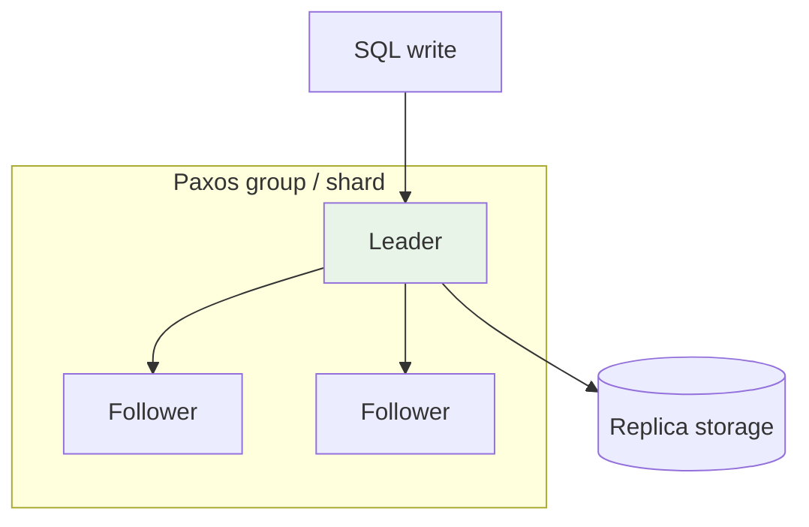
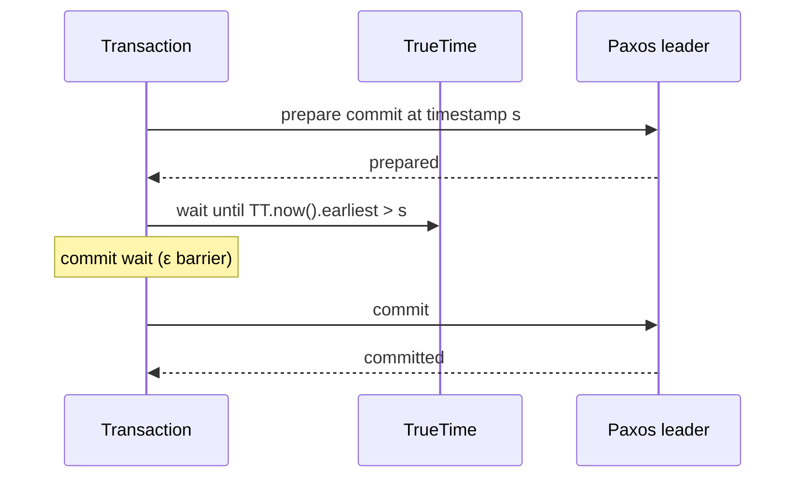
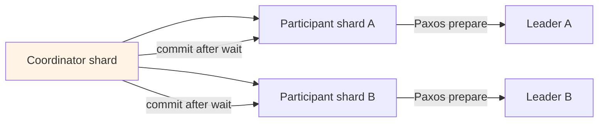

# Google Spanner

## 1. Executive Summary

**Google Spanner** is a globally distributed, horizontally scalable relational database that provides **externally consistent** reads and writes, **serializable** transactions, and a **SQL** interface (Corbett et al., OSDI 2012). Spanner combines **TrueTime**—a clock API exposing bounded uncertainty intervals `[earliest, latest]`—with **two-phase commit (2PC)** across **Paxos-replicated shards** to assign global timestamps to transactions. The **commit wait** rule ensures transactions do not commit until TrueTime's uncertainty window has passed, enabling **external consistency** (linearizability aligned with real-time order when clocks behave).

Spanner is the reference architecture for **globally strong consistency** at scale—at the cost of **latency tied to clock uncertainty**, **operational dependence on time synchronization**, and **complexity** that managed offerings (Google Cloud Spanner, CockroachDB with Hybrid Logical Clocks) approximate with different tradeoffs.

This chapter explains Spanner's mechanisms, guarantees, failure behavior, and a production-oriented case study for principal-level interviews.

The Spanner lesson for principals is **infrastructure is part of the consistency model**: TrueTime is not a cosmetic optimization—it is the enabler for external consistency without a single global lock service. Any team claiming "we built Spanner semantics on NTP" should be challenged to quantify ε, commit-wait latency, and cross-shard 2PC behavior under their actual clock infrastructure.

**Product surface:** Google Cloud Spanner exposes multi-region configurations, PostgreSQL-dialect compatibility layers, and bounded staleness reads—verify current documentation for features not in the 2012 paper. The paper remains the authoritative source for **TrueTime + commit wait** semantics.

## 2. Why This Topic Matters

Spanner redefined what many architects thought possible: **SQL + global distribution + strong consistency**. Interview panels probe:

- **TrueTime** and **commit wait**—why they matter for external consistency.
- **Paxos per shard** vs **2PC across shards** for distributed transactions.
- **External consistency** vs **serializability** vs **linearizability**.
- Comparison to **CockroachDB**, **TiDB**, **Aurora Global Database**.
- When **strong global consistency** is worth **added latency and cost**.

Misunderstanding Spanner leads to designing global 2PC without clock infrastructure or assuming any SQL database can match Spanner semantics on commodity NTP alone.

## 3. Problems Being Solved

| Problem | Spanner approach |
|---------|------------------|
| **Global transactional applications** | Serializable SQL across regions |
| **Consistent external reads** | TrueTime-stamped transactions |
| **High availability per shard** | Paxos replication |
| **Schema evolution at scale** | Online DDL (product evolution) |
| **Familiar SQL API** | Query optimizer, secondary indexes |

### Workload fit matrix

| Workload | Fit | Caveat |
|----------|-----|--------|
| Global financial metadata | Strong | Cost + latency |
| Multi-region inventory row | Moderate | Hot row + 2PC |
| OLAP reporting | Weak | Export to BigQuery |
| Edge caching | Weak | Use CDN/Memorystore |
| High-QPS single-row | Moderate | Shard design |
| Globally consistent SQL | Strong | TrueTime dependency |

Spanner targets **correctness-first global OLTP** where teams will pay latency and infrastructure premiums; it is overkill for regional CRUD with eventual cross-region tolerance.

### F1 and Spanner lineage

Google's **F1** distributed SQL system (Spanner + structured storage) informed productization of Spanner as external Cloud Spanner. Interviewers may ask how Spanner differs from **Bigtable** (wide-column, eventual consistency per row) and **Megastore** (entity groups). Spanner unifies **Paxos-replicated shards** with **SQL query layer** and **TrueTime**—a vertical integration bet that managed cloud offerings now replicate in various forms (Cockroach, Yugabyte, PlanetScale with caveats).

## 4. Assumptions and System Model

| Assumption | Implication |
|------------|-------------|
| **TrueTime API available** | `TT.now()` returns interval with bounded ε |
| **Paxos groups per data shard** | Leader handles writes; replicated log |
| **2PC for cross-shard transactions** | Coordinator + participants |
| **Synchronous replication within Paxos group** | Durability before ack |
| **GPS + atomic clocks in Google DCs** | Tight ε; not replicated in typical enterprise DC |

**Safety:** Serializable transactions; external consistency under TrueTime assumptions. **Liveness:** Progress requires available quorum per shard and functioning time service.

## 5. Essential Terminology

| Term | Definition |
|------|------------|
| **TrueTime** | API returning `[earliest, latest]` wall-clock interval |
| **Commit wait** | Delay commit until `TT.now().earliest > commit timestamp` |
| **External consistency** | Transaction order consistent with real-time order |
| **Paxos group** | Replicated shard with leader |
| **Split / merge** | Shard rebalancing |
| **2PC coordinator** | Cross-shard transaction orchestrator |
| **Read-only transaction** | Snapshot at read timestamp without locking writes |
| **Stale read** | Bounded staleness option (product) |
| **Placement** | Geographic replica layout |

## 6. Core Mechanism

### 6.1 Shard replication with Paxos

Each **split** (shard) is a Paxos group. Writes go to the leader; log entries replicate to followers; committed entries apply to **B-tree**-style storage (implementation detail in paper).



*Figure 1: Each shard has a Paxos leader; writes replicate before client acknowledgment.*

### 6.2 TrueTime and commit wait



*Figure 2: Commit wait ensures no later transaction can receive an earlier timestamp that violates external order.*

### 6.3 Cross-shard transaction (2PC)



*Figure 3: Distributed transaction uses 2PC across Paxos groups; commit timestamp assigned globally.*

## 7. Step-by-Step Walkthrough

### Walkthrough A: Single-shard read-write transaction

1. Client begins transaction; assigns read timestamp from TrueTime.
2. Read rows in shard via leader or replica with timestamp check.
3. Write buffers in transaction; lock rows in shard.
4. Commit: leader picks commit timestamp `s` from TrueTime.
5. Paxos replicates commit record.
6. **Commit wait** until `TT.now().earliest > s`.
7. Ack client.

### Walkthrough B: Cross-shard transfer

1. Debit account A (shard 1); credit account B (shard 2).
2. 2PC coordinator (often one participant shard) runs prepare on both.
3. Both prepare at timestamp `s`; coordinator waits commit-wait barrier.
4. Commit on both; external consistency preserves real-time order of subsequent transactions.

### Walkthrough D: Stale read with bounded staleness

1. Dashboard issues read with `max_staleness` interval (product feature).
2. Spanner may serve from replica without contacting leader if within bound.
3. Reduces read latency at cost of freshness SLO.
4. Document staleness budget in NFR matrix.

### Walkthrough F: Bounded staleness read path

1. Reporting dashboard configures `staleness` bound of 15 seconds.
2. Spanner serves read from nearest replica if replica state within bound.
3. p99 read latency drops vs leader-only strong read.
4. Dashboard displays "data may lag up to 15s" disclaimer.
5. Financial close workflow uses read-write transaction instead.

## 8. Invariants and Guarantees

| Property | Definition |
|----------|------------|
| **Serializability** | Transaction history equivalent to serial order |
| **External consistency** | If T1 completes before T2 starts in real time, then commit_ts(T1) < commit_ts(T2) |
| **Linearizability** | For single-key ops, aligns with external consistency framework |

**Depends on:** TrueTime bound ε; commit wait; correct Paxos implementation.

**Failure of time sync:** If ε explodes, latency grows; safety mechanisms prevent committing out-of-order externally—**liveness** may degrade.

## 9. Failure Scenarios

| Failure | Behavior | Mitigation |
|---------|----------|------------|
| **Paxos leader loss** | Failover; brief unavailability per shard | Multi-region replicas |
| **Clock uncertainty spike** | Longer commit wait | Monitor TrueTime metrics |
| **2PC coordinator crash** | In-doubt transactions; recovery protocol | Idempotent design |
| **Hot row** | Lock contention | Schema redesign; queue |
| **Cross-region latency** | High commit wait + WAN RTT | Regional placement; partition data |
| **Shard split overload** | Control plane load | Rate limit DDL |

### Scenario narratives

**Commit wait during TrueTime spike:** GPS antenna maintenance widens ε temporarily. Transactions block longer at commit wait; API p99 latency breaches SLO without elevated error rate—silent latency regression. Monitor TrueTime-related metrics (where exposed) and transaction latency histograms.

**2PC coordinator failure mid-transfer:** Debit prepared on shard A; coordinator crashes before credit on shard B. Recovery leaves in-doubt transaction; client sees timeout. Application must query transaction status or use idempotent retry with same transaction id where supported.

### CockroachDB contrast (interview anchor)

| Dimension | Spanner (TrueTime) | CockroachDB (HLC) |
|-----------|-------------------|-------------------|
| Clock infra | GPS/atomic in Google DC | NTP + HLC |
| External consistency | Commit wait + TrueTime | Serializable; external alignment differs |
| Portability | GCP managed | Self-host/multi-cloud |

## 10. Performance Characteristics

| Dimension | Behavior |
|-----------|----------|
| Commit latency | ≥ commit wait (ε) + Paxos + WAN for cross-region |
| Read-only | Can use replicas with timestamp—lower latency |
| Throughput | Scales with shard count |
| Cross-shard writes | 2PC overhead—minimize cross-shard transactions |
| Strong reads | Timestamp validation cost |

Paper reports: Spanner prioritizes **correctness and external consistency** over minimizing commit wait—ε typically small in Google's infrastructure [paper; not general enterprise].

## 11. Scalability Limits

- **Cross-shard transactions** do not scale linearly—design locality.
- **TrueTime infrastructure** not portable to arbitrary clouds identically.
- **Hot keys** limit single-shard throughput.
- **Schema design** still matters—SQL does not erase partition awareness in global systems.
- **Cost** of global strong consistency at scale—FinOps limit.

## 12. Operational Considerations

- **Placement policies** for replicas (regional, dual-region, multi-region configs).
- Monitor **transaction abort rate**, **lock wait**, **CPU per node**, **storage growth rate**.
- **Schema migration** planning in managed Spanner (online DDL features—verify docs).
- **Backup and point-in-time recovery** drills quarterly.
- **Key visualization** for hotspot detection (Cloud Console).
- **Query insights** review weekly for full table scans introduced by new features.
- **Change management**: test DDL in staging with production-scale statistics where possible.
- **Client library** settings: channel pool size, timeout, retry policy for `ABORTED` transactions.
- **FinOps**: right-size nodes; delete unused indexes; archive cold data to BigQuery.
- **Disaster recovery**: document RPO/RTO per instance configuration vs regional failure.

## 13. Security Considerations

- **IAM** at GCP layer; VPC-SC for data exfiltration boundaries.
- **Encryption** at rest and in transit (managed defaults).
- **Fine-grained access** via database roles.
- **Audit logs** for compliance workloads.

## 14. Cost Considerations

- **Node-hours** (regional/multiregional instances)—premium vs regional SQL.
- **Storage** + **network egress** for cross-region replication.
- **Read-only replicas** reduce leader load but add cost.
- **Commit wait** = latency cost translated to user experience—not direct invoice line but architectural cost.

## 15. Production Implementations

### Case study: Global financial metadata catalog (illustrative)

#### Business context

Bank needs globally consistent reference data (currency codes, instrument identifiers) read by trading systems in US, UK, and APAC with strict ordering guarantees when records update during market events.

#### Scale

Illustrative: thousands of QPS reads; hundreds of writes/sec; dataset fits single-digit TB; millions of rows.

#### Functional requirements

- SQL queries by instrument ID and region.
- Serializable updates to instrument attributes.
- Historical read at prior timestamp for audit.

#### Non-functional requirements

- External consistency for regulatory audit narrative.
- RPO ~0; RTO minutes per region failure.
- p99 write latency acceptable at tens of ms in-region [workload-specific].

#### Architecture overview

Cloud Spanner multiregional instance (e.g., `nam-eur-asia1` config—verify current offerings). Tables partitioned by `instrument_id` hash. Read-only transactions for bulk reference reads; read-write transactions for admin updates.

#### Data model

Normalized `instruments`, `venues`, `identifiers` with interleaved indexes for locality where supported.

#### Partitioning

Primary key avoids sequential hotspot; related rows interleaved under parent `instrument_id`.

#### Replication

Paxos replicas across configured regions; writes quorum includes majority per Paxos group.

#### Consistency

Default read-write: externally consistent. Analytics use stale read or export to BigQuery with snapshot.

#### Availability

Regional failure tolerated per multiregional SLA (verify Google SLA documents).

#### Failure handling

Abort and retry transient conflicts; idempotent update keys; monitor TrueTime-related latency spikes.

#### Security

CMEK; IAM per service account; VPC-SC; column-level ACLs where required.

#### Observability

Cloud Monitoring: API latency, CPU, storage; query insights for hot queries.

#### Cost model

Multiregional nodes 3× single region baseline [illustrative]; justify vs operational risk of inconsistent reference data.

#### Evolution

Started on PostgreSQL with async replication → consistency incidents → migrated critical catalog to Spanner; kept analytics warehouse separate.

#### Tradeoffs

| Choice | Tradeoff |
|--------|----------|
| Multiregional Spanner | Cost vs global correctness |
| Interleaved tables | Locality vs flexibility |
| Cross-shard txn minimization | App complexity vs latency |

#### Known limitations

Not for bulk analytic scans on OLTP; cross-shard txn latency; clock infrastructure dependency in true Spanner deployment.

#### Interview lessons

Explain **commit wait** without hand-waving; contrast **HLC** systems; justify when global SQL strong consistency is worth cost.

5. **Document consistency model** to auditors with TrueTime/commit-wait narrative.
6. **Evaluate Cockroach/Yugabyte** when GCP lock-in or cost prohibitive.

**Capacity planning note:** Multiregional Spanner instances bill per node regardless of query volume—empty tables still cost. Right-size node count vs storage growth; use autoscaling policies where available (verify product docs).

**Governance:** Establish a **transaction review board** for schemas that introduce cross-shard foreign keys—each new join path is a latent latency tax.

**Auditor narrative template:** "Spanner provides externally consistent, serializable transactions. Commit timestamps come from TrueTime with bounded uncertainty ε. Commit wait ensures real-time ordering alignment. Cross-shard updates use two-phase commit across Paxos leaders. We measure transaction abort rates and p99 commit latency; multi-region placement follows data residency policy." Principal architects prepare this paragraph before compliance reviews—not ad hoc during the audit.

## 16. Alternatives and Tradeoffs

| System | Consistency approach |
|--------|---------------------|
| **CockroachDB** | HLC + serializable; no TrueTime hardware |
| **TiDB / Yugabyte** | Percolator-style timestamps |
| **Aurora Global** | Single writer region; read replicas |
| **DynamoDB global tables** | LWW async |
| **Cassandra LWT** | Paxos per row; not full SQL serializable |

Choose Spanner when **globally consistent SQL** is a hard requirement and managed global infrastructure is acceptable.

## 17. Common Misconceptions

| Misconception | Reality |
|---------------|---------|
| "NTP is enough for Spanner semantics" | TrueTime uses GPS/atomic clocks in Google |
| "Serializable = external consistency" | External is stronger real-time alignment |
| "Spanner eliminates hotspots" | Hot rows still serialize |
| "Any cross-shard SQL is fine" | 2PC latency penalizes |
| "Read-only is always free" | Timestamp management still applies |

## 18. Principal Architect Perspective

1. **Minimize cross-shard transactions** in schema design.
2. **Quantify commit-wait + RTT** before promising global write SLOs.
3. **Separate OLTP from analytics**—export pipelines.
4. **Document consistency model** to auditors with TrueTime/commit-wait narrative.
5. **Evaluate Cockroach/Yugabyte** when GCP lock-in or cost prohibitive.

## 19. Architecture Review Exercise

**Scenario:** Global inventory with frequent cross-region transfers on same SKU row.

**Findings:** Hot row on single shard; consider per-warehouse inventory rows + async reconciliation or queue-based serialization.

## 20. Whiteboard Explanation

"Spanner shards data into Paxos groups—each shard has a replicated log with a leader. Transactions get a commit timestamp from TrueTime, which returns an interval of possible wall-clock times with small bounded uncertainty. Before committing, Spanner waits until TrueTime's earliest bound passes the chosen timestamp—commit wait—so no other transaction can get an earlier timestamp after this one completes in real time. Single-shard transactions use Paxos; cross-shard use two-phase commit across leaders. Read-only transactions read at a snapshot timestamp without blocking writers. The result is serializable, externally consistent SQL globally—at the cost of latency from commit wait and cross-shard coordination."

**Extended principal addendum:** Draw timeline with ε interval widening during maintenance. State that Cockroach achieves serializable without TrueTime hardware but external consistency story differs. Mention that **interleaved tables** parent-child locality reduce cross-shard joins. Warn that global secondary indexes in distributed SQL still fan out—query plans need review like any sharded system.

## 21. Interview Questions

1. **What is TrueTime?** — Interval clock with bounded uncertainty.
2. **Purpose of commit wait?** — External consistency barrier.
3. **External vs serializable?** — Real-time order alignment.
4. **Replication per shard?** — Paxos.
5. **Cross-shard mechanism?** — 2PC.
6. **Read-only transaction benefit?** — Snapshot without write locks.
7. **Why not NTP alone?** — Larger ε; weaker guarantees.
8. **Hot row effect?** — Serialization bottleneck.
9. **Spanner vs Cockroach?** — TrueTime vs HLC; managed vs portable.
10. **CAP placement?** — CP with global coordination; latency cost.
11. **F1 system?** — Spanner-backed distributed SQL at Google.
12. **Split vs merge?** — Shard rebalancing operations.
13. **Read timestamp pick?** — TrueTime latest for snapshot reads.
14. **When not Spanner?** — Cost, portability, analytics-heavy OLAP.

### Scoring rubric (principal)

| Dimension | Strong | Weak |
|-----------|--------|------|
| TrueTime | Interval + commit wait | "Synced clocks" |
| Sharding | Paxos per shard | Single global log |
| Cross-shard | 2PC cost acknowledged | Free distributed SQL |
| Alternatives | HLC systems named | NTP = TrueTime |

## 22. Interview Follow-Ups

1. **Size commit wait if ε=7ms.** — At least 7ms added to commit path [simplified].
2. **Design schema to avoid cross-shard txns.** — Interleaving; co-locate keys.
3. **Failure during 2PC prepare.** — Recovery coordinator protocol.
4. **When stale read acceptable?** — Dashboards with bounded staleness flag.
5. **Prove intuition for external consistency.** — Commit wait prevents timestamp inversion vs real time.

## 23. Strong Answer Example

**Question:** "How does Spanner achieve external consistency?"

**Strong outline:** "Each transaction receives a commit timestamp from TrueTime. TrueTime returns an interval [earliest, latest] reflecting clock uncertainty maintained small via GPS and atomic clocks in Google's datacenters. After Paxos prepares the commit record at timestamp s, the coordinator performs commit wait: it blocks until TrueTime's earliest bound exceeds s. Therefore if transaction T1 completes before T2 begins in wall-clock terms, T1's commit timestamp is less than T2's, and all reads observe that order—external consistency. This is stronger than serializability alone, which does not require alignment with real time. The cost is added commit latency on the order of clock uncertainty plus cross-shard 2PC when applicable."

## 24. Weak Answer Example

**Weak:** "Spanner uses synchronized clocks so all nodes agree on time and transactions are consistent."

**Red flags:** No commit wait; no Paxos/2PC; ignores uncertainty interval; conflates sync with serializability.

## 25. Hands-On Exercise

1. Provision Cloud Spanner trial instance (or read emulator docs).
2. Run concurrent read-write transactions; observe aborts on conflict.
3. Compare read-only transaction latency vs read-write.
4. Identify query plan hotspots in console.
5. Sketch 2PC across two hypothetical shards for transfer txn.

## 26. Knowledge Check

1. Commit wait waits on? *(TrueTime earliest > commit ts.)*
2. Shard consensus? *(Paxos.)*
3. Cross-shard writes use? *(2PC.)*
4. External consistency relates to? *(Real-time ordering.)*
5. Read-only txn timestamp source? *(TrueTime latest—paper.)*
6. What is external consistency? *(Real-time order of commit timestamps.)*
7. Cross-shard atomicity mechanism? *(Two-phase commit.)*
8. Why interleaved tables? *(Parent-child locality.)*
9. Stale read tradeoff? *(Lower latency vs freshness bound.)*
10. Spanner vs Bigtable? *(SQL + strong vs wide-column eventual per row.)*

## 27. Flashcards

| Front | Back |
|-------|------|
| TrueTime | Interval clock API with ε bound |
| Commit wait | Barrier for external consistency |
| External consistency | Real-time ordered commit timestamps |
| Paxos group | Replicated shard in Spanner |
| 2PC | Cross-shard transaction commit |
| Serializable | Equivalent serial execution |
| Read-only txn | Snapshot read without write locks |
| ε (epsilon) | Clock uncertainty bound |
| Split | Shard partition unit |
| F1 (system) | Spanner-backed SQL (Google internal) |

## 28. Cheat Sheet

```
SPANNER STACK
  SQL → shards (splits) → Paxos groups
  Cross-shard → 2PC

TRUETIME
  TT.now() → [earliest, latest]
  commit wait: wait until earliest > commit_ts
  → external consistency

DESIGN RULES
  Minimize cross-shard transactions
  Avoid hot rows
  Read-only for scale reads
  Multiregional = cost + latency + strength

COMPARE
  Cockroach: HLC, portable
  Aurora Global: single writer
  Dynamo global: LWW async
```

## 29. Related Concepts

- [Paxos](/docs/consensus/paxos) — per-shard replication
- [Two-Phase Commit](/docs/transactions/two-phase-commit) — cross-shard atomicity
- [Linearizability](/docs/consistency/linearizability) — consistency hierarchy
- [Physical and Logical Time](/docs/time-ordering-and-coordination/physical-and-logical-time) — clock foundations
- [Google Cloud Spanner docs](https://cloud.google.com/spanner/docs) — product surface

## 30. References

### Primary sources (formal guarantees)

- Corbett, J. C., et al. (2012). *Spanner: Google's Globally-Distributed Database.* OSDI. [TrueTime, commit wait, external consistency]
- Google. *TrueTime API semantics.* — Cloud Spanner documentation.

### Related systems

- CockroachDB architecture docs — HLC alternative.
- Kleppmann, M. *DDIA* — global consistency discussion.

### Distinction

| Claim type | Source |
|------------|--------|
| External consistency definition | Corbett et al. (2012) |
| TrueTime hardware (GPS/atomic clocks) | Google paper and blogs |
| Cloud Spanner SLAs/features | Google Cloud docs—verify current |
| ε values in enterprise NTP | Not equivalent—do not assume |
