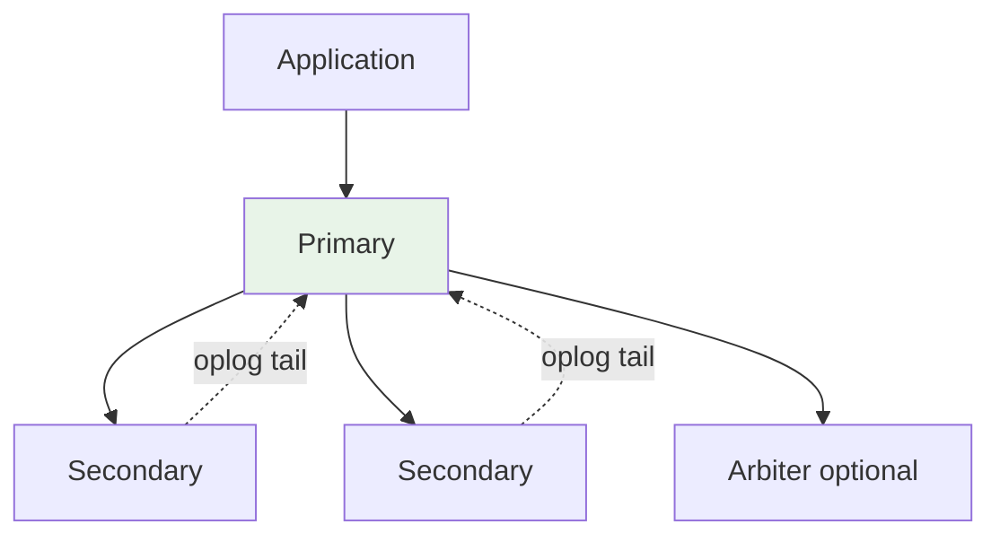
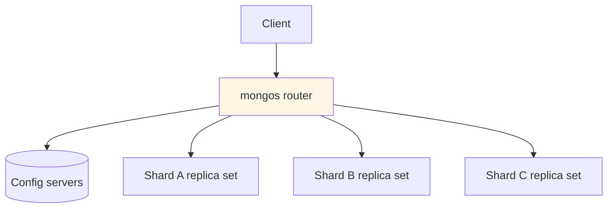
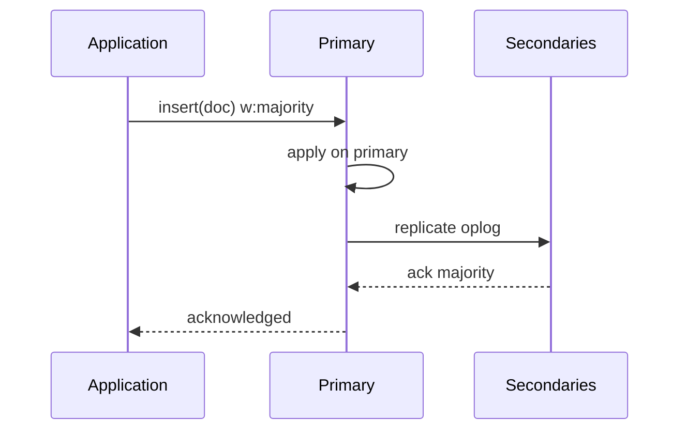

# MongoDB Architecture

## 1. Executive Summary

**MongoDB** is a distributed **document database** storing BSON documents in collections, optimized for flexible schemas, rich query patterns on documents, and horizontal scale via **sharding**. A **replica set** provides high availability through **primary-secondary replication** with automatic **leader election** (Raft-inspired consensus via MongoDB's replication protocol). The default storage engine **WiredTiger** provides document-level concurrency, compression, and checkpoint-based durability.

**Sharded clusters** partition data by **shard key** across **shards** (each a replica set), coordinated by **mongos** routers and **config servers** (replica set holding metadata). MongoDB offers tunable **write concern** and **read concern** mapping to durability and consistency tradeoffs—from **eventual** secondary reads to **linearizable** reads on primary with appropriate concerns.

Principal architects evaluate MongoDB for **document workloads**, **catalog/metadata**, and **operational simplicity** at scale—while avoiding it for heavy multi-document ACID across shards without careful design, unbounded scatter-gather queries, or relational join-heavy analytics. Every sharded deployment review should open with **shard key** and **write concern** documentation.

## 2. Why This Topic Matters

MongoDB appears in principal interviews for:

- **Replica set elections** — failover timing and split-brain prevention.
- **Shard key design** — monotonic vs hashed keys, jumbo chunks.
- **Write/read concern** — `majority`, `w:1`, causal consistency session.
- **Transactions** — single-document atomicity vs multi-document (4.0+).
- **vs DynamoDB/Cassandra** — when document model wins.

Bad shard keys cause **unmovable hotspots**; misunderstanding write concern causes **data loss** on failover.

MongoDB interviews at principal level are **shard-key design exercises** first and feature-list recitations second.

## 3. Problems Being Solved

| Problem | MongoDB approach |
|---------|------------------|
| **Flexible evolving schema** | Document model with optional validation |
| **Rich queries on documents** | Indexes, aggregation pipeline |
| **High availability** | Replica sets with automatic failover |
| **Horizontal scale** | Sharding by shard key |
| **Geographic distribution** | Replica set members in regions |
| **Change streams** | Real-time change notifications |

### Workload fit matrix

| Workload | Fit | Caveat |
|----------|-----|--------|
| Content management | Strong | Index design |
| User profiles / catalogs | Strong | Shard key for scale |
| IoT time series | Moderate | Consider TTL + shard key on time |
| Multi-tenant SaaS | Strong | Prefix shard key with tenant_id |
| Cross-shard JOIN analytics | Weak | ETL to warehouse |
| Ledger with strict serializability | Moderate | Transactions limited scope |

## 4. Assumptions and System Model

| Assumption | Implication |
|------------|-------------|
| **Replica set quorum** | Majority for elections and `majority` writes |
| **Shard key immutable** per document | Choose key carefully at design time |
| **Mongos routes by metadata** | Config servers are critical path |
| **WiredTiger MVCC** | Document-level locking |
| **Network partitions possible** | Write concern determines safety |

**Safety:** `writeConcern: majority` survives primary failure without acknowledged loss. **Liveness:** Elections complete with majority reachable; minority partition unavailable for writes.

## 5. Essential Terminology

| Term | Definition |
|------|------------|
| **Replica set** | Group of nodes with one primary |
| **Oplog** | Capped replication log of operations |
| **Shard key** | Indexed field(s) determining chunk distribution |
| **Chunk** | Range of shard key values on one shard |
| **Mongos** | Query router for sharded cluster |
| **Config servers** | Store cluster metadata |
| **Write concern** | Durability ack level (w, j, timeout) |
| **Read concern** | Consistency of read (`local`, `majority`, `linearizable`) |
| **Jumbo chunk** | Chunk too large to migrate—operational problem |
| **Change stream** | Tailable cursor on oplog-derived events |

## 6. Core Mechanism

### 6.1 Replica set architecture



*Figure 1: Primary accepts writes; secondaries replicate via oplog; election on primary failure.*

### 6.2 Sharded cluster



*Figure 2: Mongos routes queries using chunk metadata from config servers.*

### 6.3 Write path with majority concern



*Figure 3: Majority write concern waits for replication to majority before ack.*

## 7. Step-by-Step Walkthrough

### Walkthrough A: Primary failover

1. Primary stops heartbeating; secondaries detect timeout.
2. Election: candidate requests votes; majority required.
3. New primary elected; ~10-30s typical [deployment-dependent].
4. Clients retry writes; drivers refresh topology from replica set.
5. Rollback: if former primary had un-replicated writes, they are rolled back.

### Walkthrough B: Sharded query (targeted)

1. Query includes `user_id` equality—part of shard key.
2. Mongos routes to single shard owning chunk.
3. Shard replica set primary executes query.
4. Results return through mongos.

### Walkthrough C: Scatter-gather query

1. Query on non-prefix field without index routing.
2. Mongos fans out to all shards.
3. Each shard returns partial results; mongos merges.
4. **Performance warning:** does not scale linearly.

### Walkthrough D: Multi-document transaction (sharded)

1. Session starts transaction; mongos coordinates.
2. Two-phase commit across involved shards.
3. Higher latency; limited duration (default 60s)—use sparingly.

### Walkthrough E: Change stream consumer

1. Application opens change stream on `orders` collection with resume token.
2. Insert/update/delete events arrive with full document on update [configurable].
3. Consumer projects to Elasticsearch for search index—at-least-once processing with idempotent upsert.
4. Resume token persisted after successful ES ack—crash recovery from last token.
5. Lag monitored; alert if oplog window risk for long outages.

### Walkthrough F: Index strategy review

1. Query pattern: `{ tenant_id: 1, status: 1, created_at: -1 }` compound index created.
2. Explain plan shows IXSCAN instead of COLLSCAN—p95 drops 200ms → 8ms [illustrative].
3. Review index bloat quarterly; drop unused indexes from `$indexStats`.
4. Partial index on `status: "active"` reduces size for hot path.
5. Document index ownership in catalog linked to query SLO.

### Replica set election tuning (operations)

| Parameter | Consideration |
|-----------|---------------|
| `electionTimeoutMillis` | Lower = faster failover, more sensitivity to latency |
| Priority | Prefer stable nodes as primary candidates |
| Arbiter | Vote only—no data; use only when cost-constrained |
| Write concern majority | Required for production durability |
| Read preference | `primary` for read-your-writes; `secondaryPreferred` for scale |

### Walkthrough E: Resync after oplog window miss

1. Secondary falls behind primary during network partition longer than oplog retention window.
2. Secondary enters `RECOVERING` state; requires initial sync or resync from another secondary.
3. Application reads from stale secondary fail or return old data if not using `readConcern: majority`.
4. Operations increases oplog size and adds monitoring on `replLag` with page before window risk.
5. Architecture review documents minimum oplog hours = max maintenance duration + peak catch-up time + safety margin.

MongoDB principal interviews almost always include **drawing a shard key** for a given access pattern—practice on paper before the loop. State writeConcern majority before discussing read scaling. Elections and rollback behavior separate principal answers from developer trivia. Chunk migration and jumbo chunk monitoring belong in every sharded cluster runbook. Principal architects veto monotonic shard keys in architecture review before the first production write. Scatter-gather queries on hot paths are design failures, not tuning opportunities. Document read preference and write concern per API in the service catalog for every production MongoDB consumer. Oplog sizing is a capacity planning task, not an afterthought.

## 8. Invariants and Guarantees

| Configuration | Guarantee |
|---------------|-----------|
| **w:1, no journal** | Fast; may lose last writes on crash |
| **w:majority** | Acked writes survive single node failure |
| **readConcern majority** | Read data durable on majority |
| **linearizable read (primary)** | Strongest single-document read on primary |
| **Causal sessions** | Causal ordering across operations |

**CAP:** CP for majority writes in partition; minority partition loses liveness for writes.

## 9. Failure Scenarios

| Failure | Behavior | Mitigation |
|---------|----------|------------|
| **Bad shard key (monotonic)** | Single hot shard | Hashed shard key or compound |
| **Jumbo chunk** | Cannot balance | Key redesign; manual intervention |
| **Config server loss** | Metadata unavailable | Config as 3-node replica set |
| **Split brain (rare)** | Prevented by majority elections | Odd member count; avoid arbiters misuse |
| **Oplog window too small** | Secondary cannot resync | Increase oplog size |
| **Stepdown during index build** | Operation impact | Rolling maintenance windows |
| **Transaction timeout** | Abort | Keep transactions short |

## 10. Performance Characteristics

| Dimension | Behavior |
|-----------|----------|
| Single-doc write | Low ms on primary |
| Indexed query | Efficient with proper index |
| Aggregation pipeline | Powerful; memory limits apply |
| Scatter-gather | Poor at scale |
| Replication lag | Secondary reads may be stale |

WiredTiger cache sizing dominates working set fit—monitor **cache eviction**.

## 11. Scalability Limits

- **Shard count** practical limits—metadata and mongos fan-out.
- **Chunk migration** rate during balancing.
- **Global indexes** on sharded collections—each shard maintains index.
- **Transaction cross-shard**—latency and lock scope.
- **Document size** 16 MB limit.

## 12. Operational Considerations

- **Shard key** choice is permanent architecture decision—ADR required.
- Monitor **replication lag**, **opcounters**, **queued readers**, **chunk counts**.
- **Rolling upgrades** replica set members one at a time.
- **Backup**: filesystem snapshots consistent with `fsyncLock` or cloud backup service.
- **Index builds** online but resource-heavy.
- **Connection pooling** at application—avoid connection storms.
- **Document read preference** per API endpoint in service catalog—prevent accidental stale reads on money paths.
- **Chunk migration monitoring** during tenant onboarding; alert on jumbo chunk warnings.
- **Oplog sizing calculator** in runbook: peak write rate × maintenance window × safety factor.
- **Quarterly shard key review** for top 10 collections by storage growth.

## 13. Security Considerations

- **Authentication** (SCRAM-SHA) and **role-based access control**.
- **TLS** for all connections.
- **Encryption at rest** (WiredTiger encrypted storage engine).
- **Field-level encryption** client-side for sensitive fields.
- **Network isolation**—no public mongod without bastion.

## 14. Cost Considerations

- **Atlas** vs self-managed—ops labor tradeoff.
- **Shard proliferation**—each shard is full replica set.
- **Storage** growth from indexes duplicating shard key.
- **Over-provisioned shards** for future scale—delay sharding until needed.
- **IO costs** on cloud disks for WiredTiger.

### Oplog and replication lag deep dive

Secondaries fall behind when primary write rate exceeds secondary apply capacity—common during bulk loads without `writeConcern` throttling. Lag &gt; oplog window forces **full resync** (hours of downtime risk for that secondary). Monitor `replLag` and size oplog for **maintenance window + peak load duration**. Principal architects schedule bulk loads through `mongodump/mongorestore` or temporarily scale secondary tier—not blind `insertMany` at max rate.

### Atlas vs self-managed decision

| Factor | Atlas | Self-managed |
|--------|-------|--------------|
| Ops burden | Lower | Higher |
| Custom tuning | Limited | Full |
| VPC peering | Supported | DIY |
| Compliance certs | Inherited | Your audit |
| Cost at scale | Premium | Engineering tradeoff |

### Change streams vs Debezium

Change streams are simpler for Mongo-native apps—no separate connector JVM. Debezium better when unified CDC bus feeds Kafka for multiple consumers (warehouse, search, cache). Architecture choice depends on **consumer count** and **existing Kafka investment**, not Mongo capability alone.

## 15. Production Implementations

### Case study: Multi-tenant SaaS catalog (illustrative)

#### Context

10M tenants; product catalog documents; 50k ops/sec peak.

#### Design

Sharded cluster; shard key `{tenant_id: 1, product_id: 1}`—tenant isolation, even distribution within tenant via product_id.

#### Read path

`readPreference: secondaryPreferred` for catalog browse; primary for inventory updates with `writeConcern: majority`.

#### Pitfall avoided

Initial `{product_id: 1}` only—hot shard on sequential IDs; redesigned before production.

#### Extended operations narrative

Production incident: election during index build extended write outage to 45s—now schedule heavy index builds off-peak. Change stream consumer lagged 20 minutes during oplog window scare—oplog resized 3×. Sharded cluster balancer migrated 400 chunks during tenant onboarding without app impact—validated shard key `{tenant_id, product_id}` design. Atlas performance advisor recommended compound index saving 30% read CPU [illustrative].

## 16. Alternatives and Tradeoffs

| System | Comparison |
|--------|------------|
| **DynamoDB** | Managed KV; less flexible ad hoc query |
| **Cassandra** | Wide-column; tunable consistency per query |
| **PostgreSQL JSONB** | ACID relational + JSON; vertical scale limits |
| **Couchbase** | Similar document + KV |

Choose MongoDB for **document model**, **aggregation**, and **mature sharding** with operational familiarity.

## 17. Common Misconceptions

| Misconception | Reality |
|---------------|---------|
| "MongoDB is schemaless" | Schema validation recommended |
| "Sharding is automatic magic" | Shard key design is manual and critical |
| "Secondary reads always OK" | Stale reads without `majority` concern |
| "Transactions free" | Cross-shard transactions costly |
| "Embed everything" | Document size and update amplification |

## 18. Principal Architect Perspective

1. **Shard key workshop** before first sharded deploy.
2. **Default writeConcern majority** for production durability.
3. **Avoid scatter-gather** in hot paths—design queries with shard key.
4. **Atlas** unless strong self-host ops team.
5. **Sync analytics** to warehouse—not heavy aggregation on primaries.

MongoDB at scale is **shard-key architecture** first, database second. Principal sign-off on any sharded deployment should include query pattern analysis and write concern documentation in the service catalog. Run **election and rollback drills** before declaring HA complete.

### Operating playbook (first 90 days)

**Days 1–30:** Verify all prod replica sets use `writeConcern: majority`. Document shard key ADR before any sharded deploy.

**Days 31–60:** Enable query profiling on slow operations; review indexes via `$indexStats`. Size oplog for peak load + maintenance window.

**Days 61–90:** Chaos test primary failover; measure election time vs app retry config. Change stream or CDC path documented for search/analytics consumers.

## 19. Architecture Review Exercise

**Scenario:** Shard key `created_at` timestamp; insert rate 50k/sec.

**Findings:** Single hot chunk; monotonic key anti-pattern. Migrate to hashed `_id` or compound `{tenant_id, hashed_id}`.

## 20. Whiteboard Explanation

"MongoDB stores BSON documents. A replica set has one primary accepting writes and secondaries tailing the oplog. Writes use a write concern—majority waits for replication to most nodes before ack. Sharding splits data into chunks by shard key ranges; mongos routers direct queries using metadata in config servers. Targeted queries including the shard key hit one shard; others scatter-gather. WiredTiger provides MVCC and compression. Elections pick a new primary on failure in seconds if majority exists. The architectural crux is shard key choice—it determines balance and query locality."

**Principal addendum:** Walk through bad key `created_at` creating hot chunk; fix with `{tenant_id, hashed_id}`. Stress **writeConcern majority** and that scatter-gather on hot paths is a design failure.

## 21. Interview Questions

1. **Replica set purpose?** — HA and read scaling.
2. **Oplog role?** — Replication log for secondaries.
3. **Shard key importance?** — Data distribution and query routing.
4. **Mongos function?** — Query router in sharded cluster.
5. **writeConcern majority?** — Durability across majority nodes.
6. **Jumbo chunk problem?** — Cannot migrate; hotspot.
7. **Scatter-gather query?** — Fan-out to all shards.
8. **Election requirement?** — Majority votes.
9. **WiredTiger?** — Default storage engine with MVCC.
10. **Change streams?** — Real-time data change feed.
11. **Causal consistency sessions?** — Ordered reads across ops.
12. **When not MongoDB?** — Heavy relational joins at scale.
13. **Arbiter tradeoff?** — Vote without data—use carefully.
14. **Rollback on failover?** — Unreplicated writes lost on old primary.

### Scoring rubric (principal)

| Dimension | Strong | Weak |
|-----------|--------|------|
| Sharding | Key design, chunks | "Auto scales" |
| Consistency | write/read concern | Ignores durability |
| Failover | Elections, rollback | "Replicas sync instantly" |
| Anti-patterns | Monotonic keys, scatter | Generic NoSQL |

### Extended scoring notes

**Principal bar:** Candidate names oplog, elections, and chunk migration without prompting. Bonus for discussing rollback of uncommitted writes on failed primary. **Staff bar:** Designs shard key for given SaaS schema with tradeoff narration. **Weak hire:** Treats MongoDB as "schemaless JSON in cloud" with no durability discussion.

15. **Change stream vs polling?** — Push, resume token, lower latency.
16. **readConcern majority use?** — Avoid stale secondary reads after failover.
17. **When GridFS?** — Documents &gt;16 MB binaries.

## 22. Interview Follow-Ups

1. **Design shard key for multi-tenant SaaS.** — `tenant_id` prefix + hashed secondary.
2. **Primary dies mid w:1 write.** — Write may be lost; client unaware.
3. **Balance chunks after tenant growth.** — MongoDB balancer migrates chunks.
4. **Read from secondary stale—fix?** — `readConcern: majority` or primary read.
5. **16 MB document limit hit.** — GridFS or normalize schema.

### Additional principal scenarios

**Scenario:** App team wants transactional guarantees across 10 shards. **Answer:** Multi-document transactions possible but high latency—redesign document boundaries or use saga pattern at application layer.

**Scenario:** Secondary reads show stale inventory sold out. **Answer:** Inventory checkout must use `readPreference: primary` with `readConcern: majority`; secondaries only for browse.

**Scenario:** Atlas auto-scaling shards during steady state. **Answer:** Review if shard count exceeds need; each shard is replica set cost; right-size keys before horizontal scale.

## 23. Strong Answer Example

**Question:** "Explain MongoDB sharding and shard key selection."

**Strong outline:** "Data is partitioned into chunks—ranges of shard key values—each owned by one shard replica set. Mongos routers cache chunk metadata from config servers and route operations to the correct shard. The shard key is immutable per document and determines both distribution and query efficiency. A good key provides high cardinality, even distribution, and aligns with common query patterns—e.g., `{tenant_id: 1, record_id: 1}` for multi-tenant apps. Bad keys like monotonically increasing timestamps create a single hot shard because all new inserts land in the latest chunk. Hashed keys improve distribution but may prevent efficient range queries. Changing shard key later requires migration—it's an upfront architecture decision. Scatter-gather queries without shard key in filter don't scale because every shard must participate."

## 24. Weak Answer Example

**Weak:** "MongoDB shards automatically when data grows; you don't need to think about keys."

**Red flags:** No shard key, mongos, or chunk concepts.

## 25. Hands-On Exercise

1. Deploy 3-node replica set locally; kill primary; observe election.
2. Insert with `w:1` vs `majority`; compare failover behavior discussion.
3. Create sharded cluster; test targeted vs scatter query explain plans.
4. Watch chunk migration during balancer.
5. Design shard keys for three sample schemas.

## 26. Knowledge Check

1. Primary role? *(Accept writes.)*
2. Oplog is? *(Replication operation log.)*
3. Mongos routes? *(Sharded queries.)*
4. Majority write survives? *(Single node failure without ack loss.)*
5. Jumbo chunk? *(Too large to migrate.)*
6. WiredTiger provides? *(MVCC storage engine.)*
7. Config servers store? *(Sharding metadata.)*
8. Hot shard cause? *(Poor shard key.)*
9. Change streams source? *(Oplog-based.)*
10. Document size limit? *(16 MB.)*
11. Majority write survives? *(Single node failure without ack loss.)*
12. Scatter-gather hits? *(All shards.)*
13. Arbiter provides? *(Vote without data.)*

## 27. Flashcards

| Front | Back |
|-------|------|
| Replica set | HA group with one primary |
| Oplog | Capped replication log |
| Shard key | Determines data distribution |
| Chunk | Shard key range on one shard |
| Mongos | Sharded cluster query router |
| writeConcern | Write durability acknowledgment |
| readConcern | Read consistency level |
| WiredTiger | Default MongoDB storage engine |
| Jumbo chunk | Unmigratable oversized chunk |
| Change stream | Real-time change notification |

## 28. Cheat Sheet

```
REPLICA SET
  Primary + secondaries + oplog | elections need majority

SHARDING
  mongos + config servers + shard replica sets | KEY DESIGN CRITICAL

DURABILITY
  writeConcern: {w: "majority", j: true} for production

AVOID
  Monotonic shard keys | scatter-gather hot paths | huge documents

PRINCIPAL ANCHORS
  Shard key ADR required
  writeConcern majority prod
  Oplog sized for maintenance
  Primary for money reads
  Chunk migration watch
  Index from $indexStats
  Change streams need resume token
  Elections need majority
```

## 29. Related Concepts

- [Primary-Secondary Replication](/docs/replication/primary-secondary-replication) — replication pattern
- [Quorum Systems](/docs/consistency/quorum-systems) — majority semantics
- [LSM Trees](/docs/storage-engines/lsm-trees) — WiredTiger contrast with LSM
- [Amazon DynamoDB](/docs/distributed-databases/dynamodb) — alternative NoSQL
- [Leader Election](/docs/consensus/leader-election) — failover theory

## 30. References

### Primary sources

- MongoDB Manual — replica sets, sharding, read/write concerns.
- MongoDB architecture guides — WiredTiger, replication protocol.

### Related

- Chodorow, K. *MongoDB: The Definitive Guide* — operational depth.
- Original MongoDB design docs — document model rationale.

### Principal study path

Review [Primary-Secondary Replication](/docs/replication/primary-secondary-replication), [Quorum Systems](/docs/consistency/quorum-systems), [Amazon DynamoDB](/docs/distributed-databases/dynamodb) for alternative NoSQL, and [Leader Election](/docs/consensus/leader-election) for failover theory connecting to replica set elections. Whiteboard shard key design for every MongoDB interview—you will be asked.

### Distinction

| Claim | Type |
|-------|------|
| writeConcern semantics | MongoDB manual |
| Election timing | Deployment-dependent |
| Transaction limits | Version-specific—verify docs |
