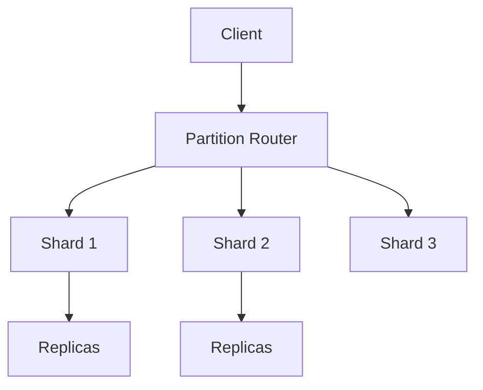

# Distributed Databases

Production distributed data systems—Dynamo lineage, globally consistent SQL, event logs, and in-memory stores—with explicit tradeoffs for principal-level architecture decisions.

*Figure: Sharded distributed database with per-partition replication.*

## Chapters

| Chapter | Focus |
|---------|-------|
| [Amazon Dynamo](/docs/distributed-databases/amazon-dynamo) | 2007 paper: quorums, vector clocks, hinted handoff |
| [DynamoDB](/docs/distributed-databases/dynamodb) | AWS managed key-value/document store |
| [Apache Cassandra](/docs/distributed-databases/apache-cassandra) | Wide-column, tunable consistency, LSM storage |
| [Google Spanner](/docs/distributed-databases/google-spanner) | TrueTime, external consistency, global SQL |
| [Apache Kafka](/docs/distributed-databases/apache-kafka) | Distributed commit log, partitions, ISR |
| [Redis](/docs/distributed-databases/redis) | In-memory structures, Cluster, Sentinel |

## Learning Path

1. Start with **Amazon Dynamo** to understand quorum replication and conflict detection—the foundation for Cassandra and DynamoDB naming.
2. Read **DynamoDB** and **Cassandra** together to compare managed vs self-managed wide-column design.
3. Study **Spanner** for global strong consistency and clock infrastructure tradeoffs.
4. Cover **Kafka** as a replicated log primitive for event-driven architectures.
5. Finish with **Redis** for latency-critical caching and coordination patterns.

## Related Domains

- [Replication](/docs/replication/overview) — quorum and leader-based models
- [Consistency](/docs/consistency/overview) — CAP, PACELC, linearizability
- [Storage Engines](/docs/storage-engines/overview) — LSM trees under Cassandra/DynamoDB
- [Messaging and Streaming](/docs/messaging-and-streaming/overview) — broader event platform context

Return to the [Curriculum Overview](/docs/start-here/curriculum-overview) to see how this domain fits the learning path.
