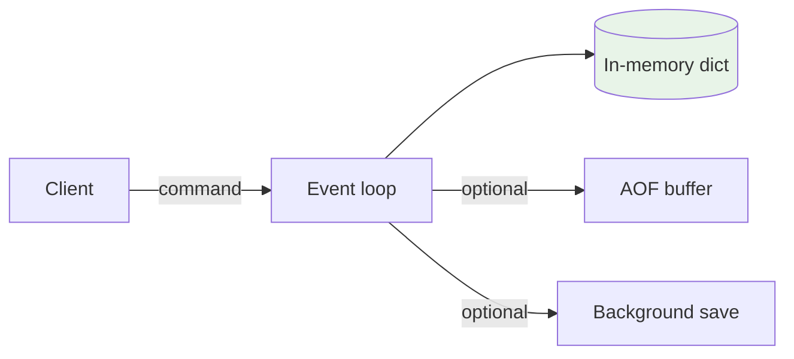
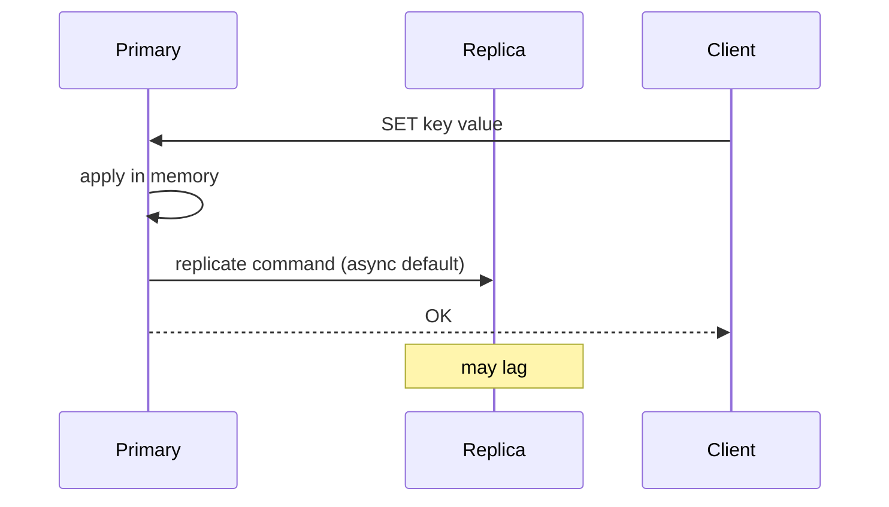
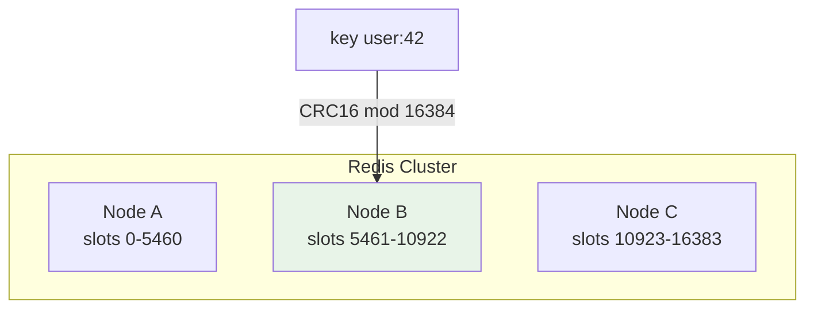

# Redis

## 1. Executive Summary

**Redis** is an in-memory **data structure server** supporting strings, hashes, lists, sets, sorted sets, streams, and more—with optional **durability** via **RDB snapshots** and **AOF (Append-Only File)** logging. Single-threaded command execution per shard gives **predictable latency** without lock contention on hot keys (at cost of CPU ceiling per instance). **Redis Sentinel** provides **high availability** through leader monitoring and failover for primary-replica topologies. **Redis Cluster** shards data across **16,384 hash slots** with **gossip**-based cluster state and **majority failover** rules.

Redis is frequently deployed as **cache**, **session store**, **rate limiter**, **distributed lock** (with caveats), **pub/sub** bus, and **stream** processor—but principal architects must distinguish **cache semantics** from **database semantics**, understand **eviction** and **TTL**, and avoid **unsafe lock patterns** without fencing tokens.

This chapter covers Redis architecture, consistency and durability tradeoffs, cluster operations, failure modes, and a production case study.

Redis rewards architects who write down **what happens when memory is full, when the primary dies, and when the cache misses**—three questions that separate a deliberate caching layer from an accidental database. The best Redis deployments have small, well-named key namespaces with TTLs, eviction policies, and failover RPOs that stakeholders have explicitly accepted.

**Managed variants:** AWS ElastiCache, MemoryDB, and Azure Cache for Redis differ in failover mechanics, persistence, and Cluster support—always read vendor SLAs rather than assuming open-source Redis behavior transfers one-to-one.

For **rate limiting** at the edge, Redis is excellent; combine with application-level token buckets and CDN throttling so a Redis outage does not open an unbounded traffic flood to origin databases.

Interviewers frequently pair Redis with **DynamoDB or Cassandra** questions: use Redis for sub-millisecond working set; use the durable store for authoritative state and replay after cache warm-up or regional failover events in production architectures.

## 2. Why This Topic Matters

Redis appears in nearly every high-scale architecture. Interview depth includes:

- **Cache-aside vs read-through** and **invalidation** storms.
- **RDB vs AOF** durability and recovery time.
- **Cluster slot migration** and **CROSSSLOT** errors.
- **Sentinel vs Cluster** selection.
- **Redlock controversy** and **fencing tokens**.
- **Memory limits** and **eviction policies**.

Production incidents: OOM evictions of critical keys, AOF rewrite blocking, split-brain without Sentinel quorum, hot keys on single shard, treating Redis as source of truth without persistence SLAs.

## 3. Problems Being Solved

| Problem | Redis approach |
|---------|----------------|
| **Sub-millisecond reads** | In-memory structures |
| **Session storage** | TTL keys; hash per session |
| **Rate limiting** | INCR + EXPIRE; sliding window with sorted sets |
| **Leaderboards** | Sorted sets |
| **Pub/sub notifications** | Fire-and-forget channels |
| **Stream processing** | Redis Streams consumer groups |
| **Stream processing** | Redis Streams consumer groups |

### Workload fit matrix

| Workload | Fit | Caveat |
|----------|-----|--------|
| Session cache | Strong | Async replication RPO |
| Rate limiting | Strong | Atomic scripts |
| Primary ledger | Weak | Memory bounds; persistence limits |
| Full-text search | Weak | Use OpenSearch |
| Pub/sub alerts | Moderate | Not durable |
| Distributed lock | Risky | Redlock debate; use fencing |

Redis wins on **latency and simplicity** for working-set data; it loses when dataset exceeds RAM budget or durability SLOs exceed what RDB/AOF comfortably provide.

### Persistence decision tree

| Requirement | Recommendation |
|-------------|----------------|
| Pure cache, loss OK | No persistence; cluster + TTL |
| Session, minutes RPO | AOF everysec + replica |
| Durability critical | Reconsider Redis as SoT; MemoryDB or OLTP |
| Fast restart | RDB snapshots + AOF hybrid |
| Lowest latency writes | Avoid AOF always fsync |

Principal reviews should document **accepted data loss window** on failover explicitly in the architecture decision record—not buried in runbooks.

## 4. Assumptions and System Model

| Assumption | Implication |
|------------|-------------|
| **Dataset mostly in RAM** | Memory caps capacity; eviction applies |
| **Single-threaded command path** | One CPU core per primary process |
| **Crash-stop** | Replication + persistence for durability |
| **Eventual replication** | Async replica lag by default |
| **Cluster: hash slot ownership** | Multi-key ops need same slot |

**Safety:** No lost acknowledged writes on sync replication configurations; default async may lose recent writes on failover. **Liveness:** Sentinel/Cluster promotes replica on primary failure.

## 5. Essential Terminology

| Term | Definition |
|------|------------|
| **Primary / replica** | Formerly master/slave; replication topology |
| **RDB** | Point-in-time snapshot file |
| **AOF** | Log of mutating commands |
| **fsync policy** | `always`, `everysec`, `no` |
| **Eviction policy** | `allkeys-lru`, `volatile-lru`, etc. |
| **TTL** | Key expiration |
| **Sentinel** | HA monitor and failover orchestrator |
| **Hash slot** | Cluster partition unit (16384 slots) |
| **MOVED / ASK** | Cluster redirect responses |
| **Streams** | Append-only log per key with consumer groups |
| **MEMORY MAXMEMORY** | Hard memory limit trigger |

## 6. Core Mechanism

### 6.1 Single-instance command path



*Figure 1: Single-threaded event loop executes commands against in-memory structures; persistence optional.*

### 6.2 Primary-replica replication



*Figure 2: Default asynchronous replication—replica may be stale; recent writes may be lost on failover.*

### 6.3 Redis Cluster sharding



*Figure 3: Keys map to hash slots; each master owns slot ranges with replicas.*

## 7. Step-by-Step Walkthrough

### Walkthrough A: Cache-aside

1. App `GET` cache miss → read DB.
2. App `SET` Redis with TTL 300s.
3. App `GET` hit → return.
4. On DB update, app deletes cache key (or uses versioned key).

### Walkthrough B: Sentinel failover

1. Primary stops responding.
2. Sentinels agree quorum (e.g., 2 of 3).
3. Promote best replica; clients directed to new primary.
4. Async replication: last seconds of writes may be lost.

### Walkthrough D: Probabilistic cache stampede prevention

1. Hot key expires at T.
2. Multiple clients miss simultaneously.
3. App uses per-key mutex or request coalescing for refresh.
4. Optional: jitter TTL (`300 ± 30s`) spreads expirations.

### Walkthrough F: Hash tag co-location

1. Application stores `user:42:profile` and `user:42:cart` keys.
2. Uses hash tags `{user:42}:profile` and `{user:42}:cart`—same slot.
3. `MULTI`/`EXEC` transaction succeeds in Cluster.
4. Without tags, `CROSSSLOT` error on multi-key transaction.
5. Document tag cardinality to avoid slot hotspots.

## 8. Invariants and Guarantees

| Mode | Guarantee |
|------|-----------|
| Single primary | Linearizable command execution per key |
| Async replication | Committed on primary may not be on replica |
| `WAIT` command | Block until N replicas ack (rare) |
| Cluster single key | Atomic per command |
| Multi-key (same slot) | `MGET`, `MULTI` if keys hash to same slot |
| Streams consumer groups | At-least-once with ACK and pending list |

**Not guaranteed:** Durability without AOF/RDB; strong consistency across shards; safe distributed locks without fencing.

## 9. Failure Scenarios

| Failure | Effect | Mitigation |
|---------|--------|------------|
| **OOM** | Evictions or reject writes | Memory limits; monitoring |
| **AOF rewrite fork** | Latency spike | `no-appendfsync-on-rewrite` tradeoffs |
| **Split-brain** | Dual primaries | Sentinel quorum; `min-replicas-to-write` |
| **Hot key** | Single shard CPU 100% | Local cache; key splitting |
| **Big key** | Blocking DEL; slow replication | Hash tags; unlink async delete |
| **Cache stampede** | DB overload on miss | Probabilistic early expiration; lock |
| **Redlock without fencing** | Stale lock holder writes | Fencing tokens |

### Memory optimization patterns

| Pattern | Technique |
|---------|-----------|
| Small hashes | `HASH` with encoding thresholds [version-specific] |
| JSON blob | Compress or store reference to object store |
| Session fields | Hash vs serialized JSON—measure memory |
| Shared structures | `HyperLogLog` for cardinality sketches |

### Scenario narratives

**Cache stampede on viral content:** Celebrity post busts cache TTL simultaneously for millions of keys sharing hot fragment. PostgreSQL connection pool exhausts. Mitigation: request coalescing, per-key locks, stale-while-revalidate pattern, CDN layer above Redis.

**AOF rewrite on 64 GB instance:** `BGREWRITEAOF` forks; copy-on-write doubles memory pressure; latency p99 spikes. Mitigation: schedule rewrite off-peak; consider `no-appendfsync-on-rewrite` with accepted RPO tradeoff; split data across cluster nodes.

## 10. Performance Characteristics

| Dimension | Behavior |
|-----------|----------|
| Latency | Sub-ms for simple ops (local network) |
| Throughput | ~100k–1M ops/sec per core [workload-dependent] |
| Memory | Primary cost driver |
| Persistence | RDB: periodic fork; AOF: append cost |
| Cluster | Cross-slot multi-key ops fail |

## 11. Scalability Limits

- **Single primary CPU** — vertical scale until thread saturated.
- **Cluster** — multi-key transactions limited; ops complexity.
- **Memory** — dataset must fit aggregate RAM (with eviction tradeoffs).
- **Pub/sub** — not durable; fan-out memory on subscribers.
- **Large values** — block replication; network heavy.

## 12. Operational Considerations

- Set **maxmemory** and **eviction policy** explicitly per instance role.
- Monitor **used_memory**, **replication lag**, **blocked clients**, **instantaneous_ops_per_sec**.
- **Backup**: RDB snapshots to object storage; test restore into isolated cluster.
- **Version upgrades** and **ACL** users per service; rotate credentials.
- **Cluster**: `redis-cli --cluster check` after topology changes.
- **Latency doctor** and **memory doctor** after version upgrades.
- **Client-side**: connection pooling, timeout, circuit breaker to DB on cache miss storm.
- **Separate instances** for cache vs coordination vs rate limiting blast radius.
- **Active defrag** (where supported) during maintenance windows for fragmented instances.
- **Runbook**: primary failover—verify replica `role:slave`, `master_link_status:up` before drill.

## 13. Security Considerations

- **ACLs** per application; disable `FLUSHALL` for app users.
- **TLS** for data in transit.
- **Bind** interfaces; no public Redis without auth [common incident].
- **Lua scripting** sandbox—avoid untrusted scripts.
- **Cache data classification**—sessions contain secrets.

## 14. Cost Considerations

- **RAM pricing** dominates vs disk databases.
- **Cluster nodes** × replicas for HA.
- **Elasticache / MemoryDB** managed premium vs self-host.
- **Over-caching** stale data cost in application complexity.

## 15. Production Implementations

### Case study: API rate limiting and session cache

#### Business context

Public API platform needs per-API-key rate limits and fast session validation for millions of mobile clients.

#### Scale

Illustrative: 200k requests/sec peak; 50M active sessions; average session 1 KB.

#### Functional requirements

- Token bucket rate limit per API key.
- Session get/set with 24h TTL.
- Invalidate session on logout.

#### Non-functional requirements

- p99 session read < 2 ms.
- Rate limit accuracy ± few percent acceptable.
- Survive single AZ node loss.

#### Architecture overview

Redis Cluster 6 nodes (3 primaries, 3 replicas) across 3 AZs. Hash tags `{session}:userId` co-locate related keys if needed. Separate logical DB or key prefix for rate limits vs sessions.

#### Data model

- `session:<uuid>` → hash fields
- `ratelimit:<apiKey>:<window>` → string counter with TTL
- Sorted set optional for sliding window precision

#### Partitioning

Cluster hash slots; high-cardinality session keys spread evenly; avoid single hot API key—shard counters per key suffix if needed.

#### Replication

Async replica per primary; automatic failover via Cluster; accept small RPO for sessions.

#### Consistency

Session: cache-aside from authoritative DB on miss; rate limit approximate OK.

#### Availability

Cluster failover ~seconds; clients use smart cluster driver with refresh.

#### Failure handling

Cache miss storm → circuit breaker to DB; hot key → local in-process LRU for rate limit burst; memory pressure → volatile-lru on rate keys only via separate instances.

#### Security

TLS in transit; ACL per microservice; no session PII in rate limit keys.

#### Observability

Redis INFO metrics; latency doctor; alert on evicted_keys spike and replication lag.

#### Cost model

Memory: 50M × 1 KB ≈ 50 GB + overhead; 3× for replicas in cluster layout; compare to DB read offload savings.

#### Evolution

Started single primary + Sentinel → memory ceiling → Cluster. Split rate limiting to dedicated small cluster to isolate eviction policies.

#### Tradeoffs

| Decision | Rationale |
|----------|-----------|
| Cluster vs Sentinel | Horizontal memory scale |
| Async replication | Latency vs RPO |
| Separate clusters | Blast radius isolation |
| TTL sessions | Automatic cleanup |

#### Known limitations

Not authoritative for billing; rate limit race without Lua atomicity; cross-slot multi-key limited.

#### Interview lessons

Clarify **cache vs source of truth**; state **failover RPO**; hot key mitigation; avoid unsafe Redlock claims.

#### Redesign exercise (case study)

**Prompt:** Team uses Redlock for inventory deduction.

**Strong direction:** OLTP row locks or conditional updates; Redis cache only; fencing tokens if locks required.

Redis memory planning: budget **1.5–2× raw dataset** for fragmentation and rewrite COW [rule of thumb—validate with `INFO memory`].

## 16. Alternatives and Tradeoffs

| System | When |
|--------|------|
| **Memcached** | Pure cache; simpler; no persistence |
| **DynamoDB DAX** | AWS-integrated cache |
| **KeyDB** | Multi-threaded Redis fork |
| **Dragonfly** | Modern multi-thread in-memory store |
| **Hazelcast** | JVM ecosystem data grid |

## 17. Common Misconceptions

| Misconception | Reality |
|---------------|---------|
| "Redis is always a cache" | Can be primary store with persistence |
| "Replication = durable" | Async lag loses recent writes |
| "Redlock is always safe" | Debated; needs fencing for storage |
| "Cluster = automatic even distribution" | Hot keys still exist |
| "Pub/sub is a message queue" | Not durable; fire-and-forget |

## 18. Principal Architect Perspective

1. **Define RPO/RTO** for Redis if used beyond pure cache.
2. **Isolate clusters** by blast radius (sessions vs rate limits).
3. **Document eviction policy** impact on each key class.
4. **Prefer fencing tokens** over naive distributed locks.
5. **Load test failover**—not just steady state.
6. **Separate eviction policies** per cluster role (sessions vs rate limits).
7. **Document cache stampede** mitigations in runbooks before viral events.

Redis incidents during traffic spikes are often **memory policy** incidents: `allkeys-lru` evicting session keys while rate-limit keys remain because of `volatile-lru` misconfiguration across shared instances.

**Production readiness checklist:** (1) Separate clusters by eviction policy and blast radius. (2) Documented RPO on async failover with chaos validation. (3) `maxmemory` set below OS limit to avoid OOM killer. (4) Big key scan (`--bigkeys`) in monthly hygiene. (5) TLS and ACL rotation calendar. (6) Explicit decision record: cache vs source of truth per key namespace. Skipping (6) is how Redis becomes the surprise system of record after a PostgreSQL outage—with no backup discipline.

**Principal bar:** Articulate cache-aside, TTL, eviction policy, failover RPO, and hot-key mitigation in one coherent session-store design without invoking Redlock or other unsafe distributed lock patterns on shared durable storage backends.

## 19. Architecture Review Exercise

**Scenario:** `MULTI` transaction across user profile and user cart keys in Cluster—different slots.

**Findings:** CROSSSLOT error; redesign with hash tags `{user42}:profile` and `{user42}:cart` or denormalize.

## 20. Whiteboard Explanation

"Redis keeps data in memory on a single-threaded event loop for low-latency commands. Durability is optional: RDB snapshots or AOF command log with configurable fsync. Primary-replica replication is async by default—failover may drop the last seconds of writes unless you use WAIT or synchronous settings. Redis Cluster partitions keys into 16,384 hash slots across masters, each with replicas; the client follows MOVED redirects. Sentinel monitors standalone primaries and promotes replicas on failure. Use it for caching, sessions, rate limits, and coordination—but know memory limits, hot keys, and that it's not a full SQL database."

**Extended principal addendum:** Explain **cache-aside** vs **read-through** and thundering herd. State clearly why **Redlock** without fencing failed Martin Kleppmann's storage test. Recommend **hash tags** for atomic multi-key updates in Cluster. Compare **ElastiCache** failover behavior (DNS-based) vs **Cluster** slot migration ops burden.

## 21. Interview Questions

1. **RDB vs AOF?** — Snapshot vs command log durability.
2. **Eviction policies?** — LRU/LFU variants when maxmemory hit.
3. **Sentinel vs Cluster?** — HA for single shard vs sharding.
4. **Cache-aside pattern?** — App loads DB on miss.
5. **Hot key mitigation?** — Local cache; read replicas; split key.
6. **Why single-threaded?** — Simplicity; lock-free hot path.
7. **Hash slot count?** — 16384 in Cluster.
8. **Streams vs pub/sub?** — Persistent log vs ephemeral fan-out.
9. **Redlock concern?** — Clock/process pause; use fencing.
10. **TTL use case?** — Session expiration.
11. **WAIT command?** — Block until N replicas ack write.
12. **MemoryDB vs Redis?** — AWS durable Redis-compatible service.
13. **Pub/sub durability?** — None; use Streams.
14. **Big key risk?** — Blocks event loop; slow replication.

### Scoring rubric (principal)

| Dimension | Strong | Weak |
|-----------|--------|------|
| Role clarity | Cache vs SoT documented | "Redis is our database" |
| HA | Sentinel/Cluster + RPO stated | Ignores async replication |
| Cluster | Hash tags for multi-key | CROSSSLOT surprise |
| Locks | Fencing or avoid Redlock | "Redlock is safe" |

## 22. Interview Follow-Ups

1. **Session store failover RPO?** — Async replication window.
2. **Atomic rate limit implementation?** — Lua or INCR+EXPIRE script.
3. **Design hash tags for multi-key tx.** — Same slot curly braces.
4. **AOF rewrite impact?** — fork latency on large datasets.
5. **When Memcached over Redis?** — Pure cache simplicity.

## 23. Strong Answer Example

**Question:** "Design Redis for session storage with HA."

**Strong outline:** "Use Redis Cluster with three primaries and replicas across AZs for horizontal memory and automatic failover. Sessions keyed `session:<uuid>` with TTL 24h; values as hashes. Application uses cache-aside: authoritative user record stays in PostgreSQL; Redis is performance layer. On logout, explicit DEL. Accept async replication RPO of a few seconds—document that rare re-login after failover is acceptable. Monitor memory, evictions, and replication lag; separate cluster from rate-limit workloads to avoid eviction cross-talk. TLS and ACLs per service. Do not use Redlock for session correctness—sessions are independent keys with TTL, not locks."

## 24. Weak Answer Example

**Weak:** "Store sessions in Redis; it replicates so it's durable and consistent."

**Red flags:** No TTL; ignores async RPO; no cluster/memory plan; conflates cache with DB.

## 25. Hands-On Exercise

1. Run Redis locally; implement cache-aside against SQLite mock.
2. Enable AOF `everysec`; kill -9 primary; measure data loss window with replica.
3. Create Cluster (Docker); trigger MOVED with wrong node client.
4. Implement rate limiter with INCR+EXPIRE.
5. Simulate hot key with `redis-benchmark` single key.

## 26. Knowledge Check

1. Default replication mode? *(Async.)*
2. Cluster slots? *(16384.)*
3. Eviction when? *(maxmemory exceeded.)*
4. Sentinel quorum purpose? *(Failover agreement.)*
5. Streams delivery? *(At-least-once consumer groups.)*
6. Hash tag syntax? *(Curly braces in key: `{tag}:field`.)*
7. AOF fsync always tradeoff? *(Durability vs latency.)*
8. volatile-lru evicts? *(Keys with TTL only.)*
9. PEL in Streams? *(Pending entries after crash before XACK.)*
10. MEMORY DOCTOR shows? *(Memory efficiency issues—version feature.)*

## 27. Flashcards

| Front | Back |
|-------|------|
| RDB | Snapshot persistence |
| AOF | Append-only command log |
| Sentinel | HA monitoring/failover |
| Hash slot | Cluster partition unit |
| MOVED | Permanent slot redirect |
| ASK | Temporary migrate redirect |
| maxmemory | Memory limit trigger |
| volatile-lru | Evict keys with TTL |
| Cache-aside | App manages cache fill/evict |
| WAIT | Sync replication command |

## 28. Cheat Sheet

```
TOPOLOGY
  Standalone + Sentinel → HA single shard
  Cluster → sharded + HA

PERSISTENCE
  RDB: periodic snapshot, faster restart
  AOF: finer RPO; rewrite cost
  fsync always | everysec | no

PATTERNS
  cache-aside + TTL
  rate limit: INCR + EXPIRE / ZSET window
  locks: prefer fencing tokens

CLUSTER
  16384 slots; hash tags {tag}:key
  multi-key needs same slot

OPS
  maxmemory + eviction policy
  monitor: memory, lag, evicted_keys
  chaos: primary failover during peak write traffic monthly game day exercise
  principal review: cache vs SoT per namespace documented in architecture decision records
```

## 29. Related Concepts

- [Caching Overview](/docs/caching/overview) — cache patterns
- [Primary-Secondary Replication](/docs/replication/primary-secondary-replication) — Redis replication model
- [Fencing Tokens](/docs/consensus/fencing-tokens) — safe locks with storage
- [Idempotency](/docs/distributed-systems-foundations/idempotency) — stream consumers
- [DynamoDB](/docs/distributed-databases/dynamodb) — durable alternative for sessions

## 30. References

### Primary sources

- Redis Documentation. *Introduction, Persistence, Replication, Cluster specification.*
- Redis Documentation. *Sentinel.* — failover semantics.
- Sanfilippo, S. (2016). *Distributed locks with Redis.* — Redlock; read debate critically.

### Critiques

- Kleppmann, M. "How to do distributed locking." — Redlock limitations; fencing argument.
- Martin, J. *Is Redlock safe?* — counterpoint; evaluate both sides in interviews.

### Distinction

| Claim type | Source |
|------------|--------|
| Cluster slot algorithm | Redis specification |
| Async replication default | Redis docs |
| Redlock safety | Debated—present tradeoffs, not universal best practice |
| Managed Redis failover | Vendor SLAs—verify persistence and promotion behavior independently in your environment |
