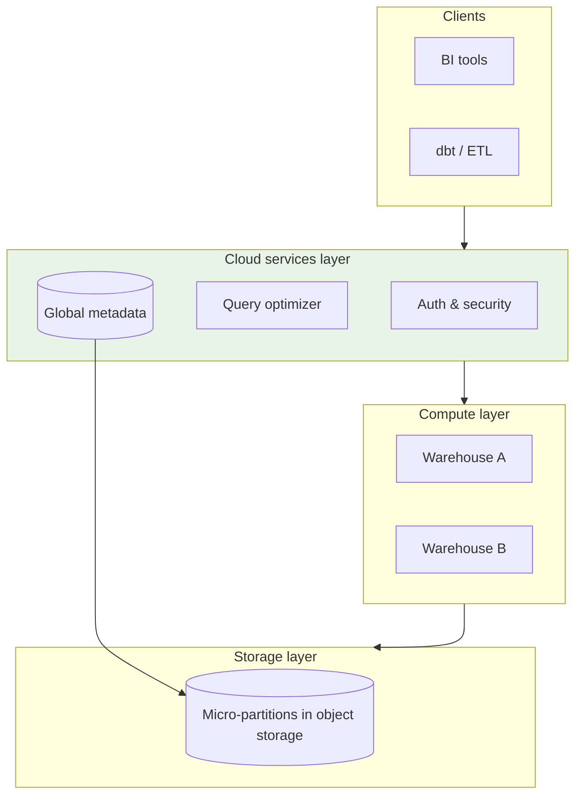
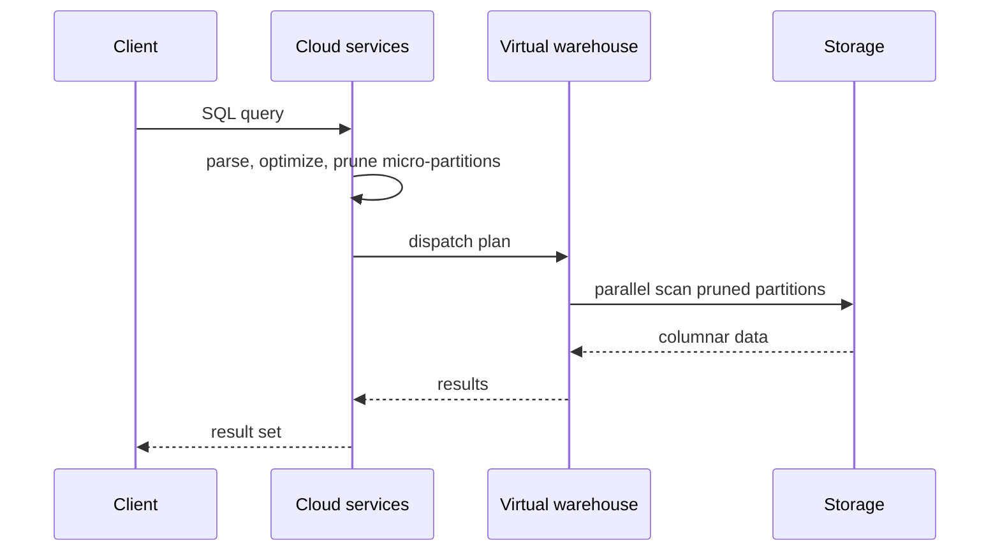
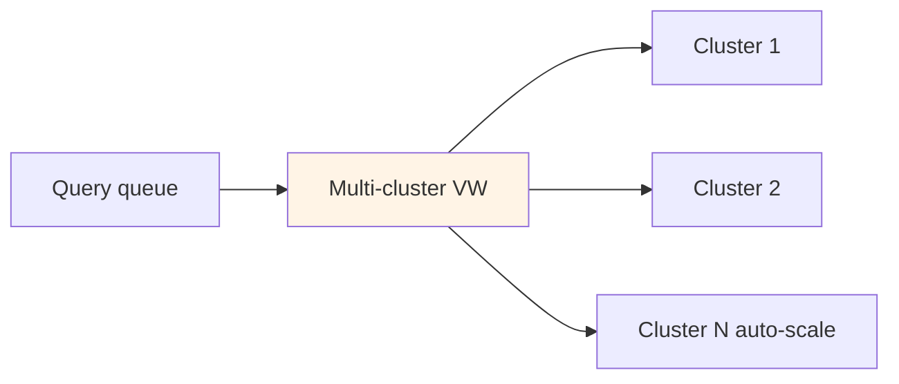

# Snowflake Architecture

## 1. Executive Summary

**Snowflake** is a cloud-native **analytical data warehouse** that separates **storage**, **compute**, and **cloud services** into independently scalable layers. Data is stored in immutable **micro-partitions** (compressed columnar objects in cloud storage) with rich **metadata** enabling **partition pruning** without explicit user-defined partitions. **Virtual warehouses** are MPP compute clusters that execute queries in parallel; multiple warehouses can read the same data without copying it.

Snowflake's **cloud services layer** handles authentication, query optimization, metadata, transactions, and infrastructure management—presenting a **SQL** interface with **ACID** transactions on tables. Features include **zero-copy cloning**, **time travel**, **fail-safe** recovery, **data sharing** across accounts, and **Snowpipe** for continuous ingestion.

For principal architects, Snowflake exemplifies **disaggregated warehouse architecture**: scale compute for concurrency, pay storage separately, accept **vendor-managed** optimization in exchange for reduced DBA burden—while designing around **credit economics**, **warehouse sizing**, and **multi-cluster** behavior. Interview success requires fluency in **micro-partition pruning** and **FinOps**, not just SQL portability claims.

## 2. Why This Topic Matters

Snowflake dominates enterprise analytics cloud migrations. Interview topics include:

- **Storage/compute separation** — why it enables elasticity.
- **Micro-partitions vs traditional partitioning** — automatic clustering.
- **Virtual warehouse sizing** — credits, queuing, spill to storage.
- **Time travel / fail-safe** — recovery semantics.
- **Snowflake vs BigQuery vs Redshift** — architectural comparisons.
- **Data sharing** — secure collaboration without copy.

Misunderstanding leads to runaway credit bills, query queuing during peak BI hours, or using Snowflake for OLTP workloads it was not designed for.

FinOps and architecture are inseparable for Snowflake—principal candidates should whiteboard **warehouse topology** and **resource monitors** as confidently as star schemas. Credit anomalies are architecture incidents requiring postmortems, not finance surprises. Principal hires explain auto-suspend and multi-cluster policies before discussing SQL features. Draw three warehouses for ETL, BI, and ad hoc on every whiteboard. Time travel retention is a cost architecture decision, not only a recovery feature. Resource monitors with hard suspend limits are mandatory in every production account. Query tags enable chargeback conversations with domain owners and FinOps partners.

## 3. Problems Being Solved

| Problem | Snowflake approach |
|---------|-------------------|
| **Elastic analytics compute** | Independent virtual warehouses |
| **Storage cost at PB scale** | Compressed micro-partitions in object storage |
| **Concurrent mixed workloads** | Separate warehouses per workload class |
| **Environment cloning** | Zero-copy clone metadata pointers |
| **Cross-org data collaboration** | Secure data sharing |
| **Semi-structured data** | VARIANT type + automatic parsing |
| **Continuous ingest** | Snowpipe from cloud storage events |

### Workload fit matrix

| Workload | Fit | Caveat |
|----------|-----|--------|
| BI dashboards / SQL analytics | Strong | Warehouse sizing |
| ELT transformations (dbt) | Strong | Credit monitoring |
| Data lake query (external tables) | Strong | Performance vs native tables |
| High-frequency OLTP | Weak | Not row-level transactional OLTP |
| Streaming sub-second analytics | Moderate | Snowpipe + materialized views |
| ML feature store serving | Weak | Use specialized serving layer |

## 4. Assumptions and System Model

| Assumption | Implication |
|------------|-------------|
| **Data in cloud object storage** | S3/Azure/GCS under the hood |
| **Queries are analytical** | Large scans with pruning |
| **SQL interface** | Optimizer chooses micro-partition elimination |
| **Multi-tenant cloud service** | Shared cloud services layer |
| **Credits bill compute** | Warehouse uptime and size drive cost |

**Safety:** ACID transactions on tables; consistent reads within transaction. **Liveness:** Queries progress when warehouse has capacity; otherwise queue.

## 5. Essential Terminology

| Term | Definition |
|------|------------|
| **Micro-partition** | Immutable compressed columnar storage unit (~50–500 MB) |
| **Virtual warehouse (VW)** | MPP compute cluster executing queries |
| **Cloud services layer** | Metadata, optimizer, auth, infrastructure |
| **Storage layer** | Micro-partitions in cloud storage |
| **Clustering key** | Co-location hint for related rows |
| **Time travel** | Query historical table state (retention days) |
| **Fail-safe** | Additional recovery period after time travel |
| **Zero-copy clone** | Metadata-only table copy |
| **Credit** | Billing unit for compute consumption |
| **Snowpipe** | Serverless continuous load from staged files |

## 6. Core Mechanism

### 6.1 Three-layer architecture



*Figure 1: Clients interact with cloud services; warehouses scale independently; all read shared storage.*

### 6.2 Query execution flow



*Figure 2: Optimizer uses micro-partition metadata to minimize IO before MPP scan.*

### 6.3 Multi-cluster warehouse (conceptual)



*Figure 3: Multi-cluster warehouses spin up additional compute clusters under load.*

## 7. Step-by-Step Walkthrough

### Walkthrough A: Table load and micro-partition creation

1. `COPY INTO` loads CSV from external stage.
2. Snowflake compresses data into new micro-partitions.
3. Metadata stores min/max per column per micro-partition.
4. Table immediately queryable; no explicit `CREATE INDEX`.

### Walkthrough B: Query with partition pruning

1. `SELECT SUM(revenue) WHERE sale_date = '2025-07-01'`.
2. Optimizer reads micro-partition metadata; skips partitions where max(date) &lt; target or min(date) &gt; target.
3. Warehouse workers scan remaining partitions in parallel.
4. Results aggregated; credits consumed based on warehouse size × duration.

### Walkthrough C: Zero-copy clone for dev

1. `CREATE TABLE dev.orders CLONE prod.orders`.
2. Metadata pointers shared; no data duplication initially.
3. Dev modifications create new micro-partitions (copy-on-write).
4. Storage charges only for diverged data.

### Walkthrough D: Time travel recovery

1. Accidental `DROP TABLE orders` at 14:00.
2. Within retention (e.g., 7 days): `UNDROP TABLE orders` or query `AT(TIMESTAMP => ...)`.
3. Fail-safe provides additional recovery window after retention [verify current Snowflake docs].

### Walkthrough E: Snowflake Streams and Tasks (CDC pattern)

1. `STREAM` on `raw.orders` captures change metadata since last offset.
2. `TASK` scheduled every 15 minutes merges stream into `curated.orders` using `MERGE`.
3. Task runs as service user with minimal role; warehouse `ETL_S` auto-resumes.
4. Failed task retries with exponential backoff; alert on 3 consecutive failures.
5. Pattern replaces external CDC tool for moderate-volume curated layers inside Snowflake.

### Walkthrough F: External table query over data lake

1. `CREATE EXTERNAL TABLE ext_events` pointing to S3 Parquet with partition columns.
2. Query joins `ext_events` with native `dim_customer` for enrichment.
3. Performance slower than native table—acceptable for exploratory queries.
4. Materialize hot partitions into native table via `CREATE TABLE AS SELECT` nightly.
5. FinOps tracks external scan bytes vs native storage cost tradeoff.

### Warehouse sizing heuristics (starting points—tune with profiling)

| Workload pattern | Starting size | Notes |
|------------------|---------------|-------|
| Light BI (&lt;10 users) | XS | Multi-cluster if bursts |
| dbt ETL 500 GB/night | L–XL | Auto-suspend after job |
| Ad hoc analysts 100+ | S multi-cluster | Min 1 max 4 clusters |
| Near-real-time ingest+query | Separate pipe + XS query | Isolate blast radius |

## 8. Invariants and Guarantees

| Property | Snowflake guarantee |
|----------|---------------------|
| **ACID transactions** | On table DML |
| **Durability** | Storage layer replication (managed) |
| **Snapshot isolation** | For concurrent queries |
| **Consistency** | Strong within transaction scope |
| **Time travel bounds** | Configurable retention per object |

Not designed for **serializable OLTP** across high-frequency row updates.

## 9. Failure Scenarios

| Failure | Behavior | Mitigation |
|---------|----------|------------|
| **Warehouse too small** | Query queues; slow | Scale up/out; multi-cluster |
| **Spill to remote storage** | Latency spike | Increase warehouse memory |
| **Hot table wide scans** | Credit burn | Clustering; materialized views |
| **Poor clustering** | Many micro-partitions scanned | `RECLUSTER` / automatic clustering |
| **Credit overrun** | Budget alert | Resource monitors; suspend policies |
| **Long transaction lock** | Blocking | Short transactions; avoid DDL contention |
| **External stage auth failure** | Load fails | IAM role rotation runbook |

## 10. Performance Characteristics

| Dimension | Behavior |
|-----------|----------|
| Query latency | Seconds for TB scans [workload-dependent] |
| Concurrency | Scales with warehouses and multi-cluster |
| Pruning effectiveness | Depends on filter alignment with micro-partition bounds |
| Load speed | Parallel `COPY`; Snowpipe for micro-batches |
| Semi-structured | VARIANT flexible; may be slower than structured columns |

## 11. Scalability Limits

- **Single query** bounded by warehouse size; huge cartesian joins still painful.
- **Concurrent writers** to same table—analytics-oriented locking.
- **Credit budget** practical limit for many orgs.
- **Cross-region** replication and data sharing latency.
- **Listing external tables** at massive scale—metadata overhead.

## 12. Operational Considerations

- **Warehouse per workload**: ETL large, BI medium, ad hoc small multi-cluster.
- **Auto-suspend** idle warehouses (e.g., 5 min).
- **Resource monitors** with alerts and hard caps.
- **Query history** review for top credit consumers.
- **Clustering** monitoring for large fact tables.
- **Role-based access** least privilege; separate admin roles.
- **Fail-safe/time travel** retention cost tradeoff.
- **Warehouse RBAC audit** quarterly: who can use `ACCOUNTADMIN`, who owns `SYSADMIN` tasks.
- **Query acceleration** review: search optimization service vs materialized views for hot paths [verify product].
- **Credit anomaly detection**: alert when daily spend &gt; 2× 30-day rolling average.
- **Cross-region replication** latency documented for each shared dataset.

## 13. Security Considerations

- **RBAC** with roles hierarchy; avoid ACCOUNTADMIN for apps.
- **Network policies** and **private link** for ingress control.
- **Column-level security** and **dynamic data masking**.
- **Encryption** at rest (SSE-KMS) and in transit.
- **Data sharing** audited; consumer accounts vetted.

## 14. Cost Considerations

- **Credits** = f(warehouse size, run time, multi-cluster count).
- **Storage** billed separately; time travel and fail-safe add storage.
- **Cloud services** typically included; verify pricing model updates.
- **Snowpipe** per-file charges.
- **Anti-pattern**: XL warehouse always on for rare queries.

FinOps: track **cost per query** via query tags and dbt metadata.

### Credit burn incident narrative

A misconfigured `MATERIALIZED VIEW` refresh on XXL warehouse running hourly consumed 40% of monthly credit budget in 3 days. Root causes: (1) no resource monitor hard cap, (2) MV on unclustered 20 TB fact table full scan, (3) no query tag alerting. **Remediation:** resource monitor suspend, rewrite MV incremental, add clustering, mandate query review for objects &gt;1 TB. Principal architects treat Snowflake like **cloud spend with SQL triggers**—FinOps partnership mandatory.

### Snowflake vs lakehouse positioning

Many enterprises run **Snowflake as gold serving layer** with Iceberg bronze/silver in the lake—Snowflake external tables or Snowflake Iceberg tables bridge the architectures [verify current features]. Interview narrative: lakehouse for open format and multi-engine ETL; Snowflake for governed SQL performance and BI—not mutually exclusive.

### Data sharing security review checklist

Before enabling share to partner account: (1) column-level review for PII, (2) consumer account ID allowlist, (3) contract defining permitted use, (4) audit log forwarding, (5) revocation runbook tested, (6) legal DPA on file.

## 15. Production Implementations

### Case study: Enterprise BI migration (illustrative)

#### Context

Migrate Teradata 500 TB warehouse to Snowflake; 300 concurrent analysts.

#### Architecture

Separate VW: `ETL_XL` (auto-suspend), `BI_L` multi-cluster (min 1 max 4), `ADHOC_XS`. dbt on `ETL_XL`. Clustering on `fact_sales(sale_date)`.

#### Results (illustrative)

40% cost reduction vs on-prem TCO over 3 years; p95 dashboard query &lt; 8s.

#### Extended operations narrative

Year-one surprise: time travel retention on 200 tables at 90 days doubled storage bill. Policy standardized 7-day dev, 30-day prod unless compliance exception. Data sharing to partner account required security review—one share revoked when consumer ran cross-join exposing row counts. `QUERY_TAG` initiative attributed 78% of credits to top 12 dbt models—optimization sprint followed.

#### Tradeoffs

| Choice | Tradeoff |
|--------|----------|
| Multi-cluster BI | Cost vs queue elimination |
| Native vs external tables | Performance vs lake integration |

## 16. Alternatives and Tradeoffs

| System | Comparison |
|--------|------------|
| **BigQuery** | Serverless slots vs Snowflake warehouses |
| **Redshift** | More ops tuning; RA3 separation similar |
| **Databricks SQL** | Lakehouse unity vs Snowflake native |
| **ClickHouse** | Extreme OLAP speed; different ops model |

Choose Snowflake for **managed elasticity**, **data sharing**, and **enterprise SQL warehouse** with minimal infrastructure ops.

## 17. Common Misconceptions

| Misconception | Reality |
|---------------|---------|
| "No partitioning needed" | Clustering still matters at scale |
| "Unlimited concurrency free" | Each warehouse costs credits |
| "Snowflake is a data lake" | Can query external; optimized for warehouse tables |
| "Zero-copy clone free forever" | Divergent writes accrue storage |
| "VARIANT replaces schema design" | Performance suffers without structure |

## 18. Principal Architect Perspective

1. **Right-size warehouses** with auto-suspend—biggest cost lever.
2. **Isolate workloads**—never share ETL and exec dashboards on one VW.
3. **Use query tags** for chargeback and optimization.
4. **Pair with lake** via external tables or Snowflake Iceberg tables [verify feature].
5. **Not for OLTP**—keep operational data in OLTP DB, sync to Snowflake.

Snowflake architecture reviews should always include **credit governance** alongside schema design—unbounded warehouses have caused more executive escalations than slow queries in many enterprises. Separate **interactive** from **batch** workloads at the warehouse layer, not only at the role layer.

### Operating playbook (first 90 days)

**Days 1–30:** Resource monitors with hard suspend thresholds on all warehouses. Query tagging mandatory for cost attribution.

**Days 31–60:** Split ETL and BI warehouses; enable auto-suspend. Review top 20 queries by credits consumed.

**Days 61–90:** Clustering review on tables &gt;1 TB. Time-travel retention aligned with compliance—not default max everywhere.

## 19. Architecture Review Exercise

**Scenario:** Single XXL warehouse runs 24/7 for all users; bills $400k/month.

**Findings:** Split workloads; auto-suspend; downsize ad hoc; multi-cluster only for BI peak.

## 20. Whiteboard Explanation

"Snowflake splits three layers: storage holds compressed micro-partitions in S3 or equivalent with per-partition column min/max metadata; compute is virtual warehouses—independent MPP clusters that spin up and down; cloud services handle SQL parsing, optimization, security, and metadata. A query hits cloud services first, the optimizer prunes micro-partitions using metadata, then dispatches parallel scans to a warehouse. Storage and compute scale independently—you can add a warehouse without moving data. Time travel keeps historical micro-partitions for recovery. Credits bill warehouse runtime, so auto-suspend and workload-specific sizing are architectural decisions."

**Principal addendum:** Draw separate warehouses for ETL vs BI. Micro-partition pruning is automatic; **clustering** still matters at PB scale. Credit incidents are architecture failures—resource monitors are mandatory.

## 21. Interview Questions

1. **Three Snowflake layers?** — Storage, compute, cloud services.
2. **Micro-partition?** — Immutable compressed columnar unit with metadata.
3. **Virtual warehouse?** — MPP compute cluster.
4. **Storage/compute separation benefit?** — Elastic compute without data copy.
5. **Time travel vs fail-safe?** — User-queryable history vs extended recovery [verify docs].
6. **Zero-copy clone?** — Metadata pointer sharing.
7. **Snowpipe?** — Continuous serverless ingest.
8. **Clustering key purpose?** — Co-locate related rows for pruning.
9. **Credit drivers?** — Warehouse size × time × clusters.
10. **When not Snowflake?** — OLTP, ultra-low-latency serving.
11. **Data sharing?** — Cross-account read without copy.
12. **VARIANT type?** — Semi-structured JSON-like column.
13. **Multi-cluster warehouse?** — Auto-scale compute clusters for concurrency.
14. **vs BigQuery?** — VW model vs slot/serverless model.

### Scoring rubric (principal)

| Dimension | Strong | Weak |
|-----------|--------|------|
| Architecture | Three layers + pruning | "Cloud SQL" |
| Cost | Credits, suspend, sizing | Ignores FinOps |
| Scale | Clustering, workload isolation | One big warehouse |
| Fit | OLAP yes, OLTP no | Universal database |

### Extended scoring notes

**Principal bar:** Explains micro-partition pruning without user-defined partitions. Names credit drivers and auto-suspend. **Weak hire:** "Snowflake scales automatically" with no warehouse concept.

15. **Micro-partition vs user partition?** — Automatic vs explicit DDL.
16. **Zero-copy clone storage?** — COW on divergence.
17. **Snowpipe vs COPY?** — Continuous vs batch load.

## 22. Interview Follow-Ups

1. **Design warehouse strategy for ETL + 500 BI users.** — Separate VW, multi-cluster BI, auto-suspend.
2. **Query slow after 10x data growth.** — Check pruning, clustering, warehouse size, spill.
3. **Recover dropped table day 3.** — Time travel UNDROP or AT timestamp.
4. **Share data with partner without copy.** — Secure data sharing + reader account.
5. **Integrate with data lake.** — External tables, Iceberg tables, or ingest COPY.

### Additional principal scenarios

**Scenario:** Board asks Snowflake vs lakehouse. **Answer:** Complementary—lake for open format and ML; Snowflake for governed SQL performance; many run both with external tables or Iceberg integration.

**Scenario:** Query timeout on 30 TB fact table. **Answer:** Check clustering, partition pruning stats, warehouse size, accidental full scan; consider aggregate tables for hot dashboards.

**Scenario:** Finance demands on-prem Snowflake equivalent. **Answer:** Snowflake is cloud-native service—alternatives are self-managed warehouse (ClickHouse, Greenplum) or lakehouse SQL engines; clarify requirement is control plane location vs SQL interface.

## 23. Strong Answer Example

**Question:** "How does Snowflake achieve storage/compute separation?"

**Strong outline:** "All table data lives as micro-partitions in cloud object storage, managed by Snowflake's storage layer with rich metadata for each partition's column bounds. Virtual warehouses are ephemeral MPP compute clusters that issue parallel read requests against that storage—they don't own the data. When I scale compute, I start or resize warehouses without migrating data. The cloud services layer maintains the global catalog, transaction log, and query optimizer that plans which micro-partitions each worker reads. This separation lets multiple warehouses query the same table concurrently for different workloads—ETL and BI—while paying storage once. The tradeoff is network IO between compute and storage on every query, which Snowflake mitigates via aggressive pruning and local SSD caching on workers [implementation detail—verify docs]."

## 24. Weak Answer Example

**Weak:** "Snowflake stores data in the cloud and scales automatically like any cloud database."

**Red flags:** No micro-partitions, warehouses, or pruning; ignores credits.

## 25. Hands-On Exercise

1. Snowflake trial: load sample data; observe query profile pruning stats.
2. Create zero-copy clone; modify clone; compare storage billing conceptually.
3. Run same query on XS vs L warehouse; compare credits used.
4. Test time travel SELECT on modified table.
5. Sketch multi-warehouse layout for sample org.

## 26. Knowledge Check

1. Micro-partitions enable? *(Metadata-based pruning.)*
2. Credits consumed by? *(Virtual warehouse compute.)*
3. Cloud services handle? *(Optimizer, auth, metadata.)*
4. Zero-copy clone shares? *(Initial metadata pointers.)*
5. Snowpipe for? *(Continuous ingest.)*
6. Clustering improves? *(Pruning for large tables.)*
7. Time travel allows? *(Historical queries.)*
8. OLTP fit? *(Poor.)*
9. Multi-cluster purpose? *(Concurrency scaling.)*
10. VARIANT stores? *(Semi-structured data.)*
11. Credit billed for? *(Virtual warehouse runtime.)*
12. UNDROP uses? *(Time travel recovery.)*
13. Data sharing avoids? *(Copying data to consumer account.)*

## 27. Flashcards

| Front | Back |
|-------|------|
| Micro-partition | Compressed columnar storage unit |
| Virtual warehouse | Snowflake MPP compute cluster |
| Cloud services layer | Metadata, optimizer, security |
| Storage/compute separation | Independent scaling of each |
| Time travel | Query historical table states |
| Zero-copy clone | Metadata-only table copy |
| Snowpipe | Serverless continuous loading |
| Clustering key | Row co-location for pruning |
| Credit | Snowflake compute billing unit |
| Data sharing | Cross-account secure access |

## 28. Cheat Sheet

```
LAYERS
  Cloud services | Virtual warehouses | Micro-partitions (S3)

PERFORMANCE
  Pruning via metadata | clustering for large facts

COST
  Credits = warehouse size × time | auto-suspend | resource monitors

NOT FOR
  OLTP | sub-second serving

PRINCIPAL ANCHORS
  Credits = warehouse size × time
  Auto-suspend always
  Separate ETL vs BI warehouses
  Clustering at PB scale
  Time travel retention cost
  Resource monitor hard cap
  Micro-partition auto pruning
  Query tags for chargeback
```

## 29. Related Concepts

- [Data Lakehouse Architecture](/docs/data-platforms/data-lakehouse-architecture) — lake + warehouse convergence
- [Storage Engine Fundamentals](/docs/storage-engines/storage-engine-fundamentals) — columnar and compression
- [LSM Trees](/docs/storage-engines/lsm-trees) — ingestion patterns contrast
- [Google Spanner](/docs/distributed-databases/google-spanner) — OLTP contrast

## 30. References

### Primary sources

- Snowflake architecture whitepapers and documentation — micro-partitions, layers, time travel.
- Dageville, B., et al. — Snowflake engineering blogs [verify authors].

### Related

- Raasveldt, M., & Mühleisen, M. — DuckDB/Snowflake analytical comparisons (academic context).
- BigQuery, Redshift architecture docs — alternative designs.

### Principal study path

Compare with [Data Lakehouse Architecture](/docs/data-platforms/data-lakehouse-architecture) for lake-warehouse convergence, [Google Spanner](/docs/distributed-databases/google-spanner) for OLTP contrast, and [Storage Engine Fundamentals](/docs/storage-engines/storage-engine-fundamentals) for columnar scan mechanics underlying micro-partitions. FinOps interviews often start with warehouse sizing—practice credit estimation from query profiles.

### Distinction

| Claim | Type |
|-------|------|
| Three-layer model | Snowflake published architecture |
| Credit pricing | Vendor pricing—verify current |
| Fail-safe duration | Product documentation |
