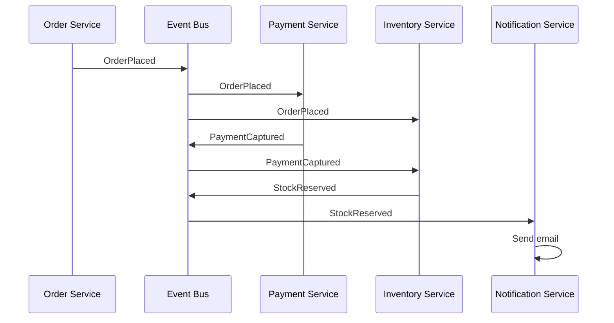
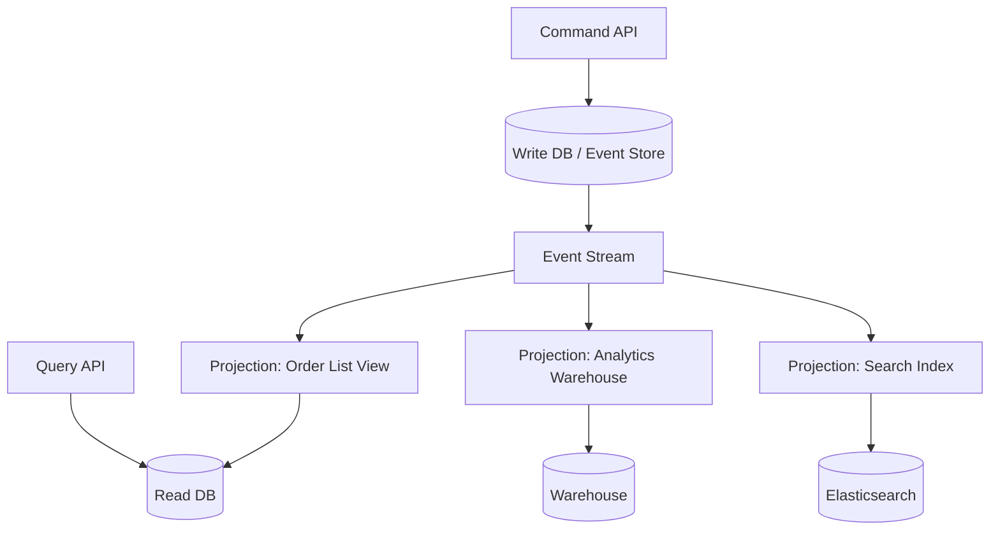
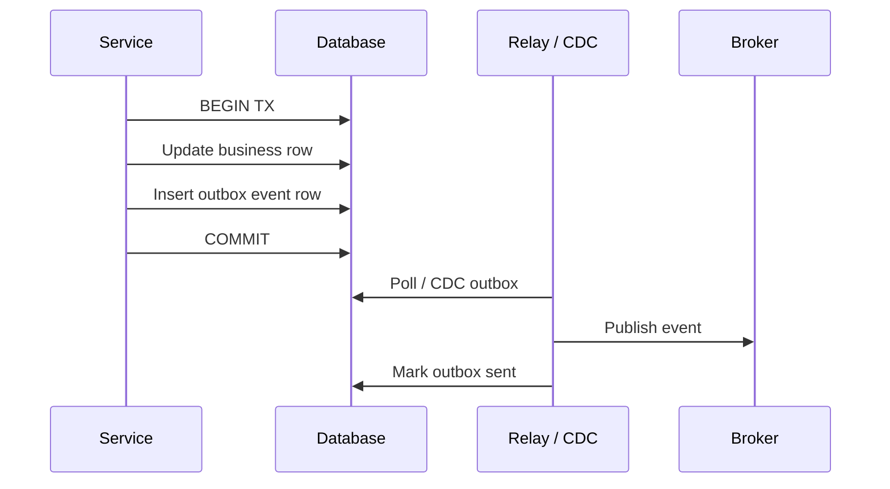

# Event-Driven Architecture

## 1. Executive Summary

**Event-driven architecture (EDA)** is a software design style in which components communicate by producing and consuming **events**—immutable records of something that happened—rather than invoking each other synchronously. EDA enables **loose coupling**, **independent scaling**, **temporal decoupling**, and **multiple reactions** to the same fact. It introduces challenges: **eventual consistency**, **distributed debugging**, **schema evolution**, **ordering across aggregates**, and **duplicate event processing**.

EDA spans patterns from simple **event notification** (fire-and-forget facts) to **event-carried state transfer**, **CQRS** (separate read/write models), and **event sourcing** (state derived from event log). Principal architects must distinguish **choreography** (decentralized reactions) from **orchestration** (central workflow control) and align transport semantics (at-least-once) with **idempotent** consumers.

This chapter covers EDA patterns, integration styles, consistency boundaries, schema governance, observability, failure modes, organizational implications, and principal-level design reviews.

## 2. Why This Topic Matters

Modern enterprises adopt EDA for microservices, real-time analytics, and integration hubs. Interviews ask: **"Design a notification system when an order ships"** or **"How do services stay consistent without tight coupling?"**

Strong candidates explain:

- Events are **facts**, not commands—naming and semantics matter (`OrderShipped` vs `ShipOrder`).
- **Choreography** scales teams but obscures global flow; **orchestration** aids visibility.
- **Read models lag** behind write models in CQRS—UX and SLAs must account for delay.
- **Event sourcing** is not free—snapshotting, replay cost, and schema migration complexity.

Production failures include **circular event dependencies**, **schema breaking changes** taking down consumers, **phantom events** from at-least-once duplicates, and **inability to trace** a business transaction across 15 topics. Architects who adopt EDA without contracts and observability trade one monolith problem for a distributed graph problem.

## 3. Problems Being Solved

| Problem | Synchronous integration | Event-driven approach |
|---------|------------------------|----------------------|
| Tight coupling | Caller knows callee API | Publisher unaware of subscribers |
| Availability cascades | Downstream failure blocks caller | Async buffer; consumer catches up |
| Multiple reactions | Orchestrator fans out calls | Multiple consumers same topic |
| Audit / analytics | Separate ETL batch | Stream from same event log |
| Peak load | Caller blocked | Queue absorbs spikes |

EDA solves **decoupled integration** and **multi-subscriber fan-out**. It does **not** solve **immediate consistency**, **simple request-response latency**, or **automatic cross-service transactions** without sagas/outbox patterns.

## 4. Assumptions and System Model

Assume **microservices** with **private data stores** and a **message broker** (often Kafka):

- Events are **immutable** once published (corrections via compensating events).
- Delivery is **at-least-once** unless infrastructure provides stronger guarantees.
- Consumers maintain **idempotent** handlers and **versioned** schema tolerance.
- **Clocks** are not synchronized—use event timestamps and versioning, not wall-clock ordering globally.
- **Failures:** Broker outage, consumer lag, poison messages, schema mismatch.

**Event types:**

| Type | Purpose | Example |
|------|---------|---------|
| **Event notification** | Signal occurred; consumer fetches detail | `OrderPlaced` with ID only |
| **Event-carried state transfer** | Payload includes needed data | `OrderPlaced` with line items |
| **Domain event** | Business-meaningful fact | `PaymentCaptured` |
| **Integration event** | Cross-bounded-context | `CRM.CustomerUpdated` |

## 5. Essential Terminology

| Term | Definition |
|------|------------|
| **Event** | Immutable record of past occurrence. |
| **Command** | Request to perform action; one intended handler. |
| **Choreography** | Decentralized: services react without central controller. |
| **Orchestration** | Central coordinator directs steps (may use events). |
| **CQRS** | Command Query Responsibility Segregation—split write/read paths. |
| **Event sourcing** | Persist state changes as event sequence; rebuild state by replay. |
| **Projection** | Read model built from event stream. |
| **Outbox pattern** | Atomic DB write + event staging for reliable publish. |
| **Schema registry** | Central contract for event payload versions. |
| **Eventual consistency** | Replicas converge without simultaneous strong consistency. |

**Mnemonic:** **Events are past tense; commands are imperative.**

## 6. Core Mechanism

### Choreographed order flow



*Figure 1: Choreography—each service subscribes and publishes; no central workflow store.*

### CQRS with event projection



*Figure 2: Write path appends events; projections build specialized read models asynchronously.*

### Outbox for reliable publishing



*Figure 3: Outbox ties local commit to eventual publish—avoids dual-write inconsistency.*

## 7. Step-by-Step Walkthrough

**Scenario:** Migrate monolith checkout to event-driven microservices.

| Phase | Action | Outcome |
|-------|--------|---------|
| 1 | Identify bounded contexts | Order, Payment, Inventory, Shipping |
| 2 | Define domain events | `OrderPlaced`, `PaymentFailed`, `StockReserved` |
| 3 | Choose notification vs state transfer | Line items in event vs lookup API |
| 4 | Implement outbox per service | Reliable publish after local commit |
| 5 | Schema registry with Avro | Versioned contracts |
| 6 | Idempotent consumers | `event_id` dedup table |
| 7 | Observability | `trace_id` propagation in event headers |
| 8 | Saga for failure | Orchestrator or choreographed compensation |

**Event notification variant:**

| Step | Flow |
|------|------|
| 1 | `OrderPlaced { order_id }` published |
| 2 | Payment service calls Order API for details |
| 3 | **Coupling** reintroduced via API—acceptable if API stable |

**Event-carried state transfer variant:**

| Step | Flow |
|------|------|
| 1 | `OrderPlaced { order_id, items, total }` published |
| 2 | Payment processes without Order API call |
| 3 | **Risk:** Large payloads; stale if order changes—version events |

**CQRS read lag example:**

| Time | Write model | Read model (projection) |
|------|-------------|-------------------------|
| T0 | Order created | — |
| T1 | Event in log | Projector processing |
| T2 | — | Order visible in list API |

Customer may refresh before T2—design UX (spinner, optimistic UI) or read-your-writes routing.

**Event naming and schema conventions (production governance):**

| Rule | Good example | Bad example |
|------|--------------|-------------|
| Past tense, domain prefix | `orders.OrderPlaced` | `createOrder` |
| Version in schema, not topic | Avro `OrderPlacedV3` | `orders-v3-topic` |
| Include correlation IDs | `trace_id`, `causation_id` | Bare payload |
| Immutable fields documented | `order_id` never changes | Undocumented renames |
| Avoid event-as-RPC | `PaymentCaptured` (fact) | `ChargePayment` (command on bus) |

**Command Query Responsibility Segregation (CQRS) depth:**

CQRS splits the **write model** (optimized for commands, validation, invariants) from **read model** (optimized for queries, denormalized views). In event-driven CQRS:

| Component | Responsibility |
|-----------|----------------|
| Command handler | Validate; append domain event to event store or outbox |
| Event bus | Distribute events to projectors |
| Projector | Transform events into read-optimized tables or search indexes |
| Query API | Serve reads only from projections—never from write DB directly |

**When CQRS is justified:** Multiple read patterns with different access paths (list view, detail view, search, analytics); high read:write ratio; need independent scaling of read side. **When to avoid:** Simple CRUD with one read pattern; team lacks operational maturity for projection lag monitoring.

**Event sourcing vs event-driven (critical distinction):**

| Aspect | Event-driven (notification) | Event sourcing |
|--------|----------------------------|----------------|
| Source of truth | Database | Event log |
| State recovery | Read current row | Replay all events |
| Schema changes | Migrate tables | Upcast events |
| Complexity | Medium | High |
| Audit trail | Optional | Built-in |

Event sourcing stores **all state changes as events** and derives current state by replay—a specialized form of EDA. Most organizations need event-driven integration without full event sourcing.

**Organizational implications of choreography:**

| Team size | Choreography risk | Mitigation |
|-----------|-------------------|------------|
| 2–4 services | Low | Shared runbook |
| 5–10 services | Medium | Event catalog, tracing |
| 10+ services | High | Orchestration for critical paths; integration guild |

Without governance, choreography becomes **implicit coupling**—teams subscribe to events they do not own and break when producers change schemas silently.

**Integration patterns catalog (Hohpe & Woolf mapped to EDA):**

| EIP pattern | EDA manifestation |
|-------------|-------------------|
| Publish-Subscribe Channel | Kafka topic with multiple consumer groups |
| Message Router | Content-based routing via headers or topics |
| Message Filter | Consumer-side filter on event type |
| Aggregator | Stream processor building composite events |
| Process Manager | Saga orchestrator (not pure choreography) |
| Dead Letter Channel | DLQ topic for poison events |

**Strangler fig migration to EDA:**

Incremental migration from monolith without big-bang rewrite:

| Phase | Action |
|-------|--------|
| 1 | Extract read APIs; add CDC from monolith DB |
| 2 | Publish domain events from CDC without changing monolith code |
| 3 | New microservice consumes events; builds read model |
| 4 | Route read traffic to new service (strangler) |
| 5 | Extract write path; monolith becomes thin or retired |

CDC-based event emission avoids dual-write during early phases—events reflect actual monolith commits.

**Testing event-driven systems:**

| Test type | Validates |
|-----------|-----------|
| Contract test | Schema compatibility producer ↔ consumer |
| Integration test | End-to-end event flow with test broker |
| Chaos test | Delayed events, duplicate delivery, broker outage |
| Property-based | Compensation order in sagas |
| Replay test | Projector rebuild from offset 0 matches production snapshot |

Event-driven architectures require **test infrastructure investment**—teams without contract tests in CI experience production schema breakage monthly.

**Anti-patterns to flag in architecture reviews:**

| Anti-pattern | Symptom | Remediation |
|--------------|---------|-------------|
| Distributed monolith | Sync chains across 6 services | Consolidate or async boundary |
| Event notification hell | 50-line stack traces for one click | Orchestration or tracing |
| Shared database + events | Dual source of truth | Pick one write path |
| Generic `Event` type | Untyped JSON blobs | Schema registry |
| Missing idempotency | Duplicate side effects on retry | Dedup keys mandatory |

**Latency vs resilience tradeoff (quantitative framing):**

Sync call chain of 5 services at 50ms p99 each ≈ 250ms best-case serial latency. Event-driven path: 5ms publish + 50ms consumer lag + 50ms processing ≈ 105ms minimum but **unbounded upper tail** if consumer lags. Choose sync when user waits for result; choose async when operation can complete in background with notification.

## 8. Invariants and Guarantees

| Property | Type | Statement |
|----------|------|-----------|
| **Event immutability** | Safety (design) | Corrections via new events, not edits |
| **Publisher unaware of subscribers** | Decoupling | New consumers don't require publisher change |
| **Cross-service immediate consistency** | **Not** provided | Eventual unless sync read |
| **Ordering** | Per-partition/key typically | Global order not guaranteed |
| **Exactly-once effect** | Application | Idempotency required |

## 9. Failure Scenarios

### Scenario 1: Cyclic event dependency

**Setup:** Service A emits event triggering B, which triggers A again.

**Effect:** Infinite loop or stack overflow in choreography.

**Mitigation:** Event ownership rules; state machines; idempotency; cycle detection in design reviews.

### Scenario 2: Breaking schema change

**Setup:** Producer adds required field; old consumers fail deserialize.

**Effect:** Consumer stall; lag explosion.

**Mitigation:** BACKWARD/FULL compatibility modes; dual-schema period; consumer-first deploy.

### Scenario 3: Missing event

**Setup:** Outbox relay down; order in DB but no `OrderPlaced`.

**Effect:** Payment never starts—stuck order.

**Mitigation:** Outbox monitoring; reconciliation job comparing DB to topic.

### Scenario 4: Duplicate events

**Setup:** At-least-once redelivery.

**Effect:** Double shipment, double email.

**Mitigation:** Idempotency keys; dedup store.

### Scenario 5: Slow projection

**Setup:** Analytics projection falls hours behind.

**Effect:** Stale dashboards—not always critical; SLA breach if used for fraud.

**Mitigation:** Separate consumer groups; scale projectors; prioritize critical projections.

### Scenario 6: God topic anti-pattern

**Setup:** One mega-topic with 200 event types, no schema discipline.

**Effect:** Unmanageable consumers; coupling via shared topic.

**Mitigation:** Topic per bounded context; registry governance.

## 10. Performance Characteristics

| Factor | Impact |
|--------|--------|
| Async buffer | Absorbs spikes; adds end-to-end latency |
| Fan-out | N consumers × bandwidth per event |
| Projection rebuild | Replay time proportional to log size |
| Sync enrichment calls | Defeats decoupling benefits |
| Small chatty events | Overhead—batch or state transfer judiciously |

**Latency budget:** Event-driven paths often add tens to hundreds of ms vs sync RPC—acceptable for many domains, not for HFT-style systems.

## 11. Scalability Limits

- **Consumer lag** under sustained overload—unbounded retention costs.
- **Projection complexity**—each new read model is ongoing compute debt.
- **Organizational scaling**—choreography beyond ~10 services needs strong governance.
- **Event store size**—event sourcing growth requires compaction and archival strategy.

## 12. Operational Considerations

- **Event catalog** documenting producers, consumers, schemas, SLAs.
- **Distributed tracing** across publish/consume boundaries.
- **Dead-letter queues** per consumer with replay runbooks.
- **Contract testing** (Pact, schema compatibility CI).
- **On-call playbooks** for lag, DLQ depth, schema failures.
- **Reconciliation jobs** for money and inventory paths.

## 13. Security Considerations

- **Event payloads** may contain PII—encrypt sensitive fields.
- **Topic ACLs** restrict produce/consume principals.
- **Tampering**—sign events in high-trust domains.
- **Authorization** at consumer—don't trust event content without verifying source.

## 14. Cost Considerations

- **Broker storage** for retention and replay.
- **Multiple projections** multiply compute and storage.
- **Engineering complexity** vs monolith—higher initial cost.
- **Saved cost** when decoupling prevents cascade outages and enables independent deploy velocity.

## 15. Production Implementations

### Netflix

Event-driven microservices at scale—**anecdotal** emphasis on resilient async pipelines and chaos testing.

### Uber / Grab

Domain events for trip lifecycle—choreography with rigorous schema governance.

### Zalando

Event-driven architecture guidelines—open internal patterns for event naming and versioning.

### Banking event hubs

Kafka as integration backbone with schema registry and outbox from core banking—regulatory audit via immutable events.

### Shopify (flash sales)

Async order processing absorbs traffic spikes—**implementation choice** combining queues and events.

## 16. Alternatives and Tradeoffs

| Style | Coupling | Consistency | Complexity |
|-------|----------|---------------|------------|
| Sync REST/gRPC | High | Immediate | Lower |
| Event notification EDA | Low | Eventual | Medium |
| Event sourcing + CQRS | Low write coupling | Eventual reads | High |
| Batch ETL | Very loose | Hours delay | Medium |
| Orchestrated saga | Medium | Controlled steps | Medium-high |

## 17. Common Misconceptions

| Misconception | Reality |
|---------------|---------|
| "EDA eliminates coupling" | Semantic and schema coupling remain. |
| "Events replace APIs" | Query APIs still needed for lookups. |
| "Event sourcing for everything" | High complexity—use where audit/replay justify cost. |
| "Choreography always scales better" | Debugging cost grows; orchestration helps critical paths. |
| "Async = faster" | Often higher latency; better throughput and resilience. |

## 18. Principal Architect Perspective

1. **Start with integration events**, not full event sourcing, unless requirements demand replay.
2. **Mandate outbox** for any DB + publish combination.
3. **Name events in past tense** with versioned schemas.
4. **Choose orchestration** for revenue-critical multi-step flows; choreography for orthogonal reactions.
5. **Invest in observability** before service count exceeds tracing comprehension.

**Organizational design:** Assign **event owners** per bounded context; consumers propose schema changes via RFC—not ad hoc producer edits.

## 19. Architecture Review Exercise

**Scenario:** 8 teams publish to `company-events` topic; 40 consumer groups; no registry; events named `update`, `change`, `notify`.

**Review prompts:**

1. Schema breakage risk?
2. Can you trace one customer order?
3. Who approves new event types?
4. Refactoring plan?

**Expected findings:** Split topics by domain; Schema Registry; naming convention; event catalog; trace propagation; retire god topic gradually.

## 20. Whiteboard Explanation

**90-second version:**

> "Event-driven architecture means services publish facts when something happens, and other services react asynchronously. It decouples producers from consumers—you can add a new subscriber without changing the publisher. Tradeoff is eventual consistency and harder debugging. Use past-tense domain events like PaymentCaptured, not commands. Pair database writes with an outbox so you don't publish without committing or commit without publishing. Consumers must be idempotent because delivery is at-least-once. CQRS separates write and read models updated by projections—reads lag writes. Choreography is decentralized reactions; orchestration uses a coordinator for multi-step flows like sagas. Schema registry and contract tests prevent breaking consumers. Not every interaction should be an event—sync APIs still fit query and low-latency paths."

## 21. Interview Questions

1. **Event vs command?**
   - *Signals:* Past fact vs imperative request; multiple vs single handler.

2. **Choreography vs orchestration?**
   - *Signals:* Decentralized events vs central coordinator.

3. **Why outbox pattern?**
   - *Signals:* Atomic local state + reliable publish.

4. **CQRS tradeoffs?**
   - *Signals:* Scaled reads; eventual read lag; complexity.

5. **Event sourcing when?**
   - *Signals:* Audit, replay, temporal queries—not default CRUD.

6. **Handle schema evolution?**
   - *Signals:* Registry, compatibility, optional fields, version.

7. **Debug stuck workflow in choreography?**
   - *Signals:* Tracing, saga state, timeouts, event catalog.

8. **Notification vs state transfer?**
   - *Signals:* Coupling vs payload size tradeoff.

9. **Design order-shipped notifications.**
   - *Signals:* Domain event, fan-out, idempotency, DLQ.

10. **When avoid EDA?**
    - *Signals:* Strong sync consistency, simple CRUD, low team maturity.

**Scoring rubric:**

| Dimension | Strong | Weak |
|-----------|--------|------|
| Consistency | Eventual + mitigation | "Always consistent" |
| Patterns | Outbox, CQRS scope | Buzzwords only |
| Ops | Tracing, schema, DLQ | No governance |

## 22. Interview Follow-Ups

1. **Read model 30s stale—acceptable?**
   - *Signals:* Domain dependent; fraud vs catalog browse.

2. **Migrate monolith to EDA incrementally?**
   - *Signals:* Strangler; outbox; dual write avoidance.

3. **Event sourcing snapshot strategy?**
   - *Signals:* Periodic snapshots + replay from offset.

## 23. Strong Answer Example

**Question:** "Design event-driven order fulfillment."

> "Order service commits order row and outbox `OrderPlacedV2` in one transaction; Debezium or outbox relay publishes to Kafka topic `orders.events` keyed by `order_id`. Payment and inventory services consume with idempotent `event_id` store. I use **choreography** for orthogonal reactions—analytics, email—but **orchestrated saga** for payment→inventory→ship because compensation order matters. Schemas in Registry with BACKWARD compatibility. Notification service subscribes to `OrderShipped`—separate consumer group from analytics. Trace context in headers. DLQ after 5 failures with alert. Nightly reconciliation compares orders DB to event log offsets. Sync API remains for customer order status query with read model fed by projection—not direct cross-service calls."

## 24. Weak Answer Example

**Question:** "Design event-driven order fulfillment."

> "Use Kafka events between services whenever something happens."

**Why weak:** No outbox, schema, idempotency, failure flow, or read path.

## 25. Hands-On Exercise

1. Model 4 services with in-memory event bus.
2. Implement outbox table + relay loop.
3. Break schema—observe consumer failure.
4. Add Avro/JSON schema version field.
5. Inject duplicate events—test idempotency.
6. Add OpenTelemetry trace across publish/consume.
7. Draw event catalog for your domain.

## 26. Knowledge Check

1. Events name tense? *(Past tense.)*
2. Outbox solves? *(Dual-write problem.)*
3. CQRS separates? *(Commands/writes vs queries/reads.)*
4. Choreography weakness? *(Hard global visibility.)*
5. Delivery default? *(At-least-once.)*

## 27. Flashcards

| # | Front | Back |
|---|-------|------|
| 1 | Domain event | Business fact that occurred. |
| 2 | Choreography | Decentralized event reactions. |
| 3 | Orchestration | Central workflow control. |
| 4 | CQRS | Split write and read models. |
| 5 | Event sourcing | State from event replay. |
| 6 | Projection | Read model from stream. |
| 7 | Outbox | TX-safe event publish. |
| 8 | Schema registry | Versioned contracts. |
| 9 | Event notification | Thin event + lookup. |
| 10 | State transfer | Fat event payload. |

## 28. Cheat Sheet

```
EVENT RULES
  Past tense names
  Immutable — correct with new event
  Version schemas

PATTERNS
  Notification: thin event
  State transfer: fat event
  Outbox: DB + publish consistency
  CQRS: write log → projections

GOVERNANCE
  Event catalog
  Owner per bounded context
  Compatibility CI

FAILURE
  Idempotent consumers
  DLQ + replay
  Reconciliation
```

## 29. Related Concepts

- [Message Delivery Semantics](/docs/messaging-and-streaming/message-delivery-semantics) — consumer guarantees
- [Kafka Architecture](/docs/messaging-and-streaming/kafka-architecture) — typical EDA transport
- [Sagas](/docs/transactions/sagas) — multi-step consistency
- [Transactional Outbox](/docs/transactions/transactional-outbox) — reliable emission
- [Microservices](/docs/microservices/overview) — common EDA deployment

## 30. References

### Primary sources

- Hohpe, G., & Woolf, B. (2003). *Enterprise Integration Patterns* — event message patterns.
- Fowler, M. ["Event-Driven Architecture"](https://martinfowler.com/articles/201701-event-driven.html) — event notification vs sourcing vs CQRS.

### Engineering

- Kleppmann, M. *DDIA* — Ch. 11 streams; Ch. 12 data integration.
- Richardson, C. [Microservices.io — Domain event pattern](https://microservices.io/patterns/data/domain-event.html).
- Chris Richardson, CQRS pattern — [microservices.io](https://microservices.io/patterns/data/cqrs.html).

### Distinction

| Claim type | Source |
|------------|--------|
| EDA pattern definitions | Hohpe & Woolf; Fowler |
| Outbox pattern | Engineering practice; DDIA |
| Production scale anecdotes | Company engineering blogs—verify independently |
