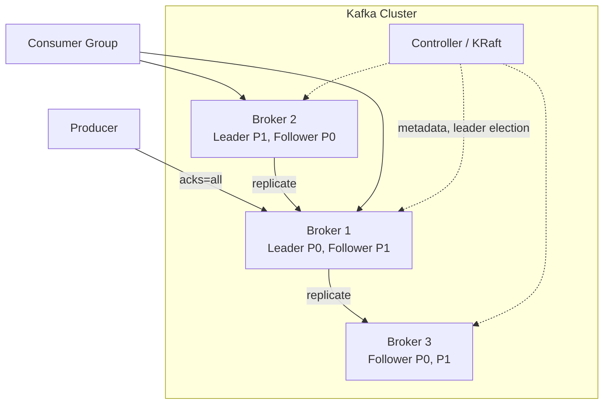
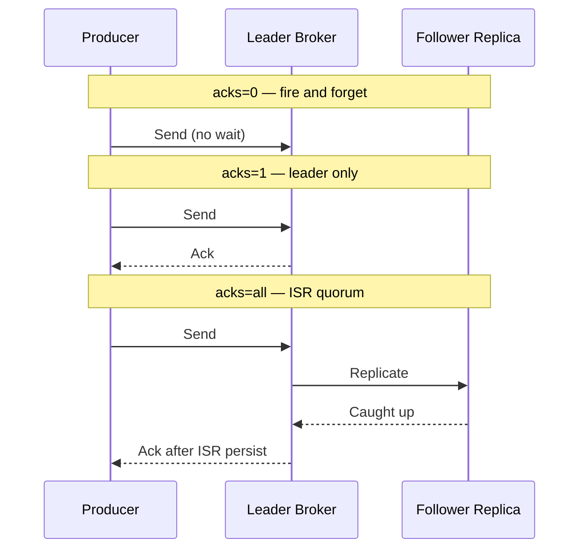
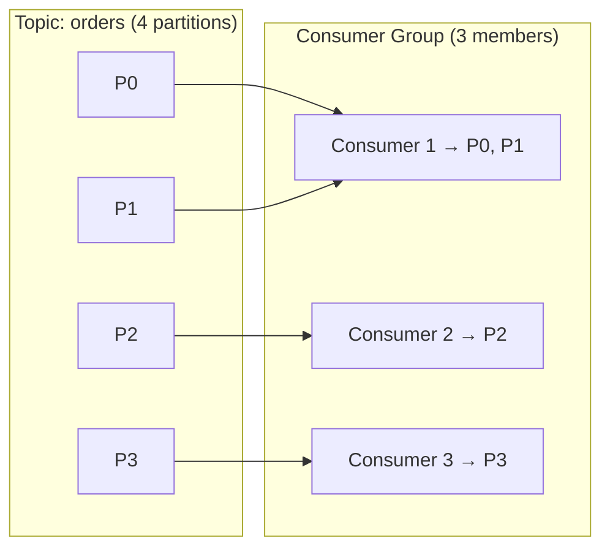

# Kafka Architecture

## 1. Executive Summary

**Apache Kafka** is a distributed commit log used as a message broker, event backbone, and stream processing substrate. Its architecture centers on **topics** partitioned into append-only **logs**, **replicated** across brokers for durability, consumed by **consumer groups** that track **offsets** per partition. Unlike traditional queue systems that delete messages after consumption, Kafka retains messages for a configurable period—enabling replay, multiple independent consumer groups, and decoupled read scaling.

Understanding Kafka at principal level requires grasping the **controller**, **partition leadership**, **In-Sync Replicas (ISR)**, **producer acknowledgment modes**, **consumer group rebalancing**, **log compaction**, and operational limits (disk, partition count, rebalance storms). Kafka provides **strong ordering within a partition** and **at-least-once** by default; **exactly-once** features apply within broker transaction boundaries.

This chapter covers Kafka's internal architecture, replication protocol, producer and consumer mechanics, stream processing integration, failure modes, tuning tradeoffs, and interview-level system design patterns.

## 2. Why This Topic Matters

Kafka appears in nearly every principal-level system design interview involving **event-driven microservices**, **real-time analytics**, **CDC pipelines**, or **log aggregation**. Weak answers describe Kafka as "a fast queue."

Strong candidates explain:

- **Partitions** bound parallelism and ordering—not topics alone.
- **Consumer groups** provide scale-out consumption with partition assignment constraints.
- **ISR** and `min.insync.replicas` define the durability/consistency tradeoff on write.
- **Rebalances** cause duplicate processing and latency spikes if misconfigured.
- **Compaction** enables changelog topics for stateful stream processing.

Production failures include **under-replicated partitions**, **hot partitions**, **zombie consumers** after long GC, **disk full** from retention misconfiguration, and **broker overload** from excessive partition counts. Architects who treat partition count as unlimited create operational nightmares.

## 3. Problems Being Solved

| Problem | Traditional MQ | Kafka approach |
|---------|--------------|----------------|
| Consumer scale-out | Competing consumers on one queue | Partition-parallel consumers in group |
| Replay / audit | Messages deleted after ack | Retained log with offset seek |
| Multiple subscribers | Fan-out exchanges or duplicate queues | Independent consumer groups per use case |
| High throughput | Often broker-bound | Sequential disk writes, zero-copy transfer |
| Ordering | Global or per-queue | Per-partition strict ordering |
| Durability | Broker-dependent | Replicated distributed log |

Kafka solves **durable, ordered, replayable event streaming** at scale. It does **not** solve **arbitrary global ordering**, **unlimited retention without cost**, or **automatic schema governance** without additional tooling (Schema Registry).

## 4. Assumptions and System Model

Assume a **cluster of brokers** coordinated by a **metadata controller** (KRaft in modern Kafka or legacy ZooKeeper):

- Each **partition** has one **leader** broker handling reads/writes; followers replicate.
- **Producers** choose partition via key hash or explicit partition.
- **Consumers** in a group coordinate partition assignment via group coordinator.
- **Failures:** Broker crash, network partition, disk failure, slow follower.
- **Not Byzantine** unless discussing encrypted inter-broker traffic separately.

**Critical invariant:** Messages within a partition have a monotonically increasing **offset**; cross-partition ordering is undefined.

## 5. Essential Terminology

| Term | Definition |
|------|------------|
| **Topic** | Named stream of messages; divided into partitions. |
| **Partition** | Ordered, immutable sequence of messages (log segment files). |
| **Offset** | Monotonic position within a partition log. |
| **Broker** | Kafka server storing partitions and serving clients. |
| **Replica** | Copy of a partition on a broker; one leader, rest followers. |
| **ISR** | In-Sync Replicas—followers caught up within `replica.lag.time.max.ms`. |
| **Consumer group** | Set of consumers sharing work; one consumer per partition max. |
| **Group coordinator** | Broker managing consumer group membership and offsets. |
| **High watermark** | Offset up to which all ISR replicas have replicated. |
| **Log compaction** | Retain latest record per key; tombstones delete keys. |
| **KRaft** | Kafka Raft metadata mode replacing ZooKeeper dependency. |

**Mnemonic:** **Topic splits into partitions; groups consume in parallel.**

## 6. Core Mechanism

### Cluster and partition leadership



*Figure 1: Producers write to partition leaders; followers replicate; controller manages leadership; consumer group reads from leaders.*

### Producer acknowledgment modes



*Figure 2: `acks` trades latency vs durability; `acks=all` with `min.insync.replicas=2` prevents commit on single broker.*

### Consumer group partition assignment



*Figure 3: Max parallelism = partition count; uneven key distribution creates hot partitions.*

## 7. Step-by-Step Walkthrough

**Scenario:** E-commerce order events topic with 12 partitions, replication factor 3, `acks=all`, `min.insync.replicas=2`.

| Step | Component | Action |
|------|-----------|--------|
| 1 | Producer | Serializes `OrderCreated` with key=`order_id` |
| 2 | Partitioner | `hash(order_id) % 12` → partition 7 |
| 3 | Leader broker | Appends to log segment; updates high watermark after ISR ack |
| 4 | Followers | Fetch from leader; join ISR if within lag threshold |
| 5 | Consumer group | Member assigned partition 7 via cooperative rebalance |
| 6 | Consumer | Polls batch; processes; commits offset 15432 |
| 7 | Retention | Segments older than 7 days deleted (delete policy) |

**Leader failure:**

| Event | System response |
|-------|-----------------|
| Leader broker dies | Controller elects new leader from ISR |
| No ISR available | Partition offline—producers fail with `NOT_ENOUGH_REPLICAS` |
| Unclean leader election (if enabled) | Data loss risk from out-of-sync replica—avoid in production |

**Rebalance trigger:**

| Cause | Effect |
|-------|--------|
| New consumer joins | Partitions reassigned—stop-the-world with eager protocol |
| Consumer heartbeat timeout | Partitions reassigned to surviving members |
| Partition count increase | Rebalance redistributes |

**Mitigation:** Cooperative sticky assignor; `max.poll.interval.ms` tuned for processing time; static group membership.

**Log segment and retention mechanics:**

Kafka stores each partition as a sequence of **log segment files** on disk—not one unbounded file. When a segment reaches `segment.bytes` or `segment.ms`, a new segment is created; only the active segment accepts writes. Retention policies (`retention.ms`, `retention.bytes`) delete **whole segments**, not individual messages. This design enables efficient sequential I/O and cheap deletion.

| Policy | Behavior | Use case |
|--------|----------|----------|
| `delete` (default) | Remove segments older than retention | Event streams, metrics |
| `compact` | Keep latest record per key per log | Changelog, Kafka Streams state |
| Tiered storage (feature) | Older segments to object storage | Cost reduction at scale |

**Compacted topics** maintain the latest value for each key—critical for **changelog topics** where stream processors rebuild state. Tombstones (records with null value) delete keys after `delete.retention.ms`. Architects must size compaction lag and dirty ratio (`min.cleanable.dirty.ratio`) to avoid disk pressure during compaction cycles.

**Consumer group coordinator internals:**

When a consumer joins a group, the **group coordinator** broker (selected by hash of `group.id`) manages:

1. **Member registration** and heartbeat monitoring.
2. **Partition assignment** via pluggable assignor (range, round-robin, sticky, cooperative).
3. **Offset commits** to internal `__consumer_offsets` topic (compacted).

The `__consumer_offsets` topic itself is a Kafka topic—its health affects all consumer groups. Platform teams monitor it like any production topic.

**KRaft vs legacy ZooKeeper (operational shift):**

Modern Kafka (3.3+) supports **KRaft** mode where metadata is stored in a Raft quorum of controller nodes, eliminating ZooKeeper dependency. Benefits include faster metadata propagation, simpler deployment topology, and improved scalability of partition counts. Migration from ZK to KRaft is a major operational project—architects planning greenfield clusters should default to KRaft per current Apache Kafka recommendations (verify version-specific maturity for your release).

## 8. Invariants and Guarantees

| Property | Type | Statement |
|----------|------|-----------|
| **Per-partition ordering** | Safety | Consumers see messages in offset order |
| **Durability** | Safety | With `acks=all` and adequate ISR—survives broker loss |
| **No message loss on leader** | Safety | If min ISR met before ack |
| **Availability** | Liveness | Some partitions offline if ISR empty |
| **Cross-partition order** | **Not** guaranteed | Design keys accordingly |
| **Consumer offset commit** | Application | Separate from broker durability |

## 9. Failure Scenarios

### Scenario 1: Hot partition

**Setup:** 90% of keys hash to partition 3.

**Effect:** Single broker disk and CPU saturated; consumer lag on one partition.

**Mitigation:** Custom partitioner; salt keys; increase partitions with rekey migration plan.

### Scenario 2: ISR shrink during network blip

**Setup:** Followers fall out of ISR; `min.insync.replicas=2` but only leader in ISR.

**Effect:** Producers blocked—availability hit for durability.

**Mitigation:** Network redundancy; tune `replica.lag.time.max.ms`; monitor under-replicated partitions.

### Scenario 3: Rebalance storm

**Setup:** Frequent consumer restarts during deploy; eager rebalance revokes all partitions.

**Effect:** Processing pause; duplicate processing across generations.

**Mitigation:** Cooperative rebalance; rolling deploy with static membership; increase `session.timeout.ms` carefully.

### Scenario 4: Disk full

**Setup:** Retention unbounded; compacted topic misconfigured.

**Effect:** Broker rejects writes; cluster instability.

**Mitigation:** Disk alerts; retention.bytes; tiered storage (vendor/feature-dependent).

### Scenario 5: Large message rejection

**Setup:** `message.max.bytes` exceeded by fat JSON payloads.

**Effect:** Producer failures; partial pipeline stall.

**Mitigation:** Reference storage (S3) for blobs; Avro/Protobuf compression; raise limits coherently across cluster.

### Scenario 6: ZooKeeper/KRaft metadata loss

**Setup:** Metadata quorum lost (legacy ZK) or KRaft corruption.

**Effect:** Cluster administration impaired—**catastrophic** operational event.

**Mitigation:** KRaft with 3+ controllers; backup metadata; runbooks for recovery per Confluent/Apache docs.

## 10. Performance Characteristics

| Factor | Impact |
|--------|--------|
| Batch size (`linger.ms`, `batch.size`) | Higher throughput, higher latency |
| Compression (lz4, zstd) | CPU vs network tradeoff |
| Partition count | More files, more memory per broker—avoid thousands per broker |
| Replication factor | Write amplification; 3 common for production |
| Fetch size | Consumer throughput vs memory |
| Zero-copy (`sendfile`) | Efficient broker-to-consumer transfer |

**Rule of thumb:** Sequential disk append achieves high MB/s; random small messages still benefit from batching. **Verify** throughput targets with workload-specific benchmarks—do not rely on generic marketing numbers.

## 11. Scalability Limits

- **Partitions per cluster:** Operational guidance often cites low thousands per broker as practical upper bound—depends on hardware and version; monitor file descriptors and metadata size.
- **Consumer group members:** Cannot exceed partition count for full utilization.
- **Retention storage:** Linear with produce rate × retention time.
- **Controller load:** Grows with partition and broker count—KRaft improves over ZK at scale.

## 12. Operational Considerations

- Monitor: **under-replicated partitions**, **offline partitions**, **consumer lag**, **request latency**, **disk usage**.
- **Rolling broker restarts** with controlled leadership movement.
- **Topic configuration** as code (Terraform, Strimzi, Confluent).
- **ACLs and quotas** per tenant in multi-tenant clusters.
- **Upgrade strategy:** Inter-broker protocol version compatibility matrix.
- **Backup:** MirrorMaker 2 or cluster linking for DR—not a substitute for replication within cluster.

## 13. Security Considerations

- **TLS** for clients and inter-broker traffic.
- **SASL** authentication (SCRAM, OAuth/OIDC in managed offerings).
- **ACLs:** Topic produce/consume permissions per principal.
- **Encryption at rest:** Broker disk encryption; KMS integration in cloud.
- **Audit logs:** Track administrative actions.

## 14. Cost Considerations

- **Storage dominates** at long retention—tiered storage reduces cost (verify vendor pricing).
- **Cross-AZ replication** doubles network egress charges in cloud.
- **Over-partitioning** increases operational overhead without throughput gain.
- **Managed Kafka** (MSK, Confluent Cloud) trades OpEx for reduced staffing.

## 15. Production Implementations

### Apache Kafka (self-managed)

Full control; team owns upgrades, tuning, incidents. Common at scale with dedicated platform teams.

### Confluent Platform / Cloud

Schema Registry, ksqlDB, Connect ecosystem, tiered storage—**implementation choices** atop open-source Kafka.

### Amazon MSK

Managed brokers; IAM auth; integrates with AWS ecosystem.

### Azure Event Hubs (Kafka protocol)

Kafka-compatible API with different operational model—verify semantic differences.

### Strimzi (Kubernetes)

Operator-managed Kafka on K8s—popular for cloud-native deployments.

### LinkedIn (origin)

Kafka created at LinkedIn for activity stream pipeline—**anecdotal** origin for log-oriented messaging at scale.

## 16. Alternatives and Tradeoffs

| System | Strength | Weakness vs Kafka |
|--------|----------|-------------------|
| RabbitMQ | Flexible routing, low latency RPC-style | No native long retention replay log |
| Pulsar | Multi-tenancy, tiered storage, geo-replication | Smaller ecosystem in some orgs |
| Amazon Kinesis | Managed shards | Shard scaling model differs |
| Redis Streams | Low latency, simple | Memory-bound retention |
| NATS JetStream | Lightweight | Different durability model |

Choose Kafka when **replay**, **multiple consumer groups**, and **high sustained throughput** on a durable log matter.

## 17. Common Misconceptions

| Misconception | Reality |
|---------------|---------|
| "More consumers = unlimited scale" | Capped by partition count. |
| "Kafka is a queue" | It's a retained log; consumers track offsets. |
| "Replication factor = quorum reads" | Consumers read from leader; ISR affects writes. |
| "Exactly-once everywhere" | Transaction scope limited; external effects need idempotency. |
| "Keys always balance load" | Skewed key distribution creates hot spots. |

## 18. Principal Architect Perspective

1. **Size partitions for target throughput and consumer parallelism**—plan key distribution early.
2. **Set `min.insync.replicas` and `acks=all`** for durability-critical topics.
3. **Treat rebalances as incidents waiting to happen**—tune consumer and use cooperative assignors.
4. **Schema evolution policy** before production—Registry with compatibility mode.
5. **Platform team** owns cluster health; product teams own topic contracts.

**Capacity planning:** Model bytes/day = events/sec × avg size × 86400 × replication factor × retention days. Present disk and network budgets before approving new high-volume topics.

**Stream processing integration (architectural context):**

Kafka is frequently paired with **stream processors** (Kafka Streams, Apache Flink, ksqlDB) that consume topics, maintain state, and produce derived topics:

| Pattern | Input | Output | State store |
|---------|-------|--------|-------------|
| Filtering | Raw events | Filtered stream | Stateless |
| Aggregation | Clicks | Counts per window | RocksDB changelog |
| Join | Orders + Payments | Enriched orders | Dual changelog |
| CDC | DB binlog | Domain events | Offset tracking |

Stream processors rely on **changelog topics** (compacted) for fault-tolerant state recovery. Architects must account for **reprocessing cost** when replaying from `earliest` offset after logic changes—version stream processing jobs with compatible state or plan state migration.

**Inter-broker replication protocol (simplified):**

Followers send **Fetch** requests to the leader specifying their current offset. The leader responds with new records up to the high watermark. A follower joins ISR when `replica.lag.time.max.ms` has not been exceeded—meaning it is "caught up enough." If a follower falls behind beyond this threshold, it exits ISR; with `min.insync.replicas=2` and only one replica in ISR, producers with `acks=all` cannot commit new messages until ISR recovers.

**Exactly-once stream processing scope:**

Kafka Streams and similar frameworks offer **exactly-once processing guarantees** within the Kafka ecosystem—meaning output records and consumer offsets are written atomically via transactions. This reduces duplicate **downstream Kafka messages** but does not extend to side effects in external databases unless using **transactional sinks** or idempotent writes. Interview answers must scope the guarantee precisely.

## 19. Architecture Review Exercise

**Scenario:** 50 microservices, each creates topics with RF=1, 3 partitions, no monitoring; consumers use auto-commit.

**Review prompts:**

1. Durability on single broker loss?
2. Can analytics team replay last month?
3. Deploy-induced rebalance impact?
4. Remediation roadmap?

**Expected findings:** RF=3, `min.insync.replicas=2`, increase partitions for hot topics, disable auto-commit, lag alerting, Schema Registry, topic naming standards.

## 20. Whiteboard Explanation

**90-second version:**

> "Kafka is a distributed commit log. Topics split into partitions for parallelism; each partition is an ordered log replicated across brokers. One replica is leader for writes; followers form the ISR. Producers pick partition by key hash for ordering per entity. Consumers join groups—the group coordinator assigns partitions so each partition has one consumer in the group. Offsets track read position; messages aren't deleted on consume—they expire by retention. `acks=all` with min ISR gives durability; acks=1 is faster but riskier. Rebalances happen when consumers join or die—tune timeouts and use cooperative assignor to reduce pain. Hot keys skew partitions. Kafka fits event sourcing backbones, CDC, and stream processing where replay and multiple readers matter."

## 21. Interview Questions

1. **How does Kafka achieve ordering?**
   - *Signals:* Per-partition only; key-based routing.

2. **What is ISR?**
   - *Signals:* In-sync followers; write quorum for acks=all.

3. **Consumer group parallelism limit?**
   - *Signals:* Partition count.

4. **acks=1 vs acks=all?**
   - *Signals:* Leader-only vs ISR durability.

5. **What triggers rebalance?**
   - *Signals:* Member join/leave, timeout, subscription change.

6. **Log compaction use case?**
   - *Signals:* Changelog topics; latest value per key.

7. **Hot partition mitigation?**
   - *Signals:* Key salting, more partitions, custom partitioner.

8. **Kafka vs RabbitMQ?**
   - *Signals:* Retained log vs queue; replay; routing.

9. **Design order events topic.**
   - *Signals:* Key=order_id, RF, retention, schema, consumer groups.

10. **KRaft vs ZooKeeper?**
    - *Signals:* Metadata in Kafka Raft quorum; ZK deprecated path.

**Scoring rubric:**

| Dimension | Strong | Weak |
|-----------|--------|------|
| Internals | Leader, ISR, offsets | "Distributed queue" |
| Ops | Rebalance, URP, disk | Ignores failure modes |
| Sizing | Partition/key strategy | Random partition count |

## 22. Interview Follow-Ups

1. **Partition count increase live—impact?**
   - *Signals:* Rebalance; only new keys to new partitions unless reprocess.

2. **Cross-region Kafka?**
   - *Signals:* MirrorMaker, latency, active-active complexity.

3. **When not Kafka?**
   - *Signals:* Low volume RPC tasks, simple work queues, sub-ms latency.

## 23. Strong Answer Example

**Question:** "Design Kafka for 100k orders/sec globally."

> "I'd partition `orders` by `order_id` with enough partitions for consumer headroom—start with math: target 5k msgs/sec/partition sustainable, so ~20 partitions minimum, round to 32 with growth margin. RF=3, `acks=all`, `min.insync.replicas=2` across 3 AZs. Avro schemas in Registry with BACKWARD compatibility. Separate consumer groups for fulfillment, analytics, and search indexing. Producers idempotent with retries. Consumers manual commit after idempotent DB write. Monitor URP and per-partition lag; alert on skew ratio >2:1. Retention 14 days for replay; compacted `order-state` changelog for KTables. Rebalance: cooperative sticky assignor, `max.poll.interval.ms` sized for peak batch processing. DR via MirrorMaker 2 to secondary region async."

## 24. Weak Answer Example

**Question:** "Design Kafka for 100k orders/sec globally."

> "Use Kafka, make it distributed, add more brokers when slow."

**Why weak:** No partitioning, replication, key strategy, consumer design, or ops.

## 25. Hands-On Exercise

**Lab:** `labs/lab-006-kafka-stream-processing/` — stream pipeline on **`:8094`**

```bash
cd labs/lab-006-kafka-stream-processing
python3 -m venv .venv && source .venv/bin/activate
pip install -r requirements.txt
pytest tests/ -v
docker compose -p lab006 -f docker/docker-compose.yml up --build -d
chmod +x scripts/demo_kafka.sh && ./scripts/demo_kafka.sh
```

| Step | Endpoint | What happens |
|------|----------|--------------|
| 1 | `POST /v1/orders` | Produce to `orders` (key = `customer_id`) |
| 2 | `POST /v1/enricher/run` | Validate + enrich → `orders-enriched` |
| 3 | `POST /v1/aggregator/run` | 1-min tumbling windows → `order-metrics` |
| 4 | `POST /v1/poison/inject` | Poison message for DLT demo |
| 5 | `GET /v1/metrics` | `count` + `revenue` by region |

**Swagger:** http://localhost:8094/docs

### Engineer guide: how the local stack works

1. **In-memory broker** (`src/broker.py`) simulates Kafka topics with 4 partitions — hash partition by message key.
2. **Producer** (`POST /v1/orders`) — idempotent within session by `order_id`; routes by `customer_id` for per-customer ordering.
3. **Enricher consumer** — at-least-once safe via `processed_ids` set; invalid schema → DLT.
4. **Window aggregator** — tumbling 1-minute windows: `window_start = floor(event_time / 60) * 60`.
5. **DLT + replay** — `GET /v1/dlt`, `POST /v1/dlt/replay` for operational recovery pattern.

Pairs with [Message Delivery Semantics §25](/docs/messaging-and-streaming/message-delivery-semantics#25-hands-on-exercise) and [Lab 009 outbox](/docs/transactions/transactional-outbox#25-hands-on-exercise).

### Build-from-scratch exercise (optional)

1. Start 3-broker Docker Compose Kafka with KRaft (`--profile full`).
2. Create topic RF=3, produce with keyed messages.
3. Kill leader broker; observe election and producer errors.
4. Run 2 consumers in group; add third—watch rebalance.
5. Enable compaction topic; produce updates same key.
6. Measure throughput vs `linger.ms` settings.

## 26. Knowledge Check

1. Ordering guaranteed where? *(Single partition.)*
2. Max consumers per group per topic? *(Partition count.)*
3. ISR role in writes? *(Acks=all waits for ISR.)*
4. Messages removed when? *(Retention policy—not on consume.)*
5. Hot partition cause? *(Skewed keys.)*

## 27. Flashcards

| # | Front | Back |
|---|-------|------|
| 1 | Partition | Ordered log shard of topic. |
| 2 | Offset | Position in partition log. |
| 3 | ISR | In-sync replica set. |
| 4 | Consumer group | Cooperative partition consumers. |
| 5 | acks=all | Wait for ISR persistence. |
| 6 | Log compaction | Latest record per key kept. |
| 7 | High watermark | Replicated offset boundary. |
| 8 | Rebalance | Partition reassignment event. |
| 9 | KRaft | Kafka-native metadata quorum. |
| 10 | Leader | Handles partition reads/writes. |

## 28. Cheat Sheet

```
STRUCTURE
  Topic → N partitions → RF replicas each
  1 leader + followers per partition

WRITE PATH
  Producer → leader → ISR replicate → ack

READ PATH
  Consumer group → assign partitions → poll → offset

DURABILITY
  acks=all + min.insync.replicas≥2 + RF≥3

SCALE
  Parallelism ≤ partitions
  Key drives partition

OPS ALERTS
  Under-replicated partitions
  Offline partitions
  Consumer lag (per partition)
```

## 29. Related Concepts

- [Message Delivery Semantics](/docs/messaging-and-streaming/message-delivery-semantics) — acks and consumer offsets
- [Event-Driven Architecture](/docs/messaging-and-streaming/event-driven-architecture) — Kafka as event backbone
- [Primary-Secondary Replication](/docs/replication/primary-secondary-replication) — analogous leader/follower model
- [Transactional Outbox](/docs/transactions/transactional-outbox) — reliable publish to Kafka
- [Distributed Databases](/docs/distributed-databases/overview) — CDC into Kafka

## 30. References

### Primary sources

- Kreps, J., Narkhede, N., & Rao, J. (2011). "Kafka: A Distributed Messaging System for Log Processing." *NetDB* — original Kafka paper.
- Apache Kafka Documentation — [Design](https://kafka.apache.org/documentation/#design), [Replication](https://kafka.apache.org/documentation/#replication).

### Engineering blogs

- Jay Kreps, "The Log" — log-oriented architecture philosophy.
- Confluent Documentation — [KRaft](https://docs.confluent.io/platform/current/kafka-metadata/kraft.html), producer/consumer tuning.

### Distinction

| Claim type | Source |
|------------|--------|
| Log structure, replication | Kafka design docs; Kreps et al. |
| Partition scaling guidance | Operational docs; benchmark-dependent |
| KRaft migration | Apache Kafka / Confluent official docs |
