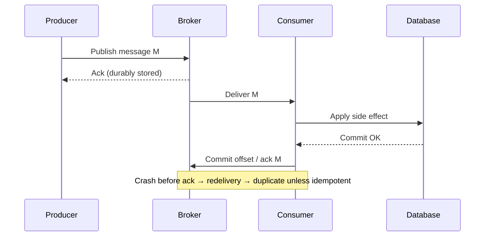
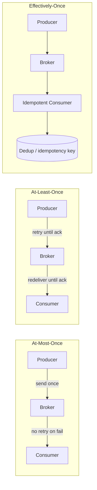
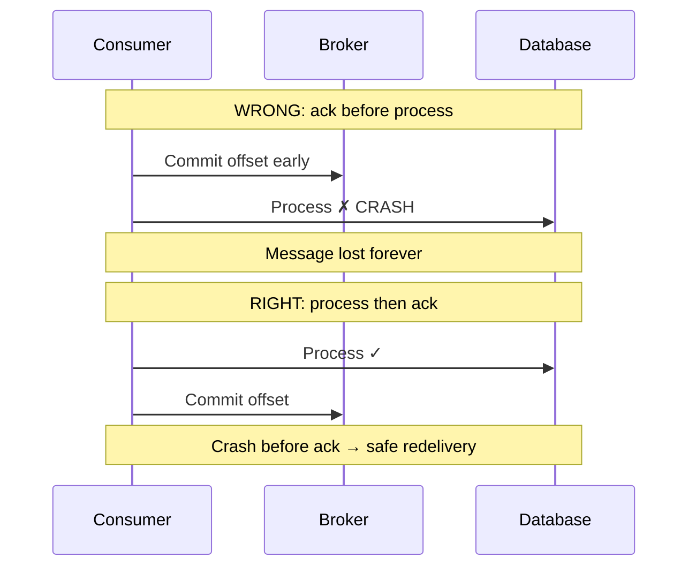

# Message Delivery Semantics

## 1. Executive Summary

**Message delivery semantics** describe what guarantees a messaging system provides when a producer sends a message and a consumer processes it. The three classical labels—**at-most-once**, **at-least-once**, and **exactly-once**—are often misunderstood because they apply at different layers (broker acknowledgment, consumer offset commit, end-to-end business effect) and because **exactly-once delivery** is impossible in the general asynchronous network model without cooperation from producers, brokers, and consumers.

In practice, production systems overwhelmingly implement **at-least-once** transport with **idempotent** or **deduplicated** consumers to achieve **effectively-once** processing. Architects must separate **safety** (no duplicate side effects) from **liveness** (messages eventually processed) and from **ordering** (per-partition or causal), because strengthening one dimension often weakens another.

This chapter covers formal semantics, acknowledgment protocols, offset management, transactional messaging, duplicate detection, failure scenarios, performance tradeoffs, and principal-level interview framing for designing reliable event-driven systems.

## 2. Why This Topic Matters

Principal interviews frequently ask: **"How do you guarantee a payment event is processed exactly once?"** Weak answers claim "Kafka exactly-once" or "use a queue with deduplication" without defining the scope.

Strong candidates explain:

- **At-least-once** is the default for durable messaging; duplicates are expected, not exceptional.
- **Exactly-once** at the broker layer (e.g., idempotent producer + transactional writes) does not automatically mean exactly-once business outcomes without idempotent handlers.
- **At-most-once** sacrifices data for simplicity—acceptable only when loss is tolerable (metrics, sampling).
- **Ordering** and **delivery guarantees** are orthogonal concerns.

Production incidents include double charges, duplicate inventory reservations, poison messages retried forever, and offset commits before processing causing silent loss. Architects who conflate broker guarantees with application correctness build systems that fail under retries, consumer restarts, and network partitions.

## 3. Problems Being Solved

| Problem | Naive approach | Messaging semantics approach |
|---------|----------------|------------------------------|
| Lost messages | Fire-and-forget UDP-style | Acknowledgments + durable log |
| Duplicate processing | Hope retries don't happen | Idempotency keys + dedup store |
| Partial failure | Retry blindly | At-least-once + compensating logic |
| Ordering violations | Single global queue | Partition keys + sequence numbers |
| Crash between process and ack | Undefined behavior | Transactional outbox or offset-after-process |

Messaging semantics solve **reliable asynchronous communication** across process and network failures. They do **not** solve **distributed transactions** without additional patterns (sagas, outbox, 2PC), **Byzantine adversaries**, or **automatic business-level deduplication** without application design.

## 4. Assumptions and System Model

Assume an **asynchronous network** with **partial failure**:

- Producers, brokers, and consumers are separate processes that can crash independently.
- Messages may be **delayed**, **duplicated**, or **reordered** across partitions unless the broker provides stronger guarantees.
- **Not Byzantine** unless discussing signed messages separately.
- Consumers may **crash after processing but before acknowledging** (duplicate) or **crash after ack but before processing** (loss with wrong ack ordering).

**Layers of semantics:**

| Layer | Question answered |
|-------|-------------------|
| Producer → broker | Did the broker durably accept the message? |
| Broker → consumer | Will the consumer see the message at least once? |
| Consumer → side effect | Will the business operation happen exactly once? |

End-to-end exactly-once requires alignment across all three layers plus idempotent or transactional application logic.

## 5. Essential Terminology

| Term | Definition |
|------|------------|
| **At-most-once** | Message delivered zero or one time; loss possible, no duplicates from retry. |
| **At-least-once** | Message delivered one or more times until acknowledged; duplicates possible. |
| **Exactly-once** | Each message causes exactly one observable effect—often **end-to-end** claim. |
| **Acknowledgment (ack)** | Consumer or broker confirmation of receipt or processing. |
| **Offset** | Position in a partition log; consumer commits offset after processing. |
| **Idempotent consumer** | Processing same message twice yields same state as once. |
| **Deduplication** | Store of seen message IDs to reject duplicates. |
| **Poison message** | Message that always fails processing; blocks or loops retries. |
| **Dead-letter queue (DLQ)** | Destination for messages that exceed retry limits. |
| **Effectively-once** | At-least-once transport + idempotent handler = one business effect. |

**Mnemonic:** **At-least-once arrives; idempotency makes it once.**

## 6. Core Mechanism

### At-least-once with manual acknowledgment



*Figure 1: At-least-once path—offset committed only after successful side effect; crash before ack causes redelivery.*

### Three semantic models compared



*Figure 2: At-most-once may lose; at-least-once may duplicate; effectively-once combines durable delivery with idempotent processing.*

### Offset commit ordering trap



*Figure 3: Committing offset before processing creates at-most-once behavior despite at-least-once broker.*

## 7. Step-by-Step Walkthrough

**Scenario:** Order service publishes `OrderCreated` events; payment service consumes and charges customer.

| Step | Action | Semantics implication |
|------|--------|----------------------|
| 1 | Producer sends event with `order_id` as key | Partition ordering per order |
| 2 | Broker replicates to ISR, acks producer | At-least-once if producer retries on timeout |
| 3 | Consumer polls message | Delivery to consumer process |
| 4 | Consumer checks idempotency table for `event_id` | Dedup before side effect |
| 5 | Consumer calls payment API with idempotency key | External system dedup |
| 6 | Consumer inserts `event_id` in local tx with business update | Atomic dedup + effect |
| 7 | Consumer commits Kafka offset | At-least-once preserved |

**Failure at step 6 after payment but before DB commit:**

- Redelivery occurs; idempotency key prevents double charge.
- **Safety** preserved; **liveness** requires consumer to eventually succeed or route to DLQ.

**Failure at step 7 after DB commit but before offset:**

- Redelivery; idempotency table hit—no duplicate charge.
- **Effectively-once** achieved.

**Auto-commit anti-pattern:**

| Setting | Behavior | Risk |
|---------|----------|------|
| `enable.auto.commit=true` before process | Offset may advance on poll | Lost messages on crash |
| Manual commit after process | Redelivery on crash | Duplicates—need idempotency |
| Transactional consume-process-produce | Atomic offset + output | Higher latency, broker support required |

**End-to-end semantics decision matrix:**

| Business domain | Recommended transport | Effect boundary | Reconciliation |
|-----------------|----------------------|-----------------|----------------|
| Payment capture | At-least-once + idempotent API | Payment provider + ledger DB | Nightly gateway match |
| Inventory reservation | At-least-once + conditional DB update | `WHERE stock >= qty` | Stock count audit |
| Email notification | At-least-once (duplicate email acceptable) or at-most-once | Email provider dedup if available | Low priority |
| Metrics / telemetry | At-most-once or sampling | Dashboard aggregates | Statistical tolerance |
| Audit log append | At-least-once + unique event_id | Append-only audit table | Immutable log review |

**Comparing broker "exactly-once" to application guarantees:**

Kafka's transactional API provides **read_committed** isolation for consumers within a transaction—messages from aborted transactions are not visible. This is a **broker safety** property: it prevents duplicate *published* messages from failed transactions from appearing downstream. It does **not** prevent a consumer from:

1. Processing a message and crashing before committing the transaction offset.
2. Successfully calling an external HTTP API twice on redelivery.
3. Writing to two external systems where only one succeeds.

Principal architects document a **semantics matrix** per pipeline stage so teams do not assume one checkbox solves the entire flow.

**Idempotency implementation patterns (detailed):**

| Pattern | Mechanism | Pros | Cons |
|---------|-----------|------|------|
| Natural idempotency | `SET balance = 100` (absolute) | No extra store | Rare in event-driven updates |
| Idempotency key table | `INSERT event_id` with unique constraint | Simple, auditable | Storage growth; needs TTL |
| Conditional update | `UPDATE ... WHERE version = N` | Optimistic concurrency | Conflicts on hot keys |
| Outbox + single consumer | Serialized processing per aggregate | Strong per-entity ordering | Throughput limit per key |
| Bloom filter pre-check | Probabilistic duplicate detection | Memory efficient | False positives need handling |

**Consumer offset storage co-location:**

The strongest pattern stores the processed offset (or `event_id`) in the **same database transaction** as the business write:

```
BEGIN;
  INSERT INTO invoices (...) VALUES (...);
  INSERT INTO processed_events (event_id) VALUES ('evt-123');
COMMIT;
-- then commit Kafka offset
```

If the process crashes after DB commit but before offset commit, redelivery occurs; the unique constraint on `event_id` makes the retry a no-op. This is the practical foundation of **effectively-once** in microservices without distributed transactions across Kafka and PostgreSQL.

## 8. Invariants and Guarantees

| Property | Type | Statement |
|----------|------|-----------|
| **No duplicate side effects** | Safety (application) | Requires idempotency or dedup—not broker default |
| **No message loss** | Safety | Requires at-least-once + correct ack ordering |
| **Eventual delivery** | Liveness | Consumer must progress; poison messages threaten |
| **Per-partition ordering** | Safety (ordering) | Single consumer per partition preserves order |
| **Global exactly-once delivery** | **Impossible** (general async model) | Without shared transactional boundary |

**Formal distinction:** Broker **exactly-once semantics** (Kafka transactions) provide **atomic write of messages to multiple partitions** and **read-process-write** within a transaction scope—they do not replace application idempotency for external systems (payment gateways, email APIs).

## 9. Failure Scenarios

### Scenario 1: Producer retry after successful write

**Setup:** Producer times out waiting for ack; broker actually stored message; producer retries.

**Effect:** Duplicate messages in log—distinct offsets, same payload.

**Mitigation:** Idempotent producer (PID + sequence); dedup on `business_id`; compacted topics with key-based dedup.

### Scenario 2: Consumer crash after processing

**Setup:** Payment charged; offset not committed; consumer restarts.

**Effect:** Redelivery—duplicate unless idempotent.

**Mitigation:** Idempotency keys; store processed offsets in same DB transaction as side effect.

### Scenario 3: Consumer crash after offset, before processing

**Setup:** Auto-commit enabled; crash before handler runs.

**Effect:** Message lost—**at-most-once**.

**Mitigation:** Disable auto-commit; commit only after success.

### Scenario 4: Poison message

**Setup:** Malformed payload causes infinite exceptions.

**Effect:** Consumer stuck; partition lag grows; no liveness.

**Mitigation:** Retry budget; DLQ; schema validation at produce time.

### Scenario 5: Rebalance during processing

**Setup:** Consumer group rebalance assigns partition mid-batch.

**Effect:** Duplicate processing if offset committed for whole batch but only partial process.

**Mitigation:** Cooperative sticky assignors; process-then-commit per message; transactional processing.

### Scenario 6: Split brain consumer

**Setup:** Two consumers believe they own same partition (misconfiguration or long GC pause).

**Effect:** Parallel duplicate processing.

**Mitigation:** Single active consumer pattern; fencing; short session timeouts with careful tuning.

## 10. Performance Characteristics

| Factor | Impact |
|--------|--------|
| Synchronous replication | Higher durability latency before producer ack |
| Manual ack per message | Lower throughput than batch commit |
| Idempotency store lookup | Extra read per message—cache hot keys |
| Transactional messaging | ~20–30% throughput reduction (implementation-dependent; verify per broker version) |
| DLQ routing | Small overhead; prevents catastrophic retry storms |

**Compared to synchronous RPC:** Messaging decouples latency but introduces **eventual processing** and **duplicate handling** complexity. Batch consumers achieve higher throughput by amortizing ack cost.

## 11. Scalability Limits

- **Dedup store growth**—TTL or compaction required for unbounded `event_id` sets.
- **Per-partition ordering** caps parallel consumers per key to one.
- **Transactional coordinator** becomes bottleneck at extreme produce rates.
- **DLQ volume** during bad deploys can overwhelm ops—rate-limit poison routing.

## 12. Operational Considerations

- **Consumer lag** alerts per partition—not just aggregate.
- **DLQ replay** tooling with idempotency preserved.
- **Schema registry** enforcement prevents poison payloads.
- **Runbooks** for "lag spiking" vs "duplicates detected in reconciliation."
- **Dashboards:** produce rate, consume rate, retry count, DLQ depth.
- **Chaos tests:** kill consumer mid-batch; verify no loss and bounded duplicates.

## 13. Security Considerations

- **Message tampering:** TLS in transit; optional signing for high-trust domains.
- **Replay attacks:** Idempotency keys bound to tenant and time window.
- **ACLs:** Producers and consumers least-privilege per topic.
- **PII in messages:** Encryption at rest; minimize payload sensitivity.

## 14. Cost Considerations

- **At-least-once with dedup:** Extra storage (dedup table) and read amplification.
- **Exactly-once broker features:** Higher broker CPU and latency.
- **DLQ storage and replay labor:** Operational cost during incidents.
- **Saved cost:** Avoids custom lossy pipelines that require manual data repair.

## 15. Production Implementations

### Apache Kafka

- **At-least-once:** Default with `acks=all` and consumer manual commit.
- **Idempotent producer:** `enable.idempotence=true` deduplicates producer retries within session.
- **Transactions:** Atomic multi-partition produce and consume-transform-produce within `transactional.id`.

### Amazon SQS

- **At-least-once** standard queues; **at-most-once** FIFO with deduplication ID (within 5-minute window—verify current AWS docs).
- Visibility timeout drives redelivery semantics.

### RabbitMQ

- **Ack/nack** manual mode for at-least-once; **publisher confirms** for durable publish.
- No native exactly-once—application dedup required.

### Google Pub/Sub

- **At-least-once** delivery; acknowledgment deadline extensions.
- Ordering keys provide per-key sequence.

### Pulsar

- **Acknowledgment types:** individual, cumulative, negative ack with redelivery.
- **Transaction API** for end-to-end atomicity within Pulsar scope.

**Implementation note:** Vendor "exactly-once" marketing often means **broker-internal** guarantees—always map to your **business effect** boundary.

## 16. Alternatives and Tradeoffs

| Approach | Duplicates | Loss risk | Complexity |
|----------|------------|-----------|------------|
| At-most-once | None | High | Low |
| At-least-once + idempotency | Transport duplicates | Low | Medium |
| Broker transactions | Reduced in log | Low | High |
| Outbox + CDC | Controlled emission | Low | Medium |
| Synchronous RPC + DB | None in message layer | Coupled failure | Medium |

## 17. Common Misconceptions

| Misconception | Reality |
|---------------|---------|
| "Exactly-once Kafka = no duplicate charges" | External APIs need idempotency keys. |
| "Auto-commit is fine for payments" | Creates at-most-once loss window. |
| "FIFO = exactly-once" | FIFO orders; duplicates still possible on retry. |
| "Dedup table optional for idempotent APIs" | APIs may not be idempotent; local dedup still needed. |
| "More retries = safer" | Retries amplify duplicates and load without idempotency. |

## 18. Principal Architect Perspective

1. **Define the effect boundary**—database row, payment API, or email send—before choosing semantics.
2. **Standardize idempotency keys** across all event consumers; reject messages without them on critical paths.
3. **Never auto-commit offsets** on financial or inventory topics.
4. **Pair messaging with reconciliation**—nightly compare ledger to events.
5. **Document semantic contract** per topic: ordering, retention, delivery, schema version.

**Governance:** Publish a **messaging contract** template (delivery, ordering, schema, DLQ policy) for every new topic. Teams that skip this recreate the same offset and dedup bugs in every microservice.

## 19. Architecture Review Exercise

**Scenario:** Team uses Kafka with `enable.auto.commit=true`, processes payments in consumer, no idempotency keys.

**Review prompts:**

1. What happens on consumer crash after charge?
2. What happens on consumer crash after poll, before charge?
3. How would reconciliation detect issues?
4. Redesign for effectively-once?

**Expected findings:** Disable auto-commit; idempotency key per `order_id`; dedup table; DLQ; payment provider idempotency; lag and duplicate-rate metrics.

## 20. Whiteboard Explanation

**90-second version:**

> "Message delivery semantics describe whether messages can be lost, duplicated, or processed once. Pure exactly-once end-to-end is impossible over an async network without cooperation—you get at-least-once from durable brokers with acknowledgments. Duplicates happen when producers retry, consumers crash before acking, or rebalances occur. The production pattern is at-least-once transport plus idempotent consumers: store processed message IDs or use business idempotency keys in the same database transaction as your side effect. Commit offsets only after successful processing—auto-commit before process creates silent loss. Broker transactions like Kafka exactly-once shrink the duplicate window inside the broker but don't fix external API calls. Define your effect boundary, design for duplicates, and reconcile money paths."

## 21. Interview Questions

1. **Define at-least-once vs at-most-once.**
   - *Signals:* Duplicates vs loss; ack timing.

2. **Is exactly-once possible end-to-end?**
   - *Signals:* Impossible in general; effectively-once with idempotency.

3. **When commit Kafka offset?**
   - *Signals:* After process; same tx as side effect ideally.

4. **What does Kafka idempotent producer do?**
   - *Signals:* Dedupes producer retries via PID/sequence—not consumer dedup.

5. **Auto-commit risks?**
   - *Signals:* At-most-once loss.

6. **Poison message handling?**
   - *Signals:* Retry limit, DLQ, alert.

7. **Ordering vs delivery semantics?**
   - *Signals:* Orthogonal; partition key ordering.

8. **Design payment consumer semantics.**
   - *Signals:* Idempotency key, dedup, manual ack, reconciliation.

9. **DLQ replay safety?**
   - *Signals:* Idempotency must hold on replay.

10. **Transactional outbox relation?**
    - *Signals:* Reliable publish aligned with DB commit.

**Scoring rubric:**

| Dimension | Strong | Weak |
|-----------|--------|------|
| Layer clarity | Producer/broker/consumer/effect | "Kafka EOS" hand-wave |
| Failure cases | Crash before/after ack | Ignores retries |
| Mitigation | Idempotency + offset order | "Use exactly-once" |

## 22. Interview Follow-Ups

1. **Duplicate charges reported—debug?**
   - *Signals:* Idempotency audit, offset commit order, producer retries, rebalance logs.

2. **At-most-once acceptable when?**
   - *Signals:* Metrics, logs, non-critical telemetry.

3. **How dedup store scale?**
   - *Signals:* TTL, partition by key, compacted topic of processed IDs.

## 23. Strong Answer Example

**Question:** "Guarantee order events processed exactly once for billing."

> "I'd scope **effectively-once** at the billing database and payment provider. Transport is **at-least-once** Kafka with `acks=all` and manual offset commit **after** a local transaction that inserts `event_id` into a processed_events table and creates the invoice row—unique constraint on `event_id` rejects duplicates. Payment API calls use `order_id` as idempotency key. On failure before commit, offset isn't advanced—safe redelivery. Poison messages go to DLQ after N retries with alert. Nightly reconciliation compares invoices to order service. I won't rely on `enable.auto.commit` or broker exactly-once alone for external payment effects."

## 24. Weak Answer Example

**Question:** "Guarantee order events processed exactly once for billing."

> "Turn on Kafka exactly-once and use a consumer group."

**Why weak:** No effect boundary, no idempotency, no offset ordering, no external API handling.

## 25. Hands-On Exercise

Pair with [Lab 006: Kafka Stream Processing](/docs/messaging-and-streaming/kafka-architecture#25-hands-on-exercise) — produce orders, run enricher twice to see idempotent dedup, inject poison → DLT.

Pair with [Lab 009: Transactional Outbox](/docs/transactions/transactional-outbox#25-hands-on-exercise) — run `POST /v1/consumer/run` twice to see at-least-once delivery + idempotent dedup (`duplicates: 1` on second run).

1. Run Kafka locally; produce 100 messages with a duplicate injection script.
2. Consumer with auto-commit—measure loss on kill -9 mid-process.
3. Add manual commit after process; observe duplicates on kill.
4. Add SQLite dedup table in same logical unit as handler.
5. Plot duplicate rate vs retry policy.
6. Route failing messages to DLQ topic.
7. Document semantic contract for your topic.

## 26. Knowledge Check

1. At-least-once may produce? *(Duplicates.)*
2. Auto-commit before process risks? *(Message loss.)*
3. Effectively-once requires? *(At-least-once + idempotent handler.)*
4. Idempotent producer dedupes? *(Producer retries within session—not all duplicates.)*
5. Poison message destination? *(DLQ after retry budget.)*

## 27. Flashcards

| # | Front | Back |
|---|-------|------|
| 1 | At-most-once | Zero or one delivery; loss OK. |
| 2 | At-least-once | One or more until acked. |
| 3 | Effectively-once | At-least-once + idempotency. |
| 4 | Offset commit timing | After process for safety. |
| 5 | Idempotent producer | Kafka PID/sequence dedup. |
| 6 | DLQ | Failed messages after retries. |
| 7 | Poison message | Always fails processing. |
| 8 | Ordering | Per-partition with single consumer. |
| 9 | Auto-commit trap | Lossy at-most-once behavior. |
| 10 | Effect boundary | DB vs API vs broker scope. |

## 28. Cheat Sheet

```
SEMANTICS
  At-most-once:  may LOSE
  At-least-once: may DUPLICATE
  Exactly-once:  impossible E2E generally
  Effectively-once: ALO + idempotent consumer

OFFSET RULE
  Process → then commit offset
  Never auto-commit before side effect

DEDUP
  event_id unique constraint
  Business idempotency key for APIs
  TTL on dedup store

OPS
  Lag per partition
  DLQ depth
  Reconciliation for money
```

## 29. Related Concepts

- [Idempotency](/docs/distributed-systems-foundations/idempotency) — foundation for effectively-once
- [Transactional Outbox](/docs/transactions/transactional-outbox) — align DB commit with publish
- [Kafka Architecture](/docs/messaging-and-streaming/kafka-architecture) — broker-level guarantees
- [Event-Driven Architecture](/docs/messaging-and-streaming/event-driven-architecture) — system-wide event patterns
- [Sagas](/docs/transactions/sagas) — multi-step workflows over at-least-once transport

## 30. References

### Primary sources

- Chandy, K. M., & Lamport, L. (1985). "Distributed Snapshots: Determining Global States of Distributed Systems." *ACM TOCS* — foundational distributed state reasoning.
- Kleppmann, M. (2017). *Designing Data-Intensive Applications* — Ch. 11 stream processing delivery semantics.

### Official documentation

- [Apache Kafka Documentation — Exactly Once Semantics](https://kafka.apache.org/documentation/#semantics) — idempotent producer and transactions.
- [Amazon SQS — At-Least-Once Delivery](https://docs.aws.amazon.com/AWSSimpleQueueService/latest/SQSDeveloperGuide/sqs-queue-types.html) — verify FIFO deduplication window.

### Distinction

| Claim type | Source |
|------------|--------|
| Impossibility of pure EOS over async network | Distributed systems theory; DDIA |
| Kafka idempotent producer behavior | Apache Kafka documentation |
| Effectively-once pattern | Engineering practice; Kleppmann |
