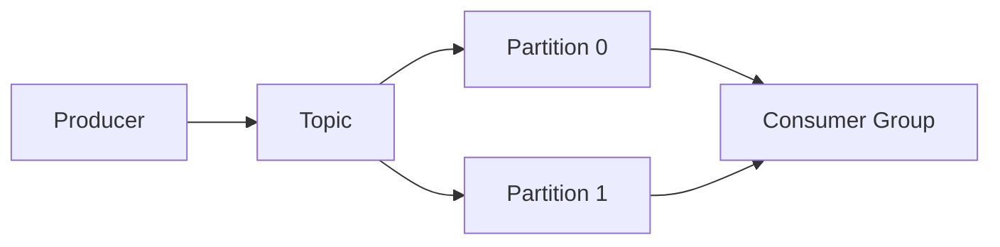

# Messaging and Streaming

Kafka, delivery semantics, event-driven architecture, and stream processing at scale.

*Figure: Event log with partitions and consumer group parallelism.*

## What You'll Learn

Message brokers decouple producers from consumers and absorb load spikes. This domain covers at-most-once, at-least-once, and exactly-once semantics, Kafka's log-based architecture, and event-driven system design patterns.

## Chapters

| Chapter | Focus |
|---------|-------|
| [Message Delivery Semantics](/docs/messaging-and-streaming/message-delivery-semantics) | At-most/at-least/exactly-once, idempotent consumers |
| [Kafka Architecture](/docs/messaging-and-streaming/kafka-architecture) | Topics, partitions, consumer groups, ISR |
| [Event-Driven Architecture](/docs/messaging-and-streaming/event-driven-architecture) | Event notification vs event-carried state, CQRS |

## Learning Path

1. **Message Delivery Semantics** — foundation for every streaming design.
2. **Kafka Architecture** — the de facto interview standard for event logs.
3. **Event-Driven Architecture** — when to use events vs synchronous calls.

## Interview Prep

| Resource | Topic |
|----------|-------|
| [Slack Message Delivery](/docs/real-world-scenarios/slack-message-delivery) | Ordering, Kafka, delivery guarantees |
| [Shopify Transactional Outbox](/docs/real-world-scenarios/shopify-transactional-outbox) | Reliable event publishing |
| Lab | [Kafka stream processing](/docs/messaging-and-streaming/kafka-architecture#25-hands-on-exercise) on **`:8094`** — [engineer guide](/docs/messaging-and-streaming/kafka-architecture#engineer-guide-how-the-local-stack-works) |

## Prerequisites

- [Transactions](/docs/transactions/overview) — outbox pattern
- [Distributed Systems Foundations](/docs/distributed-systems-foundations/idempotency)

## Next Domain

Continue to [Caching](/docs/caching/overview) and [Microservices](/docs/microservices/overview).

Return to the [Curriculum Overview](/docs/start-here/curriculum-overview) for the full learning path.
