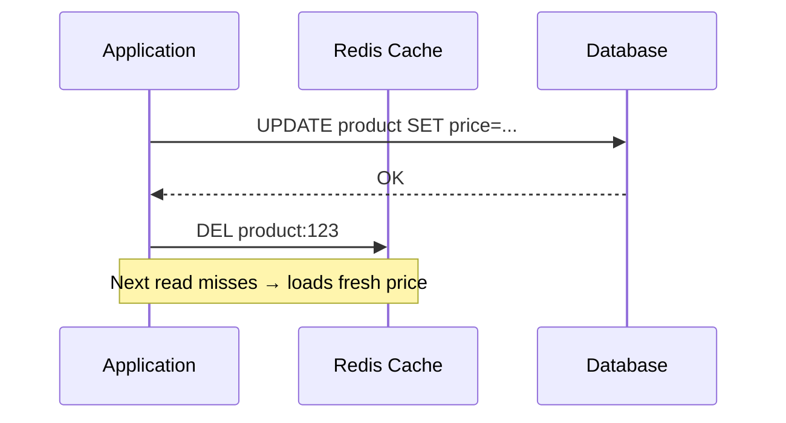
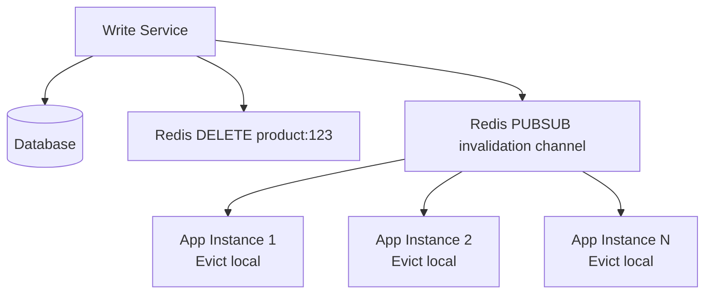
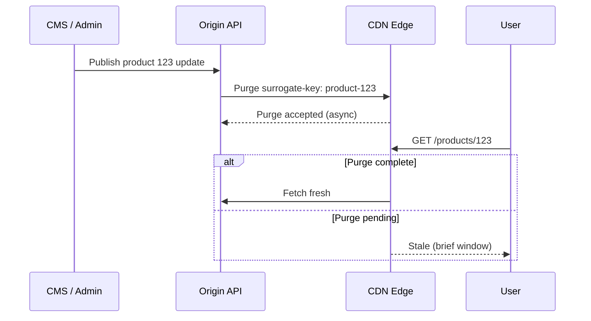

# Cache Invalidation

## 1. Executive Summary

**Cache invalidation** is the process of removing or updating cached entries so clients do not observe indefinitely stale data relative to the authoritative source. Phil Karlton's aphorism—*"There are only two hard things in Computer Science: cache invalidation and naming things"*—remains relevant because invalidation spans **multiple cache tiers**, **concurrent writers**, **eventual propagation delay**, and **ambiguous ownership** of who invalidates what.

Strategies include **TTL-only** (accept bounded staleness), **write-invalidate** (delete keys on mutation), **write-update** (push new value to cache), **version stamps** (compare-and-swap semantics), **pub/sub fan-out** (notify all app instances), **CDC-driven** invalidation, and **CDN purge APIs**. No single strategy fits all data—**prices** demand immediate invalidation; **aggregate counters** may tolerate seconds; **static assets** use content-hash immutability.

This chapter covers invalidation patterns, consistency models, multi-tier propagation, failure modes, CDN specifics, stampede prevention, and principal-level design for correct cached systems.

## 2. Why This Topic Matters

Interviewers probe beyond "add Redis": **"Product price changes—how fast do users see it?"** Weak answers say "short TTL."

Strong candidates explain:

- **TTL is a staleness bound**, not guaranteed freshness after writes.
- **Delete-on-write** beats update-on-write for race avoidance in cache-aside.
- **CDN purge** is slow and rate-limited—immutable URLs often beat purge.
- **Invalidation storms** can overload origin during mass updates.
- **Derived cache keys** (aggregates, joins) multiply invalidation surface.

Production bugs include **double-discount** from stale coupons, **sold-out items** still purchasable, **permissions** cached after revocation, and **cross-region** stale reads after partial purge. Invalidation is where caching becomes a **correctness** problem, not just performance.

## 3. Problems Being Solved

| Problem | Naive TTL-only | Invalidation strategy |
|---------|----------------|----------------------|
| Stale writes visible | Wait until TTL | Proactive delete on write |
| Multi-tier caches | Each tier diverges | Coordinated purge or versioned URLs |
| Derived data | Orphan stale aggregates | Track dependencies or recompute |
| Global CDN | Hours of stale content | Purge API or immutable asset pattern |
| Permission revocation | Security window | Short TTL + explicit invalidation |

Invalidation solves **freshness correctness** within defined SLAs. It does **not** provide **strong linearizability** across all readers without synchronous read-through or bypassing cache on critical reads.

## 4. Assumptions and System Model

Assume **multiple writers** (admin APIs, batch jobs, replication) and **multiple cache layers** (local, Redis, CDN):

- **Authoritative source** is database or event log.
- **Invalidation messages** may be **lost**, **duplicated**, or **reordered** (at-least-once pub/sub).
- **Propagation** is not instantaneous—milliseconds to minutes depending on tier.
- **Clock skew** affects TTL expiry times slightly—not for logical versioning.

**Staleness SLA examples:**

| Data type | Typical SLA | Strategy |
|-----------|-------------|----------|
| Stock price | < 1s | Invalidate + short TTL |
| Product description | < 5 min | TTL + invalidate on admin |
| Avatar image | Minutes–hours | Immutable URL with hash |
| Session permissions | Immediate | No cache or sub-second TTL + revoke |

## 5. Essential Terminology

| Term | Definition |
|------|------------|
| **TTL invalidation** | Passive expiry by time. |
| **Active invalidation** | Explicit delete/update on data change. |
| **Write-invalidate** | Remove cache entry on write. |
| **Write-update** | Push new value to cache on write. |
| **Version stamp** | Monotonic version; readers reject old versions. |
| **Cache tagging** | Group keys under tag; invalidate tag in one operation. |
| **Surrogate key** | CDN tag for related objects (e.g., all product pages). |
| **Purge vs ban** | Purge removes if present; ban prevents future cache (CDN-specific). |
| **Thundering herd** | Many concurrent misses after invalidation. |
| **Torn cache** | Partially updated related keys—inconsistent view. |

**Mnemonic:** **Invalidate proactively; TTL is the safety net.**

## 6. Core Mechanism

### Write-invalidate (cache-aside)



*Figure 1: Delete cache after DB commit—preferred over UPDATE cache for race safety.*

### Pub/sub fan-out to local caches



*Figure 2: Distributed local caches require broadcast invalidation—missed message = stale local entry until TTL.*

### CDN surrogate key purge



*Figure 3: CDN purge is asynchronous—design for brief staleness or immutable URLs.*

## 7. Step-by-Step Walkthrough

**Scenario:** Blog platform caches article HTML in Redis, local cache, and CDN.

| Layer | Key / mechanism | Invalidation on publish |
|-------|-----------------|-------------------------|
| DB | `articles` table | Source update |
| Redis | `article:{slug}` | DEL on publish webhook |
| Local | Caffeine `article:{slug}` | Redis pub/sub `invalidate:{slug}` |
| CDN | URL `/articles/{slug}` | Surrogate-key purge `article-{id}` |

**Ordering requirement:**

| Step | Action | Risk if wrong order |
|------|--------|---------------------|
| 1 | Commit DB with new content | — |
| 2 | DEL Redis | Stale if before DB commit |
| 3 | PUBSUB local evict | Brief local staleness if missed |
| 4 | CDN purge | Async delay unavoidable |

**Derived key problem:**

| Cached key | Depends on |
|------------|------------|
| `homepage:featured` | Articles 1, 5, 9 |
| `category:tech:list` | All tech articles |

Updating article 5 must invalidate **all derived keys**—maintain dependency graph or avoid caching aggregates without tagging.

**Version stamp alternative:**

| Approach | Mechanism |
|----------|-----------|
| Store `{value, version}` in cache | Writer bumps version in DB |
| Reader compares cache version to DB version on read | Reject stale cache |

Higher read cost but simpler fan-out for read-heavy paths.

**Two-cache problem (Martin Thompson):**

When two independent caches store related data without coordination, readers may observe **inconsistent combinations**—cache A fresh, cache B stale. Example: product price cache updated but category listing cache still shows old price.

| Solution | Tradeoff |
|----------|----------|
| Single aggregate cache key | Larger values; over-invalidation |
| Version vector on all related keys | Reader checks all versions match |
| Invalidate all related on any change | Tag-based invalidation |
| Don't cache aggregates | Higher origin load |

**Probabilistic early expiration (stampede prevention detail):**

Instead of fixed TTL expiry for hot keys, each read has small probability `p` of treating the key as expired even if TTL remains:

```
if (now > expiry - jitter) OR (random() < p):
    trigger background refresh (single-flight)
    return stale value if refresh in progress
```

This spreads refresh load over time rather than concentrating at exact expiry. Libraries like `cachestampede` implement variants—**verify** algorithm against your staleness SLA.

**Invalidation via change data capture (CDC):**

| Step | Component |
|------|-----------|
| 1 | Database commit changes row |
| 2 | Debezium reads WAL/binlog |
| 3 | Invalidation service consumes change event |
| 4 | Maps table row to cache key(s) via config |
| 5 | DEL Redis keys; optional pub/sub to local caches |

**Advantage:** Writers do not need cache knowledge—decouples teams. **Disadvantage:** CDC lag (typically ms–seconds) creates invalidation delay; derived key mapping must be maintained in invalidation service config.

**Legal and compliance invalidation:**

GDPR **right to erasure** requires deleting personal data from **all** cache tiers including CDN edge nodes—not just origin database. Maintain a **data map** listing which cache keys may contain PII and automate purge on erasure requests. Failure to purge CDN cached profile pages is a documented compliance gap in several enforcement actions—treat CDN as part of data storage scope.

**Cache-aside race conditions (detailed):**

| Race | Sequence | Outcome |
|------|----------|---------|
| Read stale after write | T1: Writer updates DB; T2: Reader misses cache (not yet invalidated); T2: Reader loads OLD DB value if read replica lags; T2: Reader SETs stale value | Extended staleness |
| Thundering populate | N readers miss; N concurrent DB queries | Origin spike |
| Lost invalidation | Invalidation message lost; TTL only recovery | Stale until TTL |

**Fix for populate race:** Use per-key lock (mutex) or `SETNX` with short TTL during populate—only one loader per key.

**Write-behind consistency window:**

Write-behind caches acknowledge writes immediately and batch-flush to DB asynchronously:

| Benefit | Risk |
|---------|------|
| Sub-ms write latency | Data loss if cache node crashes before flush |
| Absorbs write spikes | Complex conflict resolution on flush |

Use write-behind only when business tolerates seconds of durability risk and you have WAL/replay on cache failure—or restrict to non-critical counters.

**CDN cache key normalization:**

CDNs cache by full URL including query string—`?v=1` and `?v=2` are different cache entries. Standardize:

- Version in path (`/assets/app.v42.js`) not query for cache efficiency.
- Normalize query parameter ordering if query-based keys unavoidable.
- Use surrogate keys for logical invalidation across URL variants.

**Invalidation SLA documentation template:**

Every cached entity should have an entry in the **cache contract**:

| Field | Example |
|-------|---------|
| Entity | `Product.price` |
| Cache keys | `product:{id}`, CDN surrogate `product-{id}` |
| Max staleness | 5 seconds |
| Invalidation trigger | `ProductUpdated` event, admin API |
| Owner team | Catalog |
| Fallback | TTL 60s |

This template forces explicit ownership—gaps surface in architecture review rather than production incidents.

**Multi-writer invalidation coordination:**

When multiple services can update the same entity (e.g., admin API and batch price sync job), invalidation must be **centralized or idempotent**:

| Approach | Description |
|----------|-------------|
| Single writer principle | Only one service mutates; others request via API |
| Shared invalidation topic | All writers publish `InvalidateKey` events |
| Version monotonic | Highest version wins; stale invalidations harmless |

Without coordination, race between two writers can leave cache inconsistent with DB even after both invalidate—last writer to DB must win; use DB version in cache value.

**Principal review checkpoint:** Ask "what is the maximum staleness a customer can observe after an admin update?" If the team cannot answer with a number and tier breakdown (local, Redis, CDN), the invalidation design is incomplete.

**Hands-on validation:** Measure end-to-end staleness with integration tests that write to DB, poll CDN edge and Redis until fresh or timeout—automate this in CI for price-sensitive entities.

## 8. Invariants and Guarantees

| Property | Type | Statement |
|----------|------|-----------|
| **Fresh read after invalidation** | Safety (eventual) | After propagation completes |
| **No stale read forever** | Liveness | TTL provides ultimate bound |
| **Immediate global consistency** | **Not** guaranteed | CDN and local tiers lag |
| **Invalidation idempotency** | Safety | Duplicate DEL safe |

## 9. Failure Scenarios

### Scenario 1: Invalidation before DB commit

**Setup:** DELETE cache then DB transaction rolls back.

**Effect:** Cache empty; next read loads old DB value—OK. Worse variant: UPDATE cache then rollback leaves **wrong cache**.

**Mitigation:** Invalidate only **after** commit; transactional outbox for invalidation events.

### Scenario 2: Missed pub/sub message

**Setup:** App instance offline during invalidation broadcast.

**Effect:** Stale local cache until TTL.

**Mitigation:** Short local TTL; periodic version check for critical data.

### Scenario 3: Partial derived invalidation

**Setup:** Product update; homepage aggregate not invalidated.

**Effect:** Wrong featured price on homepage.

**Mitigation:** Tag-based invalidation; recompute aggregates from events.

### Scenario 4: CDN purge rate limit

**Setup:** Black Friday mass price update; 10k purges.

**Effect:** Purge queue backlog; widespread stale prices.

**Mitigation:** Immutable versioned URLs (`/price/v42`); batch surrogate purge; accept SLA.

### Scenario 5: Invalidation stampede

**Setup:** DEL hot key; 50k requests miss simultaneously.

**Effect:** Origin overload.

**Mitigation:** Single-flight reload; soft TTL with background refresh.

### Scenario 6: Cross-region replication lag

**Setup:** Write to primary region; read from replica before replicate.

**Effect:** Cache repopulated with stale replica data.

**Mitigation:** Read-your-writes routing; invalidate after replication ack.

## 10. Performance Characteristics

| Strategy | Write path cost | Read path cost | Freshness |
|----------|-----------------|----------------|-----------|
| TTL only | Low | Low | Bounded stale |
| Write-invalidate | Medium (DEL) | Low after warm | Good post-propagation |
| Write-update | Medium | Lowest if hit | Race risk |
| Version check each read | Low write | Higher read | Stronger |
| CDC invalidation | Async lag | Low | Near-real-time |

**Pub/sub fan-out:** O(instances) messages per invalidation—acceptable for admin edits; problematic for high-frequency writes.

## 11. Scalability Limits

- **Tag purge** cardinality—some CDNs limit tags per object.
- **Dependency graph** maintenance complexity grows with aggregate caches.
- **Invalidation rate** during flash sales may exceed purge API quotas.
- **Global CDN** purge propagation 150ms–minutes (vendor-dependent; verify docs).

## 12. Operational Considerations

- **Invalidation audit log**—who purged what, when.
- **Dashboards:** stale read reports, purge queue depth, post-deploy cache hit drop.
- **Runbooks:** emergency global purge; disable cache toggle flag.
- **Integration tests:** publish → assert all tiers within SLA.
- **Feature flag** to bypass cache for debugging.

## 13. Security Considerations

- **Authorization cache** must invalidate on role change—security-critical.
- **Purge API keys** highly privileged—prevent attacker mass purge DoS.
- **Cache key guessing** after invalidation may timing-attack—low risk but awareness.
- **GDPR erasure** requires delete across all tiers including CDN.

## 14. Cost Considerations

- **CDN purge API** may be priced per request at scale.
- **Over-invalidation** increases origin load—balance freshness vs cost.
- **Immutable asset pattern** reduces purge needs—storage for multiple versions.
- **Engineering time** for dependency tracking—expensive for complex aggregates.

## 15. Production Implementations

### Redis keyspace notifications / pub/sub

Lightweight app instance coordination—**not durable**; missed messages possible.

### Debezium CDC → invalidation service

Database change stream triggers cache deletes—decouples writers from cache knowledge.

### Varnish / Fastly surrogate keys

Tag-based bulk purge for related HTML fragments.

### CloudFront invalidation

Path-based purge; limits on concurrent invalidations—check AWS current quotas.

### Hibernate second-level cache

Region invalidation on entity update—ORM-managed; understand session boundaries.

### GraphQL @cacheControl

Schema-level TTL and scope—CDN integration in Apollo Router and similar.

## 16. Alternatives and Tradeoffs

| Approach | Freshness | Complexity | Write amplification |
|----------|-----------|------------|---------------------|
| TTL only | Poor on change | Lowest | None |
| Write-invalidate | Good | Medium | Low |
| Immutable URLs | Excellent for assets | Medium | New object per version |
| No cache on critical reads | Perfect | Low read perf | None |
| Event-driven materialized views | Eventual | High | Recompute on event |

## 17. Common Misconceptions

| Misconception | Reality |
|---------------|---------|
| "Zero staleness with CDN" | Purge is async; plan for window. |
| "UPDATE cache is simpler than DELETE" | Races cause stale writes winning. |
| "One TTL fits all" | Entity-specific SLAs required. |
| "Invalidation is instant everywhere" | Multi-tier propagation takes time. |
| "CDC solves everything" | Lag + derived keys still hard. |

## 18. Principal Architect Perspective

1. **Classify data** into freshness tiers before choosing strategy.
2. **Prefer immutable URLs** for static content over purge-heavy workflows.
3. **Delete not update** cache on write in cache-aside.
4. **Tag related keys** early—retrofit is painful.
5. **Test invalidation** in CI as first-class scenario.

**Governance:** Cache invalidation contracts in API design—every write endpoint documents which keys/tags it invalidates.

## 19. Architecture Review Exercise

**Scenario:** Marketplace caches seller ratings aggregate; individual review updates don't invalidate; 1-hour TTL.

**Review prompts:**

1. Fraudulent review hidden—visible in aggregate?
2. Legal takedown timeline met?
3. Redesign invalidation?

**Expected findings:** Invalidate aggregate on review change; event-driven recompute; shorter TTL for legal-sensitive data.

## 20. Whiteboard Explanation

**90-second version:**

> "Cache invalidation keeps cached data from going stale wrong. TTL alone means users see old data until expiry—use TTL as safety net, not primary strategy. On writes, commit to database first, then delete cache keys—delete beats update because concurrent reads won't write stale values back. Multiple tiers need coordinated invalidation: Redis DEL plus pub/sub to evict local caches plus CDN surrogate-key purge. CDN purge is async and rate-limited—use content-hash immutable URLs when possible. Derived caches like homepage lists need tag invalidation or dependency tracking. Watch thundering herd after mass invalidation—single-flight reload. Classify data by staleness SLA—prices aren't like profile bios."

## 21. Interview Questions

1. **TTL vs active invalidation?**
   - *Signals:* Bound vs proactive; combine both.

2. **Delete vs update cache on write?**
   - *Signals:* Delete avoids races.

3. **CDN stale after purge?**
   - *Signals:* Async propagation; immutable URLs.

4. **Invalidate local + Redis?**
   - *Signals:* Pub/sub, short local TTL.

5. **Derived aggregate invalidation?**
   - *Signals:* Tags, dependency graph, avoid cache.

6. **CDC for invalidation?**
   - *Signals:* Decouple; eventual lag.

7. **Security-sensitive cache?**
   - *Signals:* Short TTL, explicit revoke, no cache.

8. **Thundering herd after purge?**
   - *Signals:* Single-flight, soft TTL.

9. **Design price change flow.**
   - *Signals:* DB commit, DEL keys, CDN purge, SLA.

10. **Karlton quote implications?**
    - *Signals:* Multi-tier, races, ownership complexity.

**Scoring rubric:**

| Dimension | Strong | Weak |
|-----------|--------|------|
| Ordering | Invalidate after commit | Before commit |
| Multi-tier | CDN + Redis + local | Redis only |
| Derived data | Tags/dependencies | Single key focus |

## 22. Interview Follow-Ups

1. **Mass invalidation during sale—strategy?**
   - *Signals:* Versioned URLs, batch surrogate purge, pre-warm.

2. **Invalidation event lost?**
   - *Signals:* TTL backup, durable invalidation log, version check.

3. **Global active-active invalidation?**
   - *Signals:* Cross-region pub/sub, CRDTs rare; often sticky routing.

## 23. Strong Answer Example

**Question:** "Ensure product price updates visible within 5 seconds globally."

> "After DB transaction commits, emit `PriceChanged` via outbox. Invalidation worker DELs `product:{id}` in regional Redis clusters and publishes to local-evict channel. CDN objects use surrogate key `product-{id}` with Fastly purge API—accept 1-2s purge propagation in SLA. API responses include `Cache-Control: max-age=0` for price JSON endpoints—not CDN cached. Single-flight on repopulate to prevent herd. Fallback TTL 60s on all price keys. Integration test measures end-to-end from write to edge read. Immutable product images unchanged—separate policy."

## 24. Weak Answer Example

**Question:** "Ensure product price updates visible within 5 seconds globally."

> "Set Redis TTL to 5 seconds."

**Why weak:** TTL doesn't update on write; ignores CDN and local tiers; race on repopulate.

## 25. Hands-On Exercise

1. Cache-aside with Redis; update DB without invalidation—measure stale duration.
2. Add post-commit DEL; compare.
3. Demonstrate update-cache race with concurrent readers.
4. Add Redis pub/sub local eviction.
5. Simulate 100 concurrent misses after DEL—add single-flight.
6. Model tag invalidation for `category:*` keys.
7. Document invalidation matrix per API endpoint.

## 26. Knowledge Check

1. Invalidate before or after DB commit? *(After.)*
2. DELETE vs UPDATE cache? *(DELETE safer.)*
3. CDN purge synchronous? *(No—async.)*
4. TTL role with active invalidation? *(Safety net.)*
5. Derived cache challenge? *(Multiple keys to invalidate.)*

## 27. Flashcards

| # | Front | Back |
|---|-------|------|
| 1 | Write-invalidate | DEL cache on write. |
| 2 | Surrogate key | CDN group purge tag. |
| 3 | TTL safety net | Bounds max staleness. |
| 4 | Pub/sub evict | Local cache coordination. |
| 5 | Immutable URL | Hash in path avoids purge. |
| 6 | Thundering herd | Post-invalidation miss storm. |
| 7 | CDC invalidation | DB change stream triggers DEL. |
| 8 | Version stamp | Logical freshness check. |
| 9 | Tag invalidation | Bulk related key purge. |
| 10 | Torn cache | Inconsistent related keys. |

## 28. Cheat Sheet

```
WRITE ORDER
  1. DB COMMIT
  2. DEL cache keys / tags
  3. PUBSUB local evict
  4. CDN purge (async)

PREFER
  DELETE over UPDATE (races)
  Immutable URLs for static
  TTL as backup not primary

DERIVED KEYS
  Tag-based invalidation
  Or avoid caching aggregates

HERD
  Single-flight after invalidation
  Jittered soft TTL

SECURITY
  Invalidate on auth change
  Short TTL on permissions
```

## 29. Related Concepts

- [Caching Fundamentals](/docs/caching/caching-fundamentals) — patterns and tiers
- [Distributed Caching](/docs/caching/distributed-caching) — multi-node coordination
- [Eventual Consistency](/docs/consistency/eventual-consistency) — staleness model
- [Transactional Outbox](/docs/transactions/transactional-outbox) — reliable invalidation events
- [Message Delivery Semantics](/docs/messaging-and-streaming/message-delivery-semantics) — at-least-once invalidation handlers

## 30. References

### Primary sources

- Karlton, P. — aphorism on cache invalidation (widely cited; primary publication unverified).
- Lamport, L. — ordering and staleness reasoning applicable to version-based invalidation.

### Engineering

- Fastly Documentation — [Surrogate keys](https://www.fastly.com/documentation/guides/concepts/edge-states/surrogate-keys/).
- Redis Documentation — [Keyspace notifications](https://redis.io/docs/manual/keyspace-notifications/), Pub/Sub.
- Martin Fowler, "Two Hard Things" — naming and cache invalidation discussion.

### Distinction

| Claim type | Source |
|------------|--------|
| Delete-on-write pattern | Engineering practice; Redis patterns |
| CDN purge behavior | Vendor documentation—verify quotas |
| CDC invalidation | Debezium and similar operational guides |
