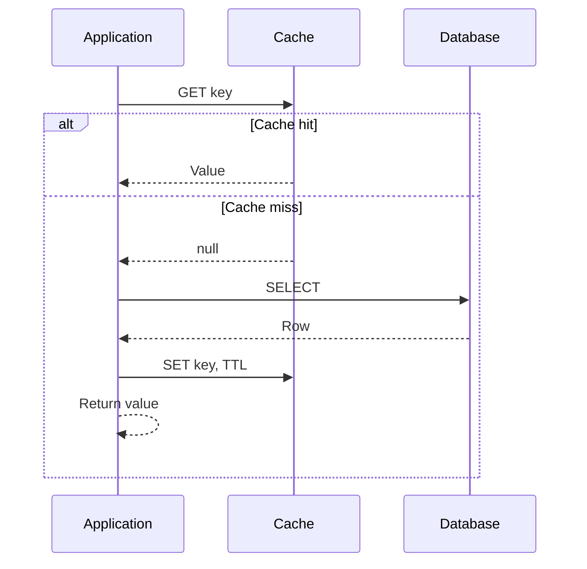
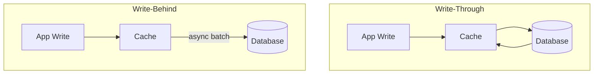
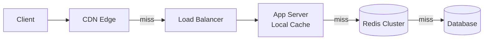

# Caching Fundamentals

## 1. Executive Summary

**Caching** stores copies of data closer to consumers or in faster storage tiers to reduce latency, database load, and cost. A cache trades **freshness** for **speed**—by definition, cached data may be stale relative to the authoritative source. Principal architects must choose **cache placement** (client, CDN, application, database), **population strategy** (lazy vs eager), **consistency model** (TTL, invalidation, write-through), and **eviction policy** under memory pressure.

Core patterns include **cache-aside** (application manages cache), **read-through** and **write-through** (cache library coordinates with backing store), **write-behind** (async write-back), and **refresh-ahead**. Metrics that matter: **hit ratio**, **latency percentiles**, **staleness SLA**, and **thundering herd** risk on expiry.

This chapter covers caching theory, pattern mechanics, consistency tradeoffs, failure modes, sizing, security, cost, production systems, and interview framing for systems from read-heavy APIs to global content delivery.

## 2. Why This Topic Matters

Caching appears in virtually every system design interview: **"Design Twitter's timeline"**, **"Scale product catalog reads"**, **"Reduce database load 10×."** Weak answers say "add Redis."

Strong candidates explain:

- **Cache-aside** is the default but requires careful invalidation on writes.
- **TTL alone** does not guarantee consistency—it bounds staleness.
- **Hot keys** can melt a single Redis shard.
- **Thundering herd** on expiry causes latency spikes and DB overload.
- **CDN** caches at the edge; **application cache** caches computed aggregates.

Production incidents include serving **stale prices**, **cache stampede** during viral traffic, **OOM** from unbounded caches, and **security leaks** from caching user-specific data in shared keys. Architects who cache without defining staleness SLAs create subtle correctness bugs.

## 3. Problems Being Solved

| Problem | Without cache | With cache |
|---------|-------------|------------|
| Read latency | Every request hits DB | Hot data served from memory |
| DB load | Linear with traffic | Absorbed by hit ratio |
| Compute cost | Recompute aggregates | Store materialized results |
| Geographic latency | Single region DB | CDN edge POPs |
| Spike traffic | DB saturation | Buffer hot keys |

Caching solves **read amplification** and **latency reduction**. It does **not** solve **write scaling** alone, **strong consistency** without careful design, or **correctness** without invalidation strategy.

## 4. Assumptions and System Model

Assume **read-heavy** workload with an **authoritative data store** (SQL, NoSQL, object storage):

- Cache has **finite capacity** and **faster but volatile** storage (RAM).
- **Failures:** Cache node crash (cold start), network partition to cache, stale data served.
- **Concurrent readers and writers**—race between cache populate and invalidation possible.
- **Not** assuming automatic coherence across all tiers unless using explicit protocol.

**Cache hierarchy (typical):**

| Tier | Location | Latency | Scope |
|------|----------|---------|-------|
| L1 | In-process (Caffeine, Guava) | μs | Single instance |
| L2 | Distributed (Redis, Memcached) | sub-ms–ms | Cluster-wide |
| L3 | CDN | ms–tens ms | Geographic |
| Origin | Database | ms–hundreds ms | Authoritative |

## 5. Essential Terminology

| Term | Definition |
|------|------------|
| **Cache hit** | Requested key found in cache. |
| **Cache miss** | Key absent—fetch from origin required. |
| **Hit ratio** | Hits / (Hits + Misses)—primary efficiency metric. |
| **TTL (Time To Live)** | Expiry after which entry is discarded. |
| **Cache-aside** | App reads cache; on miss loads DB and populates cache. |
| **Read-through** | Cache loads from DB on miss transparently to app. |
| **Write-through** | Write updates cache and DB synchronously. |
| **Write-behind** | Write updates cache; async flush to DB. |
| **Eviction** | Remove entries when cache full (LRU, LFU, TTL). |
| **Thundering herd** | Many requests miss simultaneously on hot key expiry. |
| **Negative caching** | Cache "not found" to protect origin from repeat misses. |

**Mnemonic:** **Cache trades freshness for speed—define acceptable staleness.**

## 6. Core Mechanism

### Cache-aside read path



*Figure 1: Application owns cache logic—most common pattern; invalidation on write is app responsibility.*

### Write-through vs write-behind



*Figure 2: Write-through keeps cache and DB synchronous; write-behind optimizes write latency at consistency risk.*

### Multi-tier cache hierarchy



*Figure 3: Each tier reduces origin load; invalidation must propagate or TTL-bound staleness accepted at each level.*

## 7. Step-by-Step Walkthrough

**Scenario:** Product catalog API—1M products, 10k hot products serve 80% traffic.

| Step | Design choice | Rationale |
|------|---------------|-----------|
| 1 | Cache-aside with Redis | Team controls invalidation on product update |
| 2 | Key: `product:{id}` | Simple entity cache |
| 3 | TTL: 300s + invalidate on write | Bound staleness; immediate on admin update |
| 4 | Local Caffeine cache 10k entries | Sub-microsecond hot set per instance |
| 5 | CDN for product images | Static asset edge cache |
| 6 | Negative cache for missing IDs | Prevent abuse scanning random IDs |

**Read flow with local + Redis:**

| Step | Action |
|------|--------|
| 1 | Check local cache—hit → return |
| 2 | Miss → Redis GET |
| 3 | Redis hit → populate local, return |
| 4 | Redis miss → DB query |
| 5 | SET Redis + local with TTL |

**Write flow (price update):**

| Step | Action |
|------|--------|
| 1 | UPDATE database |
| 2 | DELETE `product:{id}` from Redis (not update-in-place) |
| 3 | Local caches expire naturally or pub/sub invalidation |
| 4 | Next read repopulates from DB |

**Why delete vs update cache on write:** Concurrent writes may reorder—delete forces fresh read; avoids stale partial updates.

**Cache hit ratio mathematics:**

Understanding cache economics requires modeling the **working set** relative to cache capacity:

| Variable | Meaning |
|----------|---------|
| W | Working set size (unique keys accessed in window) |
| C | Cache capacity (keys) |
| α | Zipf skew parameter (higher = more concentrated) |

For Zipf-distributed access, a small fraction of keys dominate traffic—often 20% of keys serve 80% of requests (Pareto principle). This means modest cache sizes achieve high hit ratios **if** keys are well-chosen. Conversely, uniform access patterns require cache size ≈ working set for high hit ratio.

**Effective origin load** = `request_rate × (1 - hit_ratio)`. Improving hit ratio from 90% to 99% reduces origin load by 10×—not 9%. Architects present this non-linear benefit when justifying cache infrastructure spend.

**Eviction policies compared:**

| Policy | Behavior | Best for |
|--------|----------|----------|
| LRU (Least Recently Used) | Evict coldest by access time | General temporal locality |
| LFU (Least Frequently Used) | Evict lowest access count | Stable hot set |
| TTL-only | Expire by time | Known freshness bounds |
| Random | Evict arbitrary | Simplicity; approximate LRU |
| ARC (Adaptive Replacement Cache) | Balance recency and frequency | Mixed workloads (some libraries) |

Redis `maxmemory-policy` options (`volatile-lru`, `allkeys-lfu`, etc.) combine TTL awareness with eviction—understand whether keys have TTL set before choosing policy.

**HTTP caching layer (often overlooked):**

Application caches are one tier; **HTTP reverse proxies** cache full responses:

| Header | Effect |
|--------|--------|
| `Cache-Control: max-age=300` | CDN/browser cache 5 min |
| `ETag` + `If-None-Match` | Conditional GET—304 Not Modified |
| `Vary: Accept-Encoding` | Separate cache entries per encoding |
| `private` vs `public` | User-specific vs shared cacheability |

Misconfigured `Cache-Control: public` on authenticated API responses is a common security and staleness bug—review in architecture sign-off.

**Read-through and write-through in managed caches:**

Some platforms (AWS ElastiCache with DAX for DynamoDB, Hibernate L2 with read-through) implement cache population transparently:

| Pattern | Who loads on miss | Invalidation owner |
|---------|-------------------|-------------------|
| Cache-aside | Application | Application |
| Read-through | Cache library | Library + config |
| Write-through | Cache library on write | Synchronous with DB |

Read-through simplifies application code but couples you to cache provider semantics—understand failure behavior when cache and DB disagree during partial outages.

**Cache warming strategies:**

| Strategy | When | Risk |
|----------|------|------|
| Preload on deploy | Known hot keys | Deploy-time latency spike |
| Background refresh | Before TTL expiry | Complexity |
| Traffic shift | Blue-green with gradual % | Safer cold start |
| Predictive warmup | ML on access patterns | Engineering cost |

Black Friday and product launch runbooks should include explicit warmup steps—not discovered during incident.

**Monitoring cache effectiveness:**

| Metric | Alert threshold (example) |
|--------|---------------------------|
| Hit ratio drop > 10% WoW | Investigate deploy or key pattern |
| Miss latency p99 | Compare to origin SLA |
| Eviction rate spike | Memory pressure |
| Redis `used_memory` > 80% | Scale or trim TTL |
| Origin RPS increase with flat traffic | Cache degradation |

**Decision tree: should this data be cached?**

```
Is read:write ratio > 10:1?
  No → likely skip cache
  Yes → Can data tolerate staleness > 0?
    No → no cache OR read-through primary only
    Yes → Is working set bounded?
      No → sample/TTL + eviction policy
      Yes → cache-aside with measured hit ratio target > 80%
```

Document the answer in the architecture decision record (ADR) for each entity type—prevents ad hoc caching in every microservice.

**Cost modeling example:**

| Assumption | Value |
|------------|-------|
| Origin DB cost | $2 per 1M read queries |
| Redis cost | $500/month cluster |
| Hit ratio without cache | 0% |
| Hit ratio with cache | 95% |
| Read volume | 1B reads/month |

Origin savings: 1B × 0.95 × $2/1M = $1,900/month. Net savings $1,400/month before engineering cost—positive ROI at this scale. Below ~100M reads/month, cache infrastructure may not justify dedicated Redis cluster—evaluate embedded local cache only.

**Interview signal:** Candidates who articulate hit ratio math, staleness SLAs per entity, and delete-on-write invalidation demonstrate production cache experience—not just familiarity with Redis commands.

## 8. Invariants and Guarantees

| Property | Type | Statement |
|----------|------|-----------|
| **Eventual freshness** | Liveness-oriented | Cache converges after TTL or invalidation |
| **Strong consistency with origin** | **Not** default | Requires sync invalidation or no cache |
| **Hit ratio stability** | Operational | Depends on workload skew—Zipf distribution common |
| **Durability** | **Not** provided | Pure cache loss on crash—rebuild from origin |

## 9. Failure Scenarios

### Scenario 1: Thundering herd on TTL expiry

**Setup:** Hot product key expires; 10k concurrent requests miss.

**Effect:** DB overload; latency spike.

**Mitigation:** Probabilistic early expiration; request coalescing (single-flight); mutex per key.

### Scenario 2: Cache penetration

**Setup:** Attacker queries non-existent random IDs.

**Effect:** Every request hits DB.

**Mitigation:** Negative caching; bloom filter in front of cache.

### Scenario 3: Cache avalanche

**Setup:** Mass TTL expiry simultaneously (e.g., same deploy timestamp).

**Effect:** Cluster-wide miss storm.

**Mitigation:** Jitter on TTL; stagger warmup.

### Scenario 4: Stale price displayed

**Setup:** Price updated in DB; cache not invalidated.

**Effect:** Customer charged wrong amount—legal/compliance risk.

**Mitigation:** Write-path invalidation; short TTL for price keys; version in cache value.

### Scenario 5: Redis node failure

**Setup:** Shard master dies without persistence.

**Effect:** Cold cache—miss storm until repopulated.

**Mitigation:** Replication; multi-AZ; graceful degradation.

### Scenario 6: Caching user-private data with wrong key

**Setup:** Key `profile` without user ID—shared across users.

**Effect:** **Critical security bug**—data leak.

**Mitigation:** Key namespace includes tenant/user; security review checklist.

## 10. Performance Characteristics

| Factor | Impact |
|--------|--------|
| Hit ratio 90% | Origin load ÷ 10 |
| Local vs remote cache | 100×+ latency difference |
| Serialization (JSON vs protobuf) | CPU and payload size |
| Connection pooling to Redis | Avoid per-request connect |
| Large values | Network and memory pressure—consider chunking |

**Little's Law intuition:** If cache serves 100k RPS at 1ms vs DB at 50ms, effective DB RPS drops with hit ratio H: `DB_load = RPS × (1 - H)`.

## 11. Scalability Limits

- **Memory** bounds total cached working set.
- **Hot keys** limit Redis shard throughput—single thread per key in cluster.
- **Invalidation fan-out** grows with instance count for local caches.
- **CDN purge** propagation delay limits global invalidation speed.

## 12. Operational Considerations

- Dashboards: hit ratio, miss latency, evictions, memory usage, connected clients.
- **Cache warming** after deploy or failover.
- **Runbooks** for Redis failover, memory max, slow commands.
- **Key naming conventions** and TTL standards documented.
- **Load test** with cache cold and hot scenarios.

## 13. Security Considerations

- **TLS** to Redis; ACLs per application.
- **No secrets** in cache keys or values logged.
- **PII** encryption; GDPR right-to-erasure requires cache purge.
- **Cache poisoning** if write path compromised—authenticate cache writes.

## 14. Cost Considerations

- **Redis memory** is expensive vs disk—cache only high-value keys.
- **CDN egress** savings vs origin bandwidth.
- **Miss cost** still pays DB—low hit ratio wastes Redis spend.
- **Engineering** invalidation complexity—factor into build vs buy.

## 15. Production Implementations

### Redis / ElastiCache

In-memory data structure server; persistence optional; cluster mode for sharding—**implementation choice** for L2 cache.

### Memcached

Simple key-value; multithreaded; no persistence—pure cache semantics.

### Caffeine / Guava (JVM)

High-performance local caches with size and TTL eviction.

### CloudFront / Akamai / Fastly

CDN edge caching with purge APIs and cache-control headers.

### Varnish / NGINX

Reverse proxy HTTP caching layer.

### Facebook TAO

Social graph caching layer—**anecdotal** example of multi-tier graph cache at scale.

## 16. Alternatives and Tradeoffs

| Pattern | Pros | Cons |
|---------|------|------|
| Cache-aside | Flexible; survives cache failure | App complexity |
| Read-through | Centralized load logic | Vendor lock-in to library |
| Write-through | Cache always warm on write | Write latency |
| Write-behind | Fast writes | Data loss risk on crash |
| Materialized views (DB) | Consistency in DB | Less flexible than Redis |
| No cache | Simplicity | DB bottleneck at scale |

## 17. Common Misconceptions

| Misconception | Reality |
|---------------|---------|
| "Cache fixes write scaling" | Primarily read optimization. |
| "TTL = invalidation" | TTL bounds staleness; may serve old data until expiry. |
| "Update cache on write always safe" | Race conditions—delete often safer. |
| "100% hit ratio needed" | Diminishing returns; focus on hot set. |
| "CDN caches dynamic API by default" | Requires explicit cache-control design. |

## 18. Principal Architect Perspective

1. **Define staleness SLA** per entity type—prices vs avatars differ.
2. **Measure hit ratio** per key pattern—not global aggregate only.
3. **Plan for cold start**—warmup scripts, gradual traffic shift.
4. **Single-flight** for hot keys before launch events.
5. **Security review** cache keys for multi-tenant isolation.

**Decision framework:** Cache when read:write ratio > 10:1, data tolerates seconds of staleness, and origin cost or latency is pain point. Skip cache when consistency is legally strict and invalidation path unclear.

## 19. Architecture Review Exercise

**Scenario:** E-commerce site caches `cart:{userId}` in Redis with 24h TTL; no invalidation on checkout; shared Redis cluster for prod and staging.

**Review prompts:**

1. Stale cart after purchase?
2. Staging flush impact on prod?
3. Memory growth unbounded?
4. Fixes?

**Expected findings:** Invalidate on order complete; separate clusters; shorter TTL; size limits; session binding.

## 20. Whiteboard Explanation

**90-second version:**

> "Caching stores hot data in fast memory to cut latency and database load. Cache-aside is the default: app checks cache, on miss reads DB and populates with TTL. On writes, update DB then delete cache keys—don't blindly update cache due to races. Hit ratio drives effectiveness—Zipf workloads cache well. TTL bounds staleness but isn't instant invalidation. Watch thundering herd when hot keys expire—use jitter, single-flight, or early refresh. Layer local in-process cache over Redis over CDN for static assets. Define staleness SLAs per data type. Caches fail—design miss path to survive. Never cache without tenant isolation in keys."

## 21. Interview Questions

1. **Cache-aside vs read-through?**
   - *Signals:* App manages vs library loads on miss.

2. **Write-through vs write-behind?**
   - *Signals:* Sync consistency vs async speed.

3. **Thundering herd mitigation?**
   - *Signals:* Single-flight, jitter, lock, early refresh.

4. **Update vs delete cache on write?**
   - *Signals:* Delete safer for races.

5. **What metrics matter?**
   - *Signals:* Hit ratio, p99 latency, eviction rate.

6. **When not to cache?**
   - *Signals:* Strong consistency, low read ratio, tiny data.

7. **CDN vs Redis?**
   - *Signals:* Edge static/semi-static vs app session/entity.

8. **Design product page cache.**
   - *Signals:* TTL, invalidation, CDN images, local hot set.

9. **Cache penetration?**
   - *Signals:* Negative cache, bloom filter.

10. **Hot key problem?**
    - *Signals:* Shard limit; local replica; read replicas.

**Scoring rubric:**

| Dimension | Strong | Weak |
|-----------|--------|------|
| Consistency | Staleness SLA, invalidation | "Add Redis" |
| Failures | Herd, cold start | Ignores miss path |
| Security | Key namespacing | Shared keys |

## 22. Interview Follow-Ups

1. **Hit ratio dropped 20%—investigate?**
   - *Signals:* Deploy change, TTL, key pattern shift, memory eviction.

2. **Cache Redis entirely down?**
   - *Signals:* Circuit breaker to DB; rate limit; degrade gracefully.

3. **Global catalog consistency?**
   - *Signals:* CDN purge delay; regional Redis; accept staleness bounds.

## 23. Strong Answer Example

**Question:** "Reduce DB load for read-heavy product API 10×."

> "I'd profile access patterns—expect Zipf skew. **Cache-aside** Redis cluster keyed `product:{id}` with 5-minute TTL plus explicit DELETE on admin product update after DB commit. In-process Caffeine LRU 50k entries for hottest SKUs—70%+ hits locally. CDN for images with long cache-control. Single-flight on miss for top 100 products to prevent herd. Negative cache missing IDs 60s with bloom filter. Monitor hit ratio by key prefix and p99 miss latency. Staleness: prices invalidate immediately; descriptions tolerate 5 min. Load test cold cache failover. Origin remains source of truth—Redis persistence optional since rebuildable."

## 24. Weak Answer Example

**Question:** "Reduce DB load for read-heavy product API 10×."

> "Put Redis in front of the database."

**Why weak:** No pattern, invalidation, hot key, metrics, or failure path.

## 25. Hands-On Exercise

1. Build cache-aside wrapper around SQLite product table.
2. Measure RPS and latency with/without local cache.
3. Simulate TTL expiry thundering herd—add single-flight mutex.
4. Implement write invalidation vs write-update—race test.
5. Add negative caching for random IDs.
6. Plot hit ratio vs cache size.
7. Document staleness SLA per entity.

## 26. Knowledge Check

1. Cache-aside miss path? *(DB load, then SET cache.)*
2. Safer write strategy? *(Delete cache key.)*
3. Thundering herd cause? *(Simultaneous misses on hot key.)*
4. Hit ratio formula? *(Hits / total requests.)*
5. CDN best for? *(Static/edge-cacheable content.)*

## 27. Flashcards

| # | Front | Back |
|---|-------|------|
| 1 | Cache-aside | App manages cache read/write. |
| 2 | Read-through | Cache loads on miss. |
| 3 | Write-through | Sync cache + DB write. |
| 4 | Write-behind | Async DB write from cache. |
| 5 | TTL | Time-based expiry. |
| 6 | Hit ratio | Cache efficiency metric. |
| 7 | Thundering herd | Concurrent misses on expiry. |
| 8 | Negative cache | Cache absent keys. |
| 9 | Single-flight | One origin load per key. |
| 10 | Delete on write | Safer than update-in-place. |

## 28. Cheat Sheet

```
PATTERNS
  Cache-aside:     app GET → miss → DB → SET
  Read-through:    cache loads on miss
  Write-through:   write cache + DB sync
  Write-behind:    write cache, async DB

WRITE PATH
  DB commit → DELETE cache keys (preferred)

HERD MITIGATION
  TTL jitter
  Single-flight / per-key lock
  Probabilistic early refresh

TIERS
  Local → Redis → CDN → DB

METRICS
  Hit ratio, p99, evictions, memory
```

## 29. Related Concepts

- [Cache Invalidation](/docs/caching/cache-invalidation) — freshness control
- [Distributed Caching](/docs/caching/distributed-caching) — Redis cluster, sharding
- [CAP Theorem](/docs/consistency/cap-theorem) — consistency vs availability tradeoffs
- [API and Integration Architecture](/docs/api-and-integration-architecture/overview) — HTTP cache headers
- [Reliability and Resilience](/docs/reliability-and-resilience/overview) — graceful degradation

## 30. References

### Primary sources

- Lameter, C. (2013). "NUMA (Non-Uniform Memory Access) Aware Programming" — memory hierarchy concepts applicable to caching tiers.
- Kleppmann, M. *DDIA* — derivation, materialized views, stream processing caches.

### Engineering

- Redis Documentation — [Caching patterns](https://redis.io/docs/manual/patterns/).
- AWS ElastiCache Best Practices — sizing and eviction guidance.
- Facebook engineering publications on TAO and cache stacks — verify current architecture independently.

### Distinction

| Claim type | Source |
|------------|--------|
| Cache pattern definitions | DDIA; Redis docs |
| Thundering herd mitigations | Engineering practice |
| Production scale anecdotes | Company blogs—verify independently |
