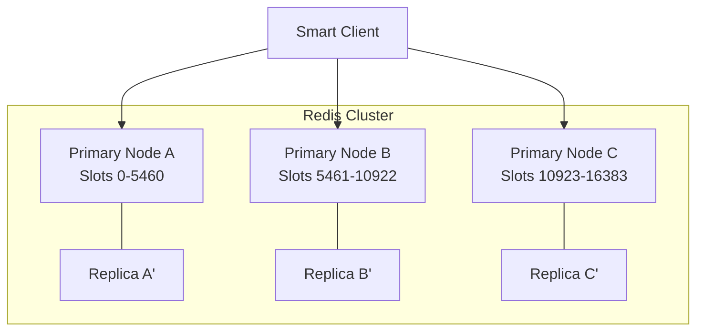
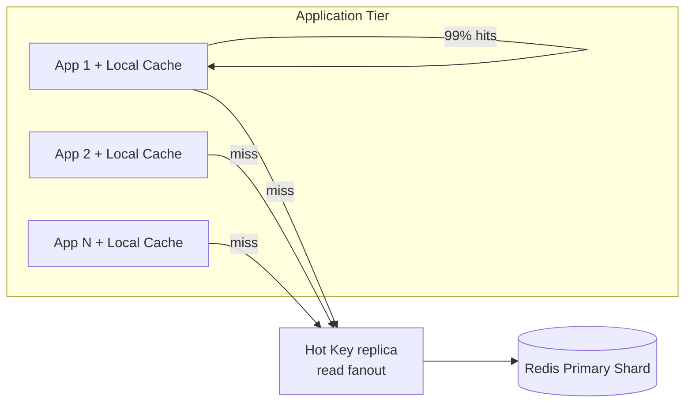
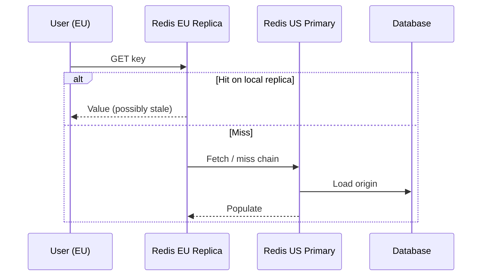
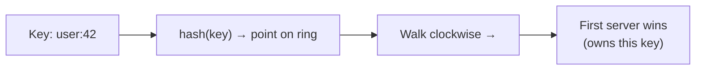
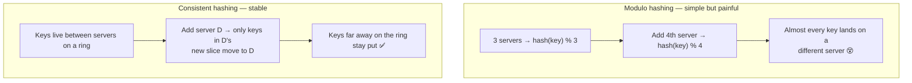
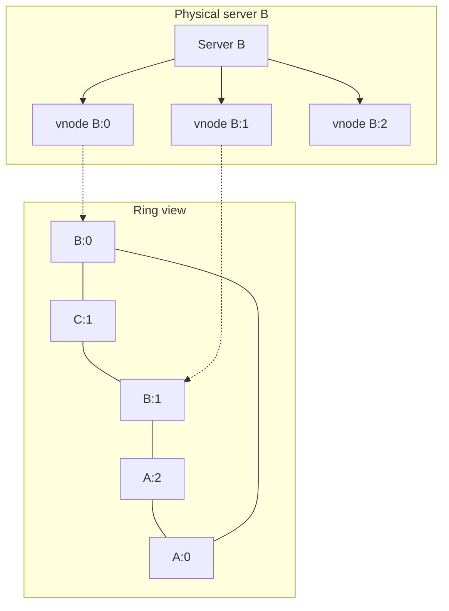

# Distributed Caching

## 1. Executive Summary

**Distributed caching** places a shared, horizontally scaled cache tier (typically in-memory) between application instances and the authoritative data store. Unlike per-process local caches, a distributed cache provides **consistent key namespace**, **shared state across instances**, and **horizontal capacity**—at the cost of **network latency**, **operational complexity**, **hot-key bottlenecks**, and **failure modes** distinct from single-node Redis.

Architectural decisions include **cluster topology** (standalone, sentinel, cluster mode), **sharding strategy** (hash slot, consistent hashing), **replication** for availability, **client routing** (smart client vs proxy), **data structures** beyond strings (hashes, sorted sets), and **multi-region** deployment for latency vs consistency tradeoffs.

This chapter covers Redis Cluster architecture, hot-key mitigation, near-cache patterns, coherence between local and remote tiers, security, failover, cost at scale, and principal-level sizing for high-traffic systems.

## 2. Why This Topic Matters

System design interviews ask: **"Scale Redis for 1M RPS"** or **"Handle viral post with 100k reads/sec."** Weak answers add more Redis memory.

Strong candidates explain:

- **Single Redis thread** per key limits hot-key throughput.
- **Cluster mode** shards by hash slot—16384 slots in Redis Cluster.
- **Local near-cache** + Redis reduces network hops for hottest keys.
- **Replica reads** trade consistency for scale—stale reads possible.
- **Cache aside** still requires app-level invalidation across regions.

Production failures include **CLUSTERDOWN**, **hot key melting one shard**, **big key** blocking single thread, **failover** causing brief unavailability, and **cross-AZ latency** dominating p99. Distributed cache is a **distributed system**—apply CAP reasoning.

## 3. Problems Being Solved

| Problem | Single Redis | Distributed cache |
|---------|--------------|-------------------|
| Memory ceiling | One machine RAM | Shard across nodes |
| Throughput | Single-thread bottleneck | Parallel shards |
| Availability | SPOF | Replication + failover |
| Geographic latency | Remote users hit one region | Multi-region replicas |
| Session stickiness | All instances need shared store | Central session cache |

Distributed caching solves **shared low-latency state at scale**. It does **not** replace **database durability** (unless using Redis persistence by design—a distinct architecture), **automatic cache coherence** with local tiers, or **unlimited hot-key scale** without application techniques.

## 4. Assumptions and System Model

Assume **Redis Cluster** or equivalent sharded in-memory store unless noted:

- Keys map to **hash slots** via `CRC16(key) mod 16384` (Redis Cluster).
- **Single-key commands** atomic per slot; multi-key ops require same slot or hash tags `{user}:profile`, `{user}:cart`.
- **Failures:** Node crash, network partition, slow commands, failover promotion.
- **Consistency:** Primary-replica async replication by default—**stale reads** on replicas possible.
- **Not Byzantine** unless discussing encrypted channels.

**CAP positioning:** During partition, Redis Cluster generally favors **availability** of reachable slots with possible **stale replica reads**—not linearizable distributed cache by default.

## 5. Essential Terminology

| Term | Definition |
|------|------------|
| **Shard** | Subset of keyspace on one primary node. |
| **Hash slot** | Redis Cluster unit of 16384 slots mapping keys to nodes. |
| **Hash tag** | `{tag}` in key forces same slot for related keys. |
| **Hot key** | Key receiving disproportionate traffic. |
| **Big key** | Large value or collection blocking operations. |
| **Near-cache** | Local L1 in front of remote L2 distributed cache. |
| **Read replica** | Follower serving reads; may lag primary. |
| **Sentinel** | HA monitoring and failover for non-cluster Redis. |
| **Cluster bus** | Gossip protocol between Redis Cluster nodes. |
| **MOVED / ASK** | Redirect responses during slot migration or failover. |

**Mnemonic:** **Shard spreads keys; hot keys break shards.**

## 6. Core Mechanism

### Redis Cluster topology



*Figure 1: Each primary owns hash slot range; replica promotes on primary failure.*

### Hot key mitigation with local replicas



*Figure 2: Local near-cache absorbs hot key reads; optional in-memory replicas on app tier for extreme cases.*

### Multi-region read path



*Figure 3: Cross-region caching reduces latency; replication lag defines staleness across regions.*

## 7. Step-by-Step Walkthrough

**Scenario:** Social feed service—500k RPS read, 10k unique keys/sec, one viral post key `post:viral` at 200k RPS.

| Step | Analysis | Action |
|------|----------|--------|
| 1 | Baseline cluster 6 nodes | Even key distribution |
| 2 | Monitor per-key QPS | Detect `post:viral` hot shard |
| 3 | Enable local Caffeine near-cache 1s TTL | Absorb 80% on each instance |
| 4 | Application read random replica of hot key | Client-side fan-out—**pattern**; verify Redis license/version |
| 5 | Split key logically | `post:viral:comments` separate if needed |
| 6 | Rate limit origin on miss | Protect DB |

**Sharding new cluster:**

| Step | Action |
|------|--------|
| 1 | Estimate working set memory + 30% headroom |
| 2 | Choose node count: `total_memory / per_node_ram` |
| 3 | Enable cluster mode; 1 primary + 1 replica per shard minimum |
| 4 | Use hash tags for multi-key transactions `{userId}:session`, `{userId}:cart` |
| 5 | Load test with **Zipf** key distribution—not uniform |

**Failover sequence:**

| Event | Behavior |
|-------|----------|
| Primary dies | Replica promoted; brief write unavailability for slot |
| Split brain (misconfig) | Data divergence—use cluster quorum properly |
| Node rejoins | Resync from primary |

**Consistent hashing (Memcached client model):**

Unlike Redis Cluster's fixed slot model, Memcached clients typically use **consistent hashing** with virtual nodes:

| Concept | Purpose |
|---------|---------|
| Hash ring | Keys map to positions on ring |
| Virtual nodes | Each physical server has many virtual points—better balance |
| Server add/remove | Only K/n keys remap (K keys, n servers) |

When a Memcached node fails, clients redistribute only its key range—other nodes unaffected. **Compare** to Redis Cluster's explicit slot migration with MOVED redirects.

**Redis persistence modes (when cache is rebuildable vs not):**

| Mode | Durability | Recovery | Use when |
|------|------------|----------|----------|
| No persistence | None | Cold rebuild from DB | Pure cache-aside |
| RDB snapshots | Point-in-time | Faster restart | Large dataset rebuild expensive |
| AOF append | Finer granularity | Replay log | Session store; tolerate slower writes |
| AOF + fsync always | Strongest Redis durability | Slowest writes | Rare; consider real DB instead |

Architects treating Redis as **authoritative session store** must enable persistence and replication—different SLA than ephemeral product cache.

**Client-side routing patterns:**

| Pattern | Description |
|---------|-------------|
| Smart client | Client caches slot map; follows MOVED/ASK |
| Proxy (Twemproxy, Envoy) | Central routing; simpler clients |
| Sidecar | Per-pod proxy in service mesh |

Proxy adds hop latency but simplifies client libraries in polyglot environments.

**Memory fragmentation and latency:**

Long-running Redis instances may suffer **memory fragmentation**—`used_memory` vs `used_memory_rss` divergence. Redis 4+ offers `activedefrag` (verify version). Symptoms: elevated latency despite low command rate, OOM despite apparent free memory. Operational response: schedule rolling restart during low traffic, or enable active defragmentation with monitoring.

**Multi-tenant cache isolation:**

Shared Redis clusters for multiple services require:

| Control | Purpose |
|---------|---------|
| Key prefix per service | `billing:`, `catalog:` |
| ACL per application user | Least privilege commands |
| Memory limits per tenant (Redis 7+ memory quotas—verify) | Noisy neighbor prevention |
| Separate clusters for PCI vs non-PCI | Compliance boundary |

Never share cache clusters between production and staging—staging `FLUSHDB` incidents on shared clusters are a recurring postmortem theme in industry blogs.

**Redis Cluster resharding operations:**

Adding capacity requires **slot migration** between nodes:

| Phase | Client behavior |
|-------|-----------------|
| Migration planned | Normal operation |
| Keys migrating | ASK redirects to importing node |
| Migration complete | MOVED responses update slot map |

Plan resharding during low-traffic windows; clients must handle redirects without retry storms (exponential backoff on CLUSTERDOWN).

**Comparison: Redis Cluster vs Redis Sentinel:**

| Feature | Sentinel (non-cluster) | Cluster |
|---------|------------------------|---------|
| Sharding | Single primary (or manual sharding) | Automatic hash slots |
| Failover | Sentinel promotes replica | Automatic per-shard |
| Multi-key ops | All keys on one node | Same-slot only |
| Max memory | One node RAM | Sum of all primaries |
| Complexity | Lower | Higher |

Use Sentinel for datasets fitting one node; Cluster when horizontal memory or throughput requires sharding.

**Latency budget example (same-AZ):**

| Hop | Typical latency |
|-----|-----------------|
| App → local cache hit | < 1 μs |
| App → Redis (same AZ) | 0.2–1 ms |
| App → Redis (cross-region) | 50–150+ ms |
| App → DB | 1–10 ms |

Cross-region Redis for latency-sensitive paths often **fails** the latency budget—use regional clusters with async replication and accept staleness, or local cache with short TTL.

**Elasticache Global Datastore note:**

AWS Global Datastore provides cross-region replication for Redis with **sub-second** replication lag in ideal conditions—verify current AWS documentation for consistency guarantees. Reads from secondary regions may still lag; not a substitute for understanding your staleness SLA. Primary region failure triggers promoted secondary—test failover runbooks quarterly.

**Connection storm on application scale-out:**

Deploying 500 new pods each opening 50 Redis connections = 25,000 connections—may exceed `maxclients`. Mitigate with:

- Connection pooling (one pool per pod, bounded size).
- Redis proxy layer consolidating connections.
- Monitor `connected_clients` with autoscaling alerts.

**Disaster recovery for distributed cache:**

| Scenario | RPO | RTO strategy |
|----------|-----|--------------|
| Single node failure | 0 (replica promote) | Seconds–minutes automatic |
| Full cluster loss | Depends on persistence | Rebuild from origin; hours |
| Region failure | Async replication lag | Failover to DR region; accept data loss window |

Caches without persistence treat DR as **cold rebuild**—ensure origin can absorb full read load during recovery; circuit breakers prevent cascade failure.

## 8. Invariants and Guarantees

| Property | Type | Statement |
|----------|------|-----------|
| **Single-key atomicity** | Safety | Per command on one slot |
| **Multi-key atomicity** | Conditional | Same hash slot or hash tag only |
| **Durability** | Config-dependent | AOF/RDB optional—not default cache semantics |
| **Linearizable reads** | **Not** default | Use primary reads; sync replication rare |
| **Slot coverage** | Safety | All 16384 slots assigned in healthy cluster |

## 9. Failure Scenarios

### Scenario 1: Hot key on single shard

**Setup:** Celebrity post; all traffic to one slot.

**Effect:** CPU 100% on one primary; elevated latency cluster-wide if misrouted.

**Mitigation:** Near-cache; read replicas; application-layer key splitting; CDN for public content.

### Scenario 2: Big key deletion

**Setup:** 50MB hash key deleted synchronously.

**Effect:** Blocks Redis thread—latency spike all keys on node.

**Mitigation:** `UNLINK` async delete; avoid big keys; scan in chunks.

### Scenario 3: Cache avalanche after cluster restart

**Setup:** Cold cluster; traffic flood.

**Effect:** DB overload.

**Mitigation:** Warmup; staggered restart; circuit breaker.

### Scenario 4: Stale read from replica

**Setup:** Write to primary; immediate read from replica before sync.

**Effect:** User sees old session state.

**Mitigation:** Read from primary for session consistency; or wait `WAIT` command (latency cost).

### Scenario 5: Slot migration during resharding

**Setup:** Adding nodes; keys moving slots.

**Effect:** ASK/MOVED redirects; latency bump.

**Mitigation:** Reschedule during low traffic; monitor migration progress.

### Scenario 6: Cross-slot multi-key transaction failure

**Setup:** `MGET user:1 cart:2` without hash tags—different slots.

**Effect:** `CROSSSLOT` error.

**Mitigation:** Hash tag design `{user1}:profile`, `{user1}:cart`.

## 10. Performance Characteristics

| Factor | Impact |
|--------|--------|
| Network RTT | 0.1–2ms same AZ; cross-region higher |
| Serialization | JSON vs protobuf CPU |
| Pipeline / batching | Amortize RTT |
| Connection count | Pool per app instance |
| TLS | CPU overhead on client and server |

**Throughput:** Single Redis primary often cited ~100k–300k ops/sec for simple GET—**benchmark your workload**; do not treat as universal.

## 11. Scalability Limits

- **Hot keys** don't shard further without application help.
- **16384 slots** max theoretical shards—practical cluster sizes tens of nodes.
- **Memory** linear with dataset—no compression by default for strings.
- **Cross-slot operations** limited—design keys accordingly.
- **Pub/sub** not cluster-wide same as single node—understand scale limits.

## 12. Operational Considerations

- Monitor: memory max, evictions, connected clients, commands/sec per node, **hot keys** (Redis 7+ hot key sampling features—verify version).
- **Slowlog** analysis; block `KEYS *` in production.
- **Rolling upgrades** with cluster compatibility.
- **Backup:** RDB snapshots if cache rebuild expensive—not if purely derived.
- **ACLs** per microservice principle.

## 13. Security Considerations

- **VPC private** endpoints; no public Redis.
- **AUTH / ACL** tokens rotated.
- **TLS in transit** mandatory in regulated environments.
- **Encryption at rest** for ElastiCache—platform feature.
- **Dangerous commands** renamed/disabled (`FLUSHALL`, `CONFIG`).

## 14. Cost Considerations

- **Memory-optimized instances** expensive—right-size working set.
- **Cross-AZ traffic** charges in cloud.
- **Over-provisioned replicas** double memory cost.
- **Managed service** premium vs self-hosted ops labor.
- **Cold cache miss** still hits DB—model total cost of ownership.

## 15. Production Implementations

### Redis Cluster (self-managed / ElastiCache cluster mode)

Industry default for distributed cache—hash slots, auto-failover.

### Memcached

Multithreaded; client-side consistent hashing; no persistence—simple cache pool.

### Hazelcast / Apache Ignite

In-memory data grid with partition tolerance—JVM ecosystem.

### Amazon ElastiCache

Redis and Memcached managed; Global Datastore cross-region—verify consistency model in docs.

### Twitter / Pelikan

Internal caching infrastructure separating different SLAs—**anecdotal** large-scale separation of cache types.

### Cloudflare Workers KV / Durable Objects

Edge-distributed key-value with different consistency—**not Redis** but distributed cache class at edge.

## 16. Alternatives and Tradeoffs

| System | Strength | Limitation |
|--------|----------|------------|
| Redis Cluster | Rich data structures; persistence option | Hot key shard limits |
| Memcached | Simple multithreaded | No persistence; simpler API |
| Local-only cache | Fastest | No cross-instance sharing |
| CDN edge KV | Geographic | Limited mutation/consistency |
| DB read replicas | Stronger consistency option | Higher latency than RAM |

## 17. Common Misconceptions

| Misconception | Reality |
|---------------|---------|
| "Cluster = infinite scale" | Hot keys still bottleneck one shard. |
| "Replicas for read scale always safe" | Replication lag causes stale reads. |
| "Redis is a database" | Persistence optional; different durability model. |
| "More nodes = more memory linearly" | Replication factor reduces net capacity. |
| "Hash tags optional" | Required for multi-key atomicity. |

## 18. Principal Architect Perspective

1. **Load test with Zipf** key distribution—uniform tests lie.
2. **Plan hot key playbook** before launch events.
3. **Near-cache** almost always for read-heavy L2 architectures.
4. **Hash tag key design** in schema review—not retrofit.
5. **Treat failover as routine**—clients must handle redirects and timeouts.

**Multi-region:** Prefer **active-passive** cache with async replication unless business accepts stale cross-region reads; session data may need sticky routing to primary region.

## 19. Architecture Review Exercise

**Scenario:** 6-node Redis Cluster, all reads/writes to primaries, no local cache, uniform load test passed, production hot influencer event planned.

**Review prompts:**

1. Will production match load test?
2. Hot key plan?
3. Memory eviction policy under spike?
4. Client timeout and retry storm risk?

**Expected findings:** Add near-cache; hot key monitoring; `volatile-lru` policy documented; circuit breakers; replica read strategy with staleness acceptance.

## 20. Whiteboard Explanation

**90-second version:**

> "Distributed cache shares memory across app servers—usually Redis Cluster sharding keys into 16384 hash slots across primaries with replicas for HA. Clients route via slot map; failover promotes replica. Scale is limited by hot keys—a viral key hits one shard's single thread. Mitigate with local near-cache on each app instance, read fan-out patterns, or splitting the key. Use hash tags like \{userId\}:cart and \{userId\}:profile for multi-key ops on same slot. Replicas scale reads but may be stale—session consistency may need primary reads. Network RTT matters—co-locate cache in same AZ as apps. It's a distributed system: plan for node failure, slot migration, and cold start. Memcached alternative if you need simpler multithreaded pure cache without persistence."

## 21. Interview Questions

1. **How Redis Cluster shards?**
   - *Signals:* Hash slots CRC16; 16384 slots.

2. **Hot key mitigation?**
   - *Signals:* Near-cache, replicas, split key, CDN.

3. **Hash tag purpose?**
   - *Signals:* Same slot for related keys.

4. **Replica read tradeoff?**
   - *Signals:* Stale data; lag.

5. **Redis vs Memcached?**
   - *Signals:* Structures, persistence, threading model.

6. **CROSSSLOT error?**
   - *Signals:* Multi-key different slots.

7. **Design session store on Redis Cluster.**
   - *Signals:* Hash tag per user, TTL, primary read on write path.

8. **Cluster failover impact?**
   - *Signals:* Brief unavailability; client redirects.

9. **Size cluster for 500GB working set?**
   - *Signals:* Memory per node, replication factor, headroom.

10. **Near-cache coherence?**
    - *Signals:* TTL + pub/sub invalidation.

**Scoring rubric:**

| Dimension | Strong | Weak |
|-----------|--------|------|
| Sharding | Slots, hash tags | "Add nodes" |
| Hot keys | Specific mitigations | Ignores |
| Consistency | Replica lag | "Always fresh" |

## 22. Interview Follow-Ups

1. **Redis node OOM?**
   - *Signals:* Eviction policy, maxmemory, alert, shard data.

2. **Global session cache?**
   - *Signals:* Sticky region, async replication, JWT alternative.

3. **When Memcached over Redis?**
   - *Signals:* Simple GET/SET at extreme multithreaded QPS.

## 23. Strong Answer Example

**Question:** "Scale cache for 2M RPS read, 100GB working set, rare hot posts."

> "Redis Cluster with hash slots—size 8 primaries + 8 replicas across 3 AZs for 100GB + 40% headroom. Cache-aside with 5-min TTL. **Near-cache** Caffeine per app instance 10k entries 2s TTL for hot posts. Monitor Redis `INFO` hot keys; on detection enable local-only override for specific key pattern. Hash tag `{postId}` for related comment lists. Reads mostly from replicas accepting 100ms staleness for feed; writes to primary. Client connection pooling, pipelining, protobuf values. Load test Zipf distribution. Failover runbooks; circuit breaker to DB if cluster unhealthy. Cross-region async replica for DR—not active-active reads unless SLA allows."

## 24. Weak Answer Example

**Question:** "Scale cache for 2M RPS read, 100GB working set, rare hot posts."

> "Use a bigger Redis instance."

**Why weak:** No sharding, hot keys, near-cache, replication, or failure design.

## 25. Hands-On Exercise

**Lab:** `labs/lab-001-consistent-hashing/` — hash ring on **`:8096`**

### Concept in simple terms (for students)

Imagine a **circle** (the hash ring). Every **key** (like `user:42`) and every **server** gets a position on that circle from a hash function.

**Rule:** To find who owns a key, start at the key’s position and walk **clockwise** until you hit the **first server**. That server stores the key.



#### Why not `hash(key) % N`?

With **modulo** (`% number of servers`), adding or removing a server changes **N**, so **most keys jump to a new server** — bad for caches (mass invalidation) and databases (mass data movement).

| Approach | You add 1 server (3 → 4) | What happens to existing keys |
|----------|--------------------------|------------------------------|
| **Modulo** `hash % N` | N changes | ~**75–100%** may remap |
| **Consistent hashing** | New slice on ring | Only ~**1/N** near the new server move |



#### Virtual nodes (vnodes) — one server, many spots

A single physical server places **multiple** points on the ring (e.g. `node-b:0`, `node-b:1`, …). That **spreads load evenly** so one machine does not get one huge arc while another gets a tiny sliver.



**Lab 001** implements this ring in Python. Try `GET /v1/lookup/user:42` in Swagger — you will see which node owns the key and why.

**Real world:** Dynamo, Cassandra, Redis Cluster (16,384 **slots** — a fixed ring variant), and [Lab 004](/docs/consistency/quorum-systems#25-hands-on-exercise) shard routing all use this idea.

```bash
cd labs/lab-001-consistent-hashing
python3 -m venv .venv && source .venv/bin/activate
pip install -r requirements.txt
pytest tests/ -v
docker compose -p lab001 -f docker/docker-compose.yml up --build -d
curl http://localhost:8096/health
chmod +x scripts/demo_ring.sh && ./scripts/demo_ring.sh
```

**Swagger:** http://localhost:8096/docs · **Landing page:** http://localhost:8096/

**Reset for a clean demo:**

```bash
docker compose -p lab001 -f docker/docker-compose.yml restart
```

### Step-by-step demo walkthrough (~10 min)

Run each step in Swagger or copy the curls below. **Say the explanation aloud** while executing — this mirrors a principal-level whiteboard walkthrough.

#### Step 0 — Confirm the cluster

```bash
curl http://localhost:8096/health
```

**Expected (fresh start):**

```json
{
  "status": "ok",
  "nodes": ["node-a", "node-b", "node-c"],
  "node_count": 3,
  "total_vnodes": 384,
  "ring_version": 3,
  "lookups_total": 0
}
```

| Field | What to explain |
|-------|-----------------|
| `nodes` | Three physical servers seeded at startup |
| `total_vnodes` | 3 × 128 = **384 ring positions** (vnodes spread load) |
| `ring_version` | Increments on every add/remove — clients refresh routing on change |
| `lookups_total` | Demo counter; `0` after restart |

#### Step 1 — Lookup: who owns a key?

```bash
curl http://localhost:8096/v1/lookup/user:42
```

**Expected:**

```json
{
  "key": "user:42",
  "hash": 16879443282065980770,
  "node": "node-a",
  "ring_version": 3
}
```

**Explain:** `hash(key)` places the key on the ring. Walk **clockwise** to the first vnode → that physical node (`node-a`) owns the key. Same key always maps to the same node (deterministic). Try `user:99` — it may land on a different node.

#### Step 2 — List ring membership (optional)

```bash
curl http://localhost:8096/v1/nodes
```

**Explain:** Each node was added with **128 vnodes** — multiple ring positions per machine for even load distribution.

#### Step 3 — Scale out: add a server

```bash
curl -X POST http://localhost:8096/v1/nodes \
  -H "Content-Type: application/json" \
  -d '{"node_id": "node-d", "vnode_count": 128}'
```

**Expected:**

```json
{
  "node_id": "node-d",
  "vnode_count": 128,
  "ring_version": 4,
  "nodes": ["node-a", "node-b", "node-c", "node-d"],
  "total_vnodes": 512
}
```

**Explain:** `node-d` inserts 128 new positions. Only keys in **node-d's new arcs** move — roughly **1/(N+1) ≈ 25%**, not ~100% like modulo. Re-lookup `user:42` — owner changes only if node-d stole that arc.

#### Step 4 — Load balance: do vnodes work?

```bash
curl -X POST http://localhost:8096/v1/simulate/balance \
  -H "Content-Type: application/json" \
  -d '{"key_count": 100000}'
```

**Expected (representative run):**

```json
{
  "key_count": 100000,
  "nodes": 4,
  "distribution": {
    "node-a": 25687,
    "node-b": 25576,
    "node-c": 23949,
    "node-d": 24788
  },
  "coefficient_of_variation": 0.028
}
```

| Metric | What to explain |
|--------|-----------------|
| `distribution` | How 100k synthetic keys spread across nodes |
| `coefficient_of_variation` | Lower = more even. **&lt; 0.05** is good with 128 vnodes |

**Explain:** Vnodes fix **uneven slice sizes**, not **hot keys** — one viral key still hits one node.

#### Step 5 — Churn: consistent vs modulo (money shot)

```bash
curl -X POST http://localhost:8096/v1/simulate/churn \
  -H "Content-Type: application/json" \
  -d '{"key_count": 5000}'
```

**Expected (representative run):**

```json
{
  "keys": 5000,
  "nodes_before": 4,
  "nodes_after": 5,
  "consistent_hashing_churn": 0.4492,
  "modulo_hashing_churn": 0.7996,
  "consistent_wins": true
}
```

| Field | What to explain |
|-------|-----------------|
| `consistent_hashing_churn` | Fraction of keys that **change owner** when a node is added |
| `modulo_hashing_churn` | Same scenario with `hash % N` — denominator changes, most keys remap |
| `consistent_wins` | Consistent hashing moved fewer keys |

**Interview line:** "Modulo is O(1) but catastrophic on membership change. Consistent hashing trades a bit of complexity for **minimal key churn** on scale-out."

#### Step 6 — Node failure: how many keys move?

```bash
curl -X POST http://localhost:8096/v1/simulate/node-failure \
  -H "Content-Type: application/json" \
  -d '{"node_id": "node-b", "key_count": 10000}'
```

**Expected (representative run):**

```json
{
  "failed_node": "node-b",
  "keys_sampled": 10000,
  "keys_redistributed": 2538,
  "redistribution_ratio": 0.2538,
  "expected_approx": 0.25
}
```

**Explain:** Remove `node-b`. Keys that **were** on node-b move to the **clockwise successor**. `redistribution_ratio` ≈ **1/N** (~25% with 4 nodes). Only the failed slice moves — not the whole keyspace. Production also needs **replication** ([Lab 004](/docs/consistency/quorum-systems#25-hands-on-exercise)).

#### Step 7 — Clean up (optional)

```bash
curl -X DELETE http://localhost:8096/v1/nodes/node-d
```

Removes `node-d` and bumps `ring_version` again.

### Demo flow summary

| Step | Endpoint | What happens |
|------|----------|--------------|
| 0 | `GET /health` | 3 nodes, 384 vnodes, fresh counters |
| 1 | `GET /v1/lookup/user:42` | Key → hash → clockwise → owning node |
| 2 | `GET /v1/nodes` | List ring membership |
| 3 | `POST /v1/nodes` | Add `node-d` with 128 vnodes |
| 4 | `POST /v1/simulate/balance` | Load distribution (CV across nodes) |
| 5 | `POST /v1/simulate/churn` | Consistent vs modulo churn comparison |
| 6 | `POST /v1/simulate/node-failure` | ~1/N keys redistributed on remove |
| 7 | `DELETE /v1/nodes/{id}` | Optional cleanup |

### 5-minute interview recap

| Topic | One-liner |
|-------|-----------|
| Lookup | Hash key → walk ring clockwise → first vnode wins |
| Vnodes | Multiple ring positions per server → even load |
| Scale-out | ~1/N keys move (not ~100% like modulo) |
| Hot keys | **Not** fixed by consistent hashing — need salting, near-cache, or replication |
| Failure | Failed node's arc moves to clockwise neighbor |
| Production | Dynamo, Cassandra, Redis Cluster slots; [Lab 004](/docs/consistency/quorum-systems#25-hands-on-exercise) uses simpler `hash % 3` stand-in |

### Engineer guide: how the local stack works

1. **Hash ring** (`src/ring.py`) — SHA-256 positions; sorted ring with bisect lookup.
2. **Virtual nodes** — each physical node adds `vnode_count` positions (`node_id:0..N`).
3. **Lookup** — `hash(key)` → clockwise successor on ring (wraps at end).
4. **Churn** — adding a node moves only keys in the new node's arc (~1/N).
5. **Balance** — more vnodes → tighter load distribution (diminishing returns past ~128).

Used by `labs/lab-004-replicated-kv-store/` for shard routing (`hash(key) % 3` stand-in).

### Build-from-scratch exercise (optional)

1. Deploy 3-node Redis Cluster locally; observe slot distribution.
2. Create hot key; measure single-node CPU.
3. Add local near-cache layer; compare.
4. Demonstrate CROSSSLOT without hash tags; fix with tags.

## 26. Knowledge Check

1. Redis Cluster slot count? *(16384.)*
2. Hot key limit? *(Single shard thread.)*
3. Hash tag syntax? *(`{tag}` in key.)*
4. Replica read risk? *(Stale data.)*
5. Near-cache purpose? *(Reduce hot key network load.)*

## 27. Flashcards

| # | Front | Back |
|---|-------|------|
| 1 | Hash slot | Key-to-shard mapping unit. |
| 2 | Hot key | Disproportionate QPS key. |
| 3 | Near-cache | Local L1 before Redis L2. |
| 4 | Hash tag | Co-locate keys in slot. |
| 5 | MOVED redirect | Slot migrated to other node. |
| 6 | CROSSSLOT | Multi-key wrong slots error. |
| 7 | volatile-lru | Evict TTL keys LRU style. |
| 8 | Sentinel | HA for non-cluster Redis. |
| 9 | UNLINK | Async non-blocking delete. |
| 10 | Zipf workload | Realistic hot key distribution. |

## 28. Cheat Sheet

```
REDIS CLUSTER
  16384 hash slots → primaries
  CRC16(key) mod 16384
  Hash tag: {user}:cart + {user}:profile

HOT KEY
  Near-cache (local L1)
  Read replicas (staleness OK?)
  Key split / CDN

OPS
  maxmemory + eviction policy
  Avoid KEYS *, big keys
  Pipeline/batch
  Same-AZ placement

FAILURE
  Replica promotion
  Client retry + backoff
  Cold start warmup

MULTI-KEY
  Same slot required
  Use hash tags
```

## 29. Related Concepts

- [Caching Fundamentals](/docs/caching/caching-fundamentals) — cache-aside and tiers
- [Cache Invalidation](/docs/caching/cache-invalidation) — cross-node coherence
- [Quorum Systems](/docs/consistency/quorum-systems) — replication reasoning
- [CAP Theorem](/docs/consistency/cap-theorem) — partition behavior
- [Primary-Secondary Replication](/docs/replication/primary-secondary-replication) — Redis primary/replica model

## 30. References

### Primary sources

- Redis Documentation — [Cluster specification](https://redis.io/docs/reference/cluster-spec/), [Replication](https://redis.io/docs/management/replication/).
- Apache Kafka not applicable—see Redis cluster tutorial.

### Engineering

- Amazon ElastiCache — [Best practices for Redis](https://docs.aws.amazon.com/AmazonElastiCache/latest/red-ug/BestPractices.html).
- Antirez (Salvatore Sanfilippo) — Redis cluster design posts.
- Twitter engineering — Pelikan cache separation (verify current status).

### Distinction

| Claim type | Source |
|------------|--------|
| Slot algorithm, failover | Redis cluster spec |
| Throughput numbers | Workload-dependent—benchmark |
| Hot key patterns | Engineering practice; Redis docs |
