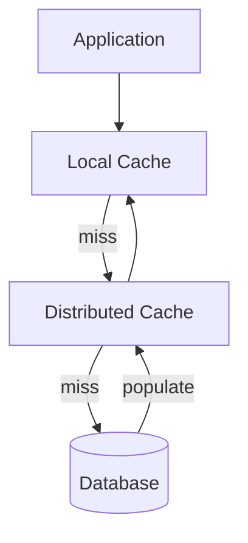

# Caching

Cache patterns, eviction, distributed caches, CDN, hot keys, and stampede prevention.

*Figure: Multi-tier cache-aside read path.*

## What You'll Learn

Caching is the highest-ROI performance lever — and the fastest way to serve stale data. This domain covers cache-aside, read-through, write-through, invalidation strategies, distributed caches (Redis), and preventing cache stampedes.

## Chapters

| Chapter | Focus |
|---------|-------|
| [Caching Fundamentals](/docs/caching/caching-fundamentals) | Cache-aside, TTL, eviction policies |
| [Cache Invalidation](/docs/caching/cache-invalidation) | TTL, event-driven purge, cache stampede |
| [Distributed Caching](/docs/caching/distributed-caching) | Redis cluster, consistent hashing, hot keys |

## Learning Path

1. **Caching Fundamentals** — patterns and when each applies.
2. **Cache Invalidation** — "the two hard problems" in practice.
3. **Distributed Caching** — Redis, Memcached, CDN edge caching.

## Interview Prep

| Resource | Topic |
|----------|-------|
| [Meta News Feed](/docs/real-world-scenarios/meta-news-feed-design) | Fan-out, feed caching |
| [Airbnb Rate Limiting](/docs/real-world-scenarios/airbnb-distributed-rate-limiting) | Redis-backed quotas |
| [Distributed Cache Design](/docs/system-design/distributed-cache-design) | System design exercise |
| [Lab 001 consistent hashing](/docs/caching/distributed-caching#25-hands-on-exercise) | Hash ring on `:8096` |

## Prerequisites

- [Storage Engines](/docs/storage-engines/overview)
- [Replication](/docs/replication/overview)

## Next Domain

Continue to [Microservices](/docs/microservices/overview) and [System Design](/docs/system-design/overview).

Return to the [Curriculum Overview](/docs/start-here/curriculum-overview) for the full learning path.
