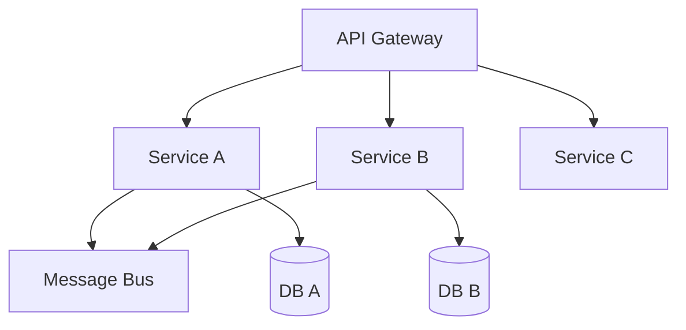

# Microservices

Service decomposition, DDD, circuit breakers, service mesh, and API design.

*Figure: Microservices with gateway, async messaging, and database-per-service.*

## Chapters

| Chapter | Focus |
|---------|-------|
| Service Decomposition and DDD | [Service Decomposition and DDD](/docs/microservices/service-decomposition-and-ddd) |
| Resilience Patterns | [Resilience Patterns](/docs/microservices/resilience-patterns) |
| Service Mesh and Sidecars | [Service Mesh and Sidecars](/docs/microservices/service-mesh-and-sidecars) |

## Learning Path

1. Start with **Service Decomposition and DDD** for bounded contexts and migration strategies.
2. Study **Resilience Patterns** for circuit breakers, bulkheads, and graceful degradation.
3. Finish with **Service Mesh and Sidecars** for traffic management, mTLS, and observability hooks.

## Interview Prep

| Resource | Topic |
|----------|-------|
| [Netflix Cascading Failure](/docs/real-world-scenarios/netflix-cascading-failure) | Circuit breakers, bulkheads |
| [Lab 010 saga orchestration](/docs/transactions/sagas#25-hands-on-exercise) | Compensation on `:8093` |

## Related Domains

- [API and Integration Architecture](/docs/api-and-integration-architecture/overview)
- [Reliability and Resilience](/docs/reliability-and-resilience/overview)
- [System Design](/docs/system-design/overview)

Return to the [Curriculum Overview](/docs/start-here/curriculum-overview) to see how this domain fits the learning path.
