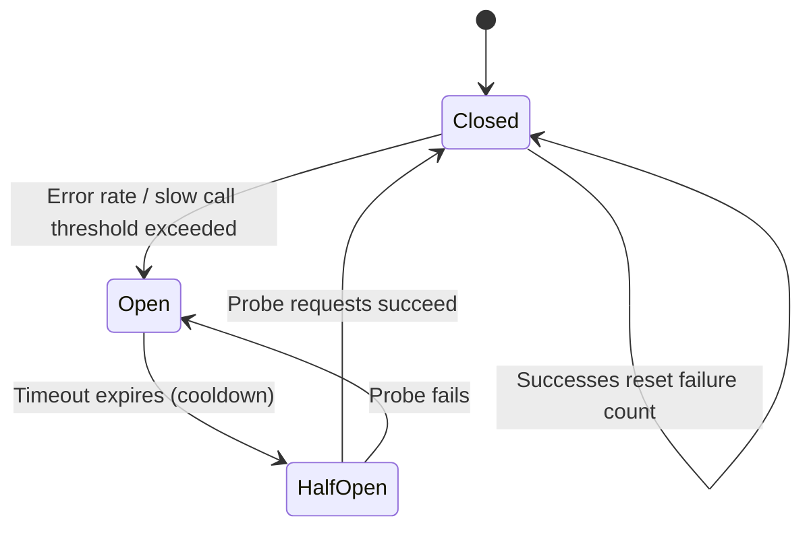
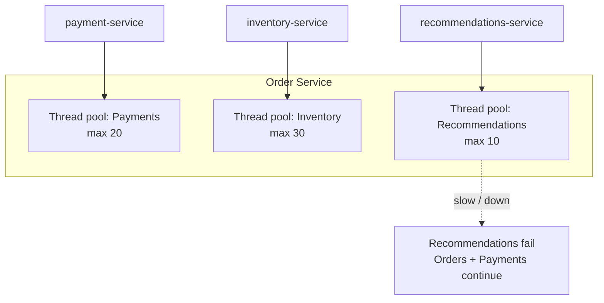
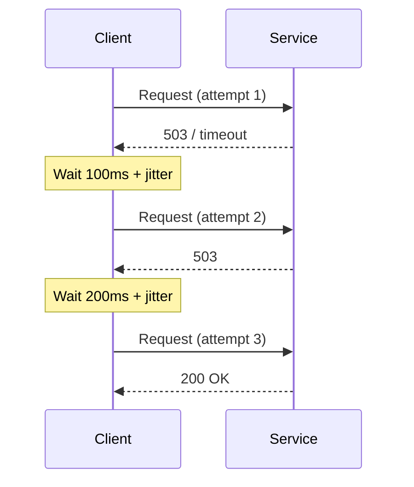

# Resilience Patterns

## 1. Executive Summary

**Resilience patterns** are structural defenses against **partial failure** in distributed systems. When one service slows or fails, uncontrolled retry storms and cascading overload can convert a localized fault into a **system-wide outage**. Patterns—**timeouts**, **retries with backoff**, **circuit breakers**, **bulkheads**, **load shedding**, and **graceful degradation**—bound blast radius and preserve **liveness** for critical paths.

Resilience is not "add a library." It requires **explicit SLO budgets**, **failure budgets**, **idempotent endpoints**, **observability** of saturation, and **organizational policies** (when to fail open vs closed). Principal architects design these as **platform defaults** with escape hatches, not as per-team afterthoughts.

This chapter covers mechanism, guarantees, tuning tradeoffs, anti-patterns (retry storms, retry without jitter), integration with service mesh, and interview-level failure reasoning.

## 2. Why This Topic Matters

Microservice interviews probe whether candidates understand that **failure is normal**:

- A dependency at 99.9% availability contributes ~43 minutes/month downtime—your service cannot pretend it is always up.
- **Cascading failure** from thread pool exhaustion is a classic principal-level scenario.
- **Circuit breaker** state transitions and half-open probing require precise explanation.
- **Idempotency** and retries are inseparable—unsafe retries corrupt data.

Weak answers list pattern names without discussing **when they hurt** (circuit breakers causing false opens, hedging doubling load).

## 3. Problems Being Solved

| Problem | Resilience pattern |
|---------|-------------------|
| Hung requests blocking threads | Timeouts on client and server |
| Transient network blips | Retry with exponential backoff + jitter |
| Failing dependency overload | Circuit breaker opens; fail fast |
| One tenant exhausts pool | Bulkhead isolation |
| Traffic spike exceeds capacity | Load shedding, rate limiting, queue caps |
| Non-critical feature blocks core path | Graceful degradation, fallbacks |
| Thundering herd on recovery | Jittered backoff, gradual ramp |

Patterns do **not** fix: incorrect consistency assumptions, missing idempotency, or under-provisioned capacity without autoscaling limits.

## 4. Assumptions and System Model

| Assumption | Implication |
|------------|-------------|
| **Partial failure is common** | Design every outbound call to fail |
| **Latency has tails** | Percentile SLOs; timeouts below client deadline |
| **Retries amplify load** | Cap retry budget; coordinate with server rate limits |
| **Not all failures are retryable** | 4xx vs 5xx; business validation errors |
| **Cascading failure is a liveness threat** | Shed load before total collapse |

**Client model:** Each outbound call has timeout T, retry policy R, breaker state B, and bulkhead quota Q. Server exposes health that reflects **dependency health** (deep health checks) vs **liveness** (shallow).

## 5. Essential Terminology

| Term | Definition |
|------|------------|
| **Timeout** | Maximum wait before abandoning a call |
| **Retry** | Repeat failed call subject to policy |
| **Exponential backoff** | Increasing delay between retries |
| **Jitter** | Randomized delay to desynchronize retries |
| **Circuit breaker** | Fail-fast after error threshold; periodic half-open probe |
| **Bulkhead** | Resource pool isolation limiting cross-coupling |
| **Load shedding** | Reject excess requests to protect survivors |
| **Graceful degradation** | Reduced functionality vs total failure |
| **Hedging** | Send duplicate request if first slow—doubles load |
| **Fail open / fail closed** | Degrade permissively vs deny when dependency down |

## 6. Core Mechanism

### Circuit breaker state machine



*Figure 1: Closed allows traffic; Open fails fast; HalfOpen tests recovery with limited probes.*

### Bulkhead isolation



*Figure 2: Bulkheads prevent one slow dependency from exhausting all worker threads.*

### Retry with backoff and jitter



*Figure 3: Bounded retries with increasing delay; jitter prevents synchronized retry storms.*

### Timeout budget chaining

For request path A → B → C, total deadline must fit:

| Hop | Budget | Cumulative |
|-----|--------|------------|
| A processing | 50ms | 50ms |
| A → B call | 200ms | 250ms |
| B → C call | 150ms | 400ms |
| **Client deadline** | **500ms** | margin 100ms |

Child timeouts must be **shorter** than parent remaining budget.

## 7. Step-by-Step Walkthrough

**Scenario:** Order service calls Payment service during checkout spike.

| Step | Event | Resilience response |
|------|-------|---------------------|
| 1 | Payment latency p99 rises 200ms → 2s | Client timeout at 800ms triggers |
| 2 | Errors exceed 50% in 10s window | Circuit breaker opens |
| 3 | Open state | Fail fast; queue checkout for async retry |
| 4 | 30s cooldown | Half-open sends 5 probe requests |
| 5 | Probes succeed | Breaker closes; gradual traffic restore |
| 6 | Retry policy | Max 3 attempts, exponential backoff, idempotency key |

**Idempotency:** `Idempotency-Key: uuid` header ensures duplicate retries do not double-charge.

**Retry budget calculation (platform default example):**

For a client making `N` concurrent requests with `R` max retries each, worst-case load multiplier on a failing dependency is approximately `N × (R + 1)`. At 1000 RPS with 3 retries, a failing payment service could see **4000 RPS**—enough to prevent recovery (**metastable failure** per OSDI research).

Platform defaults should include:

| Parameter | Suggested starting point | Tune from |
|-----------|-------------------------|-----------|
| Max retries | 2–3 | Error budget impact |
| Base backoff | 100ms | Dependency recovery time |
| Max backoff | 2s | Client SLA |
| Jitter | Full jitter (AWS pattern) | Retry storm metrics |
| Per-dependency retry budget | 10% of normal QPS cap | Load test |

**Graceful degradation tiers (document in runbooks):**

| Tier | Feature | Degradation behavior |
|------|---------|-------------------|
| 0 | Checkout, auth | Fail closed; no silent bypass |
| 1 | Recommendations | Empty list; cached popular items |
| 2 | Social proof ("X bought this") | Hide widget |
| 3 | Analytics beacons | Drop silently; queue locally |

## 8. Invariants and Guarantees

| Property | Type | Statement |
|----------|------|-----------|
| **Fail fast when open** | Liveness | Breaker open rejects without waiting full timeout |
| **No unbounded retries** | Safety | Retry cap prevents infinite amplification |
| **Idempotent retries** | Safety | Duplicate attempts safe for mutating ops |
| **Bulkhead isolation** | Liveness | Pool exhaustion localized to bulkhead |
| **Perfect resilience** | **Not guaranteed** | Total overload or shared infrastructure still fails |

## 9. Failure Scenarios

### Scenario 1: Retry storm

**Setup:** 1000 clients retry immediately on 503 without backoff.

**Effect:** Payment service never recovers—**metastable failure**.

**Mitigation:** Exponential backoff + jitter; server `Retry-After`; client retry budget.

### Scenario 2: Circuit breaker flapping

**Setup:** Threshold too sensitive; half-open allows full traffic immediately.

**Effect:** Oscillation between open/closed; erratic error rates.

**Mitigation:** Sliding window; minimum open duration; limited half-open concurrency.

### Scenario 3: Timeout mismatch

**Setup:** Client timeout 30s; load balancer idle 60s; threads tied up.

**Effect:** Thread pool exhaustion; cascading latency.

**Mitigation:** End-to-end deadline propagation (gRPC deadline, `context` cancellation).

### Scenario 4: Unsafe retry on POST

**Setup:** Payment charge retried after timeout; first request actually succeeded.

**Effect:** Double charge.

**Mitigation:** Idempotency keys; deduplication store; at-most-once business semantics.

### Scenario 5: Hedging under load

**Setup:** Hedged requests on all slow reads during incident.

**Effect:** 2× load on already struggling dependency.

**Mitigation:** Hedging only below p99 threshold; cap hedge rate.

### Scenario 6: Shared breaker state missing

**Setup:** 50 pod replicas each maintain independent circuit breaker; 10% see errors, 90% do not—breaker never opens cluster-wide.

**Effect:** Continued load on failing dependency from majority of pods.

**Mitigation:** Adaptive algorithms, shared state (Redis), or outlier detection at load balancer/mesh layer.

## 10. Performance Characteristics

| Pattern | Latency impact | Load impact |
|---------|---------------|-------------|
| Timeout | Caps tail wait | Frees resources faster |
| Retry | Increases tail on success path | Multiplies load on failure |
| Circuit breaker | Near-zero when open | Reduces load on failing dep |
| Bulkhead | Queue wait if pool full | Caps concurrent dep load |
| Hedging | Reduces tail if lucky | Up to 2× requests |
| Load shedding | Fast reject | Protects capacity |

Tune with **load tests** reproducing dependency failure—not happy path only.

## 11. Scalability Limits

- Circuit breaker state is **per client instance**—cluster-wide view needs shared state or adaptive algorithms.
- Bulkhead pools require capacity planning—too small → false rejects; too large → no isolation.
- Retry budgets must scale with client count—global rate limits on server side essential.
- Service mesh adds hop latency (~1–3ms)—**verify** against SLO budget.

## 12. Operational Considerations

- Dashboards: breaker state transitions, retry counts, timeout rates, bulkhead rejections.
- Alert on **retry rate spike** and **breaker open duration**—leading indicators.
- Runbooks: when to manually trip breaker, drain queues, enable degradation mode.
- Chaos tests: inject latency/failure on dependencies in staging.
- Document **degradation tiers** (e.g., hide recommendations, keep checkout).

**Resilience testing in CI/CD pipeline:**

| Stage | Test type | Pass criteria |
|-------|-----------|---------------|
| Unit | Breaker state transitions mocked | States correct |
| Integration | Testcontainers + Toxiproxy latency | Timeout fires < SLA |
| Staging | Weekly chaos: 500ms downstream delay | Checkout error < 0.1% |
| Pre-prod | Load test with 10% dependency error rate | No metastable failure |
| Prod canary | 5% traffic during deploy | Auto-rollback on burn |

Document **resilience SLOs** separately from availability SLOs—e.g., "99% of dependency failures fail fast within 100ms" measures breaker effectiveness.

## 13. Security Considerations

- Rate limiting prevents **abuse** and accidental DDoS from misconfigured clients.
- Fail-open on auth may expose data—prefer fail-closed for security dependencies.
- Retry amplification can be exploited—authenticate and throttle per tenant.
- Circuit breaker metrics should not leak sensitive dependency topology publicly.

## 14. Cost Considerations

- Retries increase **compute and egress** during incidents—model in capacity planning.
- Over-provisioned bulkheads waste resources; under-provisioned cause false failures.
- Managed resilience (mesh, API gateway) adds licensing and operational complexity.
- Incident cost of cascading failure often exceeds resilience infrastructure investment.

## 15. Production Implementations

### Netflix Hystrix (legacy) / Resilience4j

JVM circuit breaker, bulkhead, timeout libraries—Hystrix in maintenance; Resilience4j successor.

### Istio / Envoy

Outlier detection, connection pool limits, retries at data plane—**implementation** with careful policy governance.

### AWS ALB + API Gateway

Timeouts, throttling, WAF—edge resilience before application patterns.

### gRPC

Built-in deadlines, retry policy (service config), keepalive.

### Polly (.NET)

Policy composition: retry, circuit breaker, bulkhead, timeout.

**Cross-implementation comparison (selection guide):**

| Environment | Recommended starting point | Rationale |
|-------------|---------------------------|-----------|
| JVM microservices | Resilience4j + Micrometer metrics | Active maintenance; Spring Boot integration |
| Kubernetes polyglot | Istio outlier detection + app timeouts | Uniform policy without per-language libs |
| AWS Lambda | API Gateway timeout + idempotent handlers | No long-lived thread pools |
| .NET services | Polly v8 pipelines | Composable policies with DI |
| Mobile BFF | Client-side backoff + server idempotency | Cannot rely on server-only breakers |

**Netflix historical context:** Hystrix demonstrated circuit breaker patterns at scale but was designed for thread-per-request servlet models. Reactive and virtual-thread architectures may use lighter-weight alternatives—but **the patterns remain valid** regardless of library. Teams migrating off Hystrix should preserve metrics dashboards during Resilience4j migration to avoid blind spots.

**Edge vs application resilience split:** API Gateway handles coarse rate limits and WAF; application handles idempotency and business-aware degradation. Duplicating circuit breakers at both layers without coordination can cause confusing partial failures—document which layer owns which concern.

## 16. Alternatives and Tradeoffs

| Approach | Strength | Weakness |
|----------|----------|----------|
| Client-side libraries | Fine-grained per call | Language fragmentation |
| Service mesh | Uniform policy | Operational complexity |
| API gateway aggregation | Reduces fan-out | Single point of failure if not HA |
| Async + queue | Natural decoupling | Higher latency to consistency |
| Synchronous + patterns | Low latency happy path | Complex tuning |

Prefer **async boundaries** for non-critical paths; sync + resilience for latency-sensitive critical paths.

## 17. Common Misconceptions

| Misconception | Reality |
|---------------|---------|
| "Retry everything" | Retries unsafe without idempotency; amplifies outages |
| "Circuit breaker fixes slow deps" | It protects callers; root cause still needs fixing |
| "Longer timeout = more reliable" | Long timeouts exhaust pools; fail faster |
| "Mesh solves resilience" | Policies still need correct values and idempotent apps |
| "Bulkhead = K8s resource limits" | Different—thread/connection isolation per dependency |

## 18. Principal Architect Perspective

1. **Platform defaults** for timeout, retry, breaker—teams opt out with ADR, not opt in blindly.
2. **Idempotency is prerequisite** for any retry on mutations—enforce at API design review.
3. **Degrade features by tier** before losing core transactions.
4. **Chaos engineering** validates patterns under realistic failure—not unit tests alone.
5. **Metastable failures** require load shedding, not just retries—study formal models (e.g., NSDI papers on metastability).

**Platform resilience policy template (golden path):**

Every outbound client generated from platform SDK should inherit:

```
timeout: parent_deadline - 50ms
retry: max 2, exponential backoff, full jitter
retry_on: [timeout, 503, 429]
no_retry_on: [400, 401, 402, 404, 409]
idempotency: required for POST/PUT mutations
circuit_breaker: 50% errors / 30s window, open 60s
bulkhead: dedicated pool per dependency
```

Teams override via ADR with SRE sign-off—not silent local copies.

## 19. Architecture Review Exercise

**Scenario:** Mobile app → API gateway → 6 microservices, no timeouts, infinite retries on 500, shared Tomcat thread pool (200 threads).

**Review prompts:**

1. What happens when Recommendations service hangs?
2. Retry behavior during payment outage?
3. Proposed remediation priority?

**Expected findings:** Add timeouts (gateway + client), retry cap with jitter, bulkheads per dependency, idempotency on payments, async recommendations with fallback empty list.

## 20. Whiteboard Explanation

**90-second version:**

> "Every outbound call gets a timeout shorter than the user's deadline, with cancellation propagated. Retries are limited, exponential backoff with jitter, only on idempotent operations or with idempotency keys. Circuit breakers fail fast when error rate spikes—open, then half-open probes before full restore. Bulkheads isolate thread pools so one bad dependency can't starve checkout. Under extreme load we shed non-critical work—hide recommendations, queue notifications. The goal is preventing cascading failure: a slow service shouldn't take down the whole mesh. We measure breaker opens, retry rates, and pool saturation, and chaos-test dependency latency in staging."

## 21. Interview Questions

1. **Circuit breaker states?**
   - *Signals:* Closed, open, half-open; thresholds and probes.

2. **Why jitter on backoff?**
   - *Signals:* Desynchronize retries; prevent thundering herd.

3. **Retry without idempotency risk?**
   - *Signals:* Duplicate side effects; double charge example.

4. **Bulkhead vs rate limit?**
   - *Signals:* Pool isolation vs request rate cap.

5. **Timeout propagation?**
   - *Signals:* Parent deadline minus processing; gRPC context.

6. **Fail open vs closed for recommendations?**
   - *Signals:* Fail open (empty list); vs payment fail closed.

7. **Metastable failure?**
   - *Signals:* System can't recover because retry/load prevents healing.

8. **Hedging tradeoff?**
   - *Signals:* Tail latency vs doubled load.

9. **When circuit breaker hurts?**
   - *Signals:* False opens; flapping; hides partial degradation needs.

10. **Design checkout resilience.**
    - *Signals:* Payment idempotency, inventory reservation timeout, async confirmation.

11. **Client vs server retry?**
    - *Signals:* Both dangerous if uncoordinated; prefer client with server idempotency.

12. **Deep vs shallow health check?**
    - *Signals:* Shallow for LB liveness; deep for readiness including deps.

13. **How detect metastable failure?**
    - *Signals:* System not recovering after fix; retry rate high; load exceeds sustainable.

14. **Bulkhead thread pool sizing?**
    - *Signals:* Based on dependency SLA, pool % of total, load test saturation point.

15. **Platform vs app resilience ownership?**
    - *Signals:* Platform defaults; app idempotency and degradation logic; ADR for overrides.

**Scoring rubric:**

| Dimension | Strong | Weak |
|-----------|--------|------|
| Failure reasoning | Cascading, metastable, pools | "Add retry" only |
| Safety | Idempotency, fail closed | Retry all POSTs |
| Ops | Metrics, chaos, runbooks | Library name drop |

## 22. Interview Follow-Ups

1. **How set circuit breaker thresholds?**
   - *Signals:* Error rate + slow call % over sliding window; tune from production baselines.

2. **Mesh retry on POST?**
   - *Signals:* Dangerous; disable or require idempotent protocol design.

3. **Graceful degradation without code deploy?**
   - *Signals:* Feature flags, config-driven fallbacks, cached responses.

4. **How coordinate retry budgets across microservices during incident?**
   - *Signals:* Global rate limit on dependency; reduce client max retries centrally via config service.

5. **Resilience testing in production canary?**
   - *Signals:* Small traffic %; abort on burn; fault injection on canary subset only.

## 23. Strong Answer Example

**Question:** "Payment dependency is flaky—how do you protect checkout?"

> "First, idempotency keys on all charge requests with server-side dedup store. Client timeout 800ms within 1.2s checkout budget. Retry max twice with exponential backoff and full jitter only on timeouts and 503—not on 402 decline. Circuit breaker on payment client: 50% errors in 30s opens for 60s, half-open with 3 probes. Bulkhead dedicates 25 threads to payment so inventory slowness can't block charges. If breaker open, return 'payment temporarily unavailable' and hold order in `PENDING_PAYMENT` for async retry worker—not infinite sync retry. Monitor retry rate, breaker state, and payment error budget. Chaos-test 5s payment latency monthly."

## 24. Weak Answer Example

**Question:** "Payment dependency is flaky—how do you protect checkout?"

> "Add a circuit breaker and retry three times."

**Why weak:** No idempotency, backoff, bulkhead, async fallback, or timeout budget.

## 25. Hands-On Exercise

**Try it:** [Sagas §25 Hands-On](/docs/transactions/sagas#25-hands-on-exercise) — Lab 010 demonstrates timeout/retry, compensation, and idempotent saga steps on `:8093`.

1. Implement Resilience4j (or equivalent) on sample service with breaker + retry + bulkhead.
2. Inject 100% failure on dependency; observe open state and recovery.
3. Remove jitter; measure retry spike with load generator.
4. Add idempotency middleware; verify duplicate POST safety.
5. Document degradation tiers for a product page BFF.
6. Run chaos test: 2s latency injection; capture thread pool metrics.
7. Measure metastable failure: inject 503 on dependency with unlimited client retry; observe recovery time after fix.
8. Implement idempotency store (Redis or DB) and verify duplicate charge prevention under parallel retries.
9. Document platform SDK default resilience policy; present override ADR template to mock staff panel.

## 26. Knowledge Check

1. Half-open purpose? *(Probe recovery with limited traffic.)*
2. Jitter prevents? *(Synchronized retry storms.)*
3. Bulkhead protects? *(Resource pool isolation per dependency.)*
4. Idempotency needed for? *(Safe retries on mutations.)*
5. Metastable failure? *(Overload prevents recovery despite fix.)*

## 27. Flashcards

| # | Front | Back |
|---|-------|------|
| 1 | Circuit breaker | Fail-fast after errors; half-open probes recovery. |
| 2 | Bulkhead | Isolated resource pool per dependency. |
| 3 | Exponential backoff | Increasing delay between retries. |
| 4 | Jitter | Random delay to desynchronize clients. |
| 5 | Idempotency key | Safe duplicate request handling. |
| 6 | Load shedding | Reject excess load to survive. |
| 7 | Graceful degradation | Reduced features vs total outage. |
| 8 | Hedging | Duplicate slow request—doubles load. |
| 9 | Fail fast | Short timeout vs hanging threads. |
| 10 | Metastable failure | System stuck in bad state despite fix. |

## 28. Cheat Sheet

```
EVERY OUTBOUND CALL
  Timeout < parent deadline
  Retry: capped, backoff, jitter, idempotent only
  Breaker: error + slow thresholds
  Bulkhead: dedicated pool

BREAKER
  Closed → Open (threshold) → HalfOpen (probe) → Closed

ANTI-PATTERNS
  Infinite retry
  Retry on non-idempotent POST
  Shared pool all deps
  Timeout > client SLA

DEGRADATION TIERS
  Tier 0: Core transactions
  Tier 1: Personalization
  Tier 2: Analytics beacons

METRICS
  Breaker state, retry count, pool reject, timeout rate
```

## 29. Related Concepts

- [Partial Failure](/docs/distributed-systems-foundations/partial-failure) — foundational failure model
- [Idempotency](/docs/distributed-systems-foundations/idempotency) — safe retries
- [SLOs, SLIs, and Error Budgets](/docs/reliability-and-resilience/slo-sli-error-budgets) — resilience tied to budgets
- [Service Mesh and Sidecars](/docs/microservices/service-mesh-and-sidecars) — data-plane resilience policies
- [Chaos Engineering](/docs/reliability-and-resilience/chaos-engineering) — validating resilience
- [Event-Driven Architecture](/docs/messaging-and-streaming/event-driven-architecture) — async decoupling alternative

## 30. References

### Primary sources

- Nygard, M. (2018). *Release It!*, 2nd ed. Pragmatic Bookshelf — circuit breaker, bulkhead, stability patterns.
- Bronson, G., et al. "Metastable Failures in Distributed Systems." *OSDI 2021* — formal treatment of retry-induced outages.

### Engineering blogs

- Netflix Technology Blog — Hystrix and resilience evolution.
- Microsoft Azure Architecture Center — [Circuit Breaker pattern](https://learn.microsoft.com/en-us/azure/architecture/patterns/circuit-breaker).
- Resilience4j documentation — configuration semantics.

### Distinction

| Claim type | Source |
|------------|--------|
| Pattern definitions | Nygard; Azure patterns catalog |
| Metastable failure | OSDI 2021 paper |
| Library behavior | Resilience4j/Istio docs — **implementation choices** |
