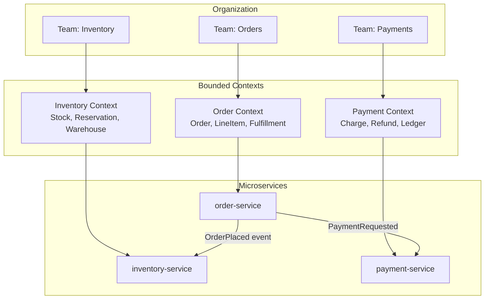
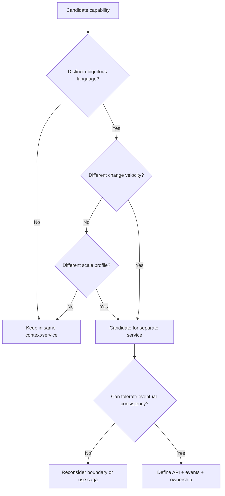
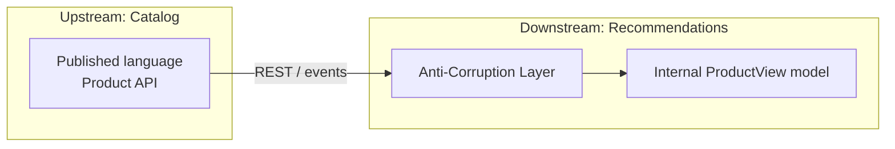

# Service Decomposition and DDD

## 1. Executive Summary

**Service decomposition** is the act of partitioning a system into independently deployable services aligned with business capability boundaries. **Domain-Driven Design (DDD)** provides the strategic vocabulary—**bounded contexts**, **ubiquitous language**, **aggregates**, and **domain events**—to make those boundaries durable rather than arbitrary.

Poor decomposition creates **distributed monoliths**: services that must deploy together, share databases, and fail in correlated ways. Strong decomposition maps **organizational ownership**, **data autonomy**, and **evolution velocity** to context boundaries. The goal is not "more services" but **independent lifecycles** with explicit integration contracts.

This chapter covers decomposition heuristics, DDD tactical patterns in microservice form, context mapping, data ownership, team topology (Conway's Law), migration from monoliths, and principal-level tradeoffs between granularity, consistency, and operational cost.

## 2. Why This Topic Matters

Microservice interviews at principal level rarely ask "what is a microservice." They ask:

- How would you **decompose** this monolith without creating a distributed ball of mud?
- Where do you draw **transaction boundaries** when data spans services?
- How do **bounded contexts** differ from REST resource groupings?
- What is the **cost** of the wrong cut—latency, consistency, team friction?
- How do you **evolve** boundaries as the business changes?

Candidates who answer with technology ("use Kubernetes") miss the organizational and domain reasoning that distinguishes staff/principal architects from senior engineers.

## 3. Problems Being Solved

| Problem | Decomposition + DDD response |
|---------|------------------------------|
| Monolith scaling bottlenecks | Isolate hot subdomains for independent scale |
| Coupled release trains | Services with separate CI/CD per bounded context |
| Unclear ownership | Context maps assign team accountability |
| Semantic drift ("Customer" means different things) | Ubiquitous language per context |
| Big-bang rewrites | Strangler fig migration along seams |
| Shared mutable databases | Database-per-service with explicit integration |

Decomposition does **not** solve: inherent distributed-systems complexity, cross-context reporting without eventual consistency, or automatic team autonomy without governance.

## 4. Assumptions and System Model

| Assumption | Implication |
|------------|-------------|
| **Business domain has natural seams** | Not all domains decompose cleanly—some remain modular monoliths |
| **Teams own services long-term** | Conway's Law: architecture mirrors communication structure |
| **Network is unreliable** | Cross-service calls are partial failure paths |
| **Consistency is expensive across boundaries** | Sagas, outbox, eventual consistency by default |
| **Not Byzantine** | Trust internal services with mTLS and policy; zero-trust at edge |

**System model:** Each service is a deployable unit with its own persistence, exposing APIs or publishing events at context boundaries. Integration is **synchronous (query/command)** or **asynchronous (domain events)**—never shared tables.

## 5. Essential Terminology

| Term | Definition |
|------|------------|
| **Bounded context** | Explicit boundary where a domain model is consistent and terms have one meaning |
| **Ubiquitous language** | Shared vocabulary between developers and domain experts within a context |
| **Aggregate** | Cluster of entities treated as a consistency unit; one root entity |
| **Domain event** | Record of something meaningful that happened in the domain |
| **Context map** | Diagram of relationships between bounded contexts (upstream/downstream) |
| **Anti-corruption layer (ACL)** | Translation layer protecting a context from foreign models |
| **Shared kernel** | Small shared model between two contexts—use sparingly |
| **Conway's Law** | System design reflects organizational communication structure |
| **Database per service** | Each service owns its schema; no cross-service SQL joins in production |
| **Strangler fig** | Incrementally replace monolith by routing traffic to new services |

## 6. Core Mechanism

### Bounded context to service mapping



*Figure 1: Teams align to bounded contexts; services encapsulate context models; integration crosses explicit boundaries.*

### Decomposition decision flow



*Figure 2: Decomposition heuristics—language, velocity, and scale drive cuts; consistency constraints validate them.*

### Context relationship patterns



*Figure 3: Downstream contexts translate upstream models through ACLs rather than leaking foreign concepts.*

### Aggregate boundaries and consistency

Within a bounded context, **aggregates** define transaction boundaries:

- **Order aggregate** (root: `Order`): includes `LineItems`; invariants like "total matches sum of lines" enforced inside aggregate.
- **Inventory aggregate** (root: `StockItem`): reservation logic stays local; cross-aggregate rules use domain events or sagas.

**Rule:** One transaction modifies one aggregate instance. Cross-service invariants require **sagas** or **eventual consistency** with compensating actions.

## 7. Step-by-Step Walkthrough

**Scenario:** E-commerce monolith decomposed into Order, Inventory, and Payment contexts.

| Step | Action | Mechanism |
|------|--------|-----------|
| 1 | Domain workshop | Identify bounded contexts with domain experts |
| 2 | Context map | Mark Order as upstream to Fulfillment; Payment as separate |
| 3 | Extract Inventory first | High change velocity; clear data boundary |
| 4 | Database per service | Inventory gets `inventory_db`; no shared tables |
| 5 | Publish `StockReserved` events | Order service subscribes via message broker |
| 6 | Strangler routing | API gateway routes `/inventory/*` to new service |
| 7 | Extract Payment | PCI scope isolation drives boundary |
| 8 | Saga for checkout | Order → reserve stock → charge payment → confirm |

**Checkout saga (choreography):**

| Step | Service | Event / action |
|------|---------|----------------|
| 1 | Order | `OrderCreated` |
| 2 | Inventory | Reserve stock → `StockReserved` or `StockRejected` |
| 3 | Payment | Charge → `PaymentCaptured` or `PaymentFailed` |
| 4 | Order | Confirm or compensate (release stock, cancel order) |

**Event storming facilitation (principal-level practice):**

Principal architects often lead **4-hour domain workshops** with sticky notes on a wall:

| Hour | Activity | Output |
|------|----------|--------|
| 1 | Domain events (orange) | Timeline of business occurrences |
| 2 | Commands and actors (blue) | Who triggers what |
| 3 | Aggregates and policies (yellow) | Consistency boundaries emerge |
| 4 | Draw context lines | Candidate bounded contexts |

**Extraction decision checklist**—extract a service only when **three or more** apply:

1. Distinct **ubiquitous language** from neighbors
2. **Eventual consistency** tolerable with dependencies
3. **Team ready** for on-call ownership
4. Different **scale or release cadence**
5. **Regulatory scope** benefit (PCI, HIPAA isolation)

**Cross-context data patterns:**

| Pattern | Consistency | Use when |
|---------|-------------|----------|
| Synchronous API | Strong read of remote | Simple query; few hops |
| Domain events | Eventual | Decoupled workflows |
| CDC (Debezium) | Eventual | Legacy DB during strangler |
| CQRS read model | Eventual | Cross-context reporting |

Avoid **2PC across contexts**—use sagas and [Transactional Outbox](/docs/transactions/transactional-outbox) instead.

**Monolith extraction order heuristic:**

| Priority | Candidate | Rationale |
|----------|-----------|-----------|
| 1 | High-change, clear boundary | Inventory, notifications |
| 2 | Regulatory isolation | Payment, PII profile |
| 3 | Scale hotspot | Search indexing, media processing |
| 4 | Stable core | Keep order management longer if boundary unclear |

## 8. Invariants and Guarantees

| Property | Type | Statement |
|----------|------|-----------|
| **Context model consistency** | Safety | Terms have single meaning within bounded context |
| **Aggregate invariant** | Safety | Invariants hold within one aggregate per transaction |
| **Cross-context consistency** | **Eventual** | Not atomic without distributed transaction (avoid 2PC) |
| **Service autonomy** | Liveness | Service deploys without coordinating peer schema migrations |
| **Idempotent consumers** | Safety | Event handlers tolerate duplicate delivery |

## 9. Failure Scenarios

### Scenario 1: Shared database anti-pattern

**Setup:** Three services read/write `orders` table directly.

**Effect:** Schema changes require coordinated deploys; cascading failures; unclear ownership.

**Mitigation:** Database per service; APIs/events only; read models via CDC if needed.

### Scenario 2: Chatty synchronous mesh

**Setup:** Checkout calls 12 services synchronously per request.

**Effect:** Latency multiplies; partial failure probability compounds; brittle deploys.

**Mitigation:** Orchestrated saga or choreography with async events; aggregate read models.

### Scenario 3: Wrong bounded context cut

**Setup:** "Customer" split across Profile and Billing with different definitions.

**Effect:** Integration bugs; duplicate customer IDs; support confusion.

**Mitigation:** Context map workshop; ACL; canonical identity service as upstream.

### Scenario 4: Distributed monolith

**Setup:** Services share library, database, and release train.

**Effect:** Microservice operational cost without autonomy benefits.

**Mitigation:** Enforce independent deploy tests; separate repos or strict module boundaries.

### Scenario 5: Event schema breaking change

**Setup:** `OrderPlaced` v2 removes field consumers require.

**Effect:** Downstream processing stalls; silent data corruption.

**Mitigation:** Schema registry; backward-compatible evolution; consumer-driven contracts.

### Scenario 6: Premature extraction during peak season

**Setup:** Team extracts Payment service two weeks before Black Friday without load testing cross-service checkout.

**Effect:** Latency regression; saga timeouts; revenue impact during highest-traffic period.

**Mitigation:** Freeze structural changes before peak; load test extracted path at 2× expected traffic; feature flag rollback to monolith path.

## 10. Performance Characteristics

| Factor | Impact |
|--------|--------|
| Cross-service sync calls | Add network RTT per hop; prefer batch or async |
| Event-driven integration | Higher latency to consistency; better peak throughput |
| Database per service | No cross-join; CQRS read models for queries |
| Service count | Operational overhead grows superlinearly without platform team |
| Caching at boundaries | Reduce fan-out; watch invalidation complexity |

**Rule of thumb:** Each synchronous hop adds ~1–10ms LAN / 50–200ms cross-region—**verify** with your topology. Design for **one sync hop** on critical paths where possible.

## 11. Scalability Limits

- **Team cognitive load:** Amazon "two-pizza team" heuristic—roughly 6–10 engineers per service cluster.
- **Service count:** Hundreds of services require strong platform engineering (discovery, observability, deployment).
- **Event throughput:** Bounded by broker partition design and consumer parallelism.
- **Context granularity:** Too fine → integration explosion; too coarse → monolith reborn.

## 12. Operational Considerations

- **Service catalog** with ownership, SLOs, and on-call rotation per context.
- **Contract testing** (Pact, consumer-driven) at context boundaries.
- **Deprecation policy** for APIs and events with sunset timelines.
- **Runbooks** per service including upstream/downstream dependencies.
- **Feature flags** for strangler migrations and dark launches.
- **Architecture decision records (ADRs)** documenting boundary choices.

**Ongoing boundary governance:**

After initial decomposition, teams must prevent **boundary erosion**:

| Review cadence | Activity | Owner |
|----------------|----------|-------|
| Weekly | New cross-service dependency PR review | Tech lead |
| Monthly | Context map update in architecture wiki | Principal architect |
| Quarterly | Coupling metrics review (deploy correlation) | Platform + product |
| Per major feature | Event storming for new subdomain | Domain + engineering |

**Service catalog minimum fields:** service name, bounded context, owning team, tier (1–3), on-call rotation, SLO link, upstream/downstream dependencies, data stores owned, API/event contracts (links to OpenAPI/proto), last game day date.

## 13. Security Considerations

- **Least privilege** per service identity (IAM, SPIFFE).
- **PCI/HIPAA scope reduction** by isolating regulated data in dedicated contexts.
- **mTLS** between services; no implicit trust by network zone alone.
- **PII minimization** at integration boundaries—pass IDs not full profiles.
- **Audit trails** on domain events for compliance reconstruction.

## 14. Cost Considerations

- Each service adds: CI/CD pipelines, monitoring, on-call, compute baseline.
- **Over-decomposition** increases cloud spend (more pods, more cross-AZ traffic).
- **Under-decomposition** increases opportunity cost (slow releases, scaling inefficiency).
- FinOps should tag costs by bounded context / team for accountability.

## 15. Production Implementations

### Amazon

Service-oriented architecture with "two-pizza teams"; strict API ownership; eventual consistency across domains—**implementation choice** documented in public talks.

### Netflix

Domain-aligned microservices with robust platform (Spinnaker, Eureka); chaos testing validates boundary resilience.

### Uber

Domain-oriented microservice architecture (DOMA); emphasis on layered gateways and standard tooling.

### Modular monolith (Shopify-style evolution)

Some organizations retain modular monoliths with clear module boundaries—valid when decomposition cost exceeds benefit.

## 16. Alternatives and Tradeoffs

| Approach | Strength | Weakness |
|----------|----------|----------|
| **Modular monolith** | Simple ops, ACID transactions | Scaling and team autonomy limits |
| **Microservices + DDD** | Autonomy, independent scale | Distributed complexity |
| **Cell-based architecture** | Blast radius isolation | Higher baseline infrastructure |
| **Monorepo + many services** | Shared tooling | Requires discipline to avoid coupling |

Choose microservices when **organizational scale** and **independent deployment** justify distributed-systems tax.

## 17. Common Misconceptions

| Misconception | Reality |
|---------------|---------|
| "One entity = one service" | Aggregates and contexts drive cuts, not ER diagrams |
| "DDD is only for big companies" | Strategic DDD pays off at any scale with complex domains |
| "Events eliminate consistency problems" | They shift to eventual consistency and ordering challenges |
| "Microservices are always more scalable" | Network chatter can underperform well-designed monolith |
| "Decompose first, fix later" | Wrong boundaries are expensive to move |

## 18. Principal Architect Perspective

1. **Start with context map**, not technology—Conway's Law will enforce your org chart anyway.
2. **Optimize for change frequency**—stable subdomains can share infrastructure longer.
3. **Data ownership is non-negotiable**—shared databases are the leading cause of distributed monoliths.
4. **Plan migration as strangler**, not big-bang—business continuity dominates.
5. **Measure coupling**—deploy frequency correlation between services signals bad cuts.

**Organizational implication:** Platform teams provide golden paths; product teams own bounded contexts. Architects facilitate context mapping workshops, not just draw boxes.

**Measuring decomposition health (ongoing):**

| Metric | Healthy signal | Unhealthy signal |
|--------|----------------|------------------|
| Deploy frequency per service | Independent, frequent | Correlated multi-service deploys |
| Cross-service sync call depth | ≤2 on critical path | Deep synchronous chains |
| Incident blast radius | Single context | Cascading multi-service outages |
| Schema migration coupling | Independent per DB | Coordinated cross-schema changes |
| Team ownership clarity | One team per context | Shared "everyone owns" services |

Review these quarterly after decomposition milestones—not only at initial design time.

Principal architects should treat service boundaries as **living artifacts** that evolve with the business—not one-time workshop outputs frozen in an initial microservices migration plan.

## 19. Architecture Review Exercise

**Scenario:** 200-engineer org splits monolith into 40 services in six months. Shared PostgreSQL with schema per "service." Synchronous REST mesh for all reads. No event bus.

**Review prompts:**

1. Are services independently deployable?
2. Where are transaction boundaries?
3. What happens when Inventory schema migrates?
4. Latency budget for product page (calls 8 services)?

**Expected findings:** Shared DB prevents autonomy; sync mesh needs caching/BFF; missing events for cross-context workflows; recommend pause and context map reset.

## 20. Whiteboard Explanation

**90-second version:**

> "I decompose by bounded context—where business language and rules are consistent—not by technical layers. Each context becomes a service with its own database. Aggregates define local transactions; cross-context workflows use sagas or events. I map upstream/downstream relationships and use anti-corruption layers when models differ. Conway's Law means team boundaries matter as much as API boundaries. I'd strangler-migrate high-value seams first—usually inventory or payments for PCI—not random package splits. Wrong cuts cost more than staying monolithic longer, so I validate with change-velocity data and coupling metrics before extracting."

## 21. Interview Questions

1. **What is a bounded context?**
   - *Signals:* Consistent model boundary; ubiquitous language; not just a microservice.

2. **How do aggregates relate to microservices?**
   - *Signals:* Aggregate = transaction boundary inside context; service may host multiple aggregates.

3. **When would you NOT split a service?**
   - *Signals:* No language split, need strong consistency, team too small, premature optimization.

4. **Explain anti-corruption layer.**
   - *Signals:* Translation at downstream boundary; protects internal model.

5. **Database per service—how do you query across domains?**
   - *Signals:* API composition, CQRS read models, CDC, not cross-DB joins.

6. **Conway's Law implications?**
   - *Signals:* Align teams to contexts; reorg may require rearchitecture.

7. **Strangler fig pattern?**
   - *Signals:* Incremental routing; coexist monolith and services.

8. **Saga vs 2PC for checkout?**
   - *Signals:* Saga with compensation; 2PC fragile at scale.

9. **Signs of distributed monolith?**
   - *Signals:* Coordinated deploys, shared DB, cyclic sync dependencies.

10. **How to decompose a monolith—first steps?**
    - *Signals:* Event storming, context map, identify seams by change frequency.

11. **Ubiquitous language example?**
    - *Signals:* Same term different meaning across contexts (e.g., "Product").

12. **Context mapping relationship types?**
    - *Signals:* Partnership, customer-supplier, conformist, ACL, shared kernel.

**Scoring rubric:**

| Dimension | Strong | Weak |
|-----------|--------|------|
| Domain reasoning | Contexts, aggregates, events | "Split by REST resources" |
| Data ownership | DB per service, sagas | "Shared DB with views" |
| Migration | Strangler, risk ordering | "Rewrite everything" |
| Org awareness | Conway, team topology | Technology-only answer |

## 22. Interview Follow-Ups

1. **How do you handle reporting across contexts?**
   - *Signals:* Data warehouse, event sourcing, CDC, not synchronous fan-out.

2. **Shared kernel when acceptable?**
   - *Signals:* Small, stable, two contexts only; versioning discipline.

3. **Monolith vs microservices for 10-person startup?**
   - *Signals:* Modular monolith; defer until team/org pain justifies cost.

## 23. Strong Answer Example

**Question:** "How would you decompose our billing monolith?"

> "I'd start with event storming with finance and product to find bounded contexts—likely Subscription, Invoicing, Payment Gateway, and Tax. I'd map upstream/downstream: Subscription is upstream to Invoicing. I'd check change velocity—Tax rules change with regulation, good isolation candidate. Payment stays separate for PCI scope. Each context gets its own schema and team owner. Cross-context flows like 'renewal' use `SubscriptionRenewed` events; invoicing reacts asynchronously. For the migration, I'd strangler-route new subscription types first while legacy stays in monolith. I'd avoid shared tables—use CDC to warehouse for reporting. Success metrics: independent deploy frequency per context and reduced lead time for tax rule changes."

## 24. Weak Answer Example

**Question:** "How would you decompose our billing monolith?"

> "Split it into microservices, use Kubernetes, and add an API gateway."

**Why weak:** No domain analysis, data boundaries, migration plan, or consistency model.

## 25. Hands-On Exercise

1. Run a mini event-storming session on a fictional order domain (sticky notes: commands, events, aggregates).
2. Draw a context map with 3–4 contexts and relationship types.
3. Identify one aggregate per context with invariants listed.
4. Design checkout as choreography saga with compensating events.
5. List what stays in monolith vs extracts first with justification.
6. Write an ADR for one boundary decision including rejected alternatives.
7. Map existing monolith modules to candidate contexts; score each on extraction readiness (1–5).
8. Simulate saga failure at step 3; document compensating events and idempotency requirements for each handler.
9. Present context map to mock principal panel; defend one controversial boundary choice with tradeoff analysis.

## 26. Knowledge Check

1. What defines a bounded context? *(Consistent domain model and language.)*
2. One transaction modifies how many aggregates? *(One aggregate instance.)*
3. ACL purpose? *(Protect downstream model from upstream concepts.)*
4. Shared database symptom? *(Coordinated deploys, coupling.)*
5. Strangler fig goal? *(Incremental replacement without big-bang.)*

## 27. Flashcards

| # | Front | Back |
|---|-------|------|
| 1 | Bounded context | Domain boundary with consistent model and language. |
| 2 | Aggregate | Consistency cluster with single root entity. |
| 3 | Domain event | Record of meaningful business occurrence. |
| 4 | Ubiquitous language | Shared domain vocabulary in a context. |
| 5 | Context map | Diagram of inter-context relationships. |
| 6 | Anti-corruption layer | Translation shield at context boundary. |
| 7 | Database per service | Each service owns its persistence exclusively. |
| 8 | Strangler fig | Incremental monolith replacement pattern. |
| 9 | Conway's Law | Architecture mirrors org communication. |
| 10 | Saga | Multi-step cross-service workflow with compensation. |

## 28. Cheat Sheet

```
DECOMPOSE WHEN
  Different ubiquitous language
  Different change velocity / scale
  Regulatory or scope isolation (PCI)
  Team ownership ready

KEEP TOGETHER WHEN
  Strong cross-aggregate ACID needed
  No organizational split
  Integration cost > monolith pain

BOUNDARIES
  Context → Service (often 1:1)
  Aggregate → Transaction unit
  Integration → API + events (not shared DB)

MIGRATION
  Context map → strangler → DB split → event contracts

RED FLAGS
  Shared database
  Cyclic sync calls
  Coordinated multi-service deploys
```

## 29. Related Concepts

- [Event-Driven Architecture](/docs/messaging-and-streaming/event-driven-architecture) — domain events across contexts
- [Sagas](/docs/transactions/sagas) — cross-service workflows
- [Transactional Outbox](/docs/transactions/transactional-outbox) — reliable event publishing
- [System Design Methodology](/docs/system-design/system-design-methodology) — decomposition in design interviews
- [Architecture Decision Records](/docs/architecture-leadership/architecture-decision-records) — documenting boundary choices
- [Resilience Patterns](/docs/microservices/resilience-patterns) — handling partial failure across services

## 30. References

### Primary sources

- Evans, E. (2003). *Domain-Driven Design: Tackling Complexity in the Heart of Software.* Addison-Wesley.
- Newman, S. (2021). *Building Microservices*, 2nd ed. O'Reilly — decomposition patterns and migration.
- Vernon, V. (2016). *Domain-Driven Design Distilled.* Addison-Wesley — strategic DDD summary.

### Engineering blogs

- Martin Fowler, "BoundedContext" and "StranglerFigApplication" — [martinfowler.com](https://martinfowler.com/bliki/BoundedContext.html).
- Thoughtworks Technology Radar — microservice and monolith guidance (verify current edition).

### Distinction

| Claim type | Source |
|------------|--------|
| Bounded context, aggregate definitions | Evans, Vernon |
| Strangler fig, database per service | Newman; Fowler |
| Conway's Law | Melvin Conway (1968); Brooks, *Mythical Man-Month* |
| Company implementations | Public engineering talks—**implementation choices** |
