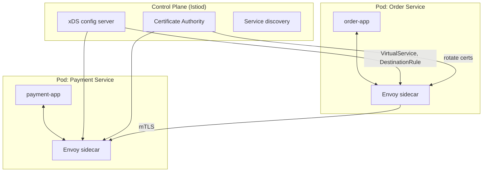
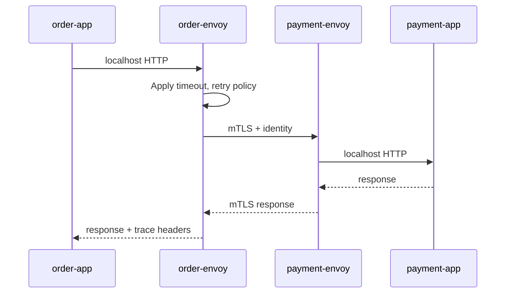
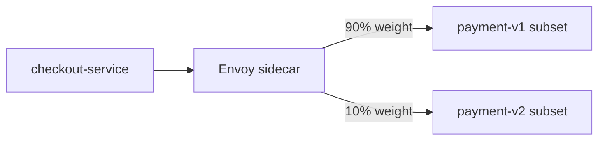

# Service Mesh and Sidecars

## 1. Executive Summary

A **service mesh** is an infrastructure layer that handles **service-to-service communication**—security (mTLS), traffic management (routing, retries, timeouts), and observability (metrics, traces)—without embedding all logic in application code. The dominant deployment model uses **sidecar proxies** (typically **Envoy**) colocated with each workload pod, controlled by a **control plane** (e.g., **Istio**, **Linkerd**).

Sidecars intercept east-west traffic via **iptables/eBPF redirection**, applying policies consistently across polyglot services. The tradeoff is **operational complexity**, **latency overhead**, and **resource cost**—justified at scale when many teams need uniform security and traffic policies without library fragmentation.

This chapter covers mesh architecture, control vs data plane, mTLS identity, traffic splitting, sidecar lifecycle, alternatives (eBPF ambient mesh), and when **not** to adopt a mesh.

## 2. Why This Topic Matters

Principal interviews on microservices platforms expect:

- Clear **control plane vs data plane** separation.
- How **mTLS** works with **SPIFFE** identities—not just "encrypt traffic."
- **Canary/blue-green** at L7 without app changes.
- **Sidecar cost** (memory per pod, startup time).
- **Mesh vs library** (Resilience4j) vs **API gateway** boundary.

Weak answers treat mesh as mandatory for Kubernetes or confuse ingress gateway with full mesh.

## 3. Problems Being Solved

| Problem | Service mesh response |
|---------|----------------------|
| Inconsistent TLS across languages | Sidecar terminates mTLS uniformly |
| Per-team retry/timeout divergence | Central policy via CRDs / xDS |
| Blind east-west traffic | Automatic metrics and distributed tracing headers |
| Canary without redeploying all clients | Weighted routing at proxy |
| Zero-trust networking | Identity per workload, not IP trust |
| Policy audit | Declarative config in GitOps |

Mesh does **not** replace: API design, idempotency, business logic, or north-south edge security alone.

## 4. Assumptions and System Model

| Assumption | Implication |
|------------|-------------|
| **Kubernetes or similar orchestration** | Pods as deployment unit for sidecars |
| **East-west traffic dominates ops concerns** | Mesh ROI higher with many internal calls |
| **Control plane availability critical** | CP outage may block new config—not necessarily data plane traffic |
| **Proxies add latency** | Budget 1–5ms per hop—**verify** workload |
| **Not all traffic through mesh initially** | Opt-in namespaces, gradual rollout |

**Trust model:** Each workload has **X.509 SVID** (SPIFFE); peers verify identity; authorization policies enforce **which service may call which**.

## 5. Essential Terminology

| Term | Definition |
|------|------------|
| **Data plane** | Proxies handling actual request traffic (Envoy) |
| **Control plane** | Config distribution, certs, service discovery (Istiod) |
| **Sidecar** | Proxy container alongside app container in pod |
| **mTLS** | Mutual TLS—both client and server present certificates |
| **SPIFFE/SPIRE** | Workload identity framework and implementation |
| **VirtualService** | Istio L7 routing rules (weights, headers) |
| **DestinationRule** | Subset definitions, TLS mode, load balancing |
| **xDS** | Discovery APIs (CDS, EDS, LDS, RDS) pushing config to Envoy |
| **Ambient mesh** | eBPF-based mesh reducing per-pod sidecars (Istio ambient mode) |
| **Ingress gateway** | North-south entry; distinct from east-west sidecars |

## 6. Core Mechanism

### Control plane and data plane



*Figure 1: Control plane pushes policy and certificates; sidecars enforce on all east-west traffic.*

### Request path through sidecar



*Figure 2: App speaks plain HTTP to localhost; sidecar handles encryption, policy, telemetry.*

### Canary traffic split



*Figure 3: VirtualService weighted routing enables canary without client awareness.*

## 7. Step-by-Step Walkthrough

**Scenario:** Deploy payment service v2 with 10% canary on Istio.

| Step | Action |
|------|--------|
| 1 | Label v2 pods `version: v2` |
| 2 | DestinationRule defines subsets `v1`, `v2` |
| 3 | VirtualService routes 90/10 by weight to subsets |
| 4 | Monitor golden signals on v2 subset |
| 5 | Increase weight 10 → 50 → 100 |
| 6 | Rollback by setting v2 weight to 0—no client redeploy |

**mTLS bootstrap:**

| Step | Component |
|------|-----------|
| 1 | Istiod issues certs to sidecars via SDS |
| 2 | Peer authentication policy enforces STRICT mTLS |
| 3 | AuthorizationPolicy allows `order-service` → `payment-service` only |

**Sidecar resource sizing (production starting points—verify per workload):**

| Component | CPU request | Memory request | Notes |
|-----------|-------------|----------------|-------|
| Envoy sidecar | 100m | 128–256Mi | Increase with WASM filters |
| Istiod (per cluster) | 500m–2 | 1–4Gi | Scales with service count |
| Ingress gateway | 500m–1 | 512Mi–1Gi | Terminates north-south TLS |

Under-provisioned sidecars cause **OOMKill** during traffic spikes—monitor proxy memory separately from app container.

**mTLS migration phases:**

| Phase | PeerAuthentication | Risk |
|-------|-------------------|------|
| 0 | PERMISSIVE (default) | Plaintext still possible |
| 1 | PERMISSIVE + monitor | Identify non-mTLS callers |
| 2 | STRICT per namespace | Break non-injected pods |
| 3 | STRICT cluster-wide | Full east-west encryption |

Never jump to STRICT cluster-wide without namespace pilot validation.

## 8. Invariants and Guarantees

| Property | Type | Statement |
|----------|------|-----------|
| **Policy consistency** | Safety | All meshed traffic subject to same CRD policies |
| **Identity binding** | Safety | Cert SAN matches service account identity |
| **Data plane availability** | Liveness | Existing connections often survive CP brief outage |
| **Zero added latency** | **Not guaranteed** | Proxy hop adds CPU and network cost |
| **Application correctness** | **Not guaranteed** | Mesh does not fix non-idempotent retries |

## 9. Failure Scenarios

### Scenario 1: Control plane outage

**Setup:** Istiod unavailable during upgrade.

**Effect:** New pods may not receive certs/config; existing traffic may continue.

**Mitigation:** HA control plane; cert TTL and grace periods; staged upgrades.

### Scenario 2: Sidecar not ready

**Setup:** App starts before Envoy; traffic sent before proxy ready.

**Effect:** Connection failures or bypass—depends on holdApplicationUntilProxyStarts.

**Mitigation:** Init containers; readiness probe includes sidecar; startup ordering.

### Scenario 3: Retry storm via mesh policy

**Setup:** Mesh retries POST on 503 globally.

**Effect:** Duplicate charges without app idempotency.

**Mitigation:** Disable mesh retries on mutations; idempotency keys; policy per route.

### Scenario 4: Resource exhaustion

**Setup:** 500MB Envoy per pod × 5000 pods.

**Effect:** Cluster memory pressure; scheduling failures.

**Mitigation:** Right-size proxy; ambient/eBPF mode; namespace-scoped mesh only.

### Scenario 5: Observability cardinality explosion

**Setup:** Per-endpoint labels on all metrics.

**Effect:** Prometheus/OOM; expensive monitoring bills.

**Mitigation:** Cardinality limits; aggregate labels; tail sampling for traces.

### Scenario 6: Egress policy blocks mesh control plane

**Setup:** NetworkPolicy denies istiod → sidecar on port 15012 after security hardening.

**Effect:** Certificates expire; mTLS handshake failures cluster-wide.

**Mitigation:** Document required control plane ports; policy review in CI; staging validation before prod NetworkPolicy rollout.

## 10. Performance Characteristics

| Factor | Typical impact |
|--------|----------------|
| Sidecar hop | ~1–3ms latency; CPU for TLS |
| mTLS handshake | Amortized with session resumption |
| HTTP/2 multiplexing | Better connection reuse east-west |
| WASM filters | Flexible; can add significant CPU |
| eBPF ambient | Lower per-pod overhead—**verify** version maturity |

Benchmark **your** payload sizes and QPS—marketing numbers are not transferable.

## 11. Scalability Limits

- Control plane load grows with service count and config churn rate.
- xDS push storms on large fleets—use incremental xDS and config scoping.
- Sidecar memory floor (~50–100MB) limits pod density per node.
- Multi-cluster mesh (multi-primary, primary-remote) adds operational complexity.

## 12. Operational Considerations

- **GitOps** for VirtualService, DestinationRule, PeerAuthentication.
- Version skew policy between control plane and data plane proxies.
- **Upgrade windows** with canary control plane instances.
- Debug tooling: `istioctl proxy-config`, Envoy admin interface (secured).
- **Namespace-level** mesh enablement before cluster-wide.
- Runbooks for sidecar injection failures and cert rotation issues.

**Mesh operational dashboard (minimum panels):**

| Panel | Alert threshold | Action |
|-------|-----------------|--------|
| mTLS handshake failure rate | >0.1% for 5m | Check cert rotation, injection |
| Sidecar proxy memory | >80% limit | Increase limit or investigate leak |
| xDS push latency | p99 >2s | Control plane scaling |
| Outlier ejection count | Sustained >10/min | Investigate destination service |
| AuthorizationPolicy deny rate | Spike >3× baseline | Attack or misconfiguration |

**Upgrade runbook outline:** drain connections → upgrade control plane (one replica at a time) → verify xDS → rolling data plane proxy upgrade → smoke test mTLS between tier-1 services.

## 13. Security Considerations

- **STRICT mTLS** for production east-west; PERMISSIVE only during migration.
- AuthorizationPolicy **deny-by-default** for sensitive services.
- Protect control plane as **tier-0**—compromise enables policy tampering.
- Ingress gateway WAF + mesh mTLS are complementary layers.
- Audit proxy access logs for anomalous cross-service calls.

## 14. Cost Considerations

- Sidecar memory × pod count = significant cluster overhead.
- Control plane nodes and supporting observability backend costs.
- Engineer time for mesh expertise—often underestimated.
- **Ambient mesh** may reduce infra cost; evaluate against maturity needs.

**Decision criterion:** Mesh ROI when **many teams × polyglot services × strict security** exceed platform team capacity for library-based solutions.

## 15. Production Implementations

### Istio

CNCF graduated; Envoy-based; broad feature set; used at Google, IBM, many enterprises.

### Linkerd

Rust micro-proxy (linkerd2-proxy); lighter footprint; opinionated simplicity.

### Consul Connect

HashiCorp mesh integrated with Consul service discovery.

### AWS App Mesh

Managed control plane; Envoy on ECS/EKS.

### Cilium Service Mesh

eBPF-based; kernel-level optimization path.

**Istio operational lessons (common production findings):**

Organizations adopting Istio typically report these patterns—**anecdotal, verify in your context**:

1. **Start with observability only** (mTLS PERMISSIVE, no authz) before STRICT enforcement
2. **Sidecar resource limits** are the #1 cause of unexplained 503s during traffic spikes
3. **AuthorizationPolicy** rollout causes more incidents than mTLS migration
4. **Ingress gateway** is separate capacity planning from east-west mesh
5. **Ambient mode** reduces memory tax but requires newer Istio versions and team upskilling

**Linkerd positioning:** Teams prioritizing simplicity over feature breadth often choose Linkerd for smaller clusters—the Rust micro-proxy has lower memory footprint than Envoy in many benchmarks (**workload-dependent—verify**). Tradeoff: smaller plugin ecosystem vs Istio.

**When mesh is overkill:** If the organization runs fewer than ~15 services in one language with mature Resilience4j/Polly standards and no strict zero-trust mandate, mesh operational cost may exceed benefit for years.

## 16. Alternatives and Tradeoffs

| Approach | Strength | Weakness |
|----------|----------|----------|
| **Library resilience** | No proxy overhead | Inconsistent across languages |
| **API gateway only** | Simple north-south | No east-west visibility |
| **Sidecar mesh** | Uniform policy | Resource + ops cost |
| **Ambient/eBPF mesh** | Lower per-pod cost | Newer; tooling evolving |
| **No mesh (small fleet)** | Simplicity | Manual TLS and policy drift |

Adopt mesh when **east-west policy at scale** is a recurring organizational problem, not because Kubernetes "requires" it.

## 17. Common Misconceptions

| Misconception | Reality |
|---------------|---------|
| "Mesh encrypts everything automatically" | Policies and injection must be configured |
| "Mesh replaces API gateway" | Ingress and east-west serve different roles |
| "Zero latency impact" | Measurable proxy hop exists |
| "Retries are always safe in mesh" | Dangerous on non-idempotent operations |
| "All clusters need Istio day one" | Many succeed with simpler patterns longer |

## 18. Principal Architect Perspective

1. **Golden path:** Platform offers mesh opt-in with documented patterns; not mandatory for 3-service startups.
2. **Policy as code** in Git with review—who can authorize `*` to `payment-service`?
3. **Latency budget** must include mesh hops on critical paths.
4. **Idempotency remains application responsibility**—mesh retries amplify bugs.
5. **Evaluate ambient/eBPF** for new deployments to reduce sidecar tax.

**Mesh vs library decision matrix:**

| Factor | Prefer mesh | Prefer client library |
|--------|-------------|----------------------|
| Language count | 3+ polyglot | Single language (JVM) |
| Team count | 20+ teams | <5 teams |
| Policy uniformity | Mandatory org-wide | Team autonomy OK |
| Latency budget | >5ms headroom per hop | Sub-ms critical path |
| Ops maturity | Dedicated platform SRE | No platform team |

Document decision in ADR—revisit annually as ambient mesh matures.

**Interview tip:** When asked "should we use a service mesh," always answer with **criteria and phased rollout**—never yes/no without organizational and latency context.

## 19. Architecture Review Exercise

**Scenario:** Full Istio strict mTLS on 2000 microservices; global retry=5 on all routes; no authorization policies; Prometheus 2M series.

**Review prompts:**

1. Blast radius of retry policy?
2. mTLS without authorization—sufficient for zero trust?
3. Monitoring cost and cardinality?
4. Remediation priorities?

**Expected findings:** Scope retries; add AuthorizationPolicy; reduce metric labels; cert rotation HA review.

## 20. Whiteboard Explanation

**90-second version:**

> "A service mesh separates communication concerns into sidecar proxies—the data plane—and a control plane that pushes config and certificates. Apps talk to localhost; Envoy intercepts east-west traffic, applies mTLS with workload identities, timeouts, retries, and emits metrics/traces. Istio defines routing with VirtualServices—canary by weight without changing clients. Control plane is Istiod distributing xDS config and acting as CA. Tradeoffs: every pod pays sidecar memory and latency; ops complexity is real. Use when many polyglot services need consistent security and traffic policy. Don't use mesh retries on POST without idempotency. Alternatives include library-based resilience or lighter meshes like Linkerd, and ambient modes reducing sidecars."

**Extended principal addendum:** Mention **organizational readiness**—mesh requires platform SRE ownership, policy review for AuthorizationPolicy changes, and developer education on debugging through sidecars. Without these, mesh adoption creates more incidents than it prevents in the first 6 months.

## 21. Interview Questions

1. **Control vs data plane?**
   - *Signals:* CP config/certs; DP proxies traffic.

2. **How does sidecar intercept traffic?**
   - *Signals:* iptables/eBPF redirect; transparent proxy.

3. **mTLS in mesh?**
   - *Signals:* Both sides present certs; SPIFFE identity.

4. **Canary without client change?**
   - *Signals:* VirtualService weighted subsets.

5. **Mesh vs API gateway?**
   - *Signals:* East-west vs north-south.

6. **Sidecar disadvantages?**
   - *Signals:* Memory, latency, ops, startup ordering.

7. **When NOT use mesh?**
   - *Signals:* Small fleet, few services, strong library discipline.

8. **Control plane down impact?**
   - *Signals:* Existing connections often OK; new config/certs affected.

9. **AuthorizationPolicy purpose?**
   - *Signals:* L7 allow/deny between identities.

10. **Ambient mesh difference?**
    - *Signals:* eBPF path; reduced per-pod sidecar.

11. **xDS protocols?**
    - *Signals:* Dynamic config push to Envoy (CDS, EDS, LDS, RDS).

12. **Retry policy risk?**
    - *Signals:* Non-idempotent amplification.

13. **SPIFFE identity in mesh?**
    - *Signals:* Workload X.509 SVID; not IP-based trust.

14. **Sidecar vs ambient mesh tradeoff?**
    - *Signals:* Per-pod overhead vs eBPF complexity; maturity evaluation.

15. **How debug mTLS handshake failure?**
    - *Signals:* `istioctl authn tls-check`; cert expiry; SAN mismatch.

**Scoring rubric:**

| Dimension | Strong | Weak |
|-----------|--------|------|
| Architecture | CP/DP, identity, routing | "Encrypts microservices" |
| Tradeoffs | Cost, latency, ops | Mesh always good |
| Security | mTLS + authz | mTLS alone = zero trust |

## 22. Interview Follow-Ups

1. **Multi-cluster mesh topologies?**
   - *Signals:* Primary-remote, multi-primary, locality load balancing.

2. **Migrate from PERMISSIVE to STRICT?**
   - *Signals:* Staged namespace rollout; monitor plaintext failures.

3. **Mesh with Kafka/gRPC?**
   - *Signals:* TCP tunneling; protocol detection; some features L7-specific to HTTP.

4. **How reduce sidecar memory on Java workloads?**
   - *Signals:* Right-size proxy; ambient mode; fewer WASM filters; review access log verbosity.

5. **Zero-trust without mesh?**
   - *Signals:* mTLS at app layer, SPIRE, or service-to-service certs—higher per-team burden.

## 23. Strong Answer Example

**Question:** "Should we adopt Istio for 80 microservices?"

> "I'd evaluate east-west call volume, language diversity, and security requirements. With 80 services and 5 languages, library-based TLS is inconsistent—mesh offers uniform mTLS and authz. I'd start namespace-scoped: tier-1 payment and PII services first with STRICT mTLS and deny-by-default AuthorizationPolicy. Platform team runs HA Istiod; GitOps for policies. I'd set proxy resource requests explicitly and budget 2ms per hop on checkout path—if that breaks SLO, keep checkout sync path on optimized gateway aggregation. No global retries—per-route with idempotency review. Pilot 4 weeks measuring p99 latency, memory overhead, and MTTR for traffic shifting. If sidecar tax exceeds 15% cluster memory, evaluate ambient mode. Success: zero plaintext east-west and canary deploys without client changes."

## 24. Weak Answer Example

**Question:** "Should we adopt Istio for 80 microservices?"

> "Yes, Istio is best practice for Kubernetes microservices."

**Why weak:** No tradeoff analysis, rollout plan, cost, or security policy detail.

### Additional strong answer

**Question:** "How do you debug intermittent 503s between meshed services?"

> "I'd start with distributed traces filtered to 503 status—check if failures correlate with specific destination pods or zones. Compare `istioctl proxy-config routes` on source and destination sidecars for subset mismatches. Verify mTLS: `istioctl authn tls-check` from source pod. Check sidecar memory and CPU—OOM restarts cause brief 503 windows. Review recent VirtualService weight changes or DestinationRule subset label drift. If AuthorizationPolicy recently added, confirm source service account is in allow list. Check upstream app readiness—not all 503s are mesh issues. Document findings in incident channel; if sidecar-related, adjust resource limits or fix policy before blaming application code."

## 25. Hands-On Exercise

1. Install Istio or Linkerd on local KinD cluster.
2. Enable automatic sidecar injection for one namespace.
3. Deploy two versions of a service; configure 50/50 traffic split.
4. Enforce STRICT mTLS; verify with `istioctl authn tls-check`.
5. Capture trace from Jaeger/Zipkin across two meshed services.
6. Measure latency with and without sidecar on load test.
7. Document authorization policy allowing only one caller.
8. Compare sidecar memory and p99 latency with mesh disabled on identical load test.
9. Draft mTLS migration runbook from PERMISSIVE to STRICT for one namespace including rollback steps.
10. Present mesh ROI analysis to mock principal panel: include cost, latency, and security benefits quantified where possible.

## 26. Knowledge Check

1. Data plane component? *(Envoy sidecar proxy.)*
2. Canary mechanism in Istio? *(VirtualService weights + DestinationRule subsets.)*
3. Sidecar listens how? *(Transparent redirect from app container.)*
4. mTLS provides? *(Encryption + mutual authentication.)*
5. CP outage typically affects? *(New config/certs more than existing flows.)*
6. VirtualService purpose? *(L7 routing and traffic weights.)*
7. STRICT mTLS mode? *(Encrypted east-west; no plaintext.)*
8. Sidecar memory risk? *(OOMKill if under-provisioned.)*
9. AuthorizationPolicy without mTLS? *(Insufficient for zero trust.)*
10. Ambient mesh benefit? *(Reduced per-pod proxy overhead.)*

## 27. Flashcards

| # | Front | Back |
|---|-------|------|
| 1 | Service mesh | Infrastructure layer for service-to-service comms. |
| 2 | Sidecar | Colocated proxy intercepting pod traffic. |
| 3 | Control plane | Config, certs, discovery (e.g., Istiod). |
| 4 | Data plane | Proxies handling actual requests (Envoy). |
| 5 | mTLS | Mutual TLS with both peer certificates. |
| 6 | VirtualService | L7 routing rules in Istio. |
| 7 | DestinationRule | Subsets, TLS mode, load balancing policy. |
| 8 | SPIFFE | Workload identity standard. |
| 9 | xDS | Envoy dynamic configuration APIs. |
| 10 | Ambient mesh | eBPF-based mesh reducing sidecars. |

## 28. Cheat Sheet

```
ARCHITECTURE
  App → localhost → Sidecar (Envoy) → mTLS → Peer sidecar → App

ISTIO KEY CRDs
  VirtualService — routing, weights, faults
  DestinationRule — subsets, TLS, LB
  PeerAuthentication — mTLS mode
  AuthorizationPolicy — allow/deny by identity

ROLLOUT
  Namespace opt-in → PERMISSIVE → STRICT
  Canary via subset weights

COSTS
  ~50-100MB RAM per sidecar
  ~1-3ms latency per hop
  CP HA required

DON'T
  Global retry on POST
  Mesh day-1 for tiny fleets
  Skip authorization with mTLS only
```

## 29. Related Concepts

- [Resilience Patterns](/docs/microservices/resilience-patterns) — retries, breakers (app vs mesh)
- [Kubernetes Architecture](/docs/kubernetes-and-platform-engineering/kubernetes-architecture) — pod networking foundation
- [Platform Engineering and GitOps](/docs/kubernetes-and-platform-engineering/platform-engineering-and-gitops) — mesh policy delivery
- [Security Architecture Fundamentals](/docs/security/security-architecture-fundamentals) — zero-trust context
- [Observability Fundamentals](/docs/observability/observability-fundamentals) — mesh-generated telemetry
- [SLOs, SLIs, and Error Budgets](/docs/reliability-and-resilience/slo-sli-error-budgets) — latency budget impact

These topics interconnect in production platform design: Kubernetes provides the compute substrate; GitOps delivers mesh policies; resilience patterns remain application responsibility even with Istio retries; observability validates all layers under chaos and DR exercises.

## 30. References

### Primary sources

- Istio Documentation — [Architecture](https://istio.io/latest/docs/ops/deployment/architecture/), [Security](https://istio.io/latest/docs/concepts/security/).
- Envoy Proxy Documentation — [Introduction](https://www.envoyproxy.io/docs/envoy/latest/intro/intro).
- SPIFFE Specification — [spiffe.io](https://spiffe.io/docs/latest/spiffe-about/overview/).

### Engineering blogs

- Buoyant (Linkerd) — sidecar vs ambient comparisons (**vendor perspective—verify claims**).
- Google Cloud — Istio on GKE operational guides.

### Distinction

| Claim type | Source |
|------------|--------|
| mTLS, xDS, SPIFFE | Official Istio/Envoy/SPIFFE specs |
| Latency overhead | Workload-dependent—benchmark required |
| Ambient mesh benefits | Vendor docs and early adopter reports |
