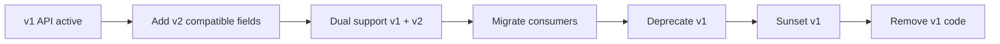
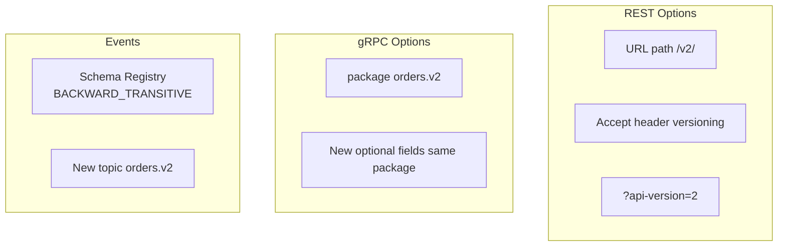
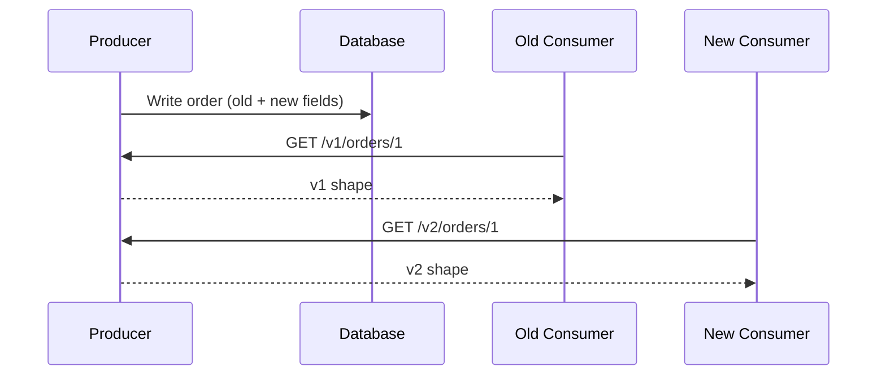

# API Versioning and Evolution

## 1. Executive Summary

**API versioning** is how systems evolve public and internal contracts without breaking dependents. Strategies span **URL versioning** (`/v2/orders`), **header versioning** (`Accept: application/vnd.company.v2+json`), **package versioning** (gRPC `package orders.v2`), and **schema compatibility** (protobuf field rules, Avro BACKWARD mode). The deepest principle is **expand-contract, shrink-implementation**: add compatible changes first, migrate consumers, then remove deprecated surfaces.

Breaking changes are **organizational events**—they require deprecation timelines, communication, dual-write/dual-read migrations, and monitoring of stale clients. Principal architects treat APIs as **long-lived products** with SLAs, not as implementation details.

This chapter covers versioning strategies, compatibility matrices, deprecation workflows, consumer-driven contracts, event schema evolution, and failure modes of forced upgrades.

## 2. Why This Topic Matters

API evolution questions test production maturity:

- Difference between **backward** and **forward** compatibility.
- How to remove a field without downtime.
- **Expand-contract** migration for REST and events.
- When **URL /v2/** is justified vs header negotiation.
- Coordinating **mobile clients** you cannot force-upgrade instantly.

Candidates who say "just deploy breaking change over weekend" fail principal bar.

## 3. Problems Being Solved

| Problem | Versioning approach |
|---------|---------------------|
| Add new optional capability | Backward-compatible schema extension |
| Rename concept | Add new field; deprecate old; dual-publish |
| Change behavior semantically | New version or new resource |
| Unknown client mix | Telemetry on API usage by version |
| Event consumers lag producers | Schema registry compatibility modes |
| Partner slow to migrate | Long sunset periods + communication |

Versioning does **not** eliminate need for **integration tests** and **contract verification**.

## 4. Assumptions and System Model

| Assumption | Implication |
|------------|-------------|
| **Clients cannot upgrade atomically** | Mobile, partners, multi-region deploy skew |
| **Producers deploy before all consumers update** | Default rolling deploy order |
| **Events are immutable history** | Schema evolution stricter than sync APIs |
| **Documentation is contract** | Undocumented behavior becomes dependency |
| **Deprecation is policy** | Legal/SLA timelines for partners |

**Lifecycle:** Introduce → document → monitor adoption → deprecate → sunset → remove.

## 5. Essential Terminology

| Term | Definition |
|------|------------|
| **Backward compatible** | New schema read by old consumers |
| **Forward compatible** | Old schema read by new consumers |
| **Full compatible** | Both directions |
| **Breaking change** | Old clients fail on new producer or vice versa |
| **Expand-contract** | Add new API; migrate; remove old |
| **Sunset header** | HTTP `Sunset` RFC 8594 deprecation date |
| **Schema registry** | Central store with compatibility enforcement (Confluent, Buf) |
| **Consumer-driven contract** | Consumers define expectations; providers verify |
| **Dual write** | Write both old and new formats during migration |
| **Strangler API** | Route traffic gradually to new implementation |

## 6. Core Mechanism

### API evolution lifecycle



*Figure 1: Expand-contract lifecycle—never remove until adoption metrics clear threshold.*

### Versioning strategy placement



*Figure 2: Style-specific versioning mechanisms—often combined within one organization.*

### Consumer migration with dual read



*Figure 3: Producer serves both shapes during migration; storage may hold superset fields.*

## 7. Step-by-Step Walkthrough

**Scenario:** Rename `customer_id` to `account_id` in Order API.

| Phase | Action |
|-------|--------|
| 1 | Add `account_id` alongside `customer_id` (same value) |
| 2 | Document `customer_id` deprecated; `Sunset` header 6 months |
| 3 | Monitor: % requests using only `customer_id` in responses |
| 4 | Update internal consumers to `account_id` |
| 5 | Partner comms with migration guide |
| 6 | Stop populating `customer_id` in v2; v1 shim maps back |
| 7 | Remove v1 after sunset |

**Protobuf event evolution:**

| Step | Rule |
|------|------|
| Add field `account_id = 8` | Old consumers ignore unknown field |
| Mark `customer_id` deprecated in comments | Human process |
| Never reuse field number 5 | Prevents corruption |

**Schema registry compatibility modes (Confluent semantics):**

| Mode | New schema can... | Old consumer can read new data? |
|------|-------------------|--------------------------------|
| BACKWARD | Add fields, delete optional | Yes (default for consumers) |
| FORWARD | Delete fields, add optional | New consumer reads old data |
| FULL | Both directions | Both |
| BACKWARD_TRANSITIVE | All previous versions | Safer for long consumer tail |

For Kafka event pipelines, **BACKWARD** is the most common default—new producers must not remove required fields without coordinated migration.

**Mobile client versioning strategy:**

| Approach | Mechanism | Tradeoff |
|----------|-----------|----------|
| Min supported version | API returns 426 Upgrade Required | Forces upgrade; revenue risk |
| Parallel API versions | `/v1` and `/v2` coexist | Maintenance burden |
| Feature flags in app | Server adapts to app version header | Complex server logic |
| Additive-only API | Never break; deprecate fields | Discipline required |

Most consumer apps have **long tails**—plan for 6–12 months of old client support for field removals.

## 8. Invariants and Guarantees

| Property | Type | Statement |
|----------|------|-----------|
| **Backward compat on rolling deploy** | Safety | New producer does not break old consumer (default goal) |
| **Field number immutability** | Safety | Protobuf field numbers never reused |
| **Deprecation notice** | Policy | Documented timeline before removal |
| **Instant global upgrade** | **Not assumed** | Mobile/partners lag weeks to months |
| **Semantic versioning alone** | **Insufficient** | URL v2 with same semantics still confuses |

## 9. Failure Scenarios

### Scenario 1: Breaking JSON field type change

**Setup:** `total` changed from string to number.

**Effect:** Strictly typed clients parse fail; subtle bugs in loose clients.

**Mitigation:** New field `total_cents` int; deprecate string.

### Scenario 2: Forced mobile upgrade

**Setup:** Backend drops v1 with 40% users on old app.

**Effect:** Revenue loss; app store review delay.

**Mitigation:** Minimum version enforcement gradual; feature degrade not hard fail.

### Scenario 3: Event schema incompatible

**Setup:** Avro reader schema incompatible with writer.

**Effect:** Consumer crash loop; Kafka lag.

**Mitigation:** Schema registry BACKWARD; test compatibility in CI.

### Scenario 4: Silent semantic change

**Setup:** `status=pending` now means different business state.

**Effect:** Logic bugs without version bump.

**Mitigation:** New enum value; document; version if needed.

### Scenario 5: Version explosion

**Setup:** Each team ships `/v3`, `/v4` without removing old.

**Effect:** Maintenance nightmare; security patch burden.

**Mitigation:** Max supported versions policy (e.g., N and N-1).

### Scenario 6: Undocumented response field becomes dependency

**Setup:** Partner integrates undocumented `internal_metadata` field; team removes it in patch release.

**Effect:** Partner outage; contractual dispute.

**Mitigation:** OpenAPI documents all response fields; undocumented fields explicitly unstable; partner sandbox contract tests.

## 10. Performance Characteristics

| Approach | Overhead |
|----------|----------|
| Dual write | 2× write latency during migration |
| Adapter layers | CPU for shape translation |
| Multiple major versions | Code branches; test matrix explosion |
| Schema registry check | Small produce/consume latency |

Minimize parallel versions supported—**operational cost** dominates.

## 11. Scalability Limits

- Partner count lengthens deprecation minimums.
- Mobile long tail extends v1 support years sometimes.
- Event topics per version multiply storage and consumer ops.
- Contract test matrix grows with versions × consumers.

At organizations with 50+ API consumers, consider a **dedicated API platform team** owning gateway, schema registry, and deprecation policy—decentralizing versioning governance does not scale past roughly two dozen dependent teams (**organizational heuristic—verify for your context**).

**Deprecation velocity benchmark:** Healthy API programs sunset major versions no faster than one per year for external partners—faster internal iteration is fine but public contracts require longer tails.

Treat every public field and event schema as a **multi-year commitment** unless explicitly marked experimental in documentation and telemetry.

Partner APIs with contractual SLAs may require **12–24 month deprecation minimums**—verify legal agreements before announcing sunset dates in engineering channels alone.

Internal services are not exempt from versioning discipline—deploy skew between 40 microservices means internal APIs need the same expand-contract rigor as public partners.

Schema registry compatibility checks should run on **every** producer deploy in CI—not only on schema registration—to catch breaking changes before they reach integration environments.

When interviewing, walk through a **concrete field rename** with timeline—abstract versioning theory without migration steps scores lower than structured expand-contract narratives.

Protobuf `reserved` keyword and Avro field aliases serve the same purpose—prevent field number and name reuse after deprecation.

Consumer-driven contract tests should block deploy when any registered consumer would break on the proposed producer change.

## 12. Operational Considerations

- **Usage metrics** by API version, client ID, User-Agent.
- **Automated compatibility checks** in CI (Buf, openapi-diff).
- **Changelog** and migration guides per version.
- **Feature flags** for new behavior within same version when safe.
- **Runbooks** for emergency rollback to previous version deployment.

**Deprecation communications template (partner-facing):**

1. **T-180 days:** Announcement with timeline and migration guide
2. **T-90 days:** Developer portal banner; optional webinar
3. **T-30 days:** Direct outreach to high-volume integrators on old version
4. **T-7 days:** Final warning with support escalation path
5. **T-0:** Sunset; return `410 Gone` with v2 documentation link

Track partner readiness in ticketing—engineering visibility into business relationship risk during migrations.

## 13. Security Considerations

- Old API versions may lack new auth controls—**sunset aggressively** for security fixes.
- Deprecated endpoints still attack surface—monitor and rate limit.
- Version negotiation must not bypass authorization.
- Event schema changes exposing PII require privacy review.

## 14. Cost Considerations

- Supporting N versions multiplies test and engineering cost.
- Dual-write migrations increase database and egress load temporarily.
- Partner migration support is **customer success** cost.
- Schema registry and contract testing tooling OpEx.

## 15. Production Implementations

### Stripe API versioning

Date-based API versions pinned per account—**implementation choice** widely cited.

### Google Cloud APIs

Major version in path (`v1`, `v2`); long deprecation periods documented.

### Confluent Schema Registry

Compatibility modes enforced on register.

### Buf

Protobuf linting and breaking change detection in CI.

**Stripe-style date versioning (deep dive):**

Stripe pins each account to an API version at account creation; requests can override with `Stripe-Version` header. Benefits: no URL proliferation; predictable partner experience. Costs: testing matrix across versions; code paths for historical behavior. This model suits **API-as-product** businesses with long-lived partner integrations—not every internal microservice API needs this sophistication.

**Pact consumer-driven contracts (workflow):**

1. Consumer writes pact file defining expected request/response
2. Pact Broker stores contracts
3. Provider CI verifies against all consumer pacts before deploy
4. `can-i-deploy` checks compatibility gate

This catches breaking changes **before** integration environments—especially valuable when 20+ consumers depend on one event schema or REST resource.

## 16. Alternatives and Tradeoffs

| Strategy | Pro | Con |
|----------|-----|-----|
| URL `/v2/` | Explicit, cache-friendly | URL proliferation |
| Header versioning | Clean URLs | Harder to test/debug |
| Same URL additive only | Simplest ops | Cannot fix past mistakes |
| New topic for events | Clean separation | Consumer duplication |
| GraphQL `@deprecated` | Schema-level | Clients may ignore |

Prefer **additive evolution** within major version; new major for true breaks.

## 17. Common Misconceptions

| Misconception | Reality |
|---------------|---------|
| "Semver fixes versioning" | APIs need consumer-centric compatibility rules |
| "Breaking change OK internal" | Internal clients also deploy asynchronously |
| "Delete unused field safely" | Unknown clients may still parse |
| "GraphQL needs no versioning" | Schema evolution still required |
| "Events are schemaless JSON" | Producers still impose implicit contracts |

## 18. Principal Architect Perspective

1. **Default to backward-compatible changes**—breaking is last resort with ADR.
2. **Measure client adoption** before sunset—not calendar alone.
3. **Events: registry enforced**—no ad hoc JSON in Kafka at scale.
4. **Partners get longer timelines** than internal services.
5. **One owner per API product** approves deprecation.

**API product ownership model:**

| Role | Responsibility |
|------|----------------|
| API product owner | Roadmap, deprecation approval, partner comms |
| Engineering team | Implementation, SLA, on-call |
| Platform team | Gateway, rate limits, schema registry ops |
| Security | Auth model review, penetration test scope |

Deprecation requires **product owner sign-off**—not unilateral engineer decision.

**Principal framing:** Versioning is a **product management** problem disguised as engineering. Always mention partner communication timelines and usage metrics before technical migration steps in interviews.

Expand-contract migrations typically take **3–6 months** for external APIs with partner ecosystems—internal-only APIs may move faster but still require consumer lag analysis.

## 19. Architecture Review Exercise

**Scenario:** 4 major REST versions live; no usage metrics; events use JSON without schema; mobile pinned to v1 from 2019.

**Review prompts:**

1. Risk of security patch on v1?
2. Event consumer failure modes?
3. 12-month remediation plan?

**Expected findings:** Usage telemetry, collapse to 2 versions, schema registry, partner comms, mobile min version strategy.

## 20. Whiteboard Explanation

**90-second version:**

> "APIs evolve by additive compatible changes first—new optional fields, not type changes. For REST I prefer explicit major versions in URL or pinned date versions for partners, with Sunset headers and migration guides. gRPC and protobuf use new fields with reserved numbers; Buf blocks breaking changes in CI. Events need schema registry with BACKWARD compatibility so new producers don't break old consumers. Migration pattern: expand-contract—dual write or dual response shapes, migrate consumers, deprecate, sunset, remove. Never break mobile without telemetry proving adoption. Breaking changes are organizational projects, not deploy details."

**Extended principal addendum:** Quantify **consumer lag**—internal services may deploy daily but mobile apps and partners lag weeks. Sunset dates must account for slowest consumer, not fastest team.

## 21. Interview Questions

1. **Backward vs forward compatibility?**
   - *Signals:* Old/new consumer-producer pairing definitions.

2. **Safe protobuf change?**
   - *Signals:* Add optional; reserve numbers; no retype.

3. **URL vs header versioning?**
   - *Signals:* Explicitness vs clean URLs; caching implications.

4. **How deprecate REST field?**
   - *Signals:* Add replacement, document, Sunset, metrics, remove.

5. **Event schema evolution?**
   - *Signals:* Registry, compatibility mode, new topic if needed.

6. **Expand-contract pattern?**
   - *Signals:* Add v2, migrate, remove v1.

7. **When new major version justified?**
   - *Signals:* Incompatible model change; cannot shim.

8. **Consumer-driven contracts?**
   - *Signals:* Pact; consumers define expected interactions.

9. **Mobile long tail handling?**
   - *Signals:* Min version, graceful degrade, extended v1 support.

10. **Semantic change without field change?**
    - *Signals:* Dangerous; new enum or version bump.

11. **GraphQL versioning approach?**
    - *Signals:* Schema evolution, `@deprecated`, avoid breaking removes.

12. **Max versions policy?**
    - *Signals:* N and N-1; reduce operational burden.

13. **Avro vs Protobuf for events?**
    - *Signals:* Registry ecosystem; schema evolution rules; tooling fit.

14. **Emergency break-glass API change?**
    - *Signals:* Security hotfix path; expedited review; partner notification.

15. **Contract test in CI failure blocks deploy?**
    - *Signals:* Yes for tier-1; consumer-driven contracts prevent drift.

**Scoring rubric:**

| Dimension | Strong | Weak |
|-----------|--------|------|
| Compatibility | Directional definitions, protobuf rules | "Use v2" only |
| Migration | Dual support, metrics, sunset | Big-bang break |
| Events | Registry modes | "JSON is flexible" |

## 22. Interview Follow-Ups

1. **Stripe-style date versioning pros/cons?**
   - *Signals:* Per-account pin; predictable; complex testing matrix.

2. **Breaking gRPC package vs new service?**
   - *Signals:* New package for true break; same service additive fields.

3. **Rollback with schema change deployed?**
   - *Signals:* Forward compatibility needed for rollback safety.

4. **How version internal gRPC vs public REST independently?**
   - *Signals:* Internal can evolve faster with protobuf additive rules; public needs deprecation policy.

5. **Event topic versioning vs schema evolution?**
   - *Signals:* Prefer schema evolution; new topic only for incompatible model break.

## 23. Strong Answer Example

**Question:** "We need to change order status enum—add `ON_HOLD`, remove `PENDING_PAYMENT`."

> "Removing `PENDING_PAYMENT` is breaking—I'd check telemetry for any clients still sending or displaying it. I'd add `ON_HOLD` immediately as backward-compatible. Map `PENDING_PAYMENT` to new semantics in API layer for 90 days with deprecation notice. If removal required, bump to v2 resource or version header where `PENDING_PAYMENT` returns 400 with migration doc link. Events: add `ON_HOLD` to Avro enum with BACKWARD compatibility if consumers ignore unknowns—or use string status with documented values. Dual-publish both statuses in events during migration. Sunset only when <0.1% traffic uses old value for 30 days."

## 24. Weak Answer Example

**Question:** "We need to change order status enum."

> "Update the enum and deploy Friday night."

**Why weak:** No compatibility analysis, migration, or consumer lag consideration.

### Additional strong answer

**Question:** "We need to split monolith Order API into microservice—how handle versioning during strangler?"

> "During strangler, gateway routes `/orders/*` to monolith or new service by feature flag—not by URL version initially. Both implementations must accept same v1 contract. New service adds fields as optional protobuf extensions. Consumers migrate via feature flag per team. When 95% traffic on new service for 30 days, announce v1 sunset for monolith path only. Maintain single OpenAPI spec with both backends validated in contract tests. Events use schema registry—monolith and microservice publish same `OrderPlaced` schema during dual-write phase. Never break mobile: min app version check only after metrics prove adoption."

## 25. Hands-On Exercise

1. Add optional protobuf field; verify old client still works.
2. Run Buf breaking check on intentional break; fix with reservation.
3. Implement REST Sunset header and deprecation warning in responses.
4. Configure Schema Registry BACKWARD mode; test incompatible registration fail.
5. Write Pact consumer test; verify provider in CI.
6. Build dashboard query for API version usage from access logs.
7. Simulate partner still on deprecated field at sunset; document communication and technical response.
8. Configure Confluent Schema Registry or Buf Schema Registry with BACKWARD mode; test incompatible write rejection.
9. Write expand-contract migration plan for renaming a core resource field with 6-month timeline.

## 26. Knowledge Check

1. Backward compatible means? *(New producer, old consumer works.)*
2. Protobuf field number reuse? *(Never—corrupts data.)*
3. Expand-contract first step? *(Add without removing.)*
4. Sunset header purpose? *(Communicate deprecation date.)*
5. Event registry BACKWARD mode? *(New schema readable by old consumers.)*
6. Pact verifies what? *(Provider meets consumer expectations.)*
7. Dual write during migration? *(Write old and new formats.)*
8. Mobile long tail implies? *(Extended v1 support.)*
9. Major version trigger? *(Incompatible model change.)*
10. Stripe-style versioning pins? *(Per-account API version.)*

## 27. Flashcards

| # | Front | Back |
|---|-------|------|
| 1 | Backward compatible | New producer does not break old consumer. |
| 2 | Forward compatible | Old producer works with new consumer. |
| 3 | Expand-contract | Add, migrate, deprecate, remove pattern. |
| 4 | Breaking change | Incompatible contract change. |
| 5 | Sunset header | HTTP deprecation date (RFC 8594). |
| 6 | Schema registry | Enforces event/API schema compatibility. |
| 7 | Field reservation | Protobuf retired number marked reserved. |
| 8 | Consumer-driven contract | Tests defined by API consumer. |
| 9 | Dual write | Migration writing both old and new formats. |
| 10 | Major version | Breaking or model-level API change. |

## 28. Cheat Sheet

```
DEFAULT
  Additive changes only
  CI breaking-change detection

REST
  /v2/ or Accept header
  Sunset + Deprecation headers
  Usage metrics before removal

PROTOBUF
  Add optional fields
  Reserve deleted numbers
  Buf breaking checks in CI

EVENTS
  Schema registry BACKWARD
  New topic if incompatible

NEVER
  Change field types
  Reuse field numbers
  Remove without sunset metrics
```

## 29. Related Concepts

- [REST, gRPC, and GraphQL](/docs/api-and-integration-architecture/rest-grpc-and-graphql) — API styles and contracts
- [Event-Driven Architecture](/docs/messaging-and-streaming/event-driven-architecture) — event schema governance
- [Kafka Architecture](/docs/messaging-and-streaming/kafka-architecture) — Schema Registry integration
- [Service Decomposition and DDD](/docs/microservices/service-decomposition-and-ddd) — bounded context API ownership
- [Architecture Decision Records](/docs/architecture-leadership/architecture-decision-records) — versioning decisions
- [Transactional Outbox](/docs/transactions/transactional-outbox) — event payload evolution

Versioning discipline applies equally to synchronous APIs and asynchronous events—organizations that excel at one but neglect the other still suffer production breaks at integration boundaries during rolling deploys.

## 30. References

### Primary sources

- Newman, S. (2021). *Building Microservices*, 2nd ed. — API versioning chapters.
- Protocol Buffers Language Guide — [field presence and evolution](https://protobuf.dev/programming-guides/proto3/).
- RFC 8594 — The Sunset HTTP Header Field.

### Engineering blogs

- Stripe API versioning — [stripe.com/blog/api-versioning](https://stripe.com/blog/api-versioning) (**implementation narrative**).
- Confluent — Schema Registry compatibility types documentation.

### Distinction

| Claim type | Source |
|------------|--------|
| Compatibility definitions | Protobuf spec; Confluent docs |
| Sunset header | RFC 8594 |
| Stripe versioning model | Stripe engineering blog — **one vendor approach** |
