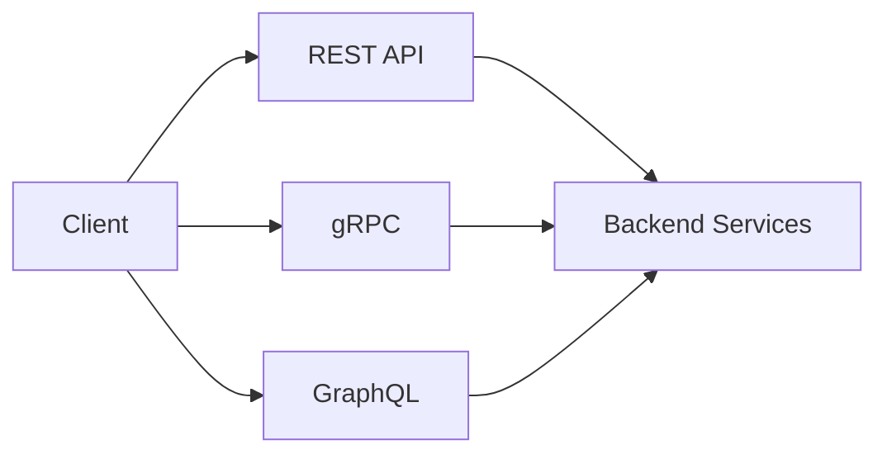

# API and Integration Architecture

REST, gRPC, GraphQL, async APIs, and integration patterns.

*Figure: API style tradeoffs — REST, gRPC, and GraphQL integration patterns.*

## Chapters

| Chapter | Focus |
|---------|-------|
| REST, gRPC, and GraphQL | [REST, gRPC, and GraphQL](/docs/api-and-integration-architecture/rest-grpc-and-graphql) |
| API Versioning and Evolution | [API Versioning and Evolution](/docs/api-and-integration-architecture/api-versioning-and-evolution) |

## Learning Path

1. Start with **REST, gRPC, and GraphQL** to compare protocol tradeoffs for internal and external APIs.
2. Finish with **API Versioning and Evolution** for backward compatibility and deprecation strategies.

## Related Domains

- [Microservices](/docs/microservices/overview)
- [System Design](/docs/system-design/overview)

Return to the [Curriculum Overview](/docs/start-here/curriculum-overview) to see how this domain fits the learning path.
