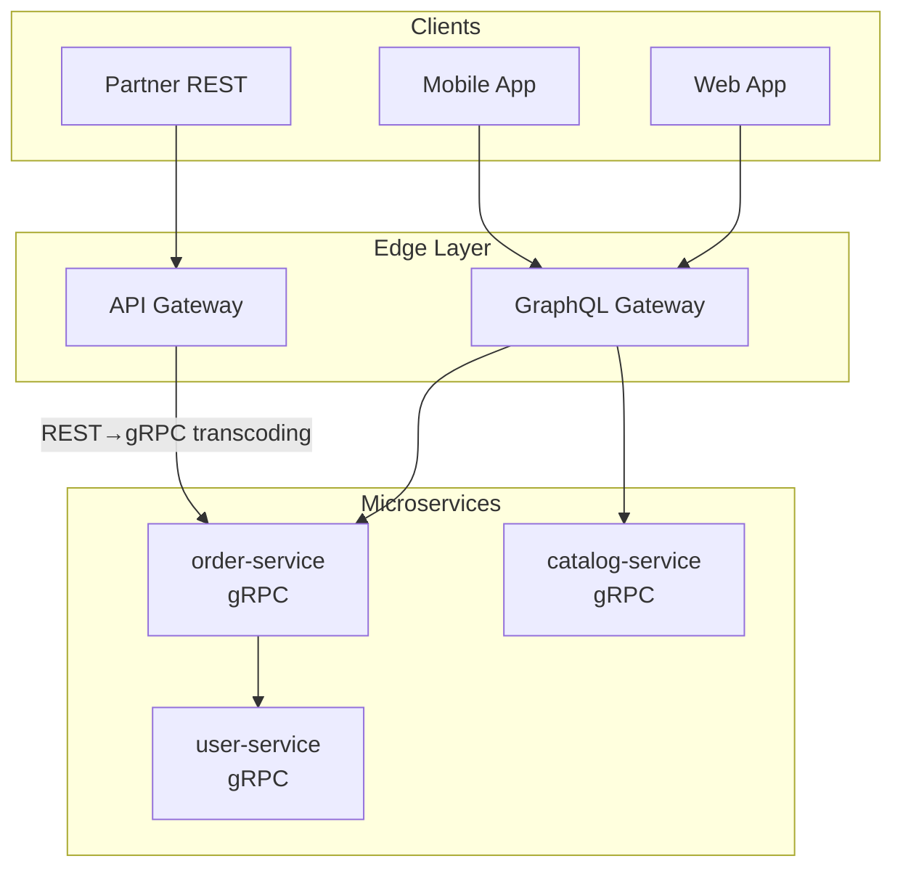
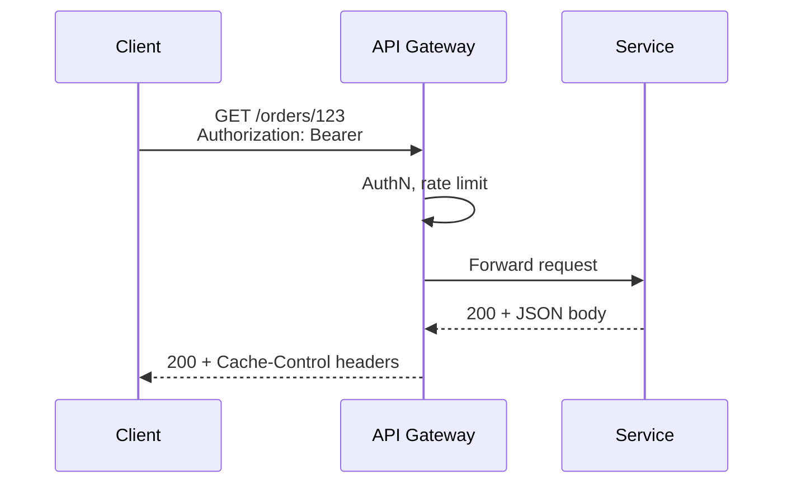
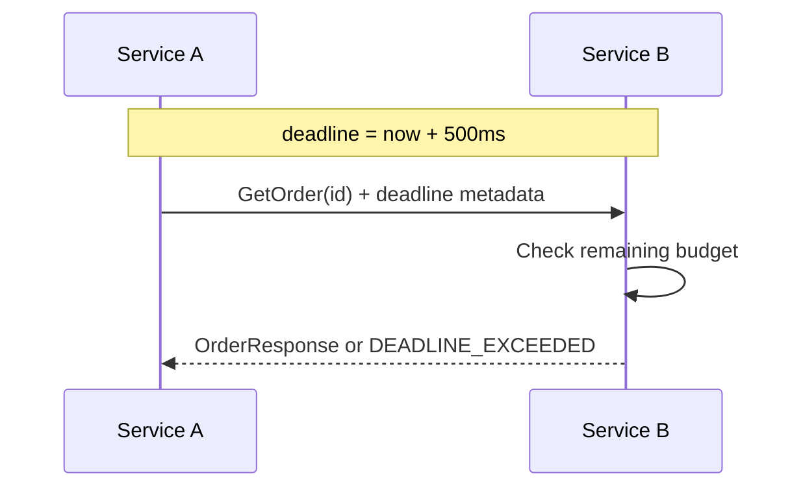

# REST, gRPC, and GraphQL

## 1. Executive Summary

**REST** (Representational State Transfer over HTTP) models resources with verbs and status codes—ubiquitous, cache-friendly, and human-debuggable. **gRPC** uses **Protocol Buffers** over **HTTP/2** for strongly typed, bidirectional streaming RPC with efficient binary serialization—dominant for internal service-to-service calls. **GraphQL** provides a **schema-driven query language** where clients request exactly the fields they need—excellent for aggregating multiple backends behind a single API for diverse clients.

No single style wins everywhere. Principal architects choose based on **client diversity**, **latency budgets**, **evolution constraints**, **caching needs**, and **team skill**. Hybrid architectures are normal: REST/GraphQL at the edge, gRPC east-west, events for async integration.

This chapter compares mechanisms, guarantees, failure modes, performance, security, versioning implications, and interview-level API design reasoning.

## 2. Why This Topic Matters

API style questions separate architects who understand **tradeoffs** from those who advocate one technology:

- When is GraphQL's flexibility a **performance liability** (N+1 queries)?
- How do **gRPC deadlines** propagate vs REST timeouts?
- REST **idempotency** with `PUT` vs `POST` vs `PATCH`.
- **Protobuf backward compatibility** rules for rolling deploys.
- **BFF pattern** vs GraphQL vs REST aggregation.

Interviewers probe system design with "design the public API" and "how do mobile and web share backends."

## 3. Problems Being Solved

| Problem | API style fit |
|---------|---------------|
| Public HTTP integration | REST (OpenAPI), widest tooling |
| Low-latency internal RPC | gRPC + protobuf |
| Mobile clients with varied data needs | GraphQL or BFF |
| Streaming / long-lived connections | gRPC streaming, WebSockets |
| Strong contracts + codegen | gRPC, GraphQL schema |
| CDN/HTTP caching of reads | REST with cache headers |
| Polyglot microservices | gRPC with generated stubs |

None eliminates need for **authentication**, **rate limiting**, **versioning**, and **observability**.

## 4. Assumptions and System Model

| Assumption | Implication |
|------------|-------------|
| **Clients have different needs** | One API rarely fits all without aggregation layer |
| **Network is unreliable** | Deadlines, timeouts, idempotency required |
| **Schemas evolve** | Backward-compatible changes only without coordination |
| **Browser clients** | gRPC requires grpc-web proxy; REST/GraphQL native |
| **Not all operations are CRUD** | RPC models commands explicitly |

**Integration topology:** External clients → API gateway / GraphQL gateway → REST or gRPC microservices → databases/events.

## 5. Essential Terminology

| Term | Definition |
|------|------------|
| **REST** | Architectural style: resources, HTTP methods, stateless |
| **OpenAPI** | Machine-readable REST API specification |
| **gRPC** | RPC framework using protobuf over HTTP/2 |
| **Protobuf** | Binary serialization with schema evolution rules |
| **GraphQL** | Query language + runtime executing against schema |
| **Resolver** | GraphQL function fetching field data |
| **BFF** | Backend-for-Frontend tailored API per client type |
| **HTTP/2** | Multiplexed streams; header compression |
| **Deadline** | gRPC propagated timeout budget |
| **N+1 problem** | GraphQL resolvers causing one query per child entity |

## 6. Core Mechanism

### Style comparison architecture



*Figure 1: Hybrid topology—GraphQL for flexible clients, REST for partners, gRPC internally.*

### REST request lifecycle



*Figure 2: REST leverages HTTP semantics—caching, status codes, standard verbs.*

### gRPC call with deadline



*Figure 3: gRPC propagates cancellation—child calls must respect parent deadline.*

### GraphQL query execution

Client sends single query; server resolves fields—risk of N+1 without **DataLoader** batching:

```
query {
  user(id: "1") {
    name
    orders { id total }
  }
}
```

Resolver for `orders` may fan out to order-service per user—batch loaders collapse to one RPC.

## 7. Step-by-Step Walkthrough

**Scenario:** Product page needs user, recommendations, and inventory.

| Approach | Flow | Tradeoff |
|----------|------|----------|
| **REST (multiple calls)** | Client calls 3 endpoints | Simple; chatty on mobile |
| **BFF** | One REST `/product-page` aggregates | Per-client duplication |
| **GraphQL** | One query, gateway resolves fields | N+1 risk; query complexity limits |
| **gRPC (internal only)** | BFF calls 3 gRPC services in parallel | Not browser-native |

**Recommended hybrid:** GraphQL or BFF at edge; gRPC between services with parallel calls and shared deadline.

**Protobuf evolution example:**

| Change | Safe? |
|--------|-------|
| Add optional field | Yes (backward compatible) |
| Remove field (reserve number) | Yes with reservation |
| Change field type | No |
| Rename field | No (use new field) |

**API gateway responsibilities vs service responsibilities:**

| Concern | API Gateway | Individual Service |
|---------|-------------|-------------------|
| Authentication (OAuth/OIDC) | Validate JWT, pass claims | Authorize by claim |
| Rate limiting | Per-client/tenant | Per-resource fine-grained |
| TLS termination | North-south | Optional east-west (mesh) |
| Request routing | Path-based to service | Business logic routing |
| Protocol translation | REST ↔ gRPC | Native protocol |
| Caching | Public GET responses | Domain-specific cache |

Duplicating auth logic in every service is an anti-pattern—centralize at gateway, enforce authorization locally.

**gRPC streaming patterns:**

| Pattern | Direction | Use case |
|---------|-----------|----------|
| Unary | Single req/res | Standard RPC |
| Server streaming | One req, many res | Large result sets, live feed |
| Client streaming | Many req, one res | Batch upload |
| Bidirectional | Both | Real-time collaboration |

Streaming requires **flow control** and **deadline** discipline—unbounded streams exhaust memory.

## 8. Invariants and Guarantees

| Property | REST | gRPC | GraphQL |
|----------|------|------|---------|
| **Contract** | OpenAPI (optional) | .proto required | Schema required |
| **Caching** | HTTP native | Limited | Query-level complexity |
| **Streaming** | SSE, chunked | First-class | Subscriptions |
| **Type safety** | Loose (JSON) | Strong | Strong (schema) |
| **Browser support** | Native | grpc-web needed | Native POST |

## 9. Failure Scenarios

### Scenario 1: GraphQL N+1

**Setup:** Resolver per order line hits DB each time.

**Effect:** Latency explosion; DB overload.

**Mitigation:** DataLoader batching; field-level complexity limits; persisted queries.

### Scenario 2: gRPC without deadline

**Setup:** Slow downstream holds threads.

**Effect:** Cascading latency (see resilience patterns).

**Mitigation:** Default deadlines; context propagation.

### Scenario 3: REST over-fetching

**Setup:** Mobile downloads full order object with 50 fields.

**Effect:** Bandwidth and battery waste.

**Mitigation:** Sparse fieldsets, GraphQL, or dedicated mobile endpoints.

### Scenario 4: Breaking protobuf change

**Setup:** Field renumbering deployed before consumers update.

**Effect:** Deserialization errors; production outage.

**Mitigation:** Buf breaking change detection in CI; field reservation.

### Scenario 5: GraphQL query bomb

**Setup:** Deep nested query `user { friends { friends { ... }}}`.

**Effect:** DoS via expensive resolution.

**Mitigation:** Depth/complexity limits; query cost analysis; persisted queries for production.

### Scenario 6: gRPC message size limit exceeded

**Setup:** Service returns 50MB protobuf payload; default 4MB limit.

**Effect:** `RESOURCE_EXHAUSTED` errors; client retries amplify load.

**Mitigation:** Pagination; streaming for large datasets; raise limits coherently client and server; reference storage for blobs.

## 10. Performance Characteristics

| Style | Serialization | Typical use |
|-------|---------------|-------------|
| REST JSON | Human-readable; larger | Public APIs, caching |
| gRPC protobuf | Compact; fast | Internal high-QPS |
| GraphQL | JSON response; variable | Flexible client queries |

HTTP/2 multiplexing benefits gRPC and modern REST servers. **Verify** with benchmarks—JSON with compression narrows gap for some payloads.

## 11. Scalability Limits

- GraphQL gateway CPU scales with query complexity—need horizontal scaling and caching.
- gRPC connection pools per client instance—watch file descriptors.
- REST caching reduces origin load but complicates invalidation.
- OpenAPI spec size and codegen time grow with API surface.

GraphQL gateways at scale often require **federation sharding**—no single node can hold the entire composed schema in memory for very large organizations. Plan horizontal gateway scaling and subgraph ownership boundaries early.

**gRPC load balancing note:** Client-side load balancing with DNS requires **headless Services** or xDS-based resolution—naive DNS round-robin breaks on connection reuse with HTTP/2.

Principal interviews reward naming **specific failure modes**—N+1, message size limits, connection reuse—not just API style preferences.

## 12. Operational Considerations

- **Contract testing** for all styles (Pact, Buf breaking checks).
- **API gateways** for auth, rate limit, transcoding REST↔gRPC.
- **Schema registry** for protobuf and GraphQL federation governance.
- **Documentation:** OpenAPI UI, gRPC reflection, GraphQL playground (dev only).
- **Deprecation headers** and sunset dates for REST; package versioning for gRPC.

**API platform operational checklist:**

| Item | REST | gRPC | GraphQL |
|------|------|------|---------|
| Contract in CI | openapi-diff | Buf breaking | schema check |
| Rate limit config | Gateway per route | Per method | Per operation + depth |
| Dashboard | Latency by route | Latency by method | Complexity score |
| Error budget | Per API product | Per service | Per gateway |
| On-call runbook | 4xx vs 5xx triage | Status code mapping | Query timeout kills |

**Correlation ID propagation:** All styles must forward `traceparent` or `X-Request-ID` across sync and async boundaries—API gateway generates if missing; reject internal calls without correlation in staging to build habit.

## 13. Security Considerations

- OAuth2/OIDC at edge for all public styles.
- gRPC **requires TLS** in production; consider mTLS internal.
- GraphQL introspection disabled in production.
- Input validation at boundary—GraphQL types are not sufficient alone.
- Rate limiting per client and per operation (GraphQL operation name).

## 14. Cost Considerations

- GraphQL gateway compute for complex queries—may exceed simple REST LB cost.
- gRPC reduces egress bytes east-west—savings at high volume.
- Multiple API styles increase **platform team** maintenance—consolidate where possible.
- API gateway managed services (Apigee, Kong Cloud) add OpEx.

## 15. Production Implementations

### Google

Internal Stubby/gRPC origin; public APIs mix REST (Google Cloud JSON) and gRPC.

### Netflix

Falcor (GraphQL-like) historically; extensive REST and custom protocols—**evolution over time**.

### Shopify

Storefront API GraphQL for merchant flexibility; admin REST legacy coexistence.

### Uber

Protobuf/gRPC extensively internal; edge APIs documented for partners.

**Industry adoption patterns (architectural observations):**

| Company pattern | Edge API | Internal | Async |
|---------------|----------|----------|-------|
| Large SaaS | REST OpenAPI + OAuth | gRPC | Kafka events |
| Social/mobile | GraphQL | gRPC/Thrift | Custom pipelines |
| Financial | REST with strict versioning | gRPC mTLS | MQ with schema registry |
| Startups | REST or BFF | REST (early) → gRPC (scale) | Webhooks |

**Connect-RPC (Buf)** deserves evaluation in 2025+ architectures: gRPC-compatible over HTTP/1.1 and HTTP/2 with simpler load balancer compatibility than native gRPC—useful when infrastructure teams resist gRPC ingress complexity. **Verify** current Buf/Connect maturity for your language targets.

**GraphQL federation at scale:** Apollo Federation and GraphQL Mesh enable team-owned subgraphs composed at gateway—aligns with bounded context ownership. Operational cost includes schema composition CI, subgraph deployment coordination, and query plan monitoring.

## 16. Alternatives and Tradeoffs

| When to choose | Style |
|----------------|-------|
| Public partners, caching, simplicity | REST + OpenAPI |
| Internal microservices, streaming | gRPC |
| Many client types, field flexibility | GraphQL + federation |
| Single mobile app | BFF may suffice over GraphQL |
| Event-driven reads | Async APIs + materialized views |

**Anti-pattern:** GraphQL everywhere including simple CRUD internal services—unnecessary complexity.

## 17. Common Misconceptions

| Misconception | Reality |
|---------------|---------|
| "gRPC replaces REST entirely" | Edge often stays REST/HTTP for compatibility |
| "GraphQL = no over-fetching" | Server still fetches; N+1 can worsen |
| "REST cannot perform" | HTTP/2 + good design scales widely |
| "Protobuf = versioning solved" | Discipline still required |
| "One API style for whole company" | Hybrid is normal and healthy |

## 18. Principal Architect Perspective

1. **Edge vs internal** separation—optimize each layer independently.
2. **Schema-first** development with CI breaking checks for gRPC and GraphQL.
3. **Idempotency keys** on REST POST and gRPC idempotent RPCs.
4. **BFF when client count is small**; GraphQL when many diverse clients share gateway.
5. **Document decision criteria** in ADR—avoid religious wars between teams.

**Interview API design checklist (principal-level):**

When designing APIs in system design interviews, explicitly address:

1. **Client types** (mobile, partner, internal) → style per layer
2. **Read vs write ratio** → caching, CQRS consideration
3. **Consistency requirements** → sync vs async integration
4. **Versioning strategy** → additive default, major version triggers
5. **Auth model** → OAuth scopes, mTLS internal
6. **Rate limits and quotas** → per tenant fairness
7. **Idempotency** → keys on mutations
8. **Observability** → correlation IDs, OpenTelemetry propagation

Skipping any of these signals incomplete principal thinking.

**Whiteboard tip:** Draw three boxes—Client, Edge (REST/GraphQL), Internal (gRPC)—before debating technology religion. Interviewers reward layered thinking over single-style advocacy.

## 19. Architecture Review Exercise

**Scenario:** GraphQL gateway calls 15 microservices synchronously per homepage query; no complexity limits; p99 4s.

**Review prompts:**

1. N+1 and fan-out analysis?
2. Caching strategy?
3. Alternative architectures?

**Expected findings:** DataLoader, persisted queries, complexity limits, CDN for static fields, parallel gRPC with deadline, consider BFF caching layer.

## 20. Whiteboard Explanation

**90-second version:**

> "REST models resources over HTTP—great for public APIs, caching, and tooling. gRPC uses protobuf on HTTP/2—typed contracts, efficient, streaming, ideal internal east-west with deadlines. GraphQL lets clients specify fields in one query—powerful for mobile/web diversity but risks N+1 without batching and query cost limits. I typically expose REST or GraphQL at the edge, gRPC inside. Protobuf evolves with additive fields only. Auth and rate limiting sit at gateway. Choose REST for partner simplicity, gRPC for service performance, GraphQL when client data needs diverge sharply—not one size fits all."

**Extended principal addendum:** Always discuss **operational ownership**—who maintains the GraphQL gateway schema, who owns OpenAPI specs, who runs Buf breaking checks. API style without governance becomes integration debt within 18 months at scale.

## 21. Interview Questions

1. **REST vs RPC philosophical difference?**
   - *Signals:* Resources/verbs vs procedures; hypermedia optional.

2. **gRPC advantages internal?**
   - *Signals:* Protobuf, HTTP/2, streaming, codegen, deadlines.

3. **GraphQL N+1 mitigation?**
   - *Signals:* DataLoader, batching, complexity limits.

4. **Protobuf safe evolution?**
   - *Signals:* Add optional fields; reserve numbers; no type change.

5. **When REST over gRPC public?**
   - *Signals:* Browser, caching, ecosystem, debuggability.

6. **BFF vs GraphQL?**
   - *Signals:* BFF per client type; GraphQL shared schema flexibility.

7. **gRPC in browser?**
   - *Signals:* grpc-web + proxy; not native.

8. **Idempotent HTTP methods?**
   - *Signals:* GET, PUT, DELETE; POST not by default.

9. **GraphQL security concerns?**
   - *Signals:* Depth limits, introspection off, auth per field.

10. **HTTP/2 benefit for APIs?**
    - *Signals:* Multiplexing, header compression, single connection.

11. **Design order API—styles?**
    - *Signals:* REST public, gRPC internal, events for notifications.

12. **Streaming use case gRPC vs REST?**
    - *Signals:* Bidirectional streams, live updates; SSE for simpler one-way.

13. **HTTP/3 consideration?**
    - *Signals:* QUIC over UDP; reduced head-of-line blocking; adoption maturity.

14. **API composition vs GraphQL?**
    - *Signals:* BFF aggregates known views; GraphQL flexible client queries.

15. **Protobuf unknown field handling?**
    - *Signals:* Preserved for forward compatibility; parsers must not reject.

**Scoring rubric:**

| Dimension | Strong | Weak |
|-----------|--------|------|
| Tradeoffs | Per-layer style choice | One style evangelism |
| Performance | N+1, protobuf, caching | "gRPC is faster" only |
| Evolution | Schema compatibility | Ignore versioning |

## 22. Interview Follow-Ups

1. **GraphQL federation vs monolith schema?**
   - *Signals:* Subgraphs per team; gateway composition.

2. **REST HATEOAS in practice?**
   - *Signals:* Rare full HATEOAS; pragmatic REST common.

3. **Connect-RPC / Twirp alternatives?**
   - *Signals:* gRPC-compatible HTTP variants; simpler gateways.

4. **API gateway rate limit strategy?**
   - *Signals:* Per API key, per tenant, sliding window; 429 with Retry-After.

5. **Design idempotency for distributed checkout?**
   - *Signals:* Idempotency-Key header; server store with TTL; return same response on duplicate.

## 23. Strong Answer Example

**Question:** "Public mobile app + partner integrations—API strategy?"

> "Partners get versioned REST with OpenAPI—stable contracts, easy onboarding, API keys and OAuth. Mobile uses GraphQL behind CDN for static assets but dynamic query to BFF/GraphQL gateway with persisted queries allowlisted in prod. Internal services speak gRPC with protobuf—Buf enforces backward compatibility in CI. Gateway does REST-to-gRPC transcoding for partners where needed. Idempotency-Key on partner POSTs. GraphQL complexity limit 200; DataLoader for order lines. Deadlines propagated on gRPC chains. Events for order status push to mobile via WebSocket fed from Kafka—not polling GraphQL."

## 24. Weak Answer Example

**Question:** "Public mobile app + partner integrations—API strategy?"

> "Use GraphQL for everything because it's modern."

**Why weak:** Ignores partner needs, internal efficiency, security, and operational limits.

### Additional strong answer

**Question:** "Internal team debates REST vs gRPC for new inventory service—your recommendation?"

> "Inventory is internal, high read volume, strong typing valuable—I'd default gRPC with protobuf. Generate stubs for Java and Go consumers. Buf enforces backward-compatible schema changes in CI. Expose REST transcoding at API gateway only if browser or partner tools need HTTP—otherwise pure gRPC east-west. Set default deadlines 500ms propagated via context. For bulk export, add server-streaming RPC instead of paginated REST loops. Document in ADR: rejected GraphQL because client set is 3 known services with stable queries—not enough diversity to justify gateway complexity. Observability via OpenTelemetry gRPC instrumentation."

## 25. Hands-On Exercise

1. Define protobuf service for Orders; generate Java and Go stubs.
2. Implement same read in REST and gRPC; compare payload size and latency.
3. Build minimal GraphQL schema with intentional N+1; fix with DataLoader.
4. Add Buf breaking change check to CI.
5. Configure grpc-web proxy for browser client.
6. Write OpenAPI spec with deprecation policy for one endpoint.
7. Benchmark same endpoint REST JSON vs gRPC protobuf at 1k RPS; document payload size and CPU delta.
8. Implement GraphQL complexity limit and verify deep query rejection.
9. Design hybrid API strategy document for fictional company with mobile, web, and partner clients.

## 26. Knowledge Check

1. gRPC transport? *(HTTP/2 + protobuf.)*
2. GraphQL N+1 cause? *(Per-item resolver without batching.)*
3. Safe protobuf change? *(Add optional field.)*
4. REST idempotent methods? *(GET, PUT, DELETE typically.)*
5. Browser-native gRPC? *(No—needs grpc-web.)*
6. GraphQL complexity limit why? *(Prevent DoS via expensive queries.)*
7. Buf breaking check purpose? *(Block incompatible protobuf in CI.)*
8. BFF best when? *(Few client types with known aggregation needs.)*
9. gRPC deadline propagates how? *(Context metadata across calls.)*
10. REST cache header example? *(Cache-Control, ETag.)*

## 27. Flashcards

| # | Front | Back |
|---|-------|------|
| 1 | REST | Resource-oriented HTTP API style. |
| 2 | gRPC | RPC over HTTP/2 with protobuf. |
| 3 | GraphQL | Schema-driven client-specified queries. |
| 4 | Protobuf | Binary IDL with evolution rules. |
| 5 | OpenAPI | REST API specification format. |
| 6 | BFF | Backend-for-Frontend per client type. |
| 7 | Deadline | gRPC propagated timeout budget. |
| 8 | DataLoader | Batches GraphQL resolver fetches. |
| 9 | grpc-web | Browser proxy protocol for gRPC. |
| 10 | HTTP/2 | Multiplexed streams for connections. |

## 28. Cheat Sheet

```
CHOOSE REST
  Public partners, HTTP caching, simplicity

CHOOSE gRPC
  Internal high-QPS, streaming, strong contracts

CHOOSE GraphQL
  Diverse clients, field flexibility, aggregation

HYBRID (COMMON)
  Edge: REST or GraphQL
  Internal: gRPC
  Async: events

PROTOBUF RULES
  Add fields, don't renumber
  Reserve removed field numbers

GRAPHQL GUARDRAILS
  Complexity/depth limits
  Persisted queries in prod
  DataLoader batching
```

## 29. Related Concepts

- [API Versioning and Evolution](/docs/api-and-integration-architecture/api-versioning-and-evolution) — schema and URL versioning
- [Service Decomposition and DDD](/docs/microservices/service-decomposition-and-ddd) — API boundaries per context
- [Caching Fundamentals](/docs/caching/caching-fundamentals) — REST cache semantics
- [Resilience Patterns](/docs/microservices/resilience-patterns) — deadlines and timeouts
- [Event-Driven Architecture](/docs/messaging-and-streaming/event-driven-architecture) — async integration complement
- [Security Architecture Fundamentals](/docs/security/security-architecture-fundamentals) — API auth patterns

API architecture sits at the boundary between external clients and internal distributed systems—choices here constrain decomposition, versioning, caching, and security for years. Review related chapters when designing any new public or partner-facing surface.

## 30. References

### Primary sources

- Fielding, R. (2000). "Architectural Styles and the Design of Network-based Software Architectures" — REST dissertation.
- gRPC Documentation — [grpc.io](https://grpc.io/docs/).
- GraphQL Specification — [graphql.org](https://spec.graphql.org/).

### Engineering blogs

- Google API Design Guide — resource-oriented REST conventions.
- Buf Documentation — protobuf breaking change detection.

### Distinction

| Claim type | Source |
|------------|--------|
| REST constraints | Fielding dissertation |
| gRPC/protobuf semantics | Official gRPC and protobuf docs |
| GraphQL execution model | GraphQL specification |
| Performance comparisons | Benchmark-dependent—verify per workload |
