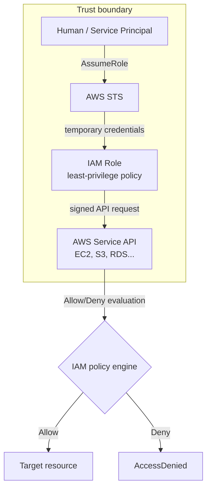
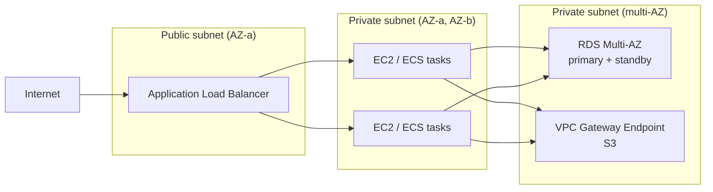
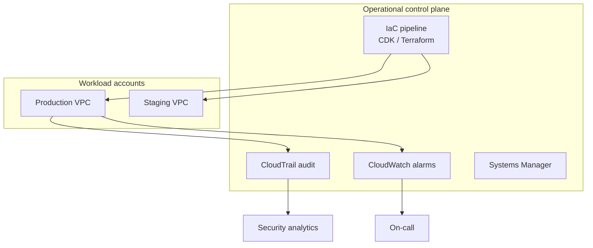

# AWS Fundamentals

## 1. Executive Summary

**Amazon Web Services (AWS)** is a hyperscale public cloud platform organized around **regions**, **Availability Zones (AZs)**, and a catalog of managed services spanning compute, storage, networking, databases, security, and operations. Principal architects must reason about AWS not as a bag of product names but as a **distributed system** with explicit **failure domains**, **API-driven control planes**, **shared responsibility boundaries**, and **economic tradeoffs** baked into every design choice.

This chapter establishes the mental model for AWS production architecture: how **IAM** enforces authorization at API boundaries; how **VPC** networking isolates and connects workloads; how core services (**EC2**, **S3**, **RDS**, **Lambda**, **ELB**) compose into tiered applications; and how the **AWS Well-Architected Framework** and **Shared Responsibility Model** frame reliability, security, performance, cost, and operational excellence decisions.

Interviewers at principal level expect you to connect AWS primitives to **distributed-systems reasoning**—quorum placement, blast radius, idempotency, observability, and blast-radius containment—not merely to recite service lists.

## 2. Why This Topic Matters

Cloud architecture interviews for senior and principal roles assume fluency in at least one hyperscaler. AWS remains the most commonly referenced platform in enterprise system design. You are expected to:

- Decompose a problem into AWS building blocks with justified tradeoffs.
- Explain **what AWS guarantees** versus **what your application must guarantee**.
- Design for **AZ and regional failure** without over-engineering cost.
- Navigate **IAM** as the universal authorization layer—not an afterthought.
- Articulate **VPC** routing, security groups, and private connectivity patterns.
- Connect Well-Architected pillars to measurable outcomes (SLOs, cost, security posture).

Architects who treat AWS as "infrastructure rental" without understanding control-plane behavior, API throttling, and service limits routinely ship designs that fail under partial outages or misconfigured permissions.

## 3. Problems Being Solved

| Problem | AWS mechanism |
|---------|---------------|
| **Elastic capacity** | EC2 Auto Scaling, Lambda concurrency, managed scaling on RDS/DynamoDB |
| **Durable object storage** | S3 (11 nines durability design goal for objects across AZs) |
| **Network isolation** | VPC, subnets, security groups, NACLs, PrivateLink |
| **Identity and access** | IAM users/roles/policies, STS, resource-based policies |
| **Load distribution** | ELB (ALB/NLB/GWLB), Route 53 DNS routing |
| **Managed databases** | RDS, Aurora, DynamoDB, ElastiCache |
| **Operational visibility** | CloudWatch, CloudTrail, X-Ray, Config |
| **Compliance and audit** | CloudTrail, Config, KMS, encryption at rest/in transit |
| **Global reach** | Regions, CloudFront, Global Accelerator, Route 53 |

AWS solves **operational burden reduction** for undifferentiated infrastructure; it does not automatically solve application consistency, idempotent workflows, or correct failure handling—that remains your responsibility.

## 4. Assumptions and System Model

| Assumption | AWS treatment |
|------------|---------------|
| **Partial failure is normal** | Design multi-AZ; expect API errors and throttling |
| **API-driven everything** | Control plane via IAM-authenticated HTTPS APIs |
| **Regional isolation** | Most services are regional; cross-region is explicit design |
| **AZ failure is possible** | AWS designs AZs as independent failure domains within a region |
| **Shared tenancy at hardware layer** | Nitro hypervisor isolation; dedicated hosts available at cost |
| **Clock and identity** | Use IAM roles, not long-lived keys; avoid wall-clock assumptions |
| **Service limits exist** | Account/region quotas require planning and limit increases |

**Client model:** Applications authenticate via IAM credentials (prefer roles over access keys). Every AWS API call is an RPC subject to latency, retries, and throttling.

## 5. Essential Terminology

| Term | Definition |
|------|------------|
| **Region** | Geographic area with multiple isolated AZs; unit of data residency for most services |
| **Availability Zone (AZ)** | One or more datacenters with independent power/network within a region |
| **Local Zone / Wavelength** | Edge extensions for latency-sensitive workloads |
| **VPC** | Virtual Private Cloud—isolated virtual network in a region |
| **Subnet** | IP range segment within a VPC, bound to one AZ |
| **Security Group** | Stateful virtual firewall attached to ENIs/instances |
| **NACL** | Stateless subnet-level firewall (less common at app tier) |
| **IAM** | Identity and Access Management—authentication/authorization for AWS APIs |
| **IAM Role** | Assumable identity with temporary credentials via STS |
| **ARN** | Amazon Resource Name—unique identifier for AWS resources |
| **ENI** | Elastic Network Interface—virtual NIC in VPC |
| **EBS** | Elastic Block Store—network-attached block volumes for EC2 |
| **S3** | Object storage with bucket/key model |
| **RDS** | Managed relational database service |
| **Lambda** | Serverless function execution environment |
| **ALB/NLB** | Application/Network Load Balancer |
| **CloudFormation / CDK** | Infrastructure as Code on AWS |
| **Well-Architected Framework** | Six pillars: operational excellence, security, reliability, performance, cost, sustainability |

## 6. Core Mechanism

### 6.1 Global infrastructure hierarchy

AWS partitions the world into **regions** (e.g., `us-east-1`). Each region contains multiple **AZs** (`us-east-1a`, `us-east-1b`, …) connected by low-latency networking but designed as **independent failure domains**. Services declare whether they are **regional**, **AZ-scoped**, or **global** (e.g., IAM, Route 53, CloudFront).

**Principal insight:** Placing all resources in one AZ optimizes cost and latency locally but maximizes blast radius. Multi-AZ is the default recommendation for production tiers that tolerate modest cross-AZ latency.

### 6.2 Shared Responsibility Model

| Layer | AWS responsibility | Customer responsibility |
|-------|---------------------|-------------------------|
| **Physical security** | Datacenters, hardware | — |
| **Hypervisor / managed service host** | EC2 host, RDS host | — |
| **Guest OS (EC2)** | — | Patching, hardening |
| **Application code** | — | Secure coding, dependencies |
| **Data classification** | Encryption mechanisms | Key management policy, access control |
| **IAM configuration** | IAM service availability | Least privilege, role design |
| **Network configuration** | VPC infrastructure | Security groups, routing, TLS |

Managed services (RDS, S3, Lambda) shift more operational burden to AWS but **never** absolve you of data protection, access control, and application correctness.

### 6.3 IAM: authorization at the API boundary

Every AWS API action is authorized by **IAM policies** evaluated as:

1. **Identity-based policies** attached to users, groups, or roles.
2. **Resource-based policies** on S3 buckets, KMS keys, SNS topics, etc.
3. **Permission boundaries** and **SCPs** (Organizations) for guardrails.

**Best practice:** Workloads assume **IAM roles** via instance profiles (EC2), task roles (ECS/EKS), or Lambda execution roles. Temporary credentials from **STS** (`AssumeRole`) reduce credential leakage risk.



*Figure 1: IAM role assumption—authorization happens at every API call; Deny always wins over Allow.*

### 6.4 VPC networking model

A **VPC** spans a region. **Subnets** map to AZs. **Route tables** direct traffic: public subnets route `0.0.0.0/0` via Internet Gateway; private subnets use **NAT Gateway** or **VPC endpoints** for AWS API access without public IPs.

**Security groups** are stateful: return traffic for established connections is allowed. **NACLs** are stateless subnet filters—use sparingly for defense-in-depth.

**PrivateLink** and **VPC endpoints** keep traffic on the AWS network backbone, reducing exposure and data transfer costs for S3/DynamoDB/API Gateway patterns.

### 6.5 Core compute and storage primitives

| Service | Model | Typical use |
|---------|-------|-------------|
| **EC2** | Virtual machines | Stateful apps, custom runtimes, legacy lift-and-shift |
| **Lambda** | Event-driven functions | Async processing, API backends at variable load |
| **ECS/EKS** | Containers | Microservices, portable workloads |
| **S3** | Object store | Static assets, data lake, backups, event sources |
| **EBS** | Block volume | EC2 boot/data disks, databases on EC2 |
| **RDS/Aurora** | Managed SQL | OLTP with automated backups, Multi-AZ failover |
| **DynamoDB** | Managed NoSQL | Key-value/document at scale, predictable latency |



*Figure 2: Three-tier VPC pattern—ALB in public subnets; compute and data in private subnets with multi-AZ RDS.*

### 6.6 Well-Architected pillars (production lens)

1. **Operational Excellence** — IaC, runbooks, game days, CI/CD.
2. **Security** — IAM least privilege, encryption, detective controls.
3. **Reliability** — Multi-AZ, auto recovery, bounded blast radius.
4. **Performance Efficiency** — Right-sizing, caching, async where appropriate.
5. **Cost Optimization** — Reserved capacity, Graviton, S3 lifecycle, FinOps visibility.
6. **Sustainability** — Region selection, utilization, managed services efficiency.

## 7. Step-by-Step Walkthrough

### Walkthrough A: Launch a production-ready web tier

1. Create VPC with public and private subnets in **two AZs**.
2. Deploy **ALB** in public subnets; target group registers EC2/ECS in private subnets.
3. Attach **security groups**: ALB allows 443 from internet; app tier allows traffic only from ALB SG; DB tier allows only app SG on DB port.
4. Deploy **RDS Multi-AZ** in private subnets; application uses RDS endpoint DNS (failover handled by AWS).
5. Store static assets in **S3**; serve via **CloudFront** with OAI/OAC.
6. Grant app tier an **IAM role** with `s3:GetObject` on asset bucket and `secretsmanager:GetSecretValue` for DB credentials—no keys on disk.

### Walkthrough B: IAM role for EC2 application

1. Create IAM role with trust policy allowing `ec2.amazonaws.com` to assume.
2. Attach policy granting least privilege (e.g., SQS `SendMessage` on one queue ARN).
3. Attach **instance profile** to EC2 launch template.
4. Application uses **instance metadata service (IMDSv2)** to obtain temporary credentials.
5. SDK signs requests automatically; rotation is handled by STS.

### Walkthrough C: S3 upload with encryption and access control

1. Create bucket with **Block Public Access** enabled (default recommended).
2. Enable **SSE-KMS** or SSE-S3 for encryption at rest.
3. Bucket policy grants `s3:PutObject` only to application role ARN.
4. Application uses multipart upload for large objects; set object tags for lifecycle transitions.
5. Enable **S3 versioning** if overwrite protection or compliance requires it.

### Walkthrough D: Lambda processing S3 events

1. S3 `ObjectCreated` event invokes Lambda (with resource policy on function).
2. Lambda execution role grants `s3:GetObject`, downstream `sqs:SendMessage`.
3. Configure **dead-letter queue** for failed invocations.
4. Set **reserved concurrency** to protect downstream systems from overload.

### Walkthrough E: Interpreting a throttling incident

1. CloudWatch shows `Throttling` on `dynamodb:PutItem`.
2. Check **on-demand vs provisioned** capacity mode and hot partition keys.
3. Implement exponential backoff with jitter in SDK (enabled by default).
4. Request **service quota increase** if account limit is the bottleneck—not the table.

## 8. Invariants and Guarantees

| Property | AWS statement | Caveat |
|----------|---------------|--------|
| **Regional API availability** | SLAs per service | Composite apps must handle partial degradation |
| **S3 durability** | Designed for 99.999999999% (11 nines) object durability | Application must use correct retry/consistency patterns |
| **RDS Multi-AZ failover** | Automated DNS endpoint update to standby | Failover duration not instantaneous; connection pools must retry |
| **IAM evaluation** | Explicit Deny overrides Allow | Policy sprawl causes accidental Deny or overly broad Allow |
| **AZ independence** | Designed as separate failure domains | Correlated failures possible—region-level DR still required for critical systems |

Distinguish **AWS service SLAs** (implementation commitment) from **your application SLOs** (user-visible outcomes).

## 9. Failure Scenarios

| Failure | Behavior | Mitigation |
|---------|----------|------------|
| **Single AZ outage** | Resources in that AZ unavailable | Multi-AZ RDS, ASG across AZs, stateless app tier |
| **Regional impairment** | All AZs in region affected (rare) | Multi-region DR, Route 53 failover, data replication strategy |
| **IAM misconfiguration** | AccessDenied across fleet | IaC review, IAM Access Analyzer, break-glass roles with MFA |
| **NAT Gateway failure/AZ loss** | Private subnet loses internet egress in that AZ | NAT per AZ, VPC endpoints for AWS APIs |
| **EBS volume loss** | Rare; AZ-scoped | Multi-AZ + backups; use RDS instead of DB on single EBS |
| **API throttling** | 429/503 from control plane | Backoff, request quotas, partition workloads |
| **Credential leakage** | Unauthorized API usage | Roles not keys, short-lived creds, CloudTrail alerting |
| **Misrouted VPC peering** | Unexpected connectivity | Route table audits, Network Firewall, segmentation |

## 10. Performance Characteristics

| Aspect | Typical behavior |
|--------|------------------|
| **Cross-AZ latency** | Sub-millisecond to low milliseconds within region (workload-dependent) |
| **Cross-region latency** | Tens to hundreds of ms—avoid synchronous chatty patterns |
| **S3 throughput** | Scales with prefix design; avoid single hot prefix at extreme scale |
| **Lambda cold start** | Proportional to runtime/package size; provisioned concurrency mitigates |
| **RDS connection limits** | Instance-class bound—use RDS Proxy or pooling |
| **EBS IOPS** | Provisioned per volume type; gp3 allows IOPS/throughput tuning |

Performance efficiency on AWS is largely **architecture and data locality**, not raw instance clock speed.

## 11. Scalability Limits

- **Account service quotas** (API rate, VPC limits, Lambda concurrency).
- **Single NAT Gateway** bandwidth per AZ.
- **RDS vertical scaling** ceiling per instance class.
- **DynamoDB hot partitions** from poor key design.
- **Lambda 15-minute max duration**, payload limits.
- **Security group rules** per ENI (soft limits with expansion patterns).

Principal architects document limits in **architecture decision records** and request quota increases before launch—not after production incidents.

## 12. Operational Considerations

- **Infrastructure as Code** (CloudFormation, CDK, Terraform) for reproducibility.
- **Multi-account strategy** via AWS Organizations: security, logging, workloads separated.
- **CloudTrail** organization trail for immutable API audit.
- **AWS Config** for drift detection and compliance rules.
- **Systems Manager** for patching and parameter store.
- **Backup strategy**: RDS automated backups, AWS Backup cross-service policies, S3 lifecycle to Glacier.
- **Runbooks** for RDS failover, AZ evacuation, credential rotation.
- **Tagging standards** for cost allocation and automation.



*Figure 3: Operations plane—IaC deploys workloads; CloudTrail and CloudWatch provide audit and reactive control.*

## 13. Security Considerations

- **Least privilege IAM** with permission boundaries; avoid `*` actions on `*` resources.
- **IMDSv2** required on EC2 to block SSRF credential theft.
- **Encryption**: KMS CMKs for RDS, S3, EBS; TLS 1.2+ in transit.
- **Network segmentation**: private subnets, no SSH from internet—use SSM Session Manager.
- **Secrets Manager / Parameter Store** instead of environment variables in AMIs.
- **GuardDuty, Security Hub, Inspector** for detective controls.
- **SCPs** to prevent disabling logging or creating public S3 buckets org-wide.

Security on AWS fails most often at **configuration**, not at missing features.

## 14. Cost Considerations

| Driver | Optimization |
|--------|--------------|
| **EC2 compute** | Graviton instances, Savings Plans, right-sizing, ASG scheduled scaling |
| **Data transfer** | Keep AZ-local traffic; CloudFront for egress; VPC endpoints |
| **NAT Gateway** | Per-AZ NAT cost adds up—evaluate VPC endpoints vs NAT for AWS API traffic |
| **S3** | Lifecycle policies, Intelligent-Tiering, request pattern optimization |
| **RDS** | Reserved instances, Aurora Serverless v2 for variable load |
| **Idle resources** | Trusted Advisor, Cost Explorer, tag-based chargeback |

Cost is a **reliability input**: underfunded redundancy causes outages; overprovisioned redundancy wastes margin—FinOps and architecture must align.

## 15. Production Implementations

| Pattern | AWS services | Notes |
|---------|--------------|-------|
| **Three-tier web** | ALB, EC2/ECS, RDS Multi-AZ, S3, CloudFront | Classic enterprise pattern |
| **Serverless API** | API Gateway, Lambda, DynamoDB, Cognito | Pay-per-use; cold start awareness |
| **Event-driven pipeline** | S3 → SQS → Lambda → DynamoDB | Decouple with queues for backpressure |
| **Kubernetes platform** | EKS, IRSA for pod IAM, ALB Ingress Controller | Control plane managed; node strategy matters |
| **Data lake** | S3, Glue, Athena, Lake Formation | Governance via LF permissions |
| **Hybrid connectivity** | Direct Connect, Site-to-Site VPN, Transit Gateway | Latency and routing complexity |

Reference architectures: [AWS Architecture Center](https://aws.amazon.com/architecture/).

## 16. Alternatives and Tradeoffs

| Alternative | When |
|-------------|------|
| **GCP / Azure** | Existing enterprise commitment, specific managed services (BigQuery, Azure AD integration) |
| **Multi-cloud** | Rarely for portability alone—justify regulatory or acquisition-driven needs |
| **On-premises** | Strict data residency, legacy mainframe, latency to specialized hardware |
| **Colo + AWS hybrid** | Gradual migration, burst to cloud |
| **Lambda vs ECS vs EC2** | Spectrum of operational control vs abstraction |

AWS wins when **breadth of services**, **partner ecosystem**, and **operational maturity** align with organizational capability—not by default.

## 17. Common Misconceptions

| Misconception | Reality |
|---------------|---------|
| "AWS is automatically highly available" | You must architect multi-AZ/multi-region |
| "Security groups are enough" | Defense in depth: IAM, encryption, logging, app security |
| "S3 is a filesystem" | Object semantics; listing consistency model differs from POSIX |
| "Lambda has no ops" | Concurrency, IAM, networking, observability still required |
| "VPC peering is free and simple" | Transitive routing not supported; CIDR planning required |
| "IAM users for applications" | Use roles; users are for humans and break-glass |

## 18. Principal Architect Perspective

- **Start from failure domains**: region → AZ → cell → service.
- **Treat IAM as your distributed authZ layer**—design roles per workload, not per developer SSH key.
- **Prefer managed services** where differentiation is not in running MySQL—you still own schema, queries, and failover testing.
- **Instrument from day one**: CloudWatch metrics, structured logs, X-Ray traces—retrofit is expensive.
- **Account vending machine**: Landing zones (Control Tower) scale governance better than one giant account.
- **Challenge lift-and-shift**: EC2-for-EC2 migration without refactoring misses elasticity and resilience benefits.

## 19. Architecture Review Exercise

**Scenario:** A team proposes a single-AZ RDS instance with public endpoint "for easier developer access," storing AWS access keys in the application WAR file, and a single NAT Gateway for all private subnets in one AZ.

**Findings:**

1. Single AZ — no failover; violates reliability pillar.
2. Public RDS — attack surface; use private subnet + bastion/SSM or VPN.
3. Long-lived keys in artifact — rotate to IAM role; keys in Secrets Manager if unavoidable.
4. Single NAT in one AZ — cross-AZ egress failure and bandwidth bottleneck.

**Recommendation:** Multi-AZ RDS private, IAM roles, NAT per AZ or VPC endpoints, developer access via SSM port forwarding.

## 20. Whiteboard Explanation

"AWS gives you regional infrastructure divided into Availability Zones—independent failure domains connected by low-latency links. You build inside a VPC with public and private subnets. Users hit an ALB in public subnets; application tier runs in private subnets across at least two AZs; data tier uses Multi-AZ RDS or replicated storage. Every service call is authorized by IAM—workloads assume roles with temporary credentials. AWS secures the cloud; we secure what's in the cloud: network rules, encryption, patching application code, and least-privilege access. Reliability comes from eliminating single points of failure within a region and planning cross-region DR where the business requires it."

## 21. Interview Questions

1. **Explain the Shared Responsibility Model.** — Split between AWS and customer by service type.
2. **Difference between security group and NACL?** — Stateful ENI-level vs stateless subnet-level.
3. **How does IAM role assumption work?** — Trust policy + STS temporary credentials.
4. **When use NAT Gateway vs VPC endpoint?** — Internet egress vs private AWS API access.
5. **RDS Multi-AZ vs Read Replica?** — Failover vs read scaling.
6. **S3 consistency model (strong read after write for new objects)?** — Know overwrite/list nuances.
7. **How would you secure EC2 metadata access?** — IMDSv2, hop limit.
8. **What breaks if one AZ fails in your design?** — Walk through each tier.
9. **Lambda vs ECS tradeoffs?** — Ops burden, cold start, networking, duration limits.
10. **Well-Architected pillars?** — Name six and give one example each.
11. **How do you prevent S3 data exfiltration?** — Block public access, SCPs, VPC endpoints, logging.
12. **Cross-region disaster recovery options on AWS?** — Backup/restore, pilot light, warm standby, active-active.

## 22. Interview Follow-Ups

1. **Design IAM for a three-tier app with CI/CD.** — Separate deploy role, instance role, pipeline OIDC to AWS.
2. **How would you handle a compromised access key?** — Disable, CloudTrail analysis, rotate, SCP review.
3. **Cost of multi-AZ NAT?** — Quantify per-AZ NAT hourly + data processing; compare endpoints.
4. **DynamoDB vs RDS for order table?** — Access patterns, transactions, ops model.
5. **Explain STS credential chain in EKS IRSA.** — OIDC trust, pod service account annotation, role assumption.

## 23. Strong Answer Example

**Question:** "How do you design a secure VPC for a public-facing API?"

**Strong outline:** "I'd use a /16 VPC across three AZs with /24 public subnets for ALB and /20 private subnets for compute and data. ALB terminates TLS with a modern policy; instances have no public IPs. Security groups enforce least privilege: ALB accepts 443 from the internet; app tier accepts only ALB on app port; database accepts only app tier on 5432. Outbound internet from private subnets uses NAT per AZ for fault isolation, but S3 and DynamoDB traffic goes through gateway endpoints to avoid NAT cost and reduce exposure. Workloads use IAM roles via instance profiles—no static keys. CloudTrail logs all API activity; VPC Flow Logs feed security analysis. Secrets in Secrets Manager with rotation. This maps to Well-Architected security and reliability: defense in depth, blast radius containment, and auditability."

## 24. Weak Answer Example

**Weak:** "Use VPC, security groups, and IAM. Make it private. Use RDS."

**Red flags:** No AZ strategy, no IAM role detail, no TLS/secret handling, no observability or failure walkthrough.

## 25. Hands-On Exercise

1. Deploy a CDK or Terraform stack: VPC (2 AZs), ALB, EC2 or Fargate, RDS Multi-AZ.
2. Verify: no public IPs on app tier; only ALB is internet-facing.
3. Simulate AZ failure by stopping all instances in one AZ—ASG should replace; RDS fails over if primary AZ lost.
4. Use IAM Access Analyzer to find overly permissive policies.
5. Enable CloudTrail and trigger an API call; locate event in log.
6. Document monthly cost estimate from AWS Pricing Calculator.

## 26. Knowledge Check

1. What is an Availability Zone?
2. Name three IAM policy types (identity-based, resource-based, SCP).
3. What does RDS Multi-AZ provide vs read replica?
4. Why prefer IAM roles over access keys on EC2?
5. What is the purpose of an Internet Gateway?
6. How does a security group differ from a NACL?
7. What AWS service provides centralized API audit logs?
8. Name the six Well-Architected pillars.
9. What is IMDSv2 protecting against?
10. When would you use S3 Transfer Acceleration vs CloudFront?
11. What happens to existing TCP connections during RDS Multi-AZ failover?
12. What is a VPC endpoint gateway vs interface endpoint?

## 27. Flashcards

| Front | Back |
|-------|------|
| Shared Responsibility Model | AWS secures cloud infrastructure; customer secures data, IAM, OS, app |
| AZ | Independent failure domain within a region |
| IAM Role | Assumable identity; temporary creds via STS |
| Security Group | Stateful firewall on ENI |
| Multi-AZ RDS | Synchronous standby; automatic failover |
| S3 durability design | 11 nines across AZs (per AWS documentation) |
| NAT Gateway | Outbound internet from private subnets |
| VPC Endpoint | Private connectivity to AWS services without internet |
| CloudTrail | API audit log |
| Well-Architected | Ops, security, reliability, performance, cost, sustainability |
| IMDSv2 | Session-oriented metadata access; mitigates SSRF theft |
| Blast radius | Scope of impact when a component fails |

## 28. Cheat Sheet

```
AWS HIERARCHY
  Region → AZs → (Local Zones, Wavelength)

VPC PATTERN
  public subnets: ALB, NAT
  private subnets: compute, RDS
  SG: stateful, ENI-level
  NACL: stateless, subnet-level

IAM
  humans: SSO + short-lived roles
  workloads: IAM roles (EC2 profile, Lambda role, IRSA)
  Deny > Allow; least privilege

CORE SERVICES
  compute: EC2, Lambda, ECS/EKS
  data: S3, EBS, RDS, DynamoDB
  network: ALB/NLB, Route 53, CloudFront
  ops: CloudWatch, CloudTrail, Config

RELIABILITY DEFAULTS
  multi-AZ app + data
  stateless app tier
  backups + tested restore
  no single NAT for all AZs (evaluate)
```

## 29. Related Concepts

- [Multi-Region Architecture](/docs/cloud-architecture/multi-region-architecture) — extending beyond single region
- [Networking](/docs/networking/overview) — TCP/IP foundations for VPC design
- [Security Architecture Fundamentals](/docs/security/security-architecture-fundamentals) — zero trust and threat modeling on AWS
- [Observability Fundamentals](/docs/observability/observability-fundamentals) — CloudWatch, X-Ray, operational signals
- [SLOs, SLIs, and Error Budgets](/docs/reliability-and-resilience/slo-sli-error-budgets) — reliability targets for AWS workloads
- [Reliability and Resilience](/docs/reliability-and-resilience/overview) — DR and chaos engineering

## 30. References

### Primary sources (AWS official)

- Amazon Web Services. *AWS Well-Architected Framework.* https://docs.aws.amazon.com/wellarchitected/
- Amazon Web Services. *AWS Shared Responsibility Model.* https://aws.amazon.com/compliance/shared-responsibility-model/
- Amazon Web Services. *IAM Best Practices.* https://docs.aws.amazon.com/IAM/latest/UserGuide/best-practices.html
- Amazon Web Services. *Amazon VPC User Guide.* https://docs.aws.amazon.com/vpc/
- Amazon Web Services. *Amazon S3 User Guide* — durability and consistency documentation.

### Books

- Beyer, B., et al. (2016). *Site Reliability Engineering.* O'Reilly. [Operational patterns applicable on AWS]
- Hackett, S. (2023). *AWS Certified Solutions Architect Study Guide* — service breadth reference.

### Distinction

- **Formal SLAs** — Per-service AWS SLA documents.
- **Implementation choices** — Multi-account, landing zone, specific instance families.
- **Operational experience** — Failover timings and throttling behavior—validate in your accounts.
