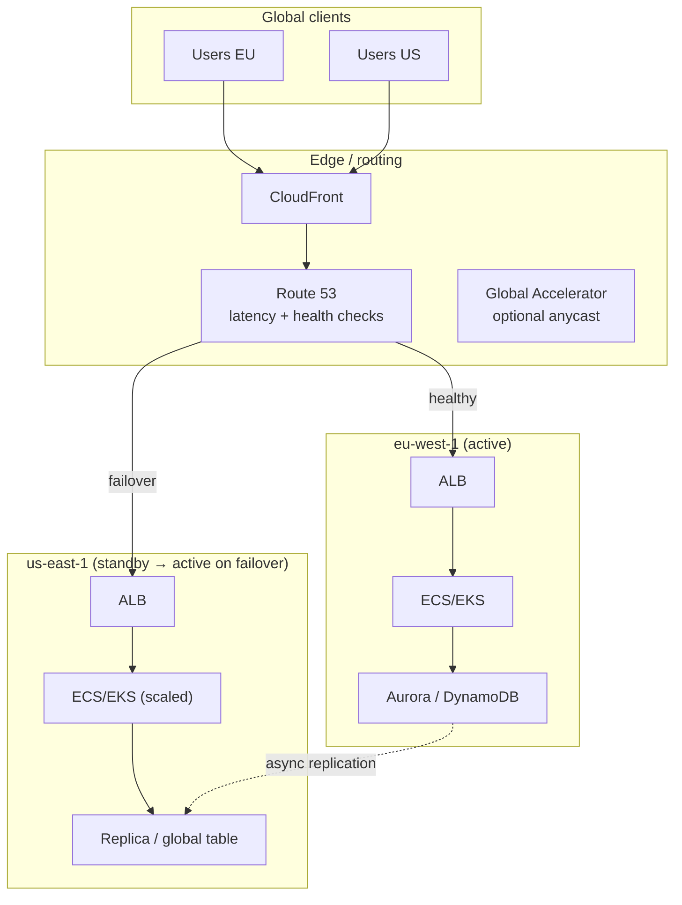
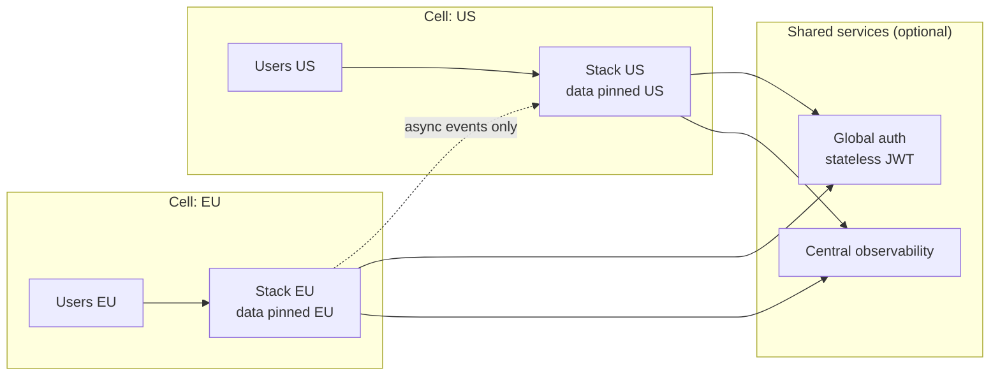
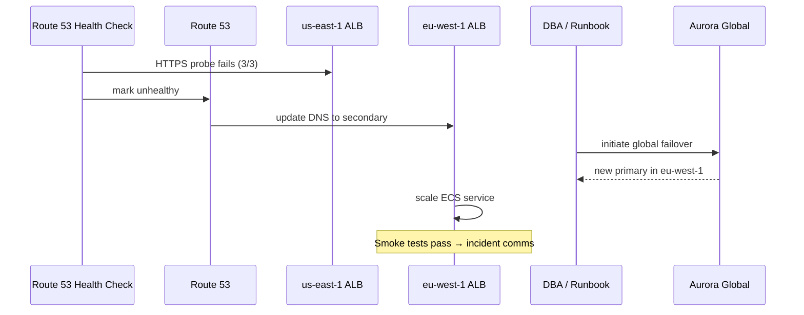

# Multi-Region Architecture

## 1. Executive Summary

**Multi-region architecture** distributes workloads across geographically separated AWS **regions** to achieve disaster recovery (DR), regulatory **data residency**, reduced **latency** for global users, and containment of **blast radius** beyond single-region failures. Unlike multi-AZ design—which handles datacenter-scale faults within one region—multi-region design confronts **higher latency**, **weaker consistency** across replicas, **operational complexity**, and **material cost**.

This chapter covers DR patterns (backup/restore, pilot light, warm standby, active-passive, active-active), AWS routing and traffic management (**Route 53**, **Global Accelerator**, **CloudFront**), data replication strategies (**Aurora Global Database**, **DynamoDB Global Tables**, **S3 Cross-Region Replication**), and the principal-level tradeoffs among **RTO**, **RPO**, consistency, and organizational runbook maturity.

Principal candidates must articulate **what fails independently**, **what data can be lost or stale**, and **how failover is tested**—not merely draw two region boxes on a diagram.

## 2. Why This Topic Matters

Global products and regulated enterprises routinely require multi-region thinking. Interviewers probe:

- **RTO/RPO** definitions and how architecture delivers them.
- **Active-active vs active-passive**—when each is justified.
- **Split-brain** and **conflict resolution** in multi-writer designs.
- **DNS failover** behavior and TTL implications.
- **Data sovereignty** and replication lag measurement.
- **Cost** of idle standby capacity vs revenue risk of regional outage.

Real-world regional outages (AWS and application-level) make multi-region literacy a **production necessity**, not an advanced elective.

## 3. Problems Being Solved

| Problem | Multi-region approach |
|---------|----------------------|
| **Regional catastrophe** | Standby or active stack in second region |
| **Global user latency** | Route users to nearest healthy region |
| **Data residency (GDPR, etc.)** | Pin data to specific regions; limit replication |
| **Blast radius reduction** | Isolate control planes and data per region |
| **Maintenance without global downtime** | Rolling region drain with traffic shift |
| **Compliance / sovereignty** | EU data in `eu-west-1`, US in `us-east-1` |

Multi-region does **not** automatically solve **strong consistency** across geographies—that requires explicit protocol design and accepted latency.

## 4. Assumptions and System Model

| Assumption | Implication |
|------------|-------------|
| **Regions are independent failure domains** | Design for full region loss |
| **Cross-region latency is tens–hundreds of ms** | Avoid synchronous cross-region commits on critical path |
| **Network partitions can occur** | Choose CP vs AP per CAP for cross-region data |
| **DNS is eventually consistent** | Failover has propagation delay |
| **Replication lag is non-zero** | RPO > 0 unless synchronous (rare cross-region) |
| **Operational maturity required** | Untested DR is fiction |

**Client model:** Clients reach nearest edge (CloudFront) or region via Geo DNS / latency routing; during failover, clients may retry or be redirected.

## 5. Essential Terminology

| Term | Definition |
|------|------------|
| **RTO** | Recovery Time Objective—max acceptable downtime |
| **RPO** | Recovery Point Objective—max acceptable data loss window |
| **Active-passive** | Primary region serves traffic; secondary on standby |
| **Active-active** | Multiple regions serve traffic concurrently |
| **Pilot light** | Minimal core running in DR region; scale up on failover |
| **Warm standby** | Scaled-down but functional DR environment |
| **Backup and restore** | Periodic backups restored after incident |
| **Global table / global database** | AWS-managed multi-region replication |
| **Route 53 health check** | Automated DNS failover trigger |
| **Global Accelerator** | Anycast static IPs; health-based regional routing |
| **Split brain** | Two regions both believe they are primary |
| **Conflict resolution** | Rules for concurrent writes in active-active |
| **Cell-based architecture** | Shard users/data by region or partition |
| **Runbook / game day** | Documented and practiced failover procedure |

## 6. Core Mechanism

### 6.1 DR spectrum on AWS

| Pattern | RTO | RPO | Cost | Complexity |
|---------|-----|-----|------|------------|
| Backup & restore | Hours–days | Hours (backup interval) | Low | Low |
| Pilot light | Hours | Minutes–hours | Low–medium | Medium |
| Warm standby | Minutes–hours | Minutes | Medium | Medium |
| Active-passive (hot standby) | Minutes | Seconds–minutes | Medium–high | Medium–high |
| Active-active | Near zero (per region) | Zero–seconds (app-dependent) | High | High |

Choice is a **business decision** encoded in architecture—not a technical default.

### 6.2 Traffic routing layer

**Amazon Route 53** routing policies:

- **Latency-based** — lowest latency healthy region.
- **Geolocation / Geoproximity** — regulatory or business routing.
- **Failover** — primary/secondary with health checks.
- **Weighted** — gradual traffic shift (deployments, canaries).

**AWS Global Accelerator** provides static anycast IPs and TCP/UDP proxies with health-checked endpoint groups per region—useful for non-HTTP protocols and faster failover than DNS TTL alone for some clients.

**CloudFront** caches at edge; origin failover between regional origins improves resilience for static and cacheable dynamic content.



*Figure 1: Multi-region traffic flow—Route 53 health checks drive failover; data replicates asynchronously with measurable lag.*

### 6.3 Data replication patterns

| Data store | Multi-region option | Consistency notes |
|------------|--------------------|--------------------|
| **DynamoDB** | Global Tables | Multi-master; last-writer-wins conflict handling |
| **Aurora** | Global Database | One primary region; read replicas in secondary; sub-second promoted failover |
| **RDS** | Cross-region read replica + manual promote | RPO = replication lag |
| **S3** | Cross-Region Replication (CRR) | Eventually consistent; replication time SLA in docs |
| **ElastiCache** | Global Datastore (Redis) | Primary/replica across regions |
| **MSK / Kinesis** | MirrorMaker / streams consumers | Application-level ordering care |

**Principal rule:** Measure **replication lag** as an SLI; alert before it exceeds RPO budget.

### 6.4 Active-active architecture concerns

Active-active maximizes utilization but introduces:

1. **Write conflicts** — use CRDTs, version vectors, or single-writer per entity shard.
2. **Global load balancing** — sticky sessions or shared session store.
3. **Deployment coordination** — independent region deploys vs synchronized releases.
4. **Observability** — correlate traces across regions with shared trace IDs.
5. **Compliance** — data may not legally replicate globally.

**Cell-based design:** Partition tenants or users by home region; cross-cell calls are rare and explicit—reduces conflict surface (used at hyperscale).



*Figure 2: Cell-based multi-region—each cell owns data; cross-cell traffic minimized.*

### 6.5 Failover mechanics

1. **Detect** — Route 53 health check, CloudWatch alarm, synthetic canary, human declaration.
2. **Decide** — automated vs manual approval (avoid flapping).
3. **Redirect traffic** — DNS failover, Global Accelerator shift, weight change.
4. **Promote data** — Aurora Global Database failover, DynamoDB already multi-writer, RDS manual promote.
5. **Scale capacity** — ASG desired count, pre-warmed Lambda, ECS service scaling.
6. **Validate** — smoke tests, SLO dashboards, error budget check.
7. **Communicate** — status page, internal incident channel.

Untested steps 4–5 cause **longer outages than the regional fault itself**.

## 7. Step-by-Step Walkthrough

### Walkthrough A: Active-passive with Aurora Global Database

1. Primary in `us-east-1`; secondary cluster in `eu-west-1` with **Aurora Global Database**.
2. Application in both regions; EU stack scaled to zero or minimal (warm standby).
3. Route 53 failover: primary ALB health check; secondary ALB receives traffic on failure.
4. On regional failure: invoke **managed failover** (< 1 minute typical for Aurora Global—verify in your tests).
5. Scale EU application tier; verify replication lag was within RPO before failure.

### Walkthrough B: DynamoDB Global Tables active-active

1. Create global table with replicas in `us-east-1` and `ap-southeast-1`.
2. Deploy identical Lambda/API stacks in both regions behind latency-based Route 53.
3. Clients write to local region; DynamoDB replicates asynchronously.
4. Handle **conflicting updates** to same item with version attributes or conditional writes.
5. Monitor `ReplicationLatency` CloudWatch metric per replica.

### Walkthrough C: S3 CRR for compliance archive

1. Primary bucket in `us-east-1` with versioning enabled.
2. CRR rule to `eu-central-1` bucket for EU archive copy.
3. Use **S3 Replication Time Control (RTC)** if bounded replication time required (additional cost).
4. IAM roles for replication; KMS keys per region for encryption.

### Walkthrough D: Game day — regional evacuation

1. Pre-announce internal game day.
2. Shift Route 53 weights 100% to secondary over 30 minutes.
3. Observe error rates, replication lag, autoscaling behavior.
4. Run write/read integration tests from both regions.
5. Document gaps: missing secrets in DR region, stale AMIs, broken Terraform backend.

### Walkthrough E: Preventing split-brain on RDS promote

1. Primary region impaired but not fully isolated—split brain risk.
2. **Manual promotion** only after confirming primary is truly dead (fencing).
3. Use **Route 53 Application Recovery Controller (ARC)** routing controls for orchestrated failover.
4. Invalidate primary writes via network isolation or IAM deny before promoting secondary.

## 8. Invariants and Guarantees

| Guarantee | Scope | Caveat |
|-----------|-------|--------|
| **Regional isolation** | Most AWS services | Global services (IAM, Route 53) have own models |
| **Aurora Global failover RPO** | Typically sub-second lag before failure (AWS documentation) | Network partition edge cases |
| **DynamoDB Global Tables** | Eventually consistent across regions | Conflict resolution semantics |
| **Route 53 health check failover** | DNS TTL bound propagation | Clients cache DNS |
| **S3 CRR** | Asynchronous | Not for strong consistency requirements |

No multi-region design provides **both** zero RPO and **active-active writes** without explicit conflict protocol—state assumptions clearly.

## 9. Failure Scenarios

| Failure | Behavior | Mitigation |
|---------|----------|------------|
| **Full region loss** | Primary unavailable | Failover to DR region; promote replicas |
| **Partial regional degradation** | Elevated errors, not health-check fail | Composite alarms; canary traffic; manual weight shift |
| **Replication lag spike** | RPO violated | Throttle writes, pause failover, fix network |
| **DNS flapping** | Clients oscillate | Hysteresis on health checks, higher failure thresholds |
| **Split brain** | Duplicate writes, data corruption | Fencing, ARC, single-primary promotion rules |
| **DR region capacity insufficient** | Failover succeeds but overloads | Pre-warmed capacity, load tests on DR |
| **KMS key regional lock** | Cannot decrypt in DR | Replicate keys or multi-region keys (MRKs) |
| **Config drift** | DR stack outdated | IaC pipeline deploys to all regions |

## 10. Performance Characteristics

| Aspect | Behavior |
|--------|----------|
| Cross-region RTT | ~20–300+ ms depending on distance |
| Aurora Global replication | Typically < 1 s lag (AWS marketing/docs—measure yours) |
| DynamoDB Global Tables | Millisecond local writes; replication async |
| CloudFront cache hit | Edge latency dominates; origin region less critical |
| Global Accelerator | Reduces internet path variance; not a data plane for DB |

Design **read-local, write-home** or **async cross-region** for latency-sensitive paths.

## 11. Scalability Limits

- **Route 53** API rate limits on rapid policy changes.
- **DynamoDB global table** replica limits per table.
- **Cross-region data transfer** cost and bandwidth caps.
- **Operational headcount** — N regions × deployment pipelines × on-call complexity.
- **Stateful session** explosion in active-active without shared store.

## 12. Operational Considerations

- **IaC in every region** — same modules, region-specific parameters.
- **Secrets replication** — Secrets Manager multi-region secrets or regional copies.
- **Container images** — ECR replication or pull-through cache per region.
- **Runbooks** with RACI: who declares disaster, who promotes DB.
- **Quarterly game days** minimum for tier-1 systems.
- **ARC (Application Recovery Controller)** for readiness checks and routing controls.
- **Tagging** `dr-tier`, `region-role=primary|secondary`.
- **Backup cross-region** even with live replication—ransomware and operator error protection.



*Figure 3: Failover sequence—health detection, DNS shift, database promotion, capacity scale.*

## 13. Security Considerations

- **Per-region KMS keys** and key policies; MRKs where needed.
- **IAM policies** scoped per region where possible (`aws:RequestedRegion`).
- **VPC peering / TGW** cross-region—encrypt inter-region traffic (TLS on apps).
- **Data residency** — SCPs preventing resource creation outside approved regions.
- **Audit** — CloudTrail in each region; organization trail aggregation.
- **DDoS** — Shield Advanced per region; CloudFront as first line.

## 14. Cost Considerations

| Cost driver | Notes |
|-------------|-------|
| **Idle DR capacity** | Warm standby ECU/RDS hours |
| **Cross-region replication** | Data transfer $/GB |
| **Global Accelerator** | Hourly + data processing |
| **Multi-region observability** | Duplicate metrics/logs ingest |
| **Route 53** | Health checks per endpoint |

Finance must understand **insurance premium** metaphor—DR spend vs outage revenue impact.

## 15. Production Implementations

| Company pattern | AWS building blocks |
|-----------------|---------------------|
| **Global SaaS active-active** | DynamoDB Global Tables, CloudFront, multi-region ECS |
| **Financial hot standby** | Aurora Global, pilot light ECS, ARC |
| **Media CDN-first** | S3 + CloudFront; regional origins |
| **Regulated EU+US cells** | Separate accounts per jurisdiction, no cross-border replication |

Study AWS **Disaster Recovery whitepaper** and **Well-Architected Reliability pillar** for reference architectures.

## 16. Alternatives and Tradeoffs

| Alternative | When |
|-------------|------|
| **Multi-AZ only** | RTO/RPO tolerate minutes; regional risk accepted |
| **Third-party DR (DRaaS)** | Hybrid workloads, non-AWS components |
| **Backup to cold storage** | Tier-3 systems, hours RTO acceptable |
| **Single region + cross-cloud** | Rare; extreme resilience requirements |

More regions ≠ more reliable if **operational maturity** does not scale.

## 17. Common Misconceptions

| Misconception | Reality |
|---------------|---------|
| "Multi-AZ = multi-region DR" | AZ failure ≠ region failure |
| "Active-active is always better" | Conflict resolution and cost complexity |
| "DNS failover is instant" | TTL and client caching delay |
| "Replication = backup" | Corruption replicates; need PITR and backups |
| "Same Terraform applies unchanged" | AMIs, endpoints, KMS ARNs are regional |

## 18. Principal Architect Perspective

- **Quantify RTO/RPO with business**—don't gold-plate tier-3 batch jobs.
- **Prefer cell-based** over fully symmetric active-active when data sovereignty applies.
- **Invest in game days** more than additional regions.
- **Treat replication lag as product risk**—surface in executive dashboards.
- **Document failback**—returning to primary is harder than failover.

## 19. Architecture Review Exercise

**Scenario:** E-commerce platform requires RPO < 1 min, RTO < 15 min globally. Team proposes active-active RDS Multi-AZ in two regions with bidirectional application writes.

**Issues:** RDS is not multi-master across regions without conflict pain; bidirectional app writes need shard ownership.

**Recommendation:** Aurora Global Database with single write region + read scaling in second, or DynamoDB Global Tables with partition key sharding by `customer_id` home region. Active-active reads via CloudFront; writes routed to home region cell.

## 20. Whiteboard Explanation

"Regions are independent failure domains. We define RPO—how much data we can lose—and RTO—how fast we recover. For warm standby, we keep a scaled-down stack in eu-west-1 replicating from us-east-1 via Aurora Global Database. Route 53 health checks watch the primary ALB; on failure, DNS shifts to the secondary ALB and we promote the Aurora replica—typically under a minute. Replication lag is our RPO window—we monitor it as an SLI. Active-active with DynamoDB Global Tables is possible but requires conflict-aware data modeling. We practice failover quarterly; untested DR doesn't exist."

## 21. Interview Questions

1. **Define RTO and RPO.** — Time vs data loss windows.
2. **Compare pilot light and warm standby.** — DR capacity pre-provisioned level.
3. **How does Route 53 failover work?** — Health checks + routing policy.
4. **Aurora Global vs cross-region RDS replica?** — Purpose-built failover vs manual.
5. **Active-active pitfalls?** — Conflicts, sessions, deployments.
6. **What is split brain?** — Dual primaries; prevention strategies.
7. **How measure replication lag?** — CloudWatch metrics, custom heartbeats.
8. **When is multi-region not worth it?** — Cost, complexity, actual risk tolerance.
9. **Role of CloudFront in multi-region?** — Edge caching, origin failover.
10. **Data sovereignty constraints?** — Cells, no replication, geolocation routing.
11. **Global Accelerator vs Route 53 latency routing?** — Anycast IPs, protocol support.
12. **How do you test DR?** — Game days, chaos, traffic shifting.

## 22. Interview Follow-Ups

1. **Design global user session store.** — ElastiCache Global Datastore, DynamoDB, sticky JWT.
2. **Failover caused data loss—how investigate?** — Replication lag at failure time, promote logs.
3. **Cost optimize warm standby.** — Scheduled scaling, smaller instance classes, serverless burst.
4. **Kafka multi-region ordering?** — MirrorMaker 2, consumer offset strategy.
5. **ARC vs manual runbook?** — Automated readiness gates and routing controls.

## 23. Strong Answer Example

**Question:** "Design multi-region DR for a payment API with RPO 30 seconds and RTO 5 minutes."

**Strong outline:** "I'd use active-passive with Aurora Global Database—primary in us-east-1, secondary in us-west-2. Aurora Global gives sub-second replication lag typically, meeting 30s RPO with margin. Application runs in both regions; secondary runs at 20% capacity for warm standby. Route 53 failover health checks on `/health` that validates DB connectivity. On regional failure, automated Aurora failover promotes secondary in under a minute; ASG scales secondary to 100%; Route 53 shifts DNS. RTO budget: ~2 min failover + ~2 min scale + 1 min validation. I'd use ARC readiness checks before enabling automated DNS flip to prevent flapping. Secrets and AMIs replicated via Secrets Manager and ECR replication. Quarterly game day promotes secondary without production traffic. Error budget policy pauses feature launches if DR test fails."

## 24. Weak Answer Example

**Weak:** "Deploy in two regions with Route 53 and replicate the database."

**Red flags:** No RTO/RPO numbers, no replication technology, no failover steps, no split-brain or lag discussion.

## 25. Hands-On Exercise

**Lab:** `labs/lab-012-multi-region-aws/` — DR failover simulator on **`:8102`**

```bash
cd labs/lab-012-multi-region-aws
python3 -m venv .venv && source .venv/bin/activate
pip install -r requirements.txt
pytest tests/ -v
docker compose -p lab012 -f docker/docker-compose.yml up --build -d
chmod +x scripts/demo_multiregion.sh && ./scripts/demo_multiregion.sh
```

| Step | Endpoint | What happens |
|------|----------|--------------|
| 1 | `POST /v1/config/validate` | Validate Terraform-style multi-region config |
| 2 | `POST /v1/failover/simulate` | Dry-run active-passive failover timeline |
| 3 | RTO/RPO output | Replication lag → data loss window |
| 4 | Health check failure | Route 53 failover trigger simulation |
| 5 | `GET /health` | Stack status |

**Swagger:** http://localhost:8102/docs

### Engineer guide: how the local stack works

1. **Plan-only by default** — validates architecture without requiring AWS apply (cost-safe).
2. **Active-passive model** — primary `us-east-1`, DR `us-west-2` with cross-region replication lag.
3. **Failover simulator** — computes RTO from health-check interval + DNS TTL + promotion steps.
4. **RPO from lag** — replication delay at failure time bounds acceptable data loss.
5. **Runbook output** — ordered steps for incident commander (aligns with game-day exercises).

Pairs with [AWS S3 Multi-Region DR](/docs/real-world-scenarios/aws-s3-multi-region-dr) and [Disaster Recovery](/docs/reliability-and-resilience/disaster-recovery-and-multi-region#25-hands-on-exercise).

### Build-from-scratch exercise (optional)

1. Deploy two-region VPC stacks with Terraform/CDK (secondary minimal).
2. Configure Aurora Global Database or DynamoDB Global Table.
3. Set Route 53 failover records with health checks.
4. Inject failure: security group deny on primary ALB; observe failover time.
5. Measure replication lag under write load; write runbook with actual timings.

## 26. Knowledge Check

1. What is the difference between RTO and RPO?
2. Name four DR patterns on the AWS spectrum.
3. How does Aurora Global Database failover differ from RDS cross-region replica promotion?
4. What routing policy sends users to lowest-latency healthy region?
5. Why can active-active DynamoDB require application changes?
6. What causes DNS failover delay?
7. What is a cell-based architecture?
8. How do you prevent split brain during DB promotion?
9. What metric indicates DynamoDB cross-region replication health?
10. When use Global Accelerator over Route 53 alone?
11. What is S3 CRR?
12. Why practice failback?

## 27. Flashcards

| Front | Back |
|-------|------|
| RTO | Max acceptable downtime to restore service |
| RPO | Max acceptable data loss measured in time |
| Pilot light | Minimal DR resources; scale on disaster |
| Warm standby | Reduced but running DR environment |
| Active-passive | One primary traffic region at a time |
| Active-active | Multiple regions serve traffic concurrently |
| Aurora Global Database | Managed cross-region Aurora with fast failover |
| DynamoDB Global Tables | Multi-region multi-master replication |
| Route 53 failover | Primary/secondary DNS with health checks |
| Split brain | Two primaries accepting conflicting writes |
| Replication lag | Delay between write in A and visibility in B |
| Game day | Scheduled DR exercise in production-like conditions |

## 28. Cheat Sheet

```
DR SPECTRUM (cost ↑, RTO ↓)
  backup/restore → pilot light → warm standby → hot standby → active-active

AWS ROUTING
  Route 53: latency, failover, weighted, geolocation
  Global Accelerator: anycast, TCP/UDP
  CloudFront: edge cache + origin failover

DATA REPLICATION
  Aurora Global: single writer, fast regional failover
  DynamoDB Global Tables: multi-writer, conflict awareness
  S3 CRR: async object replication
  RDS cross-region replica: manual promote

OPERATIONS
  IaC all regions
  measure replication lag (SLI)
  quarterly game days
  document failback
  ARC for routing controls
```

## 29. Related Concepts

- [AWS Fundamentals](/docs/cloud-architecture/aws-fundamentals) — regions, AZs, VPC baseline
- [SLOs, SLIs, and Error Budgets](/docs/reliability-and-resilience/slo-sli-error-budgets) — reliability targets for DR
- [Replication](/docs/replication/overview) — general replication theory
- [CAP Theorem](/docs/consistency/cap-theorem) — consistency vs availability in partitions
- [Observability Fundamentals](/docs/observability/observability-fundamentals) — cross-region tracing
- [Production Failures](/docs/production-failures/overview) — regional outage case studies

## 30. References

### Primary sources

- Amazon Web Services. *Disaster Recovery of Workloads on AWS: Recovery in the Cloud.* AWS whitepaper.
- Amazon Web Services. *Amazon Aurora Global Database* — https://docs.aws.amazon.com/AmazonRDS/latest/AuroraUserGuide/aurora-global-database.html
- Amazon Web Services. *DynamoDB Global Tables* — https://docs.aws.amazon.com/amazondynamodb/latest/developerguide/GlobalTables.html
- Amazon Web Services. *Route 53 DNS failover* — https://docs.aws.amazon.com/Route53/latest/DeveloperGuide/dns-failover.html
- Amazon Web Services. *AWS Global Accelerator* — https://docs.aws.amazon.com/global-accelerator/

### Books

- Beyer, B., et al. (2016). *Site Reliability Engineering.* O'Reilly. [DR and error budgets]
- Kleppmann, M. (2017). *Designing Data-Intensive Applications.* O'Reilly. [Multi-datacenter patterns]

### Distinction

- **AWS-documented failover times** — Implementation targets; measure in your environment.
- **Business RTO/RPO** — Contractual or leadership decisions, not service defaults.
