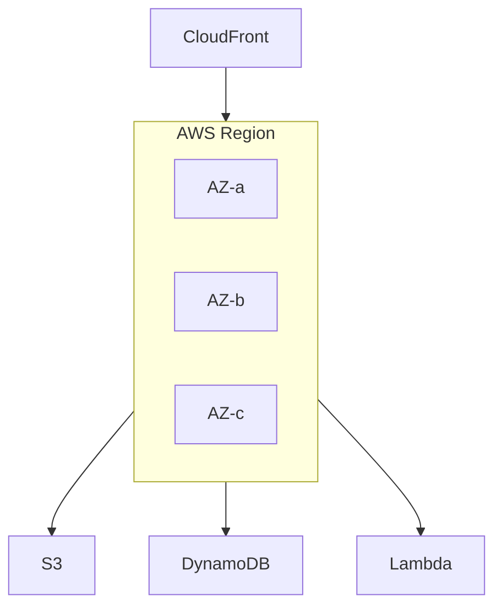

# Cloud Architecture

AWS services, multi-region design, IAM, networking, and cloud economics.

*Figure: Regional AWS deployment across availability zones.*

## Chapters

| Chapter | Focus |
|---------|-------|
| AWS Fundamentals | [AWS Fundamentals](/docs/cloud-architecture/aws-fundamentals) |
| Multi-Region Architecture | [Multi-Region Architecture](/docs/cloud-architecture/multi-region-architecture) |

## Learning Path

1. Begin with **AWS Fundamentals** for core services, IAM, VPC, and regional design.
2. Study **Multi-Region Architecture** for active-active, DR, and data sovereignty tradeoffs.

## Interview Prep

| Resource | Topic |
|----------|-------|
| [AWS S3 Multi-Region DR](/docs/real-world-scenarios/aws-s3-multi-region-dr) | Durability, failover |
| [Lab 012 multi-region](/docs/cloud-architecture/multi-region-architecture#25-hands-on-exercise) | DR simulator on `:8102` |

## Related Domains

- [Kubernetes and Platform Engineering](/docs/kubernetes-and-platform-engineering/overview)
- [Reliability and Resilience](/docs/reliability-and-resilience/overview)

Return to the [Curriculum Overview](/docs/start-here/curriculum-overview) to see how this domain fits the learning path.
