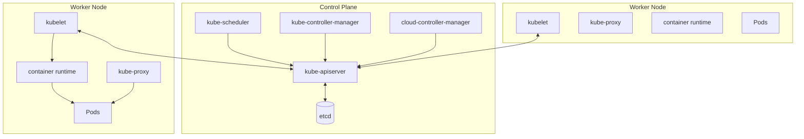
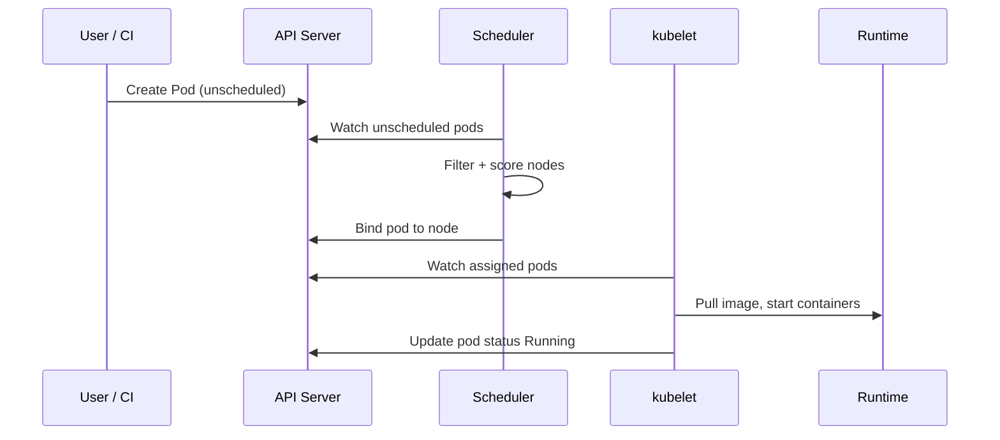
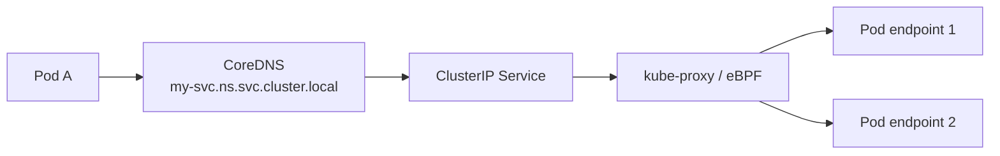

# Kubernetes Architecture

## 1. Executive Summary

**Kubernetes (K8s)** is a container orchestration platform that automates deployment, scaling, networking, and healing of containerized workloads. Its architecture splits into the **control plane** (API server, etcd, scheduler, controller managers) and **data plane** (kubelet, container runtime, CNI networking on worker nodes). Declarative **desired state** in etcd is continuously reconciled by controllers—a pattern principal architects must understand beyond `kubectl apply`.

Kubernetes is not a PaaS—it provides **primitives** (Pod, Deployment, Service, Ingress) that platform teams compose into **golden paths**. Understanding scheduling, resource limits, networking overlays, storage classes, and failure domains (zones, nodes) is essential for production architecture interviews and real multi-tenant clusters.

This chapter covers control plane mechanics, workload lifecycle, networking model, storage, security boundaries, scalability limits, and operational failure modes.

## 2. Why This Topic Matters

Kubernetes appears in nearly every cloud-native principal interview:

- What happens when a **pod dies** mid-request?
- Difference between **Deployment**, **StatefulSet**, **DaemonSet**.
- How does **Service** discovery work (ClusterIP, DNS)?
- **etcd** role and backup implications.
- **Resource requests/limits** and OOM killer behavior.
- **Multi-AZ** scheduling and pod disruption budgets.

Weak answers stop at "Kubernetes scales containers" without control loop or networking depth.

## 3. Problems Being Solved

| Problem | Kubernetes mechanism |
|---------|---------------------|
| Container placement | Scheduler scores nodes |
| Self-healing | Controllers recreate failed pods |
| Service discovery | kube-proxy + CoreDNS + Services |
| Rolling updates | Deployment strategy maxUnavailable/maxSurge |
| Config/secrets injection | ConfigMap, Secret, projected volumes |
| Horizontal scale | HPA, cluster autoscaler |
| Stateful workloads | StatefulSet + PVC + stable network ID |

K8s does **not** automatically: secure applications, optimize costs, or design microservice boundaries.

## 4. Assumptions and System Model

| Assumption | Implication |
|------------|-------------|
| **Containers are immutable units** | Config via env/volumes, not SSH |
| **etcd is source of truth** | Backup/restore critical for disaster |
| **Flat pod network** | Every pod IP reachable (CNI dependent) |
| **Partial failures common** | Nodes, zones, control plane components fail |
| **Not multi-tenant secure by default** | RBAC, NetworkPolicy, namespaces required |

**Reconciliation model:** User sets desired state → API server persists → controllers observe → actuators change world → status updated.

## 5. Essential Terminology

| Term | Definition |
|------|------------|
| **Pod** | Smallest deployable unit; one or more containers sharing network namespace |
| **Node** | Worker machine running kubelet and runtime |
| **Control plane** | Cluster management components |
| **etcd** | Distributed key-value store for cluster state |
| **kube-apiserver** | Front door to cluster state; REST API |
| **Scheduler** | Assigns pods to nodes |
| **Controller** | Reconciliation loop (Deployment, ReplicaSet, etc.) |
| **Service** | Stable virtual IP/DNS for pod set |
| **Ingress** | L7 HTTP routing into cluster |
| **CNI** | Container Network Interface plugin (Calico, Cilium, etc.) |
| **CSI** | Container Storage Interface for volumes |

## 6. Core Mechanism

### Control plane architecture



*Figure 1: API server central hub; etcd stores state; kubelet on each node runs pods.*

### Pod scheduling flow



*Figure 2: Scheduler binding is separate from kubelet execution—failures possible at each step.*

### Service networking



*Figure 3: Services provide stable DNS and virtual IP; kube-proxy or CNI implements load balancing to endpoints.*

## 7. Step-by-Step Walkthrough

**Scenario:** Deploy new version of `payment-service` with zero downtime.

| Step | Component | Action |
|------|-----------|--------|
| 1 | CI/CD | Build image `payment:v2`; push registry |
| 2 | Deployment | Update image tag in manifest |
| 3 | ReplicaSet | Creates new pods with v2 |
| 4 | Scheduler | Places pods on nodes with capacity |
| 5 | Readiness probe | New pods receive traffic only when ready |
| 6 | Rolling update | Old pods terminated per maxUnavailable |
| 7 | Service | Endpoints updated automatically |
| 8 | HPA | Scales replicas if CPU threshold exceeded |

**Pod failure recovery:**

| Event | Response |
|-------|----------|
| Container crash | kubelet restarts per restartPolicy |
| Node loss | Pods marked Terminating; controllers reschedule elsewhere |
| Zone outage | PDB may block; spread constraints matter |

**QoS classes and eviction order:**

Kubernetes classifies pods by **requests/limits** into QoS:

| QoS Class | Condition | Eviction priority |
|-----------|-----------|-------------------|
| Guaranteed | requests = limits for all containers | Last evicted |
| Burstable | Some requests set | Middle |
| BestEffort | No requests/limits | First evicted |

Production tier-1 services should be **Guaranteed** for CPU and memory on critical paths—BestEffort pods are first sacrificed under node pressure.

**Workload selection guide:**

| Workload type | K8s resource | Why |
|---------------|--------------|-----|
| Stateless API | Deployment | Rolling updates, scale-out |
| Stateful DB (if on K8s) | StatefulSet + PVC | Stable identity, ordered ops |
| Node agent (monitoring) | DaemonSet | One per node |
| Batch job | Job / CronJob | Run-to-completion |
| One-off task | Pod directly | Debugging only—not production pattern |

Running databases on Kubernetes is **controversial**—many orgs use managed RDS/Cloud SQL instead; if on K8s, operators (e.g., CloudNativePG) are mandatory.

## 8. Invariants and Guarantees

| Property | Type | Statement |
|----------|------|-----------|
| **Desired replica count** | Safety | Deployment controller maintains declared replicas |
| **Pod name uniqueness** | Safety | Unique within namespace |
| **Scheduled pod runs on one node** | Safety | Binding is exclusive |
| **Zero downtime deploy** | **Conditional** | Requires readiness probes + surge capacity |
| **Data durability on pod delete** | **Not guaranteed** | Ephemeral storage; use PVC |

## 9. Failure Scenarios

### Scenario 1: etcd data loss

**Setup:** etcd backup not tested; corruption during upgrade.

**Effect:** Cluster state loss—**catastrophic**; may require rebuild.

**Mitigation:** Regular etcd snapshots; HA etcd (3 or 5 members); restore drills.

### Scenario 2: OOMKill without limits

**Setup:** Pod without memory limit consumes node memory.

**Effect:** Node instability; eviction of innocent pods.

**Mitigation:** Set requests/limits; LimitRange defaults; monitor node pressure.

### Scenario 3: Scheduling deadlock

**Setup:** Pods require GPU; no nodes available; PDB blocks eviction.

**Effect:** Pending pods; failed deploys.

**Mitigation:** Cluster autoscaler; taints/tolerations design; capacity planning.

### Scenario 4: DNS overload

**Setup:** Thousands of services; CoreDNS undersized.

**Effect:** Intermittent service discovery failures.

**Mitigation:** Autoscale CoreDNS; node-local DNS cache.

### Scenario 5: Image pull failure

**Setup:** Registry outage during scale-up.

**Effect:** Pods stuck ImagePullBackOff.

**Mitigation:** Mirror registry; image pull secrets; cached images on nodes.

### Scenario 6: ConfigMap hot reload without rollout

**Setup:** Team updates ConfigMap expecting pods to pick up new config; apps cache config at startup only.

**Effect:** Stale configuration until manual pod restart; silent misconfiguration during incident.

**Mitigation:** Reloader sidecar or trigger rolling restart on ConfigMap change; document app reload semantics in golden path.

## 10. Performance Characteristics

| Factor | Impact |
|--------|--------|
| API server load | Grows with object count and watch clients |
| etcd latency | Affects all control operations—keep events bounded |
| CNI dataplane | eBPF (Cilium) vs iptables kube-proxy performance differs |
| Pod density per node | Limited by CPU, memory, IPAM, kubelet overhead |
| Admission webhooks | Add latency to every create—audit chain length |

Size clusters with **load tests** and control plane monitoring—not node count alone.

## 11. Scalability Limits

- Practical cluster sizes: hundreds to low thousands of nodes (vendor and version dependent).
- ~110 pods per node default max (configurable).
- etcd object count—avoid massive ConfigMaps and excessive CRDs.
- Single namespace with 10k+ services stresses DNS.
- **Verify** limits for your K8s distribution (EKS, GKE, AKS).

Very large clusters (1000+ nodes) may require **etcd defragmentation schedules** and dedicated control plane node pools—isolate control plane from workload nodes to prevent noisy neighbor impact on API server latency.

**Upgrade tip:** Always check the **Kubernetes version skew policy** before control plane upgrades—unsupported kubelet versions against new API server cause subtle admission and scheduling failures.

Interviewers expect you to mention **etcd backup restore drills** unprompted when discussing production Kubernetes—this signals operational maturity.

## 12. Operational Considerations

- **Upgrade strategy:** Control plane first, then nodes; skew policy compliance.
- **PodDisruptionBudget** for voluntary disruptions (drains, upgrades).
- **Topology spread constraints** across zones.
- **Resource quotas** per namespace/tenant.
- **Audit logging** API server access.
- **Backup:** etcd, Velero for PVs, GitOps for manifests.

**Cluster health monitoring (tier-0 alerts):**

| Signal | Warning | Critical |
|--------|---------|----------|
| API server latency p99 | >500ms | >2s |
| etcd db size | >70% quota | >85% quota |
| Pending pods | >10 for 15m | >50 for 15m |
| Node NotReady | 1 node | >1 or >10% fleet |
| Failed scheduling | Any tier-1 service | Sustained 30m |

**Node drain procedure:** `kubectl cordon` → verify PDB allows eviction → `kubectl drain --ignore-daemonsets` → upgrade/repair → `kubectl uncordon`. Skipping PDB check causes availability violation during maintenance.

## 13. Security Considerations

- **RBAC** least privilege for humans and service accounts.
- **NetworkPolicy** default deny east-west where possible.
- **Pod Security Standards** (restricted baseline).
- **Secrets encryption at rest** in etcd (KMS integration).
- **Admission control** (OPA/Gatekeeper, Kyverno) for policy.
- **No cluster-admin** for application teams.

## 14. Cost Considerations

- Over-provisioned requests block scheduling but limits affect billing in some clouds.
- Cluster autoscaler reduces idle nodes—watch scale-down delays.
- Persistent volumes and cross-AZ traffic add cost.
- Managed control plane fees (EKS/GKE/AKS) vs self-managed tradeoff.
- Right-size before adding nodes—FinOps integration.

## 15. Production Implementations

### Google Kubernetes Engine (GKE)

Autopilot mode abstracts nodes; Google operates control plane.

### Amazon EKS

Managed control plane; tight AWS integration (IAM, VPC CNI).

### Azure AKS

Managed K8s with Azure AD integration.

### Self-managed (on-prem)

Full control; team owns etcd HA, upgrades, CNI—common in regulated industries.

### Operators (Prometheus, Strimzi, etc.)

Extend K8s API for domain-specific reconciliation.

**Managed Kubernetes comparison (architect selection notes):**

| Provider | Control plane | Notable integration |
|----------|---------------|---------------------|
| EKS | AWS-managed | IAM, VPC CNI, ALB ingress |
| GKE | Google-managed | Autopilot mode, workload identity |
| AKS | Azure-managed | Azure AD, ACR |

**Autopilot/GKE vs self-managed node pools:** Autopilot abstracts node management—good for teams without dedicated K8s SRE. Tradeoff: less node-level tuning; some DaemonSets and hostPath patterns restricted. Decision depends on platform team maturity and compliance requirements.

**etcd operations reminder:** For self-managed clusters, etcd defragmentation, quota monitoring, and snapshot restore drills are **non-optional**. Managed offerings shift this burden but architects must still understand restore RTO implications.

## 16. Alternatives and Tradeoffs

| Platform | Strength | Weakness |
|----------|----------|----------|
| **Kubernetes** | Ecosystem, portability | Complexity |
| **ECS/Fargate** | AWS-native simplicity | Less portable |
| **Nomad** | Simpler scheduling | Smaller ecosystem |
| **VMs + Ansible** | Familiar ops | Slower deploy cycles |
| **Serverless** | No node management | Cold start, vendor limits |

Choose K8s when **portability**, **ecosystem**, and **multi-tenant platform** justify operational investment.

## 17. Common Misconceptions

| Misconception | Reality |
|---------------|---------|
| "K8s auto-scales apps" | HPA needs metrics; app must handle scale |
| "Pods are mini-VMs" | Shared kernel; ephemeral; co-scheduled containers |
| "Service = load balancer" | ClusterIP is internal; LB type exposes externally |
| "YAML deploy = production ready" | Probes, limits, PDBs, security required |
| "One cluster forever" | Multi-cluster common for blast radius and regions |

## 18. Principal Architect Perspective

1. **Platform team** curates golden paths—raw K8s is too low-level for most devs.
2. **Multi-AZ by default** for tier-1; spread constraints not optional.
3. **etcd backup tested quarterly**—theoretical DR is not DR.
4. **Admission policy** encodes org standards—don't rely on code review alone.
5. **Cluster per environment minimum**; multi-tenant prod requires hard isolation review.

**Multi-cluster strategy (principal-level):**

| Pattern | Use case | Tradeoff |
|---------|----------|----------|
| Cluster per env | dev/staging/prod isolation | More control planes to manage |
| Cluster per region | Data residency, latency | GitOps fan-out complexity |
| Cluster per tenant | Hard multi-tenancy | Highest isolation cost |
| Single mega-cluster | Namespace isolation | Blast radius; noisy neighbor |

For regulated industries, **cluster per environment** is minimum; production and staging must never share a cluster.

**Capacity planning formula (starting point):** `nodes_needed = ceil(total_pod_cpu_requests / (node_cpu_allocatable × target_utilization))`—adjust for DaemonSets, system reserved, and burst headroom. Verify with cluster autoscaler max limits.

Interviewers often ask about pod eviction order—remember **BestEffort first, then Burstable, then Guaranteed** under node pressure.

## 19. Architecture Review Exercise

**Scenario:** Single cluster prod+staging; no resource limits; ClusterRole cluster-admin for all devs; hostPath volumes; no NetworkPolicy.

**Review prompts:**

1. Blast radius of staging bug?
2. Node OOM risk?
3. Security posture?
4. Remediation priority?

**Expected findings:** Split clusters; LimitRange; RBAC reduction; PVC instead hostPath; NetworkPolicy default deny.

## 20. Whiteboard Explanation

**90-second version:**

> "Kubernetes separates control plane from workers. etcd stores desired state; API server is the hub; scheduler binds pods to nodes; controllers reconcile Deployments and Services. kubelet on each node runs containers via containerd or similar. Pods are ephemeral—use Deployments for stateless, StatefulSets for stable identity with PVCs. Services give stable DNS to pod IPs via kube-proxy or eBPF CNI. Rolling updates use readiness probes so traffic shifts only to healthy pods. PDBs protect during node drains. Failures: node loss reschedules pods; etcd loss is catastrophic—backup matters. Platform teams add ingress, secrets, quotas, and GitOps on top of these primitives."

**Extended principal addendum:** Connect K8s to **business SLOs**—three replicas across three AZs is the minimum starting point for tier-1, not the finish line. Mention probes, limits, and PDBs whenever discussing "run on Kubernetes."

## 21. Interview Questions

1. **Control plane components?**
   - *Signals:* API server, etcd, scheduler, controller managers.

2. **Pod vs container?**
   - *Signals:* Pod wraps containers sharing network/IP.

3. **Deployment vs StatefulSet?**
   - *Signals:* Stable identity, ordered deploy, PVC per pod.

4. **How Service routes traffic?**
   - *Signals:* Endpoints, kube-proxy/CNI, ClusterIP DNS.

5. **Readiness vs liveness probe?**
   - *Signals:* Ready receives traffic; live restarts if fail.

6. **etcd role?**
   - *Signals:* Cluster state persistence; backup critical.

7. **Resource requests vs limits?**
   - *Signals:* Schedule vs cap; OOM at limit.

8. **PodDisruptionBudget purpose?**
   - *Signals:* Min available during voluntary disruption.

9. **What is CNI?**
   - *Signals:* Pod networking plugin; IP assignment.

10. **Node failure behavior?**
    - *Signals:* Pods evicted; controllers reschedule.

11. **HPA requirements?**
    - *Signals:* Metrics server; resource or custom metrics.

12. **Multi-AZ scheduling?**
    - *Signals:* Topology spread; anti-affinity across zones.

13. **Cluster autoscaler prerequisites?**
    - *Signals:* Resource requests set; node group tags; scale-down delays.

14. **When use Job vs CronJob?**
    - *Signals:* One-off/batch vs scheduled; completion semantics.

15. **etcd defragmentation why?**
    - *Signals:* Reclaim space after deletes; plan maintenance window.

**Scoring rubric:**

| Dimension | Strong | Weak |
|-----------|--------|------|
| Architecture | CP/DP, reconciliation | "Runs Docker" |
| Failure | etcd, OOM, scheduling | Ignores limits |
| Production | Probes, PDB, RBAC | YAML only |

## 22. Interview Follow-Ups

1. **Custom Resource Definitions use case?**
   - *Signals:* Operators extend API for databases, queues.

2. **Host network pods when?**
   - *Signals:* Rare—CNI plugins, monitoring; security implications.

3. **EKS vs self-managed tradeoff?**
   - *Signals:* Managed CP vs control; compliance, cost.

4. **Vertical vs horizontal pod scaling?**
   - *Signals:* VPA for rightsizing; HPA for load; stateful often vertical first.

5. **When cordon node vs drain immediately?**
   - *Signals:* Cordon prevents new pods; drain evicts existing—sequence matters in incidents.

## 23. Strong Answer Example

**Question:** "Design K8s deployment for stateless API with 99.9% availability."

> "Deployment with min 3 replicas across 3 AZs using topologySpreadConstraints. Resource requests from load test; limits prevent OOM. Readiness HTTP `/health/ready` including DB check; liveness lighter. PDB minAvailable 2 during node upgrades. HPA on CPU 70% and custom request-rate metric. ClusterIP Service fronting pods; Ingress with ALB and WAF north-south. NetworkPolicy allow ingress from ingress namespace only. Secrets from External Secrets Operator synced from AWS Secrets Manager. Rolling update maxSurge 1 maxUnavailable 0. GitOps Argo CD for manifests. etcd backup and Velero for config. Monitor API server latency and scheduling pending pods."

## 24. Weak Answer Example

**Question:** "Design K8s deployment for stateless API."

> "Create a Deployment yaml with 3 replicas and a Service."

**Why weak:** No zones, probes, PDB, security, scaling, or ops.

### Additional strong answer

**Question:** "Node keeps going NotReady—how do you investigate?"

> "Check `kubectl describe node` for conditions: MemoryPressure, DiskPressure, PIDPressure, NetworkUnavailable. SSH or SSM to node: disk full on `/var` stops kubelet—clean images with `crictl`. Review kubelet logs for certificate expiry or CNI errors. If NotReady after upgrade, verify kubelet version skew within supported range. Check instance status in cloud console—underlying hardware failure. Cordon node to prevent new scheduling; drain workloads if hardware bad. If fleet-wide, suspect control plane or CNI outage—not individual node. Document in postmortem if pattern affects multiple nodes—may need AMI or kernel patch."

## 25. Hands-On Exercise

1. Deploy sample app with Deployment + Service on minikube/kind.
2. Add readiness probe; observe rolling update traffic shift.
3. Set memory limit low; trigger OOMKill; read events.
4. Apply NetworkPolicy deny-all then allow ingress.
5. Simulate node drain; watch PDB behavior.
6. Snapshot etcd (if self-managed) and document restore steps.
7. Install metrics-server; configure HPA.
8. Simulate node failure by draining worker; measure pod reschedule time against tier-1 RTO target.
9. Apply PodSecurity restricted profile to namespace; fix violating manifests.
10. Design multi-cluster strategy document for dev/staging/prod with GitOps promotion flow.

## 26. Knowledge Check

1. Cluster state store? *(etcd.)*
2. Schedules pods? *(kube-scheduler.)*
3. Readiness probe effect? *(Traffic only when ready.)*
4. StatefulSet for? *(Stable identity + persistent storage.)*
5. PDB protects? *(Voluntary disruptions during maintenance.)*
6. QoS Guaranteed requires? *(requests = limits for all containers.)*
7. Cordon vs drain? *(Cordon blocks new; drain evicts existing.)*
8. etcd backup test frequency? *(Quarterly restore drills recommended.)*
9. ClusterIP scope? *(Internal cluster only.)*
10. DaemonSet use case? *(One pod per node agent.)*

## 27. Flashcards

| # | Front | Back |
|---|-------|------|
| 1 | Pod | Smallest K8s deploy unit; shared network. |
| 2 | etcd | Distributed store for cluster state. |
| 3 | kube-apiserver | API front door to cluster. |
| 4 | Deployment | Manages stateless replicated pods. |
| 5 | StatefulSet | Stable pod identity and storage. |
| 6 | Service | Stable network endpoint for pods. |
| 7 | CNI | Container networking plugin. |
| 8 | kubelet | Node agent running containers. |
| 9 | PDB | Limits voluntary pod disruption. |
| 10 | HPA | Horizontal Pod Autoscaler. |

## 28. Cheat Sheet

```
CONTROL PLANE
  API server ↔ etcd
  Scheduler, Controllers

WORKLOAD
  Deployment — stateless
  StatefulSet — state + stable ID
  DaemonSet — per node

NETWORKING
  Pod IP (CNI)
  Service ClusterIP + DNS
  Ingress — L7 external

PRODUCTION MUST-HAVES
  requests/limits
  readiness + liveness
  PDB, multi-AZ spread
  RBAC, NetworkPolicy

FAILURES
  Node loss → reschedule
  etcd loss → disaster
  OOM → set limits
```

## 29. Related Concepts

- [Platform Engineering and GitOps](/docs/kubernetes-and-platform-engineering/platform-engineering-and-gitops) — delivery on K8s
- [Service Mesh and Sidecars](/docs/microservices/service-mesh-and-sidecars) — L7 on K8s
- [Observability Fundamentals](/docs/observability/observability-fundamentals) — K8s metrics/traces
- [Resilience Patterns](/docs/microservices/resilience-patterns) — app-level on K8s
- [Multi-Region Architecture](/docs/cloud-architecture/multi-region-architecture) — cluster geography
- [Cloud Cost Optimization](/docs/cost-and-finops/cloud-cost-optimization) — K8s cost tuning

Kubernetes is the foundation for microservices platforms, service meshes, GitOps delivery, and observability stacks covered elsewhere in this curriculum—master control plane mechanics before advancing to platform engineering patterns.

## 30. References

### Primary sources

- Kubernetes Documentation — [Components](https://kubernetes.io/docs/concepts/overview/components/), [Scheduling](https://kubernetes.io/docs/concepts/scheduling-eviction/).
- Burns, B., Beda, D. (2019). *Kubernetes: Up and Running*, 2nd ed. O'Reilly.

### Engineering blogs

- Google Borg paper (2015) — conceptual ancestor—**historical context**.
- CNCF Kubernetes conformance and security whitepapers.

### Distinction

| Claim type | Source |
|------------|--------|
| Component architecture | Official K8s docs |
| Scale limits | Distribution-specific—verify EKS/GKE docs |
| Borg relationship | Academic/industry papers |
