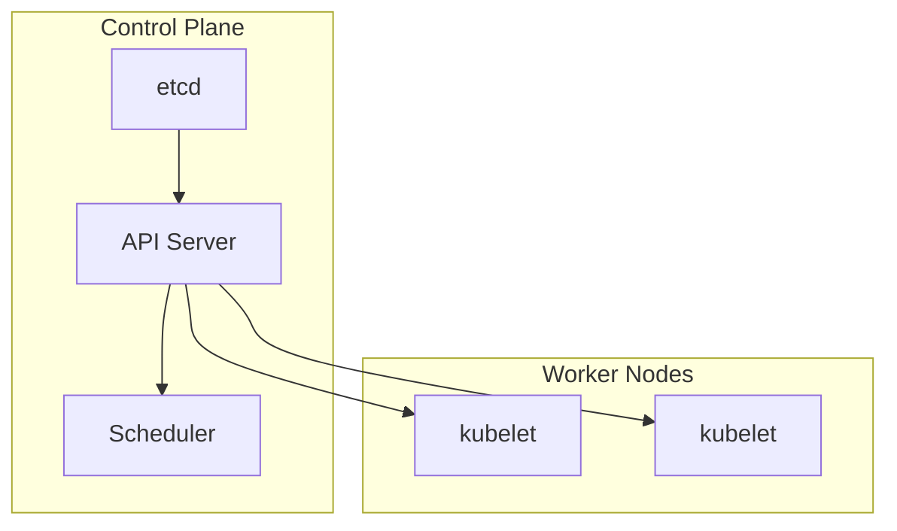

# Kubernetes and Platform Engineering

K8s control plane, GitOps, platform engineering, and golden paths.

*Figure: Kubernetes control plane and worker node architecture.*

## Chapters

| Chapter | Focus |
|---------|-------|
| Kubernetes Architecture | [Kubernetes Architecture](/docs/kubernetes-and-platform-engineering/kubernetes-architecture) |
| Platform Engineering and GitOps | [Platform Engineering and GitOps](/docs/kubernetes-and-platform-engineering/platform-engineering-and-gitops) |

## Learning Path

1. Start with **Kubernetes Architecture** for control plane, scheduling, networking, and storage.
2. Finish with **Platform Engineering and GitOps** for internal developer platforms and delivery pipelines.

## Related Domains

- [Cloud Architecture](/docs/cloud-architecture/overview)
- [Observability](/docs/observability/overview)

Return to the [Curriculum Overview](/docs/start-here/curriculum-overview) to see how this domain fits the learning path.
