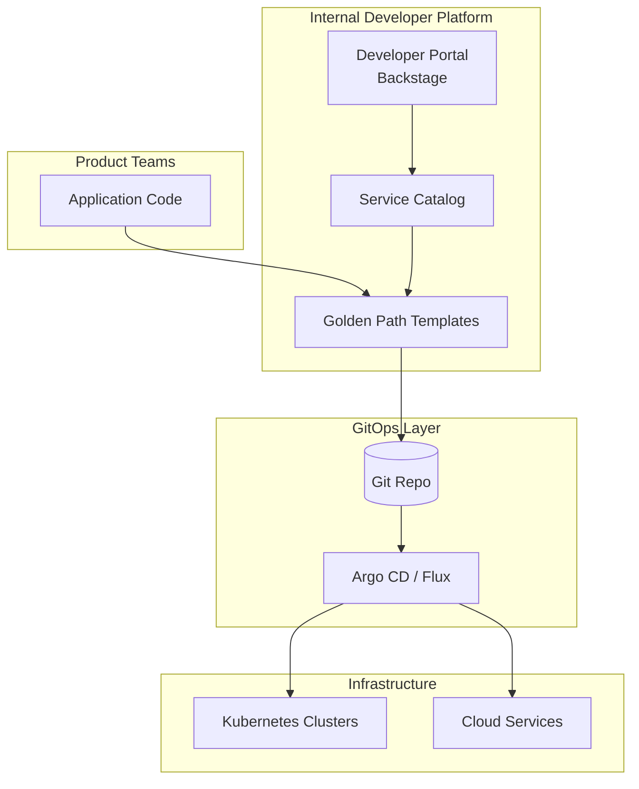
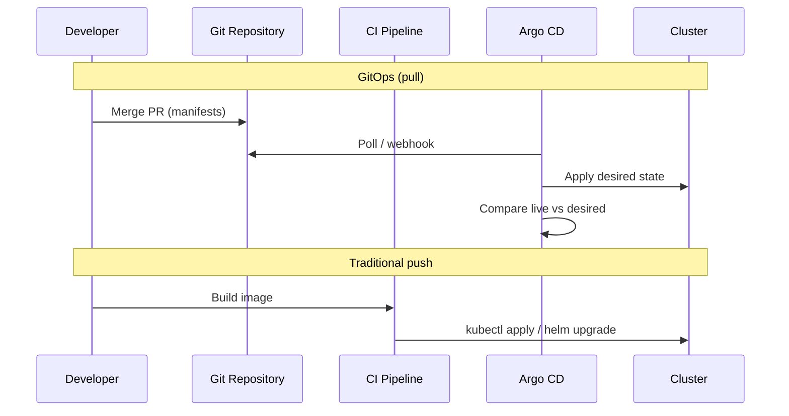
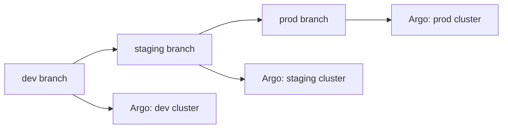

# Platform Engineering and GitOps

## 1. Executive Summary

**Platform engineering** builds **Internal Developer Platforms (IDPs)** that provide self-service **golden paths**—opinionated, supported workflows for deploying, observing, and securing applications without every product team reinventing Kubernetes, CI/CD, and cloud primitives. **GitOps** extends Git as the **single source of truth** for desired infrastructure and application state: changes flow through pull request review, automated sync (e.g., **Argo CD**, **Flux**), and continuous reconciliation.

The platform team's product is **developer experience** measured by lead time, deployment frequency, and cognitive load—not raw cluster uptime alone. Principal architects balance **standardization** (guardrails) with **team autonomy** (escape hatches documented in ADRs).

This chapter covers IDP capabilities, GitOps mechanics, golden path design, platform team topology, metrics (DORA, SPACE), and anti-patterns (ticket-driven ops, snowflake clusters).

## 2. Why This Topic Matters

Organizations at scale hit **Kubernetes complexity wall**—platform engineering is the organizational response interviewers probe:

- Difference between **platform team** and **classic DevOps**.
- **GitOps vs CI/CD push** deploy models.
- What belongs in **golden path** vs self-service advanced.
- **Developer portal** (Backstage) role.
- Measuring platform success—not vanity uptime.

Weak answers conflate "we use Terraform" with having a platform product.

## 3. Problems Being Solved

| Problem | Platform / GitOps response |
|---------|---------------------------|
| Every team builds own K8s manifests | Curated templates and modules |
| Configuration drift | GitOps reconciliation |
| Slow onboarding | Self-service environment provisioning |
| Inconsistent security | Policy-as-code in pipeline and admission |
| Ops bottlenecks | Self-service within guardrails |
| Audit requirements | PR history for all infra changes |

Platform engineering does **not** remove need for **application architecture** or **SRE ownership** of production incidents.

## 4. Assumptions and System Model

| Assumption | Implication |
|------------|-------------|
| **Developers are customers** | Platform needs product management |
| **Git is auditable** | PR review replaces manual change tickets |
| **Reconciliation handles drift** | Manual kubectl changes reverted or flagged |
| **Multi-cluster/multi-env normal** | Promotion flows env → staging → prod |
| **Conway's Law applies** | Platform team interfaces with product teams |

**GitOps loop:** Developer merges PR → Git updated → operator detects diff → applies to cluster → reports sync status.

## 5. Essential Terminology

| Term | Definition |
|------|------------|
| **IDP** | Internal Developer Platform—self-service tooling layer |
| **Golden path** | Default supported way to build and deploy |
| **GitOps** | Git-driven declarative operations with reconciliation |
| **Argo CD / Flux** | GitOps continuous delivery controllers |
| **Backstage** | CNCF developer portal framework |
| **Platform team** | Team building capabilities for other engineers |
| **Thinnest viable platform** | Minimum platform scope that reduces pain (Team Topologies) |
| **Pull-based deploy** | Cluster pulls desired state vs CI pushing kubectl |
| **App of Apps** | Argo pattern bootstrapping multiple applications |
| **Policy as code** | OPA, Kyverno enforcing standards automatically |

## 6. Core Mechanism

### Platform layer cake



*Figure 1: Developers consume golden paths; GitOps reconciles declared state to clusters.*

### GitOps pull vs push



*Figure 2: GitOps separates build (CI) from deploy reconcile (CD operator)—cluster credentials stay in cluster.*

### Environment promotion



*Figure 3: Branch or overlay per environment with promotion via PR—not manual kubectl.*

## 7. Step-by-Step Walkthrough

**Scenario:** New microservice onboarded to platform golden path.

| Step | Actor | Action |
|------|-------|--------|
| 1 | Developer | Scaffold from Backstage template (`service-node-k8s`) |
| 2 | Platform | Template includes Dockerfile, Helm chart, CI workflow |
| 3 | Developer | Implements business logic; opens PR |
| 4 | CI | Runs tests, builds image, updates image tag in Git |
| 5 | Argo CD | Syncs dev cluster automatically |
| 6 | Developer | Promotes to staging via PR to staging overlay |
| 7 | Approval | Prod PR requires platform + security review |
| 8 | Argo CD | Sync prod with sync windows and manual approval optional |

**Drift detection:** Engineer kubectl patches prod → Argo shows OutOfSync → auto-heal or alert per policy.

**DORA metrics for platform teams:**

| Metric | Definition | Platform impact |
|--------|------------|-----------------|
| Deployment frequency | How often code reaches prod | Golden path reduces friction |
| Lead time for changes | Commit to prod duration | Template + GitOps shortens |
| Mean time to restore | Recovery from incident | Standardized rollbacks |
| Change failure rate | % deploys causing failure | Policy gates reduce |

Platform investments should show measurable DORA improvement within two quarters—or revisit scope.

**Terraform + GitOps boundary:**

| Tool | Owns | GitOps operator owns |
|------|------|---------------------|
| Terraform | VPC, IAM, RDS, EKS cluster | — |
| Argo CD | — | In-cluster Deployments, Services, ConfigMaps |
| Crossover | Helm releases of cluster add-ons | Platform team documents split |

Blurring this boundary causes **state conflicts**—document who owns cluster-level vs app-level resources.

## 8. Invariants and Guarantees

| Property | Type | Statement |
|----------|------|-----------|
| **Git declared state** | Safety | Approved PR content is intended production state |
| **Reconciliation** | Liveness | Operator continuously drives toward desired state |
| **Self-service within policy** | Safety | Admission and CI gates block non-compliant deploys |
| **Instant developer freedom** | **Not guaranteed** | Golden path constraints intentional |
| **Zero platform team** | **Not realistic** | Someone owns upgrades and incidents |

## 9. Failure Scenarios

### Scenario 1: GitOps sync blast

**Setup:** Bad YAML merged to prod branch; auto-sync enabled.

**Effect:** Broken deployment cluster-wide.

**Mitigation:** PR checks (kubeval, conftest); manual sync prod; canary analysis integrations.

### Scenario 2: Platform becomes bottleneck

**Setup:** Every change requires platform ticket.

**Effect:** Shadow IT; teams bypass platform.

**Mitigation:** Self-service templates; documented escape hatches; product mindset.

### Scenario 3: Secret in Git

**Setup:** Developer commits plaintext API key.

**Effect:** Credential leak; history permanent.

**Mitigation:** Sealed Secrets, External Secrets, secret scanning in PR.

### Scenario 4: Template sprawl

**Setup:** 40 slightly different golden path templates.

**Effect:** Maintenance nightmare; inconsistent security.

**Mitigation:** Consolidate; parameterize; deprecate variants.

### Scenario 5: Drift ignored

**Setup:** Auto-sync disabled; manual hotfixes accumulate.

**Effect:** Git no longer source of truth—GitOps theater.

**Mitigation:** Enforce sync policy; incident hotfix must backport to Git.

### Scenario 6: Argo CD sync during control plane degradation

**Setup:** API server throttling during etcd issue; Argo sync retries aggressively across 200 applications.

**Effect:** Amplified control plane load; prolonged cluster outage.

**Mitigation:** Sync rate limits; exponential backoff in Argo; defer bulk sync until etcd healthy; maintenance windows for mass updates.

## 10. Performance Characteristics

| Factor | Impact |
|--------|--------|
| Argo sync frequency | API server load on large app counts |
| Helm chart complexity | Render time; use values layering |
| CI pipeline duration | Developer flow feedback loop |
| Portal cold start | Template scaffolding speed affects DX |
| Multi-cluster sync | Parallelism and failure isolation |

Optimize **developer lead time**—platform KPI—not just sync milliseconds.

## 11. Scalability Limits

- Argo CD application count—shard by team or cluster.
- Git monorepo vs polyrepo—tradeoffs for blast radius and permissions.
- Backstage plugin ecosystem maintenance.
- Platform team size vs supported engineer ratio (often 1:10–1:30—**anecdotal**, verify org).

When supporting more than ~100 engineering teams, consider **federated GitOps**—separate Argo CD instances per business unit with shared policy baselines—to prevent a single control plane becoming an organizational bottleneck.

Platform success is measured in **developer NPS and lead time**, not tickets closed or clusters managed.

Golden path templates should include **observability, security, and cost tags by default**—optional add-ons become skipped in practice under delivery pressure.

Platform teams that only build infrastructure without **developer experience research** consistently overbuild unused capabilities.

Measure **time-to-first-deploy** for new engineers as the north star platform metric—it captures template quality, documentation, and friction better than raw cluster uptime.

GitOps without **policy-as-code admission** allows non-compliant workloads through the golden path—OPA/Kyverno gates are part of the platform product, not optional security extras.

Terraform provisions cloud foundation; Argo CD reconciles cluster desired state—the boundary must be documented to prevent duplicate ownership conflicts.

Backstage software templates should version semver and include automated tests that verify scaffolded services pass policy checks.

## 12. Operational Considerations

- **Upgrade cadence** for Argo, Flux, Backstage, cluster versions.
- **Disaster recovery:** Git is backup; restore Argo config and cluster bootstrap.
- **On-call rotation** for platform tier-0 services.
- **Deprecation policy** for template versions.
- **Documentation as product**—runbooks linked from portal.
- **Feedback loops** with developer surveys and DORA metrics.

**Platform on-call tier definitions:**

| Tier | Components | Response SLA |
|------|------------|--------------|
| P0 | Argo CD, cluster API, ingress | 15 min page |
| P1 | Backstage, CI runners, registry | 1 hour |
| P2 | Template bugs, doc issues | Next business day |

**Template versioning:** Golden path templates use semver; breaking template changes require migration guide and 90-day overlap of old template version. Teams scaffolded on `service-template@v1` must not break when `v2` releases.

## 13. Security Considerations

- **RBAC** in Git and cluster—who can merge prod?
- **Signed commits** and branch protection.
- **OPA/Gatekeeper** policies in admission and CI.
- **SBOM** and image scanning in golden path CI.
- **Least privilege** for Argo CD service accounts per cluster.

## 14. Cost Considerations

- Platform team headcount is **real cost**—justify with reduced toil and faster delivery.
- Non-production environment sprawl from easy self-service—TTL and quotas.
- Shared clusters reduce overhead vs cluster per team.
- FinOps tagging enforced in templates.

## 15. Production Implementations

### Spotify Backstage

Widely adopted portal pattern; catalog and scaffolding.

### Argo CD (Intuit, many enterprises)

GitOps reference implementation; ApplicationSet for multi-cluster.

### Humanitec / Port (commercial IDPs)

Higher-level abstraction over K8s—**vendor implementations**.

### Team Topologies

Organizational pattern: platform as enabling team—book by Skelton & Pais.

**Real-world GitOps adoption timeline (typical enterprise):**

| Quarter | Milestone |
|---------|-----------|
| Q1 | Single Argo CD on dev cluster; 2 pilot teams |
| Q2 | Staging + prod; revoke direct kubectl prod |
| Q3 | ApplicationSet multi-cluster; OPA policies |
| Q4 | Backstage portal; DORA metrics baseline comparison |

Rushing Q4 before Q2 governance creates **GitOps theater**—Git declared but kubectl hotfixes remain norm.

**Flux vs Argo CD (high-level):** Flux is controller-native, GitOps Toolkit modular; Argo CD has richer UI and application-centric model. Both are CNCF graduated—choice often depends on team preference for UI and multi-cluster patterns. **Implementation choice**, not architectural right/wrong.

## 16. Alternatives and Tradeoffs

| Model | Strength | Weakness |
|-------|----------|----------|
| **GitOps** | Auditability, drift detection | Learning curve; secret handling care |
| **CI push deploy** | Familiar | Cluster creds in CI; drift |
| **PaaS (Heroku-style)** | Simple DX | Less control |
| **Ticket-driven ops** | Gatekeeping | Slow; shadow IT |
| **No platform** | Low upfront | Repeated pain per team |

Mature orgs converge on **platform + GitOps** at K8s scale.

## 17. Common Misconceptions

| Misconception | Reality |
|---------------|---------|
| "GitOps replaces CI" | CI builds/tests; GitOps deploys manifests |
| "Platform team does all ops" | Product teams still own service SLOs |
| "Golden path = no freedom" | Escape hatches with ADR accountability |
| "Backstage is required" | Portal optional; GitOps core |
| "Terraform is GitOps alone" | Need reconciliation loop to live state |

## 18. Principal Architect Perspective

1. **Treat platform as product** with roadmap and developer interviews.
2. **Thinnest viable platform** first—expand on measured pain.
3. **GitOps for cluster state**; Terraform for cloud foundation—complementary.
4. **Measure DORA metrics** before/after platform investments.
5. **Team Topologies:** platform enables; stream-aligned teams deliver features.

**Developer portal capabilities (Backstage-style):**

| Plugin | Value to developers |
|--------|---------------------|
| Service catalog | Find owners, docs, dependencies |
| Software templates | Golden path scaffolding |
| TechDocs | Docs-as-code beside repo |
| Kubernetes plugin | Pod status from portal |
| Cost plugin | Showback per service (FinOps integration) |

Portal without **maintained templates** becomes stale directory—product-manage it like customer-facing UI.

**Organizational metric:** Track **percentage of deploys via golden path** vs escape hatch—if escape hatch exceeds 20%, platform is failing its customers or scope is wrong.

Platform teams that measure only infrastructure uptime miss their true product metric: **developer productivity and satisfaction**.

## 19. Architecture Review Exercise

**Scenario:** 50 teams, no templates, kubectl prod access widespread, Terraform local apply, no drift detection.

**Review prompts:**

1. Audit trail for prod changes?
2. Onboarding time for new service?
3. 12-month platform roadmap priorities?

**Expected findings:** GitOps adoption, revoke direct prod kubectl, Backstage templates, policy gates, platform team charter.

## 20. Whiteboard Explanation

**90-second version:**

> "Platform engineering productizes infrastructure for developers—golden paths that scaffold a service with CI, K8s manifests, observability, and security baked in. GitOps means Git is the desired state source; Argo CD or Flux continuously reconciles clusters to match, detecting drift. Developers merge PRs; operators sync—credentials don't leave the cluster. This separates build from deploy and gives audit history. Platform team is an enabling team measuring success by developer lead time and reduced toil—not tickets closed. Complement with developer portal for discovery and templates. Avoid becoming a bottleneck—self-service within policy via OPA and admission control."

**Extended principal addendum:** Name **Team Topologies** explicitly in interviews—platform as enabling team, stream-aligned teams owning features. This organizational vocabulary signals principal-level systems thinking beyond tooling.

## 21. Interview Questions

1. **Platform engineering vs DevOps?**
   - *Signals:* Productized self-service vs embedded generalists.

2. **GitOps definition?**
   - *Signals:* Git source of truth; pull reconcile; drift detection.

3. **Golden path purpose?**
   - *Signals:* Opinionated default; security and consistency.

4. **Argo CD vs Flux?**
   - *Signals:* Both GitOps; UI, ecosystem differences—**implementation choice**.

5. **Push vs pull deploy security?**
   - *Signals:* Pull keeps cluster creds off CI.

6. **Backstage role?**
   - *Signals:* Catalog, docs, scaffolding—not runtime.

7. **Platform team metrics?**
   - *Signals:* DORA, lead time, developer satisfaction.

8. **Escape hatch policy?**
   - *Signals:* ADR required; not default path.

9. **Secret management in GitOps?**
   - *Signals:* External Secrets, Sealed Secrets—not plaintext.

10. **Thinnest viable platform?**
    - *Signals:* Team Topologies; start minimal.

11. **Drift handling?**
    - *Signals:* Auto-sync vs manual; hotfix backport.

12. **Multi-cluster GitOps?**
    - *Signals:* ApplicationSet, env branches/overlays.

13. **Progressive delivery with GitOps?**
    - *Signals:* Argo Rollouts, Flagger; analysis templates.

14. **Platform team size ratio?**
    - *Signals:* Enabling team; anecdotal 1:10–30 engineers—verify org.

15. **Escape hatch example?**
    - *Signals:* Non-K8s workload with ADR; documented support boundary.

**Scoring rubric:**

| Dimension | Strong | Weak |
|-----------|--------|------|
| GitOps depth | Pull, reconcile, drift | "Use Git" vague |
| Org design | Enabling team, golden path | Platform as gatekeeper |
| Security | Secrets, policy, RBAC | Git plaintext secrets |

## 22. Interview Follow-Ups

1. **Monorepo vs polyrepo for GitOps?**
   - *Signals:* Permissions, blast radius, tooling.

2. **Canary with GitOps?**
   - *Signals:* Argo Rollouts, Flagger, progressive delivery.

3. **When NOT GitOps?**
   - *Signals:* Legacy non-declarative systems; gradual adoption.

4. **How handle secrets rotation with GitOps?**
   - *Signals:* External Secrets Operator; no plaintext in Git; automatic sync to cluster.

5. **Platform team burnout signals?**
   - *Signals:* Ticket queue growth; shadow IT; template abandonment—scale team or reduce scope.

## 23. Strong Answer Example

**Question:** "We're scaling to 100 engineers on EKS—what platform investment?"

> "I'd charter a platform team as enabling team—start with thinnest viable platform: one golden path template (Node or Java) producing Helm chart, GitHub Actions CI, Argo CD to dev/staging/prod overlays. Backstage catalog for service discovery and ownership. OPA policies: require resource limits, probes, and label taxonomy. Revoke direct prod kubectl—GitOps PR only with CODEOWNERS. External Secrets for AWS Secrets Manager. Measure baseline DORA metrics; target 50% reduction in lead time for new services in 6 months. Escape hatch via ADR for non-K8s workloads. Platform on-call for Argo and cluster upgrades; product teams own app SLOs."

## 24. Weak Answer Example

**Question:** "We're scaling to 100 engineers on EKS."

> "Hire DevOps engineers to help teams with Kubernetes."

**Why weak:** No product model, GitOps, self-service, or metrics.

### Additional strong answer

**Question:** "Developers complain platform is too slow—lead time 2 weeks for new service. Fix?"

> "Measure where time goes: template scaffold minutes vs approval queues vs manual infra tickets. If tickets dominate, expand self-service: Backstage template provisions repo, CI, Argo app, namespace, and IAM via Terraform module—PR auto-merges for dev. Prod still needs review but staging is instant. Add service catalog so teams discover existing APIs instead of rebuilding. Survey developers for top 3 pain points quarterly. Target: new service to dev deploy <4 hours for golden path. Escape hatch for non-standard needs stays available with ADR—not blocking the 80% case."

## 25. Hands-On Exercise

1. Bootstrap kind cluster with Argo CD.
2. Create Git repo with sample app Helm chart.
3. Configure Argo Application auto-sync to dev.
4. Introduce intentional drift; observe OutOfSync.
5. Add OPA policy denying containers without limits.
6. Scaffold Backstage software template (or document equivalent).
7. Document promotion PR flow dev → prod.
8. Implement OPA policy denying Deployments without resource limits; verify CI rejection.
9. Measure developer lead time before/after golden path template for one pilot team.
10. Write platform team charter including DORA targets, on-call tiers, and escape hatch ADR process.

## 26. Knowledge Check

1. GitOps source of truth? *(Git repository.)*
2. Pull vs push deploy? *(Cluster operator pulls manifests.)*
3. Golden path? *(Default supported workflow.)*
4. Argo CD purpose? *(Continuous GitOps reconciliation.)*
5. Platform team type in Team Topologies? *(Enabling team.)*
6. Drift in GitOps? *(Live state differs from Git.)*
7. Sealed Secrets purpose? *(Encrypt secrets for Git storage.)*
8. ApplicationSet use? *(Multi-cluster app deployment.)*
9. Golden path without templates? *(Platform becomes bottleneck.)*
10. CI vs GitOps split? *(CI builds; GitOps deploys manifests.)*

## 27. Flashcards

| # | Front | Back |
|---|-------|------|
| 1 | Platform engineering | Building IDP for developer self-service. |
| 2 | GitOps | Declarative ops with Git as truth source. |
| 3 | Golden path | Opinionated default build/deploy workflow. |
| 4 | Argo CD | GitOps continuous delivery controller. |
| 5 | IDP | Internal Developer Platform. |
| 6 | Backstage | Developer portal and service catalog. |
| 7 | Reconciliation | Drive live state toward Git desired state. |
| 8 | Drift | Live cluster differs from Git declaration. |
| 9 | Thinnest viable platform | Minimum effective platform scope. |
| 10 | Policy as code | Automated compliance (OPA, Kyverno). |

## 28. Cheat Sheet

```
PLATFORM PRODUCT
  Golden path templates
  Service catalog / portal
  Self-service within guardrails
  Metrics: DORA, DX surveys

GITOPS
  PR → merge → Argo sync → cluster
  Drift detection + auto-heal policy
  Secrets: External/Sealed—not plain Git

TEAM TOPOLOGIES
  Stream-aligned — deliver features
  Platform — enable via IDP
  Complicated-subsystem — specialists

ANTI-PATTERNS
  Ticket-driven every deploy
  40 snowflake templates
  GitOps without auto-sync discipline
  Platform as approval bottleneck
```

## 29. Related Concepts

- [Kubernetes Architecture](/docs/kubernetes-and-platform-engineering/kubernetes-architecture) — platform foundation
- [Architecture Decision Records](/docs/architecture-leadership/architecture-decision-records) — escape hatch documentation
- [Security Architecture Fundamentals](/docs/security/security-architecture-fundamentals) — policy in platform
- [Observability Fundamentals](/docs/observability/observability-fundamentals) — golden path observability
- [Cloud Cost Optimization](/docs/cost-and-finops/cloud-cost-optimization) — FinOps in templates
- [SLOs, SLIs, and Error Budgets](/docs/reliability-and-resilience/slo-sli-error-budgets) — platform SLOs

Platform engineering succeeds when golden paths, GitOps reconciliation, and developer portal discovery work together—no single tool delivers Internal Developer Platform outcomes in isolation.

## 30. References

### Primary sources

- Skelton, M., & Pais, M. (2019). *Team Topologies.* IT Revolution — platform team patterns.
- Weaveworks — GitOps Principles — [opengitops.dev](https://opengitops.dev/).
- Argo CD Documentation — [argo-cd.readthedocs.io](https://argo-cd.readthedocs.io/).

### Engineering blogs

- Spotify Backstage — [backstage.io](https://backstage.io/docs/overview/what-is-backstage).
- Puppet State of DevOps / DORA metrics — industry benchmarks (**verify current report year**).

### Distinction

| Claim type | Source |
|------------|--------|
| GitOps principles | OpenGitOps, Weaveworks |
| Team Topologies | Skelton & Pais book |
| Tool-specific behavior | Argo/Flux/Backstage docs — **implementation choices** |
